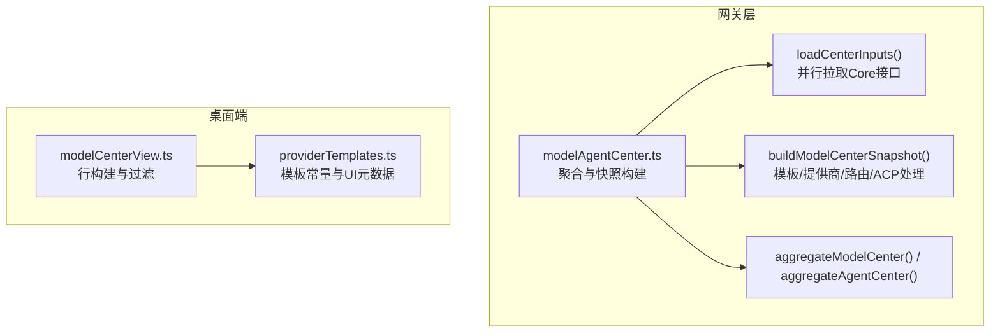
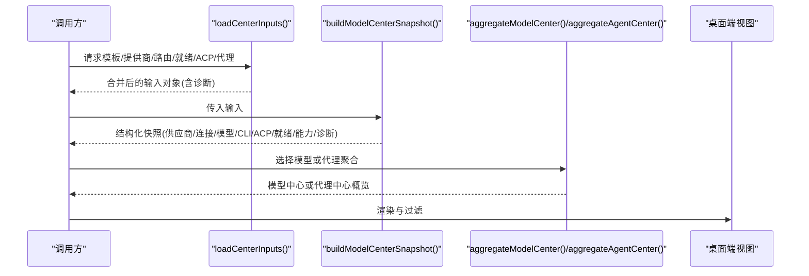
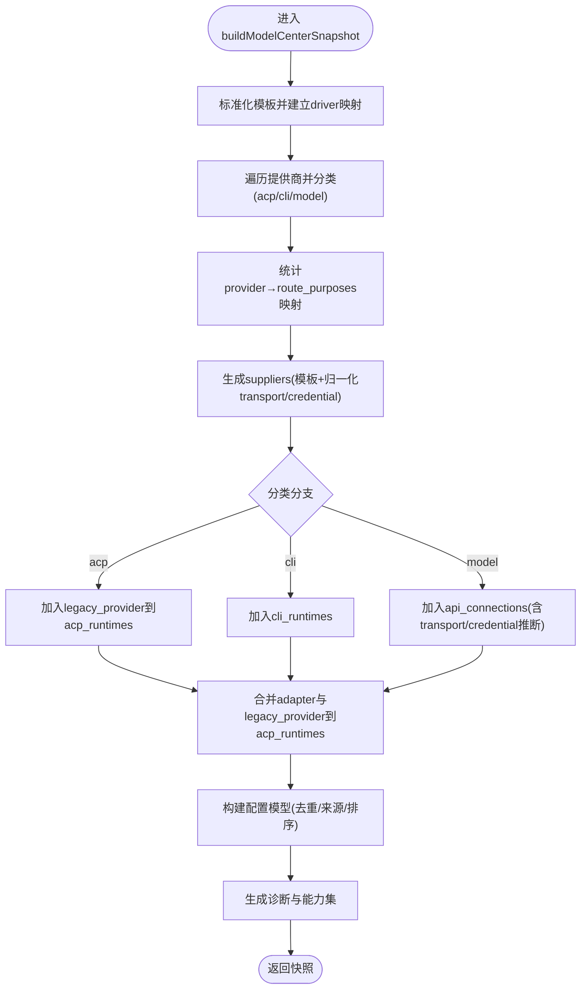
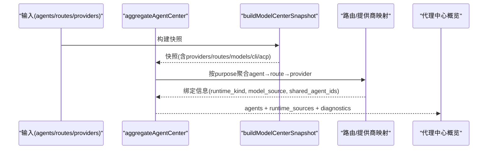

# 数据聚合引擎

<cite>
**本文引用的文件**   
- [modelAgentCenter.ts](file://TinadecGateway/src/modelAgentCenter.ts)
- [modelAgentCenter.test.ts](file://TinadecGateway/src/modelAgentCenter.test.ts)
- [modelCenterView.ts](file://apps/desktop/src/modelCenterView.ts)
- [providerTemplates.ts](file://apps/desktop/src/providerTemplates.ts)
</cite>

## 目录
1. [简介](#简介)
2. [项目结构](#项目结构)
3. [核心组件](#核心组件)
4. [架构总览](#架构总览)
5. [详细组件分析](#详细组件分析)
6. [依赖关系分析](#依赖关系分析)
7. [性能考量](#性能考量)
8. [故障排查指南](#故障排查指南)
9. [结论](#结论)
10. [附录：自定义聚合规则实现指南](#附录自定义聚合规则实现指南)

## 简介
本文件面向“数据聚合引擎”，聚焦以下目标：
- 深入解析 buildModelCenterSnapshot 的核心算法，包括模板处理、提供商分类、路由映射与数据标准化。
- 记录 aggregateModelCenter 与 aggregateAgentCenter 的数据处理流程。
- 解释 Provider 分类逻辑（model/cli/acp）、传输类型归一化与凭据类型识别。
- 说明数据清洗、去重、排序与诊断信息生成机制。
- 提供自定义聚合规则的落地指南与性能优化建议。

该引擎位于网关层，负责从 Core API 拉取模板、提供商、路由、就绪状态、ACP 适配器等数据，进行清洗、分类、合并与标准化，最终输出模型中心与代理中心的概览视图，供前端展示与交互。

## 项目结构
- 网关侧聚合逻辑集中在 modelAgentCenter.ts，包含输入加载、数据转换、分类、去重、排序、诊断与对外暴露的聚合函数。
- 桌面端视图层在 modelCenterView.ts 中构建行级展示数据，用于 UI 渲染与过滤。
- providerTemplates.ts 维护了各供应商模板定义，驱动 UI 展示与默认值填充。

图表来源
- [modelAgentCenter.ts:517-535](file://TinadecGateway/src/modelAgentCenter.ts#L517-L535)
- [modelAgentCenter.ts:537-688](file://TinadecGateway/src/modelAgentCenter.ts#L537-L688)
- [modelCenterView.ts:38-82](file://apps/desktop/src/modelCenterView.ts#L38-L82)
- [providerTemplates.ts:68-459](file://apps/desktop/src/providerTemplates.ts#L68-L459)

章节来源
- [modelAgentCenter.ts:517-535](file://TinadecGateway/src/modelAgentCenter.ts#L517-L535)
- [modelAgentCenter.ts:537-688](file://TinadecGateway/src/modelAgentCenter.ts#L537-L688)
- [modelCenterView.ts:38-82](file://apps/desktop/src/modelCenterView.ts#L38-L82)
- [providerTemplates.ts:68-459](file://apps/desktop/src/providerTemplates.ts#L68-L459)

## 核心组件
- 输入加载器 loadCenterInputs：并发请求模板、提供商、路由、就绪状态、ACP 适配器、代理等接口，按必需/可选策略聚合结果，并生成不可用能力诊断。
- 快照构建器 buildModelCenterSnapshot：将原始输入转换为统一的结构化快照，产出 suppliers、api_connections、models、cli_runtimes、acp_runtimes、readiness、capabilities、diagnostics。
- 聚合入口 aggregateModelCenter：返回模型中心概览。
- 聚合入口 aggregateAgentCenter：基于快照推导代理运行时绑定，生成代理列表、模式、候选与诊断。

章节来源
- [modelAgentCenter.ts:807-880](file://TinadecGateway/src/modelAgentCenter.ts#L807-L880)
- [modelAgentCenter.ts:537-688](file://TinadecGateway/src/modelAgentCenter.ts#L537-L688)
- [modelAgentCenter.ts:368-374](file://TinadecGateway/src/modelAgentCenter.ts#L368-L374)
- [modelAgentCenter.ts:372-459](file://TinadecGateway/src/modelAgentCenter.ts#L372-L459)

## 架构总览
下图展示了从输入到输出的整体数据流与关键处理阶段。

图表来源
- [modelAgentCenter.ts:517-535](file://TinadecGateway/src/modelAgentCenter.ts#L517-L535)
- [modelAgentCenter.ts:537-688](file://TinadecGateway/src/modelAgentCenter.ts#L537-L688)
- [modelAgentCenter.ts:368-459](file://TinadecGateway/src/modelAgentCenter.ts#L368-L459)
- [modelCenterView.ts:38-103](file://apps/desktop/src/modelCenterView.ts#L38-L103)

## 详细组件分析

### buildModelCenterSnapshot 核心算法
该函数是数据聚合引擎的核心，完成以下关键步骤：
- 模板处理：将模板数组标准化为 CoreTemplate，建立 driver→template 映射，用于后续传输类型与凭据类型的推断。
- 提供商分类：对每个 CoreProvider 进行分类，依据 capabilities 与 connection_kind 判定为 acp、cli 或 model。
- 路由映射：统计每个 provider_instance_id 对应的 route purpose 集合，用于后续 models 与运行时的关联。
- 数据标准化：
  - 传输类型归一化 normalizeTransportKind/normalizeTemplateTransportKind：将多种连接形式映射为 http/local_http/cli/unknown。
  - 凭据类型识别 normalizeCredentialKind/inferProviderCredentialKind：根据模板或提供商能力推断 api_key/none/cli/unknown。
- 资源拆分与组装：
  - ACP 提供商作为 legacy_provider 放入 acp_runtimes。
  - CLI 提供商放入 cli_runtimes。
  - 其他提供商放入 api_connections，并附带 route_purposes 与 readiness。
  - 合并来自 acp_adapters 的 adapter 运行时，形成统一的 acp_runtimes。
- 配置模型构建 buildConfiguredModels：
  - 仅对 model 类提供商生成配置模型。
  - 合并 provider_default 与 route_override，去重并记录来源与用途。
  - 按 provider_display_name 与 model_id 排序。
- 诊断与能力：
  - 将不可用的可选能力转为 CenterDiagnostic。
  - 计算 capabilities 字段，如 model_catalog_mode、agent_runtime_binding_write、acp_adapter_read 等。

图表来源
- [modelAgentCenter.ts:537-688](file://TinadecGateway/src/modelAgentCenter.ts#L537-L688)
- [modelAgentCenter.ts:690-750](file://TinadecGateway/src/modelAgentCenter.ts#L690-L750)
- [modelAgentCenter.ts:752-805](file://TinadecGateway/src/modelAgentCenter.ts#L752-L805)

章节来源
- [modelAgentCenter.ts:537-688](file://TinadecGateway/src/modelAgentCenter.ts#L537-L688)
- [modelAgentCenter.ts:690-750](file://TinadecGateway/src/modelAgentCenter.ts#L690-L750)
- [modelAgentCenter.ts:752-805](file://TinadecGateway/src/modelAgentCenter.ts#L752-L805)

### aggregateModelCenter 数据处理流程
- 直接调用 buildModelCenterSnapshot 并返回其 overview。
- 保证对外接口简洁，内部逻辑集中在快照构建。

章节来源
- [modelAgentCenter.ts:368-370](file://TinadecGateway/src/modelAgentCenter.ts#L368-L370)

### aggregateAgentCenter 数据处理流程
- 基于快照中的 providers、routes、models、cli_runtimes、acp_runtimes 推导每个代理的运行时绑定。
- 通过 model_route_purpose 查找对应路由与提供商，确定 runtime_kind（model/cli/acp/unresolved）。
- 若多个代理共享同一 route purpose，则标记 LEGACY_SHARED_ROUTE 警告，并将绑定设为只读。
- 生成 runtime_sources 以暴露底层资源，便于上层使用。
- 合并来自快照的诊断与共享路由诊断。

图表来源
- [modelAgentCenter.ts:372-459](file://TinadecGateway/src/modelAgentCenter.ts#L372-L459)

章节来源
- [modelAgentCenter.ts:372-459](file://TinadecGateway/src/modelAgentCenter.ts#L372-L459)

### Provider 分类逻辑（model/cli/acp）
- classifyProvider：优先检查 capabilities 是否包含 'acp'；其次检查 connection_kind 是否为 'cli' 或 capabilities 包含 'cli'；否则归类为 'model'。
- 影响：
  - acp：作为 legacy_provider 进入 acp_runtimes，runtime_id 前缀为 'legacy_provider:'。
  - cli：进入 cli_runtimes，保留 binary_path/home_path/server_url/launch_args 等字段。
  - model：进入 api_connections，并参与配置模型构建。

章节来源
- [modelAgentCenter.ts:752-757](file://TinadecGateway/src/modelAgentCenter.ts#L752-L757)

### 传输类型归一化
- normalizeTransportKind：将 connection_kind 映射为 http/local_http/cli/unknown。
- normalizeTemplateTransportKind：优先根据 provider_family/driver 判断 local-http 系列，再回退到 connection_kind。
- 目的：统一不同来源的连接语义，确保 UI 与后端一致。

章节来源
- [modelAgentCenter.ts:759-784](file://TinadecGateway/src/modelAgentCenter.ts#L759-L784)

### 凭据类型识别
- normalizeCredentialKind：将 credential_kind 映射为 api_key/none/cli/unknown。
- inferProviderCredentialKind：当无模板时，根据 connection_kind='cli'、capabilities 包含 'no-api-key'、has_api_key 推断。
- 目的：在缺少模板信息时仍能合理推断凭据类型。

章节来源
- [modelAgentCenter.ts:786-805](file://TinadecGateway/src/modelAgentCenter.ts#L786-L805)

### 数据清洗、去重、排序与诊断
- 数据清洗：sanitizeRecord/sanitizeUnknown 递归移除敏感键（如 api_key、secret 等），避免泄露。
- 去重：sortedUnique 对字符串数组去重并排序；buildConfiguredModels 使用 key 去重合并 provider_default 与 route_override。
- 排序：配置模型按 provider_display_name 与 model_id 排序；诊断与路由用途排序。
- 诊断：不可用能力生成 CORE_CAPABILITY_UNAVAILABLE；共享路由生成 LEGACY_SHARED_ROUTE；读取失败降级为诊断而非中断。

章节来源
- [modelAgentCenter.ts:1004-1059](file://TinadecGateway/src/modelAgentCenter.ts#L1004-L1059)
- [modelAgentCenter.ts:690-750](file://TinadecGateway/src/modelAgentCenter.ts#L690-L750)
- [modelAgentCenter.ts:882-890](file://TinadecGateway/src/modelAgentCenter.ts#L882-L890)

### 桌面端视图构建（辅助）
- buildModelCenterRows：将提供商实例与模板合并为行，按就绪状态排名与索引排序，支持查询过滤。
- filterModelCenterRows：支持 all/issues/configured/available 过滤与关键词搜索。

章节来源
- [modelCenterView.ts:38-103](file://apps/desktop/src/modelCenterView.ts#L38-L103)

## 依赖关系分析
- 输入加载依赖 coreClient.proxyJson 进行网络请求。
- 聚合逻辑依赖大量辅助函数进行类型校验、清洗与转换。
- 测试用例覆盖分类、去重、诊断与降级行为，确保稳定性。

图表来源
- [modelAgentCenter.ts:1-3](file://TinadecGateway/src/modelAgentCenter.ts#L1-L3)
- [modelAgentCenter.ts:517-535](file://TinadecGateway/src/modelAgentCenter.ts#L517-L535)
- [modelCenterView.ts:38-103](file://apps/desktop/src/modelCenterView.ts#L38-L103)

章节来源
- [modelAgentCenter.ts:517-535](file://TinadecGateway/src/modelAgentCenter.ts#L517-L535)
- [modelAgentCenter.ts:1004-1059](file://TinadecGateway/src/modelAgentCenter.ts#L1004-L1059)

## 性能考量
- 并发拉取：loadCenterInputs 使用 Promise.all 并行请求，减少端到端延迟。
- 内存友好：使用 Map 与 Set 提升查找与去重效率。
- 最小化序列化：sanitizeRecord 在返回前剔除敏感字段，避免不必要的数据体积。
- 建议：
  - 对大数组进行分块处理（如超大规模 providers/routes）。
  - 缓存稳定的模板与供应商元数据，避免重复计算。
  - 对频繁访问的 Map/Set 复用实例，减少分配开销。

[本节为通用指导，不直接分析具体文件]

## 故障排查指南
- 常见错误码与降级：
  - 404/501 可选能力不可用：转为诊断 CORE_CAPABILITY_UNAVAILABLE，不影响主流程。
  - 502 网关不可达：直接返回错误，不进行聚合。
  - 必填接口失败：直接返回错误，不继续聚合。
- 诊断定位：
  - 查看 overview.diagnostics 中的 code、source、message 与 status。
  - 共享路由问题：LEGACY_SHARED_ROUTE 提示多代理共用同一 purpose，绑定只读。
- 数据泄露防护：
  - 确认输出不包含敏感键（如 api_key、secret），由 sanitizeRecord 自动清理。

章节来源
- [modelAgentCenter.ts:807-880](file://TinadecGateway/src/modelAgentCenter.ts#L807-L880)
- [modelAgentCenter.ts:882-890](file://TinadecGateway/src/modelAgentCenter.ts#L882-L890)
- [modelAgentCenter.ts:1008-1028](file://TinadecGateway/src/modelAgentCenter.ts#L1008-L1028)

## 结论
数据聚合引擎通过清晰的输入加载、严格的类型转换与清洗、稳健的分类与去重、以及完善的诊断与降级机制，提供了稳定可靠的模型与代理中心概览。其模块化设计便于扩展新的供应商模板与聚合规则，同时兼顾性能与安全性。

[本节为总结性内容，不直接分析具体文件]

## 附录：自定义聚合规则实现指南
- 新增供应商模板：
  - 在 providerTemplates.ts 中添加新条目，定义 driver、connection_kind、category、默认值与字段开关。
  - 确保 normalizeTemplateTransportKind 能正确识别本地 HTTP 系列（如需）。
- 扩展 Provider 分类：
  - 修改 classifyProvider 以支持新的 capabilities 或 connection_kind 组合。
- 调整传输与凭据归一化：
  - 在 normalizeTransportKind/normalizeCredentialKind 中增加映射项。
  - 必要时增强 inferProviderCredentialKind 的推断逻辑。
- 自定义模型构建：
  - 在 buildConfiguredModels 中扩展来源合并与排序策略。
- 诊断与能力：
  - 在 unavailableDiagnostic 或 loadCenterInputs 中增加新的不可用能力诊断。
  - 更新 capabilities 字段以反映新特性。
- 测试验证：
  - 参考 modelAgentCenter.test.ts 的断言风格，覆盖分类、去重、诊断与降级场景。

章节来源
- [providerTemplates.ts:68-459](file://apps/desktop/src/providerTemplates.ts#L68-L459)
- [modelAgentCenter.ts:752-805](file://TinadecGateway/src/modelAgentCenter.ts#L752-L805)
- [modelAgentCenter.ts:690-750](file://TinadecGateway/src/modelAgentCenter.ts#L690-L750)
- [modelAgentCenter.ts:882-890](file://TinadecGateway/src/modelAgentCenter.ts#L882-L890)
- [modelAgentCenter.test.ts:90-128](file://TinadecGateway/src/modelAgentCenter.test.ts#L90-L128)