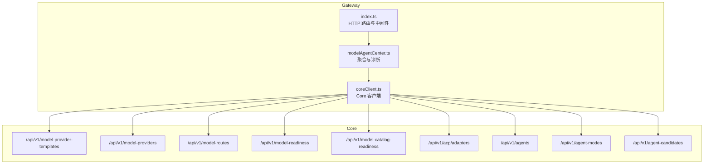
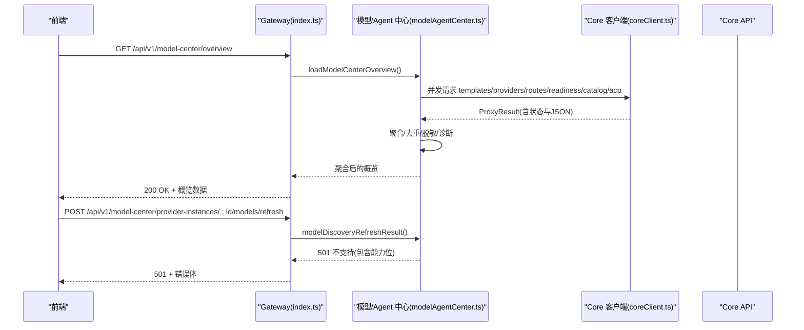
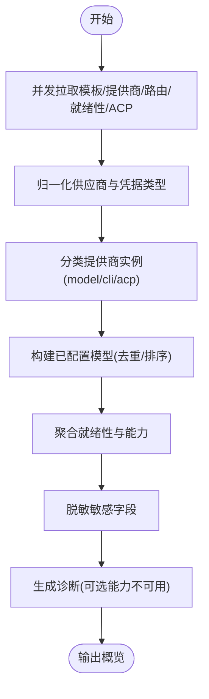
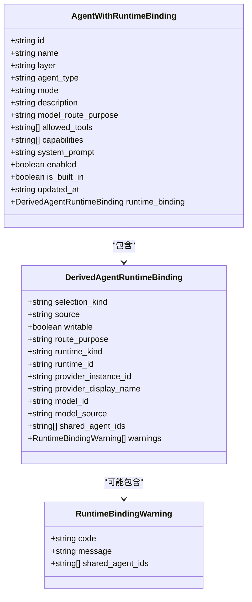
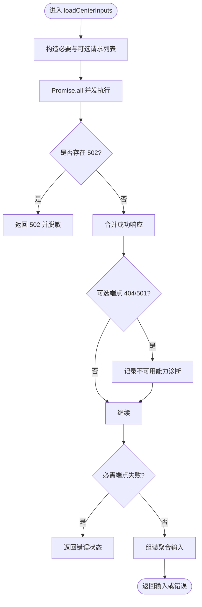
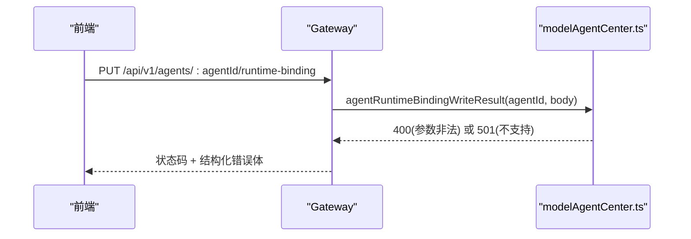
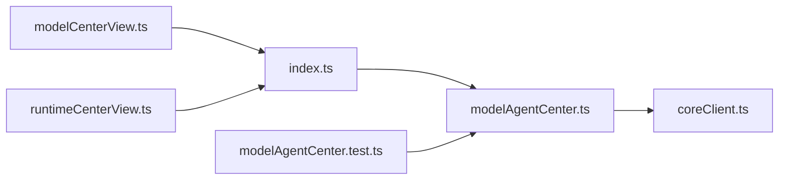

# 模型与 Agent 中心

<cite>
**本文引用的文件**   
- [modelAgentCenter.ts](file://TinadecGateway/src/modelAgentCenter.ts)
- [coreClient.ts](file://TinadecGateway/src/coreClient.ts)
- [index.ts](file://TinadecGateway/src/index.ts)
- [modelAgentCenter.test.ts](file://TinadecGateway/src/modelAgentCenter.test.ts)
- [modelCenterView.ts](file://apps/desktop/src/modelCenterView.ts)
- [runtimeCenterView.ts](file://apps/desktop/src/runtimeCenterView.ts)
</cite>

## 目录
1. [简介](#简介)
2. [项目结构](#项目结构)
3. [核心组件](#核心组件)
4. [架构总览](#架构总览)
5. [详细组件分析](#详细组件分析)
6. [依赖关系分析](#依赖关系分析)
7. [性能考量](#性能考量)
8. [故障排查指南](#故障排查指南)
9. [结论](#结论)
10. [附录](#附录)

## 简介
本文件面向“模型与 Agent 中心”模块，系统性说明：
- 模型中心的概览信息聚合、提供商实例管理与模型发现刷新机制
- Agent 中心的运行状态监控、模式切换与运行时绑定操作
- 缓存策略、数据同步与一致性保证
- 中心化管理的最佳实践与扩展指南

该模块位于 Gateway（BFF）层，负责从 Core 拉取多源数据并聚合为统一视图，同时提供只读/受限写能力的前端展示与交互入口。

## 项目结构
- Gateway 路由入口集中定义在 index.ts，暴露 /api/v1/model-center/* 与 /api/v1/agent-center/* 等端点
- modelAgentCenter.ts 实现数据聚合、类型归一化、诊断与降级逻辑
- coreClient.ts 提供对 Core 的 HTTP/SSE/流式代理能力
- 桌面端 view 层（modelCenterView.ts、runtimeCenterView.ts）将聚合结果转换为 UI 行与模板映射

**图表来源** 
- [index.ts](file://TinadecGateway/src/index.ts)
- [modelAgentCenter.ts](file://TinadecGateway/src/modelAgentCenter.ts)
- [coreClient.ts](file://TinadecGateway/src/coreClient.ts)

**章节来源**
- [index.ts](file://TinadecGateway/src/index.ts)
- [modelAgentCenter.ts](file://TinadecGateway/src/modelAgentCenter.ts)
- [coreClient.ts](file://TinadecGateway/src/coreClient.ts)

## 核心组件
- 模型中心聚合器
  - 输入：模板、提供商实例、路由、就绪性、ACP 适配器、不可用能力清单
  - 输出：供应商列表、API 连接、已配置模型、CLI/ACP 运行时、就绪性与能力、诊断
- Agent 中心聚合器
  - 在模型中心基础上叠加 Agent 列表、模式与候选项
  - 推导只读的“继承型”运行时绑定，并生成共享路由警告
- 数据加载器
  - 并发拉取必要与可选端点，处理 404/501 降级为诊断
  - 对敏感字段进行脱敏，避免泄露密钥
- 写入与刷新接口
  - 模型发现刷新：当前返回不支持（501），保留能力位
  - Agent 运行时绑定写入：当前返回不支持（501），保留能力位

**章节来源**
- [modelAgentCenter.ts](file://TinadecGateway/src/modelAgentCenter.ts)
- [modelAgentCenter.test.ts](file://TinadecGateway/src/modelAgentCenter.test.ts)

## 架构总览
Gateway 作为 BFF，统一对外暴露 Model Center 与 Agent Center 的只读概览接口；写入类操作由 Core 控制，当前 Gateway 侧以“能力位 + 明确错误码”的方式声明支持情况。

**图表来源** 
- [index.ts](file://TinadecGateway/src/index.ts)
- [modelAgentCenter.ts](file://TinadecGateway/src/modelAgentCenter.ts)
- [coreClient.ts](file://TinadecGateway/src/coreClient.ts)

## 详细组件分析

### 模型中心聚合器
- 供应商与传输/凭据类型归一化
  - 根据模板与 provider.capabilities 推断 transport_kind 与 credential_kind
  - local-http 家族统一归类为 local_http，避免与远端 http 混淆
- 提供商实例分类
  - 基于 capabilities/connection_kind 区分 model/cli/acp
  - ACP 兼容旧版 legacy_provider 与新 adapter 两类运行时，ID 前缀区分
- 已配置模型构建
  - 合并 provider_default 与 route_override，去重并按显示名与 model_id 排序
  - CLI/ACP 不参与“已配置模型”列表
- 就绪性与能力
  - 聚合 model_readiness 与 catalog_readiness，缺失时置空并记录诊断
  - 通过 unavailable_capabilities 标记 acp_adapters 是否可用

**图表来源** 
- [modelAgentCenter.ts](file://TinadecGateway/src/modelAgentCenter.ts)

**章节来源**
- [modelAgentCenter.ts](file://TinadecGateway/src/modelAgentCenter.ts)

### Agent 中心聚合器
- 继承型绑定推导
  - 依据 agent.model_route_purpose 匹配路由，再关联提供商实例
  - 计算 runtime_kind、model_source、shared_agent_ids 与只读警告
- 模式与候选项
  - 可选端点失败时降级为空数组，并记录诊断
- 运行时来源汇总
  - 将 providers/models/cli_runtimes/acp_runtimes 一并返回，供前端渲染选择器

**图表来源** 
- [modelAgentCenter.ts](file://TinadecGateway/src/modelAgentCenter.ts)

**章节来源**
- [modelAgentCenter.ts](file://TinadecGateway/src/modelAgentCenter.ts)

### 数据加载与降级策略
- 并发请求
  - 使用 Promise.all 并行拉取所有必要与可选端点
- 可选端点降级
  - 404/501 视为能力不可用，转为 diagnostics，不影响整体概览
- 必需端点失败
  - 直接透传错误状态，不降级
- 网关不可达
  - 502 立即短路返回，避免后续无效处理
- 敏感数据脱敏
  - 内置敏感键集合，递归清理响应中的敏感字段

**图表来源** 
- [modelAgentCenter.ts](file://TinadecGateway/src/modelAgentCenter.ts)

**章节来源**
- [modelAgentCenter.ts](file://TinadecGateway/src/modelAgentCenter.ts)

### 写入与刷新接口现状
- 模型发现刷新
  - 校验 providerInstanceId 非空
  - 当前返回 501，提示 Core 暂不支持实时发现，附带能力位
- Agent 运行时绑定写入
  - 校验 selection_kind 及对应字段
  - 当前返回 501，提示 Core 暂不支持持久化 per-agent 绑定，附带能力位

**图表来源** 
- [index.ts](file://TinadecGateway/src/index.ts)
- [modelAgentCenter.ts](file://TinadecGateway/src/modelAgentCenter.ts)

**章节来源**
- [modelAgentCenter.ts](file://TinadecGateway/src/modelAgentCenter.ts)
- [index.ts](file://TinadecGateway/src/index.ts)

### 前端视图与模板映射
- 模型中心视图
  - 将 providers 与 templates 合并为行，按就绪性排序，支持过滤与搜索
- Agent 运行时中心视图
  - 从概览中抽取 providers/templates/suppliers，映射为可选择的运行时选项
  - 提供绑定摘要与共享路由警告

**章节来源**
- [modelCenterView.ts](file://apps/desktop/src/modelCenterView.ts)
- [runtimeCenterView.ts](file://apps/desktop/src/runtimeCenterView.ts)

## 依赖关系分析
- Gateway 路由依赖 modelAgentCenter 提供的聚合函数
- modelAgentCenter 依赖 coreClient 进行网络访问
- 测试覆盖关键路径：分类、去重、降级、脱敏、校验与不支持的写入

**图表来源** 
- [index.ts](file://TinadecGateway/src/index.ts)
- [modelAgentCenter.ts](file://TinadecGateway/src/modelAgentCenter.ts)
- [coreClient.ts](file://TinadecGateway/src/coreClient.ts)
- [modelAgentCenter.test.ts](file://TinadecGateway/src/modelAgentCenter.test.ts)
- [modelCenterView.ts](file://apps/desktop/src/modelCenterView.ts)
- [runtimeCenterView.ts](file://apps/desktop/src/runtimeCenterView.ts)

**章节来源**
- [index.ts](file://TinadecGateway/src/index.ts)
- [modelAgentCenter.ts](file://TinadecGateway/src/modelAgentCenter.ts)
- [coreClient.ts](file://TinadecGateway/src/coreClient.ts)
- [modelAgentCenter.test.ts](file://TinadecGateway/src/modelAgentCenter.test.ts)
- [modelCenterView.ts](file://apps/desktop/src/modelCenterView.ts)
- [runtimeCenterView.ts](file://apps/desktop/src/runtimeCenterView.ts)

## 性能考量
- 并发拉取：通过 Promise.all 减少端到端延迟
- 选择性降级：可选端点失败不阻塞主流程，提升可用性
- 内存占用：聚合过程使用 Map/Set 去重与快速查找，时间复杂度近似 O(n)
- 流式与 SSE：Gateway 支持 SSE/流式转发，适合大结果集与事件推送场景
- 建议
  - 对频繁读取的概览数据可在上层做短期缓存（如 5~10 秒）
  - 对大列表分页或增量更新，降低一次性聚合开销

[本节为通用指导，无需源码引用]

## 故障排查指南
- 常见问题定位
  - 502 网关不可达：检查 Core URL 可达性与网络连通性
  - 501 功能不支持：确认能力位与前端行为是否兼容
  - 404/501 可选端点缺失：查看 diagnostics 中的 source 与 status
  - 敏感字段泄露：确认 sanitizeRecord 是否生效
- 调试步骤
  - 观察 health/doctor/readiness 端点，确认 Core 健康
  - 单独调用 /api/v1/model-provider-templates、/api/v1/model-providers、/api/v1/model-routes 验证数据
  - 检查 ACP 适配器是否可用，必要时 probe
- 日志与诊断
  - 关注 diagnostics 中的 CORE_CAPABILITY_UNAVAILABLE 与 LEGACY_SHARED_ROUTE
  - 核对 readiness.providers 中各 provider 的状态

**章节来源**
- [modelAgentCenter.test.ts](file://TinadecGateway/src/modelAgentCenter.test.ts)
- [modelAgentCenter.ts](file://TinadecGateway/src/modelAgentCenter.ts)
- [coreClient.ts](file://TinadecGateway/src/coreClient.ts)

## 结论
模型与 Agent 中心在 Gateway 层实现了高内聚的数据聚合与稳健的降级策略，提供了统一的只读概览视图，并通过能力位与结构化错误体清晰表达当前支持的写入能力。未来若 Core 开放实时发现与 per-agent 绑定写入，只需在 Gateway 侧启用相应能力位并调整路由行为即可平滑演进。

[本节为总结，无需源码引用]

## 附录

### 最佳实践
- 概览缓存
  - 在前端或网关层对概览接口做短 TTL 缓存，降低 Core 压力
- 幂等刷新
  - 刷新接口应幂等，避免重复触发导致副作用
- 安全脱敏
  - 始终对响应进行敏感字段清洗，禁止泄露 api_key、secret 等
- 渐进增强
  - 先提供只读概览，再逐步放开受限写入，配合能力位与错误码管理兼容性

[本节为通用指导，无需源码引用]

### 扩展指南
- 新增供应商模板
  - 在 Core 的模板端点补充 driver、connection_kind、credential_kind 与 capabilities
  - 确保 transport_kind 与 credential_kind 归一化规则覆盖新模板
- 新增 ACP 适配器
  - 在 /api/v1/acp/adapters 暴露适配器元数据，确保 ID 唯一且不与 legacy_provider 冲突
- 新增路由目的
  - 在 /api/v1/model-routes 维护 purpose 到 provider_instance_id 与 model 的映射
- 前端适配
  - 更新 modelCenterView.ts 与 runtimeCenterView.ts 的映射与展示逻辑

[本节为通用指导，无需源码引用]