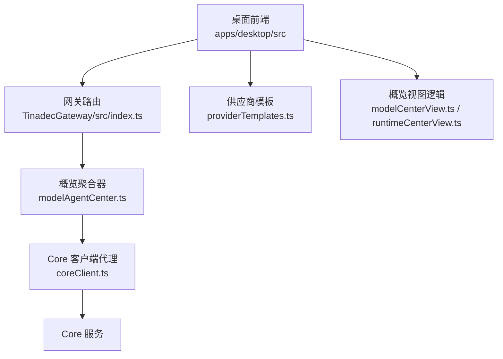
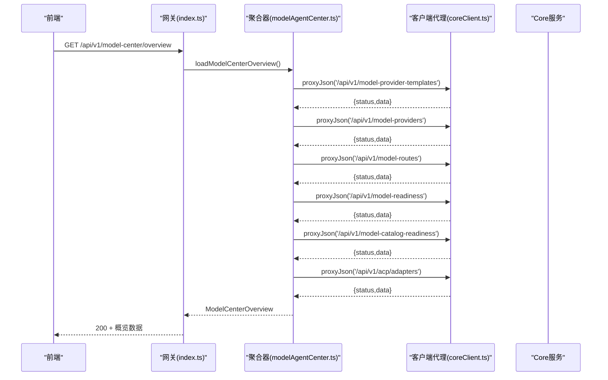
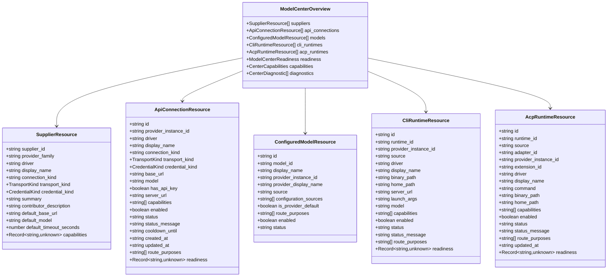
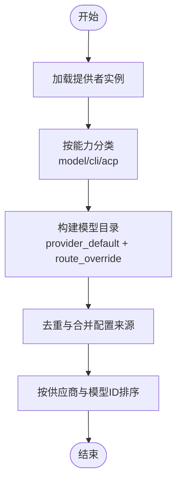
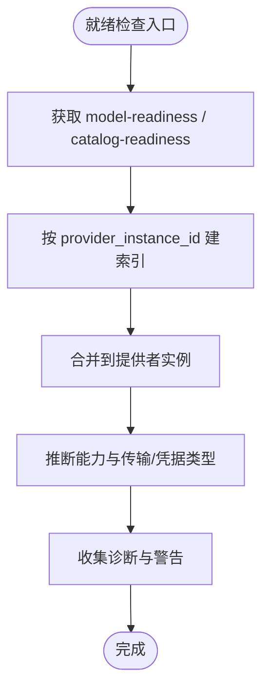
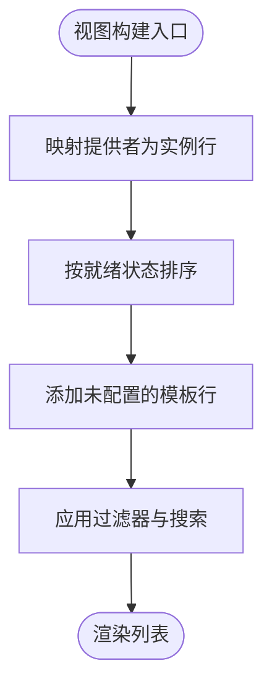
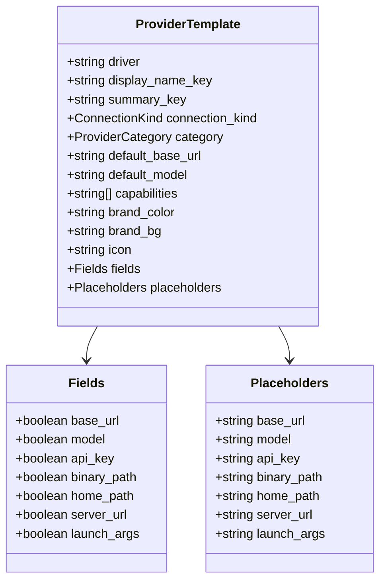
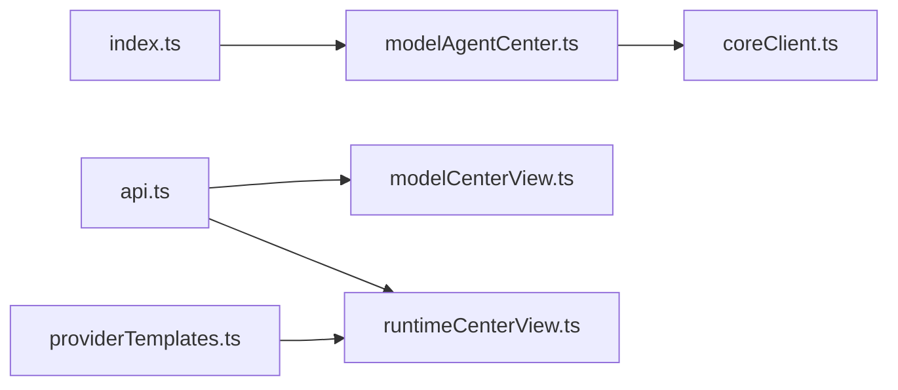

# 模型中心概览

<cite>
**本文引用的文件**   
- [modelAgentCenter.ts](file://TinadecGateway/src/modelAgentCenter.ts)
- [index.ts](file://TinadecGateway/src/index.ts)
- [coreClient.ts](file://TinadecGateway/src/coreClient.ts)
- [api.ts](file://apps/desktop/src/api.ts)
- [modelCenterView.ts](file://apps/desktop/src/modelCenterView.ts)
- [providerTemplates.ts](file://apps/desktop/src/providerTemplates.ts)
- [runtimeCenterView.ts](file://apps/desktop/src/runtimeCenterView.ts)
</cite>

## 目录
1. [简介](#简介)
2. [项目结构](#项目结构)
3. [核心组件](#核心组件)
4. [架构总览](#架构总览)
5. [详细组件分析](#详细组件分析)
6. [依赖关系分析](#依赖关系分析)
7. [性能与缓存策略](#性能与缓存策略)
8. [故障排查指南](#故障排查指南)
9. [结论](#结论)
10. [附录：接口数据结构与使用示例](#附录接口数据结构与使用示例)

## 简介
本文件面向“模型中心概览”功能，系统性说明其数据聚合、供应商资源管理、API连接状态监控、模型目录管理与能力检测机制。重点覆盖 ModelCenterOverview 接口的核心字段（suppliers、api_connections、models、cli_runtimes、acp_runtimes），并解释模型发现机制、就绪状态检查与能力检测的实现方式。同时给出数据聚合算法、错误处理机制、前端展示与过滤逻辑，以及实际使用示例和最佳实践建议。

## 项目结构
- Gateway 层负责对外暴露 REST 端点，聚合 Core 的多项数据源，生成统一的概览视图。
- Desktop 前端通过 API 类型定义获取数据，并进行本地渲染、过滤与排序。
- Provider Templates 提供供应商模板与默认配置，用于统一显示与表单生成。

**图表来源** 
- [index.ts:452-456](file://TinadecGateway/src/index.ts#L452-L456)
- [modelAgentCenter.ts:517-535](file://TinadecGateway/src/modelAgentCenter.ts#L517-L535)
- [coreClient.ts:38-87](file://TinadecGateway/src/coreClient.ts#L38-L87)
- [providerTemplates.ts:68-459](file://apps/desktop/src/providerTemplates.ts#L68-L459)
- [modelCenterView.ts:38-82](file://apps/desktop/src/modelCenterView.ts#L38-L82)
- [runtimeCenterView.ts:88-99](file://apps/desktop/src/runtimeCenterView.ts#L88-L99)

**章节来源**
- [index.ts:452-456](file://TinadecGateway/src/index.ts#L452-L456)
- [modelAgentCenter.ts:517-535](file://TinadecGateway/src/modelAgentCenter.ts#L517-L535)
- [coreClient.ts:38-87](file://TinadecGateway/src/coreClient.ts#L38-L87)
- [providerTemplates.ts:68-459](file://apps/desktop/src/providerTemplates.ts#L68-L459)
- [modelCenterView.ts:38-82](file://apps/desktop/src/modelCenterView.ts#L38-L82)
- [runtimeCenterView.ts:88-99](file://apps/desktop/src/runtimeCenterView.ts#L88-L99)

## 核心组件
- 网关路由：将 /api/v1/model-center/overview 请求转发到聚合器，返回统一的结构化数据。
- 聚合器：从 Core 拉取模板、提供者实例、路由、就绪信息、ACP 适配器等，进行归一化与合并，输出 ModelCenterOverview。
- 客户端代理：封装对 Core 的 HTTP 请求，处理网络异常与非 JSON 响应，返回标准 ProxyResult。
- 前端类型与视图：定义 ModelCenterOverviewDto 及行构建、过滤、排序等逻辑；基于供应商模板生成 UI 展示。

**章节来源**
- [index.ts:452-456](file://TinadecGateway/src/index.ts#L452-L456)
- [modelAgentCenter.ts:368-370](file://TinadecGateway/src/modelAgentCenter.ts#L368-L370)
- [coreClient.ts:38-87](file://TinadecGateway/src/coreClient.ts#L38-L87)
- [api.ts:493-505](file://apps/desktop/src/api.ts#L493-L505)
- [modelCenterView.ts:38-82](file://apps/desktop/src/modelCenterView.ts#L38-L82)

## 架构总览
模型中心概览的数据流如下：
- 前端调用 GET /api/v1/model-center/overview。
- 网关路由调用 loadModelCenterOverview。
- 聚合器加载 Core 的模板、提供者、路由、就绪、ACP 适配器等信息，执行分类、去重、映射与诊断收集。
- 客户端代理负责与 Core 通信，捕获不可达或无效响应，返回错误码与消息。
- 最终返回包含 suppliers、api_connections、models、cli_runtimes、acp_runtimes、readiness、capabilities、diagnostics 的统一概览。

**图表来源** 
- [index.ts:452-456](file://TinadecGateway/src/index.ts#L452-L456)
- [modelAgentCenter.ts:517-535](file://TinadecGateway/src/modelAgentCenter.ts#L517-L535)
- [coreClient.ts:38-87](file://TinadecGateway/src/coreClient.ts#L38-L87)

## 详细组件分析

### 聚合器与数据模型
- 输入：模板、提供者实例、路由、就绪信息、ACP 适配器、不可用能力列表。
- 处理：
  - 模板归一化为供应商资源（transport_kind、credential_kind 标准化）。
  - 提供者实例按能力分类为 model/cli/acp，分别映射到 api_connections、cli_runtimes、legacy acp_runtimes。
  - 路由聚合 provider_instance_id -> route_purposes，用于模型目录与绑定推导。
  - 就绪信息按 provider_instance_id 建立索引，供前端排序与问题筛选。
  - ACP 适配器与遗留 ACP 提供者合并为 acp_runtimes。
  - 诊断收集不可用能力与共享路由警告。
- 输出：ModelCenterOverview（含 suppliers、api_connections、models、cli_runtimes、acp_runtimes、readiness、capabilities、diagnostics）。

**图表来源** 
- [modelAgentCenter.ts:129-138](file://TinadecGateway/src/modelAgentCenter.ts#L129-L138)
- [modelAgentCenter.ts:29-122](file://TinadecGateway/src/modelAgentCenter.ts#L29-L122)

**章节来源**
- [modelAgentCenter.ts:368-370](file://TinadecGateway/src/modelAgentCenter.ts#L368-L370)
- [modelAgentCenter.ts:537-688](file://TinadecGateway/src/modelAgentCenter.ts#L537-L688)
- [modelAgentCenter.ts:690-750](file://TinadecGateway/src/modelAgentCenter.ts#L690-L750)
- [modelAgentCenter.ts:752-757](file://TinadecGateway/src/modelAgentCenter.ts#L752-L757)

### 模型目录与路由聚合
- 模型目录由 provider 默认模型与路由覆盖共同构成。
- buildConfiguredModels 以 provider_instance_id:model_id 为键去重，记录配置来源（provider_default/route_override）与用途（route_purposes）。
- 结果按供应商名称与模型 ID 排序，便于前端展示。

**图表来源** 
- [modelAgentCenter.ts:690-750](file://TinadecGateway/src/modelAgentCenter.ts#L690-L750)

**章节来源**
- [modelAgentCenter.ts:690-750](file://TinadecGateway/src/modelAgentCenter.ts#L690-L750)

### 就绪状态检查与能力检测
- 就绪信息来自 model-readiness 与 catalog-readiness，按 provider_instance_id 建立索引。
- 能力检测通过 capabilities 字段与 transport/credential 标准化推断，如 supports_streaming、supports_tools、requires_workspace 等。
- 诊断收集 unavailable_capabilities 与共享路由警告，提示前端问题定位。

**图表来源** 
- [modelAgentCenter.ts:537-688](file://TinadecGateway/src/modelAgentCenter.ts#L537-L688)

**章节来源**
- [modelAgentCenter.ts:537-688](file://TinadecGateway/src/modelAgentCenter.ts#L537-L688)

### 前端概览视图与过滤
- 前端根据 providers、templates、modelReadiness 构建 ModelCenterRow，支持 instance/template 两种行类型。
- 排序规则：readiness 优先级（blocked < warning < 正常），其次保持原始顺序。
- 过滤支持 all/issues/configured/available 与关键词搜索（display_name/driver/connection_kind/model）。

**图表来源** 
- [modelCenterView.ts:38-82](file://apps/desktop/src/modelCenterView.ts#L38-L82)
- [modelCenterView.ts:84-102](file://apps/desktop/src/modelCenterView.ts#L84-L102)

**章节来源**
- [modelCenterView.ts:38-82](file://apps/desktop/src/modelCenterView.ts#L38-L82)
- [modelCenterView.ts:84-102](file://apps/desktop/src/modelCenterView.ts#L84-L102)

### 供应商模板与类别映射
- PROVIDER_TEMPLATES 定义了各供应商的默认 URL、模型、能力与 UI 字段。
- runtimeCenterView 将供应商资源转换为前端模板，推断 category（cloud-api/local-server/agent-cli/custom）与 fields（base_url/model/api_key/binary_path/home_path/server_url/launch_args）。

**图表来源** 
- [providerTemplates.ts:29-59](file://apps/desktop/src/providerTemplates.ts#L29-L59)
- [runtimeCenterView.ts:108-149](file://apps/desktop/src/runtimeCenterView.ts#L108-L149)

**章节来源**
- [providerTemplates.ts:68-459](file://apps/desktop/src/providerTemplates.ts#L68-L459)
- [runtimeCenterView.ts:108-149](file://apps/desktop/src/runtimeCenterView.ts#L108-L149)

## 依赖关系分析
- 路由依赖聚合器，聚合器依赖客户端代理与 Core 多个端点。
- 前端依赖 API 类型定义与模板库，视图逻辑依赖聚合后的概览数据。
- 无循环依赖；模块职责清晰，耦合度低。

**图表来源** 
- [index.ts:452-456](file://TinadecGateway/src/index.ts#L452-L456)
- [modelAgentCenter.ts:517-535](file://TinadecGateway/src/modelAgentCenter.ts#L517-L535)
- [coreClient.ts:38-87](file://TinadecGateway/src/coreClient.ts#L38-L87)
- [api.ts:493-505](file://apps/desktop/src/api.ts#L493-L505)
- [modelCenterView.ts:38-82](file://apps/desktop/src/modelCenterView.ts#L38-L82)
- [runtimeCenterView.ts:88-99](file://apps/desktop/src/runtimeCenterView.ts#L88-L99)
- [providerTemplates.ts:68-459](file://apps/desktop/src/providerTemplates.ts#L68-L459)

**章节来源**
- [index.ts:452-456](file://TinadecGateway/src/index.ts#L452-L456)
- [modelAgentCenter.ts:517-535](file://TinadecGateway/src/modelAgentCenter.ts#L517-L535)
- [coreClient.ts:38-87](file://TinadecGateway/src/coreClient.ts#L38-L87)
- [api.ts:493-505](file://apps/desktop/src/api.ts#L493-L505)
- [modelCenterView.ts:38-82](file://apps/desktop/src/modelCenterView.ts#L38-L82)
- [runtimeCenterView.ts:88-99](file://apps/desktop/src/runtimeCenterView.ts#L88-L99)
- [providerTemplates.ts:68-459](file://apps/desktop/src/providerTemplates.ts#L68-L459)

## 性能与缓存策略
- 当前实现为每次请求实时聚合 Core 多端点数据，无内置缓存。
- 优化建议：
  - 在网关层增加短期内存缓存（如 TTL 5-10 秒），降低 Core 压力。
  - 对只读数据（模板、ACP 适配器）可延长缓存时间。
  - 前端可对概览数据进行短时缓存，避免频繁刷新导致抖动。
  - 对 model-readiness/catalog-readiness 可增量更新，仅刷新变更部分。

[本节为通用指导，不直接分析具体文件]

## 故障排查指南
- 常见错误：
  - CORE_UNREACHABLE：Core 不可达，检查 coreUrl 配置与网络连通性。
  - CORE_INVALID_RESPONSE：Core 返回非 JSON，检查服务端响应格式。
  - 501 不支持：某些功能（如模型发现刷新、Agent 运行时绑定写入）尚未实现，需关注 capabilities 标志位。
- 排查步骤：
  - 查看 diagnostics 数组中的错误代码与消息。
  - 检查 readiness 中 blocked/warning 条目与 evidence。
  - 确认 provider 的 enabled、status、status_message 与 cooldown_until。
  - 核对 template 的 credential_kind 与 transport_kind 是否匹配。

**章节来源**
- [coreClient.ts:38-87](file://TinadecGateway/src/coreClient.ts#L38-L87)
- [modelAgentCenter.ts:245-269](file://TinadecGateway/src/modelAgentCenter.ts#L245-L269)
- [modelAgentCenter.ts:206-243](file://TinadecGateway/src/modelAgentCenter.ts#L206-L243)

## 结论
模型中心概览通过网关聚合 Core 的多源数据，提供统一的供应商、API 连接、模型目录与运行时的可视化与管理能力。其设计强调可读性与可扩展性，通过标准化传输与凭据类型、能力检测与诊断收集，帮助快速定位问题与优化体验。建议在后续版本引入缓存与增量更新，进一步提升性能与稳定性。

[本节为总结，不直接分析具体文件]

## 附录：接口数据结构与使用示例

### ModelCenterOverview 数据结构
- 顶层字段：
  - capabilities：能力标志（provider_crud、model_catalog_mode、model_discovery_refresh、live_model_discovery、agent_runtime_binding_write、acp_adapter_read、acp_probe）。
  - suppliers：供应商资源列表（driver、connection_kind、transport_kind、credential_kind、default_base_url、default_model、capabilities）。
  - api_connections：API 连接资源（id、provider_instance_id、driver、connection_kind、transport_kind、credential_kind、base_url、model、has_api_key、server_url、capabilities、enabled、status、status_message、cooldown_until、created_at、updated_at、route_purposes、readiness）。
  - models：已配置模型（id、model_id、display_name、provider_instance_id、provider_display_name、source、configuration_sources、is_provider_default、route_purposes、enabled、status）。
  - cli_runtimes：CLI 运行时（id、runtime_id、provider_instance_id、source、driver、display_name、binary_path、home_path、server_url、launch_args、model、capabilities、enabled、status、status_message、route_purposes、readiness）。
  - acp_runtimes：ACP 运行时（id、runtime_id、source、adapter_id、provider_instance_id、extension_id、driver、display_name、command、binary_path、home_path、capabilities、enabled、status、status_message、route_purposes、updated_at、readiness）。
  - readiness：就绪信息（model、catalog）。
  - diagnostics：诊断信息（code、severity、message、source、status、route_purpose、agent_ids）。

**章节来源**
- [api.ts:493-505](file://apps/desktop/src/api.ts#L493-L505)
- [modelAgentCenter.ts:129-138](file://TinadecGateway/src/modelAgentCenter.ts#L129-L138)

### 使用示例
- 获取概览：
  - 前端调用 GET /api/v1/model-center/overview，解析返回的 ModelCenterOverviewDto。
  - 根据 readiness.providers 与 readiness.routes 统计 ready/warning/blocked 数量。
  - 使用 filterModelCenterRows 与 buildModelCenterRows 构建与过滤列表。
- 刷新模型发现：
  - POST /api/v1/model-center/provider-instances/{providerInstanceId}/models/refresh，当前返回 501 表示不支持。
- Agent 运行时绑定写入：
  - PUT /api/v1/agents/:agentId/runtime-binding，当前返回 501 表示不支持。

**章节来源**
- [index.ts:452-461](file://TinadecGateway/src/index.ts#L452-L461)
- [modelCenterView.ts:38-102](file://apps/desktop/src/modelCenterView.ts#L38-L102)
- [modelAgentCenter.ts:245-269](file://TinadecGateway/src/modelAgentCenter.ts#L245-L269)
- [modelAgentCenter.ts:206-243](file://TinadecGateway/src/modelAgentCenter.ts#L206-L243)