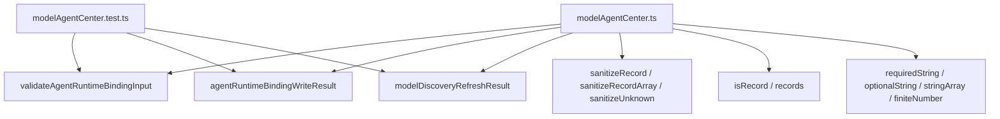
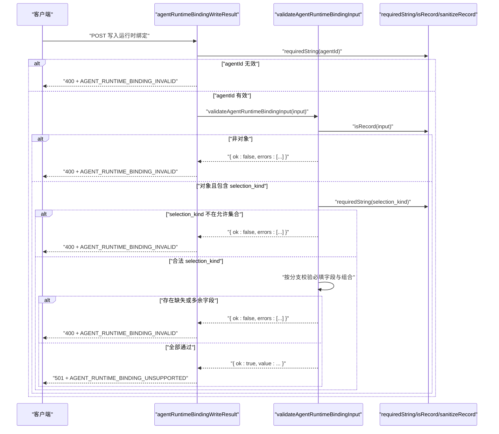
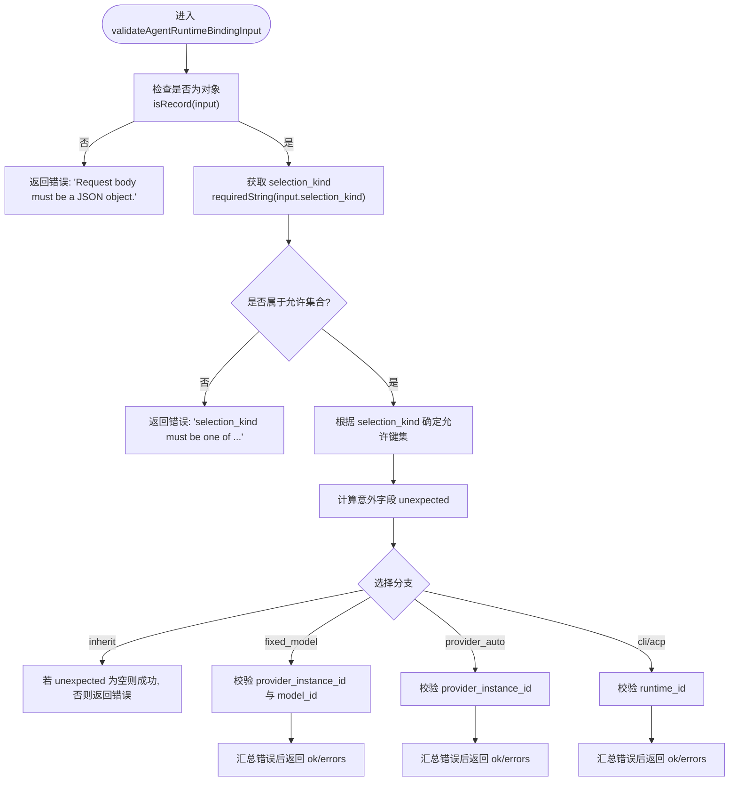
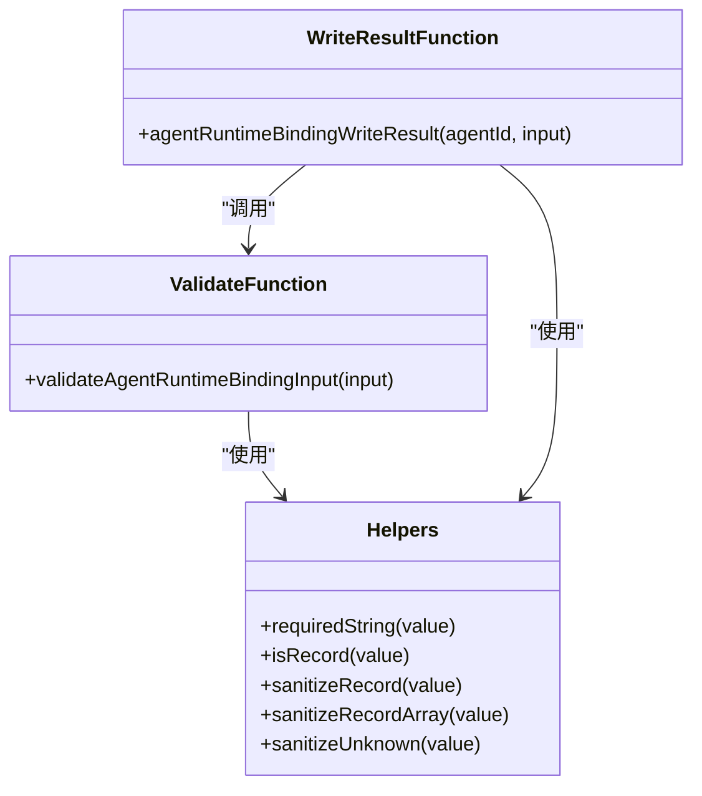

# 验证与错误处理

<cite>
**本文引用的文件**   
- [modelAgentCenter.ts](file://TinadecGateway/src/modelAgentCenter.ts)
- [modelAgentCenter.test.ts](file://TinadecGateway/src/modelAgentCenter.test.ts)
</cite>

## 目录
1. [简介](#简介)
2. [项目结构](#项目结构)
3. [核心组件](#核心组件)
4. [架构总览](#架构总览)
5. [详细组件分析](#详细组件分析)
6. [依赖关系分析](#依赖关系分析)
7. [性能考量](#性能考量)
8. [故障排查指南](#故障排查指南)
9. [结论](#结论)
10. [附录](#附录)

## 简介
本文件聚焦于“验证与错误处理机制”，围绕 validateAgentRuntimeBindingInput 函数的参数校验逻辑、错误响应格式、状态码使用与错误代码定义进行系统化说明。同时，对 requiredString 辅助函数、isRecord 类型检查以及 sanitizeRecord 数据清理功能进行深入解析，并提供常见验证错误的处理示例、调试技巧与用户友好的错误消息设计建议，最后给出扩展验证规则的实现指南。

## 项目结构
该验证与错误处理逻辑位于 TinadecGateway 的 modelAgentCenter.ts 中，测试用例在 modelAgentCenter.test.ts 中覆盖关键路径。整体职责：
- 输入校验：validateAgentRuntimeBindingInput
- 结果包装：agentRuntimeBindingWriteResult、modelDiscoveryRefreshResult
- 数据清洗：sanitizeRecord、sanitizeRecordArray、sanitizeUnknown
- 类型判定：isRecord、records
- 字符串/数组/数字等基础校验：requiredString、optionalString、stringArray、finiteNumber

图表来源
- [modelAgentCenter.ts:461-515](file://TinadecGateway/src/modelAgentCenter.ts#L461-L515)
- [modelAgentCenter.ts:206-269](file://TinadecGateway/src/modelAgentCenter.ts#L206-L269)
- [modelAgentCenter.ts:1004-1059](file://TinadecGateway/src/modelAgentCenter.ts#L1004-L1059)
- [modelAgentCenter.test.ts:231-281](file://TinadecGateway/src/modelAgentCenter.test.ts#L231-L281)

章节来源
- [modelAgentCenter.ts:1-1059](file://TinadecGateway/src/modelAgentCenter.ts#L1-L1059)
- [modelAgentCenter.test.ts:1-423](file://TinadecGateway/src/modelAgentCenter.test.ts#L1-L423)

## 核心组件
- validateAgentRuntimeBindingInput(input): 对 Agent 运行时绑定输入进行严格校验，返回统一的结构化验证结果。
- agentRuntimeBindingWriteResult(agentId, input): 将校验结果转换为标准 HTTP 响应（含状态码与错误代码）。
- modelDiscoveryRefreshResult(providerInstanceId): 模型发现刷新请求的校验与不支持提示。
- sanitizeRecord(value)/sanitizeRecordArray(value)/sanitizeUnknown(value): 递归清理敏感字段并安全转换数据结构。
- isRecord(value)/records(value): 安全的对象与数组过滤工具。
- requiredString(value)/optionalString(value)/stringArray(value)/finiteNumber(value): 基础类型规范化与校验。

章节来源
- [modelAgentCenter.ts:461-515](file://TinadecGateway/src/modelAgentCenter.ts#L461-L515)
- [modelAgentCenter.ts:206-269](file://TinadecGateway/src/modelAgentCenter.ts#L206-L269)
- [modelAgentCenter.ts:1004-1059](file://TinadecGateway/src/modelAgentCenter.ts#L1004-L1059)

## 架构总览
下图展示了从请求到验证、再到错误响应的完整流程，包括不同 selection_kind 分支的处理与错误收集策略。

图表来源
- [modelAgentCenter.ts:206-269](file://TinadecGateway/src/modelAgentCenter.ts#L206-L269)
- [modelAgentCenter.ts:461-515](file://TinadecGateway/src/modelAgentCenter.ts#L461-L515)
- [modelAgentCenter.ts:1034-1040](file://TinadecGateway/src/modelAgentCenter.ts#L1034-L1040)

## 详细组件分析

### validateAgentRuntimeBindingInput 验证逻辑
- 输入类型检查：必须为 JSON 对象；否则返回错误信息。
- selection_kind 枚举校验：仅允许 inherit、fixed_model、provider_auto、cli、acp；非法值返回错误列表。
- 字段组合校验：
  - inherit：仅允许 selection_kind。
  - fixed_model：需要 provider_instance_id 与 model_id。
  - provider_auto：需要 provider_instance_id。
  - cli/acp：需要 runtime_id。
  - 任何超出允许键集的字段都会被视为“不合法字段”并加入错误列表。
- 返回值：统一结构 { ok: true; value } 或 { ok: false; errors: string[] }。

图表来源
- [modelAgentCenter.ts:461-515](file://TinadecGateway/src/modelAgentCenter.ts#L461-L515)

章节来源
- [modelAgentCenter.ts:461-515](file://TinadecGateway/src/modelAgentCenter.ts#L461-L515)

### requiredString 辅助函数
- 作用：确保传入值为非空字符串，去除首尾空白；否则返回 null。
- 用途：用于强制字段如 agentId、selection_kind、provider_instance_id、model_id、runtime_id 等的规范化。
- 行为特点：
  - 空字符串、null、undefined、非字符串均视为无效。
  - 有效字符串会被 trim() 后再返回。

章节来源
- [modelAgentCenter.ts:1038-1040](file://TinadecGateway/src/modelAgentCenter.ts#L1038-L1040)

### isRecord 类型检查
- 作用：判断值是否为普通对象（排除 null 与数组）。
- 用途：作为输入体与嵌套对象的类型守卫，避免后续操作出现类型错误。
- 复杂度：O(1)。

章节来源
- [modelAgentCenter.ts:1034-1036](file://TinadecGateway/src/modelAgentCenter.ts#L1034-L1036)

### sanitizeRecord 数据清理
- 作用：递归清理对象中的敏感字段（如 api_key、secret、password 等），防止泄露。
- 行为：
  - 遍历对象键值，忽略敏感键。
  - 对嵌套对象与数组递归调用 sanitizeUnknown。
- 配套函数：
  - sanitizeRecordArray：对数组元素逐一清理。
  - sanitizeUnknown：统一处理未知类型的递归清理。
- 影响范围：聚合概览输出、诊断信息与能力描述等。

章节来源
- [modelAgentCenter.ts:1021-1028](file://TinadecGateway/src/modelAgentCenter.ts#L1021-L1028)
- [modelAgentCenter.ts:1004-1019](file://TinadecGateway/src/modelAgentCenter.ts#L1004-L1019)

### 错误响应格式与状态码
- 统一响应结构：
  - status：HTTP 状态码
  - data：业务数据或错误详情
    - code：错误代码（如 AGENT_RUNTIME_BINDING_INVALID、AGENT_RUNTIME_BINDING_UNSUPPORTED）
    - message：面向用户的友好消息
    - details：可选的错误细节数组（用于列举具体字段问题）
- 状态码使用：
  - 400：请求参数无效（如缺少必填字段、字段类型不符、字段组合不合法）
  - 501：功能尚未支持（如当前 Core 不支持持久化的 per-agent 运行时绑定）
- 错误代码定义：
  - AGENT_RUNTIME_BINDING_INVALID：运行时绑定请求无效
  - AGENT_RUNTIME_BINDING_UNSUPPORTED：Core 暂不支持持久化绑定
  - MODEL_DISCOVERY_REQUEST_INVALID：模型发现请求无效
  - MODEL_DISCOVERY_UNSUPPORTED：模型发现刷新功能未实现

章节来源
- [modelAgentCenter.ts:206-269](file://TinadecGateway/src/modelAgentCenter.ts#L206-L269)
- [modelAgentCenter.test.ts:261-281](file://TinadecGateway/src/modelAgentCenter.test.ts#L261-L281)

### 常见验证错误与处理示例
- 非对象输入：
  - 现象：传入 null 或非对象
  - 错误：errors 包含“Request body must be a JSON object.”
- selection_kind 非法：
  - 现象：传入 future 等非允许值
  - 错误：errors 包含“selection_kind must be one of: inherit, fixed_model, provider_auto, cli, acp.”
- 固定模型缺少 model_id：
  - 现象：fixed_model 未提供 model_id
  - 错误：errors 包含“model_id is required for fixed_model.”
- 多余字段：
  - 现象：provider_auto 中包含 model_id
  - 错误：errors 包含“Field 'model_id' is not valid for selection_kind 'provider_auto'.”
- 运行时 ID 缺失：
  - 现象：cli/acp 未提供 runtime_id
  - 错误：errors 包含“runtime_id is required for cli/acp.”

章节来源
- [modelAgentCenter.test.ts:231-259](file://TinadecGateway/src/modelAgentCenter.test.ts#L231-L259)
- [modelAgentCenter.ts:461-515](file://TinadecGateway/src/modelAgentCenter.ts#L461-L515)

### 调试技巧
- 打印 validation.errors 数组以快速定位具体字段问题。
- 使用 isRecord 与 requiredString 对输入进行前置断言，减少运行时异常。
- 在单元测试中构造边界用例（如空字符串、多余字段、非法枚举值）以确保健壮性。
- 关注 sanitizeRecord 的输出，确认敏感字段已被移除。

章节来源
- [modelAgentCenter.test.ts:231-281](file://TinadecGateway/src/modelAgentCenter.test.ts#L231-L281)

### 用户友好的错误消息设计
- 明确区分“请求无效”和“功能不支持”两类错误，便于前端路由与提示。
- 使用 details 数组列出具体字段问题，便于 UI 高亮与引导修正。
- 保持 message 简洁易懂，code 稳定可追踪，便于日志与监控。

章节来源
- [modelAgentCenter.ts:206-269](file://TinadecGateway/src/modelAgentCenter.ts#L206-L269)

### 扩展验证规则的实现指南
- 新增 selection_kind：
  - 在 allowedKinds 中添加新值。
  - 在 allowedKeys 映射中定义允许的字段集合。
  - 在分支逻辑中添加对应必填字段校验。
- 新增必填字段：
  - 在相应分支中使用 requiredString 校验并追加错误信息。
- 新增字段组合约束：
  - 在分支内增加条件判断，必要时生成更具体的错误消息。
- 新增敏感字段：
  - 在 SECRET_KEYS 集合中添加键名，确保 sanitizeRecord 自动清理。
- 新增数据类型校验：
  - 复用 requiredString、stringArray、finiteNumber 等工具函数，或在 helper 区域新增专用校验器。

章节来源
- [modelAgentCenter.ts:461-515](file://TinadecGateway/src/modelAgentCenter.ts#L461-L515)
- [modelAgentCenter.ts:1021-1059](file://TinadecGateway/src/modelAgentCenter.ts#L1021-L1059)

## 依赖关系分析
- validateAgentRuntimeBindingInput 依赖：
  - isRecord：输入对象类型检查
  - requiredString：字符串规范化与必填校验
  - 内部分支逻辑：按 selection_kind 决定必填字段与组合约束
- agentRuntimeBindingWriteResult 依赖：
  - requiredString：agentId 规范化
  - validateAgentRuntimeBindingInput：输入校验
  - 统一响应封装：status、data.code、data.message、data.details
- sanitizeRecord 依赖：
  - SECRET_KEYS：敏感键集合
  - sanitizeUnknown：递归清理
  - isRecord：对象识别

图表来源
- [modelAgentCenter.ts:206-269](file://TinadecGateway/src/modelAgentCenter.ts#L206-L269)
- [modelAgentCenter.ts:461-515](file://TinadecGateway/src/modelAgentCenter.ts#L461-L515)
- [modelAgentCenter.ts:1004-1059](file://TinadecGateway/src/modelAgentCenter.ts#L1004-L1059)

章节来源
- [modelAgentCenter.ts:206-269](file://TinadecGateway/src/modelAgentCenter.ts#L206-L269)
- [modelAgentCenter.ts:461-515](file://TinadecGateway/src/modelAgentCenter.ts#L461-L515)
- [modelAgentCenter.ts:1004-1059](file://TinadecGateway/src/modelAgentCenter.ts#L1004-L1059)

## 性能考量
- 时间复杂度：
  - validateAgentRuntimeBindingInput：O(n)，n 为输入对象键数量（主要用于键集比较与错误收集）。
  - sanitizeRecord：O(m)，m 为对象深度与键总数（递归遍历）。
- 空间复杂度：
  - 错误收集数组与中间 Map/Set 占用线性空间。
- 优化建议：
  - 尽早失败：优先进行 isRecord 与 requiredString 检查，减少后续开销。
  - 控制错误数组大小：仅在必要分支累积错误，避免无谓拼接。
  - 复用常量集合：SECRET_KEYS 与 OPTIONAL_STATUS_CODES 已集中管理，避免重复构建。

[本节为通用指导，无需特定文件引用]

## 故障排查指南
- 常见问题定位：
  - 检查 validation.ok 与 validation.errors 数组内容。
  - 确认 selection_kind 是否在允许集合内。
  - 核对各分支必填字段是否齐全。
- 调试步骤：
  - 在单元测试中构造最小复现用例。
  - 打印 requiredString 的结果，确认是否为 null。
  - 检查 sanitizeRecord 输出是否移除了敏感字段。
- 错误分类：
  - 400：参数错误（字段缺失、类型不符、组合不合法）
  - 501：功能未实现（如模型发现刷新、持久化绑定）

章节来源
- [modelAgentCenter.test.ts:231-281](file://TinadecGateway/src/modelAgentCenter.test.ts#L231-L281)
- [modelAgentCenter.ts:206-269](file://TinadecGateway/src/modelAgentCenter.ts#L206-L269)

## 结论
validateAgentRuntimeBindingInput 提供了严格的参数校验与清晰的错误反馈机制，结合 requiredString、isRecord、sanitizeRecord 等工具函数，确保了输入的安全性与一致性。错误响应采用统一的 status/data/code/message/details 结构，便于前端展示与后端监控。通过模块化设计与可扩展的校验规则，系统具备良好的可维护性与演进能力。

[本节为总结，无需特定文件引用]

## 附录
- 扩展验证规则清单：
  - 新增 selection_kind：更新 allowedKinds 与 allowedKeys，并在分支逻辑中补充校验。
  - 新增必填字段：使用 requiredString 并追加错误信息。
  - 新增字段组合约束：在分支内增加条件判断与错误消息。
  - 新增敏感字段：在 SECRET_KEYS 中添加键名。
  - 新增数据类型校验：复用现有工具函数或新增专用校验器。

章节来源
- [modelAgentCenter.ts:461-515](file://TinadecGateway/src/modelAgentCenter.ts#L461-L515)
- [modelAgentCenter.ts:1021-1059](file://TinadecGateway/src/modelAgentCenter.ts#L1021-L1059)