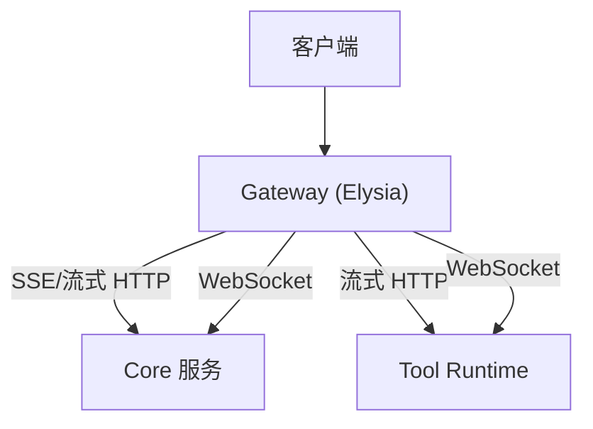
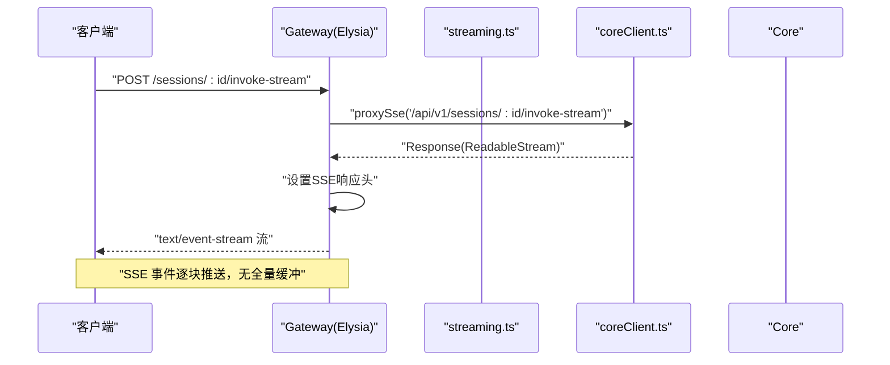
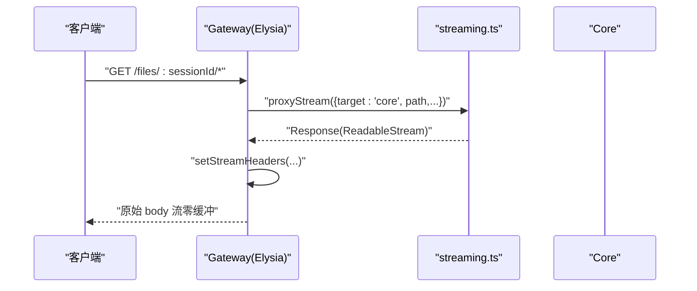
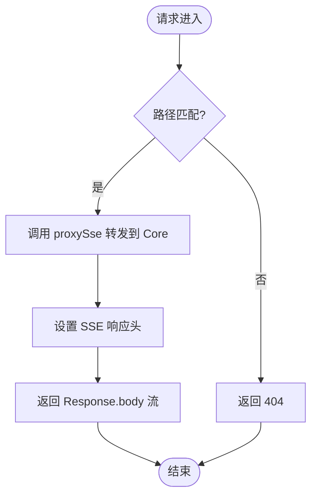
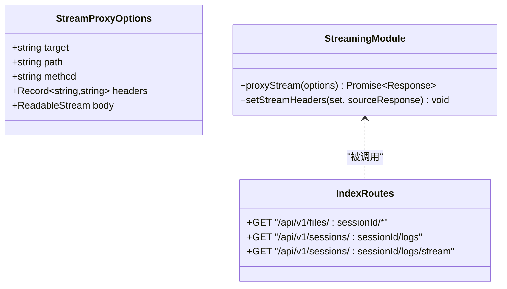
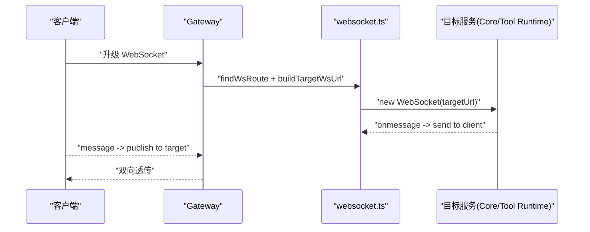
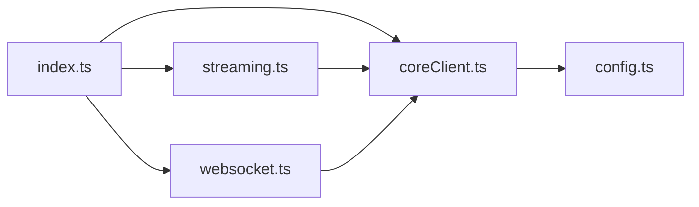

# 流式处理器

<cite>
**本文引用的文件**   
- [index.ts](file://TinadecGateway/src/index.ts)
- [streaming.ts](file://TinadecGateway/src/streaming.ts)
- [coreClient.ts](file://TinadecGateway/src/coreClient.ts)
- [websocket.ts](file://TinadecGateway/src/websocket.ts)
- [config.ts](file://TinadecGateway/src/config.ts)
</cite>

## 目录
1. [简介](#简介)
2. [项目结构](#项目结构)
3. [核心组件](#核心组件)
4. [架构总览](#架构总览)
5. [详细组件分析](#详细组件分析)
6. [依赖关系分析](#依赖关系分析)
7. [性能考量](#性能考量)
8. [故障排查指南](#故障排查指南)
9. [结论](#结论)
10. [附录](#附录)

## 简介
本模块聚焦于 Gateway 层的流式处理能力，涵盖 SSE（Server-Sent Events）流式响应、HTTP 流式传输与大数据量数据传输。文档详细说明：
- SSE 统一事件流的接入与透传
- HTTP 流式代理（大文件与日志）的零缓冲转发
- 流式数据的缓冲策略、背压处理与错误恢复机制
- 流式响应的头部设置、缓存控制与浏览器兼容性
- 流式接口的开发规范与性能优化建议

该模块运行在独立的 Bun 进程中，作为薄代理 BFF/API 层，负责协议转换（HTTP/JSON、SSE、WebSocket、流式 HTTP）和流式转发（到 Core 与 Tool Runtime）。

## 项目结构
Gateway 的流式能力由以下关键文件构成：
- index.ts：路由定义与流式端点编排（SSE、流式 HTTP、WebSocket）
- streaming.ts：流式 HTTP 代理与通用响应头设置
- coreClient.ts：Core 客户端（JSON/SSE/流式）
- websocket.ts：WebSocket 代理（终端、调试、协作）
- config.ts：运行配置（端口、目标地址、超时等）

图表来源
- [index.ts:231-286](file://TinadecGateway/src/index.ts#L231-L286)
- [index.ts:874-904](file://TinadecGateway/src/index.ts#L874-L904)
- [streaming.ts:25-53](file://TinadecGateway/src/streaming.ts#L25-L53)
- [coreClient.ts:93-109](file://TinadecGateway/src/coreClient.ts#L93-L109)
- [websocket.ts:51-67](file://TinadecGateway/src/websocket.ts#L51-L67)

章节来源
- [index.ts:1-21](file://TinadecGateway/src/index.ts#L1-L21)
- [config.ts:1-16](file://TinadecGateway/src/config.ts#L1-L16)

## 核心组件
- 流式 HTTP 代理（streaming.ts）
  - 提供 proxyStream(options) 将请求体与响应体以 ReadableStream 形式透传，避免内存缓冲
  - setStreamHeaders(set, sourceResponse) 统一设置 content-type、cache-control、connection、x-accel-buffering 等关键响应头
- Core 客户端（coreClient.ts）
  - proxySse(path, init) 发起 SSE 请求，设置 accept: text/event-stream
  - proxyStream(path, init) 透传流式 HTTP 请求到 Core
- 路由与编排（index.ts）
  - SSE 统一事件流：POST /api/v1/sessions/:sessionId/invoke-stream、GET /api/v1/events
  - 流式 HTTP：GET /api/v1/files/:sessionId/*、GET /api/v1/sessions/:sessionId/logs、GET /api/v1/sessions/:sessionId/logs/stream
  - WebSocket：/ws/terminal、/ws/debug、/ws/collaboration
- 配置（config.ts）
  - 部署模式、监听地址与端口、Core/Tool Runtime 地址、请求超时、CORS 白名单等

章节来源
- [streaming.ts:11-53](file://TinadecGateway/src/streaming.ts#L11-L53)
- [coreClient.ts:22-30](file://TinadecGateway/src/coreClient.ts#L22-L30)
- [coreClient.ts:93-109](file://TinadecGateway/src/coreClient.ts#L93-L109)
- [index.ts:231-286](file://TinadecGateway/src/index.ts#L231-L286)
- [index.ts:874-904](file://TinadecGateway/src/index.ts#L874-L904)
- [config.ts:65-106](file://TinadecGateway/src/config.ts#L65-L106)

## 架构总览
Gateway 作为协议转换与流式转发的中心，将不同协议的请求映射到后端服务，并保证数据流的高效与稳定。

图表来源
- [index.ts:231-243](file://TinadecGateway/src/index.ts#L231-L243)
- [coreClient.ts:93-101](file://TinadecGateway/src/coreClient.ts#L93-L101)

图表来源
- [index.ts:874-884](file://TinadecGateway/src/index.ts#L874-L884)
- [streaming.ts:25-37](file://TinadecGateway/src/streaming.ts#L25-L37)

## 详细组件分析

### SSE 流式响应处理
- 入口路由
  - POST /api/v1/sessions/:sessionId/invoke-stream：将 JSON 请求体转发到 Core 的 invoke-stream，并以 text/event-stream 返回
  - GET /api/v1/events：订阅全局事件流
- 头部设置
  - content-type: text/event-stream
  - cache-control: no-cache
  - connection: keep-alive
  - x-accel-buffering: no（Nginx 加速场景禁用缓冲）
- 浏览器兼容
  - 使用 EventSource 或 fetch + ReadableStream 读取 SSE
  - 确保服务端不发送压缩或分块编码导致的事件解析问题

图表来源
- [index.ts:231-243](file://TinadecGateway/src/index.ts#L231-L243)
- [index.ts:278-286](file://TinadecGateway/src/index.ts#L278-L286)
- [coreClient.ts:93-101](file://TinadecGateway/src/coreClient.ts#L93-L101)

章节来源
- [index.ts:231-243](file://TinadecGateway/src/index.ts#L231-L243)
- [index.ts:278-286](file://TinadecGateway/src/index.ts#L278-L286)
- [coreClient.ts:93-101](file://TinadecGateway/src/coreClient.ts#L93-L101)

### HTTP 流式传输（大文件与日志）
- 路由
  - GET /api/v1/files/:sessionId/*：按会话路径下载文件流
  - GET /api/v1/sessions/:sessionId/logs：日志流
  - GET /api/v1/sessions/:sessionId/logs/stream：实时日志流
- 代理实现
  - streaming.ts 的 proxyStream 使用 fetch 直接透传 ReadableStream，不缓冲
  - duplex: 'half' 支持流式请求体（Bun 环境）
- 响应头
  - setStreamHeaders 复制上游 content-type，并设置 no-cache、keep-alive、x-accel-buffering=no

图表来源
- [streaming.ts:13-37](file://TinadecGateway/src/streaming.ts#L13-L37)
- [streaming.ts:42-53](file://TinadecGateway/src/streaming.ts#L42-L53)
- [index.ts:874-904](file://TinadecGateway/src/index.ts#L874-L904)

章节来源
- [streaming.ts:25-53](file://TinadecGateway/src/streaming.ts#L25-L53)
- [index.ts:874-904](file://TinadecGateway/src/index.ts#L874-L904)

### WebSocket 流式通道
- 路由
  - /ws/terminal → Tool Runtime（PTY 终端）
  - /ws/debug → Core（调试器通信）
  - /ws/collaboration → Core（实时协作）
- 代理逻辑
  - 构建目标 URL（http→ws），维护双向消息透传
  - 连接关闭与错误时清理资源

图表来源
- [websocket.ts:35-45](file://TinadecGateway/src/websocket.ts#L35-L45)
- [websocket.ts:51-67](file://TinadecGateway/src/websocket.ts#L51-L67)
- [websocket.ts:93-139](file://TinadecGateway/src/websocket.ts#L93-L139)
- [index.ts:822-855](file://TinadecGateway/src/index.ts#L822-L855)

章节来源
- [websocket.ts:51-67](file://TinadecGateway/src/websocket.ts#L51-L67)
- [index.ts:822-855](file://TinadecGateway/src/index.ts#L822-L855)

### 配置与环境
- 部署模式
  - local：监听 127.0.0.1，无认证
  - cloud：监听 0.0.0.0，支持认证、租户、反向代理
- 关键配置项
  - port、hostname、coreUrl、toolRuntimeUrl、requestTimeoutMs、corsExtraOrigins、trustProxy

章节来源
- [config.ts:18-48](file://TinadecGateway/src/config.ts#L18-L48)
- [config.ts:65-106](file://TinadecGateway/src/config.ts#L65-L106)

## 依赖关系分析
- index.ts 依赖 streaming.ts、coreClient.ts、websocket.ts、auth.ts、approval.ts、modelAgentCenter.ts 等
- streaming.ts 依赖 coreClient.ts 与 toolRuntimeClient.ts
- coreClient.ts 依赖 config.ts
- websocket.ts 依赖 coreClient.ts 与 toolRuntimeClient.ts

图表来源
- [index.ts:23-51](file://TinadecGateway/src/index.ts#L23-L51)
- [streaming.ts:8-9](file://TinadecGateway/src/streaming.ts#L8-L9)
- [coreClient.ts:7](file://TinadecGateway/src/coreClient.ts#L7)
- [websocket.ts:15-17](file://TinadecGateway/src/websocket.ts#L15-L17)

章节来源
- [index.ts:23-51](file://TinadecGateway/src/index.ts#L23-L51)
- [streaming.ts:8-9](file://TinadecGateway/src/streaming.ts#L8-L9)
- [coreClient.ts:7](file://TinadecGateway/src/coreClient.ts#L7)
- [websocket.ts:15-17](file://TinadecGateway/src/websocket.ts#L15-L17)

## 性能考量
- 零缓冲转发
  - streaming.ts 的 proxyStream 直接使用 ReadableStream 透传，避免内存峰值
- 背压处理
  - 基于 Node/Bun 原生流式 API，底层已处理背压；上层无需额外缓冲
- 连接复用
  - 设置 connection: keep-alive，减少握手开销
- 缓存控制
  - cache-control: no-cache 防止中间节点缓存流式内容
- Nginx/反向代理
  - x-accel-buffering: no 禁用代理缓冲，确保实时性
- 超时配置
  - requestTimeoutMs 控制长连接与流式请求的超时行为

[本节为通用指导，不直接分析具体文件]

## 故障排查指南
- SSE 无法建立连接
  - 检查 accept: text/event-stream 是否正确设置
  - 确认后端 Core 是否返回正确的 event 格式
- 流式中断或卡顿
  - 检查网络链路是否存在代理缓冲（x-accel-buffering 应设为 no）
  - 确认 upstream 响应头未包含压缩或分块异常
- 大文件下载失败
  - 验证 Content-Type 与 Content-Length（如有）
  - 检查磁盘 I/O 与后端存储延迟
- WebSocket 断开
  - 检查目标服务可达性与子协议匹配
  - 关注 onerror/onclose 回调中的错误码与原因

章节来源
- [coreClient.ts:56-86](file://TinadecGateway/src/coreClient.ts#L56-L86)
- [streaming.ts:42-53](file://TinadecGateway/src/streaming.ts#L42-L53)
- [websocket.ts:108-139](file://TinadecGateway/src/websocket.ts#L108-L139)

## 结论
本模块通过统一的流式代理与协议转换，实现了高效的 SSE、HTTP 流式与 WebSocket 传输。其设计遵循零缓冲、背压友好、可观测与可扩展原则，适用于大文件传输、实时日志与交互式工具执行等场景。建议在开发中严格遵循接口规范与头部设置，结合监控与超时策略保障稳定性。

[本节为总结，不直接分析具体文件]

## 附录
- 流式接口开发规范
  - 所有流式端点必须设置正确的 content-type 与 cache-control
  - 对于需要禁用缓冲的反向代理场景，务必设置 x-accel-buffering: no
  - 保持 connection: keep-alive 以提升性能
- 浏览器兼容性
  - 推荐使用 EventSource 消费 SSE；如需二进制或自定义头，可使用 fetch + ReadableStream
  - 注意跨域与凭证（credentials）配置
- 性能优化建议
  - 合理设置 requestTimeoutMs，避免长连接占用过久
  - 对大文件传输启用断点续传（如适用）
  - 监控上游延迟与错误率，及时扩容或降级

[本节为通用指导，不直接分析具体文件]