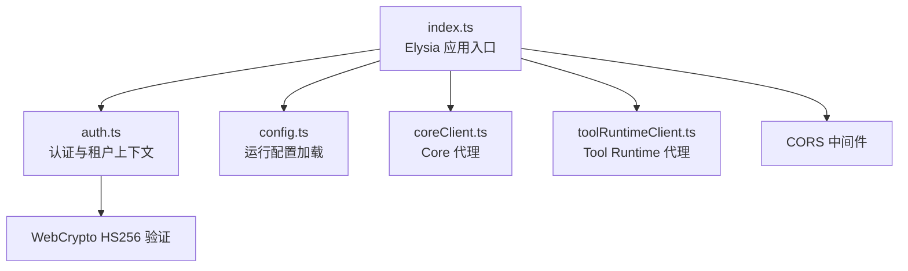
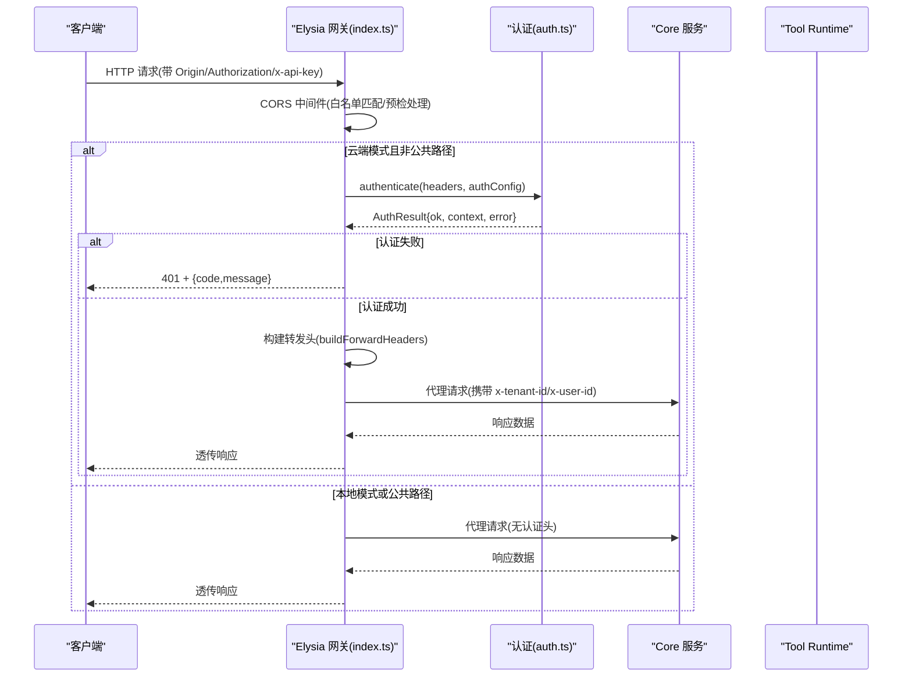
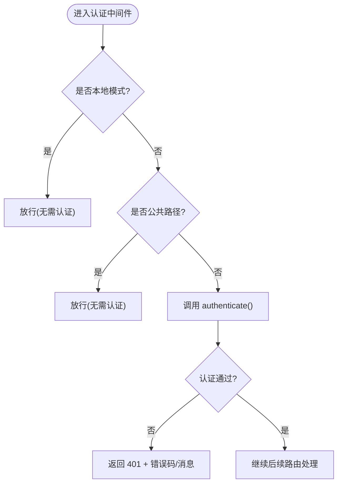
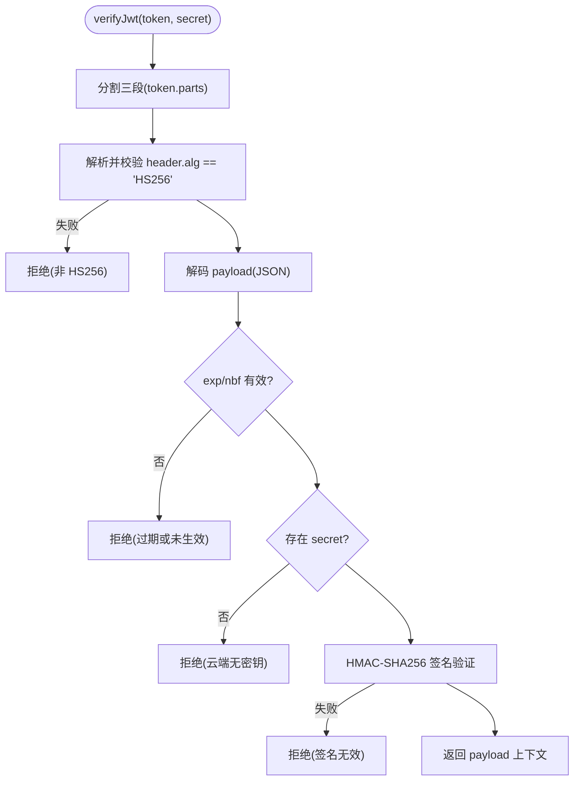
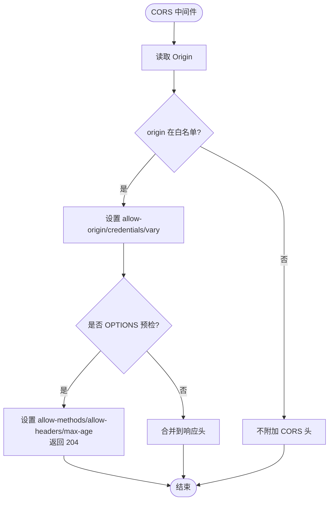
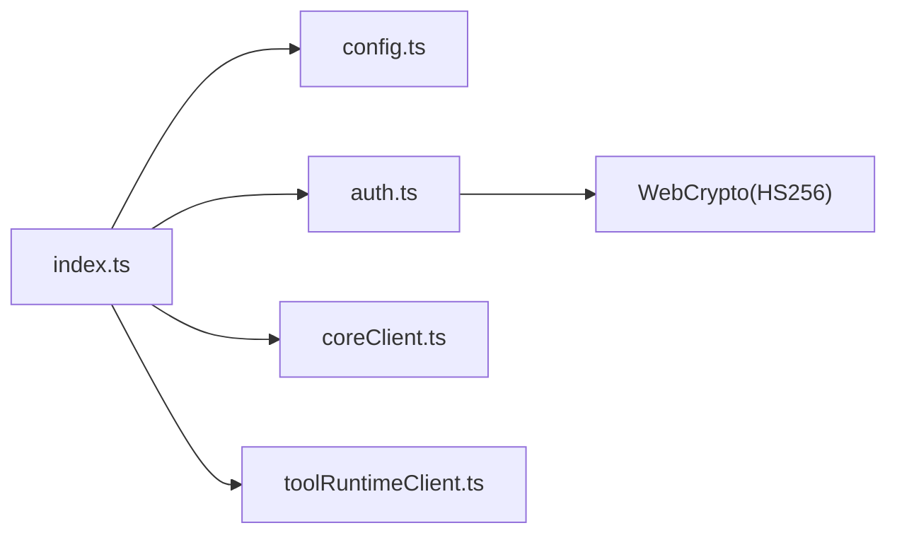

# 认证与安全

<cite>
**本文引用的文件**   
- [TinadecGateway/src/auth.ts](file://TinadecGateway/src/auth.ts)
- [TinadecGateway/src/auth.test.ts](file://TinadecGateway/src/auth.test.ts)
- [TinadecGateway/src/config.ts](file://TinadecGateway/src/config.ts)
- [TinadecGateway/src/index.ts](file://TinadecGateway/src/index.ts)
</cite>

## 目录
1. [简介](#简介)
2. [项目结构](#项目结构)
3. [核心组件](#核心组件)
4. [架构总览](#架构总览)
5. [详细组件分析](#详细组件分析)
6. [依赖关系分析](#依赖关系分析)
7. [性能考虑](#性能考虑)
8. [故障排查指南](#故障排查指南)
9. [结论](#结论)
10. [附录](#附录)

## 简介
本文件聚焦于网关层的认证与安全能力，涵盖：
- API Key 验证与 JWT Token 处理（HS256）
- 租户上下文提取与透传（x-tenant-id、x-user-id）
- 公共路径白名单机制
- CORS 策略配置与跨域请求处理
- 认证中间件实现原理、错误码与响应格式
- 多租户环境下的身份验证流程与权限控制建议

该模块运行在独立 Bun 网关中，作为 BFF/API 层对 Core 与 Tool Runtime 进行统一鉴权、协议转换与代理转发。

## 项目结构
认证与安全相关代码集中在 TinadecGateway 包内：
- auth.ts：认证逻辑、JWT 校验、租户上下文构建、客户端 IP 获取
- config.ts：部署模式、认证配置、CORS 来源列表等运行时配置
- index.ts：Elysia 应用入口，注册 CORS 中间件、认证中间件与路由
- auth.test.ts：针对 JWT 校验、认证分支与头部注入的单元测试



**图示来源** 
- [TinadecGateway/src/index.ts:107-154](file://TinadecGateway/src/index.ts#L107-L154)
- [TinadecGateway/src/auth.ts:46-112](file://TinadecGateway/src/auth.ts#L46-L112)
- [TinadecGateway/src/config.ts:65-106](file://TinadecGateway/src/config.ts#L65-L106)

**章节来源**
- [TinadecGateway/src/index.ts:1-120](file://TinadecGateway/src/index.ts#L1-L120)
- [TinadecGateway/src/auth.ts:1-112](file://TinadecGateway/src/auth.ts#L1-L112)
- [TinadecGateway/src/config.ts:1-106](file://TinadecGateway/src/config.ts#L1-L106)

## 核心组件
- 认证中间件（云端模式）
  - 跳过本地模式与公共路径
  - 支持 API Key 与 Bearer Token（HS256）两种认证方式
  - 失败返回 401 与结构化错误体
- JWT 校验器
  - 仅允许 alg=HS256，拒绝 alg:none/其他算法
  - 校验 exp/nbf 时间窗口
  - 使用 WebCrypto HMAC-SHA256 验证签名
- 租户上下文构建
  - 从 JWT claims 或 x-tenant-id 头提取 tenantId
  - 从 JWT claims.sub/user_id 提取 userId
  - 通过 buildForwardHeaders 注入 x-tenant-id/x-user-id 到下游
- CORS 中间件
  - 基于 origin 白名单匹配（含正则与通配符）
  - 预检请求直接返回 204 并设置允许的方法与头
  - 非预检请求附加 Allow-Origin/Credentials/Vary 等头

**章节来源**
- [TinadecGateway/src/index.ts:107-154](file://TinadecGateway/src/index.ts#L107-L154)
- [TinadecGateway/src/auth.ts:29-112](file://TinadecGateway/src/auth.ts#L29-L112)
- [TinadecGateway/src/auth.ts:133-178](file://TinadecGateway/src/auth.ts#L133-L178)
- [TinadecGateway/src/auth.ts:227-254](file://TinadecGateway/src/auth.ts#L227-L254)
- [TinadecGateway/src/index.ts:65-139](file://TinadecGateway/src/index.ts#L65-L139)

## 架构总览
下图展示一次受保护请求的完整调用链：CORS 检查 → 认证中间件 → 路由处理 → 下游代理（Core/Tool Runtime）。



**图示来源** 
- [TinadecGateway/src/index.ts:107-154](file://TinadecGateway/src/index.ts#L107-L154)
- [TinadecGateway/src/auth.ts:46-112](file://TinadecGateway/src/auth.ts#L46-L112)
- [TinadecGateway/src/auth.ts:227-254](file://TinadecGateway/src/auth.ts#L227-L254)

## 详细组件分析

### 认证中间件与公共路径白名单
- 本地模式：直接放行，不执行认证
- 云端模式：
  - 若路径在白名单（如 /api/v1/health、/docs/*），直接放行
  - 否则调用 authenticate() 进行认证
  - 失败时返回 401 与结构化错误体（包含 code 与 message）



**图示来源** 
- [TinadecGateway/src/index.ts:140-154](file://TinadecGateway/src/index.ts#L140-L154)
- [TinadecGateway/src/auth.ts:29-53](file://TinadecGateway/src/auth.ts#L29-L53)

**章节来源**
- [TinadecGateway/src/index.ts:140-154](file://TinadecGateway/src/index.ts#L140-L154)
- [TinadecGateway/src/auth.ts:29-53](file://TinadecGateway/src/auth.ts#L29-L53)

### API Key 验证
- 当请求包含 x-api-key 且配置了 apiKeyValidator 时，优先尝试 API Key 认证
- 验证成功：返回 authenticated=true，并从 x-tenant-id 提取租户上下文
- 验证失败：返回 401，错误码为 AUTH_INVALID_API_KEY

**章节来源**
- [TinadecGateway/src/auth.ts:55-73](file://TinadecGateway/src/auth.ts#L55-L73)
- [TinadecGateway/src/config.ts:78-84](file://TinadecGateway/src/config.ts#L78-L84)

### JWT Token 处理（HS256）
- 仅接受 Authorization: Bearer <token>
- 解析 header，强制 alg=HS256，拒绝 alg:none 与其他算法
- 校验 exp/nbf 时间窗口
- 使用 WebCrypto importKey(HMAC, SHA-256) 验证签名
- 无密钥时拒绝 token（云端 fail-closed）
- 成功时从 claims 提取 sub/user_id、tenant_id、roles



**图示来源** 
- [TinadecGateway/src/auth.ts:133-178](file://TinadecGateway/src/auth.ts#L133-L178)

**章节来源**
- [TinadecGateway/src/auth.ts:75-94](file://TinadecGateway/src/auth.ts#L75-L94)
- [TinadecGateway/src/auth.ts:133-178](file://TinadecGateway/src/auth.ts#L133-L178)

### 租户上下文提取与透传
- 租户 ID 来源优先级：JWT claims.tenant_id > 请求头 x-tenant-id
- 用户 ID 来源：JWT claims.sub 或 user_id
- 通过 buildForwardHeaders 将 x-tenant-id、x-user-id 注入到下游请求头
- 未认证上下文不会注入上述头

```mermaid
classDiagram
class AuthContext {
+boolean authenticated
+string userId
+string tenantId
+string[] roles
}
class AuthResult {
+boolean ok
+AuthContext context
+error{code,message}
}
class HeadersBuilder {
+buildForwardHeaders(context, existing) Record~string,string~
}
AuthResult --> AuthContext : "包含"
HeadersBuilder --> AuthContext : "读取以注入头"
```

**图示来源** 
- [TinadecGateway/src/auth.ts:16-27](file://TinadecGateway/src/auth.ts#L16-L27)
- [TinadecGateway/src/auth.ts:227-254](file://TinadecGateway/src/auth.ts#L227-L254)

**章节来源**
- [TinadecGateway/src/auth.ts:55-112](file://TinadecGateway/src/auth.ts#L55-L112)
- [TinadecGateway/src/auth.ts:227-254](file://TinadecGateway/src/auth.ts#L227-L254)

### CORS 策略与跨域处理
- 白名单来源：
  - 固定规则：localhost、127.0.0.1、file://、tauri://localhost、https://tauri.localhost
  - 动态扩展：TINADEC_GATEWAY_CORS_ORIGINS（支持 *.domain 通配符）
- 预检请求（OPTIONS）：
  - 直接返回 204，并设置 allow-methods/allow-headers/max-age
  - 默认允许的头包括 accept、content-type、authorization、x-api-key、x-tenant-id、x-user-id
- 非预检请求：
  - 若 origin 在白名单，设置 access-control-allow-origin、credentials、vary



**图示来源** 
- [TinadecGateway/src/index.ts:65-139](file://TinadecGateway/src/index.ts#L65-L139)

**章节来源**
- [TinadecGateway/src/index.ts:65-139](file://TinadecGateway/src/index.ts#L65-L139)

### 错误处理与状态码
- 认证失败：
  - AUTH_REQUIRED：云端模式要求认证但未提供凭据
  - AUTH_INVALID_TOKEN：Bearer token 无效或已过期
  - AUTH_INVALID_API_KEY：API Key 无效
- 响应格式：
  - 401 + { code, message }
- 测试覆盖：
  - 覆盖 alg:none、alg:HS512、过期、nbf 未来、不同密钥、篡改载荷等场景

**章节来源**
- [TinadecGateway/src/auth.ts:75-112](file://TinadecGateway/src/auth.ts#L75-L112)
- [TinadecGateway/src/auth.test.ts:77-111](file://TinadecGateway/src/auth.test.ts#L77-L111)
- [TinadecGateway/src/index.ts:146-153](file://TinadecGateway/src/index.ts#L146-L153)

### 多租户身份验证与权限控制建议
- 身份验证流程：
  - 客户端携带 Authorization 或 x-api-key
  - 网关校验通过后，向下游注入 x-tenant-id/x-user-id
- 权限控制建议（网关层）：
  - 基于 roles 字段进行细粒度授权（例如 admin/editor）
  - 结合业务路由对敏感操作做二次审批（当前 Code Tools 已有审批门）
- 下游服务应信任网关注入的 x-tenant-id/x-user-id，用于多租户隔离与审计

**章节来源**
- [TinadecGateway/src/auth.ts:80-94](file://TinadecGateway/src/auth.ts#L80-L94)
- [TinadecGateway/src/index.ts:351-400](file://TinadecGateway/src/index.ts#L351-L400)

## 依赖关系分析
- index.ts 依赖：
  - config.ts：加载部署模式、认证配置、CORS 来源
  - auth.ts：authenticate、isPublicPath、buildForwardHeaders
  - coreClient.ts/toolRuntimeClient.ts：JSON/SSE/WebSocket 代理
- auth.ts 依赖：
  - WebCrypto（HMAC-SHA256）
  - base64url 编解码工具函数
- 配置项与环境变量：
  - TINADEC_GATEWAY_MODE：local/cloud
  - TINADEC_GATEWAY_AUTH_REQUIRED：是否必须认证
  - TINADEC_GATEWAY_JWT_SECRET：JWT 密钥
  - TINADEC_GATEWAY_API_KEY：静态 API Key
  - TINADEC_GATEWAY_CORS_ORIGINS：额外 CORS 来源
  - TINADEC_GATEWAY_TIMEOUT_MS：请求超时
  - TINADEC_GATEWAY_PORT/HOSTNAME：监听地址



**图示来源** 
- [TinadecGateway/src/index.ts:23-51](file://TinadecGateway/src/index.ts#L23-L51)
- [TinadecGateway/src/config.ts:65-106](file://TinadecGateway/src/config.ts#L65-L106)
- [TinadecGateway/src/auth.ts:133-178](file://TinadecGateway/src/auth.ts#L133-L178)

**章节来源**
- [TinadecGateway/src/index.ts:23-51](file://TinadecGateway/src/index.ts#L23-L51)
- [TinadecGateway/src/config.ts:65-106](file://TinadecGateway/src/config.ts#L65-L106)

## 性能考虑
- JWT 校验使用原生 WebCrypto，避免第三方库开销
- 预检请求快速返回 204，减少重复协商成本
- 认证中间件仅在云端模式且非公共路径下执行，降低冷路径开销
- 建议在高频路径上缓存鉴权结果（如需）或使用短生命周期 token

[本节为通用指导，不涉及具体文件分析]

## 故障排查指南
- 常见问题与定位：
  - 401 AUTH_REQUIRED：检查是否启用云端模式且未携带任何认证头
  - 401 AUTH_INVALID_TOKEN：确认 jwtSecret 一致、alg=HS256、exp/nbf 正确
  - 401 AUTH_INVALID_API_KEY：核对 TINADEC_GATEWAY_API_KEY 与请求头 x-api-key
  - CORS 被浏览器拦截：检查 Origin 是否在白名单，预检头是否包含自定义头
- 调试建议：
  - 查看网关日志中的 code/message
  - 使用 curl 模拟请求，逐步添加头观察行为
  - 通过 /api/v1/health 确认网关与 Core 连通性

**章节来源**
- [TinadecGateway/src/index.ts:146-153](file://TinadecGateway/src/index.ts#L146-L153)
- [TinadecGateway/src/auth.test.ts:113-177](file://TinadecGateway/src/auth.test.ts#L113-L177)

## 结论
该认证与安全模块以最小依赖实现了云/本地双模式的鉴权与跨域处理，支持 API Key 与 HS256 JWT 两种认证方式，并通过标准化头将租户与用户上下文安全地透传到下游服务。配合严格的白名单与预检策略，可在保障安全性的同时提供良好的开发体验。建议在多租户环境中进一步引入基于角色的访问控制（RBAC）与更细粒度的审批流，以满足复杂业务场景。

[本节为总结性内容，不涉及具体文件分析]

## 附录
- 环境变量清单
  - TINADEC_GATEWAY_MODE：local 或 cloud
  - TINADEC_GATEWAY_PORT：端口号
  - TINADEC_GATEWAY_HOSTNAME：绑定地址（cloud 为 0.0.0.0）
  - TINADEC_CORE_URL：Core 服务地址
  - TINADEC_TOOL_RUNTIME_URL：Tool Runtime 地址
  - TINADEC_GATEWAY_AUTH_REQUIRED：是否必须认证
  - TINADEC_GATEWAY_JWT_SECRET：JWT 密钥
  - TINADEC_GATEWAY_API_KEY：静态 API Key
  - TINADEC_GATEWAY_CORS_ORIGINS：逗号分隔的额外来源
  - TINADEC_GATEWAY_TIMEOUT_MS：请求超时毫秒数
  - TINADEC_GATEWAY_TRUST_PROXY：是否信任反向代理头（cloud 默认开启）

**章节来源**
- [TinadecGateway/src/config.ts:65-106](file://TinadecGateway/src/config.ts#L65-L106)