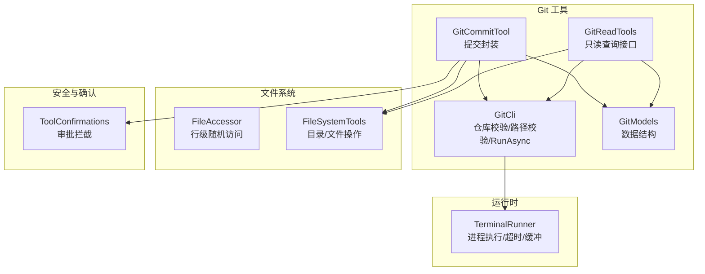
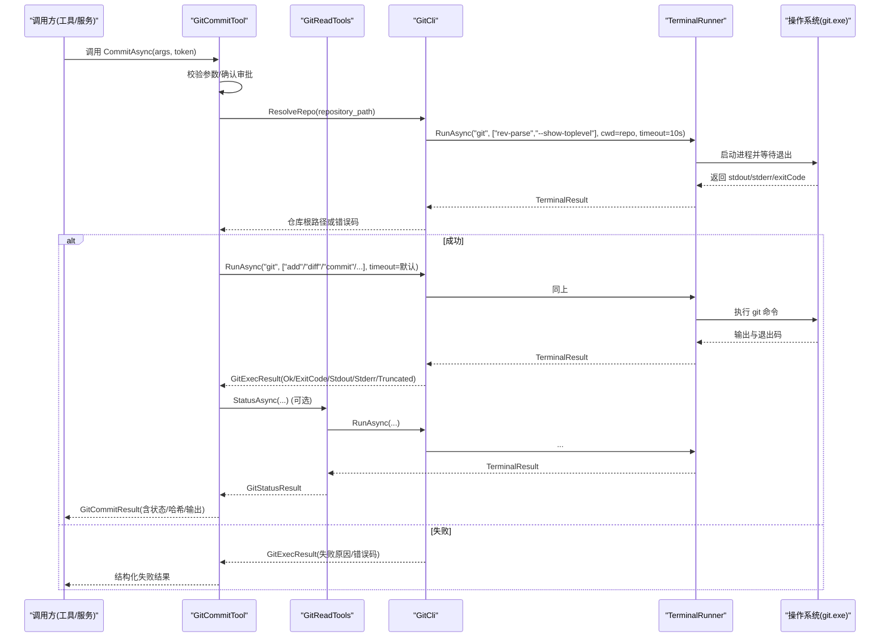
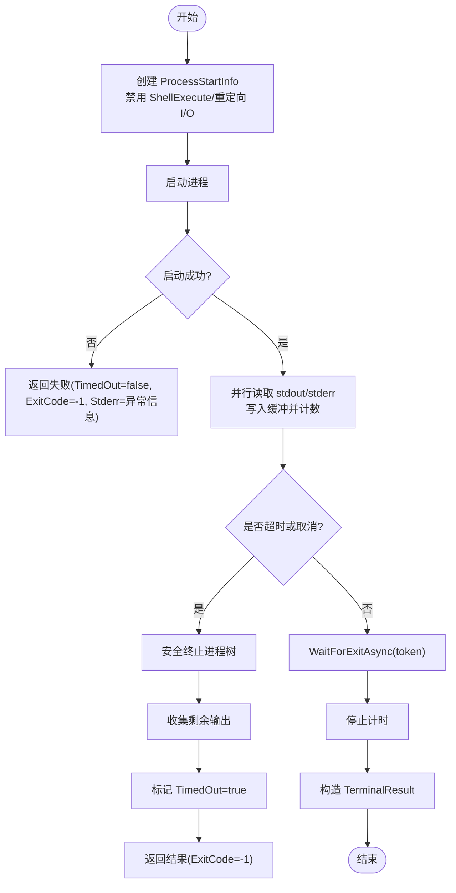
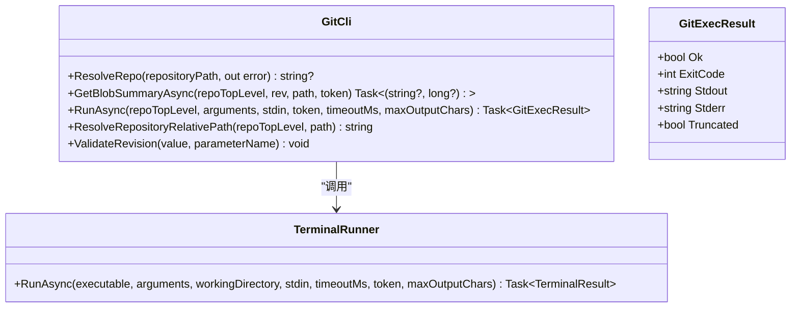
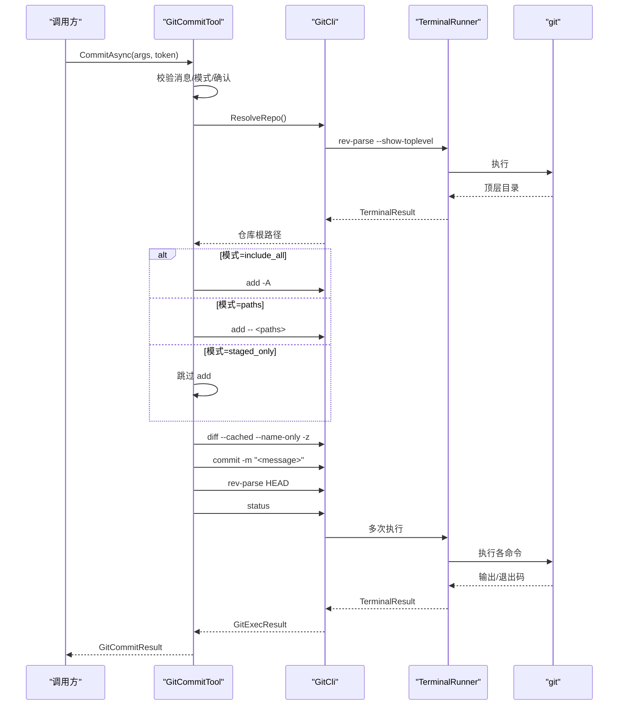
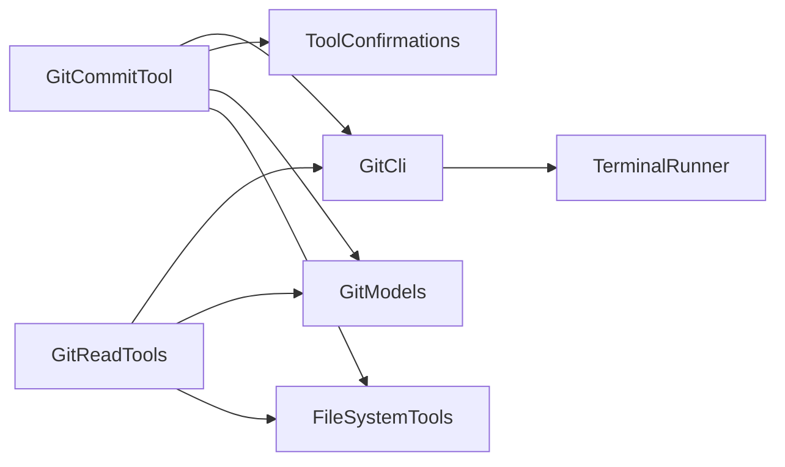

# Git CLI 封装

<cite>
**本文引用的文件**   
- [GitCli.cs](file://TinadecTools/Tools/Git/GitCli.cs)
- [TerminalRunner.cs](file://TinadecTools/Runtime/TerminalRunner.cs)
- [GitReadTools.cs](file://TinadecTools/Tools/Git/GitReadTools.cs)
- [GitCommitTool.cs](file://TinadecTools/Tools/Git/GitCommitTool.cs)
- [GitModels.cs](file://TinadecTools/Tools/Git/GitModels.cs)
- [FileAccessor.cs](file://TinadecTools/Tools/FileRW/FileAccessor.cs)
- [FileSystemTools.cs](file://TinadecTools/Tools/FileRW/FileSystemTools.cs)
- [ToolConfirmations.cs](file://TinadecTools/Tools/ToolConfirmations.cs)
- [GitCommitToolTests.cs](file://tests/TinadecTools.Tests/GitCommitToolTests.cs)
</cite>

## 目录
1. [简介](#简介)
2. [项目结构](#项目结构)
3. [核心组件](#核心组件)
4. [架构总览](#架构总览)
5. [详细组件分析](#详细组件分析)
6. [依赖关系分析](#依赖关系分析)
7. [性能考量](#性能考量)
8. [故障排查指南](#故障排查指南)
9. [结论](#结论)
10. [附录：命令调用示例与异常处理方案](#附录命令调用示例与异常处理方案)

## 简介
本文件系统化梳理并文档化仓库中 Git CLI 的封装实现，覆盖以下关键主题：
- Git 命令行调用的统一封装、参数构建与输出解析
- 工作目录管理、环境变量配置与进程生命周期控制
- 命令超时处理、缓冲区管理与异步操作支持
- 完整的 Git 命令调用示例与异常处理方案

该封装以 TerminalRunner 为底层进程执行器，通过 GitCli 提供安全、可观测、可测试的 Git 调用能力，并由上层工具（如 GitCommitTool、GitReadTools）组合使用。

## 项目结构
Git CLI 相关代码主要位于 TinadecTools 工程内，围绕“运行时进程执行”和“Git 工具集”两大层次组织：
- 运行时层：TerminalRunner 负责子进程创建、标准输入/输出/错误流读取、超时与取消、输出截断等。
- Git 工具层：GitCli 提供仓库校验、路径校验、通用 RunAsync 封装；GitReadTools、GitCommitTool 等提供具体业务能力的工具方法。
- 数据模型：GitModels 定义 diff、commit、ref 等结构化类型。
- 文件系统辅助：FileAccessor、FileSystemTools 提供文件读写与路径解析能力，被 Git 工具间接使用。
- 确认机制：ToolConfirmations 用于需要人工审批的操作（如提交）。

图表来源
- [TerminalRunner.cs:1-149](file://TinadecTools/Runtime/TerminalRunner.cs#L1-L149)
- [GitCli.cs:1-144](file://TinadecTools/Tools/Git/GitCli.cs#L1-L144)
- [GitReadTools.cs:1-200](file://TinadecTools/Tools/Git/GitReadTools.cs#L1-L200)
- [GitCommitTool.cs:1-149](file://TinadecTools/Tools/Git/GitCommitTool.cs#L1-L149)
- [GitModels.cs:1-123](file://TinadecTools/Tools/Git/GitModels.cs#L1-L123)
- [FileAccessor.cs:1-200](file://TinadecTools/Tools/FileRW/FileAccessor.cs#L1-L200)
- [FileSystemTools.cs:1-200](file://TinadecTools/Tools/FileRW/FileSystemTools.cs#L1-L200)
- [ToolConfirmations.cs](file://TinadecTools/Tools/ToolConfirmations.cs)

章节来源
- [TerminalRunner.cs:1-149](file://TinadecTools/Runtime/TerminalRunner.cs#L1-L149)
- [GitCli.cs:1-144](file://TinadecTools/Tools/Git/GitCli.cs#L1-L144)
- [GitReadTools.cs:1-200](file://TinadecTools/Tools/Git/GitReadTools.cs#L1-L200)
- [GitCommitTool.cs:1-149](file://TinadecTools/Tools/Git/GitCommitTool.cs#L1-L149)
- [GitModels.cs:1-123](file://TinadecTools/Tools/Git/GitModels.cs#L1-L123)
- [FileAccessor.cs:1-200](file://TinadecTools/Tools/FileRW/FileAccessor.cs#L1-L200)
- [FileSystemTools.cs:1-200](file://TinadecTools/Tools/FileRW/FileSystemTools.cs#L1-L200)
- [ToolConfirmations.cs](file://TinadecTools/Tools/ToolConfirmations.cs)

## 核心组件
- TerminalRunner：统一的进程执行器，负责：
  - 使用 ProcessStartInfo 启动外部程序，禁止 ShellExecute，避免注入风险
  - 重定向标准输入/输出/错误，支持可选 stdin
  - 基于 CancellationTokenSource 的超时与取消联动
  - 按字符上限限制输出捕获，标记是否截断
  - 失败时尝试安全终止进程树
- GitCli：Git 命令的统一入口，负责：
  - 仓库根目录校验（git rev-parse --show-toplevel）
  - 相对路径安全校验（确保在仓库范围内）
  - 通用 RunAsync：封装参数列表、超时、输出截断、git 缺失检测
  - 便捷方法：GetBlobSummaryAsync、ResolveRepositoryRelativePath、ValidateRevision
- GitReadTools：只读查询工具集合，定义大量请求/响应 DTO（状态、分支、工作区、引用、远程、blame、diff、冲突预览等），并通过 GitCli.RunAsync 调用 git 命令。
- GitCommitTool：提交工具，组合 add/diff/commit/rev-parse/status 等步骤，支持多种提交模式与路径白名单校验，要求确认审批。
- GitModels：结构化数据模型（commit、ref、diff hunk/line、patch file 等），供上层序列化与展示。
- FileAccessor/FileSystemTools：文件与目录操作，配合 WorkspacePathResolver（由 GitCli 间接使用）进行路径规范化与安全校验。
- ToolConfirmations：对危险操作进行前置确认拦截。

章节来源
- [TerminalRunner.cs:1-149](file://TinadecTools/Runtime/TerminalRunner.cs#L1-L149)
- [GitCli.cs:1-144](file://TinadecTools/Tools/Git/GitCli.cs#L1-L144)
- [GitReadTools.cs:1-200](file://TinadecTools/Tools/Git/GitReadTools.cs#L1-L200)
- [GitCommitTool.cs:1-149](file://TinadecTools/Tools/Git/GitCommitTool.cs#L1-L149)
- [GitModels.cs:1-123](file://TinadecTools/Tools/Git/GitModels.cs#L1-L123)
- [FileAccessor.cs:1-200](file://TinadecTools/Tools/FileRW/FileAccessor.cs#L1-L200)
- [FileSystemTools.cs:1-200](file://TinadecTools/Tools/FileRW/FileSystemTools.cs#L1-L200)
- [ToolConfirmations.cs](file://TinadecTools/Tools/ToolConfirmations.cs)

## 架构总览
下图展示了从高层工具到进程执行的完整调用链，以及关键的数据流转与错误传播路径。

图表来源
- [GitCommitTool.cs:35-149](file://TinadecTools/Tools/Git/GitCommitTool.cs#L35-L149)
- [GitCli.cs:22-122](file://TinadecTools/Tools/Git/GitCli.cs#L22-L122)
- [TerminalRunner.cs:18-110](file://TinadecTools/Runtime/TerminalRunner.cs#L18-L110)
- [GitReadTools.cs:1-200](file://TinadecTools/Tools/Git/GitReadTools.cs#L1-L200)

## 详细组件分析

### TerminalRunner：进程执行与生命周期控制
- 进程启动
  - 使用 ProcessStartInfo，禁用 UseShellExecute，强制 ArgumentList 传参，防止 shell 注入
  - 设置 WorkingDirectory，重定向标准输入/输出/错误
- 超时与取消
  - 内部创建 CancellationTokenSource 与外部 token 链接，支持超时与外部取消
  - 超时触发时，记录 TimedOut=true，并尝试 Kill(entireProcessTree: true)
- 输出缓冲与截断
  - 使用 StringBuilder + char[] 缓冲，按 maxOutputChars 限制捕获长度
  - 超过限制后继续消费流但不追加内容，标记 Truncated
- 返回值
  - TerminalResult 包含 Success、ExitCode、Stdout、Stderr、StdoutTruncated、StderrTruncated、TimedOut、DurationMs

图表来源
- [TerminalRunner.cs:18-110](file://TinadecTools/Runtime/TerminalRunner.cs#L18-L110)
- [TerminalRunner.cs:112-149](file://TinadecTools/Runtime/TerminalRunner.cs#L112-L149)

章节来源
- [TerminalRunner.cs:1-149](file://TinadecTools/Runtime/TerminalRunner.cs#L1-L149)

### GitCli：Git 命令封装与安全检查
- 仓库校验
  - 调用 git rev-parse --show-toplevel 验证是否为有效 worktree，并返回顶层目录
  - 若失败则返回错误信息
- 路径安全
  - ResolveRepositoryRelativePath 将路径解析为仓库相对路径，拒绝越界路径
- 通用执行
  - RunAsync 封装 TerminalRunner，统一超时、输出截断、git 缺失检测（stderr 包含特定文本时返回 GitNotFoundCode）
  - 当输出被截断时，返回 Truncated=true 的错误结果
- 便捷方法
  - GetBlobSummaryAsync：获取 blob hash 与字节大小
  - ValidateRevision：校验 revision 不以“-”开头，防止参数注入

图表来源
- [GitCli.cs:11-144](file://TinadecTools/Tools/Git/GitCli.cs#L11-L144)
- [TerminalRunner.cs:18-110](file://TinadecTools/Runtime/TerminalRunner.cs#L18-L110)

章节来源
- [GitCli.cs:1-144](file://TinadecTools/Tools/Git/GitCli.cs#L1-L144)

### GitReadTools：只读查询工具集
- 提供丰富的只读查询 DTO（状态、分支、工作区、引用、远程、blame、diff、冲突预览等）
- 所有查询最终通过 GitCli.RunAsync 调用 git 命令，遵循统一的超时、缓冲与错误处理策略
- 典型流程：参数校验 -> 仓库解析 -> 构建 git 参数列表 -> 执行 -> 解析输出 -> 返回结构化结果

章节来源
- [GitReadTools.cs:1-200](file://TinadecTools/Tools/Git/GitReadTools.cs#L1-L200)

### GitCommitTool：提交封装与多模式支持
- 提交模式
  - include_all：添加所有变更（包括未跟踪）
  - commit_staged_only：仅提交暂存区
  - paths：仅提交指定路径（需通过仓库相对路径校验）
- 流程
  - 校验消息与模式互斥性
  - 根据模式执行 git add / diff --cached / commit / rev-parse HEAD / status
  - 返回结构化结果（成功/失败、模式、暂存文件、提交哈希、状态）
- 安全与确认
  - 使用 ToolConfirmations.Require 强制确认
  - 路径必须位于仓库内，否则抛出 UnauthorizedAccessException

图表来源
- [GitCommitTool.cs:35-149](file://TinadecTools/Tools/Git/GitCommitTool.cs#L35-L149)
- [GitCli.cs:22-122](file://TinadecTools/Tools/Git/GitCli.cs#L22-L122)
- [TerminalRunner.cs:18-110](file://TinadecTools/Runtime/TerminalRunner.cs#L18-L110)

章节来源
- [GitCommitTool.cs:1-149](file://TinadecTools/Tools/Git/GitCommitTool.cs#L1-L149)

### GitModels：数据结构
- 定义 commit、ref、diff hunk/line、patch file 等结构化类型，便于 JSON 序列化与前端展示
- 字段命名采用下划线风格，适配 JSON 属性名

章节来源
- [GitModels.cs:1-123](file://TinadecTools/Tools/Git/GitModels.cs#L1-L123)

### 文件系统与路径解析
- FileAccessor：高效行级随机访问，适合大文件读取场景
- FileSystemTools：目录枚举、文件统计、写文件（带哈希校验与原子替换）
- WorkspacePathResolver：由 GitCli 与 FileSystemTools 间接使用，负责路径规范化与安全校验（不在本节直接展开）

章节来源
- [FileAccessor.cs:1-200](file://TinadecTools/Tools/FileRW/FileAccessor.cs#L1-L200)
- [FileSystemTools.cs:1-200](file://TinadecTools/Tools/FileRW/FileSystemTools.cs#L1-L200)

## 依赖关系分析
- GitCli 依赖 TerminalRunner 完成进程执行
- GitReadTools/GitCommitTool 依赖 GitCli 作为统一入口
- GitCommitTool 依赖 ToolConfirmations 进行审批拦截
- GitReadTools/GitCommitTool 依赖 GitModels 进行数据建模
- GitCli/FileSystemTools 依赖 WorkspacePathResolver（间接）进行路径安全校验

图表来源
- [GitCommitTool.cs:1-149](file://TinadecTools/Tools/Git/GitCommitTool.cs#L1-L149)
- [GitReadTools.cs:1-200](file://TinadecTools/Tools/Git/GitReadTools.cs#L1-L200)
- [GitCli.cs:1-144](file://TinadecTools/Tools/Git/GitCli.cs#L1-L144)
- [TerminalRunner.cs:1-149](file://TinadecTools/Runtime/TerminalRunner.cs#L1-L149)
- [ToolConfirmations.cs](file://TinadecTools/Tools/ToolConfirmations.cs)
- [GitModels.cs:1-123](file://TinadecTools/Tools/Git/GitModels.cs#L1-L123)
- [FileSystemTools.cs:1-200](file://TinadecTools/Tools/FileRW/FileSystemTools.cs#L1-L200)

章节来源
- [GitCommitTool.cs:1-149](file://TinadecTools/Tools/Git/GitCommitTool.cs#L1-L149)
- [GitReadTools.cs:1-200](file://TinadecTools/Tools/Git/GitReadTools.cs#L1-L200)
- [GitCli.cs:1-144](file://TinadecTools/Tools/Git/GitCli.cs#L1-L144)
- [TerminalRunner.cs:1-149](file://TinadecTools/Runtime/TerminalRunner.cs#L1-L149)
- [ToolConfirmations.cs](file://TinadecTools/Tools/ToolConfirmations.cs)
- [GitModels.cs:1-123](file://TinadecTools/Tools/Git/GitModels.cs#L1-L123)
- [FileSystemTools.cs:1-200](file://TinadecTools/Tools/FileRW/FileSystemTools.cs#L1-L200)

## 性能考量
- 输出缓冲限制
  - TerminalRunner 默认最大输出字符数较小，避免内存膨胀；GitCli 允许上层传入更大的 maxOutputChars
  - 超出限制会标记 Truncated，调用方可据此采取分页或采样策略
- 超时与取消
  - 所有命令均支持超时与取消，避免长时间阻塞
  - 超时会导致 ExitCode=-1 且 TimedOut=true，调用方应区分“超时”与“命令失败”
- 进程树清理
  - 超时或取消时会尝试终止整个进程树，减少僵尸进程
- 参数安全
  - 全部通过 ArgumentList 传递，避免 shell 拼接注入
- 路径安全
  - 严格校验路径在仓库范围内，防止越界访问

[本节为通用指导，不直接分析具体文件]

## 故障排查指南
- Git 未找到
  - 现象：GitExecResult.Stderr 包含“cannot find”字样，GitCli 返回 GitNotFoundCode
  - 处理：检查系统 PATH 或 git 安装位置
- 非 Git 仓库
  - 现象：ResolveRepo 失败，返回 NotARepoCode 或自定义错误信息
  - 处理：确认 repository_path 指向有效的 Git 仓库
- 输出被截断
  - 现象：GitExecResult.Truncated=true
  - 处理：增大 maxOutputChars 或改用增量/分页读取
- 提交无暂存变更
  - 现象：ErrorCode=no_staged_changes
  - 处理：先执行 add 或将模式改为 include_all/paths
- 路径越界
  - 现象：UnauthorizedAccessException
  - 处理：确保路径在仓库范围内
- 超时
  - 现象：TerminalResult.TimedOut=true，ExitCode=-1
  - 处理：增加 timeoutMs 或优化命令逻辑

章节来源
- [GitCli.cs:88-122](file://TinadecTools/Tools/Git/GitCli.cs#L88-L122)
- [GitCommitTool.cs:122-149](file://TinadecTools/Tools/Git/GitCommitTool.cs#L122-L149)
- [TerminalRunner.cs:73-110](file://TinadecTools/Runtime/TerminalRunner.cs#L73-L110)

## 结论
本封装通过 TerminalRunner 与 GitCli 构建了稳定、安全、可观测的 Git CLI 调用层，结合 GitReadTools/GitCommitTool 提供了丰富的只读与写能力。其设计强调：
- 安全性：ArgumentList 传参、路径白名单校验、审批拦截
- 健壮性：超时、取消、输出截断、进程树清理
- 可观测性：结构化错误码与结果对象
- 可扩展性：清晰的职责分层与数据模型

## 附录：命令调用示例与异常处理方案
- 基本调用流程
  - 调用 GitCli.ResolveRepo 校验仓库
  - 使用 GitCli.RunAsync 执行 git 命令，传入 timeoutMs 与 cancellationToken
  - 根据 GitExecResult.Ok/ExitCode/Stderr 判断成功与否
- 提交示例（概念性）
  - 选择提交模式（include_all/staged_only/paths）
  - 执行 add/diff/commit/rev-parse/status
  - 返回 GitCommitResult，包含 success/error_code/mode/staged_files/commit_hash/status
- 常见异常处理
  - git_not_found：提示安装 git 或修正 PATH
  - not_a_repo：提示用户选择正确仓库路径
  - no_staged_changes：提示先 add 或切换模式
  - truncated_output：提示增大输出限制或分页读取
  - unauthorized_access：提示路径必须在仓库内

章节来源
- [GitCommitToolTests.cs:1-199](file://tests/TinadecTools.Tests/GitCommitToolTests.cs#L1-L199)
- [GitCommitTool.cs:35-149](file://TinadecTools/Tools/Git/GitCommitTool.cs#L35-L149)
- [GitCli.cs:22-122](file://TinadecTools/Tools/Git/GitCli.cs#L22-L122)
- [TerminalRunner.cs:18-110](file://TinadecTools/Runtime/TerminalRunner.cs#L18-L110)