# Git 集成工具

<cite>
**本文引用的文件**   
- [GitCli.cs](file://TinadecTools/Tools/Git/GitCli.cs)
- [GitCommitTool.cs](file://TinadecTools/Tools/Git/GitCommitTool.cs)
- [GitBranchTools.cs](file://TinadecTools/Tools/Git/GitBranchTools.cs)
- [DiffParser.cs](file://TinadecTools/Tools/Git/DiffParser.cs)
- [GitConflictResolveTool.cs](file://TinadecTools/Tools/Git/GitConflictResolveTool.cs)
- [GitIntegrationTools.cs](file://TinadecTools/Tools/Git/GitIntegrationTools.cs)
- [GitReadTools.cs](file://TinadecTools/Tools/Git/GitReadTools.cs)
- [GitRemoteMutationTools.cs](file://TinadecTools/Tools/Git/GitRemoteMutationTools.cs)
- [GitWorktreeMutationTools.cs](file://TinadecTools/Tools/Git/GitWorktreeMutationTools.cs)
- [GitModels.cs](file://TinadecTools/Tools/Git/GitModels.cs)
- [GitPatchLoader.cs](file://TinadecTools/Tools/Git/GitPatchLoader.cs)
- [ThreeWayTextMerge.cs](file://TinadecTools/Tools/Git/ThreeWayTextMerge.cs)
- [LaneAssigner.cs](file://TinadecTools/Tools/Git/LaneAssigner.cs)
- [LogRefTypeMap.cs](file://TinadecTools/Tools/Git/LogRefTypeMap.cs)
</cite>

## 目录
1. [简介](#简介)
2. [项目结构](#项目结构)
3. [核心组件](#核心组件)
4. [架构总览](#架构总览)
5. [详细组件分析](#详细组件分析)
6. [依赖关系分析](#依赖关系分析)
7. [性能考量](#性能考量)
8. [故障排查指南](#故障排查指南)
9. [结论](#结论)
10. [附录：工作流示例与最佳实践](#附录工作流示例与最佳实践)

## 简介
本仓库的 Git 集成工具提供对 Git 命令行的安全封装，覆盖提交管理、分支操作、差异解析、冲突解决、合并策略、补丁应用与回滚、远程操作、工作区管理与版本历史查询等能力。所有对外暴露的能力以“工具函数”形式组织，统一通过 TerminalRunner 执行 git 子进程，参数使用 ArgumentList 构建，避免 Shell 注入；同时内置仓库与工作区路径校验、输出大小限制与超时控制，确保在自动化环境中稳定运行。

## 项目结构
Git 相关代码集中在 TinadecTools/Tools/Git 目录下，按职责划分为 CLI 封装、只读读取、变更操作（提交/分支/远程/工作树）、差异与冲突处理、模型与辅助算法等模块。

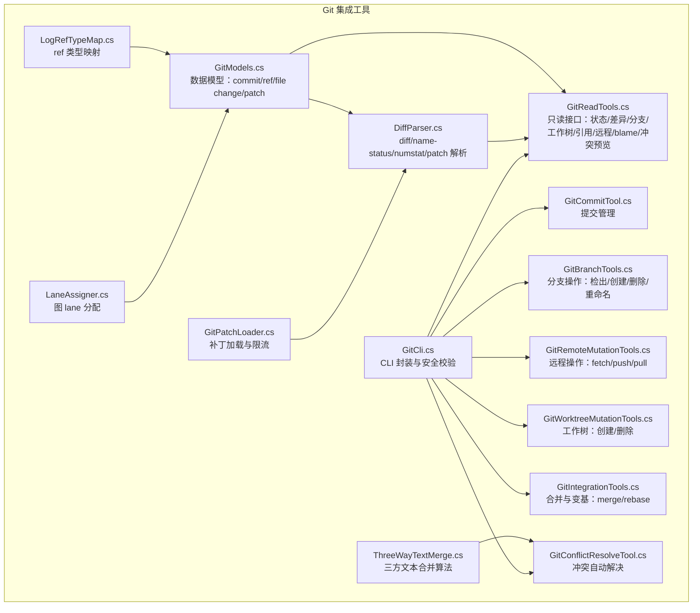

**图表来源** 
- [GitCli.cs:1-144](file://TinadecTools/Tools/Git/GitCli.cs#L1-L144)
- [GitReadTools.cs:1-554](file://TinadecTools/Tools/Git/GitReadTools.cs#L1-L554)
- [GitCommitTool.cs:1-149](file://TinadecTools/Tools/Git/GitCommitTool.cs#L1-L149)
- [GitBranchTools.cs:1-105](file://TinadecTools/Tools/Git/GitBranchTools.cs#L1-L105)
- [GitRemoteMutationTools.cs:1-119](file://TinadecTools/Tools/Git/GitRemoteMutationTools.cs#L1-L119)
- [GitWorktreeMutationTools.cs:1-108](file://TinadecTools/Tools/Git/GitWorktreeMutationTools.cs#L1-L108)
- [GitIntegrationTools.cs:1-83](file://TinadecTools/Tools/Git/GitIntegrationTools.cs#L1-L83)
- [GitConflictResolveTool.cs:1-87](file://TinadecTools/Tools/Git/GitConflictResolveTool.cs#L1-L87)
- [DiffParser.cs:1-316](file://TinadecTools/Tools/Git/DiffParser.cs#L1-L316)
- [GitPatchLoader.cs:1-42](file://TinadecTools/Tools/Git/GitPatchLoader.cs#L1-L42)
- [ThreeWayTextMerge.cs:1-143](file://TinadecTools/Tools/Git/ThreeWayTextMerge.cs#L1-L143)
- [GitModels.cs:1-123](file://TinadecTools/Tools/Git/GitModels.cs#L1-L123)
- [LaneAssigner.cs:1-84](file://TinadecTools/Tools/Git/LaneAssigner.cs#L1-L84)
- [LogRefTypeMap.cs:1-34](file://TinadecTools/Tools/Git/LogRefTypeMap.cs#L1-L34)

**章节来源**
- [GitCli.cs:1-144](file://TinadecTools/Tools/Git/GitCli.cs#L1-L144)
- [GitReadTools.cs:1-554](file://TinadecTools/Tools/Git/GitReadTools.cs#L1-L554)

## 核心组件
- GitCli：统一的 Git 命令行执行器，负责仓库根定位、路径白名单校验、参数安全构造、输出截断与错误码标准化。
- GitReadTools：只读能力集合，包括状态、差异、分支列表、工作树列表、引用列表、远程列表、blame、指定修订的文件内容、冲突预览等。
- GitCommitTool：提交封装，支持三种模式（全部包含、仅暂存、指定路径），返回提交哈希与状态。
- GitBranchTools：分支操作封装，支持检出、创建、删除、重命名，含名称合法性检查与当前分支保护。
- GitRemoteMutationTools：远程操作封装，支持 fetch/push/pull，含前置条件校验与上游分支设置。
- GitWorktreeMutationTools：工作树管理，支持创建/删除，强制路径隔离到 .tinadec/worktrees。
- GitIntegrationTools：合并与变基封装，支持 start/continue/abort/skip 等操作与 no_ff/ff_only/squash 策略。
- GitConflictResolveTool：冲突自动解决，支持 ours/theirs/auto/both 策略，基于 ThreeWayTextMerge 进行文本合并。
- DiffParser/GitPatchLoader：差异与补丁解析，支持 name-status/numstat/unified diff，带字节预算与截断控制。
- ThreeWayTextMerge：三方文本合并算法，支持标记/ours/theirs/both 四种结果模式。
- LaneAssigner/LogRefTypeMap/GitModels：图可视化与模型定义，用于 commit 图 lane 分配与 ref 类型映射。

**章节来源**
- [GitCli.cs:1-144](file://TinadecTools/Tools/Git/GitCli.cs#L1-L144)
- [GitReadTools.cs:1-554](file://TinadecTools/Tools/Git/GitReadTools.cs#L1-L554)
- [GitCommitTool.cs:1-149](file://TinadecTools/Tools/Git/GitCommitTool.cs#L1-L149)
- [GitBranchTools.cs:1-105](file://TinadecTools/Tools/Git/GitBranchTools.cs#L1-L105)
- [GitRemoteMutationTools.cs:1-119](file://TinadecTools/Tools/Git/GitRemoteMutationTools.cs#L1-L119)
- [GitWorktreeMutationTools.cs:1-108](file://TinadecTools/Tools/Git/GitWorktreeMutationTools.cs#L1-L108)
- [GitIntegrationTools.cs:1-83](file://TinadecTools/Tools/Git/GitIntegrationTools.cs#L1-L83)
- [GitConflictResolveTool.cs:1-87](file://TinadecTools/Tools/Git/GitConflictResolveTool.cs#L1-L87)
- [DiffParser.cs:1-316](file://TinadecTools/Tools/Git/DiffParser.cs#L1-L316)
- [GitPatchLoader.cs:1-42](file://TinadecTools/Tools/Git/GitPatchLoader.cs#L1-L42)
- [ThreeWayTextMerge.cs:1-143](file://TinadecTools/Tools/Git/ThreeWayTextMerge.cs#L1-L143)
- [LaneAssigner.cs:1-84](file://TinadecTools/Tools/Git/LaneAssigner.cs#L1-L84)
- [LogRefTypeMap.cs:1-34](file://TinadecTools/Tools/Git/LogRefTypeMap.cs#L1-L34)
- [GitModels.cs:1-123](file://TinadecTools/Tools/Git/GitModels.cs#L1-L123)

## 架构总览
整体采用“工具函数 + CLI 封装 + 解析器/算法”的分层设计。上层工具函数负责参数校验、确认机制与业务编排；中间层 GitCli 负责安全执行与错误归一化；底层解析器与算法专注数据结构转换与计算。

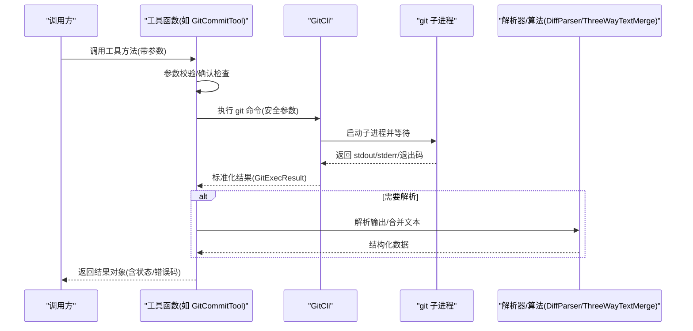

**图表来源** 
- [GitCommitTool.cs:35-120](file://TinadecTools/Tools/Git/GitCommitTool.cs#L35-L120)
- [GitCli.cs:88-122](file://TinadecTools/Tools/Git/GitCli.cs#L88-L122)
- [DiffParser.cs:144-259](file://TinadecTools/Tools/Git/DiffParser.cs#L144-L259)
- [ThreeWayTextMerge.cs:16-89](file://TinadecTools/Tools/Git/ThreeWayTextMerge.cs#L16-L89)

## 详细组件分析

### Git 命令行封装（GitCli）
- 仓库解析：通过 rev-parse --show-toplevel 验证是否为有效 worktree，并限制在工作区内。
- 安全执行：所有参数通过 ArgumentList 传递，禁止字符串拼接；捕获 git 未找到、输出超限、异常等场景。
- 路径校验：ResolveRepositoryRelativePath 保证路径位于仓库内，防止越权访问。
- 修订校验：ValidateRevision 拒绝以“-”开头的非法修订名。

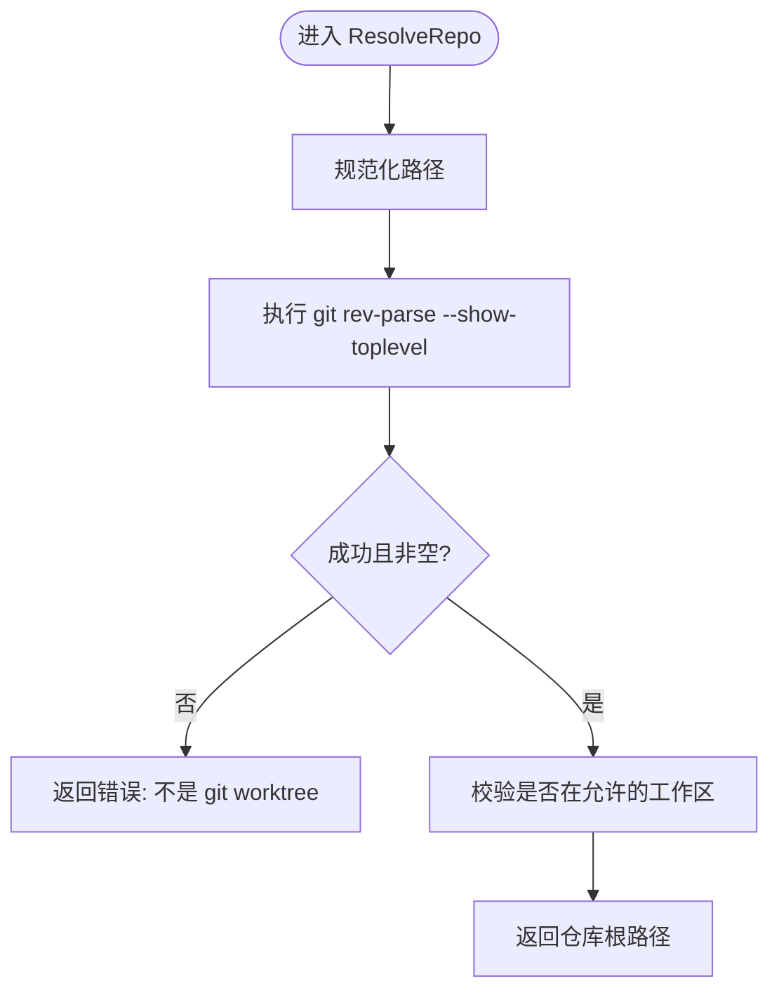

**图表来源** 
- [GitCli.cs:22-59](file://TinadecTools/Tools/Git/GitCli.cs#L22-L59)

**章节来源**
- [GitCli.cs:1-144](file://TinadecTools/Tools/Git/GitCli.cs#L1-L144)

### 提交管理（GitCommitTool）
- 模式选择：include_all、commit_staged_only、paths 三者互斥且必须选择一个。
- 暂存流程：根据模式执行 git add，随后 diff --cached --name-only 获取暂存文件列表。
- 提交执行：git commit -m 后读取 HEAD 哈希，返回提交结果与状态。
- 错误处理：无暂存变更时返回 no_staged_changes 错误码，附带当前状态。

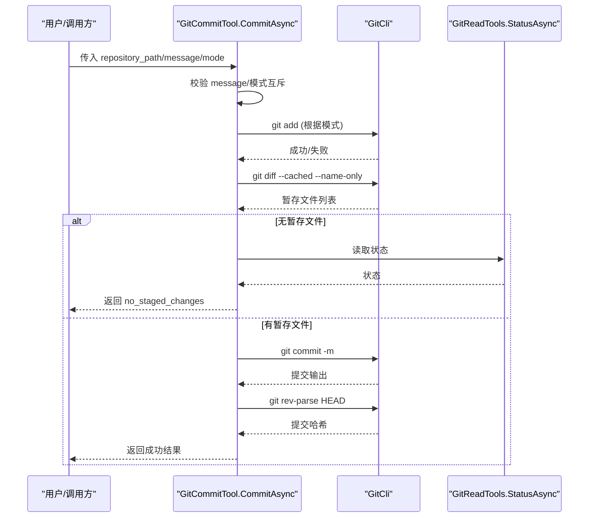

**图表来源** 
- [GitCommitTool.cs:35-120](file://TinadecTools/Tools/Git/GitCommitTool.cs#L35-L120)
- [GitReadTools.cs:273-280](file://TinadecTools/Tools/Git/GitReadTools.cs#L273-L280)

**章节来源**
- [GitCommitTool.cs:1-149](file://TinadecTools/Tools/Git/GitCommitTool.cs#L1-L149)

### 分支操作（GitBranchTools）
- 操作类型：checkout、create、delete、rename，均需要确认参数。
- 名称校验：check-ref-format --branch 验证分支名合法性。
- 保护逻辑：删除当前分支直接拒绝；删除前可强制选项。
- 结果返回：包含 action、branch/new_name、force、输出与状态。

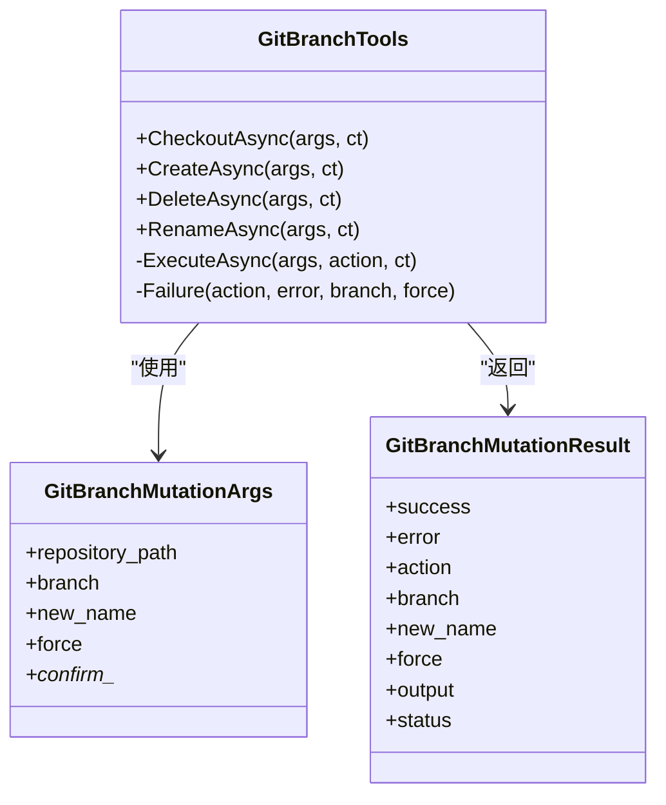

**图表来源** 
- [GitBranchTools.cs:37-104](file://TinadecTools/Tools/Git/GitBranchTools.cs#L37-L104)

**章节来源**
- [GitBranchTools.cs:1-105](file://TinadecTools/Tools/Git/GitBranchTools.cs#L1-L105)

### 差异解析（DiffParser / GitPatchLoader）
- name-status/numstat 解析：支持 \0 分隔与换行两种格式，兼容重命名/复制相似度分数。
- unified diff 解析：提取文件头、hunk 头、行级变更，处理二进制文件与末尾换行。
- 补丁加载：限制最大字节数，超过则返回截断原因与已捕获字节数。

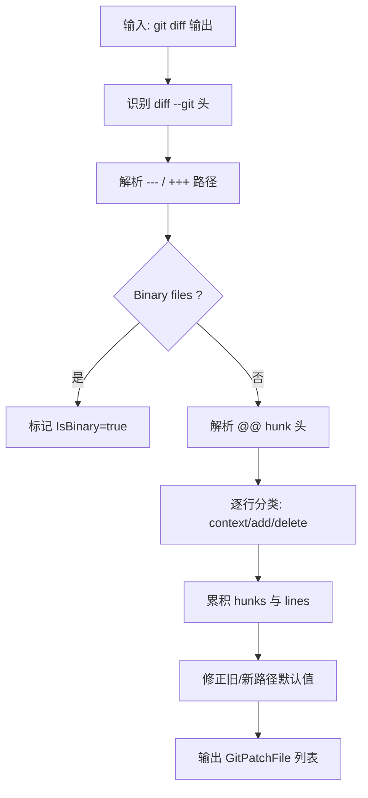

**图表来源** 
- [DiffParser.cs:144-259](file://TinadecTools/Tools/Git/DiffParser.cs#L144-L259)
- [GitPatchLoader.cs:13-40](file://TinadecTools/Tools/Git/GitPatchLoader.cs#L13-L40)

**章节来源**
- [DiffParser.cs:1-316](file://TinadecTools/Tools/Git/DiffParser.cs#L1-L316)
- [GitPatchLoader.cs:1-42](file://TinadecTools/Tools/Git/GitPatchLoader.cs#L1-L42)

### 冲突解决（GitConflictResolveTool + ThreeWayTextMerge）
- 策略支持：auto、ours、theirs、both；二进制冲突不支持 auto/both。
- 自动合并：基于 ThreeWayTextMerge 进行三方文本合并，统计冲突块数量。
- 写入与暂存：将合并结果写回文件，执行 git add -A 暂存，返回剩余冲突文件列表。

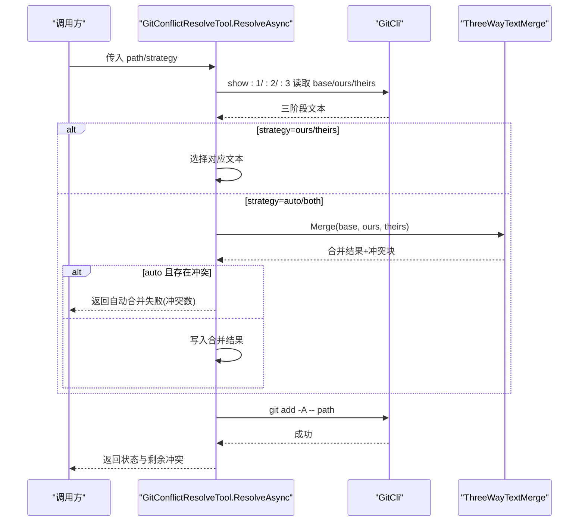

**图表来源** 
- [GitConflictResolveTool.cs:34-77](file://TinadecTools/Tools/Git/GitConflictResolveTool.cs#L34-L77)
- [ThreeWayTextMerge.cs:16-89](file://TinadecTools/Tools/Git/ThreeWayTextMerge.cs#L16-L89)

**章节来源**
- [GitConflictResolveTool.cs:1-87](file://TinadecTools/Tools/Git/GitConflictResolveTool.cs#L1-L87)
- [ThreeWayTextMerge.cs:1-143](file://TinadecTools/Tools/Git/ThreeWayTextMerge.cs#L1-L143)

### 合并与变基（GitIntegrationTools）
- 操作集：merge/rebase，支持 start/continue/abort 及 rebase 的 skip。
- 策略：no_ff/ff_only/squash 用于 merge；rebase 序列编辑器禁用。
- 冲突检测：通过 Status 中 conflicted_files 判断是否产生冲突。

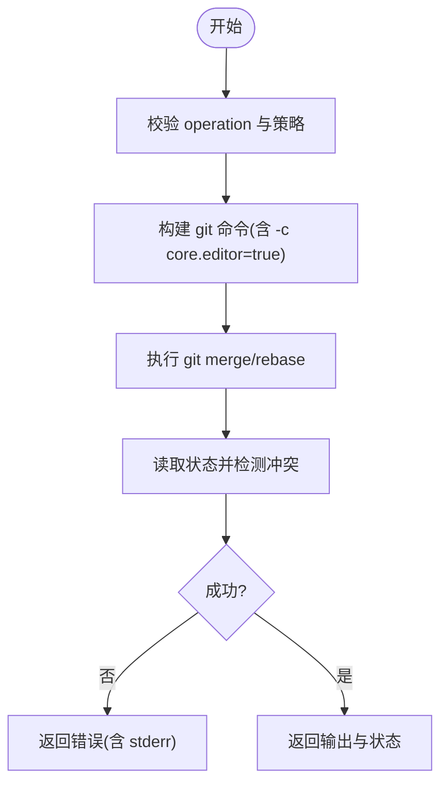

**图表来源** 
- [GitIntegrationTools.cs:37-82](file://TinadecTools/Tools/Git/GitIntegrationTools.cs#L37-L82)

**章节来源**
- [GitIntegrationTools.cs:1-83](file://TinadecTools/Tools/Git/GitIntegrationTools.cs#L1-L83)

### 远程操作（GitRemoteMutationTools）
- fetch：可选 prune，支持指定 remote 或 --all。
- push：前置检查 detached HEAD、未提交变更、behind 情况；首次推送可设置 upstream。
- pull：要求 ff-only，支持指定 remote+branch 或上游分支。

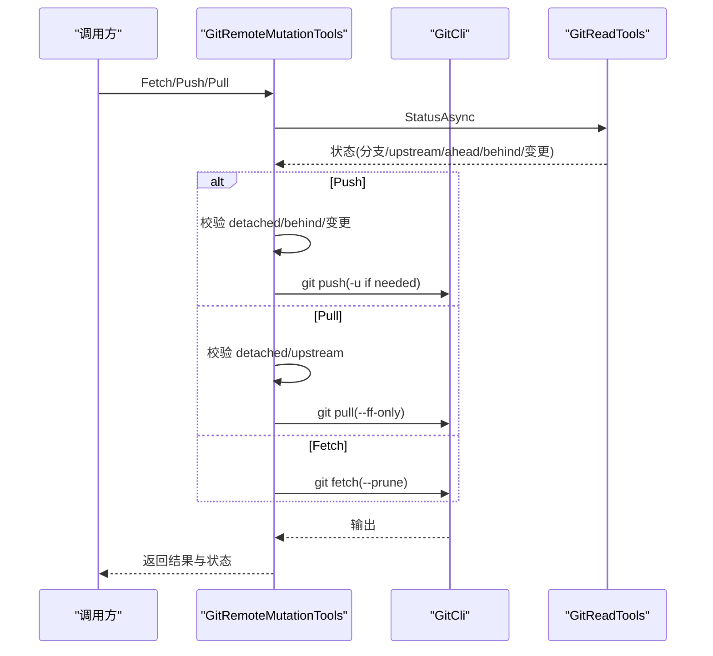

**图表来源** 
- [GitRemoteMutationTools.cs:42-108](file://TinadecTools/Tools/Git/GitRemoteMutationTools.cs#L42-L108)
- [GitReadTools.cs:273-293](file://TinadecTools/Tools/Git/GitReadTools.cs#L273-L293)

**章节来源**
- [GitRemoteMutationTools.cs:1-119](file://TinadecTools/Tools/Git/GitRemoteMutationTools.cs#L1-L119)

### 工作区管理（GitWorktreeMutationTools）
- 创建：路径强制落在 .tinadec/worktrees 下，若分支不存在则从 start_ref 创建新分支。
- 删除：禁止删除当前 worktree，支持 --force。
- 结果：返回更新后的 worktree 列表。

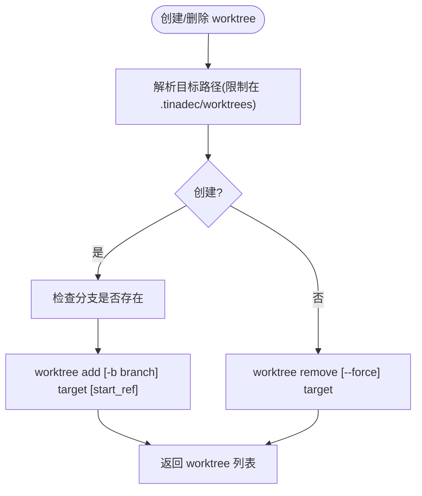

**图表来源** 
- [GitWorktreeMutationTools.cs:39-83](file://TinadecTools/Tools/Git/GitWorktreeMutationTools.cs#L39-L83)

**章节来源**
- [GitWorktreeMutationTools.cs:1-108](file://TinadecTools/Tools/Git/GitWorktreeMutationTools.cs#L1-L108)

### 只读能力（GitReadTools）
- 状态：解析 porcelain v1 输出，生成文件级状态与分支信息。
- 差异：支持 working_tree/staged/ref_range，限制文件数与字节数，合并 name-status/numstat。
- 分支/工作树/引用/远程：分别解析 for-each-ref/worktree list/remote 列表。
- blame：line-porcelain 解析，支持行范围与输出限制。
- 文件内容：按修订读取 blob，检测二进制与截断。
- 冲突预览：ls-files -u 扫描冲突文件，解析冲突块。

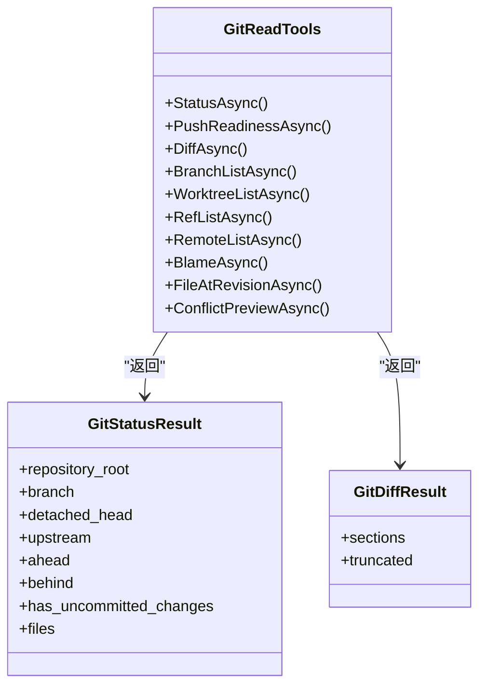

**图表来源** 
- [GitReadTools.cs:271-554](file://TinadecTools/Tools/Git/GitReadTools.cs#L271-L554)

**章节来源**
- [GitReadTools.cs:1-554](file://TinadecTools/Tools/Git/GitReadTools.cs#L1-L554)

### 模型与辅助（GitModels / LaneAssigner / LogRefTypeMap）
- GitModels：定义 commit、ref、file change、patch/hunks 等数据结构。
- LaneAssigner：为 commit 图分配 lane，便于可视化展示。
- LogRefTypeMap：一次性加载 ref 短名到类型的映射，供日志解析使用。

**章节来源**
- [GitModels.cs:1-123](file://TinadecTools/Tools/Git/GitModels.cs#L1-L123)
- [LaneAssigner.cs:1-84](file://TinadecTools/Tools/Git/LaneAssigner.cs#L1-L84)
- [LogRefTypeMap.cs:1-34](file://TinadecTools/Tools/Git/LogRefTypeMap.cs#L1-L34)

## 依赖关系分析
- 工具函数依赖 GitCli 进行安全执行，部分工具依赖 GitReadTools 获取状态。
- DiffParser 被 GitReadTools 与 GitPatchLoader 复用，ThreeWayTextMerge 被冲突解决工具使用。
- LaneAssigner 与 LogRefTypeMap 服务于 commit 图与日志解析。

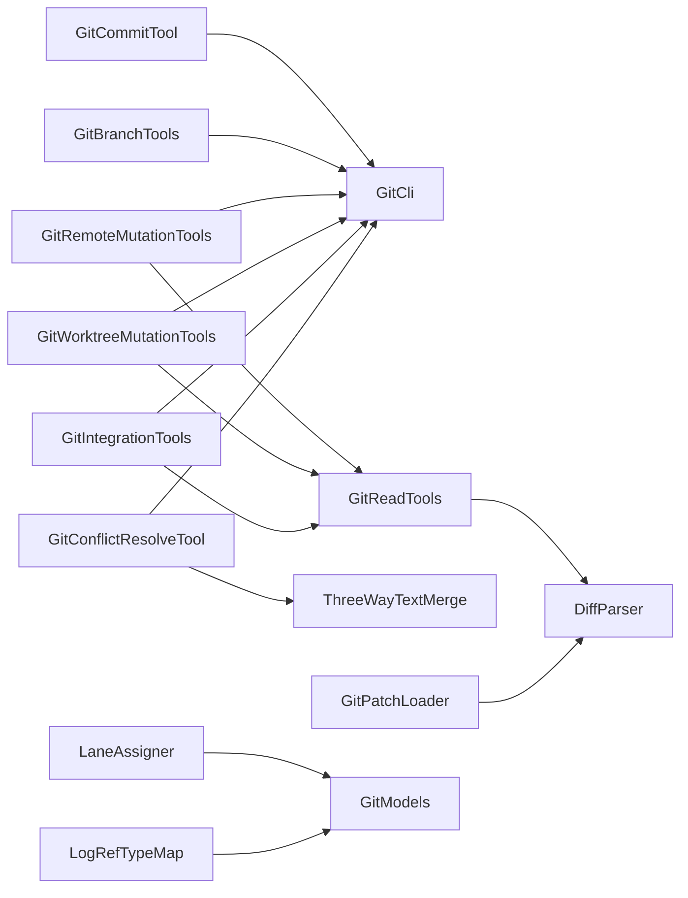

**图表来源** 
- [GitCommitTool.cs:35-120](file://TinadecTools/Tools/Git/GitCommitTool.cs#L35-L120)
- [GitBranchTools.cs:55-100](file://TinadecTools/Tools/Git/GitBranchTools.cs#L55-L100)
- [GitRemoteMutationTools.cs:42-108](file://TinadecTools/Tools/Git/GitRemoteMutationTools.cs#L42-L108)
- [GitWorktreeMutationTools.cs:39-83](file://TinadecTools/Tools/Git/GitWorktreeMutationTools.cs#L39-L83)
- [GitIntegrationTools.cs:45-78](file://TinadecTools/Tools/Git/GitIntegrationTools.cs#L45-L78)
- [GitConflictResolveTool.cs:34-77](file://TinadecTools/Tools/Git/GitConflictResolveTool.cs#L34-L77)
- [GitReadTools.cs:475-496](file://TinadecTools/Tools/Git/GitReadTools.cs#L475-L496)
- [GitPatchLoader.cs:13-40](file://TinadecTools/Tools/Git/GitPatchLoader.cs#L13-L40)

**章节来源**
- [GitCli.cs:1-144](file://TinadecTools/Tools/Git/GitCli.cs#L1-L144)
- [GitReadTools.cs:1-554](file://TinadecTools/Tools/Git/GitReadTools.cs#L1-L554)

## 性能考量
- 输出限制：所有 git 命令调用支持 maxOutputChars，避免大输出导致内存压力；差异与补丁加载支持字节预算与截断原因。
- 超时控制：默认 60s，部分命令（如 rev-parse）使用较短超时，网络操作（fetch/push/pull）延长至 60s。
- 解析优化：name-status/numstat 支持 \0 分隔快速分割；LCS 计算限制 MaxLcsCells 防止 OOM。
- 批量读取：for-each-ref 一次性加载 ref 映射，减少多次调用开销。

[本节为通用指导，不直接分析具体文件]

## 故障排查指南
- git_not_found：Git 未安装或不在 PATH，检查环境。
- not_a_repo：路径不是 git worktree 或不在允许工作区，确认仓库根与工作区配置。
- no_staged_changes：提交前未暂存任何变更，先执行 add。
- 分支名无效：check-ref-format 失败，检查命名规范。
- 无法删除当前分支：删除前需切换分支。
- 推送失败：detached HEAD、未提交变更、behind 上游，先提交或拉取。
- 冲突自动解决失败：auto 模式下仍存在重叠冲突，改用 ours/theirs 或手动编辑。
- 输出截断：max_output_bytes 或 patch_output_limit 触发，调整预算或分批处理。

**章节来源**
- [GitCli.cs:15-17](file://TinadecTools/Tools/Git/GitCli.cs#L15-L17)
- [GitCommitTool.cs:86-97](file://TinadecTools/Tools/Git/GitCommitTool.cs#L86-L97)
- [GitBranchTools.cs:78-94](file://TinadecTools/Tools/Git/GitBranchTools.cs#L78-L94)
- [GitRemoteMutationTools.cs:66-85](file://TinadecTools/Tools/Git/GitRemoteMutationTools.cs#L66-L85)
- [GitConflictResolveTool.cs:48-64](file://TinadecTools/Tools/Git/GitConflictResolveTool.cs#L48-L64)
- [GitPatchLoader.cs:29-37](file://TinadecTools/Tools/Git/GitPatchLoader.cs#L29-L37)

## 结论
该 Git 集成工具以安全、可控、可扩展的方式封装了常用 Git 操作，结合严格的参数校验、输出限制与错误码标准化，适合在自动化与 Agent 场景中稳定使用。通过分层设计与模块化解析/算法，既保证了性能与可靠性，也为后续扩展（如更多合并策略、补丁应用、回滚操作）提供了清晰的基础。

[本节为总结性内容，不直接分析具体文件]

## 附录：工作流示例与最佳实践
- 初始化仓库：确保路径为有效 worktree；必要时先创建仓库再执行后续操作。
- 日常提交：选择合适模式（全部/暂存/路径），确保 message 合法，成功后检查状态。
- 分支协作：创建/切换/删除/重命名分支前先校验名称，删除前确认非当前分支。
- 远程同步：push 前检查 ahead/behind 与未提交变更；pull 使用 --ff-only 保持线性历史。
- 合并与变基：merge 支持 no_ff/ff_only/squash；rebase 支持 continue/abort/skip。
- 冲突解决：优先 auto，失败时选择 ours/theirs；binary 冲突需手动处理。
- 补丁应用：使用 GitPatchLoader 加载补丁，注意字节预算与截断原因。
- 回滚操作：通过 git reset/checkout 实现（由上层工具组合调用）。
- 最佳实践：始终启用确认参数（Confirm*），合理设置超时与输出限制，避免交互式提示。

[本节为概念性指导，不直接分析具体文件]