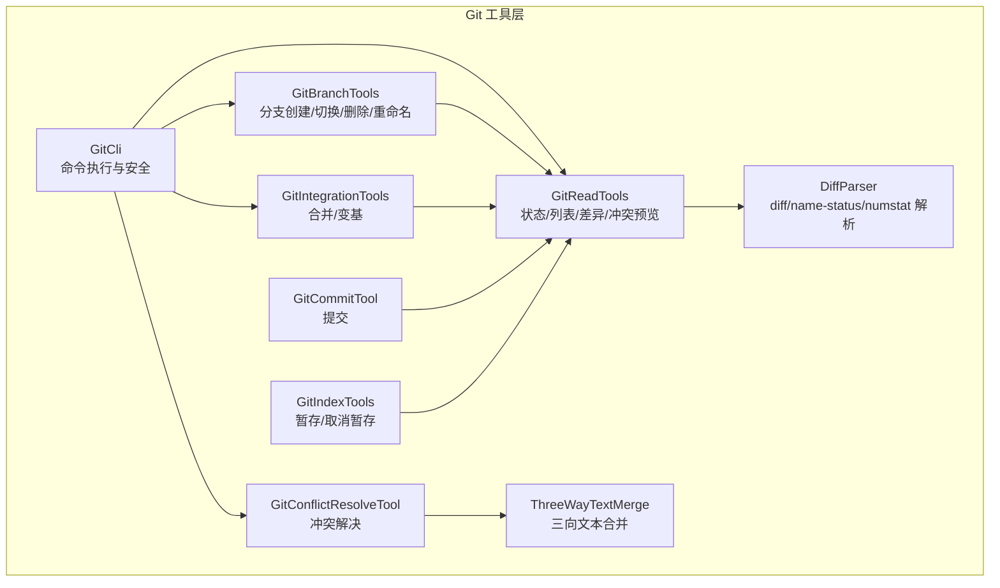
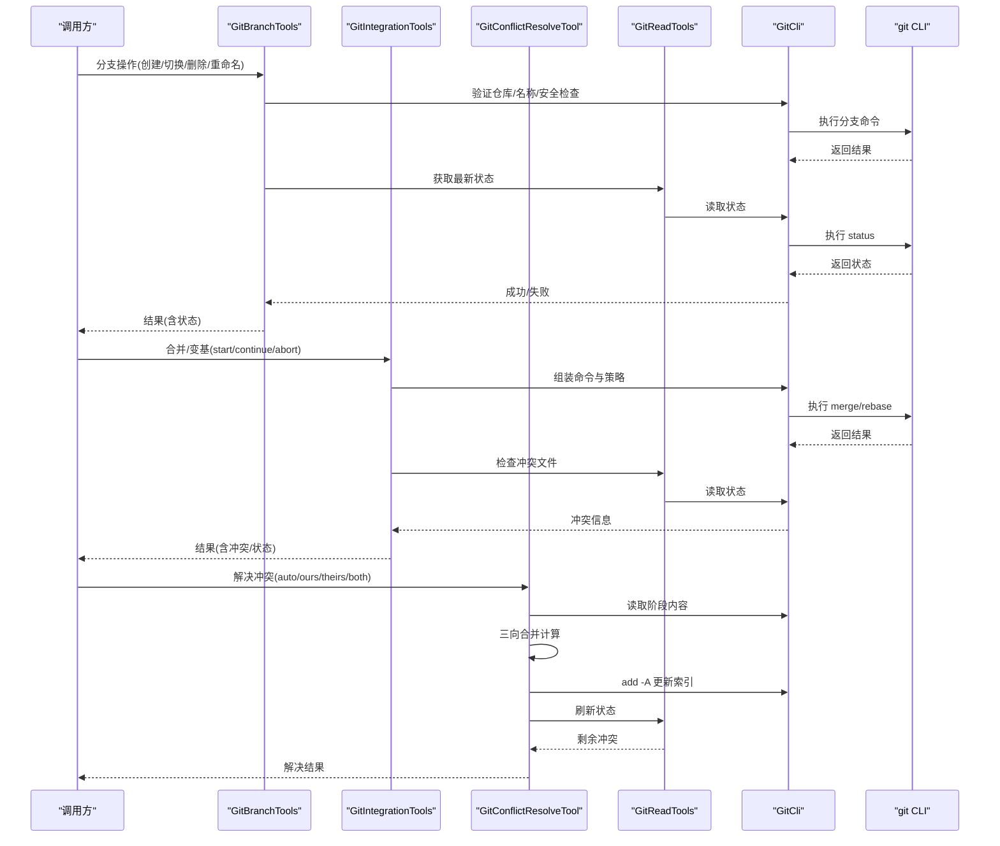
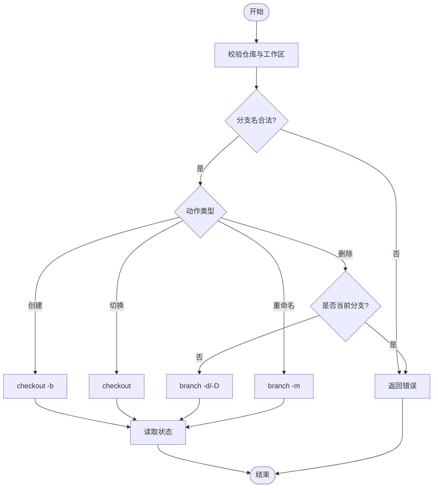
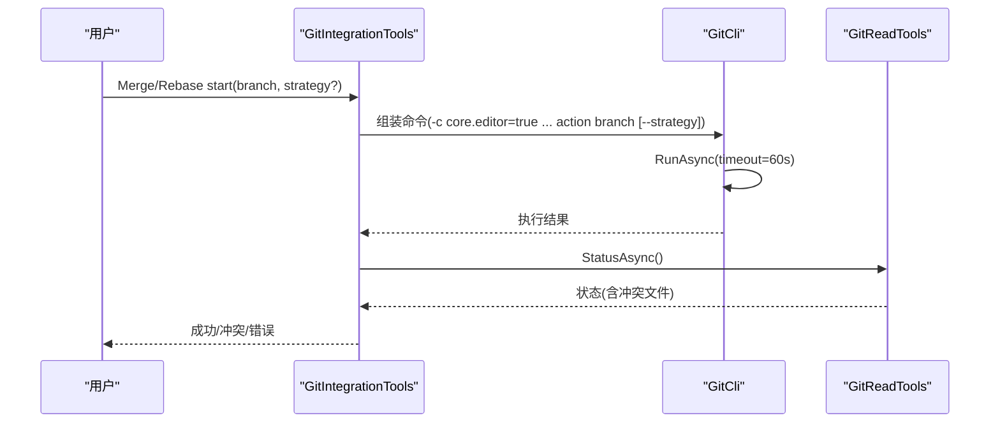
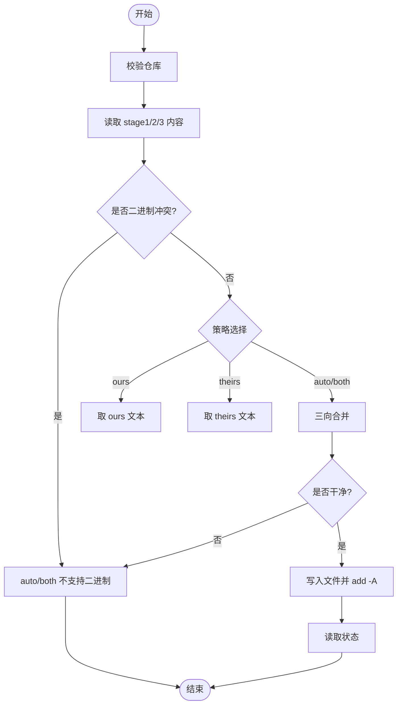
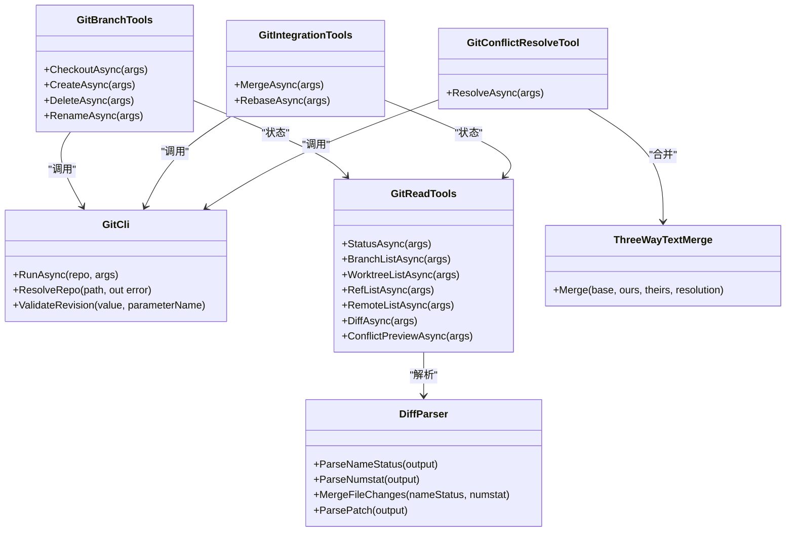

# 分支操作

<cite>
**本文引用的文件**   
- [GitBranchTools.cs](file://TinadecTools/Tools/Git/GitBranchTools.cs)
- [GitIntegrationTools.cs](file://TinadecTools/Tools/Git/GitIntegrationTools.cs)
- [GitConflictResolveTool.cs](file://TinadecTools/Tools/Git/GitConflictResolveTool.cs)
- [GitCli.cs](file://TinadecTools/Tools/Git/GitCli.cs)
- [GitReadTools.cs](file://TinadecTools/Tools/Git/GitReadTools.cs)
- [ThreeWayTextMerge.cs](file://TinadecTools/Tools/Git/ThreeWayTextMerge.cs)
- [DiffParser.cs](file://TinadecTools/Tools/Git/DiffParser.cs)
- [LaneAssigner.cs](file://TinadecTools/Tools/Git/LaneAssigner.cs)
- [GitCommitTool.cs](file://TinadecTools/Tools/Git/GitCommitTool.cs)
- [GitIndexTools.cs](file://TinadecTools/Tools/Git/GitIndexTools.cs)
- [GitBranchToolsTests.cs](file://tests/TinadecTools.Tests/GitBranchToolsTests.cs)
- [GitIntegrationToolsTests.cs](file://tests/TinadecTools.Tests/GitIntegrationToolsTests.cs)
</cite>

## 目录
1. [简介](#简介)
2. [项目结构](#项目结构)
3. [核心组件](#核心组件)
4. [架构总览](#架构总览)
5. [详细组件分析](#详细组件分析)
6. [依赖关系分析](#依赖关系分析)
7. [性能考量](#性能考量)
8. [故障排查指南](#故障排查指南)
9. [结论](#结论)
10. [附录：分支管理流程与团队协作最佳实践](#附录分支管理流程与团队协作最佳实践)

## 简介
本文件面向团队在代码仓库中的 Git 分支操作，覆盖分支创建、切换、合并、删除、跟踪、冲突检测与自动合并策略等能力。文档基于仓库中 Git 工具实现进行说明，帮助开发者理解各工具的输入输出、错误处理、权限控制（审批）以及推荐的工作流与命名规范。

## 项目结构
与分支操作相关的代码集中在 TinadecTools/Tools/Git 目录下，按职责划分：
- 基础执行与安全校验：GitCli.cs
- 只读状态与查询：GitReadTools.cs
- 分支变更：GitBranchTools.cs
- 集成（合并/变基）：GitIntegrationTools.cs
- 冲突解决：GitConflictResolveTool.cs
- 三向文本合并算法：ThreeWayTextMerge.cs
- Diff/补丁解析：DiffParser.cs
- 提交与暂存索引：GitCommitTool.cs、GitIndexTools.cs
- 测试用例：tests/TinadecTools.Tests/*

**图表来源**
- [GitCli.cs](file://TinadecTools/Tools/Git/GitCli.cs)
- [GitReadTools.cs](file://TinadecTools/Tools/Git/GitReadTools.cs)
- [GitBranchTools.cs](file://TinadecTools/Tools/Git/GitBranchTools.cs)
- [GitIntegrationTools.cs](file://TinadecTools/Tools/Git/GitIntegrationTools.cs)
- [GitConflictResolveTool.cs](file://TinadecTools/Tools/Git/GitConflictResolveTool.cs)
- [ThreeWayTextMerge.cs](file://TinadecTools/Tools/Git/ThreeWayTextMerge.cs)
- [DiffParser.cs](file://TinadecTools/Tools/Git/DiffParser.cs)
- [GitCommitTool.cs](file://TinadecTools/Tools/Git/GitCommitTool.cs)
- [GitIndexTools.cs](file://TinadecTools/Tools/Git/GitIndexTools.cs)

**章节来源**
- [GitCli.cs](file://TinadecTools/Tools/Git/GitCli.cs)
- [GitReadTools.cs](file://TinadecTools/Tools/Git/GitReadTools.cs)
- [GitBranchTools.cs](file://TinadecTools/Tools/Git/GitBranchTools.cs)
- [GitIntegrationTools.cs](file://TinadecTools/Tools/Git/GitIntegrationTools.cs)
- [GitConflictResolveTool.cs](file://TinadecTools/Tools/Git/GitConflictResolveTool.cs)
- [ThreeWayTextMerge.cs](file://TinadecTools/Tools/Git/ThreeWayTextMerge.cs)
- [DiffParser.cs](file://TinadecTools/Tools/Git/DiffParser.cs)
- [GitCommitTool.cs](file://TinadecTools/Tools/Git/GitCommitTool.cs)
- [GitIndexTools.cs](file://TinadecTools/Tools/Git/GitIndexTools.cs)

## 核心组件
- GitCli：统一封装 git CLI 调用，负责工作区路径校验、参数安全、超时与输出限制、错误码标准化。
- GitReadTools：提供只读能力，包括 status、branch list、worktree list、ref/remote 列表、diff、blame、冲突预览等。
- GitBranchTools：分支的创建、切换、删除、重命名；包含名称校验、当前分支保护、状态回写。
- GitIntegrationTools：合并与变基的生命周期（start/continue/abort/skip），支持策略选择与冲突检测。
- GitConflictResolveTool：对单个文件的冲突进行自动或手动策略解决，并更新索引与状态。
- ThreeWayTextMerge：纯文本三向合并算法，支持标记、ours/theirs/both 策略。
- DiffParser：解析 diff-tree name-status/numstat/unified diff，用于差异统计与展示。
- GitCommitTool/GitIndexTools：提交与暂存索引，配合分支工作流使用。

**章节来源**
- [GitCli.cs](file://TinadecTools/Tools/Git/GitCli.cs)
- [GitReadTools.cs](file://TinadecTools/Tools/Git/GitReadTools.cs)
- [GitBranchTools.cs](file://TinadecTools/Tools/Git/GitBranchTools.cs)
- [GitIntegrationTools.cs](file://TinadecTools/Tools/Git/GitIntegrationTools.cs)
- [GitConflictResolveTool.cs](file://TinadecTools/Tools/Git/GitConflictResolveTool.cs)
- [ThreeWayTextMerge.cs](file://TinadecTools/Tools/Git/ThreeWayTextMerge.cs)
- [DiffParser.cs](file://TinadecTools/Tools/Git/DiffParser.cs)
- [GitCommitTool.cs](file://TinadecTools/Tools/Git/GitCommitTool.cs)
- [GitIndexTools.cs](file://TinadecTools/Tools/Git/GitIndexTools.cs)

## 架构总览
下图展示了分支相关操作的调用链路与数据流向，从上层工具到 Git CLI 的执行与结果回传。

**图表来源**
- [GitBranchTools.cs](file://TinadecTools/Tools/Git/GitBranchTools.cs)
- [GitIntegrationTools.cs](file://TinadecTools/Tools/Git/GitIntegrationTools.cs)
- [GitConflictResolveTool.cs](file://TinadecTools/Tools/Git/GitConflictResolveTool.cs)
- [GitReadTools.cs](file://TinadecTools/Tools/Git/GitReadTools.cs)
- [GitCli.cs](file://TinadecTools/Tools/Git/GitCli.cs)

## 详细组件分析

### 分支创建、切换、删除、重命名（GitBranchTools）
- 功能要点
  - 创建分支：校验分支名合法性，执行 checkout -b，返回新分支名与状态。
  - 切换分支：校验分支名，执行 checkout，返回当前分支与状态。
  - 删除分支：禁止删除当前分支，支持强制删除，返回状态。
  - 重命名分支：对当前分支重命名，返回新名与状态。
- 安全与权限
  - 所有操作需通过 ToolConfirmations 确认字段（如 ConfirmBranchCreate/ConfirmCheckout/ConfirmBranchDelete/ConfirmBranchRename）。
  - 分支名通过 check-ref-format --branch 校验。
- 错误处理
  - 非仓库/非 worktree、非法分支名、删除当前分支等情况返回明确错误。
- 典型流程

**图表来源**
- [GitBranchTools.cs](file://TinadecTools/Tools/Git/GitBranchTools.cs)
- [GitCli.cs](file://TinadecTools/Tools/Git/GitCli.cs)

**章节来源**
- [GitBranchTools.cs](file://TinadecTools/Tools/Git/GitBranchTools.cs)
- [GitBranchToolsTests.cs](file://tests/TinadecTools.Tests/GitBranchToolsTests.cs)

### 合并与变基（GitIntegrationTools）
- 功能要点
  - 合并：支持 start/continue/abort，策略可选 no_ff、ff_only、squash。
  - 变基：支持 start/continue/abort/skip。
  - 冲突检测：根据状态判断是否存在冲突文件，并返回冲突清单。
- 安全与权限
  - 需要 ConfirmMerge 或 ConfirmRebase 确认。
  - 参数校验严格，不允许非法 operation 与策略。
- 典型流程

**图表来源**
- [GitIntegrationTools.cs](file://TinadecTools/Tools/Git/GitIntegrationTools.cs)
- [GitReadTools.cs](file://TinadecTools/Tools/Git/GitReadTools.cs)
- [GitCli.cs](file://TinadecTools/Tools/Git/GitCli.cs)

**章节来源**
- [GitIntegrationTools.cs](file://TinadecTools/Tools/Git/GitIntegrationTools.cs)
- [GitIntegrationToolsTests.cs](file://tests/TinadecTools.Tests/GitIntegrationToolsTests.cs)

### 冲突检测与自动合并（GitConflictResolveTool + ThreeWayTextMerge）
- 功能要点
  - 读取 base/ours/theirs 三个阶段的内容。
  - 支持 auto/ours/theirs/both 策略；二进制冲突不支持 auto/both。
  - 自动合并成功后写入文件并 add -A，返回剩余冲突。
- 算法要点
  - 三向文本合并采用 LCS 差异计算，限制最大单元格数避免内存爆炸。
  - 冲突区域生成标记或选择 ours/theirs/both 拼接。
- 典型流程

**图表来源**
- [GitConflictResolveTool.cs](file://TinadecTools/Tools/Git/GitConflictResolveTool.cs)
- [ThreeWayTextMerge.cs](file://TinadecTools/Tools/Git/ThreeWayTextMerge.cs)
- [GitCli.cs](file://TinadecTools/Tools/Git/GitCli.cs)

**章节来源**
- [GitConflictResolveTool.cs](file://TinadecTools/Tools/Git/GitConflictResolveTool.cs)
- [ThreeWayTextMerge.cs](file://TinadecTools/Tools/Git/ThreeWayTextMerge.cs)

### 分支状态检查与跟踪（GitReadTools）
- 能力概览
  - git_status：返回分支、上游、ahead/behind、未提交变更、文件级状态。
  - git_push_readiness：汇总推送前置条件（detached head、无 upstream、落后、未提交变更）。
  - git_branch_list：列出本地/远程分支及 HEAD、上游、提交哈希。
  - git_worktree_list/git_ref_list/git_remote_list：工作区、引用、远端信息。
  - git_diff：工作区/暂存/引用范围差异，支持文件过滤与大小限制。
  - git_conflict_preview：冲突文件与冲突块预览。
- 数据结构复杂度
  - 状态解析为 O(n) 行扫描；差异构建受 max_files/max_diff_bytes 限制。
- 典型用法
  - 在分支切换/合并前后调用 status 以获取一致视图。
  - 推送前调用 push_readiness 快速判定风险。

**章节来源**
- [GitReadTools.cs](file://TinadecTools/Tools/Git/GitReadTools.cs)

### 提交与索引（GitCommitTool / GitIndexTools）
- 提交模式
  - include_all：添加全部变更并提交。
  - commit_staged_only：仅提交已暂存变更。
  - paths：指定路径集合提交。
- 索引更新
  - stage/unstage：支持路径或 unified patch 两种方式，patch 仅限文本且不可重命名。
- 安全与权限
  - 提交需 ConfirmCommit；路径必须位于仓库内；消息不能包含空字符。

**章节来源**
- [GitCommitTool.cs](file://TinadecTools/Tools/Git/GitCommitTool.cs)
- [GitIndexTools.cs](file://TinadecTools/Tools/Git/GitIndexTools.cs)

## 依赖关系分析
- GitCli 是所有 Git 命令的统一入口，负责路径解析、安全校验、超时与输出限制、错误码映射。
- GitReadTools 依赖 GitCli 执行只读命令，并将结果结构化。
- GitBranchTools/GitIntegrationTools/GitConflictResolveTool 依赖 GitCli 与 GitReadTools 完成变更与状态同步。
- ThreeWayTextMerge 被冲突解决工具直接调用，提供文本合并能力。
- DiffParser 被差异与冲突预览模块使用，解析 diff-tree 输出。

**图表来源**
- [GitCli.cs](file://TinadecTools/Tools/Git/GitCli.cs)
- [GitReadTools.cs](file://TinadecTools/Tools/Git/GitReadTools.cs)
- [GitBranchTools.cs](file://TinadecTools/Tools/Git/GitBranchTools.cs)
- [GitIntegrationTools.cs](file://TinadecTools/Tools/Git/GitIntegrationTools.cs)
- [GitConflictResolveTool.cs](file://TinadecTools/Tools/Git/GitConflictResolveTool.cs)
- [ThreeWayTextMerge.cs](file://TinadecTools/Tools/Git/ThreeWayTextMerge.cs)
- [DiffParser.cs](file://TinadecTools/Tools/Git/DiffParser.cs)

**章节来源**
- [GitCli.cs](file://TinadecTools/Tools/Git/GitCli.cs)
- [GitReadTools.cs](file://TinadecTools/Tools/Git/GitReadTools.cs)
- [GitBranchTools.cs](file://TinadecTools/Tools/Git/GitBranchTools.cs)
- [GitIntegrationTools.cs](file://TinadecTools/Tools/Git/GitIntegrationTools.cs)
- [GitConflictResolveTool.cs](file://TinadecTools/Tools/Git/GitConflictResolveTool.cs)
- [ThreeWayTextMerge.cs](file://TinadecTools/Tools/Git/ThreeWayTextMerge.cs)
- [DiffParser.cs](file://TinadecTools/Tools/Git/DiffParser.cs)

## 性能考量
- 输出限制：GitCli 默认限制 stdout/stderr 捕获长度，避免大输出阻塞；差异与 blame 等接口支持 max_output_chars/max_output_bytes 限制。
- 差异构建：Diff 构建时限制文件数量与字节数，防止超大仓库导致内存与时间开销过大。
- 三向合并：LCS 矩阵上限 MaxLcsCells 控制内存占用，避免极端情况下的性能问题。
- 超时控制：合并/变基等操作设置合理超时，避免长时间挂起。

[本节为通用指导，不直接分析具体文件]

## 故障排查指南
- 常见错误码
  - git_not_found：未找到 git 命令。
  - not_a_repo：路径不是有效的 Git 仓库或不在工作区内。
  - no_staged_changes：提交时无暂存变更。
  - patch_output_limit：补丁超过限制。
- 定位步骤
  - 先调用 git_status 查看分支、上游、未提交变更与冲突文件。
  - 合并/变基失败时，使用 git_conflict_preview 查看冲突块与操作类型。
  - 分支操作失败时，检查分支名合法性与是否为当前分支。
- 恢复手段
  - 合并/变基冲突：解决后继续 continue，或 abort 回到初始状态。
  - 索引异常：使用 stage/unstage 修正暂存状态。

**章节来源**
- [GitCli.cs](file://TinadecTools/Tools/Git/GitCli.cs)
- [GitReadTools.cs](file://TinadecTools/Tools/Git/GitReadTools.cs)
- [GitIntegrationTools.cs](file://TinadecTools/Tools/Git/GitIntegrationTools.cs)
- [GitCommitTool.cs](file://TinadecTools/Tools/Git/GitCommitTool.cs)
- [GitIndexTools.cs](file://TinadecTools/Tools/Git/GitIndexTools.cs)

## 结论
本仓库的 Git 分支工具提供了完整、安全的分支管理能力，涵盖创建、切换、删除、重命名、合并、变基与冲突解决。通过严格的参数校验、输出限制与超时控制，确保在大型仓库与复杂场景下的稳定性。建议结合状态检查与冲突预览，形成稳健的分支协作流程。

[本节为总结性内容，不直接分析具体文件]

## 附录：分支管理流程与团队协作最佳实践
- 分支命名规范
  - 遵循 Git 分支命名规则（check-ref-format --branch），避免空格与非法字符。
  - 建议使用语义化前缀，如 feature/bugfix/hotfix/release 等，便于检索与自动化。
- 权限控制与审批
  - 所有分支与合并/变基操作均需显式确认（Confirm* 字段），建议在平台层集成审批流程。
  - 关键分支（如 main/master）可结合平台保护规则（需 PR、至少一个审查者、CI 通过）。
- 合并策略选择
  - 日常开发优先 fast-forward；需要保留合并节点时使用 no_ff；批量提交可使用 squash。
  - 变基适用于整理历史，但应避免在共享分支上频繁 rebase。
- 冲突处理
  - 优先使用 auto 尝试自动合并；若失败，选择 ours/theirs/both 策略逐步解决。
  - 解决后及时 add -A 并重新运行 CI，确保质量门禁。
- 清理策略
  - 定期清理已合并的本地/远程分支，减少噪声。
  - 工作区保持干净，避免未提交变更影响切换与合并。
- 团队协作
  - 小步快跑、频繁提交，保证变更可追溯。
  - 使用 Pull Request/Merge Request 进行代码审查与集成。
  - 在合并前执行 git_push_readiness 检查，避免推送失败。

[本节为概念性指导，不直接分析具体文件]