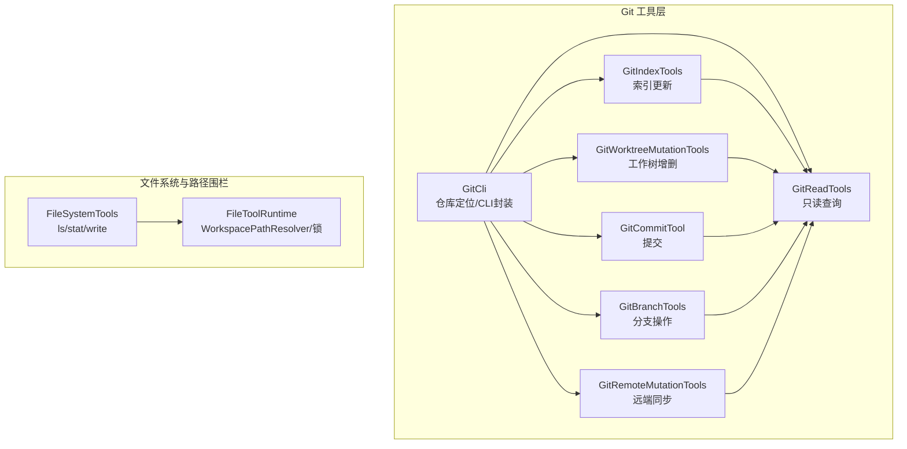
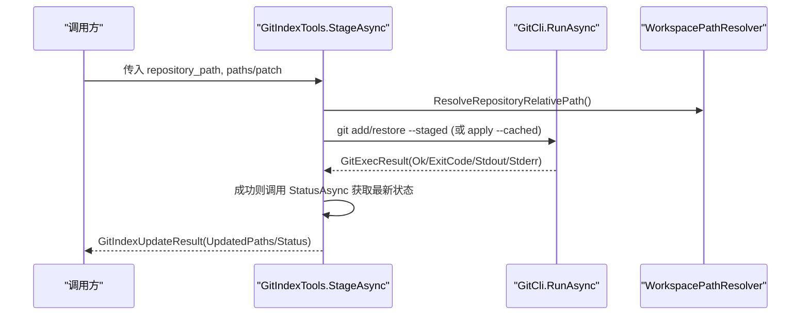
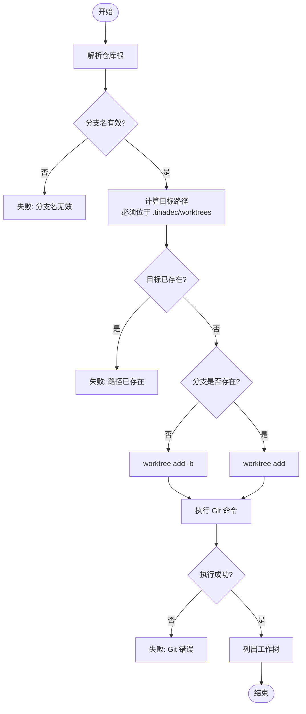
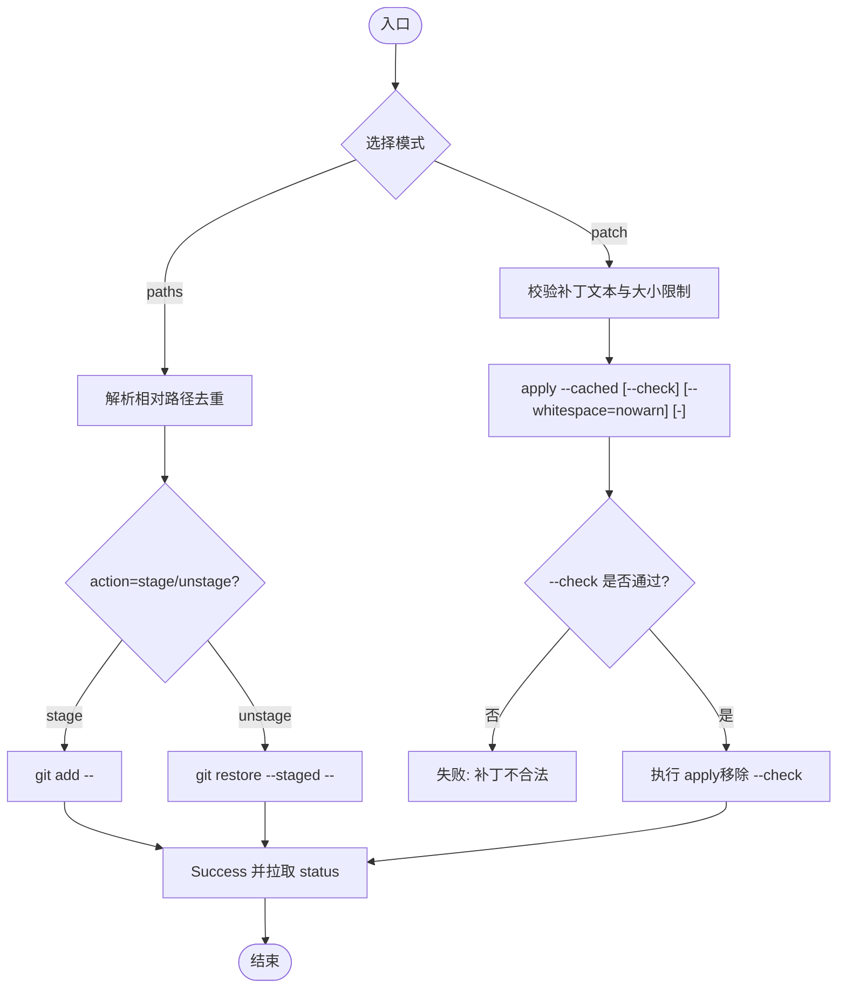
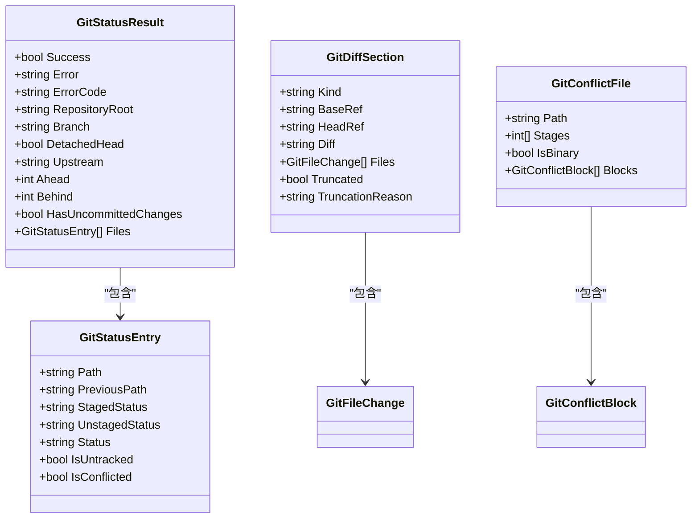
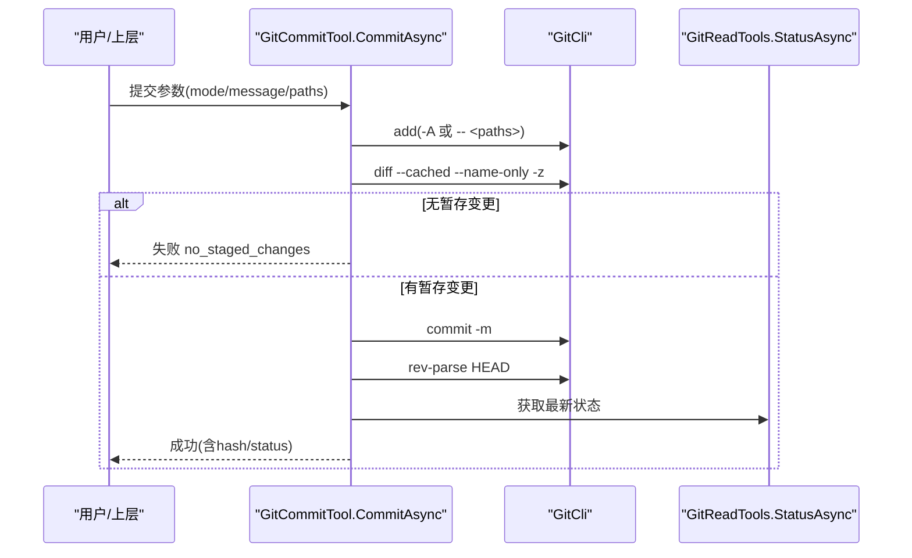
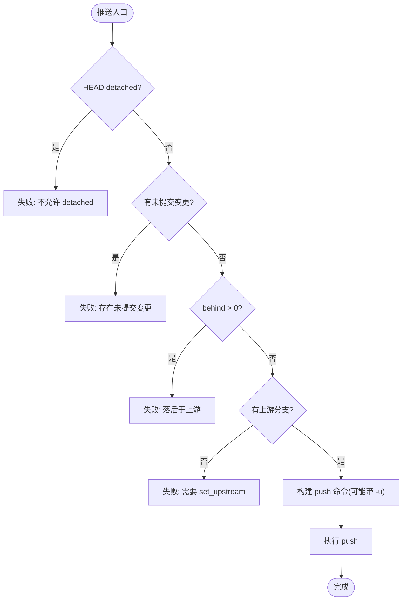
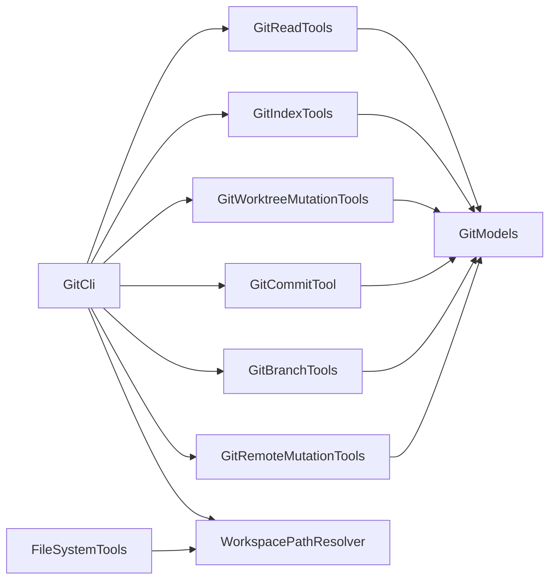

# 工作区管理

<cite>
**本文引用的文件**   
- [GitCli.cs](file://TinadecTools/Tools/Git/GitCli.cs)
- [GitReadTools.cs](file://TinadecTools/Tools/Git/GitReadTools.cs)
- [GitIndexTools.cs](file://TinadecTools/Tools/Git/GitIndexTools.cs)
- [GitWorktreeMutationTools.cs](file://TinadecTools/Tools/Git/GitWorktreeMutationTools.cs)
- [GitCommitTool.cs](file://TinadecTools/Tools/Git/GitCommitTool.cs)
- [GitBranchTools.cs](file://TinadecTools/Tools/Git/GitBranchTools.cs)
- [GitRemoteMutationTools.cs](file://TinadecTools/Tools/Git/GitRemoteMutationTools.cs)
- [FileSystemTools.cs](file://TinadecTools/Tools/FileRW/FileSystemTools.cs)
- [FileToolRuntime.cs](file://TinadecTools/Tools/FileRW/FileToolRuntime.cs)
- [GitModels.cs](file://TinadecTools/Tools/Git/GitModels.cs)
</cite>

## 目录
1. [简介](#简介)
2. [项目结构](#项目结构)
3. [核心组件](#核心组件)
4. [架构总览](#架构总览)
5. [详细组件分析](#详细组件分析)
6. [依赖关系分析](#依赖关系分析)
7. [性能考虑](#性能考虑)
8. [故障排查指南](#故障排查指南)
9. [结论](#结论)
10. [附录：工作区管理示例与最佳实践](#附录工作区管理示例与最佳实践)

## 简介
本文件面向 Git 工作区管理的实现，覆盖以下主题：
- 工作树（worktree）的创建、删除与列表
- 索引（暂存区）的更新策略：按路径或补丁文本
- 文件状态监控：status、diff、冲突预览
- 多工作区并行开发：隔离路径、命名规范、安全校验
- 索引更新策略：路径模式与补丁模式的边界与限制
- 文件权限处理：只读标记、隐藏属性、符号链接与重解析点防护
- 工作区同步：fetch/pull/push 前置检查与上游分支设置
- 备份恢复与清理策略：基于 worktree 快照与受控删除
- 完整示例与性能优化建议

## 项目结构
Git 工作区管理能力集中在 TinadecTools 的 Git 工具集中，围绕统一的 CLI 执行器与路径围栏构建。关键模块如下：
- Git 命令执行与仓库定位：GitCli
- 只读能力：状态、差异、分支、引用、远程、冲突预览等：GitReadTools
- 索引操作：暂存/取消暂存（路径或补丁）：GitIndexTools
- 工作树操作：创建/删除/列表：GitWorktreeMutationTools
- 提交与分支操作：GitCommitTool、GitBranchTools
- 远端同步：GitRemoteMutationTools
- 文件系统与路径围栏：FileSystemTools、FileToolRuntime（WorkspacePathResolver）
- 数据模型：GitModels（变更、补丁、图边等）

图表来源
- [GitCli.cs:1-144](file://TinadecTools/Tools/Git/GitCli.cs#L1-L144)
- [GitReadTools.cs:1-554](file://TinadecTools/Tools/Git/GitReadTools.cs#L1-L554)
- [GitIndexTools.cs:1-146](file://TinadecTools/Tools/Git/GitIndexTools.cs#L1-L146)
- [GitWorktreeMutationTools.cs:1-107](file://TinadecTools/Tools/Git/GitWorktreeMutationTools.cs#L1-L107)
- [GitCommitTool.cs:1-149](file://TinadecTools/Tools/Git/GitCommitTool.cs#L1-L149)
- [GitBranchTools.cs:1-105](file://TinadecTools/Tools/Git/GitBranchTools.cs#L1-L105)
- [GitRemoteMutationTools.cs:1-119](file://TinadecTools/Tools/Git/GitRemoteMutationTools.cs#L1-L119)
- [FileSystemTools.cs:1-273](file://TinadecTools/Tools/FileRW/FileSystemTools.cs#L1-L273)
- [FileToolRuntime.cs:1-124](file://TinadecTools/Tools/FileRW/FileToolRuntime.cs#L1-L124)

章节来源
- [GitCli.cs:1-144](file://TinadecTools/Tools/Git/GitCli.cs#L1-L144)
- [GitReadTools.cs:1-554](file://TinadecTools/Tools/Git/GitReadTools.cs#L1-L554)
- [GitIndexTools.cs:1-146](file://TinadecTools/Tools/Git/GitIndexTools.cs#L1-L146)
- [GitWorktreeMutationTools.cs:1-107](file://TinadecTools/Tools/Git/GitWorktreeMutationTools.cs#L1-L107)
- [GitCommitTool.cs:1-149](file://TinadecTools/Tools/Git/GitCommitTool.cs#L1-L149)
- [GitBranchTools.cs:1-105](file://TinadecTools/Tools/Git/GitBranchTools.cs#L1-L105)
- [GitRemoteMutationTools.cs:1-119](file://TinadecTools/Tools/Git/GitRemoteMutationTools.cs#L1-L119)
- [FileSystemTools.cs:1-273](file://TinadecTools/Tools/FileRW/FileSystemTools.cs#L1-L273)
- [FileToolRuntime.cs:1-124](file://TinadecTools/Tools/FileRW/FileToolRuntime.cs#L1-L124)

## 核心组件
- GitCli：统一封装 git CLI 调用，负责仓库根定位、参数安全、输出截断与错误码标准化。
- GitReadTools：提供只读能力（status/diff/branch/ref/remote/blame/file-at-revision/conflict-preview/worktree-list）。
- GitIndexTools：索引更新（stage/unstage），支持路径模式与补丁模式，内置补丁合法性校验与大小限制。
- GitWorktreeMutationTools：工作树创建/删除，强制路径在 .tinadec/worktrees 下，自动 slugify 分支名生成目录名。
- GitCommitTool：提交封装，三种模式互斥（include_all/commit_staged_only/paths），提交后返回状态。
- GitBranchTools：checkout/create/delete/rename，含名称校验与当前分支保护。
- GitRemoteMutationTools：fetch/pull/push，包含前置检查（未提交、上游、ahead/behind）、可选 --prune 与 upstream 设置。
- FileSystemTools 与 FileToolRuntime：文件读写、目录枚举、stat、路径围栏（禁止跨工作区与符号链接穿越）、并发写锁。

章节来源
- [GitCli.cs:1-144](file://TinadecTools/Tools/Git/GitCli.cs#L1-L144)
- [GitReadTools.cs:1-554](file://TinadecTools/Tools/Git/GitReadTools.cs#L1-L554)
- [GitIndexTools.cs:1-146](file://TinadecTools/Tools/Git/GitIndexTools.cs#L1-L146)
- [GitWorktreeMutationTools.cs:1-107](file://TinadecTools/Tools/Git/GitWorktreeMutationTools.cs#L1-L107)
- [GitCommitTool.cs:1-149](file://TinadecTools/Tools/Git/GitCommitTool.cs#L1-L149)
- [GitBranchTools.cs:1-105](file://TinadecTools/Tools/Git/GitBranchTools.cs#L1-L105)
- [GitRemoteMutationTools.cs:1-119](file://TinadecTools/Tools/Git/GitRemoteMutationTools.cs#L1-L119)
- [FileSystemTools.cs:1-273](file://TinadecTools/Tools/FileRW/FileSystemTools.cs#L1-L273)
- [FileToolRuntime.cs:1-124](file://TinadecTools/Tools/FileRW/FileToolRuntime.cs#L1-L124)

## 架构总览
整体采用“工具函数 + CLI 封装 + 路径围栏”的分层设计：
- 工具函数层：每个功能以 ToolFunction 标注暴露，统一参数/结果模型。
- 执行层：GitCli 通过 TerminalRunner 执行 git 命令，保证参数安全与输出控制。
- 只读层：GitReadTools 解析 porcelain 输出，提供结构化结果。
- 路径围栏：WorkspacePathResolver 确保所有路径在工作区内，并阻止符号链接穿越。

图表来源
- [GitIndexTools.cs:32-146](file://TinadecTools/Tools/Git/GitIndexTools.cs#L32-L146)
- [GitCli.cs:88-122](file://TinadecTools/Tools/Git/GitCli.cs#L88-L122)
- [GitReadTools.cs:271-280](file://TinadecTools/Tools/Git/GitReadTools.cs#L271-L280)
- [FileToolRuntime.cs:16-26](file://TinadecTools/Tools/FileRW/FileToolRuntime.cs#L16-L26)

## 详细组件分析

### 工作树（Worktree）管理
- 创建流程：校验分支名格式 -> 计算目标路径（必须在 .tinadec/worktrees 下）-> 若分支不存在则 -b 创建 -> 执行 worktree add -> 返回工作树列表。
- 删除流程：禁止删除当前工作树 -> 支持 --force -> 执行 worktree remove -> 返回工作树列表。
- 列表：解析 porcelain 输出，标记当前工作树。

图表来源
- [GitWorktreeMutationTools.cs:37-107](file://TinadecTools/Tools/Git/GitWorktreeMutationTools.cs#L37-L107)
- [GitReadTools.cs:333-351](file://TinadecTools/Tools/Git/GitReadTools.cs#L333-L351)

章节来源
- [GitWorktreeMutationTools.cs:37-107](file://TinadecTools/Tools/Git/GitWorktreeMutationTools.cs#L37-L107)
- [GitReadTools.cs:333-351](file://TinadecTools/Tools/Git/GitReadTools.cs#L333-L351)

### 索引（暂存区）更新策略
- 路径模式：git add -- <paths> 或 git restore --staged -- <paths>
- 补丁模式：git apply --cached [--reverse]，仅支持文本补丁，且需满足 diff header 校验、无二进制/重命名/新增/删除模式等限制；最大字节数限制默认 512KB，可配置。
- 成功后统一返回最新 status。

图表来源
- [GitIndexTools.cs:32-146](file://TinadecTools/Tools/Git/GitIndexTools.cs#L32-L146)

章节来源
- [GitIndexTools.cs:32-146](file://TinadecTools/Tools/Git/GitIndexTools.cs#L32-L146)

### 文件状态监控（status/diff/conflict）
- status：porcelain v1 + branch 信息，解析 ahead/behind/upstream/detached/head，逐文件 staged/unstaged 状态映射为 clean/added/modified/deleted/untracked/conflicted 等。
- diff：支持 working_tree/staged/ref_range 组合，合并 name-status 与 numstat，限制文件数量与字节数，返回 truncated 原因。
- conflict：通过 ls-files -u 识别冲突文件，读取 stage 1/2/3 内容，使用三路文本合并生成冲突块，支持字节限制。

图表来源
- [GitReadTools.cs:10-39](file://TinadecTools/Tools/Git/GitReadTools.cs#L10-L39)
- [GitReadTools.cs:69-84](file://TinadecTools/Tools/Git/GitReadTools.cs#L69-L84)
- [GitReadTools.cs:216-229](file://TinadecTools/Tools/Git/GitReadTools.cs#L216-L229)
- [GitModels.cs:58-79](file://TinadecTools/Tools/Git/GitModels.cs#L58-L79)

章节来源
- [GitReadTools.cs:271-554](file://TinadecTools/Tools/Git/GitReadTools.cs#L271-L554)
- [GitModels.cs:1-123](file://TinadecTools/Tools/Git/GitModels.cs#L1-L123)

### 提交与分支操作
- 提交：三种模式互斥（include_all/commit_staged_only/paths），提交前校验 staged 是否为空，提交后返回 commit hash 与 status。
- 分支：checkout/create/delete/rename，均进行分支名格式校验，delete 时禁止删除当前分支。

图表来源
- [GitCommitTool.cs:35-149](file://TinadecTools/Tools/Git/GitCommitTool.cs#L35-L149)
- [GitReadTools.cs:271-280](file://TinadecTools/Tools/Git/GitReadTools.cs#L271-L280)

章节来源
- [GitCommitTool.cs:35-149](file://TinadecTools/Tools/Git/GitCommitTool.cs#L35-L149)
- [GitBranchTools.cs:37-105](file://TinadecTools/Tools/Git/GitBranchTools.cs#L37-L105)

### 远端同步（fetch/pull/push）
- fetch：可选 --prune，支持指定 remote 或 --all。
- pull：--ff-only，要求无未提交变更、非 detached HEAD，支持显式 remote+branch 或上游分支。
- push：严格前置检查（detached/未提交/behind），必要时 -u 设置上游，避免误推。

图表来源
- [GitRemoteMutationTools.cs:60-119](file://TinadecTools/Tools/Git/GitRemoteMutationTools.cs#L60-L119)

章节来源
- [GitRemoteMutationTools.cs:40-119](file://TinadecTools/Tools/Git/GitRemoteMutationTools.cs#L40-L119)

### 文件权限与符号链接支持
- 权限：统计条目包含 is_readonly/is_hidden，写入时对已存在文件要求 file_hash 校验，防止竞态覆盖。
- 符号链接：WorkspacePathResolver 禁止路径穿越符号链接或 junctions（允许最终层级 link 但不可用于中间段），保障工作区边界安全。
- 并发：文件级读写锁（FileSlot.RwLock）避免并发写入冲突。

章节来源
- [FileSystemTools.cs:64-176](file://TinadecTools/Tools/FileRW/FileSystemTools.cs#L64-L176)
- [FileToolRuntime.cs:6-92](file://TinadecTools/Tools/FileRW/FileToolRuntime.cs#L6-L92)
- [FileToolRuntime.cs:94-124](file://TinadecTools/Tools/FileRW/FileToolRuntime.cs#L94-L124)

## 依赖关系分析
- GitReadTools/GitIndexTools/GitWorktreeMutationTools/GitCommitTool/GitBranchTools/GitRemoteMutationTools 均依赖 GitCli 执行 git 命令。
- GitReadTools 被多个工具复用（如提交、分支、远端同步后刷新状态）。
- WorkspacePathResolver 被 GitCli 与文件系统工具共同使用，确保路径安全。
- GitModels 作为共享数据结构被各工具序列化/反序列化。

图表来源
- [GitCli.cs:1-144](file://TinadecTools/Tools/Git/GitCli.cs#L1-L144)
- [GitReadTools.cs:1-554](file://TinadecTools/Tools/Git/GitReadTools.cs#L1-L554)
- [GitIndexTools.cs:1-146](file://TinadecTools/Tools/Git/GitIndexTools.cs#L1-L146)
- [GitWorktreeMutationTools.cs:1-107](file://TinadecTools/Tools/Git/GitWorktreeMutationTools.cs#L1-L107)
- [GitCommitTool.cs:1-149](file://TinadecTools/Tools/Git/GitCommitTool.cs#L1-L149)
- [GitBranchTools.cs:1-105](file://TinadecTools/Tools/Git/GitBranchTools.cs#L1-L105)
- [GitRemoteMutationTools.cs:1-119](file://TinadecTools/Tools/Git/GitRemoteMutationTools.cs#L1-L119)
- [FileSystemTools.cs:1-273](file://TinadecTools/Tools/FileRW/FileSystemTools.cs#L1-L273)
- [FileToolRuntime.cs:1-124](file://TinadecTools/Tools/FileRW/FileToolRuntime.cs#L1-L124)
- [GitModels.cs:1-123](file://TinadecTools/Tools/Git/GitModels.cs#L1-L123)

章节来源
- [GitCli.cs:1-144](file://TinadecTools/Tools/Git/GitCli.cs#L1-L144)
- [GitReadTools.cs:1-554](file://TinadecTools/Tools/Git/GitReadTools.cs#L1-L554)
- [GitIndexTools.cs:1-146](file://TinadecTools/Tools/Git/GitIndexTools.cs#L1-L146)
- [GitWorktreeMutationTools.cs:1-107](file://TinadecTools/Tools/Git/GitWorktreeMutationTools.cs#L1-L107)
- [GitCommitTool.cs:1-149](file://TinadecTools/Tools/Git/GitCommitTool.cs#L1-L149)
- [GitBranchTools.cs:1-105](file://TinadecTools/Tools/Git/GitBranchTools.cs#L1-L105)
- [GitRemoteMutationTools.cs:1-119](file://TinadecTools/Tools/Git/GitRemoteMutationTools.cs#L1-L119)
- [FileSystemTools.cs:1-273](file://TinadecTools/Tools/FileRW/FileSystemTools.cs#L1-L273)
- [FileToolRuntime.cs:1-124](file://TinadecTools/Tools/FileRW/FileToolRuntime.cs#L1-L124)
- [GitModels.cs:1-123](file://TinadecTools/Tools/Git/GitModels.cs#L1-L123)

## 性能考虑
- 输出限制：GitCli 对 stdout/stderr 做字符上限截断，避免大输出阻塞；diff/blame/file-at-revision 等接口提供 max_output_bytes/max_diff_bytes/max_files 限制。
- 批量操作：diff 合并 name-status 与 numstat，减少多次解析开销；status 使用 porcelain v1 高效解析。
- 并发控制：文件写入使用异步读写锁，避免重复竞争；工作树创建/删除串行化由上层调用保证。
- 网络超时：fetch/pull/push 设置 60s 超时，避免长时间挂起。
- 补丁校验：文本补丁提前校验，失败快速返回，降低无效 apply 成本。

[本节为通用指导，无需特定文件来源]

## 故障排查指南
- 常见错误码：
  - git_not_found：未找到 git 命令
  - not_a_repo：路径不是 git 工作区
  - patch_output_limit：补丁超过限制
  - no_staged_changes：提交时无暂存变更
- 典型问题定位：
  - 工作树路径不在 .tinadec/worktrees 内会被拒绝
  - 符号链接穿越导致 UnauthorizedAccessException
  - 推送失败常见原因为 detached HEAD、未提交变更、落后上游或未设置上游
  - 冲突预览中二进制文件无法生成冲突块，需手动处理

章节来源
- [GitCli.cs:15-17](file://TinadecTools/Tools/Git/GitCli.cs#L15-L17)
- [GitIndexTools.cs:137-146](file://TinadecTools/Tools/Git/GitIndexTools.cs#L137-L146)
- [GitCommitTool.cs:129-149](file://TinadecTools/Tools/Git/GitCommitTool.cs#L129-L149)
- [GitRemoteMutationTools.cs:110-119](file://TinadecTools/Tools/Git/GitRemoteMutationTools.cs#L110-L119)
- [FileToolRuntime.cs:74-92](file://TinadecTools/Tools/FileRW/FileToolRuntime.cs#L74-L92)

## 结论
该工作区管理体系以 GitCli 为核心，配合严格的 WorkspacePathResolver 路径围栏，提供了安全的只读查询、索引更新、工作树管理与远端同步能力。通过统一的参数校验、输出限制与错误码，保证了在多工作区并行开发与自动化流水线中的稳定性与可观测性。

[本节为总结，无需特定文件来源]

## 附录：工作区管理示例与最佳实践
- 多工作区并行开发
  - 为每个特性分支创建独立 worktree，路径自动规范化到 .tinadec/worktrees/<slug>
  - 使用 git_worktree_list 查看当前工作树与当前分支
- 索引更新策略
  - 小范围修改优先使用 paths 模式；批量统一变更可使用补丁模式，注意文本与大小限制
  - 提交前用 git_status 确认暂存与未暂存状态
- 文件权限与符号链接
  - 写入前校验 file_hash，避免覆盖不一致版本
  - 避免在工作区中间路径使用符号链接或 junction
- 工作区同步
  - 推送前运行 git_push_readiness 检查，必要时先 pull --ff-only
  - 首次推送设置上游分支，后续推送避免重复 -u
- 备份恢复与清理
  - 备份：复制 .tinadec/worktrees 下的对应 worktree 目录作为快照
  - 恢复：将快照目录恢复到 .tinadec/worktrees 下，并通过 git_worktree_list 验证
  - 清理：使用 git_worktree_remove 删除不再需要的 worktree，谨慎使用 --force

[本节为概念性指导，无需特定文件来源]