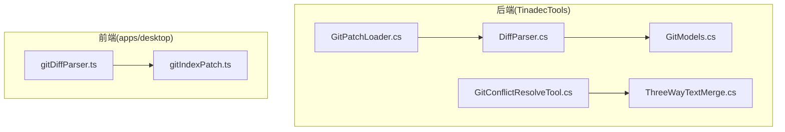
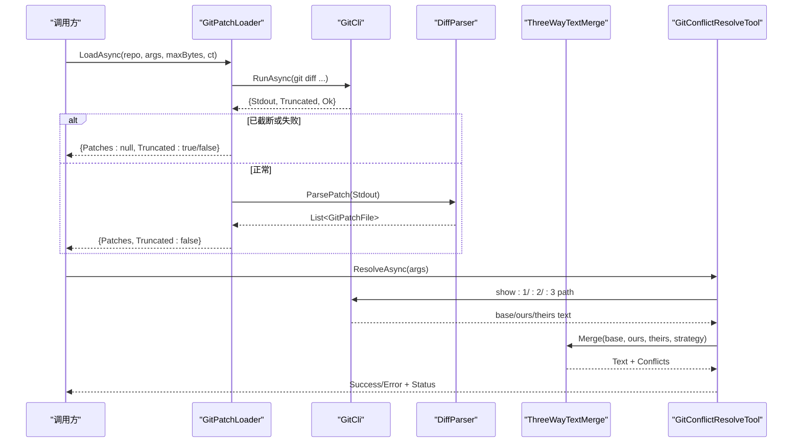
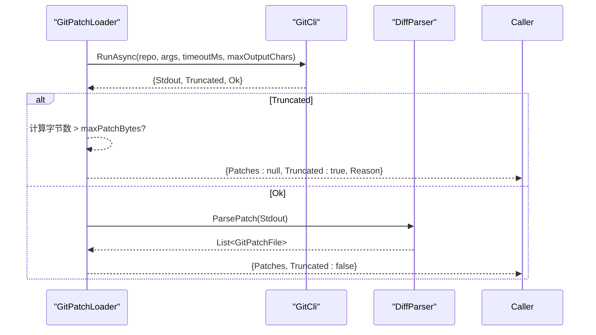
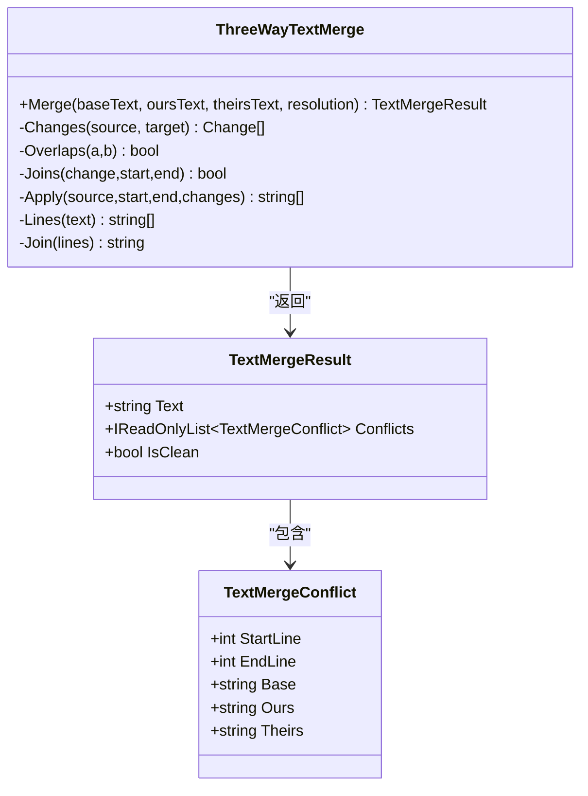
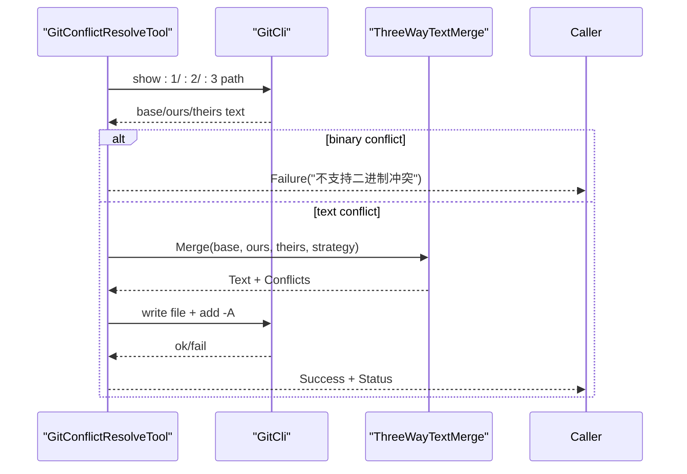
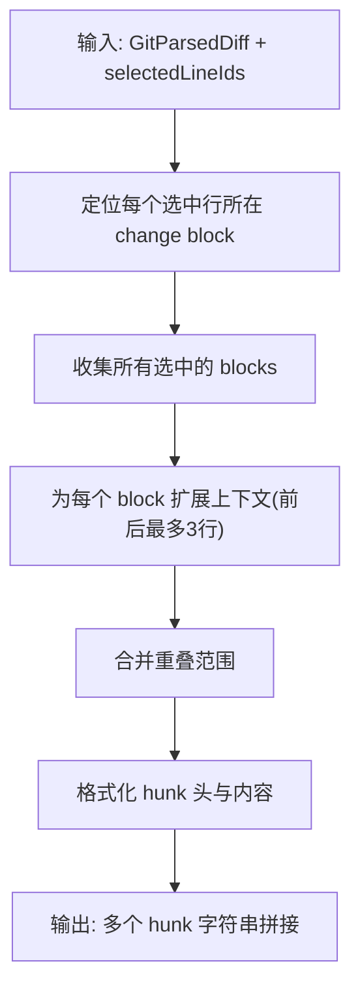
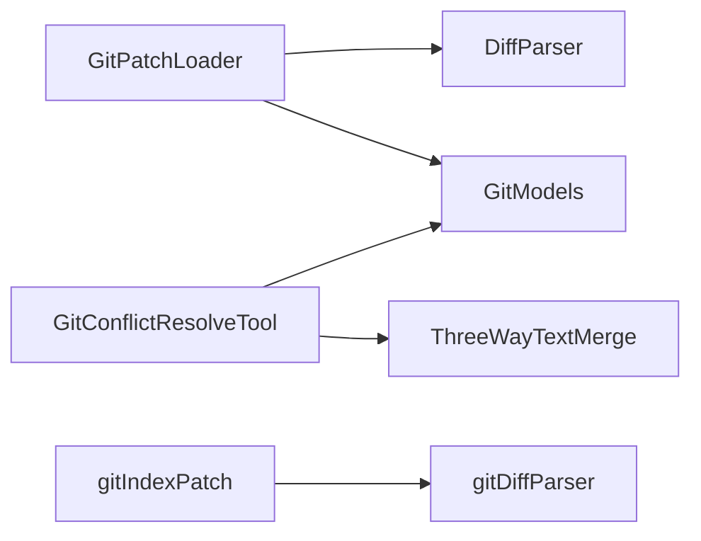

# 差异解析

<cite>
**本文引用的文件**   
- [DiffParser.cs](file://TinadecTools/Tools/Git/DiffParser.cs)
- [GitPatchLoader.cs](file://TinadecTools/Tools/Git/GitPatchLoader.cs)
- [ThreeWayTextMerge.cs](file://TinadecTools/Tools/Git/ThreeWayTextMerge.cs)
- [GitConflictResolveTool.cs](file://TinadecTools/Tools/Git/GitConflictResolveTool.cs)
- [GitModels.cs](file://TinadecTools/Tools/Git/GitModels.cs)
- [gitDiffParser.ts](file://apps/desktop/src/gitDiffParser.ts)
- [gitIndexPatch.ts](file://apps/desktop/src/gitIndexPatch.ts)
- [gitDiffParser.test.ts](file://apps/desktop/src/gitDiffParser.test.ts)
- [ThreeWayTextMergeTests.cs](file://tests/TinadecTools.Tests/ThreeWayTextMergeTests.cs)
</cite>

## 目录
1. [简介](#简介)
2. [项目结构](#项目结构)
3. [核心组件](#核心组件)
4. [架构总览](#架构总览)
5. [详细组件分析](#详细组件分析)
6. [依赖关系分析](#依赖关系分析)
7. [性能考量](#性能考量)
8. [故障排查指南](#故障排查指南)
9. [结论](#结论)
10. [附录：差异分析与冲突解决示例](#附录：差异分析与冲突解决示例)

## 简介
本文件面向 Git 差异解析与合并能力，系统性说明以下方面：
- diff 格式解析（unified diff、name-status、numstat）
- 补丁加载流程与大小限制
- 三方文本合并算法与冲突标记处理
- 二进制文件处理策略
- 编码转换与输出控制
- 性能优化与降级策略
- 合并策略选择（auto/ours/theirs/both）与自动解决规则
- 前端差异展示与可应用补丁生成

## 项目结构
后端 C# 工具层提供差异解析、补丁加载、三方合并与冲突解决；前端 TypeScript 提供统一 diff 解析与基于选择的补丁构建。关键模块分布如下：
- 后端解析与合并：DiffParser、GitPatchLoader、ThreeWayTextMerge、GitConflictResolveTool、GitModels
- 前端解析与补丁：gitDiffParser.ts、gitIndexPatch.ts
- 测试用例：gitDiffParser.test.ts、ThreeWayTextMergeTests.cs



图表来源 
- [DiffParser.cs:1-316](file://TinadecTools/Tools/Git/DiffParser.cs#L1-L316)
- [GitPatchLoader.cs:1-42](file://TinadecTools/Tools/Git/GitPatchLoader.cs#L1-L42)
- [ThreeWayTextMerge.cs:1-143](file://TinadecTools/Tools/Git/ThreeWayTextMerge.cs#L1-L143)
- [GitConflictResolveTool.cs:1-87](file://TinadecTools/Tools/Git/GitConflictResolveTool.cs#L1-L87)
- [GitModels.cs:1-123](file://TinadecTools/Tools/Git/GitModels.cs#L1-L123)
- [gitDiffParser.ts:1-178](file://apps/desktop/src/gitDiffParser.ts#L1-L178)
- [gitIndexPatch.ts:1-108](file://apps/desktop/src/gitIndexPatch.ts#L1-L108)

章节来源
- [DiffParser.cs:1-316](file://TinadecTools/Tools/Git/DiffParser.cs#L1-L316)
- [GitPatchLoader.cs:1-42](file://TinadecTools/Tools/Git/GitPatchLoader.cs#L1-L42)
- [ThreeWayTextMerge.cs:1-143](file://TinadecTools/Tools/Git/ThreeWayTextMerge.cs#L1-L143)
- [GitConflictResolveTool.cs:1-87](file://TinadecTools/Tools/Git/GitConflictResolveTool.cs#L1-L87)
- [GitModels.cs:1-123](file://TinadecTools/Tools/Git/GitModels.cs#L1-L123)
- [gitDiffParser.ts:1-178](file://apps/desktop/src/gitDiffParser.ts#L1-L178)
- [gitIndexPatch.ts:1-108](file://apps/desktop/src/gitIndexPatch.ts#L1-L108)

## 核心组件
- DiffParser：解析 name-status、numstat、unified diff，并合并为 GitFileChange 列表与 GitPatchFile 列表
- GitPatchLoader：调用 Git CLI 获取补丁，进行字节预算与截断检查，返回结构化结果
- ThreeWayTextMerge：基于 LCS 的三方文本合并，支持冲突标记、ours/theirs/both 策略
- GitConflictResolveTool：封装冲突解决流程，读取暂存区三阶段内容，写入结果并更新索引
- GitModels：定义 GitFileChange、GitPatchFile、GitDiffHunk、GitDiffLine 等数据结构
- gitDiffParser.ts：前端 unified diff 解析，生成带 id 的结构化对象
- gitIndexPatch.ts：根据用户选择的行，生成独立可应用的补丁片段

章节来源
- [DiffParser.cs:1-316](file://TinadecTools/Tools/Git/DiffParser.cs#L1-L316)
- [GitPatchLoader.cs:1-42](file://TinadecTools/Tools/Git/GitPatchLoader.cs#L1-L42)
- [ThreeWayTextMerge.cs:1-143](file://TinadecTools/Tools/Git/ThreeWayTextMerge.cs#L1-L143)
- [GitConflictResolveTool.cs:1-87](file://TinadecTools/Tools/Git/GitConflictResolveTool.cs#L1-L87)
- [GitModels.cs:1-123](file://TinadecTools/Tools/Git/GitModels.cs#L1-L123)
- [gitDiffParser.ts:1-178](file://apps/desktop/src/gitDiffParser.ts#L1-L178)
- [gitIndexPatch.ts:1-108](file://apps/desktop/src/gitIndexPatch.ts#L1-L108)

## 架构总览
整体数据流从 Git CLI 输出开始，经后端解析为结构化模型，再在前端渲染或生成补丁；冲突解决通过读取暂存区三阶段内容，执行三方合并后写回工作区并提交变更。



图表来源 
- [GitPatchLoader.cs:1-42](file://TinadecTools/Tools/Git/GitPatchLoader.cs#L1-L42)
- [DiffParser.cs:1-316](file://TinadecTools/Tools/Git/DiffParser.cs#L1-L316)
- [ThreeWayTextMerge.cs:1-143](file://TinadecTools/Tools/Git/ThreeWayTextMerge.cs#L1-L143)
- [GitConflictResolveTool.cs:1-87](file://TinadecTools/Tools/Git/GitConflictResolveTool.cs#L1-L87)

## 详细组件分析

### DiffParser：diff/name-status/numstat 解析器
- 功能要点
  - 解析 name-status（含重命名 R/C 及相似度分数），支持以 \0 分隔的记录与常规换行两种输入
  - 解析 numstat（含二进制标志 “- -”），并与 name-status 按行对齐合并为 GitFileChange
  - 解析 unified diff，识别 diff 头、--- /+++ 路径、Binary 标记、@@ hunk 头与行级变更
  - 修正 add/delete 文件的旧/新路径为空时的默认值
- 复杂度与边界
  - 逐行扫描 O(N)，对空行作为 context 处理
  - 二进制文件直接标记 IsBinary，跳过 hunks 解析
- 错误处理
  - 空输入直接返回空列表
  - 路径前缀 a/ b/ 与 /dev/null 规范化处理

```mermaid
flowchart TD
Start(["进入 ParsePatch"]) --> Init["初始化 current/hunk/行号"]
Init --> Loop{"遍历每一行"}
Loop --> |diff --git| NewFile["创建新 GitPatchFile<br/>记录 old/new 路径"]
Loop --> |--- /+++| UpdatePaths["更新 OldPath/NewPath"]
Loop --> |Binary| MarkBin["标记 IsBinary=true"]
Loop --> |@@| Hunk["解析 hunk 头并追加到 Hunks"]
Loop --> |+/-/空格/空行| Lines["追加 GitDiffLine"]
Loop --> EndCheck{"是否结束?"}
EndCheck --> |否| Loop
EndCheck --> |是| FixPaths["修正 add/delete 路径为空的情况"]
FixPaths --> Return["返回 GitPatchFile 列表"]
```

图表来源 
- [DiffParser.cs:144-316](file://TinadecTools/Tools/Git/DiffParser.cs#L144-L316)

章节来源
- [DiffParser.cs:1-316](file://TinadecTools/Tools/Git/DiffParser.cs#L1-L316)

### GitPatchLoader：补丁加载与预算控制
- 功能要点
  - 调用 Git CLI 执行差异命令，设置超时与最大字符数
  - 捕获 UTF-8 字节计数，超过 maxPatchBytes 则返回截断结果
  - 成功时调用 DiffParser.ParsePatch 生成结构化补丁
- 错误与截断
  - 输出被截断：返回 Truncated=true 与原因
  - 命令失败：返回 Ok=false 且无 Patches



图表来源 
- [GitPatchLoader.cs:13-41](file://TinadecTools/Tools/Git/GitPatchLoader.cs#L13-L41)
- [DiffParser.cs:144-316](file://TinadecTools/Tools/Git/DiffParser.cs#L144-L316)

章节来源
- [GitPatchLoader.cs:1-42](file://TinadecTools/Tools/Git/GitPatchLoader.cs#L1-L42)

### ThreeWayTextMerge：三方文本合并与冲突标记
- 算法概述
  - 将 base/ours/theirs 归一化为行数组，使用 LCS DP 矩阵计算变更块
  - 当矩阵规模超过阈值 MaxLcsCells 时，退化为整段替换，保证可扩展性
  - 合并非重叠变更；对重叠区域按策略选择：
    - Markers：插入经典 Git 冲突标记
    - Ours/Theirs：选择一侧
    - Both：拼接两侧
  - 输出包含最终文本与冲突区间列表
- 性能特性
  - LCS 时间复杂度 O(mn)，空间受 MaxLcsCells 限制
  - 大文件场景自动降级为整段替换，避免内存爆炸
- 冲突标记
  - 标准标记包括 <<<<<<< ours、||||||| base、=======、>>>>>>> theirs



图表来源 
- [ThreeWayTextMerge.cs:1-143](file://TinadecTools/Tools/Git/ThreeWayTextMerge.cs#L1-L143)

章节来源
- [ThreeWayTextMerge.cs:1-143](file://TinadecTools/Tools/Git/ThreeWayTextMerge.cs#L1-L143)
- [ThreeWayTextMergeTests.cs:1-99](file://tests/TinadecTools.Tests/ThreeWayTextMergeTests.cs#L1-L99)

### GitConflictResolveTool：冲突解决工具
- 功能要点
  - 参数校验与策略选择（auto/ours/theirs/both）
  - 读取暂存区 stage 1/2/3 对应文件内容
  - 二进制冲突不支持 auto/both，需选择 ours/theirs
  - 文本冲突调用 ThreeWayTextMerge 合并，统计冲突数量
  - 写回工作区（UTF-8 无 BOM），add -A 提交索引，返回状态与剩余冲突
- 错误处理
  - 非冲突路径返回失败
  - 二进制冲突策略非法返回失败
  - Git 命令失败返回错误信息



图表来源 
- [GitConflictResolveTool.cs:34-87](file://TinadecTools/Tools/Git/GitConflictResolveTool.cs#L34-L87)
- [ThreeWayTextMerge.cs:16-89](file://TinadecTools/Tools/Git/ThreeWayTextMerge.cs#L16-L89)

章节来源
- [GitConflictResolveTool.cs:1-87](file://TinadecTools/Tools/Git/GitConflictResolveTool.cs#L1-L87)

### GitModels：数据结构定义
- 关键字段
  - GitFileChange：status、score、old/new path、additions/deletions、is_binary、blob_hash、byte_size
  - GitPatchFile：old/new path、status、is_binary、hunks
  - GitDiffHunk：old/new start/count、lines
  - GitDiffLine：type、old/new line number、content
- 用途
  - 统一前后端差异表示，便于渲染与应用补丁

章节来源
- [GitModels.cs:1-123](file://TinadecTools/Tools/Git/GitModels.cs#L1-L123)

### 前端差异解析与补丁生成
- gitDiffParser.ts
  - 解析 unified diff，识别 rename/new/deleted/binary
  - 生成带唯一 id 的文件、hunk、行对象，便于 UI 交互
- gitIndexPatch.ts
  - 根据用户选择的行，聚合相邻变更块，扩展上下文（各3行）
  - 合并范围，生成独立可应用的 patch 片段



图表来源 
- [gitIndexPatch.ts:14-108](file://apps/desktop/src/gitIndexPatch.ts#L14-L108)

章节来源
- [gitDiffParser.ts:1-178](file://apps/desktop/src/gitDiffParser.ts#L1-L178)
- [gitIndexPatch.ts:1-108](file://apps/desktop/src/gitIndexPatch.ts#L1-L108)
- [gitDiffParser.test.ts:1-84](file://apps/desktop/src/gitDiffParser.test.ts#L1-L84)

## 依赖关系分析
- 后端
  - GitPatchLoader 依赖 GitCli（外部 CLI）与 DiffParser
  - GitConflictResolveTool 依赖 GitCli 与 ThreeWayTextMerge
  - DiffParser 与 GitModels 紧密耦合，用于结构化输出
- 前端
  - gitIndexPatch 依赖 gitDiffParser 的输出结构
  - 两者共同支撑 UI 的差异展示与补丁生成



图表来源 
- [GitPatchLoader.cs:1-42](file://TinadecTools/Tools/Git/GitPatchLoader.cs#L1-L42)
- [DiffParser.cs:1-316](file://TinadecTools/Tools/Git/DiffParser.cs#L1-L316)
- [GitConflictResolveTool.cs:1-87](file://TinadecTools/Tools/Git/GitConflictResolveTool.cs#L1-L87)
- [ThreeWayTextMerge.cs:1-143](file://TinadecTools/Tools/Git/ThreeWayTextMerge.cs#L1-L143)
- [gitIndexPatch.ts:1-108](file://apps/desktop/src/gitIndexPatch.ts#L1-L108)
- [gitDiffParser.ts:1-178](file://apps/desktop/src/gitDiffParser.ts#L1-L178)

章节来源
- [GitPatchLoader.cs:1-42](file://TinadecTools/Tools/Git/GitPatchLoader.cs#L1-L42)
- [DiffParser.cs:1-316](file://TinadecTools/Tools/Git/DiffParser.cs#L1-L316)
- [GitConflictResolveTool.cs:1-87](file://TinadecTools/Tools/Git/GitConflictResolveTool.cs#L1-L87)
- [ThreeWayTextMerge.cs:1-143](file://TinadecTools/Tools/Git/ThreeWayTextMerge.cs#L1-L143)
- [gitIndexPatch.ts:1-108](file://apps/desktop/src/gitIndexPatch.ts#L1-L108)
- [gitDiffParser.ts:1-178](file://apps/desktop/src/gitDiffParser.ts#L1-L178)

## 性能考量
- 差异解析
  - 线性扫描 O(N)，对空行与二进制快速分支，避免不必要的解析
- 补丁加载
  - 通过 maxOutputChars 与 UTF-8 字节计数双重限制，防止过大输出导致内存压力
- 三方合并
  - LCS DP 矩阵上限 MaxLcsCells=4,000,000，超出阈值退化为整段替换，确保稳定性
  - 行归一化处理（\r\n→\n）减少跨平台差异
- 编码与 I/O
  - 写回文件使用 UTF-8 无 BOM，避免编辑器误判
  - 异步操作配合 CancellationToken，提升响应性与可取消性

[本节为通用指导，不直接分析具体文件]

## 故障排查指南
- 补丁被截断
  - 现象：返回 Truncated=true，Reason="patch_output_limit"
  - 排查：增大 maxPatchBytes 或分批次请求
  - 参考：[GitPatchLoader.cs:29-37](file://TinadecTools/Tools/Git/GitPatchLoader.cs#L29-L37)
- 二进制冲突无法自动合并
  - 现象：strategy=auto/both 时报错“不支持二进制冲突”
  - 处理：选择 ours/theirs 策略手动决定
  - 参考：[GitConflictResolveTool.cs:57-58](file://TinadecTools/Tools/Git/GitConflictResolveTool.cs#L57-L58)
- 未找到冲突路径
  - 现象：提示“不是未解决的 Git 冲突”
  - 处理：确认路径存在且确实在暂存区有冲突
  - 参考：[GitConflictResolveTool.cs:48](file://TinadecTools/Tools/Git/GitConflictResolveTool.cs#L48)
- 前端解析异常
  - 现象：hunks 为空或 notice 提示无差异
  - 处理：检查输入 diff 是否符合 unified diff 规范
  - 参考：[gitDiffParser.ts:36-156](file://apps/desktop/src/gitDiffParser.ts#L36-L156)

章节来源
- [GitPatchLoader.cs:29-37](file://TinadecTools/Tools/Git/GitPatchLoader.cs#L29-L37)
- [GitConflictResolveTool.cs:48-58](file://TinadecTools/Tools/Git/GitConflictResolveTool.cs#L48-L58)
- [gitDiffParser.ts:36-156](file://apps/desktop/src/gitDiffParser.ts#L36-L156)

## 结论
本实现围绕 Git 差异与合并的核心需求，提供了稳健的后端解析与合并能力，以及灵活的前端差异展示与补丁生成机制。通过预算控制、降级策略与明确的冲突标记，既保证了性能与稳定性，也兼顾了用户体验与可操作性。建议在生产环境中结合日志与指标监控补丁大小与冲突率，持续优化阈值与策略。

[本节为总结，不直接分析具体文件]

## 附录：差异分析与冲突解决示例
- 差异分析示例
  - 修改文件：包含删除与新增行，hunk 头正确标注行号范围
  - 新增/删除/重命名：change_type 与 previous_path 字段准确反映变更类型
  - 二进制文件：binary=true，notice 保留原始提示信息
  - 参考测试：[gitDiffParser.test.ts:5-83](file://apps/desktop/src/gitDiffParser.test.ts#L5-L83)
- 冲突解决示例
  - 非重叠变更自动合并
  - 重叠冲突插入标准标记，或按 ours/theirs/both 策略处理
  - 大文件场景触发降级，仍保持可合并性
  - 参考测试：[ThreeWayTextMergeTests.cs:8-97](file://tests/TinadecTools.Tests/ThreeWayTextMergeTests.cs#L8-L97)

章节来源
- [gitDiffParser.test.ts:1-84](file://apps/desktop/src/gitDiffParser.test.ts#L1-L84)
- [ThreeWayTextMergeTests.cs:1-99](file://tests/TinadecTools.Tests/ThreeWayTextMergeTests.cs#L1-L99)