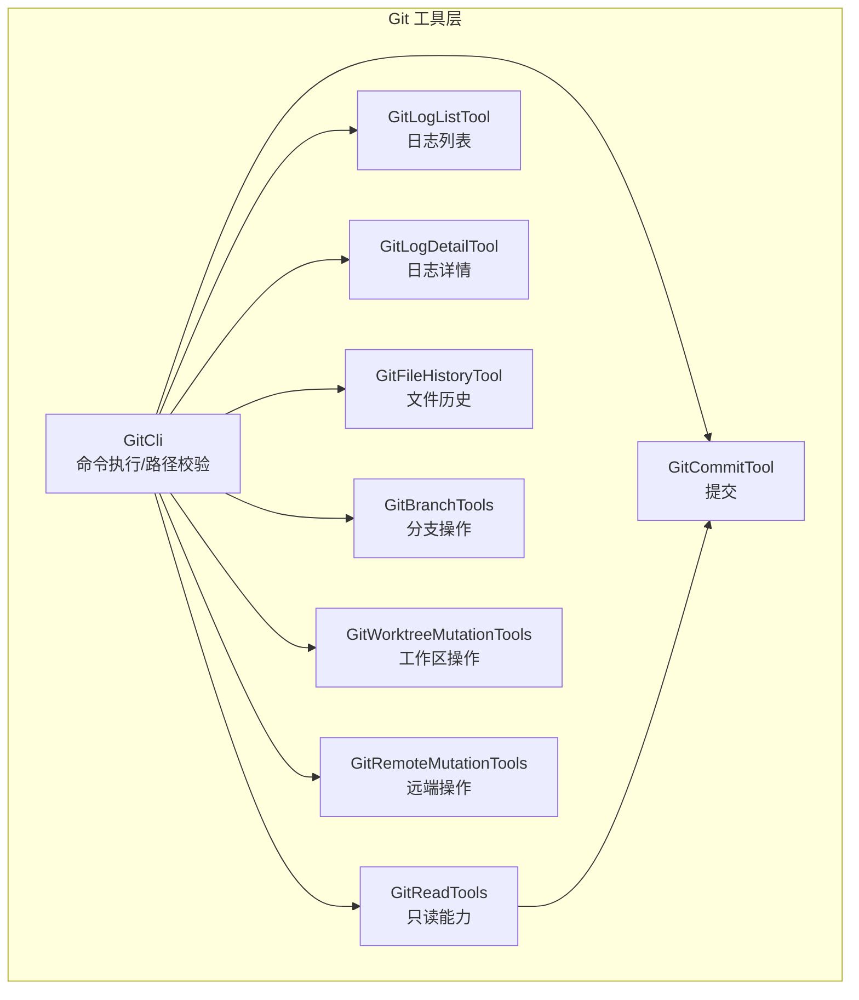
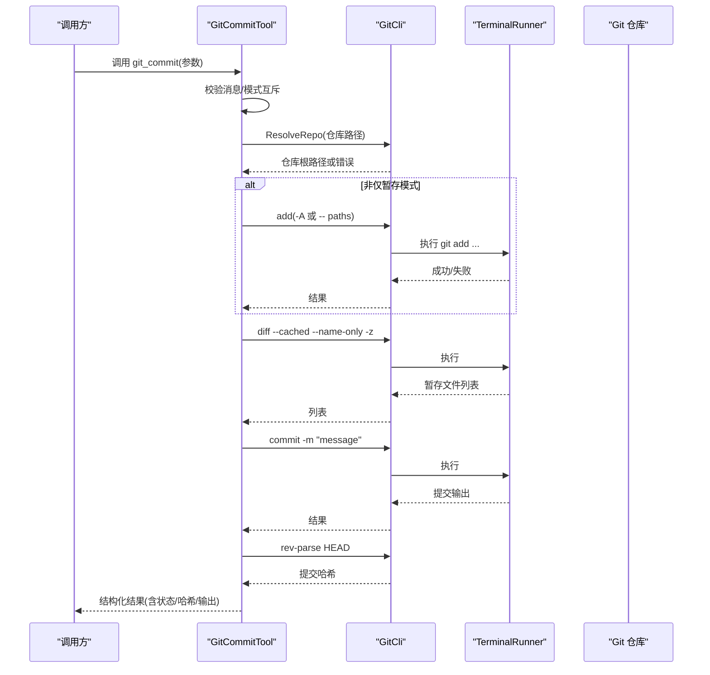
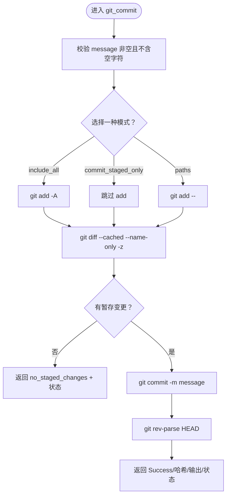
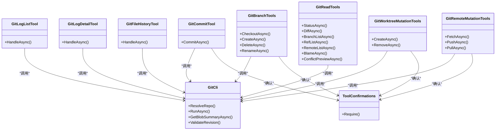

# 提交管理

<cite>
**本文引用的文件**   
- [GitCommitTool.cs](file://TinadecTools/Tools/Git/GitCommitTool.cs)
- [GitLogListTool.cs](file://TinadecTools/Tools/Git/GitLogListTool.cs)
- [GitLogDetailTool.cs](file://TinadecTools/Tools/Git/GitLogDetailTool.cs)
- [GitFileHistoryTool.cs](file://TinadecTools/Tools/Git/GitFileHistoryTool.cs)
- [GitBranchTools.cs](file://TinadecTools/Tools/Git/GitBranchTools.cs)
- [GitCli.cs](file://TinadecTools/Tools/Git/GitCli.cs)
- [GitReadTools.cs](file://TinadecTools/Tools/Git/GitReadTools.cs)
- [GitWorktreeMutationTools.cs](file://TinadecTools/Tools/Git/GitWorktreeMutationTools.cs)
- [GitRemoteMutationTools.cs](file://TinadecTools/Tools/Git/GitRemoteMutationTools.cs)
- [ToolConfirmations.cs](file://TinadecTools/Tools/ToolConfirmations.cs)
- [GitModels.cs](file://TinadecTools/Tools/Git/GitModels.cs)
</cite>

## 目录
1. [简介](#简介)
2. [项目结构](#项目结构)
3. [核心组件](#核心组件)
4. [架构总览](#架构总览)
5. [详细组件分析](#详细组件分析)
6. [依赖关系分析](#依赖关系分析)
7. [性能考量](#性能考量)
8. [故障排查指南](#故障排查指南)
9. [结论](#结论)
10. [附录：提交工作流与最佳实践](#附录提交工作流与最佳实践)

## 简介
本文件面向 Git 提交管理的实现与使用，覆盖代码提交、日志查询、历史查看、消息生成（结合工具能力）、提交内容验证、作者信息设置、提交钩子处理、批量提交操作、提交模板、签名支持与合并提交处理等主题。文档基于仓库中 TinadecTools 的 Git 工具集进行系统化梳理，提供架构图、调用序列图、流程图以及可操作的实践建议，帮助开发者与自动化流程安全、高效地管理 Git 提交。

## 项目结构
Git 相关能力集中在 TinadecTools/Tools/Git 目录下，采用“按功能划分”的组织方式：
- 执行层：GitCli 负责命令执行、路径校验、输出限制与安全注入防护
- 读取层：GitReadTools 提供状态、差异、分支、引用、远程、冲突预览等只读能力
- 变更层：分支、工作区、远端、提交等写操作工具，均通过确认机制保护
- 模型层：GitModels 定义提交摘要、文件变更、补丁等通用数据结构
- 工具确认：ToolConfirmations 统一强制确认字段，避免误操作

图表来源 
- [GitCli.cs:1-144](file://TinadecTools/Tools/Git/GitCli.cs#L1-L144)
- [GitReadTools.cs:1-554](file://TinadecTools/Tools/Git/GitReadTools.cs#L1-L554)
- [GitCommitTool.cs:1-149](file://TinadecTools/Tools/Git/GitCommitTool.cs#L1-L149)
- [GitLogListTool.cs:1-125](file://TinadecTools/Tools/Git/GitLogListTool.cs#L1-L125)
- [GitLogDetailTool.cs:1-309](file://TinadecTools/Tools/Git/GitLogDetailTool.cs#L1-L309)
- [GitFileHistoryTool.cs:1-274](file://TinadecTools/Tools/Git/GitFileHistoryTool.cs#L1-L274)
- [GitBranchTools.cs:1-105](file://TinadecTools/Tools/Git/GitBranchTools.cs#L1-L105)
- [GitWorktreeMutationTools.cs:1-108](file://TinadecTools/Tools/Git/GitWorktreeMutationTools.cs#L1-L108)
- [GitRemoteMutationTools.cs:1-119](file://TinadecTools/Tools/Git/GitRemoteMutationTools.cs#L1-L119)

章节来源
- [GitCli.cs:1-144](file://TinadecTools/Tools/Git/GitCli.cs#L1-L144)
- [GitReadTools.cs:1-554](file://TinadecTools/Tools/Git/GitReadTools.cs#L1-L554)

## 核心组件
- GitCli：统一的 Git CLI 执行封装，包含仓库解析、参数安全校验、输出大小限制、错误码标准化
- GitReadTools：只读 API，涵盖 status、diff、branch list、ref list、remote list、blame、冲突预览等
- GitCommitTool：提交工具，支持三种模式（全部、已暂存、指定路径），内置提交消息校验与结果结构化返回
- GitLogListTool / GitLogDetailTool：提交日志列表与详情，支持分页游标、范围 diff、补丁加载与二进制摘要
- GitFileHistoryTool：单文件历史，支持 rename 跟踪、增量补丁加载与字节预算控制
- GitBranchTools / GitWorktreeMutationTools / GitRemoteMutationTools：分支与工作区/远端变更操作，全部要求确认字段
- ToolConfirmations：强制确认字段校验，防止未授权或误触发的写操作
- GitModels：提交摘要、文件变更、补丁等数据模型，贯穿各工具输入输出

章节来源
- [GitCli.cs:1-144](file://TinadecTools/Tools/Git/GitCli.cs#L1-L144)
- [GitReadTools.cs:1-554](file://TinadecTools/Tools/Git/GitReadTools.cs#L1-L554)
- [GitCommitTool.cs:1-149](file://TinadecTools/Tools/Git/GitCommitTool.cs#L1-L149)
- [GitLogListTool.cs:1-125](file://TinadecTools/Tools/Git/GitLogListTool.cs#L1-L125)
- [GitLogDetailTool.cs:1-309](file://TinadecTools/Tools/Git/GitLogDetailTool.cs#L1-L309)
- [GitFileHistoryTool.cs:1-274](file://TinadecTools/Tools/Git/GitFileHistoryTool.cs#L1-L274)
- [GitBranchTools.cs:1-105](file://TinadecTools/Tools/Git/GitBranchTools.cs#L1-L105)
- [GitWorktreeMutationTools.cs:1-108](file://TinadecTools/Tools/Git/GitWorktreeMutationTools.cs#L1-L108)
- [GitRemoteMutationTools.cs:1-119](file://TinadecTools/Tools/Git/GitRemoteMutationTools.cs#L1-L119)
- [ToolConfirmations.cs:1-12](file://TinadecTools/Tools/ToolConfirmations.cs#L1-L12)
- [GitModels.cs:1-123](file://TinadecTools/Tools/Git/GitModels.cs#L1-L123)

## 架构总览
Git 工具层以 GitCli 为执行中枢，所有工具通过它发起命令；读写分离清晰，写操作一律需要确认；日志与历史工具提供分页与预算控制，保证大规模仓库下的稳定性。

图表来源 
- [GitCommitTool.cs:35-120](file://TinadecTools/Tools/Git/GitCommitTool.cs#L35-L120)
- [GitCli.cs:88-122](file://TinadecTools/Tools/Git/GitCli.cs#L88-L122)

## 详细组件分析

### 提交工具（git_commit）
- 功能要点
  - 三种提交模式互斥：include_all、commit_staged_only、paths
  - 提交消息必填且禁止空字符
  - 自动 add（根据模式），随后 diff --cached 获取暂存文件列表
  - 提交后返回提交哈希、输出与仓库状态
- 安全与校验
  - 通过 ToolConfirmations.Require 强制确认字段
  - 路径解析与相对化，确保在仓库内
- 错误处理
  - 标准化错误码（如 not_a_repo、git_not_found）
  - 无暂存变更时返回明确错误码与当前状态

图表来源 
- [GitCommitTool.cs:35-120](file://TinadecTools/Tools/Git/GitCommitTool.cs#L35-L120)
- [GitCli.cs:124-143](file://TinadecTools/Tools/Git/GitCli.cs#L124-L143)

章节来源
- [GitCommitTool.cs:1-149](file://TinadecTools/Tools/Git/GitCommitTool.cs#L1-L149)
- [ToolConfirmations.cs:1-12](file://TinadecTools/Tools/ToolConfirmations.cs#L1-L12)

### 日志列表（git_log_list）
- 功能要点
  - 支持 revs、after_commit 游标翻页、limit/skip
  - 自定义格式输出，解析提交元数据与装饰信息
  - LaneAssigner 为提交分配 lane，便于可视化
- 安全与校验
  - 拒绝 revs 中包含选项注入（以“-”开头）
  - after_commit 需通过 ValidateRevision
- 输出控制
  - 超过 limit 时标记 truncated 并提供 next_cursor

章节来源
- [GitLogListTool.cs:1-125](file://TinadecTools/Tools/Git/GitLogListTool.cs#L1-L125)

### 日志详情（git_log_detail）
- 功能要点
  - 支持单提交或范围（A..B）
  - 可选 include_patch 拉取结构化 hunks
  - 二进制文件补充 blob hash 与 byte size
  - 支持 max_files、max_patch_bytes 限制
- 处理逻辑
  - 先尝试 rev-parse 验证是否为单提交，否则走范围分支
  - 范围模式下计算 base/head 并生成 diff 与 patch

章节来源
- [GitLogDetailTool.cs:1-309](file://TinadecTools/Tools/Git/GitLogDetailTool.cs#L1-L309)

### 文件历史（git_file_history）
- 功能要点
  - 针对单文件，默认 --follow 跟踪重命名
  - 分块解析提交与变更，按需加载补丁，受 max_patch_bytes 控制
  - 二进制文件填充 blob hash 与 byte size
- 游标与截断
  - 支持 skip、after_commit 继续翻页
  - 当达到 limit 或补丁预算耗尽时返回 truncated 与 reason

章节来源
- [GitFileHistoryTool.cs:1-274](file://TinadecTools/Tools/Git/GitFileHistoryTool.cs#L1-L274)

### 分支操作（git_branch_*）
- 功能要点
  - checkout、create、delete、rename 四种动作
  - 名称合法性检查（check-ref-format）
  - 删除当前分支时阻止
- 安全与确认
  - 每个动作对应不同 confirm_* 字段，必须提供

章节来源
- [GitBranchTools.cs:1-105](file://TinadecTools/Tools/Git/GitBranchTools.cs#L1-L105)
- [ToolConfirmations.cs:1-12](file://TinadecTools/Tools/ToolConfirmations.cs#L1-L12)

### 工作区操作（git_worktree_*）
- 功能要点
  - create/remove，路径限定在 .tinadec/worktrees 下
  - 创建时可自动新建分支或从 start_ref 开始
  - 删除时不允许移除当前 worktree
- 安全与确认
  - create/remove 分别要求 confirm_worktree_create / confirm_worktree_remove

章节来源
- [GitWorktreeMutationTools.cs:1-108](file://TinadecTools/Tools/Git/GitWorktreeMutationTools.cs#L1-L108)
- [ToolConfirmations.cs:1-12](file://TinadecTools/Tools/ToolConfirmations.cs#L1-L12)

### 远端操作（git_fetch/push/pull）
- 功能要点
  - fetch：支持 --prune，刷新分支列表
  - push：前置检查 detached HEAD、未提交变更、behind upstream；必要时 -u 设置上游
  - pull：仅快进（--ff-only），支持 remote+branch 或上游分支
- 安全与确认
  - 每项操作要求对应的 confirm_* 字段

章节来源
- [GitRemoteMutationTools.cs:1-119](file://TinadecTools/Tools/Git/GitRemoteMutationTools.cs#L1-L119)
- [ToolConfirmations.cs:1-12](file://TinadecTools/Tools/ToolConfirmations.cs#L1-L12)

### 只读能力（status/diff/ref/remote/blame/conflict）
- 功能要点
  - status：porcelain v1 + branch 信息，解析 ahead/behind/untracked/conflicted
  - diff：支持 working_tree/staged/ref_range，合并 name-status 与 numstat
  - ref/remote/branch list：统一 for-each-ref 或 remote 命令
  - blame：行级 porcelain 解析，支持行范围
  - conflict preview：三向合并冲突块预览，检测 rebase/merge 操作
- 输出控制
  - 多处支持 max_output_bytes/max_diff_bytes/max_files 等限制

章节来源
- [GitReadTools.cs:1-554](file://TinadecTools/Tools/Git/GitReadTools.cs#L1-L554)

## 依赖关系分析
- 耦合与内聚
  - GitCli 作为唯一执行入口，降低外部耦合
  - 各工具类职责单一，输入输出模型集中定义于 GitModels
- 直接/间接依赖
  - 所有写操作工具依赖 ToolConfirmations 做确认校验
  - 日志/历史工具依赖 DiffParser、LaneAssigner、GitPatchLoader（由工具内部调用）
- 外部依赖
  - TerminalRunner 用于进程执行与超时控制
  - WorkspacePathResolver 用于路径规范化与安全校验

图表来源 
- [GitCli.cs:1-144](file://TinadecTools/Tools/Git/GitCli.cs#L1-L144)
- [GitReadTools.cs:1-554](file://TinadecTools/Tools/Git/GitReadTools.cs#L1-L554)
- [GitCommitTool.cs:1-149](file://TinadecTools/Tools/Git/GitCommitTool.cs#L1-L149)
- [GitLogListTool.cs:1-125](file://TinadecTools/Tools/Git/GitLogListTool.cs#L1-L125)
- [GitLogDetailTool.cs:1-309](file://TinadecTools/Tools/Git/GitLogDetailTool.cs#L1-L309)
- [GitFileHistoryTool.cs:1-274](file://TinadecTools/Tools/Git/GitFileHistoryTool.cs#L1-L274)
- [GitBranchTools.cs:1-105](file://TinadecTools/Tools/Git/GitBranchTools.cs#L1-L105)
- [GitWorktreeMutationTools.cs:1-108](file://TinadecTools/Tools/Git/GitWorktreeMutationTools.cs#L1-L108)
- [GitRemoteMutationTools.cs:1-119](file://TinadecTools/Tools/Git/GitRemoteMutationTools.cs#L1-L119)
- [ToolConfirmations.cs:1-12](file://TinadecTools/Tools/ToolConfirmations.cs#L1-L12)

## 性能考量
- 输出限制
  - RunAsync 支持 maxOutputChars，避免大输出导致内存压力
  - 日志详情/文件历史支持 max_files、max_patch_bytes，控制网络与序列化开销
- 批量化与分页
  - log_list/log_detail/file_history 支持 limit/skip/after_commit 游标，适合分页展示
- 二进制文件优化
  - 对二进制文件仅返回 blob hash 与 byte size，不加载内容
- 并发与超时
  - 所有命令执行支持 timeoutMs 与 CancellationToken，避免阻塞

[本节为通用指导，不直接分析具体文件]

## 故障排查指南
- 常见错误码
  - git_not_found：未找到 git 命令
  - not_a_repo：路径不是 Git 仓库
  - no_staged_changes：无暂存变更无法提交
- 典型问题定位
  - 提交失败：检查是否选择了正确的提交模式、是否存在暂存变更、消息是否合法
  - 推送失败：检查 detached HEAD、未提交变更、behind upstream、上游配置
  - 拉取失败：检查上游配置与 --ff-only 约束
- 调试建议
  - 使用 git_status/git_diff 观察工作区与暂存状态
  - 使用 git_log_detail/include_patch 查看具体变更与补丁
  - 使用 git_conflict_preview 分析冲突块与操作类型（rebase/merge）

章节来源
- [GitCommitTool.cs:129-148](file://TinadecTools/Tools/Git/GitCommitTool.cs#L129-L148)
- [GitRemoteMutationTools.cs:60-118](file://TinadecTools/Tools/Git/GitRemoteMutationTools.cs#L60-L118)
- [GitReadTools.cs:475-553](file://TinadecTools/Tools/Git/GitReadTools.cs#L475-L553)

## 结论
该 Git 工具集以清晰的读写分层、严格的参数校验与确认机制、完善的输出控制与错误码体系，提供了稳定可靠的提交管理与历史查询能力。通过分页与预算控制，能够在大仓库场景下保持良好性能与用户体验。建议在自动化流水线与 IDE 集成中优先使用该工具集，以确保一致性与安全性。

[本节为总结性内容，不直接分析具体文件]

## 附录：提交工作流与最佳实践
- 提交前准备
  - 使用 git_status 检查工作区状态与分支信息
  - 使用 git_diff 查看工作区/暂存/范围差异，必要时限制 max_files/max_diff_bytes
- 提交消息生成
  - 结合 AI 能力生成结构化消息（标题+正文），确保不包含空字符
  - 遵循约定式提交规范（如 feat/fix/docs 等），提升可读性
- 提交执行
  - 选择合适模式：全部变更、仅暂存、指定路径
  - 必须提供 confirm_commit 字段，避免误提交
- 提交后验证
  - 检查返回的 commit_hash 与 status
  - 使用 git_log_list/git_log_detail 验证提交内容与链接
- 作者信息与签名
  - 若需固定作者信息，可在执行环境设置 GIT_AUTHOR_NAME/GIT_AUTHOR_EMAIL 等环境变量
  - 如需签名提交，请在 Git 配置中启用 gpg/signing，并确保密钥可用
- 提交钩子处理
  - 钩子在 Git 层面执行，工具层不拦截；可通过 CI/CD 或 pre-commit 框架进行二次校验
- 批量提交
  - 对于多文件/多模块变更，建议使用 paths 模式精确提交，减少无关变更混入
  - 结合 git_file_history 追踪关键文件变更，辅助拆分提交
- 合并提交处理
  - 使用 git_conflict_preview 识别冲突块，结合 ThreeWayTextMerge 辅助解决
  - 在 rebase/merge 过程中，谨慎推进，确保上游同步与本地变更一致性

章节来源
- [GitReadTools.cs:273-319](file://TinadecTools/Tools/Git/GitReadTools.cs#L273-L319)
- [GitCommitTool.cs:35-120](file://TinadecTools/Tools/Git/GitCommitTool.cs#L35-L120)
- [GitFileHistoryTool.cs:71-236](file://TinadecTools/Tools/Git/GitFileHistoryTool.cs#L71-L236)
- [GitLogDetailTool.cs:69-252](file://TinadecTools/Tools/Git/GitLogDetailTool.cs#L69-L252)
- [GitLogListTool.cs:49-124](file://TinadecTools/Tools/Git/GitLogListTool.cs#L49-L124)