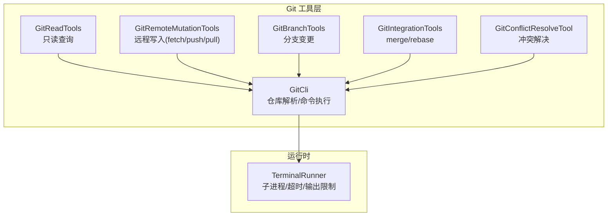
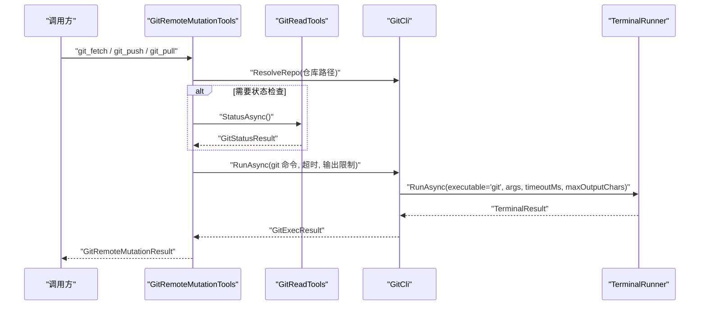
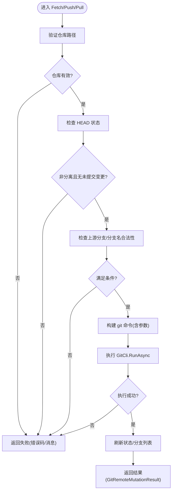
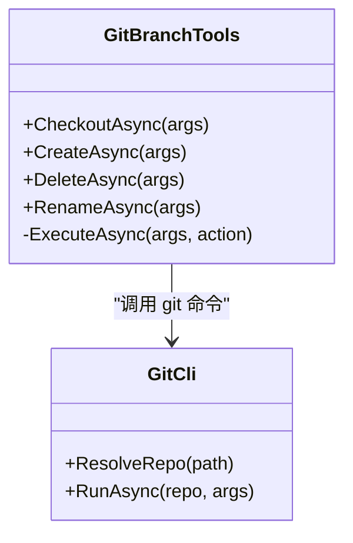
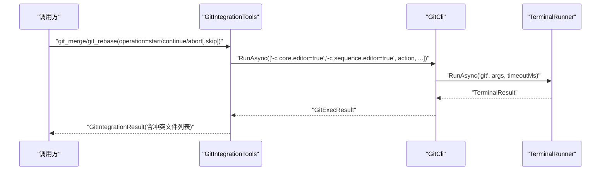
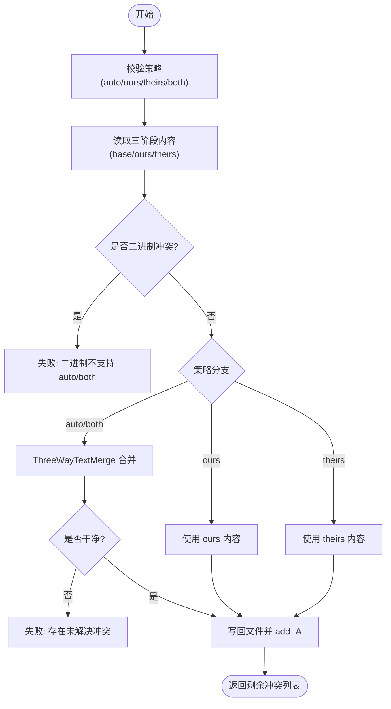
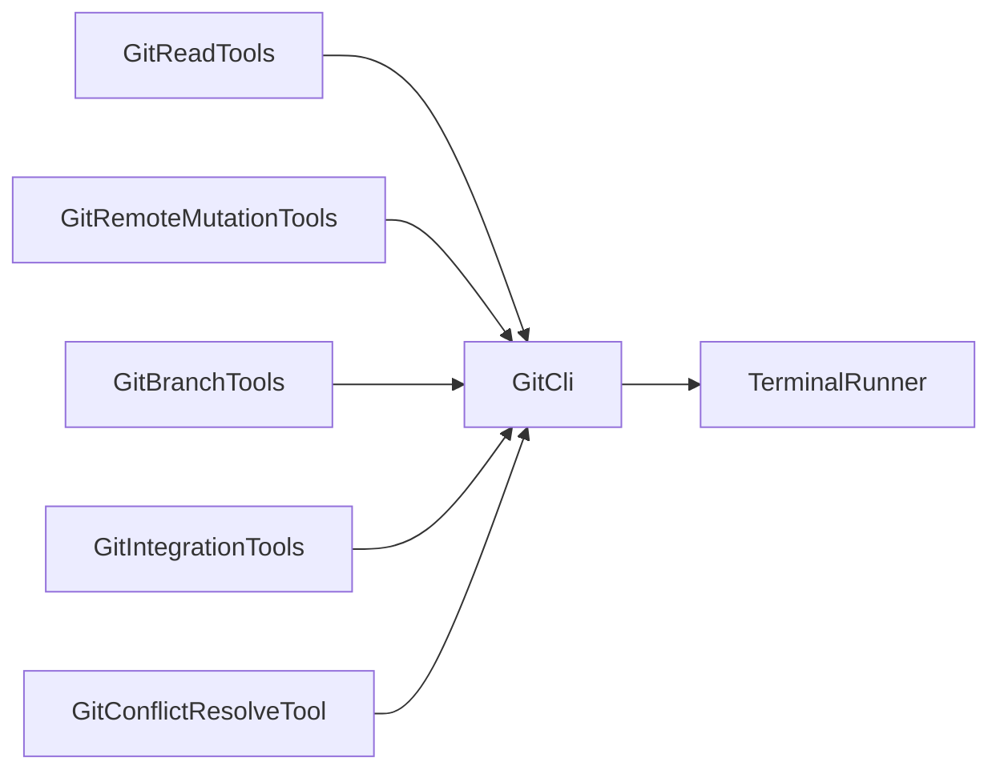
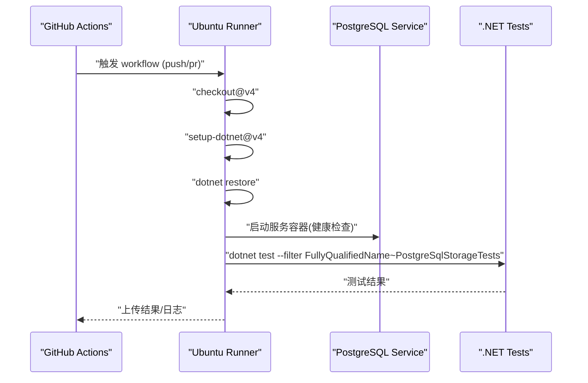

# 远程操作

<cite>
**本文引用的文件**   
- [GitRemoteMutationTools.cs](file://TinadecTools/Tools/Git/GitRemoteMutationTools.cs)
- [GitCli.cs](file://TinadecTools/Tools/Git/GitCli.cs)
- [TerminalRunner.cs](file://TinadecTools/Runtime/TerminalRunner.cs)
- [GitReadTools.cs](file://TinadecTools/Tools/Git/GitReadTools.cs)
- [GitBranchTools.cs](file://TinadecTools/Tools/Git/GitBranchTools.cs)
- [GitConflictResolveTool.cs](file://TinadecTools/Tools/Git/GitConflictResolveTool.cs)
- [GitIntegrationTools.cs](file://TinadecTools/Tools/Git/GitIntegrationTools.cs)
- [core-storage-postgres.yml](file://.github/workflows/core-storage-postgres.yml)
</cite>

## 目录
1. [简介](#简介)
2. [项目结构](#项目结构)
3. [核心组件](#核心组件)
4. [架构总览](#架构总览)
5. [详细组件分析](#详细组件分析)
6. [依赖关系分析](#依赖关系分析)
7. [性能与可靠性](#性能与可靠性)
8. [认证、代理与网络配置](#认证代理与网络配置)
9. [分支同步、冲突协调与协作集成](#分支同步冲突协调与协作集成)
10. [CI/CD 流水线对接](#cicd-流水线对接)
11. [故障排除指南](#故障排除指南)
12. [结论](#结论)

## 简介
本文件面向 Git 远程操作的完整实现，覆盖仓库连接、推送拉取、标签与引用管理、分支同步、冲突协调、代码审查集成与 CI/CD 流水线对接。文档基于仓库中 Git 工具层的 C# 实现进行系统化梳理，重点说明：
- 远程仓库的 fetch/push/pull 流程与前置校验
- 分支创建、切换、删除、重命名等变更操作
- 合并与变基（merge/rebase）工作流及冲突解决
- 状态查询、差异对比、引用列表、远端信息获取
- 终端进程执行、超时控制、输出限制与错误码
- 在 GitHub Actions 中的 CI/CD 触发与测试运行

## 项目结构
Git 相关能力集中在 TinadecTools/Tools/Git 目录下，通过统一的 CLI 封装 TerminalRunner 调用 git 命令，所有参数以 ArgumentList 传递，避免 Shell 注入风险。关键文件职责如下：
- GitCli：仓库路径解析、git 命令执行、输出截断与错误码处理
- GitReadTools：只读操作（status/diff/branch/ref/remote/blame/file at revision/conflict preview）
- GitRemoteMutationTools：远程写入（fetch/push/pull）
- GitBranchTools：分支变更（checkout/create/delete/rename）
- GitIntegrationTools：集成操作（merge/rebase）
- GitConflictResolveTool：冲突自动/策略性解决
- TerminalRunner：通用子进程执行器（超时、输出限制、安全终止）

图表来源
- [GitCli.cs:1-144](file://TinadecTools/Tools/Git/GitCli.cs#L1-L144)
- [GitReadTools.cs:1-554](file://TinadecTools/Tools/Git/GitReadTools.cs#L1-L554)
- [GitRemoteMutationTools.cs:1-119](file://TinadecTools/Tools/Git/GitRemoteMutationTools.cs#L1-L119)
- [GitBranchTools.cs:1-105](file://TinadecTools/Tools/Git/GitBranchTools.cs#L1-L105)
- [GitIntegrationTools.cs:1-83](file://TinadecTools/Tools/Git/GitIntegrationTools.cs#L1-L83)
- [GitConflictResolveTool.cs:1-87](file://TinadecTools/Tools/Git/GitConflictResolveTool.cs#L1-L87)
- [TerminalRunner.cs:1-149](file://TinadecTools/Runtime/TerminalRunner.cs#L1-L149)

章节来源
- [GitCli.cs:1-144](file://TinadecTools/Tools/Git/GitCli.cs#L1-L144)
- [TerminalRunner.cs:1-149](file://TinadecTools/Runtime/TerminalRunner.cs#L1-L149)

## 核心组件
- GitCli
  - 作用：验证仓库根目录、统一执行 git 命令、标准化返回结果与错误码
  - 关键点：ArgumentList 防注入；输出字符上限；git 未找到/非仓库错误码
- GitReadTools
  - 作用：提供 status/diff/branch/ref/remote/blame/file at revision/conflict preview 等只读能力
  - 关键点：严格参数校验、输出大小限制、结构化结果
- GitRemoteMutationTools
  - 作用：封装 fetch/push/pull，包含前置校验（未提交变更、上游分支、分支名合法性）
  - 关键点：credential.interactive=never、--prune/--ff-only、upstream 设置
- GitBranchTools
  - 作用：checkout/create/delete/rename 分支，含当前分支保护与名称校验
- GitIntegrationTools
  - 作用：merge/rebase 生命周期（start/continue/abort/skip），支持 no_ff/ff_only/squash
- GitConflictResolveTool
  - 作用：按策略（auto/ours/theirs/both）解决文本冲突，二进制冲突需人工选择 ours/theirs
- TerminalRunner
  - 作用：跨平台子进程执行，支持超时、输出截断、取消令牌、安全终止

章节来源
- [GitCli.cs:1-144](file://TinadecTools/Tools/Git/GitCli.cs#L1-L144)
- [GitReadTools.cs:1-554](file://TinadecTools/Tools/Git/GitReadTools.cs#L1-L554)
- [GitRemoteMutationTools.cs:1-119](file://TinadecTools/Tools/Git/GitRemoteMutationTools.cs#L1-L119)
- [GitBranchTools.cs:1-105](file://TinadecTools/Tools/Git/GitBranchTools.cs#L1-L105)
- [GitIntegrationTools.cs:1-83](file://TinadecTools/Tools/Git/GitIntegrationTools.cs#L1-L83)
- [GitConflictResolveTool.cs:1-87](file://TinadecTools/Tools/Git/GitConflictResolveTool.cs#L1-L87)
- [TerminalRunner.cs:1-149](file://TinadecTools/Runtime/TerminalRunner.cs#L1-L149)

## 架构总览
下图展示从上层工具到 CLI 执行器的调用链，以及关键数据流向。

图表来源
- [GitRemoteMutationTools.cs:1-119](file://TinadecTools/Tools/Git/GitRemoteMutationTools.cs#L1-L119)
- [GitReadTools.cs:1-554](file://TinadecTools/Tools/Git/GitReadTools.cs#L1-L554)
- [GitCli.cs:1-144](file://TinadecTools/Tools/Git/GitCli.cs#L1-L144)
- [TerminalRunner.cs:1-149](file://TinadecTools/Runtime/TerminalRunner.cs#L1-L149)

## 详细组件分析

### 远程写入：fetch/push/pull
- 前置校验
  - 仓库有效性、HEAD 是否分离、是否存在未提交变更、上游分支配置、分支名合法性
- 命令参数
  - credential.interactive=never 禁用交互式认证
  - fetch --prune 清理过期远程跟踪
  - pull --ff-only 仅快进合并
  - push -u 首次设置 upstream
- 结果与状态
  - 返回成功标志、动作类型、远程/分支、是否变更、输出摘要、最新状态与分支列表

图表来源
- [GitRemoteMutationTools.cs:1-119](file://TinadecTools/Tools/Git/GitRemoteMutationTools.cs#L1-L119)
- [GitReadTools.cs:1-554](file://TinadecTools/Tools/Git/GitReadTools.cs#L1-L554)
- [GitCli.cs:1-144](file://TinadecTools/Tools/Git/GitCli.cs#L1-L144)

章节来源
- [GitRemoteMutationTools.cs:1-119](file://TinadecTools/Tools/Git/GitRemoteMutationTools.cs#L1-L119)

### 分支管理：checkout/create/delete/rename
- 安全检查
  - 禁止删除当前分支；分支名必须通过 check-ref-format
- 操作映射
  - checkout <branch>
  - create -> checkout -b <branch>
  - delete -> branch -d/-D <branch>
  - rename -> branch -m <new_name>
- 结果
  - 返回动作、分支名、是否强制、输出与最新状态

图表来源
- [GitBranchTools.cs:1-105](file://TinadecTools/Tools/Git/GitBranchTools.cs#L1-L105)
- [GitCli.cs:1-144](file://TinadecTools/Tools/Git/GitCli.cs#L1-L144)

章节来源
- [GitBranchTools.cs:1-105](file://TinadecTools/Tools/Git/GitBranchTools.cs#L1-L105)

### 集成操作：merge/rebase
- 生命周期
  - merge: start/continue/abort
  - rebase: start/continue/abort/skip
- 策略
  - no_ff/ff_only/squash（仅 merge）
- 结果
  - 检测冲突文件集合、输出摘要、最新状态

图表来源
- [GitIntegrationTools.cs:1-83](file://TinadecTools/Tools/Git/GitIntegrationTools.cs#L1-L83)
- [GitCli.cs:1-144](file://TinadecTools/Tools/Git/GitCli.cs#L1-L144)
- [TerminalRunner.cs:1-149](file://TinadecTools/Runtime/TerminalRunner.cs#L1-L149)

章节来源
- [GitIntegrationTools.cs:1-83](file://TinadecTools/Tools/Git/GitIntegrationTools.cs#L1-L83)

### 冲突解决：auto/ours/theirs/both
- 策略
  - auto：三方文本合并，若仍有冲突则失败并报告数量
  - ours/theirs：直接采用某一方内容（二进制冲突不支持 auto/both）
  - both：保留冲突标记供后续编辑
- 流程
  - 读取 base/ours/theirs 三阶段内容
  - 根据策略生成最终文本或标记
  - add -A 暂存后返回剩余冲突文件列表

图表来源
- [GitConflictResolveTool.cs:1-87](file://TinadecTools/Tools/Git/GitConflictResolveTool.cs#L1-L87)

章节来源
- [GitConflictResolveTool.cs:1-87](file://TinadecTools/Tools/Git/GitConflictResolveTool.cs#L1-L87)

### 只读查询：status/diff/branch/ref/remote/blame/file at revision/conflict preview
- status：porcelain v1 + branch 信息，解析 ahead/behind/upstream/untracked/conflicted
- diff：working_tree/staged/ref_range 三种模式，限制最大文件数与字节数
- branch_list：本地与可选远程分支，含上游与 commit
- ref_list：branch/tag/remote 引用过滤
- remote_list：列出远端名称与 fetch/push URL
- blame：行级作者信息，支持起止行与输出限制
- file_at_revision：按修订版本读取文件内容与二进制判断
- conflict_preview：列出冲突文件与冲突块（文本）

章节来源
- [GitReadTools.cs:1-554](file://TinadecTools/Tools/Git/GitReadTools.cs#L1-L554)

## 依赖关系分析
- GitReadTools/GitRemoteMutationTools/GitBranchTools/GitIntegrationTools/GitConflictResolveTool 均依赖 GitCli
- GitCli 依赖 TerminalRunner 执行外部进程
- 各工具之间通过强类型 DTO 传递状态与结果，避免字符串拼接

图表来源
- [GitReadTools.cs:1-554](file://TinadecTools/Tools/Git/GitReadTools.cs#L1-L554)
- [GitRemoteMutationTools.cs:1-119](file://TinadecTools/Tools/Git/GitRemoteMutationTools.cs#L1-L119)
- [GitBranchTools.cs:1-105](file://TinadecTools/Tools/Git/GitBranchTools.cs#L1-L105)
- [GitIntegrationTools.cs:1-83](file://TinadecTools/Tools/Git/GitIntegrationTools.cs#L1-L83)
- [GitConflictResolveTool.cs:1-87](file://TinadecTools/Tools/Git/GitConflictResolveTool.cs#L1-L87)
- [GitCli.cs:1-144](file://TinadecTools/Tools/Git/GitCli.cs#L1-L144)
- [TerminalRunner.cs:1-149](file://TinadecTools/Runtime/TerminalRunner.cs#L1-L149)

## 性能与可靠性
- 超时控制
  - TerminalRunner 默认 30s，GitCli 默认 60s，可通过参数调整
- 输出限制
  - 默认 64KB 每通道，Git 命令可放宽至 4MB，避免内存膨胀
- 重试策略
  - 当前实现未内置重试；可在上层对网络错误（如超时、连接中断）进行指数退避重试
- 资源释放
  - 超时或取消时安全终止进程树，防止僵尸进程
- 建议
  - 对高延迟网络环境增大超时与输出限制
  - 将频繁的网络操作（如 fetch）置于后台任务，结合取消令牌

章节来源
- [TerminalRunner.cs:1-149](file://TinadecTools/Runtime/TerminalRunner.cs#L1-L149)
- [GitCli.cs:1-144](file://TinadecTools/Tools/Git/GitCli.cs#L1-L144)

## 认证、代理与网络配置
- 认证机制
  - 通过 "-c credential.interactive=never" 禁用交互式提示，依赖系统或 Git 配置的凭据管理器（如 Git Credential Manager、SSH key、HTTPS token）
  - 远端 URL 可使用 https://<token>@host 或 ssh://git@host 形式
- 代理配置
  - 由 Git 全局/仓库级配置决定（http.proxy、https.proxy、core.sshCommand），本层不直接修改代理
- 网络超时与重试
  - 通过 TerminalRunner/GitCli 的超时参数控制；重试逻辑应在上层编排
- 最佳实践
  - 在 CI/CD 中使用一次性 token 或 SSH key
  - 在企业网络中配置代理环境变量或 Git 配置

章节来源
- [GitRemoteMutationTools.cs:1-119](file://TinadecTools/Tools/Git/GitRemoteMutationTools.cs#L1-L119)
- [GitCli.cs:1-144](file://TinadecTools/Tools/Git/GitCli.cs#L1-L144)
- [TerminalRunner.cs:1-149](file://TinadecTools/Runtime/TerminalRunner.cs#L1-L149)

## 分支同步、冲突协调与协作集成
- 分支同步
  - 先 fetch --prune 更新远程跟踪，再 pull --ff-only 保持线性历史
  - push 前确保 ahead=0 或已设置 upstream，必要时 -u 建立上游
- 冲突协调
  - 使用 conflict_preview 定位冲突块，再以 auto/ours/theirs/both 策略解决
  - 解决后 add -A 并提交
- 代码审查集成
  - 通过 PR/MR 触发 CI；在本地完成 merge/rebase 后再推送
- 协作工作流
  - 开发分支 -> 提交 -> 推送 -> 发起 MR -> 审查 -> 合并 -> 发布

章节来源
- [GitReadTools.cs:1-554](file://TinadecTools/Tools/Git/GitReadTools.cs#L1-L554)
- [GitIntegrationTools.cs:1-83](file://TinadecTools/Tools/Git/GitIntegrationTools.cs#L1-L83)
- [GitConflictResolveTool.cs:1-87](file://TinadecTools/Tools/Git/GitConflictResolveTool.cs#L1-L87)

## CI/CD 流水线对接
- 触发条件
  - 针对特定路径（如 TinadecCore/**）的 push/pull_request 事件
- 环境准备
  - 安装 .NET SDK、恢复依赖、启动 PostgreSQL 服务容器
- 执行步骤
  - checkout 代码 -> setup dotnet -> restore -> test（过滤 PostgreSqlStorageTests）
- 与 Git 远程操作的关系
  - CI 通常只读仓库；如需推送（如打标签/发布），应使用受控 token 并在作业内显式配置

图表来源
- [core-storage-postgres.yml:1-40](file://.github/workflows/core-storage-postgres.yml#L1-L40)

章节来源
- [core-storage-postgres.yml:1-40](file://.github/workflows/core-storage-postgres.yml#L1-L40)

## 故障排除指南
- 常见错误与定位
  - git_not_found：系统中未安装 git 或未加入 PATH
  - not_a_repo：路径不是有效的 Git 工作区
  - detached HEAD：无法在未附着分支的状态下 push/pull
  - 上游未配置：push/pull 需要 upstream 或显式指定 remote/branch
  - 未提交变更：push/pull 前需提交或暂存
  - 分支名非法：check-ref-format 校验失败
  - 输出过大：超过 maxOutputChars 导致截断
- 排查步骤
  - 使用 git_status 查看分支、上游、未提交变更与冲突
  - 使用 git_remote_list 确认远端 URL 与权限
  - 使用 git_conflict_preview 定位冲突块
  - 检查 TerminalRunner 的 TimedOut 与 ExitCode
- 修复建议
  - 配置正确的凭据与代理
  - 增大超时与输出限制
  - 在上层增加重试与退避策略

章节来源
- [GitCli.cs:1-144](file://TinadecTools/Tools/Git/GitCli.cs#L1-L144)
- [GitReadTools.cs:1-554](file://TinadecTools/Tools/Git/GitReadTools.cs#L1-L554)
- [TerminalRunner.cs:1-149](file://TinadecTools/Runtime/TerminalRunner.cs#L1-L149)

## 结论
本实现以 GitCli 为核心，配合 TerminalRunner 提供稳定、安全的 git 命令执行能力；围绕其构建了完整的远程操作、分支管理与冲突解决工具集。通过严格的参数校验、输出限制与超时控制，保障了在网络不稳定与企业环境下的可用性。建议在更高层补充重试与幂等策略，并结合 CI/CD 形成端到端的协作闭环。