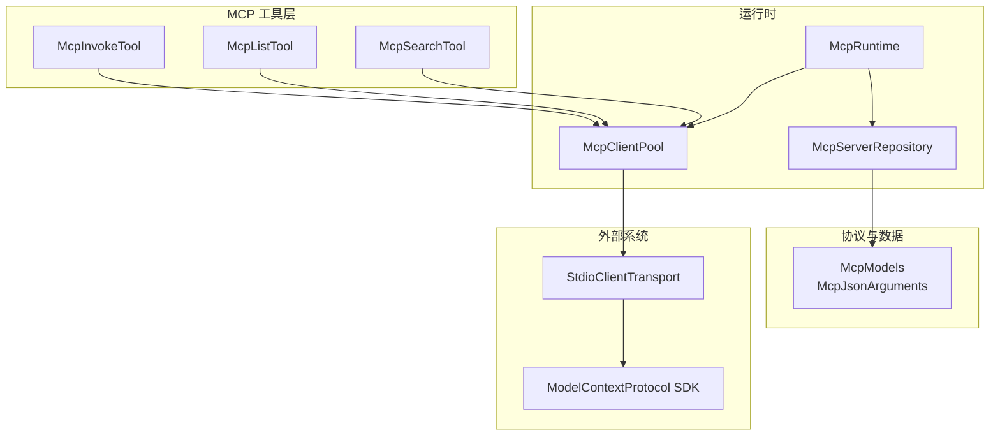
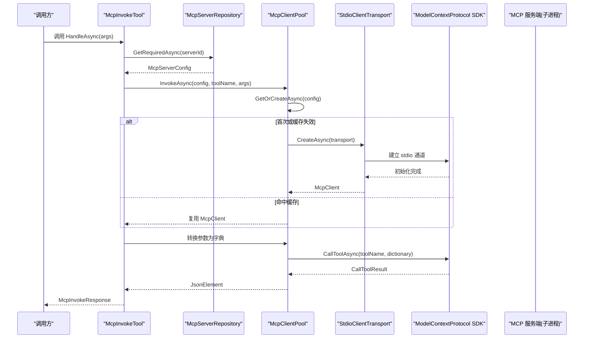
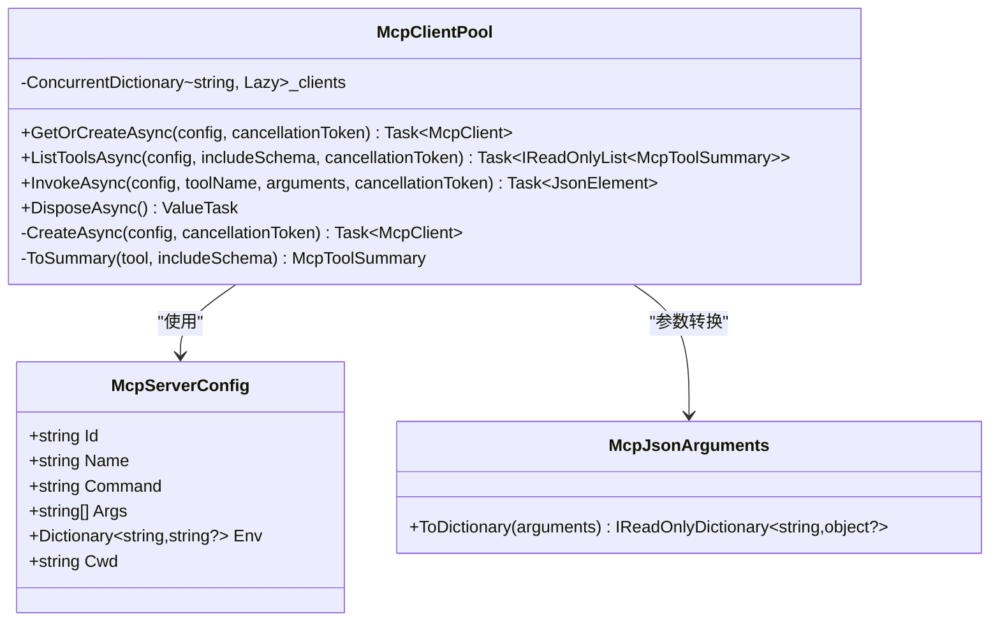
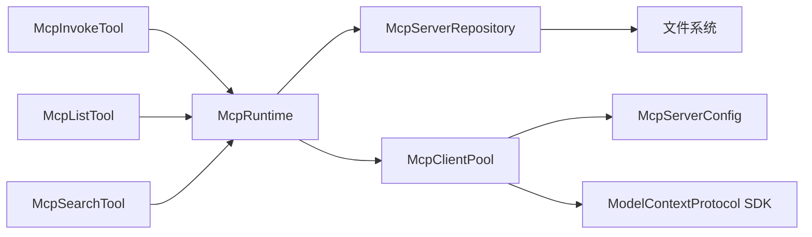

# MCP 客户端池

<cite>
**本文引用的文件**   
- [McpClientPool.cs](file://TinadecTools/Tools/Mcp/McpClientPool.cs)
- [McpRuntime.cs](file://TinadecTools/Tools/Mcp/McpRuntime.cs)
- [McpServerRepository.cs](file://TinadecTools/Tools/Mcp/McpServerRepository.cs)
- [McpModels.cs](file://TinadecTools/Tools/Mcp/McpModels.cs)
- [McpJsonArguments.cs](file://TinadecTools/Tools/Mcp/McpJsonArguments.cs)
- [McpInvokeTool.cs](file://TinadecTools/Tools/Mcp/McpInvokeTool.cs)
- [McpListTool.cs](file://TinadecTools/Tools/Mcp/McpListTool.cs)
- [McpSearchTool.cs](file://TinadecTools/Tools/Mcp/McpSearchTool.cs)
- [McpPassThroughTests.cs](file://tests/TinadecTools.Tests/McpPassThroughTests.cs)
</cite>

## 目录
1. [简介](#简介)
2. [项目结构](#项目结构)
3. [核心组件](#核心组件)
4. [架构总览](#架构总览)
5. [详细组件分析](#详细组件分析)
6. [依赖关系分析](#依赖关系分析)
7. [性能与资源管理](#性能与资源管理)
8. [故障排查指南](#故障排查指南)
9. [结论](#结论)
10. [附录](#附录)

## 简介
本文件围绕 MCP（Model Context Protocol）客户端池的实现，系统化说明连接创建、复用、销毁与负载均衡策略；记录超时、重试与错误恢复逻辑；解释连接状态监控、性能统计与资源限制配置；给出连接池配置参数、最大连接数设置与内存优化建议；并提供连接泄漏检测与调试方法。文档面向不同技术背景的读者，既提供高层概览，也包含代码级细节与可视化图示。

## 项目结构
MCP 客户端池位于 TinadecTools 的 Tools/Mcp 模块中，核心由以下文件组成：
- McpClientPool.cs：客户端连接池实现，负责按服务器配置懒加载并复用 McpClient 实例
- McpRuntime.cs：运行时入口，暴露 Repository 与 ClientPool 单例，便于测试替换
- McpServerRepository.cs：从配置文件读取服务器列表与必要信息
- McpModels.cs：JSON 模型与序列化上下文定义
- McpJsonArguments.cs：将 JsonElement 转换为字典以适配底层调用
- McpInvokeTool.cs / McpListTool.cs / McpSearchTool.cs：工具层封装，调用 ClientPool 完成具体操作
- McpPassThroughTests.cs：端到端测试，验证通过配置启动 mock 服务器并完成工具调用

图表来源
- [McpInvokeTool.cs:1-39](file://TinadecTools/Tools/Mcp/McpInvokeTool.cs#L1-L39)
- [McpListTool.cs:1-42](file://TinadecTools/Tools/Mcp/McpListTool.cs#L1-L42)
- [McpSearchTool.cs:1-87](file://TinadecTools/Tools/Mcp/McpSearchTool.cs#L1-L87)
- [McpRuntime.cs:1-19](file://TinadecTools/Tools/Mcp/McpRuntime.cs#L1-L19)
- [McpServerRepository.cs:1-53](file://TinadecTools/Tools/Mcp/McpServerRepository.cs#L1-L53)
- [McpClientPool.cs:1-89](file://TinadecTools/Tools/Mcp/McpClientPool.cs#L1-L89)
- [McpModels.cs:1-115](file://TinadecTools/Tools/Mcp/McpModels.cs#L1-L115)
- [McpJsonArguments.cs:1-37](file://TinadecTools/Tools/Mcp/McpJsonArguments.cs#L1-L37)

章节来源
- [McpClientPool.cs:1-89](file://TinadecTools/Tools/Mcp/McpClientPool.cs#L1-L89)
- [McpRuntime.cs:1-19](file://TinadecTools/Tools/Mcp/McpRuntime.cs#L1-L19)
- [McpServerRepository.cs:1-53](file://TinadecTools/Tools/Mcp/McpServerRepository.cs#L1-L53)
- [McpModels.cs:1-115](file://TinadecTools/Tools/Mcp/McpModels.cs#L1-L115)
- [McpJsonArguments.cs:1-37](file://TinadecTools/Tools/Mcp/McpJsonArguments.cs#L1-L37)
- [McpInvokeTool.cs:1-39](file://TinadecTools/Tools/Mcp/McpInvokeTool.cs#L1-L39)
- [McpListTool.cs:1-42](file://TinadecTools/Tools/Mcp/McpListTool.cs#L1-L42)
- [McpSearchTool.cs:1-87](file://TinadecTools/Tools/Mcp/McpSearchTool.cs#L1-L87)
- [McpPassThroughTests.cs:1-87](file://tests/TinadecTools.Tests/McpPassThroughTests.cs#L1-L87)

## 核心组件
- McpClientPool：基于 ConcurrentDictionary + Lazy<Task<McpClient>> 的线程安全懒加载连接池，按服务器 Id 缓存并复用连接；失败时自动移除无效条目；DisposeAsync 统一释放所有已创建的客户端。
- McpServerRepository：从文件或环境变量解析 mcp_servers.json，返回有效服务器配置集合，支持按 Id 获取必需配置。
- McpRuntime：对外暴露 Repository 与 ClientPool 静态访问点，并提供测试注入能力。
- 工具层（McpInvokeTool/McpListTool/McpSearchTool）：封装业务调用，使用 Repository 获取配置，通过 ClientPool 执行工具列举或调用。
- 数据模型与序列化：McpModels 定义 JSON 结构与 SourceGenerator 上下文；McpJsonArguments 将 JsonElement 转为字典供底层 SDK 使用。

章节来源
- [McpClientPool.cs:1-89](file://TinadecTools/Tools/Mcp/McpClientPool.cs#L1-L89)
- [McpServerRepository.cs:1-53](file://TinadecTools/Tools/Mcp/McpServerRepository.cs#L1-L53)
- [McpRuntime.cs:1-19](file://TinadecTools/Tools/Mcp/McpRuntime.cs#L1-L19)
- [McpModels.cs:1-115](file://TinadecTools/Tools/Mcp/McpModels.cs#L1-L115)
- [McpJsonArguments.cs:1-37](file://TinadecTools/Tools/Mcp/McpJsonArguments.cs#L1-L37)
- [McpInvokeTool.cs:1-39](file://TinadecTools/Tools/Mcp/McpInvokeTool.cs#L1-L39)
- [McpListTool.cs:1-42](file://TinadecTools/Tools/Mcp/McpListTool.cs#L1-L42)
- [McpSearchTool.cs:1-87](file://TinadecTools/Tools/Mcp/McpSearchTool.cs#L1-L87)

## 架构总览
下图展示从工具调用到 MCP 子进程通信的整体流程，包括连接池的懒加载与复用机制。

图表来源
- [McpInvokeTool.cs:1-39](file://TinadecTools/Tools/Mcp/McpInvokeTool.cs#L1-L39)
- [McpServerRepository.cs:1-53](file://TinadecTools/Tools/Mcp/McpServerRepository.cs#L1-L53)
- [McpClientPool.cs:1-89](file://TinadecTools/Tools/Mcp/McpClientPool.cs#L1-L89)

## 详细组件分析

### McpClientPool：连接池实现与生命周期
- 连接创建与复用
  - 使用 ConcurrentDictionary<string, Lazy<Task<McpClient>>> 按服务器 Id 缓存任务化客户端实例
  - GetOrCreateAsync 通过 Lazy<Task<T>> 保证并发安全且仅创建一次
  - 创建失败时 TryRemove 清理无效项，避免脏缓存
- 工具调用与列举
  - ListToolsAsync/InvokeAsync 均先获取或创建客户端，再委托 SDK 完成
  - 参数转换通过 McpJsonArguments.ToDictionary 处理复杂 JSON 结构
- 销毁与资源释放
  - DisposeAsync 遍历已创建的客户端，逐个异步释放，忽略异常以保证进程退出时的尽力而为
  - 最后清空字典，确保无残留引用
- 负载均衡
  - 当前实现按服务器 Id 一对一映射，未实现多实例或多路由策略
  - 如需扩展，可在配置中引入多个 transport 实例并按策略选择
- 超时与重试
  - 当前未内置超时与重试逻辑，依赖底层 SDK 与操作系统进程管理
  - 建议在调用链上层增加超时控制与重试策略（见“性能与资源管理”）
- 错误恢复
  - 创建失败即抛出异常，并在缓存中移除对应项，下次请求会重新尝试
  - 工具调用异常由上层工具捕获并包装为响应

图表来源
- [McpClientPool.cs:1-89](file://TinadecTools/Tools/Mcp/McpClientPool.cs#L1-L89)
- [McpModels.cs:12-20](file://TinadecTools/Tools/Mcp/McpModels.cs#L12-L20)
- [McpJsonArguments.cs:1-37](file://TinadecTools/Tools/Mcp/McpJsonArguments.cs#L1-L37)

章节来源
- [McpClientPool.cs:1-89](file://TinadecTools/Tools/Mcp/McpClientPool.cs#L1-L89)

### McpServerRepository：配置管理与解析
- 配置路径解析优先级：显式传入 > 环境变量 TINADEC_TOOLS_MCP_CONFIG > 默认 mcp_servers.json
- 读取与过滤：异步读取 JSON，过滤无效配置（必须包含 Id 与 Command）
- 查询接口：ListAsync 返回全部有效配置；GetRequiredAsync 按 Id 精确查找，缺失则抛异常

章节来源
- [McpServerRepository.cs:1-53](file://TinadecTools/Tools/Mcp/McpServerRepository.cs#L1-L53)

### 工具层：McpInvokeTool / McpListTool / McpSearchTool
- McpInvokeTool：根据 serverId 获取配置，调用 ClientPool.InvokeAsync，返回成功/失败响应
- McpListTool：枚举所有服务器，逐一调用 ClientPool.ListToolsAsync，汇总状态与工具列表
- McpSearchTool：对工具名与描述进行简单打分排序，支持 limit 限制与是否包含 schema

章节来源
- [McpInvokeTool.cs:1-39](file://TinadecTools/Tools/Mcp/McpInvokeTool.cs#L1-L39)
- [McpListTool.cs:1-42](file://TinadecTools/Tools/Mcp/McpListTool.cs#L1-L42)
- [McpSearchTool.cs:1-87](file://TinadecTools/Tools/Mcp/McpSearchTool.cs#L1-L87)

### 数据模型与序列化：McpModels / McpJsonArguments
- McpModels：定义服务器配置、工具摘要、搜索与调用请求/响应的 JSON 结构，并使用 SourceGenerator 提升性能
- McpJsonArguments：将 JsonElement 递归转换为字典，支持对象、数组、基本类型与 null

章节来源
- [McpModels.cs:1-115](file://TinadecTools/Tools/Mcp/McpModels.cs#L1-L115)
- [McpJsonArguments.cs:1-37](file://TinadecTools/Tools/Mcp/McpJsonArguments.cs#L1-L37)

## 依赖关系分析
- 组件耦合
  - 工具层依赖 McpRuntime 暴露的 Repository 与 ClientPool
  - ClientPool 依赖 McpServerConfig 与底层 SDK（通过 StdioClientTransport）
  - Repository 依赖文件系统与 JSON 序列化上下文
- 外部依赖
  - ModelContextProtocol SDK：提供 McpClient 与 CallToolAsync/ListToolsAsync
  - 操作系统进程管理：通过 stdio 启动并通信 MCP 服务端子进程

图表来源
- [McpInvokeTool.cs:1-39](file://TinadecTools/Tools/Mcp/McpInvokeTool.cs#L1-L39)
- [McpListTool.cs:1-42](file://TinadecTools/Tools/Mcp/McpListTool.cs#L1-L42)
- [McpSearchTool.cs:1-87](file://TinadecTools/Tools/Mcp/McpSearchTool.cs#L1-L87)
- [McpRuntime.cs:1-19](file://TinadecTools/Tools/Mcp/McpRuntime.cs#L1-L19)
- [McpServerRepository.cs:1-53](file://TinadecTools/Tools/Mcp/McpServerRepository.cs#L1-L53)
- [McpClientPool.cs:1-89](file://TinadecTools/Tools/Mcp/McpClientPool.cs#L1-L89)

章节来源
- [McpRuntime.cs:1-19](file://TinadecTools/Tools/Mcp/McpRuntime.cs#L1-L19)
- [McpServerRepository.cs:1-53](file://TinadecTools/Tools/Mcp/McpServerRepository.cs#L1-L53)
- [McpClientPool.cs:1-89](file://TinadecTools/Tools/Mcp/McpClientPool.cs#L1-L89)

## 性能与资源管理
- 连接创建与复用
  - 使用 Lazy<Task<T>> 避免重复创建，减少锁竞争与开销
  - 按服务器 Id 缓存，天然支持多服务器隔离
- 超时与重试（建议）
  - 在调用链上层为 GetOrCreateAsync/ListToolsAsync/InvokeAsync 添加 CancellationToken 与超时控制
  - 对网络/进程启动失败实施指数退避重试，区分可重试与不可重试错误
- 错误恢复
  - 创建失败立即清理缓存项，避免后续请求持续失败
  - 工具调用异常由上层捕获并包装为结构化响应，便于诊断
- 资源限制与最大连接数
  - 当前无显式上限，连接数等于有效服务器数量
  - 如需限制，可在配置中引入 maxConnections 并在池内实现 LRU/信号量限流
- 内存优化建议
  - 避免在工具调用中持有大对象引用，及时释放临时变量
  - 使用 Structured Logging 而非字符串拼接，降低 GC 压力
  - 合理设置 IncludeSchema，仅在需要时传输 schema 数据
- 性能统计（建议）
  - 在工具层与池层埋点，统计创建耗时、调用耗时、错误率与缓存命中率
  - 输出关键指标以便监控与告警

[本节为通用指导，不直接分析具体文件]

## 故障排查指南
- 常见问题定位
  - 配置缺失或无效：检查 mcp_servers.json 是否存在且包含 id/command；确认环境变量覆盖是否正确
  - 子进程启动失败：核对 command/args/cwd/env 是否正确；查看系统日志与进程状态
  - 工具调用失败：确认 toolName 存在且参数格式正确；查看上层工具的错误消息
- 调试方法
  - 启用结构化日志（NLog），关注警告与异常堆栈
  - 使用单元测试夹具（fixtures/mcp-mock-server.js）模拟服务端，快速复现问题
  - 通过 McpRuntime.ConfigureForTests 注入自定义 ClientPool 进行隔离测试
- 连接泄漏检测
  - 观察进程退出后是否仍有子进程存活
  - 在测试中验证 DisposeAsync 是否被调用，确保字典清空与客户端释放
  - 监控内存增长趋势，排查未释放的大对象或长生命周期引用

章节来源
- [McpPassThroughTests.cs:1-87](file://tests/TinadecTools.Tests/McpPassThroughTests.cs#L1-L87)
- [McpInvokeTool.cs:1-39](file://TinadecTools/Tools/Mcp/McpInvokeTool.cs#L1-L39)
- [McpListTool.cs:1-42](file://TinadecTools/Tools/Mcp/McpListTool.cs#L1-L42)
- [McpSearchTool.cs:1-87](file://TinadecTools/Tools/Mcp/McpSearchTool.cs#L1-L87)
- [McpServerRepository.cs:1-53](file://TinadecTools/Tools/Mcp/McpServerRepository.cs#L1-L53)
- [McpClientPool.cs:1-89](file://TinadecTools/Tools/Mcp/McpClientPool.cs#L1-L89)

## 结论
MCP 客户端池在当前实现中以简洁高效的方式完成了连接的懒加载、复用与释放，并通过工具层提供了统一的列举、搜索与调用能力。虽然尚未内置超时、重试与连接上限等高级特性，但现有架构为扩展预留了良好空间。建议在生产环境中补充超时与重试策略、连接上限与限流、以及完善的监控与诊断能力，以提升稳定性与可观测性。

[本节为总结性内容，不直接分析具体文件]

## 附录
- 配置示例与字段说明
  - servers[].id：服务器唯一标识
  - servers[].name：显示名称（可选）
  - servers[].command：启动命令
  - servers[].args：启动参数数组
  - servers[].env：环境变量键值对（可选）
  - servers[].cwd：工作目录（可选）
- 测试与运行
  - 使用 McpPassThroughTests 中的夹具快速搭建 mock 环境
  - 通过 McpRuntime.ConfigureForTests 指定配置文件路径与自定义池实例

章节来源
- [McpModels.cs:1-115](file://TinadecTools/Tools/Mcp/McpModels.cs#L1-L115)
- [McpPassThroughTests.cs:1-87](file://tests/TinadecTools.Tests/McpPassThroughTests.cs#L1-L87)