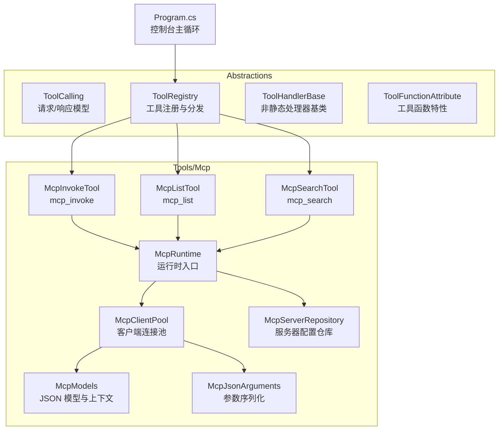
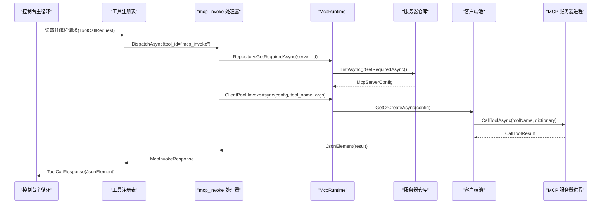
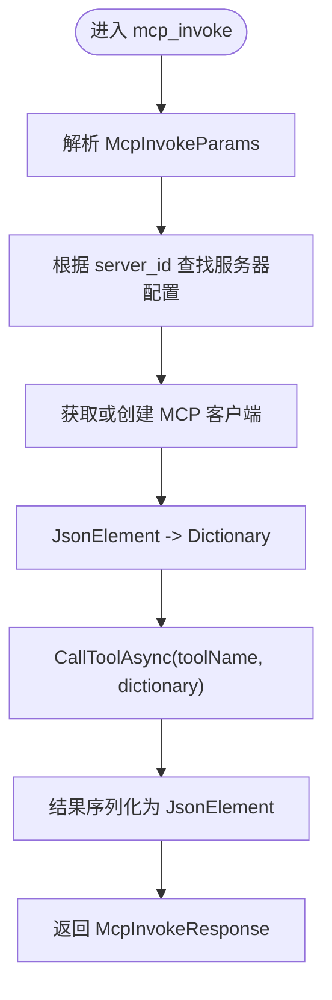
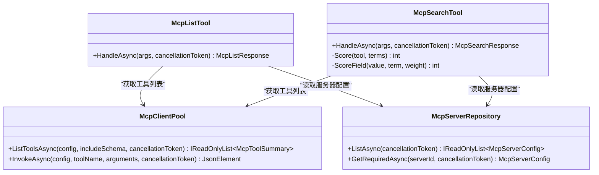
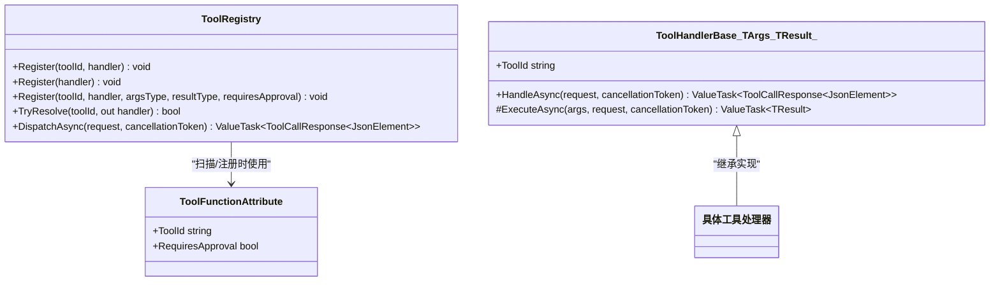
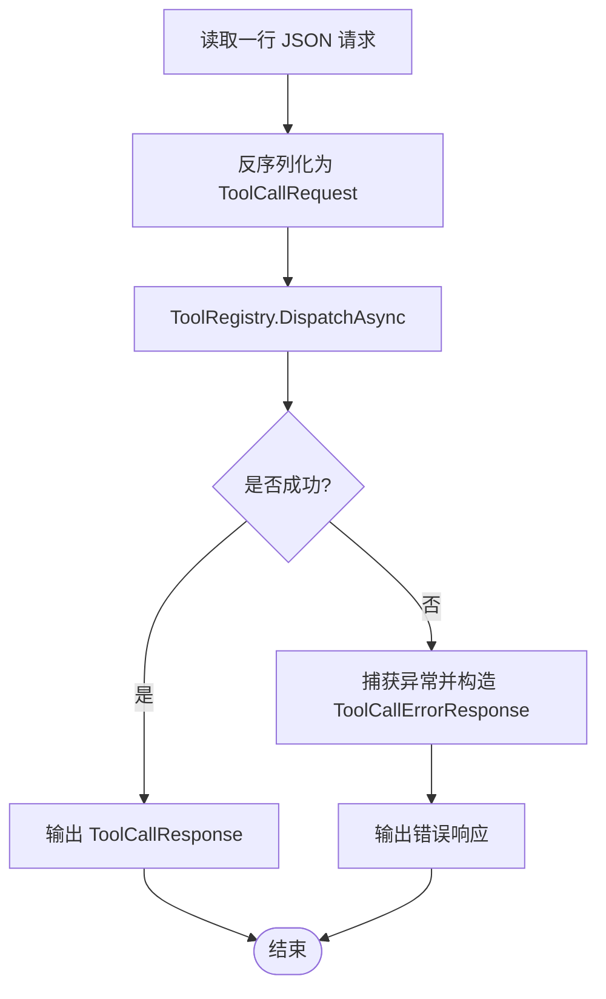
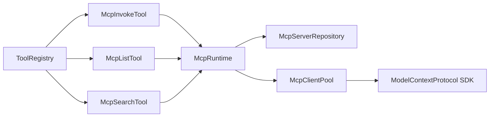

# MCP 工具调用器

<cite>
**本文引用的文件**   
- [McpInvokeTool.cs](file://TinadecTools/Tools/Mcp/McpInvokeTool.cs)
- [McpRuntime.cs](file://TinadecTools/Tools/Mcp/McpRuntime.cs)
- [McpClientPool.cs](file://TinadecTools/Tools/Mcp/McpClientPool.cs)
- [McpServerRepository.cs](file://TinadecTools/Tools/Mcp/McpServerRepository.cs)
- [McpModels.cs](file://TinadecTools/Tools/Mcp/McpModels.cs)
- [McpJsonArguments.cs](file://TinadecTools/Tools/Mcp/McpJsonArguments.cs)
- [McpListTool.cs](file://TinadecTools/Tools/Mcp/McpListTool.cs)
- [McpSearchTool.cs](file://TinadecTools/Tools/Mcp/McpSearchTool.cs)
- [ToolFunctionAttribute.cs](file://TinadecTools/Abstractions/ToolFunctionAttribute.cs)
- [ToolRegistry.cs](file://TinadecTools/Abstractions/ToolRegistry.cs)
- [ToolHandlerBase.cs](file://TinadecTools/Abstractions/ToolHandlerBase.cs)
- [ToolCalling.cs](file://TinadecTools/Abstractions/ToolCalling.cs)
- [Program.cs](file://TinadecTools/Program.cs)
</cite>

## 目录
1. [简介](#简介)
2. [项目结构](#项目结构)
3. [核心组件](#核心组件)
4. [架构总览](#架构总览)
5. [详细组件分析](#详细组件分析)
6. [依赖关系分析](#依赖关系分析)
7. [性能与超时控制](#性能与超时控制)
8. [故障排查指南](#故障排查指南)
9. [结论](#结论)
10. [附录：调用示例与调试技巧](#附录调用示例与调试技巧)

## 简介
本文件面向 MCP（Model Context Protocol）工具调用器的实现，系统性说明以下方面：
- 工具调用的封装逻辑：参数序列化、协议转换、结果反序列化
- 异步调用处理、超时控制与异常捕获机制
- 工具发现、元数据获取与动态绑定
- 调用链追踪、性能监控与错误诊断
- 工具调用示例与调试技巧

该实现以 C# 为主，通过标准输入/输出通道与外部 MCP 服务器进程通信，提供统一的工具注册、分发与执行框架。

## 项目结构
MCP 工具调用相关代码集中在 TinadecTools 工程内，关键目录与职责如下：
- Abstractions：工具抽象层，定义请求/响应模型、工具注册表与基础处理器
- Tools/Mcp：MCP 工具的具体实现，包括调用、列表、搜索以及运行时与客户端池管理
- Program.cs：控制台主循环，负责读取工具调用请求、分发执行并输出响应

图表来源 
- [Program.cs:1-68](file://TinadecTools/Program.cs#L1-L68)
- [ToolRegistry.cs:1-86](file://TinadecTools/Abstractions/ToolRegistry.cs#L1-L86)
- [McpInvokeTool.cs:1-39](file://TinadecTools/Tools/Mcp/McpInvokeTool.cs#L1-L39)
- [McpListTool.cs:1-42](file://TinadecTools/Tools/Mcp/McpListTool.cs#L1-L42)
- [McpSearchTool.cs:1-87](file://TinadecTools/Tools/Mcp/McpSearchTool.cs#L1-L87)
- [McpRuntime.cs:1-19](file://TinadecTools/Tools/Mcp/McpRuntime.cs#L1-L19)
- [McpClientPool.cs:1-89](file://TinadecTools/Tools/Mcp/McpClientPool.cs#L1-L89)
- [McpServerRepository.cs:1-53](file://TinadecTools/Tools/Mcp/McpServerRepository.cs#L1-L53)
- [McpModels.cs:1-115](file://TinadecTools/Tools/Mcp/McpModels.cs#L1-L115)
- [McpJsonArguments.cs:1-37](file://TinadecTools/Tools/Mcp/McpJsonArguments.cs#L1-L37)

章节来源
- [Program.cs:1-68](file://TinadecTools/Program.cs#L1-L68)
- [ToolRegistry.cs:1-86](file://TinadecTools/Abstractions/ToolRegistry.cs#L1-L86)
- [McpInvokeTool.cs:1-39](file://TinadecTools/Tools/Mcp/McpInvokeTool.cs#L1-L39)
- [McpListTool.cs:1-42](file://TinadecTools/Tools/Mcp/McpListTool.cs#L1-L42)
- [McpSearchTool.cs:1-87](file://TinadecTools/Tools/Mcp/McpSearchTool.cs#L1-L87)
- [McpRuntime.cs:1-19](file://TinadecTools/Tools/Mcp/McpRuntime.cs#L1-L19)
- [McpClientPool.cs:1-89](file://TinadecTools/Tools/Mcp/McpClientPool.cs#L1-L89)
- [McpServerRepository.cs:1-53](file://TinadecTools/Tools/Mcp/McpServerRepository.cs#L1-L53)
- [McpModels.cs:1-115](file://TinadecTools/Tools/Mcp/McpModels.cs#L1-L115)
- [McpJsonArguments.cs:1-37](file://TinadecTools/Tools/Mcp/McpJsonArguments.cs#L1-L37)

## 核心组件
- 工具抽象层
  - ToolCalling：定义工具调用请求与响应的 JSON 结构，包含 call_id、success、result/error 等字段，并提供 JsonSerializerContext 用于高性能序列化
  - ToolRegistry：维护工具 ID 到处理委托的映射，支持泛型注册、审批校验、参数解析与结果序列化
  - ToolHandlerBase：为“非静态”工具提供统一的处理模板，自动完成参数反序列化与结果序列化
  - ToolFunctionAttribute：标记工具方法，声明 toolId 与是否需要审批
- MCP 工具实现
  - McpInvokeTool：暴露 mcp_invoke 工具，根据 server_id 查找服务器配置并通过客户端池调用目标工具
  - McpListTool：暴露 mcp_list 工具，列出所有已配置的 MCP 服务器及其可用工具（可选 schema）
  - McpSearchTool：暴露 mcp_search 工具，按关键词对工具名与描述进行评分排序，返回匹配结果
  - McpRuntime：集中持有服务器仓库与客户端池实例，提供测试注入与资源释放
  - McpClientPool：管理 Stdio 传输的 MCP 客户端生命周期，提供 ListToolsAsync 与 InvokeAsync
  - McpServerRepository：从配置文件加载服务器列表，支持环境变量覆盖路径
  - McpModels：定义所有 JSON 模型与 SourceGenerator 上下文
  - McpJsonArguments：将 JsonElement 转换为字典，供底层 SDK 使用
- 控制台主循环
  - Program.cs：从标准输入逐行读取工具调用请求，调用 ToolRegistry.DispatchAsync 分发执行，输出响应或错误

章节来源
- [ToolCalling.cs:1-83](file://TinadecTools/Abstractions/ToolCalling.cs#L1-L83)
- [ToolRegistry.cs:1-86](file://TinadecTools/Abstractions/ToolRegistry.cs#L1-L86)
- [ToolHandlerBase.cs:1-43](file://TinadecTools/Abstractions/ToolHandlerBase.cs#L1-L43)
- [ToolFunctionAttribute.cs:1-15](file://TinadecTools/Abstractions/ToolFunctionAttribute.cs#L1-L15)
- [McpInvokeTool.cs:1-39](file://TinadecTools/Tools/Mcp/McpInvokeTool.cs#L1-L39)
- [McpListTool.cs:1-42](file://TinadecTools/Tools/Mcp/McpListTool.cs#L1-L42)
- [McpSearchTool.cs:1-87](file://TinadecTools/Tools/Mcp/McpSearchTool.cs#L1-L87)
- [McpRuntime.cs:1-19](file://TinadecTools/Tools/Mcp/McpRuntime.cs#L1-L19)
- [McpClientPool.cs:1-89](file://TinadecTools/Tools/Mcp/McpClientPool.cs#L1-L89)
- [McpServerRepository.cs:1-53](file://TinadecTools/Tools/Mcp/McpServerRepository.cs#L1-L53)
- [McpModels.cs:1-115](file://TinadecTools/Tools/Mcp/McpModels.cs#L1-L115)
- [McpJsonArguments.cs:1-37](file://TinadecTools/Tools/Mcp/McpJsonArguments.cs#L1-L37)
- [Program.cs:1-68](file://TinadecTools/Program.cs#L1-L68)

## 架构总览
下图展示了从控制台主循环到 MCP 工具执行的完整链路，包括参数序列化、协议转换与结果反序列化的关键环节。

图表来源 
- [Program.cs:1-68](file://TinadecTools/Program.cs#L1-L68)
- [ToolRegistry.cs:1-86](file://TinadecTools/Abstractions/ToolRegistry.cs#L1-L86)
- [McpInvokeTool.cs:1-39](file://TinadecTools/Tools/Mcp/McpInvokeTool.cs#L1-L39)
- [McpRuntime.cs:1-19](file://TinadecTools/Tools/Mcp/McpRuntime.cs#L1-L19)
- [McpServerRepository.cs:1-53](file://TinadecTools/Tools/Mcp/McpServerRepository.cs#L1-L53)
- [McpClientPool.cs:1-89](file://TinadecTools/Tools/Mcp/McpClientPool.cs#L1-L89)

## 详细组件分析

### 工具调用封装与协议转换
- 参数序列化
  - McpJsonArguments.ToDictionary：将 JsonElement 转为字典，递归处理对象、数组、基本类型，确保键序与值类型正确
  - ToolRegistry.Register<TArgs,TResult>：在注册时指定参数与结果的 JsonTypeInfo，统一进行反序列化与序列化
- 协议转换
  - McpClientPool.InvokeAsync：将字典参数传递给底层 SDK 的 CallToolAsync，并将结果序列化为 JsonElement
  - McpInvokeTool.HandleAsync：组装 McpInvokeParams，调用 McpRuntime.ClientPool.InvokeAsync，返回 McpInvokeResponse
- 结果反序列化
  - ToolRegistry 与 ToolHandlerBase 均使用 JsonSerializer.SerializeToElement 将结果写入响应体

图表来源 
- [McpInvokeTool.cs:1-39](file://TinadecTools/Tools/Mcp/McpInvokeTool.cs#L1-L39)
- [McpClientPool.cs:1-89](file://TinadecTools/Tools/Mcp/McpClientPool.cs#L1-L89)
- [McpJsonArguments.cs:1-37](file://TinadecTools/Tools/Mcp/McpJsonArguments.cs#L1-L37)
- [ToolRegistry.cs:1-86](file://TinadecTools/Abstractions/ToolRegistry.cs#L1-L86)

章节来源
- [McpInvokeTool.cs:1-39](file://TinadecTools/Tools/Mcp/McpInvokeTool.cs#L1-L39)
- [McpClientPool.cs:1-89](file://TinadecTools/Tools/Mcp/McpClientPool.cs#L1-L89)
- [McpJsonArguments.cs:1-37](file://TinadecTools/Tools/Mcp/McpJsonArguments.cs#L1-L37)
- [ToolRegistry.cs:1-86](file://TinadecTools/Abstractions/ToolRegistry.cs#L1-L86)

### 工具发现与元数据获取
- McpListTool：遍历所有服务器配置，逐个调用 ListToolsAsync 获取工具摘要（名称、描述、可选 schema），汇总为 McpListResponse
- McpSearchTool：对每个服务器的工具列表进行评分排序，支持 limit 限制与 include_schema 选项

图表来源 
- [McpListTool.cs:1-42](file://TinadecTools/Tools/Mcp/McpListTool.cs#L1-L42)
- [McpSearchTool.cs:1-87](file://TinadecTools/Tools/Mcp/McpSearchTool.cs#L1-L87)
- [McpClientPool.cs:1-89](file://TinadecTools/Tools/Mcp/McpClientPool.cs#L1-L89)
- [McpServerRepository.cs:1-53](file://TinadecTools/Tools/Mcp/McpServerRepository.cs#L1-L53)

章节来源
- [McpListTool.cs:1-42](file://TinadecTools/Tools/Mcp/McpListTool.cs#L1-L42)
- [McpSearchTool.cs:1-87](file://TinadecTools/Tools/Mcp/McpSearchTool.cs#L1-L87)
- [McpClientPool.cs:1-89](file://TinadecTools/Tools/Mcp/McpClientPool.cs#L1-L89)
- [McpServerRepository.cs:1-53](file://TinadecTools/Tools/Mcp/McpServerRepository.cs#L1-L53)

### 动态绑定与工具注册
- ToolFunctionAttribute：标注工具方法，声明 toolId 与 RequiresApproval
- ToolRegistry：维护工具 ID 到处理委托的映射，支持泛型注册与审批校验；DispatchAsync 根据 tool_id 分发给对应处理器
- ToolHandlerBase：为需要复杂处理的工具提供基类，统一参数反序列化与结果序列化流程

图表来源 
- [ToolFunctionAttribute.cs:1-15](file://TinadecTools/Abstractions/ToolFunctionAttribute.cs#L1-L15)
- [ToolRegistry.cs:1-86](file://TinadecTools/Abstractions/ToolRegistry.cs#L1-L86)
- [ToolHandlerBase.cs:1-43](file://TinadecTools/Abstractions/ToolHandlerBase.cs#L1-L43)

章节来源
- [ToolFunctionAttribute.cs:1-15](file://TinadecTools/Abstractions/ToolFunctionAttribute.cs#L1-L15)
- [ToolRegistry.cs:1-86](file://TinadecTools/Abstractions/ToolRegistry.cs#L1-L86)
- [ToolHandlerBase.cs:1-43](file://TinadecTools/Abstractions/ToolHandlerBase.cs#L1-L43)

### 控制台主循环与错误处理
- Program.cs：从标准输入逐行读取 JSON 请求，反序列化为 ToolCallRequest<JsonElement>，调用 ToolRegistry.DispatchAsync 分发执行，输出 ToolCallResponse 或 ToolCallErrorResponse
- 异常捕获：外层 try/catch 捕获所有异常，构造错误响应并记录日志

图表来源 
- [Program.cs:1-68](file://TinadecTools/Program.cs#L1-L68)
- [ToolCalling.cs:1-83](file://TinadecTools/Abstractions/ToolCalling.cs#L1-L83)

章节来源
- [Program.cs:1-68](file://TinadecTools/Program.cs#L1-L68)
- [ToolCalling.cs:1-83](file://TinadecTools/Abstractions/ToolCalling.cs#L1-L83)

## 依赖关系分析
- 低耦合高内聚
  - ToolRegistry 仅依赖抽象接口与 JSON 上下文，不感知具体工具实现
  - McpRuntime 聚合 McpServerRepository 与 McpClientPool，屏蔽底层细节
  - McpClientPool 独立管理 Stdio 传输与客户端生命周期
- 外部依赖
  - ModelContextProtocol SDK：用于 MCP 协议通信（CreateAsync、ListToolsAsync、CallToolAsync）
  - System.Text.Json：高性能 JSON 序列化/反序列化
- 潜在循环依赖
  - 当前实现无循环引用；McpRuntime 作为静态入口被工具处理器使用，避免反向依赖

图表来源 
- [ToolRegistry.cs:1-86](file://TinadecTools/Abstractions/ToolRegistry.cs#L1-L86)
- [McpInvokeTool.cs:1-39](file://TinadecTools/Tools/Mcp/McpInvokeTool.cs#L1-L39)
- [McpListTool.cs:1-42](file://TinadecTools/Tools/Mcp/McpListTool.cs#L1-L42)
- [McpSearchTool.cs:1-87](file://TinadecTools/Tools/Mcp/McpSearchTool.cs#L1-L87)
- [McpRuntime.cs:1-19](file://TinadecTools/Tools/Mcp/McpRuntime.cs#L1-L19)
- [McpServerRepository.cs:1-53](file://TinadecTools/Tools/Mcp/McpServerRepository.cs#L1-L53)
- [McpClientPool.cs:1-89](file://TinadecTools/Tools/Mcp/McpClientPool.cs#L1-L89)

章节来源
- [ToolRegistry.cs:1-86](file://TinadecTools/Abstractions/ToolRegistry.cs#L1-L86)
- [McpInvokeTool.cs:1-39](file://TinadecTools/Tools/Mcp/McpInvokeTool.cs#L1-L39)
- [McpListTool.cs:1-42](file://TinadecTools/Tools/Mcp/McpListTool.cs#L1-L42)
- [McpSearchTool.cs:1-87](file://TinadecTools/Tools/Mcp/McpSearchTool.cs#L1-L87)
- [McpRuntime.cs:1-19](file://TinadecTools/Tools/Mcp/McpRuntime.cs#L1-L19)
- [McpServerRepository.cs:1-53](file://TinadecTools/Tools/Mcp/McpServerRepository.cs#L1-L53)
- [McpClientPool.cs:1-89](file://TinadecTools/Tools/Mcp/McpClientPool.cs#L1-L89)

## 性能与超时控制
- 性能优化
  - System.Text.Json SourceGenerator：通过 McpJsonContext、ToolCallJsonContext 等减少反射开销
  - 客户端池：McpClientPool 使用 ConcurrentDictionary + Lazy<Task<McpClient>> 实现懒加载与复用，降低连接建立成本
  - 参数转换：McpJsonArguments.ToDictionary 采用一次性枚举与类型判断，避免多次装箱/拆箱
- 超时控制
  - 当前实现未在 McpClientPool.InvokeAsync 中显式设置超时；如需控制，可在调用处引入 CancellationToken 并结合 Task.WhenAny 或 HttpClient 风格的超时策略
  - 建议在 McpClientPool.InvokeAsync 增加 timeout 参数，并在底层 SDK 调用前启动取消令牌
- 异步处理
  - 全链路使用 async/await，避免阻塞线程；DisposeAsync 确保资源释放
- 监控与追踪
  - 建议在各关键节点添加耗时统计（如进入/退出 HandleAsync、ListToolsAsync、InvokeAsync），并输出结构化日志（包含 tool_id、server_id、call_id、duration_ms）

[本节为通用指导，不直接分析具体文件]

## 故障排查指南
- 常见错误
  - 参数解析失败：检查 ToolCallRequest.params 是否为空或类型不匹配；确认 ToolRegistry.Register 指定的 JsonTypeInfo 与实际参数一致
  - 未找到服务器配置：确认 mcp_servers.json 存在且包含有效 Id 与 Command；可通过环境变量 TINADEC_TOOLS_MCP_CONFIG 覆盖路径
  - MCP 服务器不可用：检查命令与参数是否正确，工作目录与环境变量是否设置；查看 McpListTool 返回的 status 与 error 字段
  - 工具调用失败：查看 McpInvokeTool 返回的 success 与 error 字段；必要时启用 NLog 日志定位
- 调试技巧
  - 使用 mcp_list 验证服务器连通性与工具列表
  - 使用 mcp_search 快速定位目标工具
  - 在 Program.cs 中开启 Debug 级别日志，观察请求与响应
  - 对于 Go 侧工具的错误（如 INVALID_PARAMETER），核对参数结构与类型（例如数组 vs 字符串）

章节来源
- [McpListTool.cs:1-42](file://TinadecTools/Tools/Mcp/McpListTool.cs#L1-L42)
- [McpSearchTool.cs:1-87](file://TinadecTools/Tools/Mcp/McpSearchTool.cs#L1-L87)
- [McpInvokeTool.cs:1-39](file://TinadecTools/Tools/Mcp/McpInvokeTool.cs#L1-L39)
- [McpServerRepository.cs:1-53](file://TinadecTools/Tools/Mcp/McpServerRepository.cs#L1-L53)
- [Program.cs:1-68](file://TinadecTools/Program.cs#L1-L68)

## 结论
MCP 工具调用器通过清晰的抽象层与模块化设计，实现了统一的工具注册、分发与执行框架。借助 System.Text.Json SourceGenerator 与客户端池，系统在性能与资源管理方面具备良好表现。未来可进一步增强超时控制、分布式追踪与更丰富的监控指标，以提升可观测性与稳定性。

[本节为总结性内容，不直接分析具体文件]

## 附录：调用示例与调试技巧
- 工具调用示例
  - mcp_list：传入 include_schema=true/false，获取服务器与工具列表
  - mcp_search：传入 query、limit、include_schema，按关键词检索工具
  - mcp_invoke：传入 server_id、tool_name、arguments（JSON 对象），执行目标工具
- 调试技巧
  - 在本地运行程序后，向标准输入逐行发送 JSON 请求，观察控制台输出的响应
  - 使用 mcp_list 与 mcp_search 辅助定位问题
  - 检查 mcp_servers.json 的配置与权限，确保命令可执行
  - 针对 Go 侧工具的参数错误，严格对照其数据结构定义（如数组字段必须传数组）

[本节为概念性指导，不直接分析具体文件]