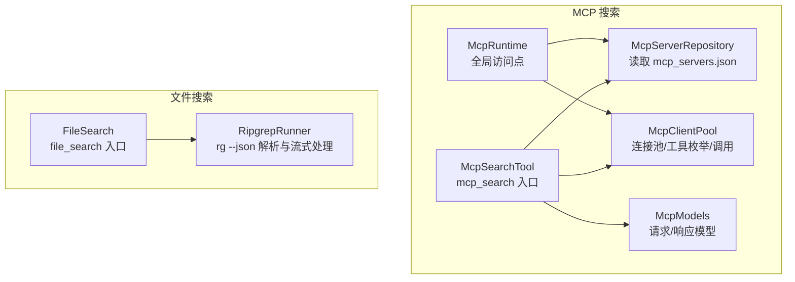
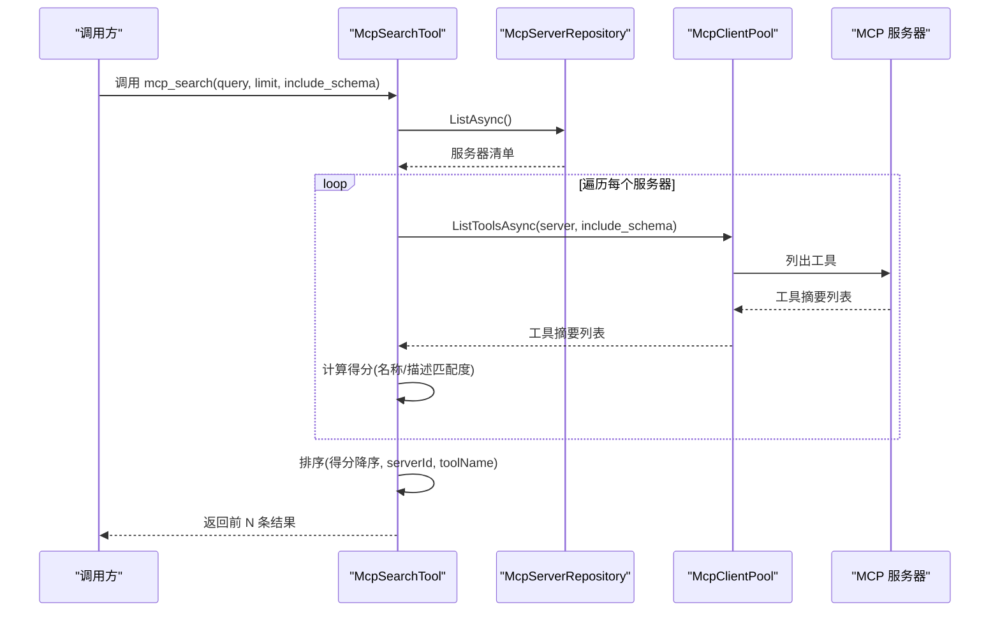
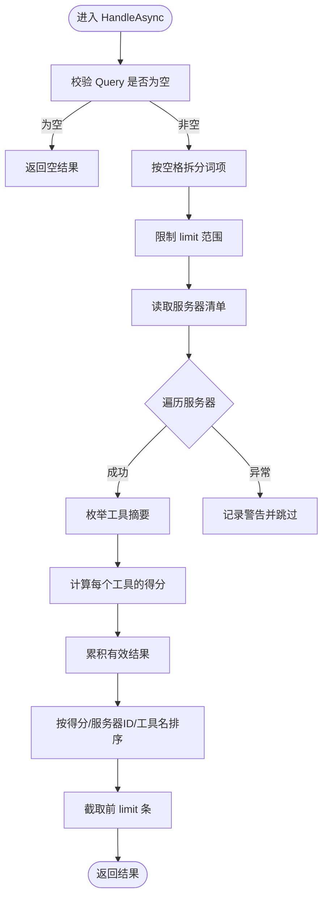
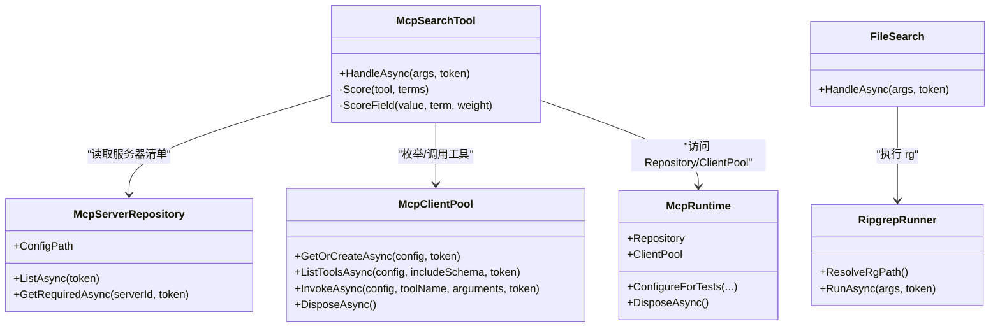

# MCP 搜索工具

<cite>
**本文引用的文件**
- [McpSearchTool.cs](file://TinadecTools/Tools/Mcp/McpSearchTool.cs)
- [McpModels.cs](file://TinadecTools/Tools/Mcp/McpModels.cs)
- [McpClientPool.cs](file://TinadecTools/Tools/Mcp/McpClientPool.cs)
- [McpServerRepository.cs](file://TinadecTools/Tools/Mcp/McpServerRepository.cs)
- [McpRuntime.cs](file://TinadecTools/Tools/Mcp/McpRuntime.cs)
- [McpListTool.cs](file://TinadecTools/Tools/Mcp/McpListTool.cs)
- [McpInvokeTool.cs](file://TinadecTools/Tools/Mcp/McpInvokeTool.cs)
- [FileSearch.cs](file://TinadecTools/Tools/Search/FileSearch.cs)
- [RipgrepRunner.cs](file://TinadecTools/Tools/Search/RipgrepRunner.cs)
- [ToolFunctionAttribute.cs](file://TinadecTools/Abstractions/ToolFunctionAttribute.cs)
</cite>

## 目录
1. [简介](#简介)
2. [项目结构](#项目结构)
3. [核心组件](#核心组件)
4. [架构总览](#架构总览)
5. [详细组件分析](#详细组件分析)
6. [依赖关系分析](#依赖关系分析)
7. [性能考量](#性能考量)
8. [故障排查指南](#故障排查指南)
9. [结论](#结论)
10. [附录：查询语法与使用示例](#附录查询语法与使用示例)

## 简介
本文件面向 MCP（Model Context Protocol）搜索工具的完整文档，聚焦以下目标：
- 解释搜索功能的实现原理：查询构建、索引管理与结果排序
- 记录全文搜索、模糊匹配与过滤条件支持
- 说明搜索结果缓存、分页处理与增量更新机制
- 提供搜索性能优化、索引重建与故障恢复策略
- 给出搜索查询语法与使用示例

本项目中的“MCP 搜索”主要指对已注册的 MCP 服务器及其暴露的工具进行检索与排序；同时配套的文件内容搜索能力通过 ripgrep 实现，用于在代码仓库中进行全文检索。

## 项目结构
与 MCP 搜索相关的代码位于 TinadecTools 模块下，按功能划分为：
- Mcp 子模块：负责 MCP 服务器配置管理、客户端连接池、工具列表与调用封装，以及 mcp_search 工具的实现
- Search 子模块：基于 ripgrep 的全文搜索实现，提供 file_search 工具
- Abstractions：工具函数注册元数据（ToolFunctionAttribute）



图表来源
- [McpSearchTool.cs:1-87](file://TinadecTools/Tools/Mcp/McpSearchTool.cs#L1-L87)
- [McpServerRepository.cs:1-53](file://TinadecTools/Tools/Mcp/McpServerRepository.cs#L1-L53)
- [McpClientPool.cs:1-89](file://TinadecTools/Tools/Mcp/McpClientPool.cs#L1-L89)
- [McpRuntime.cs:1-19](file://TinadecTools/Tools/Mcp/McpRuntime.cs#L1-L19)
- [McpModels.cs:1-115](file://TinadecTools/Tools/Mcp/McpModels.cs#L1-L115)
- [FileSearch.cs:1-140](file://TinadecTools/Tools/Search/FileSearch.cs#L1-L140)
- [RipgrepRunner.cs:1-275](file://TinadecTools/Tools/Search/RipgrepRunner.cs#L1-L275)

章节来源
- [McpSearchTool.cs:1-87](file://TinadecTools/Tools/Mcp/McpSearchTool.cs#L1-L87)
- [FileSearch.cs:1-140](file://TinadecTools/Tools/Search/FileSearch.cs#L1-L140)

## 核心组件
- McpSearchTool：实现 mcp_search 工具，负责将用户查询拆分为词项，遍历所有 MCP 服务器并获取其工具列表，计算相关性得分并返回排序后的结果
- McpServerRepository：从配置文件（默认 mcp_servers.json，可通过环境变量覆盖）加载 MCP 服务器清单
- McpClientPool：维护到各 MCP 服务器的连接池，提供 ListToolsAsync 与 InvokeAsync 等能力
- McpRuntime：对外暴露 Repository 与 ClientPool 的全局访问点，便于工具统一使用
- FileSearch / RipgrepRunner：实现 file_search 工具，调用 ripgrep 的 JSON 输出模式进行流式解析，支持大小写敏感、固定字符串、类型过滤、glob 过滤、上下文行、命中上限等参数

章节来源
- [McpSearchTool.cs:1-87](file://TinadecTools/Tools/Mcp/McpSearchTool.cs#L1-L87)
- [McpServerRepository.cs:1-53](file://TinadecTools/Tools/Mcp/McpServerRepository.cs#L1-L53)
- [McpClientPool.cs:1-89](file://TinadecTools/Tools/Mcp/McpClientPool.cs#L1-L89)
- [McpRuntime.cs:1-19](file://TinadecTools/Tools/Mcp/McpRuntime.cs#L1-L19)
- [FileSearch.cs:1-140](file://TinadecTools/Tools/Search/FileSearch.cs#L1-L140)
- [RipgrepRunner.cs:1-275](file://TinadecTools/Tools/Search/RipgrepRunner.cs#L1-L275)

## 架构总览
下图展示了 mcp_search 的端到端流程：从工具入口到服务器配置读取、客户端连接、工具枚举、评分与排序，再到最终响应返回。



图表来源
- [McpSearchTool.cs:1-87](file://TinadecTools/Tools/Mcp/McpSearchTool.cs#L1-L87)
- [McpServerRepository.cs:1-53](file://TinadecTools/Tools/Mcp/McpServerRepository.cs#L1-L53)
- [McpClientPool.cs:1-89](file://TinadecTools/Tools/Mcp/McpClientPool.cs#L1-L89)

章节来源
- [McpSearchTool.cs:1-87](file://TinadecTools/Tools/Mcp/McpSearchTool.cs#L1-L87)

## 详细组件分析

### McpSearchTool：MCP 工具搜索
- 查询构建
  - 将输入 query 按空格拆分得到词项数组，去除空项与首尾空白
  - 限制 limit 范围在 1~100
- 索引管理
  - 无本地索引；每次查询时动态拉取所有 MCP 服务器的工具摘要
- 结果排序
  - 对每个工具按名称与描述分别计算匹配得分（精确匹配权重最高，前缀匹配次之，包含匹配再次之），累加各词项得分
  - 最终按得分降序、serverId 升序、toolName 升序排序，并截取前 limit 条
- 错误处理
  - 单个服务器枚举失败会记录警告日志并跳过该服务器，不影响其他服务器结果



图表来源
- [McpSearchTool.cs:1-87](file://TinadecTools/Tools/Mcp/McpSearchTool.cs#L1-L87)

章节来源
- [McpSearchTool.cs:1-87](file://TinadecTools/Tools/Mcp/McpSearchTool.cs#L1-L87)

### McpServerRepository：服务器配置管理
- 配置文件路径解析优先级：构造参数 > 环境变量 > 默认 mcp_servers.json
- 读取配置时采用共享读权限，允许并发读取与删除场景
- 仅保留具备 id 与 command 的合法服务器条目

章节来源
- [McpServerRepository.cs:1-53](file://TinadecTools/Tools/Mcp/McpServerRepository.cs#L1-L53)

### McpClientPool：客户端连接池与工具枚举
- 懒加载与缓存：同一 serverId 的连接被 Lazy<Task<McpClient>> 缓存，避免重复创建
- 工具枚举：通过 MCP 协议列出工具，可选择是否包含 input_schema
- 工具调用：将 JsonElement 参数转换为字典后调用 CallToolAsync，并将结果序列化为 JsonElement
- 资源释放：DisposeAsync 逐个释放已创建的客户端

章节来源
- [McpClientPool.cs:1-89](file://TinadecTools/Tools/Mcp/McpClientPool.cs#L1-L89)

### McpRuntime：运行时访问点
- 暴露 Repository 与 ClientPool 供工具统一访问
- 提供测试注入方法与异步释放接口

章节来源
- [McpRuntime.cs:1-19](file://TinadecTools/Tools/Mcp/McpRuntime.cs#L1-L19)

### FileSearch / RipgrepRunner：文件全文搜索
- 查询参数
  - pattern：必填，正则或字面量模式
  - path：搜索根路径，经工作区解析
  - glob：文件名过滤（如 *.cs、*.{ts,tsx}）
  - type：rg --type 过滤（如 cs、ts、rust）
  - case_sensitive：大小写敏感
  - fixed_strings：字面量模式（-F）
  - context_lines：上下文行数（-C N）
  - max_results：命中行数上限，达到后截断
- 执行流程
  - 启动 rg 进程，以 --json 模式输出
  - 流式解析 stdout 的 match/context/summary 消息
  - 统计命中文件集合，计算 file_hash（与 FileRW 一致）
  - 根据 exit code 与 stderr 判断错误
- 错误处理
  - OperationCanceledException 透传
  - 其他异常包装为 Success=false 的响应
  - 进程安全终止（包括子进程树）

```mermaid
sequenceDiagram
participant Caller as "调用方"
participant FS as "FileSearch"
participant RG as "RipgrepRunner"
participant Proc as "ripgrep 进程"
Caller->>FS : file_search(params)
FS->>RG : RunAsync(params)
RG->>Proc : 启动 rg --json ...
loop 读取 stdout
Proc-->>RG : match/context/summary
RG->>RG : 解析并追加行/统计总数
alt 达到 MaxResults
RG->>Proc : 终止进程
break
end
end
RG-->>FS : FileSearchResponse
FS-->>Caller : 返回结果
```

图表来源
- [FileSearch.cs:1-140](file://TinadecTools/Tools/Search/FileSearch.cs#L1-L140)
- [RipgrepRunner.cs:1-275](file://TinadecTools/Tools/Search/RipgrepRunner.cs#L1-L275)

章节来源
- [FileSearch.cs:1-140](file://TinadecTools/Tools/Search/FileSearch.cs#L1-L140)
- [RipgrepRunner.cs:1-275](file://TinadecTools/Tools/Search/RipgrepRunner.cs#L1-L275)

### 工具注册与元数据
- 工具函数通过 ToolFunctionAttribute 标注，声明工具 ID 与是否需要审批
- mcp_list、mcp_invoke、mcp_search、file_search 均以此方式注册

章节来源
- [ToolFunctionAttribute.cs:1-15](file://TinadecTools/Abstractions/ToolFunctionAttribute.cs#L1-L15)
- [McpListTool.cs:1-42](file://TinadecTools/Tools/Mcp/McpListTool.cs#L1-L42)
- [McpInvokeTool.cs:1-39](file://TinadecTools/Tools/Mcp/McpInvokeTool.cs#L1-L39)
- [McpSearchTool.cs:1-87](file://TinadecTools/Tools/Mcp/McpSearchTool.cs#L1-L87)
- [FileSearch.cs:1-140](file://TinadecTools/Tools/Search/FileSearch.cs#L1-L140)

## 依赖关系分析
- McpSearchTool 依赖 McpServerRepository（读取服务器清单）、McpClientPool（枚举工具）、McpModels（数据结构）
- FileSearch 依赖 RipgrepRunner（rg 执行与解析）
- McpRuntime 聚合 Repository 与 ClientPool，作为统一访问点



图表来源
- [McpSearchTool.cs:1-87](file://TinadecTools/Tools/Mcp/McpSearchTool.cs#L1-L87)
- [McpServerRepository.cs:1-53](file://TinadecTools/Tools/Mcp/McpServerRepository.cs#L1-L53)
- [McpClientPool.cs:1-89](file://TinadecTools/Tools/Mcp/McpClientPool.cs#L1-L89)
- [McpRuntime.cs:1-19](file://TinadecTools/Tools/Mcp/McpRuntime.cs#L1-L19)
- [FileSearch.cs:1-140](file://TinadecTools/Tools/Search/FileSearch.cs#L1-L140)
- [RipgrepRunner.cs:1-275](file://TinadecTools/Tools/Search/RipgrepRunner.cs#L1-L275)

章节来源
- [McpSearchTool.cs:1-87](file://TinadecTools/Tools/Mcp/McpSearchTool.cs#L1-L87)
- [FileSearch.cs:1-140](file://TinadecTools/Tools/Search/FileSearch.cs#L1-L140)

## 性能考量
- 查询构建与评分
  - 词项拆分与字段匹配均为 O(n*m)，n 为工具数，m 为词项数；limit 限制输出规模
- 索引管理
  - 当前无本地索引，每次查询实时枚举工具；适合中小规模服务器数量
- 结果排序
  - 排序复杂度 O(N log N)，N 为有效工具数；随后 Take(limit) 控制内存与传输开销
- 文件搜索
  - 使用 rg --json 流式解析，避免一次性加载大量文本；达到 MaxResults 即提前终止进程，减少 I/O 与 CPU
- 连接池
  - 客户端连接懒加载与复用，降低握手与认证开销
- 建议优化
  - 若服务器数量较大，可引入本地工具摘要缓存（TTL）以减少网络往返
  - 对高频查询词项建立倒排索引，提升多词组合查询效率
  - 对 file_search 增加结果集缓存（按 pattern+path+glob+type+case_sensitive+fixed_strings 哈希）

[本节为通用指导，不直接分析具体文件]

## 故障排查指南
- mcp_search 部分服务器失败
  - 现象：某服务器枚举工具抛出异常，但其他服务器结果正常
  - 原因：网络或服务端异常导致 ListToolsAsync 失败
  - 处理：查看警告日志，确认服务器配置与连通性；必要时重试或隔离该服务器
- mcp_invoke 调用失败
  - 现象：Success=false，Error 包含异常信息
  - 原因：参数错误或服务端异常
  - 处理：检查 server_id、tool_name、arguments 格式；核对服务端日志
- file_search 未找到 ripgrep
  - 现象：返回错误提示找不到 rg
  - 处理：设置环境变量 TINADEC_TOOLS_RG_PATH 指向 rg 可执行文件，或将 rg 放置于程序同目录或 PATH 中
- file_search 进程异常退出
  - 现象：ExitCode>=2 且无结果
  - 处理：检查 stderr 输出；确认 pattern 与 path 合法性；必要时减小 context_lines 或 max_results

章节来源
- [McpSearchTool.cs:1-87](file://TinadecTools/Tools/Mcp/McpSearchTool.cs#L1-L87)
- [McpInvokeTool.cs:1-39](file://TinadecTools/Tools/Mcp/McpInvokeTool.cs#L1-L39)
- [RipgrepRunner.cs:1-275](file://TinadecTools/Tools/Search/RipgrepRunner.cs#L1-L275)

## 结论
MCP 搜索工具在当前实现中以轻量、可靠的方式提供了对 MCP 服务器与工具的检索能力，并通过 ripgrep 实现了高效的文件全文搜索。对于大规模服务器与高并发场景，建议引入本地缓存与倒排索引以提升性能；对于文件搜索，可通过结果缓存与更细粒度的过滤参数进一步优化体验。整体架构清晰、扩展性强，便于后续增强功能（如增量更新、高级排序与过滤）。

[本节为总结，不直接分析具体文件]

## 附录：查询语法与使用示例

### mcp_search 查询语法
- 输入参数
  - query：空格分隔的词项，支持精确匹配、前缀匹配与包含匹配
  - limit：返回结果数量上限（1~100）
  - include_schema：是否在工具摘要中包含 input_schema
- 行为说明
  - 空查询或无效词项将返回空结果
  - 单个服务器枚举失败不影响其他服务器结果
- 示例
  - 查询包含 “auth” 和 “login” 的工具，最多返回 10 条，包含 schema
  - 查询 “user”，返回前 5 条，不包含 schema

### file_search 查询语法
- 输入参数
  - pattern：必填，正则或字面量模式
  - path：搜索根路径（默认当前目录）
  - glob：文件名过滤（如 *.cs、*.{ts,tsx}）
  - type：rg --type 过滤（如 cs、ts、rust）
  - case_sensitive：大小写敏感
  - fixed_strings：字面量模式（-F）
  - context_lines：上下文行数（-C N）
  - max_results：命中行数上限，达到后截断
- 行为说明
  - 流式解析 rg 输出，达到 max_results 即提前终止
  - 返回命中行与上下文行，附带 file_hash 与 total_match_count
- 示例
  - 在 src 目录下查找包含 “TODO” 的 .cs 文件，忽略大小写，返回前 50 条命中，每行带 2 行上下文
  - 在根目录查找类型为 ts 且包含 “useEffect” 的匹配，启用大小写敏感

[本节为概念性说明，不直接分析具体文件]