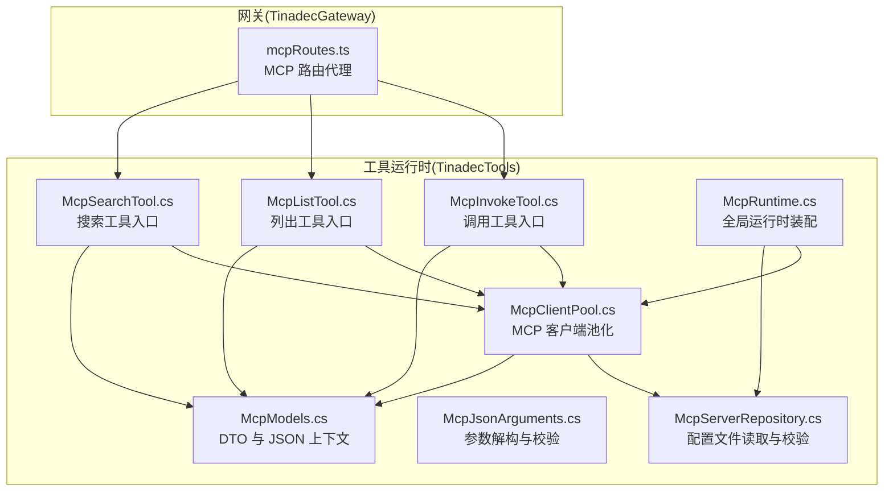
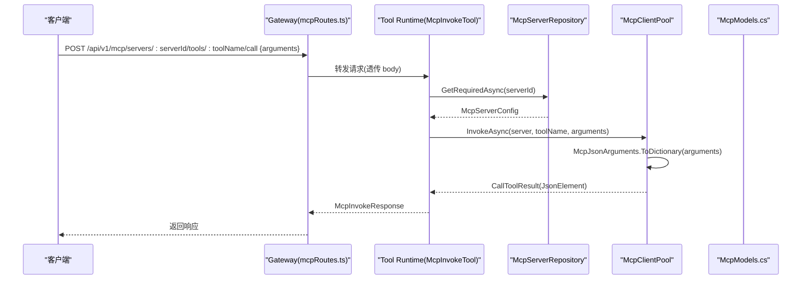
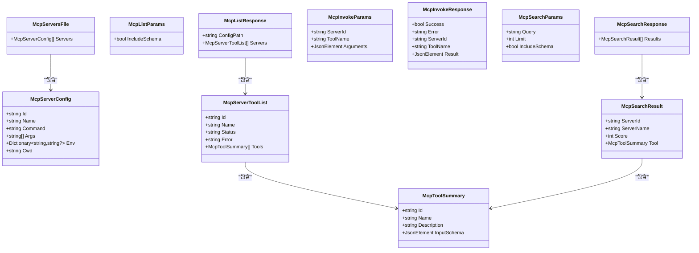
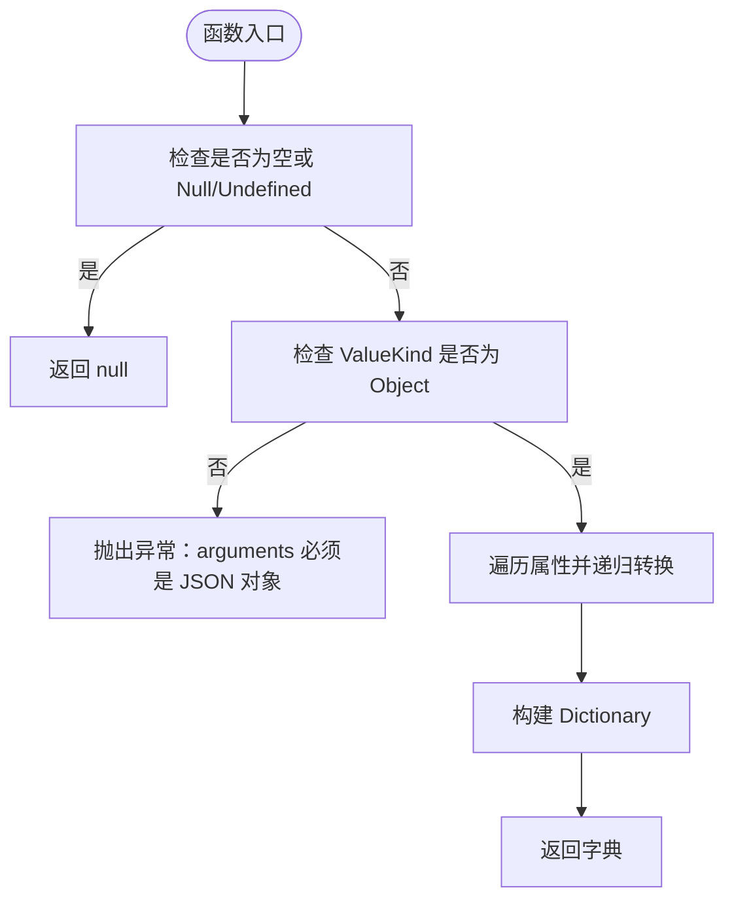
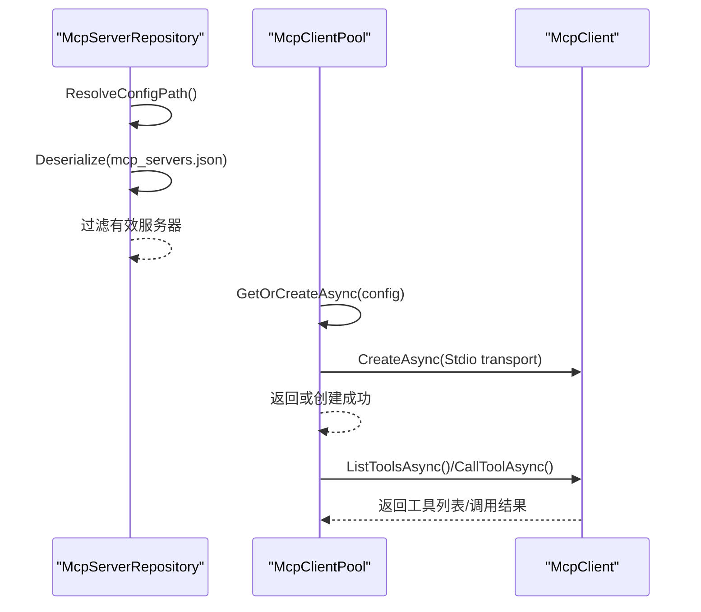
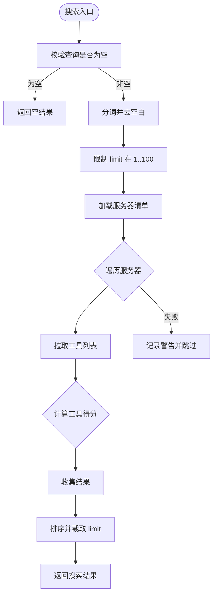
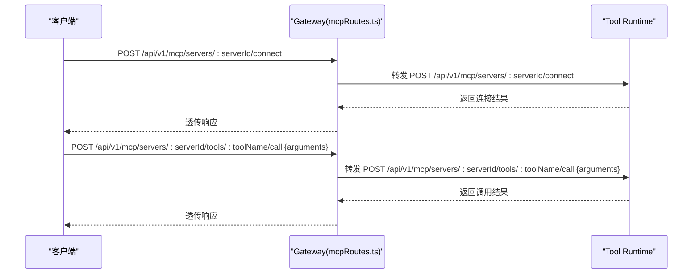
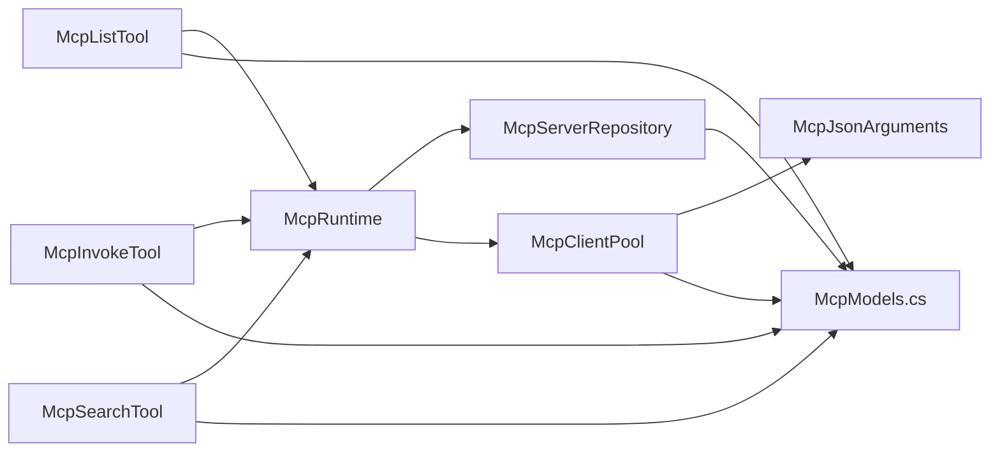

# MCP 数据模型

<cite>
**本文引用的文件**
- [McpModels.cs](file://TinadecTools/Tools/Mcp/McpModels.cs)
- [McpJsonArguments.cs](file://TinadecTools/Tools/Mcp/McpJsonArguments.cs)
- [McpClientPool.cs](file://TinadecTools/Tools/Mcp/McpClientPool.cs)
- [McpRuntime.cs](file://TinadecTools/Tools/Mcp/McpRuntime.cs)
- [McpServerRepository.cs](file://TinadecTools/Tools/Mcp/McpServerRepository.cs)
- [McpInvokeTool.cs](file://TinadecTools/Tools/Mcp/McpInvokeTool.cs)
- [McpListTool.cs](file://TinadecTools/Tools/Mcp/McpListTool.cs)
- [McpSearchTool.cs](file://TinadecTools/Tools/Mcp/McpSearchTool.cs)
- [mcpRoutes.ts](file://TinadecGateway/src/mcp/mcpRoutes.ts)
</cite>

## 目录
1. [简介](#简介)
2. [项目结构](#项目结构)
3. [核心组件](#核心组件)
4. [架构总览](#架构总览)
5. [详细组件分析](#详细组件分析)
6. [依赖关系分析](#依赖关系分析)
7. [性能考量](#性能考量)
8. [故障排查指南](#故障排查指南)
9. [结论](#结论)
10. [附录](#附录)

## 简介
本文件系统化梳理 MCP（Model Context Protocol）相关的数据模型与协议交互，覆盖 DTO、枚举与接口定义、消息格式、请求响应结构与错误码约定。重点说明 JSON 序列化配置、字段验证规则与类型约束，解释模型版本兼容性与迁移策略，并提供模型关系图、序列化解构流程与自定义转换器说明，以及使用示例与扩展指南，帮助开发者快速理解并安全扩展 MCP 数据契约。

## 项目结构
MCP 数据模型主要位于工具运行时模块的 Mcp 子目录中，包含：
- 数据模型与 JSON 上下文定义
- 参数转换与校验
- 客户端连接池与服务器仓库
- 工具入口（列表、调用、搜索）
- Gateway 侧路由代理（纯透传）

**图表来源**
- [McpModels.cs:1-115](file://TinadecTools/Tools/Mcp/McpModels.cs#L1-L115)
- [McpJsonArguments.cs:1-37](file://TinadecTools/Tools/Mcp/McpJsonArguments.cs#L1-L37)
- [McpClientPool.cs:1-89](file://TinadecTools/Tools/Mcp/McpClientPool.cs#L1-L89)
- [McpServerRepository.cs:1-53](file://TinadecTools/Tools/Mcp/McpServerRepository.cs#L1-L53)
- [McpInvokeTool.cs:1-39](file://TinadecTools/Tools/Mcp/McpInvokeTool.cs#L1-L39)
- [McpListTool.cs:1-42](file://TinadecTools/Tools/Mcp/McpListTool.cs#L1-L42)
- [McpSearchTool.cs:1-87](file://TinadecTools/Tools/Mcp/McpSearchTool.cs#L1-L87)
- [mcpRoutes.ts:1-66](file://TinadecGateway/src/mcp/mcpRoutes.ts#L1-L66)

**章节来源**
- [McpModels.cs:1-115](file://TinadecTools/Tools/Mcp/McpModels.cs#L1-L115)
- [McpJsonArguments.cs:1-37](file://TinadecTools/Tools/Mcp/McpJsonArguments.cs#L1-L37)
- [McpClientPool.cs:1-89](file://TinadecTools/Tools/Mcp/McpClientPool.cs#L1-L89)
- [McpServerRepository.cs:1-53](file://TinadecTools/Tools/Mcp/McpServerRepository.cs#L1-L53)
- [McpInvokeTool.cs:1-39](file://TinadecTools/Tools/Mcp/McpInvokeTool.cs#L1-L39)
- [McpListTool.cs:1-42](file://TinadecTools/Tools/Mcp/McpListTool.cs#L1-L42)
- [McpSearchTool.cs:1-87](file://TinadecTools/Tools/Mcp/McpSearchTool.cs#L1-L87)
- [mcpRoutes.ts:1-66](file://TinadecGateway/src/mcp/mcpRoutes.ts#L1-L66)

## 核心组件
- 数据模型与 JSON 上下文
  - 服务器配置与清单：McpServersFile、McpServerConfig
  - 工具摘要与列表：McpToolSummary、McpServerToolList
  - 操作参数与响应：McpListParams、McpListResponse、McpInvokeParams、McpInvokeResponse、McpSearchParams、McpSearchResult、McpSearchResponse
  - JSON 源生成上下文：McpJsonContext、McpListToolJsonContext、McpInvokeToolJsonContext、McpSearchToolJsonContext
- 参数转换与校验
  - McpJsonArguments：将 JsonElement 转换为字典，严格校验对象类型与值类型
- 运行时与资源管理
  - McpRuntime：集中暴露 Repository 与 ClientPool，提供测试注入与清理
  - McpServerRepository：从 JSON 配置文件加载服务器清单，按 Id 查找并做基础有效性校验
  - McpClientPool：基于 Stdio 的 MCP 客户端池化，支持 ListTools 与 CallTool
- 工具入口
  - McpListTool：列出所有服务器及其工具
  - McpInvokeTool：调用指定服务器的工具
  - McpSearchTool：对工具名与描述进行关键词打分排序检索
- 网关路由
  - mcpRoutes.ts：薄代理模式，将 /api/v1/mcp/* 转发到 Tool Runtime

**章节来源**
- [McpModels.cs:1-115](file://TinadecTools/Tools/Mcp/McpModels.cs#L1-L115)
- [McpJsonArguments.cs:1-37](file://TinadecTools/Tools/Mcp/McpJsonArguments.cs#L1-L37)
- [McpClientPool.cs:1-89](file://TinadecTools/Tools/Mcp/McpClientPool.cs#L1-L89)
- [McpServerRepository.cs:1-53](file://TinadecTools/Tools/Mcp/McpServerRepository.cs#L1-L53)
- [McpInvokeTool.cs:1-39](file://TinadecTools/Tools/Mcp/McpInvokeTool.cs#L1-L39)
- [McpListTool.cs:1-42](file://TinadecTools/Tools/Mcp/McpListTool.cs#L1-L42)
- [McpSearchTool.cs:1-87](file://TinadecTools/Tools/Mcp/McpSearchTool.cs#L1-L87)
- [mcpRoutes.ts:1-66](file://TinadecGateway/src/mcp/mcpRoutes.ts#L1-L66)

## 架构总览
下图展示了从 Gateway 到 Tool Runtime 的 MCP 调用链路，以及内部数据模型的流转。

**图表来源**
- [mcpRoutes.ts:1-66](file://TinadecGateway/src/mcp/mcpRoutes.ts#L1-L66)
- [McpInvokeTool.cs:1-39](file://TinadecTools/Tools/Mcp/McpInvokeTool.cs#L1-L39)
- [McpServerRepository.cs:1-53](file://TinadecTools/Tools/Mcp/McpServerRepository.cs#L1-L53)
- [McpClientPool.cs:1-89](file://TinadecTools/Tools/Mcp/McpClientPool.cs#L1-L89)
- [McpModels.cs:1-115](file://TinadecTools/Tools/Mcp/McpModels.cs#L1-L115)

## 详细组件分析

### 数据模型与 JSON 序列化
- 服务器配置
  - McpServersFile：顶层容器，包含 servers 列表
  - McpServerConfig：服务器标识、名称、启动命令、参数、环境变量与工作目录
- 工具摘要与列表
  - McpToolSummary：工具 id、name、description、input_schema（可选）
  - McpServerToolList：服务器元信息与工具集合，含 status 与 error
- 操作参数与响应
  - McpListParams：是否包含 schema
  - McpListResponse：配置文件路径与服务器列表
  - McpInvokeParams：server_id、tool_name、arguments（JSON 对象）
  - McpInvokeResponse：success、error、server_id、tool_name、result（JSON 元素）
  - McpSearchParams：query、limit、include_schema
  - McpSearchResult：server_id、server_name、score、tool
  - McpSearchResponse：results 列表
- JSON 序列化
  - 使用 System.Text.Json 源生成上下文，提升性能与稳定性
  - 统一 WriteIndented = true 输出格式
  - 针对不同场景拆分上下文：通用、列表、调用、搜索

**图表来源**
- [McpModels.cs:1-115](file://TinadecTools/Tools/Mcp/McpModels.cs#L1-L115)

**章节来源**
- [McpModels.cs:1-115](file://TinadecTools/Tools/Mcp/McpModels.cs#L1-L115)

### 参数转换与校验（McpJsonArguments）
- 输入要求
  - arguments 必须为 JSON 对象；否则抛出异常
  - 支持嵌套对象、数组、字符串、数字（整数优先）、布尔与 null
- 转换策略
  - 递归遍历 JsonElement，构建 Dictionary<string, object?>
  - 数字解析优先尝试 Int64，失败回退 Double
- 错误处理
  - 非对象直接抛错，避免后续处理歧义

**图表来源**
- [McpJsonArguments.cs:1-37](file://TinadecTools/Tools/Mcp/McpJsonArguments.cs#L1-L37)

**章节来源**
- [McpJsonArguments.cs:1-37](file://TinadecTools/Tools/Mcp/McpJsonArguments.cs#L1-L37)

### 客户端池与服务器仓库
- McpClientPool
  - 懒加载与缓存 McpClient，按 serverId 索引
  - ListToolsAsync：获取工具摘要，可选择是否包含 input_schema
  - InvokeAsync：将 JsonElement 转为字典后调用底层 CallTool，返回序列化后的结果
  - DisposeAsync：尽力关闭未创建与已创建的客户端
- McpServerRepository
  - 配置文件路径解析优先级：显式传入 > 环境变量 > 默认 mcp_servers.json
  - ListAsync：读取并过滤无效条目（需包含 Id 与 Command）
  - GetRequiredAsync：按 Id 精确查找，未找到抛出异常

**图表来源**
- [McpClientPool.cs:1-89](file://TinadecTools/Tools/Mcp/McpClientPool.cs#L1-L89)
- [McpServerRepository.cs:1-53](file://TinadecTools/Tools/Mcp/McpServerRepository.cs#L1-L53)

**章节来源**
- [McpClientPool.cs:1-89](file://TinadecTools/Tools/Mcp/McpClientPool.cs#L1-L89)
- [McpServerRepository.cs:1-53](file://TinadecTools/Tools/Mcp/McpServerRepository.cs#L1-L53)

### 工具入口与业务逻辑
- McpListTool
  - 读取服务器清单，逐个尝试连接并拉取工具列表
  - 成功标记状态为 connected，失败记录 error 信息
- McpInvokeTool
  - 校验 serverId，调用 ClientPool.InvokeAsync
  - 捕获异常并封装为失败响应（Success=false, Error=异常消息）
- McpSearchTool
  - 对 query 分词，限制 limit 范围[1,100]
  - 对每个服务器拉取工具，计算得分（名称、描述匹配权重不同）
  - 按得分降序、serverId 与工具名升序排序并截断

**图表来源**
- [McpSearchTool.cs:1-87](file://TinadecTools/Tools/Mcp/McpSearchTool.cs#L1-L87)

**章节来源**
- [McpListTool.cs:1-42](file://TinadecTools/Tools/Mcp/McpListTool.cs#L1-L42)
- [McpInvokeTool.cs:1-39](file://TinadecTools/Tools/Mcp/McpInvokeTool.cs#L1-L39)
- [McpSearchTool.cs:1-87](file://TinadecTools/Tools/Mcp/McpSearchTool.cs#L1-L87)

### 网关路由（纯代理）
- 端点设计
  - connect/disconnect/status：按 serverId 代理到 Tool Runtime
  - tools/:toolName/call：透传 body 中的 arguments（可选键值对）
- 行为特征
  - 不存储连接状态，仅转发请求与响应
  - 通过 Elysia 的类型声明对 body 进行基本校验

**图表来源**
- [mcpRoutes.ts:1-66](file://TinadecGateway/src/mcp/mcpRoutes.ts#L1-L66)

**章节来源**
- [mcpRoutes.ts:1-66](file://TinadecGateway/src/mcp/mcpRoutes.ts#L1-L66)

## 依赖关系分析
- 组件耦合
  - 工具入口依赖 McpRuntime 提供的 Repository 与 ClientPool
  - ClientPool 依赖 McpJsonArguments 进行参数转换
  - Repository 依赖 JSON 上下文进行反序列化
- 外部依赖
  - System.Text.Json 源生成上下文用于高性能序列化
  - ModelContextProtocol 客户端库用于 MCP 通信
  - NLog 用于日志记录

**图表来源**
- [McpListTool.cs:1-42](file://TinadecTools/Tools/Mcp/McpListTool.cs#L1-L42)
- [McpInvokeTool.cs:1-39](file://TinadecTools/Tools/Mcp/McpInvokeTool.cs#L1-L39)
- [McpSearchTool.cs:1-87](file://TinadecTools/Tools/Mcp/McpSearchTool.cs#L1-L87)
- [McpRuntime.cs:1-19](file://TinadecTools/Tools/Mcp/McpRuntime.cs#L1-L19)
- [McpServerRepository.cs:1-53](file://TinadecTools/Tools/Mcp/McpServerRepository.cs#L1-L53)
- [McpClientPool.cs:1-89](file://TinadecTools/Tools/Mcp/McpClientPool.cs#L1-L89)
- [McpJsonArguments.cs:1-37](file://TinadecTools/Tools/Mcp/McpJsonArguments.cs#L1-L37)
- [McpModels.cs:1-115](file://TinadecTools/Tools/Mcp/McpModels.cs#L1-L115)

**章节来源**
- [McpRuntime.cs:1-19](file://TinadecTools/Tools/Mcp/McpRuntime.cs#L1-L19)
- [McpServerRepository.cs:1-53](file://TinadecTools/Tools/Mcp/McpServerRepository.cs#L1-L53)
- [McpClientPool.cs:1-89](file://TinadecTools/Tools/Mcp/McpClientPool.cs#L1-L89)
- [McpJsonArguments.cs:1-37](file://TinadecTools/Tools/Mcp/McpJsonArguments.cs#L1-L37)
- [McpModels.cs:1-115](file://TinadecTools/Tools/Mcp/McpModels.cs#L1-L115)

## 性能考量
- JSON 序列化
  - 使用源生成上下文减少反射开销，提高吞吐
  - 统一缩进输出便于调试，生产环境可考虑关闭缩进以提升体积与速度
- 客户端池化
  - 懒加载与缓存避免重复创建进程与连接
  - 释放时尽力关闭，降低进程退出时的阻塞风险
- 搜索算法
  - 简单关键词评分，时间复杂度 O(N*M)，N 为工具数量，M 为查询词数
  - 限制 limit 上限防止大结果集传输
- 网络与 I/O
  - 配置文件读取采用共享读锁，避免并发冲突
  - 异步流式处理减少阻塞

[本节为通用指导，无需特定文件引用]

## 故障排查指南
- 常见错误与定位
  - arguments 不是对象：检查入参结构，确保为 JSON 对象
  - 服务器未找到：确认 serverId 与配置文件一致，且包含必要字段
  - 连接失败：检查 command、args、cwd、env 是否正确，查看日志
  - 工具调用失败：查看 McpInvokeResponse.Error 字段与日志
- 日志与诊断
  - 使用 NLog 记录警告与异常，重点关注 serverId 与 toolName
  - 通过 mcp_list 接口观察各服务器状态与错误信息
- 恢复建议
  - 修正配置文件后重试
  - 隔离问题服务器，逐步排查
  - 必要时重启 Tool Runtime 以清理连接池

**章节来源**
- [McpInvokeTool.cs:1-39](file://TinadecTools/Tools/Mcp/McpInvokeTool.cs#L1-L39)
- [McpListTool.cs:1-42](file://TinadecTools/Tools/Mcp/McpListTool.cs#L1-L42)
- [McpSearchTool.cs:1-87](file://TinadecTools/Tools/Mcp/McpSearchTool.cs#L1-L87)

## 结论
本模型围绕 MCP 协议在工具运行时的落地实现，提供了清晰的 DTO 定义、严格的参数校验、高效的 JSON 序列化与稳定的连接池管理。通过 Gateway 的薄代理模式，实现了跨语言与跨进程的解耦。建议在扩展新工具或新增字段时遵循现有命名与校验规范，保持向后兼容，并通过单元测试与集成测试保障契约稳定。

[本节为总结性内容，无需特定文件引用]

## 附录

### 字段验证规则与类型约束
- 必填字段
  - McpServerConfig：Id、Command 必须非空
  - McpInvokeParams：ServerId、ToolName 必须非空
  - McpSearchParams：Query 可为空但会返回空结果；Limit 限制在 1..100
- 可选字段
  - McpServerConfig：Name、Args、Env、Cwd
  - McpToolSummary：Description、InputSchema
  - McpInvokeParams：Arguments（JSON 对象）
  - McpSearchResult：ServerName（若为空则回退为 Id）
- 类型约束
  - 数值型：Limit 为 int；Score 为 int
  - 布尔型：IncludeSchema 为 bool
  - 文本型：Id、Name、Command、Description、Status、Error、Query 等
  - 复合类型：Args 为字符串数组；Env 为键值对；InputSchema/Result 为 JsonElement

**章节来源**
- [McpModels.cs:1-115](file://TinadecTools/Tools/Mcp/McpModels.cs#L1-L115)
- [McpServerRepository.cs:1-53](file://TinadecTools/Tools/Mcp/McpServerRepository.cs#L1-L53)
- [McpSearchTool.cs:1-87](file://TinadecTools/Tools/Mcp/McpSearchTool.cs#L1-L87)

### 模型版本兼容性与迁移策略
- 兼容性原则
  - 新增字段应为可选，避免破坏旧客户端
  - 保留历史字段名，废弃字段标记但不立即删除
  - 对数值范围与枚举值进行边界保护
- 迁移步骤
  - 发布新版本时先增加可选字段与新的 JSON 上下文
  - 在读取路径上提供降级逻辑（缺失字段使用默认值）
  - 逐步淘汰旧字段，发布弃用公告后再移除
- 测试与回归
  - 使用快照测试与契约测试确保序列化一致性
  - 对关键路径进行端到端回归，包括连接、列表、调用与搜索

[本节为通用指导，无需特定文件引用]

### 使用示例与扩展指南
- 调用示例（Gateway 层）
  - POST /api/v1/mcp/servers/{serverId}/tools/{toolName}/call
  - Body: { arguments: { key: value } }
  - Response: { success, error, server_id, tool_name, result }
- 扩展新工具
  - 在 McpModels.cs 中新增 DTO 与对应 JSON 上下文
  - 在工具入口类中添加 [ToolFunction] 方法，接收参数并返回响应
  - 如需自定义转换，扩展 McpJsonArguments 或新增转换器
- 最佳实践
  - 保持字段命名一致，避免歧义
  - 对敏感字段进行最小权限与环境变量注入
  - 对异常路径进行充分日志记录与错误码约定

**章节来源**
- [mcpRoutes.ts:1-66](file://TinadecGateway/src/mcp/mcpRoutes.ts#L1-L66)
- [McpModels.cs:1-115](file://TinadecTools/Tools/Mcp/McpModels.cs#L1-L115)
- [McpJsonArguments.cs:1-37](file://TinadecTools/Tools/Mcp/McpJsonArguments.cs#L1-L37)