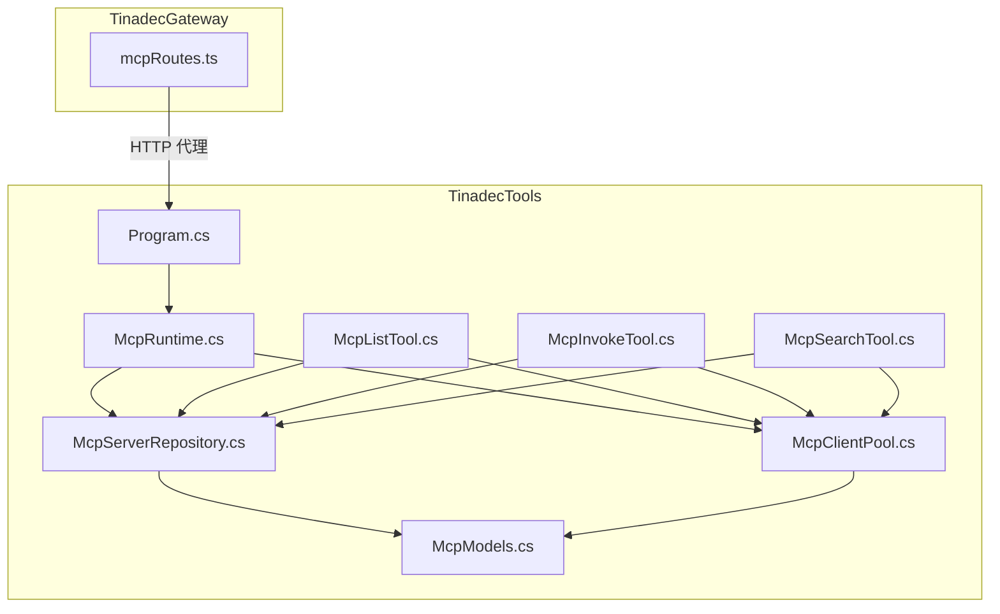
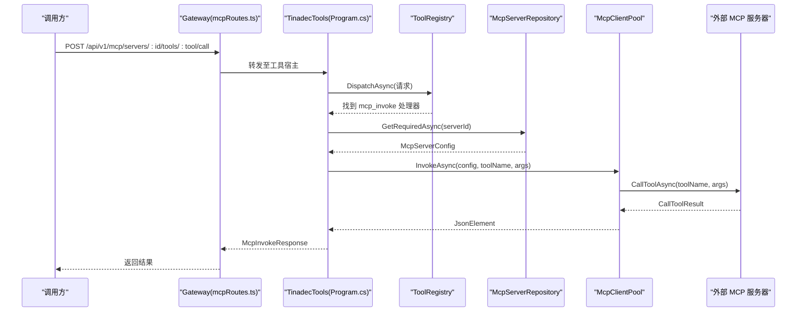
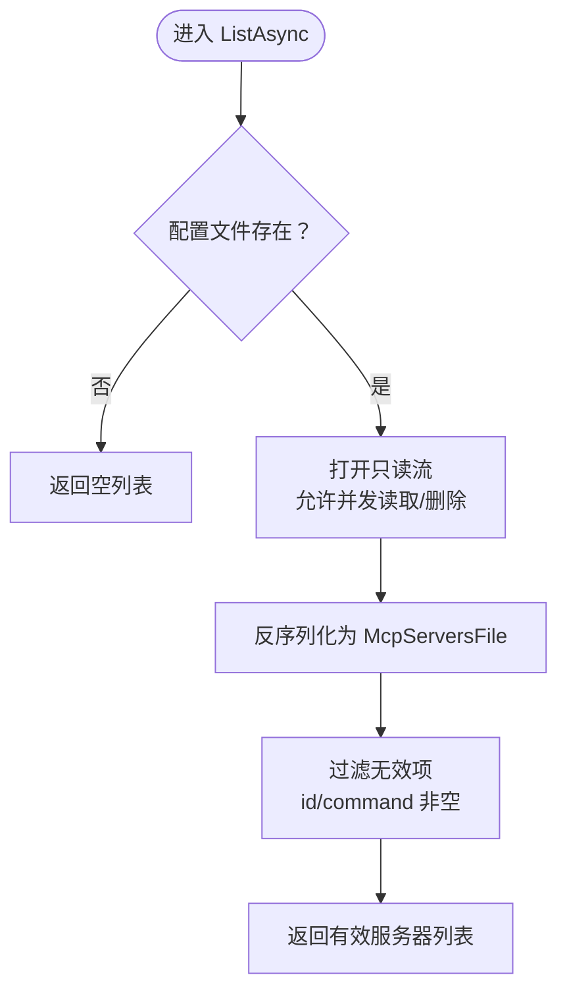
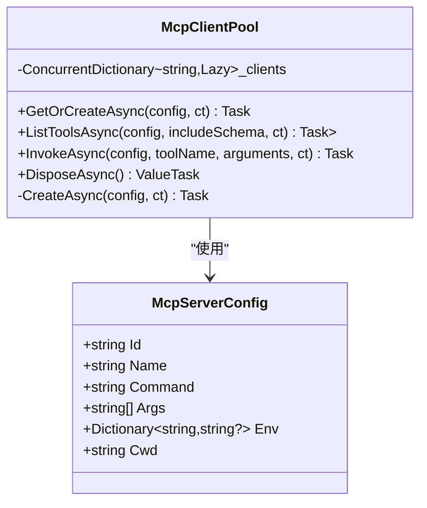
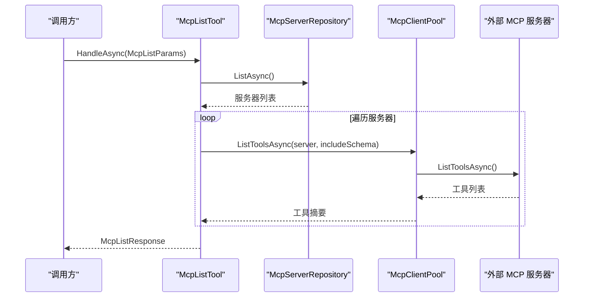
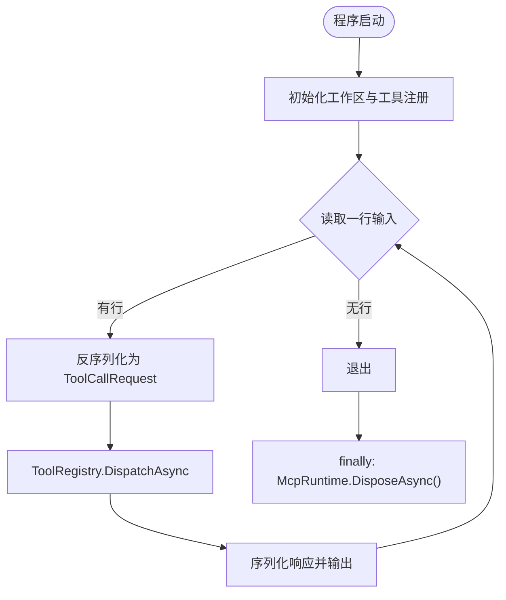
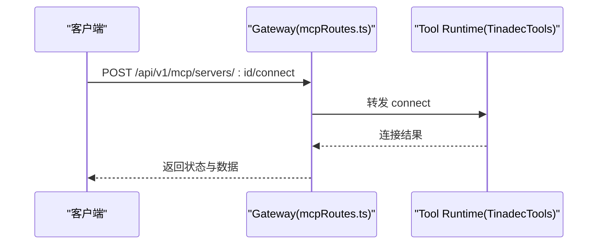
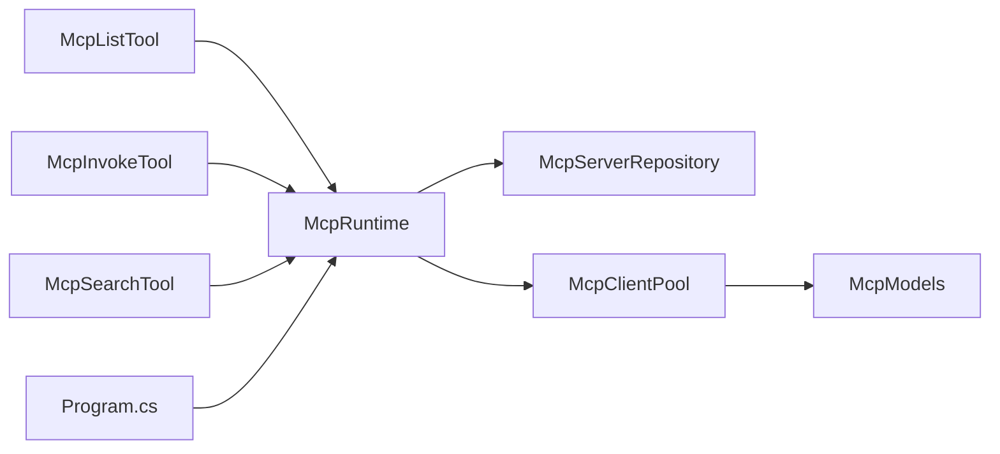

# MCP 服务器仓库

<cite>
**本文引用的文件**   
- [TinadecTools/Tools/Mcp/McpServerRepository.cs](file://TinadecTools/Tools/Mcp/McpServerRepository.cs)
- [TinadecTools/Tools/Mcp/McpModels.cs](file://TinadecTools/Tools/Mcp/McpModels.cs)
- [TinadecTools/Tools/Mcp/McpClientPool.cs](file://TinadecTools/Tools/Mcp/McpClientPool.cs)
- [TinadecTools/Tools/Mcp/McpRuntime.cs](file://TinadecTools/Tools/Mcp/McpRuntime.cs)
- [TinadecTools/Tools/Mcp/McpInvokeTool.cs](file://TinadecTools/Tools/Mcp/McpInvokeTool.cs)
- [TinadecTools/Tools/Mcp/McpListTool.cs](file://TinadecTools/Tools/Mcp/McpListTool.cs)
- [TinadecTools/Tools/Mcp/McpSearchTool.cs](file://TinadecTools/Tools/Mcp/McpSearchTool.cs)
- [TinadecTools/Program.cs](file://TinadecTools/Program.cs)
- [TinadecGateway/src/mcp/mcpRoutes.ts](file://TinadecGateway/src/mcp/mcpRoutes.ts)
- [.mcp.json](file://.mcp.json)
</cite>

## 目录
1. [简介](#简介)
2. [项目结构](#项目结构)
3. [核心组件](#核心组件)
4. [架构总览](#架构总览)
5. [详细组件分析](#详细组件分析)
6. [依赖关系分析](#依赖关系分析)
7. [性能考量](#性能考量)
8. [故障排查指南](#故障排查指南)
9. [结论](#结论)
10. [附录：配置与最佳实践](#附录配置与最佳实践)

## 简介
本仓库包含一个基于 Model Context Protocol（MCP）的工具运行时实现，提供 MCP 服务器的发现、连接、工具列表查询与调用能力。其特点包括：
- 配置文件加载与环境变量覆盖
- 进程内客户端池化与生命周期管理
- 工具注册与审批机制
- Gateway 侧的薄代理路由
- 面向 AOT 的 JSON Source Generation

该文档聚焦于“服务器配置的加载、缓存与管理”“配置文件格式与环境变量支持”“动态发现与搜索”“注册表与版本/兼容性检查”“配置验证、热重载与故障转移策略”，并提供示例与最佳实践。

## 项目结构
- TinadecTools：C# 工具宿主与 MCP 实现
  - Tools/Mcp：MCP 相关模型、仓库、客户端池、工具入口
  - Program.cs：标准输入/输出循环，分发工具调用
- TinadecGateway：Node.js 网关，提供 MCP 代理端点
- .mcp.json：示例 MCP 配置（SSE/stdio 两种类型）

**图表来源** 
- [TinadecTools/Program.cs](file://TinadecTools/Program.cs)
- [TinadecTools/Tools/Mcp/McpServerRepository.cs](file://TinadecTools/Tools/Mcp/McpServerRepository.cs)
- [TinadecTools/Tools/Mcp/McpClientPool.cs](file://TinadecTools/Tools/Mcp/McpClientPool.cs)
- [TinadecTools/Tools/Mcp/McpRuntime.cs](file://TinadecTools/Tools/Mcp/McpRuntime.cs)
- [TinadecTools/Tools/Mcp/McpListTool.cs](file://TinadecTools/Tools/Mcp/McpListTool.cs)
- [TinadecTools/Tools/Mcp/McpInvokeTool.cs](file://TinadecTools/Tools/Mcp/McpInvokeTool.cs)
- [TinadecTools/Tools/Mcp/McpSearchTool.cs](file://TinadecTools/Tools/Mcp/McpSearchTool.cs)
- [TinadecTools/Tools/Mcp/McpModels.cs](file://TinadecTools/Tools/Mcp/McpModels.cs)
- [TinadecGateway/src/mcp/mcpRoutes.ts](file://TinadecGateway/src/mcp/mcpRoutes.ts)

**章节来源**
- [TinadecTools/Program.cs](file://TinadecTools/Program.cs)
- [TinadecGateway/src/mcp/mcpRoutes.ts](file://TinadecGateway/src/mcp/mcpRoutes.ts)

## 核心组件
- McpServerRepository：负责从配置文件读取并校验 MCP 服务器清单，支持环境变量覆盖路径
- McpClientPool：维护每个服务器的 stdio 客户端实例，提供工具列表与调用
- McpRuntime：全局暴露 Repository 与 ClientPool，便于测试注入与统一释放
- McpModels：JSON 序列化模型与上下文，定义配置与响应结构
- McpListTool / McpInvokeTool / McpSearchTool：对外暴露的工具方法，分别用于列举、调用与搜索
- Program.cs：标准 I/O 主循环，解析请求并分发给 ToolRegistry，最终调用上述工具

**章节来源**
- [TinadecTools/Tools/Mcp/McpServerRepository.cs](file://TinadecTools/Tools/Mcp/McpServerRepository.cs)
- [TinadecTools/Tools/Mcp/McpClientPool.cs](file://TinadecTools/Tools/Mcp/McpClientPool.cs)
- [TinadecTools/Tools/Mcp/McpRuntime.cs](file://TinadecTools/Tools/Mcp/McpRuntime.cs)
- [TinadecTools/Tools/Mcp/McpModels.cs](file://TinadecTools/Tools/Mcp/McpModels.cs)
- [TinadecTools/Tools/Mcp/McpListTool.cs](file://TinadecTools/Tools/Mcp/McpListTool.cs)
- [TinadecTools/Tools/Mcp/McpInvokeTool.cs](file://TinadecTools/Tools/Mcp/McpInvokeTool.cs)
- [TinadecTools/Tools/Mcp/McpSearchTool.cs](file://TinadecTools/Tools/Mcp/McpSearchTool.cs)
- [TinadecTools/Program.cs](file://TinadecTools/Program.cs)

## 架构总览
整体采用“工具宿主 + 网关代理”的分层设计：
- 工具宿主（TinadecTools）通过标准输入/输出接收工具调用请求，内部使用 McpRuntime 访问 Repository 与 ClientPool，完成 MCP 服务器发现与调用
- 网关（TinadecGateway）仅做 HTTP 到工具宿主的转发，不持有 MCP 连接状态，保持“薄代理”模式

**图表来源** 
- [TinadecGateway/src/mcp/mcpRoutes.ts](file://TinadecGateway/src/mcp/mcpRoutes.ts)
- [TinadecTools/Program.cs](file://TinadecTools/Program.cs)
- [TinadecTools/Tools/Mcp/McpInvokeTool.cs](file://TinadecTools/Tools/Mcp/McpInvokeTool.cs)
- [TinadecTools/Tools/Mcp/McpServerRepository.cs](file://TinadecTools/Tools/Mcp/McpServerRepository.cs)
- [TinadecTools/Tools/Mcp/McpClientPool.cs](file://TinadecTools/Tools/Mcp/McpClientPool.cs)

## 详细组件分析

### 配置加载与验证（McpServerRepository）
- 配置路径解析优先级：构造函数参数 > 环境变量 TINADEC_TOOLS_MCP_CONFIG > 启动目录 mcp_servers.json
- 读取方式：以流式反序列化为 McpServersFile，过滤无效条目（id 与 command 非空）
- 获取单个服务器：按 id 精确匹配，未命中抛出异常

**图表来源** 
- [TinadecTools/Tools/Mcp/McpServerRepository.cs](file://TinadecTools/Tools/Mcp/McpServerRepository.cs)

**章节来源**
- [TinadecTools/Tools/Mcp/McpServerRepository.cs](file://TinadecTools/Tools/Mcp/McpServerRepository.cs)

### 客户端池与连接管理（McpClientPool）
- 使用 ConcurrentDictionary 缓存 Lazy<Task<McpClient>>，按 serverId 懒创建与复用
- 创建时通过 StdioClientTransport 启动子进程，继承环境变量并可叠加配置 env
- 提供 ListToolsAsync 与 InvokeAsync 两个核心方法
- DisposeAsync 确保所有已创建的客户端被释放

**图表来源** 
- [TinadecTools/Tools/Mcp/McpClientPool.cs](file://TinadecTools/Tools/Mcp/McpClientPool.cs)
- [TinadecTools/Tools/Mcp/McpModels.cs](file://TinadecTools/Tools/Mcp/McpModels.cs)

**章节来源**
- [TinadecTools/Tools/Mcp/McpClientPool.cs](file://TinadecTools/Tools/Mcp/McpClientPool.cs)

### 工具入口与流程（McpListTool / McpInvokeTool / McpSearchTool）
- McpListTool：遍历配置中的服务器，尝试连接并拉取工具列表，记录状态与错误
- McpInvokeTool：根据 serverId 获取配置，调用目标工具，捕获异常并返回失败信息
- McpSearchTool：对全部服务器进行工具名与描述打分排序，支持 limit 限制与可选 schema

**图表来源** 
- [TinadecTools/Tools/Mcp/McpListTool.cs](file://TinadecTools/Tools/Mcp/McpListTool.cs)
- [TinadecTools/Tools/Mcp/McpServerRepository.cs](file://TinadecTools/Tools/Mcp/McpServerRepository.cs)
- [TinadecTools/Tools/Mcp/McpClientPool.cs](file://TinadecTools/Tools/Mcp/McpClientPool.cs)

**章节来源**
- [TinadecTools/Tools/Mcp/McpListTool.cs](file://TinadecTools/Tools/Mcp/McpListTool.cs)
- [TinadecTools/Tools/Mcp/McpInvokeTool.cs](file://TinadecTools/Tools/Mcp/McpInvokeTool.cs)
- [TinadecTools/Tools/Mcp/McpSearchTool.cs](file://TinadecTools/Tools/Mcp/McpSearchTool.cs)

### 运行时与主循环（McpRuntime / Program.cs）
- McpRuntime：暴露 Repository 与 ClientPool，提供测试注入与统一释放
- Program.cs：标准输入/输出循环，反序列化请求，调用 ToolRegistry.DispatchAsync，输出响应；在 finally 中释放 McpRuntime

**图表来源** 
- [TinadecTools/Program.cs](file://TinadecTools/Program.cs)
- [TinadecTools/Tools/Mcp/McpRuntime.cs](file://TinadecTools/Tools/Mcp/McpRuntime.cs)

**章节来源**
- [TinadecTools/Program.cs](file://TinadecTools/Program.cs)
- [TinadecTools/Tools/Mcp/McpRuntime.cs](file://TinadecTools/Tools/Mcp/McpRuntime.cs)

### 网关代理（mcpRoutes.ts）
- 提供 connect/disconnect/status/call 四个端点，均转发到工具宿主的对应 API
- 不存储连接状态，保持薄代理模式

**图表来源** 
- [TinadecGateway/src/mcp/mcpRoutes.ts](file://TinadecGateway/src/mcp/mcpRoutes.ts)

**章节来源**
- [TinadecGateway/src/mcp/mcpRoutes.ts](file://TinadecGateway/src/mcp/mcpRoutes.ts)

## 依赖关系分析
- McpRuntime 依赖 McpServerRepository 与 McpClientPool
- McpListTool / McpInvokeTool / McpSearchTool 依赖 McpRuntime 提供的 Repository 与 ClientPool
- McpClientPool 依赖 McpModels 中的配置与响应模型
- Program.cs 依赖 ToolRegistry 进行工具分发，并在 finally 中释放 McpRuntime

**图表来源** 
- [TinadecTools/Tools/Mcp/McpRuntime.cs](file://TinadecTools/Tools/Mcp/McpRuntime.cs)
- [TinadecTools/Tools/Mcp/McpServerRepository.cs](file://TinadecTools/Tools/Mcp/McpServerRepository.cs)
- [TinadecTools/Tools/Mcp/McpClientPool.cs](file://TinadecTools/Tools/Mcp/McpClientPool.cs)
- [TinadecTools/Tools/Mcp/McpModels.cs](file://TinadecTools/Tools/Mcp/McpModels.cs)
- [TinadecTools/Tools/Mcp/McpListTool.cs](file://TinadecTools/Tools/Mcp/McpListTool.cs)
- [TinadecTools/Tools/Mcp/McpInvokeTool.cs](file://TinadecTools/Tools/Mcp/McpInvokeTool.cs)
- [TinadecTools/Tools/Mcp/McpSearchTool.cs](file://TinadecTools/Tools/Mcp/McpSearchTool.cs)
- [TinadecTools/Program.cs](file://TinadecTools/Program.cs)

**章节来源**
- [TinadecTools/Tools/Mcp/McpRuntime.cs](file://TinadecTools/Tools/Mcp/McpRuntime.cs)
- [TinadecTools/Tools/Mcp/McpServerRepository.cs](file://TinadecTools/Tools/Mcp/McpServerRepository.cs)
- [TinadecTools/Tools/Mcp/McpClientPool.cs](file://TinadecTools/Tools/Mcp/McpClientPool.cs)
- [TinadecTools/Tools/Mcp/McpModels.cs](file://TinadecTools/Tools/Mcp/McpModels.cs)
- [TinadecTools/Tools/Mcp/McpListTool.cs](file://TinadecTools/Tools/Mcp/McpListTool.cs)
- [TinadecTools/Tools/Mcp/McpInvokeTool.cs](file://TinadecTools/Tools/Mcp/McpInvokeTool.cs)
- [TinadecTools/Tools/Mcp/McpSearchTool.cs](file://TinadecTools/Tools/Mcp/McpSearchTool.cs)
- [TinadecTools/Program.cs](file://TinadecTools/Program.cs)

## 性能考量
- 客户端池化：按 serverId 懒创建与复用连接，减少重复启动开销
- 流式读取配置：避免一次性加载大文件带来的内存峰值
- JSON Source Generation：AOT 友好的序列化，降低反射开销
- 并发安全：ConcurrentDictionary 保证多线程访问安全
- 建议：
  - 合理设置 Limit 与 IncludeSchema，避免不必要的 Schema 传输
  - 控制并发调用数量，防止过多子进程导致资源竞争
  - 对频繁调用的工具建立本地缓存（如工具元数据），减少远程往返

[本节为通用指导，无需引用具体文件]

## 故障排查指南
- 配置文件不存在或路径错误
  - 现象：ListAsync 返回空列表或 GetRequiredAsync 抛出未找到异常
  - 排查：确认环境变量 TINADEC_TOOLS_MCP_CONFIG 是否设置，或默认路径是否存在
- 服务器配置无效
  - 现象：服务器被过滤掉（id/command 为空）
  - 排查：检查 servers 数组中每条记录的必填字段
- 连接失败或调用异常
  - 现象：ListToolsAsync/InvokeAsync 抛异常，状态标记为 error
  - 排查：检查命令、参数、工作目录、环境变量是否正确；查看日志中的警告信息
- 网关代理问题
  - 现象：Gateway 返回非 2xx 状态码
  - 排查：确认工具宿主运行正常且端口可达；检查转发路径与参数编码

**章节来源**
- [TinadecTools/Tools/Mcp/McpServerRepository.cs](file://TinadecTools/Tools/Mcp/McpServerRepository.cs)
- [TinadecTools/Tools/Mcp/McpClientPool.cs](file://TinadecTools/Tools/Mcp/McpClientPool.cs)
- [TinadecTools/Tools/Mcp/McpListTool.cs](file://TinadecTools/Tools/Mcp/McpListTool.cs)
- [TinadecTools/Tools/Mcp/McpInvokeTool.cs](file://TinadecTools/Tools/Mcp/McpInvokeTool.cs)
- [TinadecGateway/src/mcp/mcpRoutes.ts](file://TinadecGateway/src/mcp/mcpRoutes.ts)

## 结论
本实现提供了轻量、可组合的 MCP 服务器管理能力：
- 通过配置文件与环境变量灵活管理服务器清单
- 使用客户端池提升连接复用与性能
- 工具入口清晰，支持列举、调用与搜索
- 网关薄代理简化部署与扩展

建议在大规模场景下引入配置热重载、连接健康检查与故障转移策略，以提升稳定性与可用性。

[本节为总结性内容，无需引用具体文件]

## 附录：配置与最佳实践

### 配置文件格式
- 根对象：servers 数组，每项包含 id、name、command、args、env、cwd
- 必填字段：id、command
- 可选字段：name、args、env、cwd

示例（位于仓库根目录）：
- [示例配置](file://.mcp.json)

**章节来源**
- [TinadecTools/Tools/Mcp/McpModels.cs](file://TinadecTools/Tools/Mcp/McpModels.cs)
- [.mcp.json](file://.mcp.json)

### 环境变量支持
- TINADEC_TOOLS_MCP_CONFIG：覆盖配置文件路径
- 子进程环境变量：继承系统环境，并可叠加配置中的 env

**章节来源**
- [TinadecTools/Tools/Mcp/McpServerRepository.cs](file://TinadecTools/Tools/Mcp/McpServerRepository.cs)
- [TinadecTools/Tools/Mcp/McpClientPool.cs](file://TinadecTools/Tools/Mcp/McpClientPool.cs)

### 动态发现与搜索
- 动态发现：每次调用都会读取最新配置并尝试连接服务器
- 搜索：基于工具名与描述的简单打分排序，支持 limit 限制

**章节来源**
- [TinadecTools/Tools/Mcp/McpListTool.cs](file://TinadecTools/Tools/Mcp/McpListTool.cs)
- [TinadecTools/Tools/Mcp/McpSearchTool.cs](file://TinadecTools/Tools/Mcp/McpSearchTool.cs)

### 服务器注册表与版本/兼容性检查
- 当前实现未内置版本管理与兼容性检查
- 建议：在 McpServerConfig 中增加 version 字段，并在连接后与服务端协商版本；在调用前进行兼容性校验

[本节为概念性建议，无需引用具体文件]

### 配置验证、热重载与故障转移策略
- 配置验证：已在读取时进行基本校验（id/command 非空）
- 热重载：当前未实现监听文件变更自动重载；可在 Repository 层增加文件监听与缓存失效逻辑
- 故障转移：当前未实现多副本或降级策略；可在 ClientPool 层增加健康检查与备用服务器选择

[本节为概念性建议，无需引用具体文件]

### 最佳实践
- 将敏感信息放入 env，避免明文写入配置
- 合理设置 cwd，确保相对路径正确
- 对高频工具启用本地缓存（工具元数据）
- 使用网关统一入口，隔离工具宿主生命周期
- 监控与日志：记录连接失败与调用异常，便于快速定位问题

[本节为通用指导，无需引用具体文件]