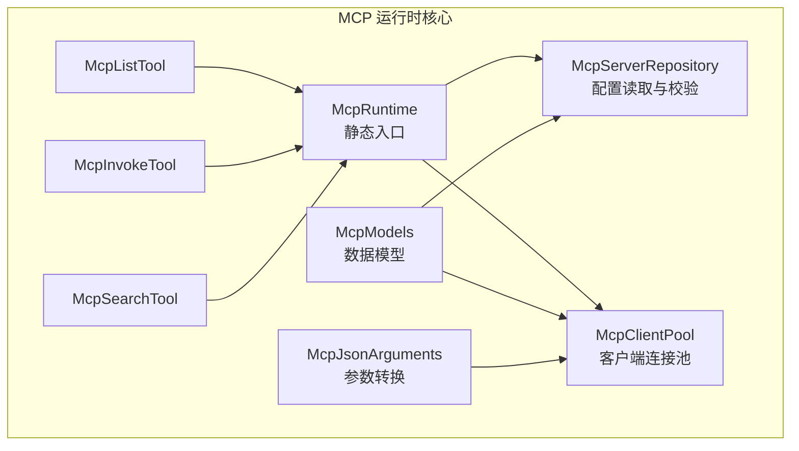
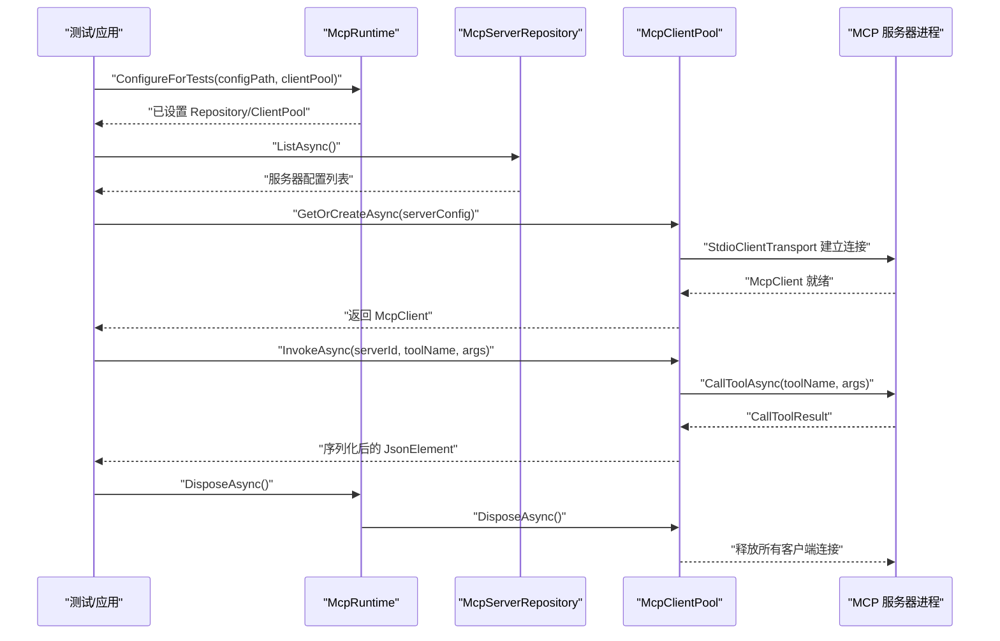
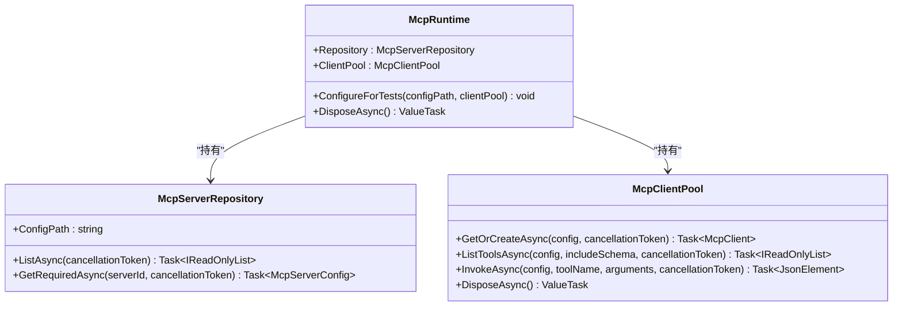
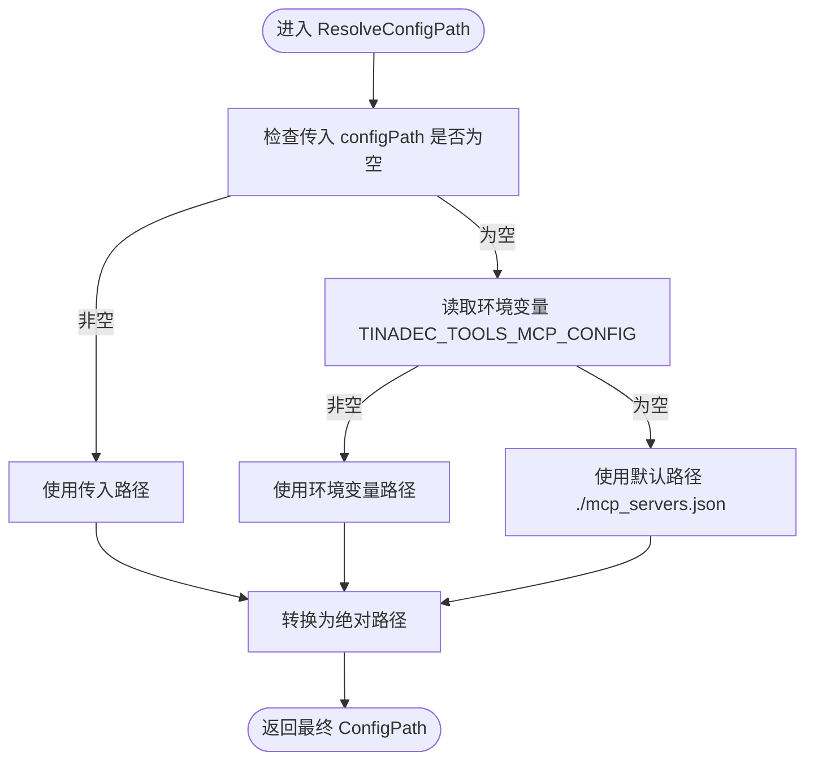
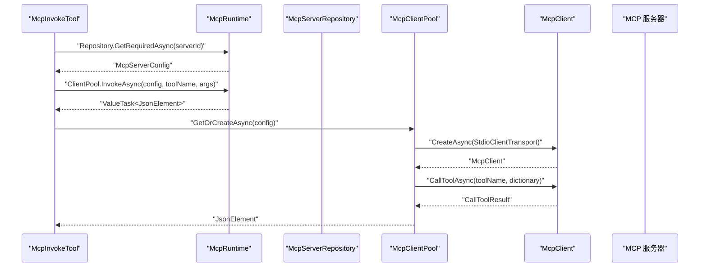
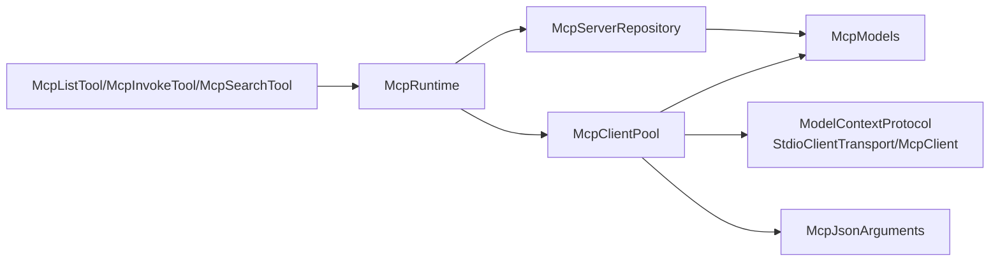

# MCP 运行时核心

<cite>
**本文引用的文件**   
- [McpRuntime.cs](file://TinadecTools/Tools/Mcp/McpRuntime.cs)
- [McpServerRepository.cs](file://TinadecTools/Tools/Mcp/McpServerRepository.cs)
- [McpClientPool.cs](file://TinadecTools/Tools/Mcp/McpClientPool.cs)
- [McpModels.cs](file://TinadecTools/Tools/Mcp/McpModels.cs)
- [McpJsonArguments.cs](file://TinadecTools/Tools/Mcp/McpJsonArguments.cs)
- [McpListTool.cs](file://TinadecTools/Tools/Mcp/McpListTool.cs)
- [McpInvokeTool.cs](file://TinadecTools/Tools/Mcp/McpInvokeTool.cs)
- [McpSearchTool.cs](file://TinadecTools/Tools/Mcp/McpSearchTool.cs)
- [McpPassThroughTests.cs](file://tests/TinadecTools.Tests/McpPassThroughTests.cs)
</cite>

## 目录
1. [简介](#简介)
2. [项目结构](#项目结构)
3. [核心组件](#核心组件)
4. [架构总览](#架构总览)
5. [详细组件分析](#详细组件分析)
6. [依赖关系分析](#依赖关系分析)
7. [性能考量](#性能考量)
8. [故障排查指南](#故障排查指南)
9. [结论](#结论)
10. [附录：配置参数说明](#附录：配置参数说明)

## 简介
本文件聚焦于 MCP（Model Context Protocol）运行时核心，围绕静态类 McpRuntime 的职责展开，包括服务器仓库与客户端池的初始化、配置与管理；详细说明测试配置机制 ConfigureForTests 的工作方式以及 DisposeAsync 的资源清理流程；解释运行时单例模式的使用场景与生命周期管理；并给出配置参数说明与错误处理策略。该核心为工具层提供统一的 MCP 服务器发现、连接复用与工具调用能力。

## 项目结构
MCP 运行时核心位于 TinadecTools/Tools/Mcp 目录下，主要包含以下文件：
- McpRuntime.cs：静态运行时入口，暴露 Repository 与 ClientPool，并提供测试配置与资源释放方法
- McpServerRepository.cs：负责读取 mcp_servers.json 配置文件，列出并校验服务器配置
- McpClientPool.cs：基于 StdioClientTransport 的 MCP 客户端连接池，支持懒加载、重试与异步释放
- McpModels.cs：定义 JSON 模型与 SourceGenerationContext
- McpJsonArguments.cs：JSON 参数到字典的转换工具
- McpListTool.cs / McpInvokeTool.cs / McpSearchTool.cs：对外暴露的工具实现，依赖 McpRuntime 访问仓库与客户端池
- 测试用例 McpPassThroughTests.cs：演示 ConfigureForTests 的使用与基本端到端验证

图表来源
- [McpRuntime.cs:1-19](file://TinadecTools/Tools/Mcp/McpRuntime.cs#L1-L19)
- [McpServerRepository.cs:1-53](file://TinadecTools/Tools/Mcp/McpServerRepository.cs#L1-L53)
- [McpClientPool.cs:1-89](file://TinadecTools/Tools/Mcp/McpClientPool.cs#L1-L89)
- [McpModels.cs:1-115](file://TinadecTools/Tools/Mcp/McpModels.cs#L1-L115)
- [McpJsonArguments.cs:1-37](file://TinadecTools/Tools/Mcp/McpJsonArguments.cs#L1-L37)
- [McpListTool.cs:1-42](file://TinadecTools/Tools/Mcp/McpListTool.cs#L1-L42)
- [McpInvokeTool.cs:1-39](file://TinadecTools/Tools/Mcp/McpInvokeTool.cs#L1-L39)
- [McpSearchTool.cs:1-87](file://TinadecTools/Tools/Mcp/McpSearchTool.cs#L1-L87)

章节来源
- [McpRuntime.cs:1-19](file://TinadecTools/Tools/Mcp/McpRuntime.cs#L1-L19)
- [McpServerRepository.cs:1-53](file://TinadecTools/Tools/Mcp/McpServerRepository.cs#L1-L53)
- [McpClientPool.cs:1-89](file://TinadecTools/Tools/Mcp/McpClientPool.cs#L1-L89)

## 核心组件
- McpRuntime：静态类，持有全局唯一的 McpServerRepository 与 McpClientPool 实例，提供 ConfigureForTests 用于测试注入，DisposeAsync 用于统一释放客户端池资源
- McpServerRepository：从配置文件（mcp_servers.json）或环境变量 TINADEC_TOOLS_MCP_CONFIG 解析服务器列表，过滤无效项，支持按 Id 获取必需配置
- McpClientPool：维护以服务器 Id 为键的 Lazy<Task<McpClient>> 缓存，按需创建并复用连接；提供 ListToolsAsync、InvokeAsync 等能力；实现 IAsyncDisposable 进行优雅关闭
- 工具层：McpListTool、McpInvokeTool、McpSearchTool 通过 McpRuntime 访问仓库与客户端池，完成工具列举、搜索与调用

章节来源
- [McpRuntime.cs:1-19](file://TinadecTools/Tools/Mcp/McpRuntime.cs#L1-L19)
- [McpServerRepository.cs:1-53](file://TinadecTools/Tools/Mcp/McpServerRepository.cs#L1-L53)
- [McpClientPool.cs:1-89](file://TinadecTools/Tools/Mcp/McpClientPool.cs#L1-L89)
- [McpListTool.cs:1-42](file://TinadecTools/Tools/Mcp/McpListTool.cs#L1-L42)
- [McpInvokeTool.cs:1-39](file://TinadecTools/Tools/Mcp/McpInvokeTool.cs#L1-L39)
- [McpSearchTool.cs:1-87](file://TinadecTools/Tools/Mcp/McpSearchTool.cs#L1-L87)

## 架构总览
McpRuntime 作为静态单例入口，将“配置读取”和“连接池”解耦为两个独立组件，工具层仅依赖 McpRuntime 提供的只读属性与操作方法。整体流程如下：
- 启动时默认初始化 Repository 与 ClientPool
- 测试环境可通过 ConfigureForTests 替换 Repository 与 ClientPool，便于注入模拟或轻量实现
- 工具调用时，先通过 Repository 获取服务器配置，再通过 ClientPool 获取或复用客户端，最后执行工具调用

图表来源
- [McpRuntime.cs:8-17](file://TinadecTools/Tools/Mcp/McpRuntime.cs#L8-L17)
- [McpServerRepository.cs:16-34](file://TinadecTools/Tools/Mcp/McpServerRepository.cs#L16-L34)
- [McpClientPool.cs:12-40](file://TinadecTools/Tools/Mcp/McpClientPool.cs#L12-L40)
- [McpClientPool.cs:63-76](file://TinadecTools/Tools/Mcp/McpClientPool.cs#L63-L76)

## 详细组件分析

### McpRuntime 静态类
职责与行为
- 暴露只读属性 Repository 与 ClientPool，供工具层使用
- ConfigureForTests：在测试中替换 Repository 与 ClientPool，支持传入自定义 configPath 与 clientPool
- DisposeAsync：调用 ClientPool.DisposeAsync() 完成资源释放

单例模式与生命周期
- 作为静态类，Repository 与 ClientPool 在进程内唯一存在，适合跨工具共享连接与配置
- 生命周期由外部控制：默认构造即创建；测试可替换；结束时需显式调用 DisposeAsync

错误处理
- 本身不捕获业务异常，交由上层工具与调用方处理
- 资源释放采用 best-effort 策略，避免进程退出时的阻塞

章节来源
- [McpRuntime.cs:1-19](file://TinadecTools/Tools/Mcp/McpRuntime.cs#L1-L19)

#### 类图

图表来源
- [McpRuntime.cs:1-19](file://TinadecTools/Tools/Mcp/McpRuntime.cs#L1-L19)
- [McpServerRepository.cs:1-53](file://TinadecTools/Tools/Mcp/McpServerRepository.cs#L1-L53)
- [McpClientPool.cs:1-89](file://TinadecTools/Tools/Mcp/McpClientPool.cs#L1-L89)

### McpServerRepository 配置仓库
职责与行为
- 解析配置文件路径：优先使用构造函数传入的路径，其次环境变量 TINADEC_TOOLS_MCP_CONFIG，最后回退到当前目录下的 mcp_servers.json
- ListAsync：打开配置文件流，反序列化为 McpServersFile，过滤出有效服务器（Id 与 Command 非空）
- GetRequiredAsync：根据 serverId 精确匹配，未找到则抛出 InvalidOperationException

错误处理
- 配置文件不存在时返回空列表
- 找不到指定 serverId 时抛出异常，提示缺失位置

章节来源
- [McpServerRepository.cs:1-53](file://TinadecTools/Tools/Mcp/McpServerRepository.cs#L1-L53)

#### 流程图：配置路径解析

图表来源
- [McpServerRepository.cs:41-51](file://TinadecTools/Tools/Mcp/McpServerRepository.cs#L41-L51)

### McpClientPool 客户端连接池
职责与行为
- 使用 ConcurrentDictionary<string, Lazy<Task<McpClient>>> 缓存每个服务器的客户端任务，确保线程安全与懒加载
- GetOrCreateAsync：首次访问创建连接，后续直接复用；若创建失败则移除缓存条目并抛出异常
- ListToolsAsync：通过 McpClient.ListToolsAsync 获取工具摘要，可选择是否包含输入 Schema
- InvokeAsync：将 JsonElement 参数转换为字典，调用 CallToolAsync，并将结果序列化为 JsonElement
- DisposeAsync：遍历所有已创建的客户端，逐个释放；忽略释放过程中的异常，保证最佳努力关闭

错误处理
- 创建客户端失败时自动清理缓存，避免脏状态
- 释放阶段捕获异常，防止影响进程退出

章节来源
- [McpClientPool.cs:1-89](file://TinadecTools/Tools/Mcp/McpClientPool.cs#L1-L89)

#### 时序图：工具调用流程

图表来源
- [McpInvokeTool.cs:11-37](file://TinadecTools/Tools/Mcp/McpInvokeTool.cs#L11-L37)
- [McpClientPool.cs:12-40](file://TinadecTools/Tools/Mcp/McpClientPool.cs#L12-L40)
- [McpClientPool.cs:63-76](file://TinadecTools/Tools/Mcp/McpClientPool.cs#L63-L76)

### 工具层集成
- McpListTool：遍历服务器配置，尝试连接并列举工具，记录连接状态与错误信息
- McpInvokeTool：校验必填字段，调用服务端工具，返回成功/失败响应
- McpSearchTool：对工具名称与描述进行模糊评分排序，限制返回数量

章节来源
- [McpListTool.cs:1-42](file://TinadecTools/Tools/Mcp/McpListTool.cs#L1-L42)
- [McpInvokeTool.cs:1-39](file://TinadecTools/Tools/Mcp/McpInvokeTool.cs#L1-L39)
- [McpSearchTool.cs:1-87](file://TinadecTools/Tools/Mcp/McpSearchTool.cs#L1-L87)

### 测试配置机制与资源清理
- ConfigureForTests：在测试中创建临时配置文件，写入服务器配置（如 mock 服务器），并通过该方法替换运行时实例
- DisposeAsync：在测试结束后释放客户端池资源，确保无泄漏

章节来源
- [McpPassThroughTests.cs:66-85](file://tests/TinadecTools.Tests/McpPassThroughTests.cs#L66-L85)
- [McpRuntime.cs:8-17](file://TinadecTools/Tools/Mcp/McpRuntime.cs#L8-L17)

## 依赖关系分析
- McpRuntime 依赖 McpServerRepository 与 McpClientPool，二者均为内部类型，降低对外耦合
- 工具层通过 McpRuntime 间接依赖仓库与池，保持调用简洁
- McpClientPool 依赖 ModelContextProtocol 的 StdioClientTransport 与 McpClient，实现跨进程通信
- 数据模型与 JSON 上下文集中在 McpModels.cs，减少重复定义

图表来源
- [McpRuntime.cs:1-19](file://TinadecTools/Tools/Mcp/McpRuntime.cs#L1-L19)
- [McpServerRepository.cs:1-53](file://TinadecTools/Tools/Mcp/McpServerRepository.cs#L1-L53)
- [McpClientPool.cs:1-89](file://TinadecTools/Tools/Mcp/McpClientPool.cs#L1-L89)
- [McpModels.cs:1-115](file://TinadecTools/Tools/Mcp/McpModels.cs#L1-L115)
- [McpJsonArguments.cs:1-37](file://TinadecTools/Tools/Mcp/McpJsonArguments.cs#L1-L37)

章节来源
- [McpRuntime.cs:1-19](file://TinadecTools/Tools/Mcp/McpRuntime.cs#L1-L19)
- [McpServerRepository.cs:1-53](file://TinadecTools/Tools/Mcp/McpServerRepository.cs#L1-L53)
- [McpClientPool.cs:1-89](file://TinadecTools/Tools/Mcp/McpClientPool.cs#L1-L89)

## 性能考量
- 连接复用：ClientPool 使用 Lazy<Task<McpClient>> 缓存，避免重复创建连接带来的开销
- 并发安全：ConcurrentDictionary 保证多线程环境下安全访问与创建
- 懒加载：仅在首次使用时创建连接，减少冷启动时间
- 资源释放：DisposeAsync 采用 best-effort 策略，避免阻塞进程退出
- 参数转换：McpJsonArguments 将 JsonElement 转为字典，避免多次序列化/反序列化

[本节为通用指导，无需引用具体文件]

## 故障排查指南
常见问题与定位建议
- 配置文件缺失或路径错误：检查环境变量 TINADEC_TOOLS_MCP_CONFIG 或默认路径 mcp_servers.json 是否存在且可读
- 服务器配置无效：确保服务器配置的 Id 与 Command 非空；其他字段可选
- 工具调用失败：查看工具层的日志输出（NLog），确认服务器连接状态与错误消息
- 客户端创建失败：检查命令与参数是否正确，工作目录与环境变量是否满足要求
- 资源未释放：确保在测试或应用结束时调用 McpRuntime.DisposeAsync()

章节来源
- [McpServerRepository.cs:16-34](file://TinadecTools/Tools/Mcp/McpServerRepository.cs#L16-L34)
- [McpClientPool.cs:42-61](file://TinadecTools/Tools/Mcp/McpClientPool.cs#L42-L61)
- [McpListTool.cs:24-34](file://TinadecTools/Tools/Mcp/McpListTool.cs#L24-L34)
- [McpInvokeTool.cs:25-36](file://TinadecTools/Tools/Mcp/McpInvokeTool.cs#L25-L36)

## 结论
McpRuntime 作为 MCP 运行时的静态入口，提供了统一的配置管理与连接池能力，配合工具层实现了灵活的 MCP 服务器发现、连接复用与工具调用。其测试配置机制与资源清理流程清晰明确，适合在单元测试与集成测试中使用。通过合理的错误处理与性能优化，该核心能够在复杂环境中稳定运行。

[本节为总结性内容，无需引用具体文件]

## 附录：配置参数说明
- 配置文件路径优先级：构造函数传入 > 环境变量 TINADEC_TOOLS_MCP_CONFIG > 默认 ./mcp_servers.json
- 服务器配置字段：
  - id：服务器唯一标识（必填）
  - name：显示名称（可选）
  - command：启动命令（必填）
  - args：命令行参数数组（可选）
  - env：环境变量字典（可选）
  - cwd：工作目录（可选）
- 工具调用参数：
  - server_id：目标服务器标识（必填）
  - tool_name：工具名称（必填）
  - arguments：JSON 对象形式的参数（可选）
- 搜索参数：
  - query：搜索关键词（必填）
  - limit：返回结果上限（1-100，默认 20）
  - include_schema：是否包含输入 Schema（可选）

章节来源
- [McpServerRepository.cs:41-51](file://TinadecTools/Tools/Mcp/McpServerRepository.cs#L41-L51)
- [McpModels.cs:12-20](file://TinadecTools/Tools/Mcp/McpModels.cs#L12-L20)
- [McpModels.cs:50-55](file://TinadecTools/Tools/Mcp/McpModels.cs#L50-L55)
- [McpModels.cs:66-71](file://TinadecTools/Tools/Mcp/McpModels.cs#L66-L71)