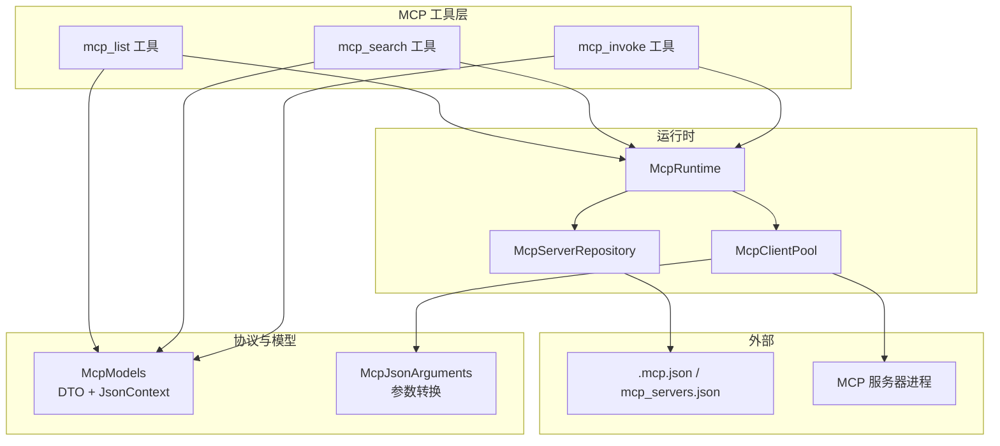
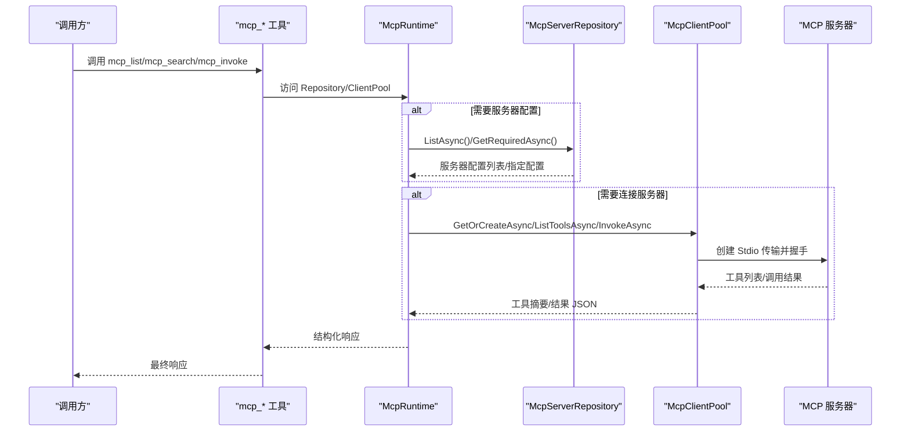
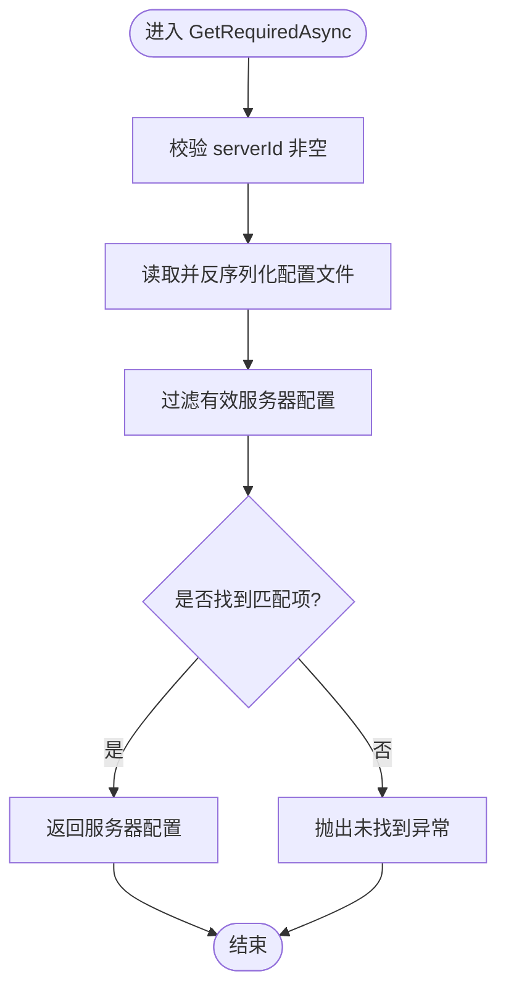
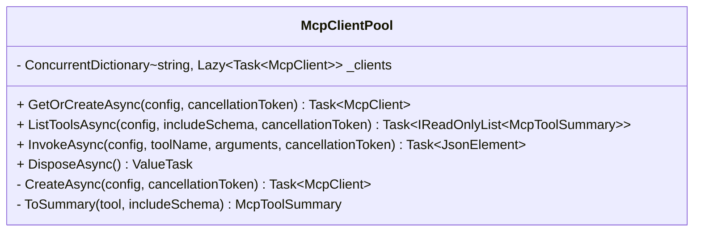
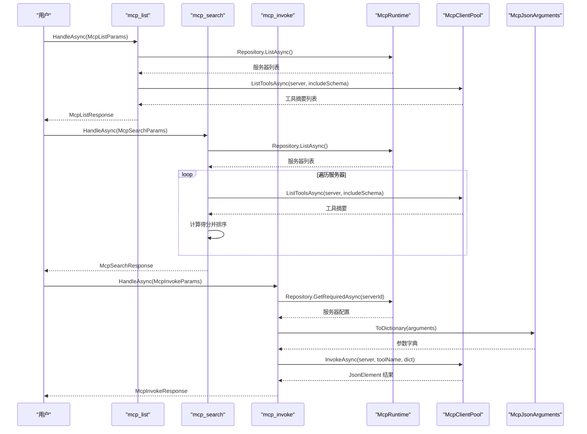
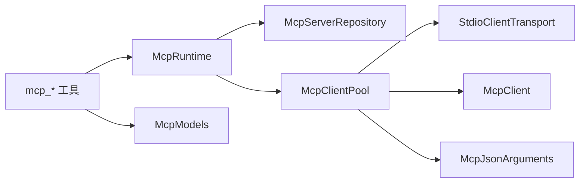

# MCP 集成工具

<cite>
**本文引用的文件**   
- [McpClientPool.cs](file://TinadecTools/Tools/Mcp/McpClientPool.cs)
- [McpRuntime.cs](file://TinadecTools/Tools/Mcp/McpRuntime.cs)
- [McpServerRepository.cs](file://TinadecTools/Tools/Mcp/McpServerRepository.cs)
- [McpInvokeTool.cs](file://TinadecTools/Tools/Mcp/McpInvokeTool.cs)
- [McpSearchTool.cs](file://TinadecTools/Tools/Mcp/McpSearchTool.cs)
- [McpListTool.cs](file://TinadecTools/Tools/Mcp/McpListTool.cs)
- [McpModels.cs](file://TinadecTools/Tools/Mcp/McpModels.cs)
- [McpJsonArguments.cs](file://TinadecTools/Tools/Mcp/McpJsonArguments.cs)
- [.mcp.json](file://.mcp.json)
- [McpPassThroughTests.cs](file://tests/TinadecTools.Tests/McpPassThroughTests.cs)
</cite>

## 目录
1. [简介](#简介)
2. [项目结构](#项目结构)
3. [核心组件](#核心组件)
4. [架构总览](#架构总览)
5. [详细组件分析](#详细组件分析)
6. [依赖关系分析](#依赖关系分析)
7. [性能考虑](#性能考虑)
8. [故障排查指南](#故障排查指南)
9. [结论](#结论)
10. [附录](#附录)

## 简介
本文件面向 Model Context Protocol（MCP）集成工具的完整实现与使用，覆盖客户端池管理、工具调用封装、搜索功能与服务器仓库管理。文档重点说明：
- 协议握手与连接生命周期（基于 Stdio 传输的 MCP 客户端创建与复用）
- 消息格式与参数转换（JSON 序列化上下文与参数字典化）
- 连接管理与错误重试策略（懒加载、失败清理、异常捕获）
- 工具发现、参数校验、结果转换与缓存策略（按服务器维度缓存客户端实例）
- MCP 服务器配置与示例（mcp_servers.json 与 .mcp.json）
- 性能优化建议（连接复用、Schema 按需加载、并发安全）

## 项目结构
MCP 相关代码集中在 TinadecTools/Tools/Mcp 目录下，提供以下关键能力：
- McpServerRepository：读取并解析 MCP 服务器配置文件，提供列表与按 ID 获取能力
- McpClientPool：基于配置的懒加载客户端池，负责创建、缓存与释放 MCP 客户端
- McpRuntime：全局运行时入口，暴露 Repository 与 ClientPool，并提供测试注入方法
- 工具封装：mcp_list、mcp_search、mcp_invoke 三个工具函数，分别用于列出工具、模糊搜索工具、调用工具
- 数据模型与 JSON 上下文：统一的请求/响应 DTO 与 SourceGeneration 上下文，提升序列化性能

图表来源
- [McpListTool.cs:1-42](file://TinadecTools/Tools/Mcp/McpListTool.cs#L1-L42)
- [McpSearchTool.cs:1-87](file://TinadecTools/Tools/Mcp/McpSearchTool.cs#L1-L87)
- [McpInvokeTool.cs:1-39](file://TinadecTools/Tools/Mcp/McpInvokeTool.cs#L1-L39)
- [McpRuntime.cs:1-19](file://TinadecTools/Tools/Mcp/McpRuntime.cs#L1-L19)
- [McpServerRepository.cs:1-53](file://TinadecTools/Tools/Mcp/McpServerRepository.cs#L1-L53)
- [McpClientPool.cs:1-89](file://TinadecTools/Tools/Mcp/McpClientPool.cs#L1-L89)
- [McpModels.cs:1-115](file://TinadecTools/Tools/Mcp/McpModels.cs#L1-L115)
- [McpJsonArguments.cs:1-37](file://TinadecTools/Tools/Mcp/McpJsonArguments.cs#L1-L37)
- [.mcp.json:1-14](file://.mcp.json#L1-L14)

章节来源
- [McpListTool.cs:1-42](file://TinadecTools/Tools/Mcp/McpListTool.cs#L1-L42)
- [McpSearchTool.cs:1-87](file://TinadecTools/Tools/Mcp/McpSearchTool.cs#L1-L87)
- [McpInvokeTool.cs:1-39](file://TinadecTools/Tools/Mcp/McpInvokeTool.cs#L1-L39)
- [McpRuntime.cs:1-19](file://TinadecTools/Tools/Mcp/McpRuntime.cs#L1-L19)
- [McpServerRepository.cs:1-53](file://TinadecTools/Tools/Mcp/McpServerRepository.cs#L1-L53)
- [McpClientPool.cs:1-89](file://TinadecTools/Tools/Mcp/McpClientPool.cs#1-L89)
- [McpModels.cs:1-115](file://TinadecTools/Tools/Mcp/McpModels.cs#L1-L115)
- [McpJsonArguments.cs:1-37](file://TinadecTools/Tools/Mcp/McpJsonArguments.cs#L1-L37)
- [.mcp.json:1-14](file://.mcp.json#L1-L14)

## 核心组件
- McpServerRepository
  - 职责：从配置文件读取服务器列表，支持环境变量覆盖路径；提供按 ID 获取必需配置的能力
  - 关键点：路径解析优先级（构造参数 > 环境变量 > 默认文件），有效性校验（id、command 非空）
- McpClientPool
  - 职责：按服务器配置懒加载并缓存 MCP 客户端；提供工具列表查询与工具调用
  - 关键点：ConcurrentDictionary + Lazy<Task<McpClient>> 保证线程安全与惰性初始化；失败时移除无效条目；DisposeAsync 优雅关闭
- McpRuntime
  - 职责：对外暴露 Repository 与 ClientPool；提供测试注入方法以替换默认实例
- 工具封装
  - mcp_list：遍历已配置服务器，尝试连接并拉取工具清单，返回状态与工具摘要
  - mcp_search：对工具名与描述进行加权评分排序，返回 Top-N 匹配结果
  - mcp_invoke：根据 server_id 与 tool_name 调用远程工具，返回原始 JSON 结果或错误信息
- 数据模型与序列化
  - McpModels：定义所有 DTO 与多个 JsonSourceGenerationContext，减少反射开销
  - McpJsonArguments：将 JsonElement 转换为字典，严格校验对象类型并处理嵌套结构

章节来源
- [McpServerRepository.cs:1-53](file://TinadecTools/Tools/Mcp/McpServerRepository.cs#L1-L53)
- [McpClientPool.cs:1-89](file://TinadecTools/Tools/Mcp/McpClientPool.cs#L1-L89)
- [McpRuntime.cs:1-19](file://TinadecTools/Tools/Mcp/McpRuntime.cs#L1-L19)
- [McpListTool.cs:1-42](file://TinadecTools/Tools/Mcp/McpListTool.cs#L1-L42)
- [McpSearchTool.cs:1-87](file://TinadecTools/Tools/Mcp/McpSearchTool.cs#L1-L87)
- [McpInvokeTool.cs:1-39](file://TinadecTools/Tools/Mcp/McpInvokeTool.cs#L1-L39)
- [McpModels.cs:1-115](file://TinadecTools/Tools/Mcp/McpModels.cs#L1-L115)
- [McpJsonArguments.cs:1-37](file://TinadecTools/Tools/Mcp/McpJsonArguments.cs#L1-L37)

## 架构总览
下图展示了 MCP 工具层的调用链路与组件交互：

图表来源
- [McpListTool.cs:1-42](file://TinadecTools/Tools/Mcp/McpListTool.cs#L1-L42)
- [McpSearchTool.cs:1-87](file://TinadecTools/Tools/Mcp/McpSearchTool.cs#L1-L87)
- [McpInvokeTool.cs:1-39](file://TinadecTools/Tools/Mcp/McpInvokeTool.cs#L1-L39)
- [McpRuntime.cs:1-19](file://TinadecTools/Tools/Mcp/McpRuntime.cs#L1-L19)
- [McpServerRepository.cs:1-53](file://TinadecTools/Tools/Mcp/McpServerRepository.cs#L1-L53)
- [McpClientPool.cs:1-89](file://TinadecTools/Tools/Mcp/McpClientPool.cs#L1-L89)

## 详细组件分析

### McpServerRepository：服务器仓库管理
- 配置路径解析
  - 优先使用构造参数传入的路径
  - 其次读取环境变量 TINADEC_TOOLS_MCP_CONFIG
  - 最后回退到当前目录下的 mcp_servers.json
- 配置读取与过滤
  - 异步反序列化为 McpServersFile
  - 仅保留 id 与 command 非空的服务器配置
- 按 ID 获取
  - 忽略大小写匹配，未找到则抛出异常

图表来源
- [McpServerRepository.cs:1-53](file://TinadecTools/Tools/Mcp/McpServerRepository.cs#L1-L53)

章节来源
- [McpServerRepository.cs:1-53](file://TinadecTools/Tools/Mcp/McpServerRepository.cs#L1-L53)

### McpClientPool：客户端池与连接管理
- 懒加载与缓存
  - 使用 ConcurrentDictionary<string, Lazy<Task<McpClient>>> 存储客户端任务
  - 首次访问时创建并缓存，后续直接复用
- 创建与握手
  - 通过 StdioClientTransport 启动子进程并建立 MCP 连接
  - 支持 Name、Command、Args、Cwd、InheritEnvironmentVariables、EnvironmentVariables
- 工具列表与调用
  - ListToolsAsync：可选 includeSchema，返回工具摘要
  - InvokeAsync：参数字典化后调用 CallToolAsync，返回标准化 JSON 元素
- 失败清理与资源释放
  - 创建失败时从字典移除对应条目，避免脏缓存
  - DisposeAsync 遍历并释放已创建的客户端

图表来源
- [McpClientPool.cs:1-89](file://TinadecTools/Tools/Mcp/McpClientPool.cs#L1-L89)

章节来源
- [McpClientPool.cs:1-89](file://TinadecTools/Tools/Mcp/McpClientPool.cs#L1-L89)

### McpRuntime：运行时入口
- 暴露 Repository 与 ClientPool 静态属性
- 提供 ConfigureForTests 以便单元测试替换实例
- 提供 DisposeAsync 统一释放资源

章节来源
- [McpRuntime.cs:1-19](file://TinadecTools/Tools/Mcp/McpRuntime.cs#L1-L19)

### 工具封装：mcp_list、mcp_search、mcp_invoke
- mcp_list
  - 遍历服务器配置，逐个尝试连接并拉取工具列表
  - 记录连接状态与错误信息
- mcp_search
  - 对查询词进行分词，计算工具名与描述的加权得分
  - 支持 limit 限制返回数量，支持 includeSchema 控制是否包含输入 Schema
- mcp_invoke
  - 校验工具名非空，参数必须为 JSON 对象
  - 调用成功后返回原始 JSON 结果，失败返回错误消息

图表来源
- [McpListTool.cs:1-42](file://TinadecTools/Tools/Mcp/McpListTool.cs#L1-L42)
- [McpSearchTool.cs:1-87](file://TinadecTools/Tools/Mcp/McpSearchTool.cs#L1-L87)
- [McpInvokeTool.cs:1-39](file://TinadecTools/Tools/Mcp/McpInvokeTool.cs#L1-L39)
- [McpRuntime.cs:1-19](file://TinadecTools/Tools/Mcp/McpRuntime.cs#L1-L19)
- [McpClientPool.cs:1-89](file://TinadecTools/Tools/Mcp/McpClientPool.cs#L1-L89)
- [McpJsonArguments.cs:1-37](file://TinadecTools/Tools/Mcp/McpJsonArguments.cs#L1-L37)

章节来源
- [McpListTool.cs:1-42](file://TinadecTools/Tools/Mcp/McpListTool.cs#L1-L42)
- [McpSearchTool.cs:1-87](file://TinadecTools/Tools/Mcp/McpSearchTool.cs#L1-L87)
- [McpInvokeTool.cs:1-39](file://TinadecTools/Tools/Mcp/McpInvokeTool.cs#L1-L39)

### 数据模型与参数转换
- McpModels
  - 定义服务器配置、工具摘要、列表/搜索/调用请求与响应等 DTO
  - 使用多个 JsonSourceGenerationContext 提升序列化性能
- McpJsonArguments
  - 将 JsonElement 转换为 Dictionary<string, object?>
  - 严格校验参数必须为对象，递归处理数组与嵌套对象

章节来源
- [McpModels.cs:1-115](file://TinadecTools/Tools/Mcp/McpModels.cs#L1-L115)
- [McpJsonArguments.cs:1-37](file://TinadecTools/Tools/Mcp/McpJsonArguments.cs#L1-L37)

### 配置与示例
- .mcp.json
  - 示例展示两种传输方式：SSE 与 Stdio（命令+参数+CWD）
  - 注意：仓库内示例使用 SSE URL，但客户端实现基于 Stdio 传输，需确保实际部署时使用命令模式
- mcp_servers.json（默认路径）
  - 由 McpServerRepository 默认读取，可通过环境变量覆盖
  - 结构参考 McpServersFile/Servers

章节来源
- [.mcp.json:1-14](file://.mcp.json#L1-L14)
- [McpServerRepository.cs:1-53](file://TinadecTools/Tools/Mcp/McpServerRepository.cs#L1-L53)

### 测试与验证
- McpPassThroughTests
  - 动态生成临时配置文件，注入 McpRuntime 进行测试
  - 验证 mcp_list 返回连接状态与工具摘要
  - 验证 mcp_search 模糊匹配工具名与描述
  - 验证 mcp_invoke 调用工具并返回原始 JSON 结果

章节来源
- [McpPassThroughTests.cs:1-87](file://tests/TinadecTools.Tests/McpPassThroughTests.cs#L1-L87)

## 依赖关系分析
- 组件耦合
  - 工具层依赖 McpRuntime，间接依赖 Repository 与 ClientPool
  - ClientPool 依赖 McpServerConfig 与底层 MCP 客户端库
  - 参数转换独立于业务逻辑，便于复用
- 外部依赖
  - System.Text.Json 与 SourceGeneration 上下文
  - ModelContextProtocol 客户端与传输（Stdio）
  - NLog 日志记录

图表来源
- [McpListTool.cs:1-42](file://TinadecTools/Tools/Mcp/McpListTool.cs#L1-L42)
- [McpSearchTool.cs:1-87](file://TinadecTools/Tools/Mcp/McpSearchTool.cs#L1-L87)
- [McpInvokeTool.cs:1-39](file://TinadecTools/Tools/Mcp/McpInvokeTool.cs#L1-L39)
- [McpRuntime.cs:1-19](file://TinadecTools/Tools/Mcp/McpRuntime.cs#L1-L19)
- [McpServerRepository.cs:1-53](file://TinadecTools/Tools/Mcp/McpServerRepository.cs#L1-L53)
- [McpClientPool.cs:1-89](file://TinadecTools/Tools/Mcp/McpClientPool.cs#L1-L89)
- [McpModels.cs:1-115](file://TinadecTools/Tools/Mcp/McpModels.cs#L1-L115)
- [McpJsonArguments.cs:1-37](file://TinadecTools/Tools/Mcp/McpJsonArguments.cs#L1-L37)

章节来源
- [McpListTool.cs:1-42](file://TinadecTools/Tools/Mcp/McpListTool.cs#L1-L42)
- [McpSearchTool.cs:1-87](file://TinadecTools/Tools/Mcp/McpSearchTool.cs#L1-L87)
- [McpInvokeTool.cs:1-39](file://TinadecTools/Tools/Mcp/McpInvokeTool.cs#L1-L39)
- [McpRuntime.cs:1-19](file://TinadecTools/Tools/Mcp/McpRuntime.cs#L1-L19)
- [McpServerRepository.cs:1-53](file://TinadecTools/Tools/Mcp/McpServerRepository.cs#L1-L53)
- [McpClientPool.cs:1-89](file://TinadecTools/Tools/Mcp/McpClientPool.cs#L1-L89)
- [McpModels.cs:1-115](file://TinadecTools/Tools/Mcp/McpModels.cs#L1-L115)
- [McpJsonArguments.cs:1-37](file://TinadecTools/Tools/Mcp/McpJsonArguments.cs#L1-L37)

## 性能考虑
- 连接复用
  - 客户端按服务器配置懒加载并缓存，避免重复创建与握手开销
- Schema 按需加载
  - 列表接口支持 includeSchema=false，减少不必要的数据传输
- 序列化优化
  - 使用 JsonSourceGenerationContext，减少反射与分配
- 并发安全
  - ConcurrentDictionary + Lazy<Task<T>> 保证多线程环境下的正确性与性能
- 错误快速失败
  - 创建失败立即清理缓存，避免后续请求被阻塞
- 建议
  - 合理设置 Limit 与 IncludeSchema，避免大结果集
  - 监控服务器健康状态，必要时增加超时与重试策略
  - 在高频调用场景下，考虑对搜索结果做短期缓存（例如内存缓存）

[本节为通用指导，不直接分析具体文件]

## 故障排查指南
- 常见问题
  - 服务器未找到：检查 mcp_servers.json 是否存在且包含有效配置；确认环境变量 TINADEC_TOOLS_MCP_CONFIG 是否正确
  - 连接失败：确认命令与参数正确，工作目录 CWD 存在，环境变量必要项齐全
  - 参数错误：mcp_invoke 要求 arguments 为 JSON 对象，否则抛出异常
  - 工具不存在：确认 toolName 与服务器提供的工具名称一致
- 调试建议
  - 启用 NLog 日志，查看 mcp_* 工具的警告信息
  - 使用 McpPassThroughTests 中的临时配置方式快速验证
  - 逐步缩小范围：先 mcp_list，再 mcp_search，最后 mcp_invoke

章节来源
- [McpServerRepository.cs:1-53](file://TinadecTools/Tools/Mcp/McpServerRepository.cs#L1-L53)
- [McpClientPool.cs:1-89](file://TinadecTools/Tools/Mcp/McpClientPool.cs#L1-L89)
- [McpInvokeTool.cs:1-39](file://TinadecTools/Tools/Mcp/McpInvokeTool.cs#L1-L39)
- [McpSearchTool.cs:1-87](file://TinadecTools/Tools/Mcp/McpSearchTool.cs#L1-L87)
- [McpListTool.cs:1-42](file://TinadecTools/Tools/Mcp/McpListTool.cs#L1-L42)
- [McpPassThroughTests.cs:1-87](file://tests/TinadecTools.Tests/McpPassThroughTests.cs#L1-L87)

## 结论
本 MCP 集成工具通过清晰的组件划分与严格的参数校验，实现了稳定的服务器管理、高效的客户端池与便捷的工具调用封装。结合 SourceGeneration 与懒加载策略，在保证性能的同时提供了良好的可扩展性。建议在大规模部署中引入健康检查、超时与重试机制，并结合缓存策略进一步优化响应时间。

[本节为总结，不直接分析具体文件]

## 附录
- 配置示例
  - .mcp.json：展示 SSE 与 Stdio 两种传输方式的配置样例
  - mcp_servers.json：默认配置文件路径与结构
- 测试用例
  - McpPassThroughTests：端到端验证 mcp_list、mcp_search、mcp_invoke 的行为

章节来源
- [.mcp.json:1-14](file://.mcp.json#L1-L14)
- [McpServerRepository.cs:1-53](file://TinadecTools/Tools/Mcp/McpServerRepository.cs#L1-L53)
- [McpPassThroughTests.cs:1-87](file://tests/TinadecTools.Tests/McpPassThroughTests.cs#L1-L87)