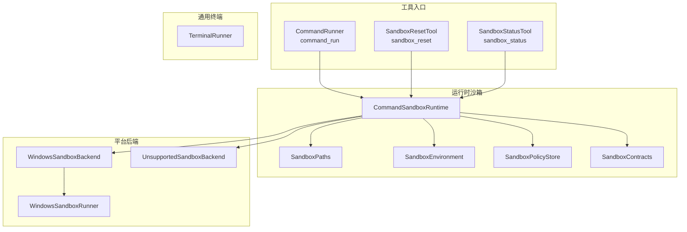
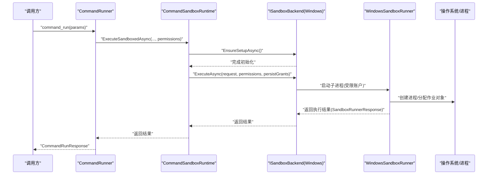
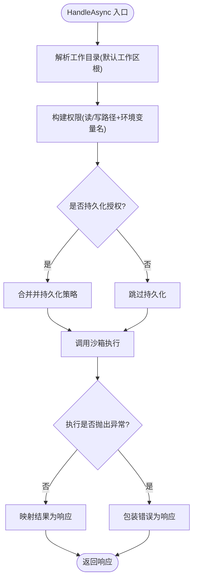
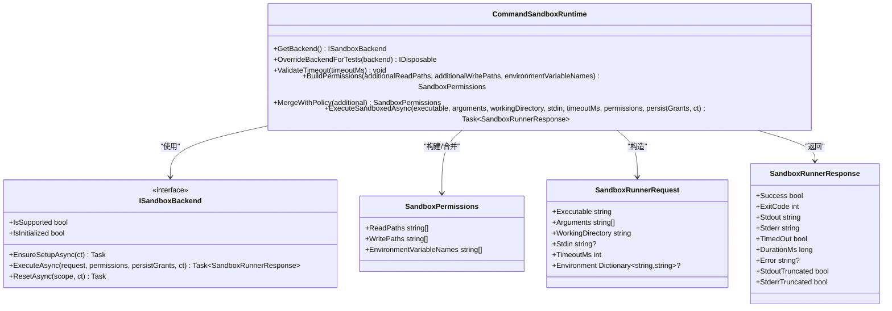
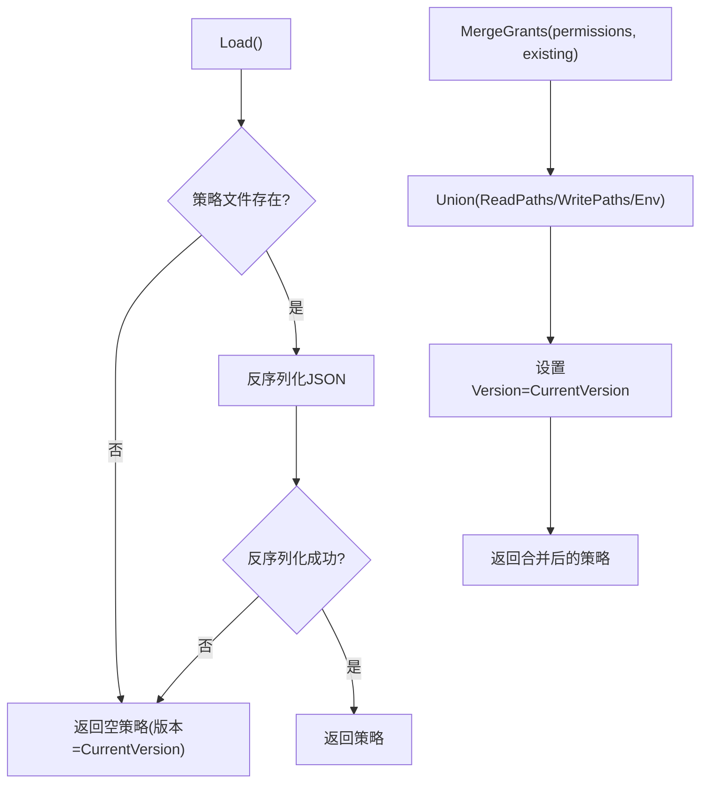
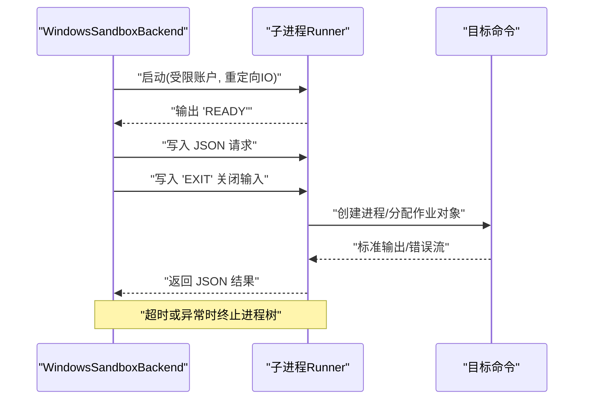
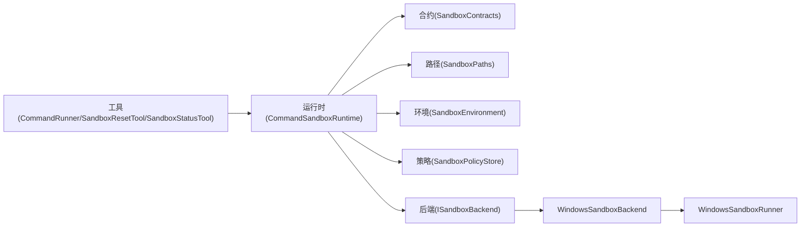

# 命令执行工具

<cite>
**本文引用的文件**   
- [CommandRunner.cs](file://TinadecTools/Tools/Command/CommandRunner.cs)
- [SandboxResetTool.cs](file://TinadecTools/Tools/Command/SandboxResetTool.cs)
- [SandboxStatusTool.cs](file://TinadecTools/Tools/Command/SandboxStatusTool.cs)
- [CommandSandboxRuntime.cs](file://TinadecTools/Runtime/Sandbox/CommandSandboxRuntime.cs)
- [TerminalRunner.cs](file://TinadecTools/Runtime/TerminalRunner.cs)
- [SandboxContracts.cs](file://TinadecTools/Runtime/Sandbox/SandboxContracts.cs)
- [SandboxEnvironment.cs](file://TinadecTools/Runtime/Sandbox/SandboxEnvironment.cs)
- [SandboxPaths.cs](file://TinadecTools/Runtime/Sandbox/SandboxPaths.cs)
- [SandboxPolicyStore.cs](file://TinadecTools/Runtime/Sandbox/SandboxPolicyStore.cs)
- [UnsupportedSandboxBackend.cs](file://TinadecTools/Runtime/Sandbox/UnsupportedSandboxBackend.cs)
- [WindowsSandboxBackend.cs](file://TinadecTools/Runtime/Sandbox/Windows/WindowsSandboxBackend.cs)
- [WindowsSandboxRunner.cs](file://TinadecTools/Runtime/Sandbox/Windows/WindowsSandboxRunner.cs)
- [ToolFunctionAttribute.cs](file://TinadecTools/Abstractions/ToolFunctionAttribute.cs)
- [CommandRunnerTests.cs](file://tests/TinadecTools.Tests/CommandRunnerTests.cs)
- [SandboxRuntimeTests.cs](file://tests/TinadecTools.Tests/SandboxRuntimeTests.cs)
</cite>

## 目录
1. [简介](#简介)
2. [项目结构](#项目结构)
3. [核心组件](#核心组件)
4. [架构总览](#架构总览)
5. [详细组件分析](#详细组件分析)
6. [依赖关系分析](#依赖关系分析)
7. [性能考量](#性能考量)
8. [故障排查指南](#故障排查指南)
9. [结论](#结论)
10. [附录](#附录)

## 简介
本文件面向“命令执行工具”的完整实现与使用，覆盖以下能力：
- 命令运行器：在沙箱中安全执行外部命令，支持参数传递、标准输入输出捕获、超时控制与错误处理。
- 沙箱重置：按工作区或机器范围清理策略与隔离环境。
- 状态检查：查询当前平台是否支持沙箱、是否已初始化、策略是否配置。
- 权限与策略：基于最小权限原则，限制读/写路径与环境变量白名单，持久化授权策略。
- 进程监控与资源清理：通过作业对象与进程树管理，确保超时与异常时彻底回收资源。

该工具以 Windows 为主要目标平台，提供后端抽象，便于扩展到其他系统。

## 项目结构
命令执行相关代码集中在 TinadecTools 模块内，分为“工具入口”、“运行时沙箱”、“平台后端”和“通用终端执行器”等层次：
- 工具入口：暴露 command_run、sandbox_reset、sandbox_status 三个工具函数。
- 运行时沙箱：封装权限构建、策略合并、超时校验、工作目录校验、后端选择与调用。
- 平台后端：Windows 专用后端（账户、ACL、子进程 Runner）与不支持平台的占位实现。
- 通用终端执行器：非沙箱场景下的轻量进程执行与输出捕获。

**图表来源** 
- [CommandRunner.cs:79-133](file://TinadecTools/Tools/Command/CommandRunner.cs#L79-L133)
- [SandboxResetTool.cs:30-52](file://TinadecTools/Tools/Command/SandboxResetTool.cs#L30-L52)
- [SandboxStatusTool.cs:26-45](file://TinadecTools/Tools/Command/SandboxStatusTool.cs#L26-L45)
- [CommandSandboxRuntime.cs:5-129](file://TinadecTools/Runtime/Sandbox/CommandSandboxRuntime.cs#L5-L129)
- [SandboxPaths.cs:8-113](file://TinadecTools/Runtime/Sandbox/SandboxPaths.cs#L8-L113)
- [SandboxEnvironment.cs:5-69](file://TinadecTools/Runtime/Sandbox/SandboxEnvironment.cs#L5-L69)
- [SandboxPolicyStore.cs:6-83](file://TinadecTools/Runtime/Sandbox/SandboxPolicyStore.cs#L6-L83)
- [SandboxContracts.cs:8-71](file://TinadecTools/Runtime/Sandbox/SandboxContracts.cs#L8-L71)
- [WindowsSandboxBackend.cs:8-161](file://TinadecTools/Runtime/Sandbox/Windows/WindowsSandboxBackend.cs#L8-L161)
- [WindowsSandboxRunner.cs:7-178](file://TinadecTools/Runtime/Sandbox/Windows/WindowsSandboxRunner.cs#L7-L178)
- [UnsupportedSandboxBackend.cs:1-19](file://TinadecTools/Runtime/Sandbox/UnsupportedSandboxBackend.cs#L1-L19)
- [TerminalRunner.cs:16-149](file://TinadecTools/Runtime/TerminalRunner.cs#L16-L149)

**章节来源**
- [CommandRunner.cs:79-133](file://TinadecTools/Tools/Command/CommandRunner.cs#L79-L133)
- [SandboxResetTool.cs:30-52](file://TinadecTools/Tools/Command/SandboxResetTool.cs#L30-L52)
- [SandboxStatusTool.cs:26-45](file://TinadecTools/Tools/Command/SandboxStatusTool.cs#L26-L45)
- [CommandSandboxRuntime.cs:5-129](file://TinadecTools/Runtime/Sandbox/CommandSandboxRuntime.cs#L5-L129)

## 核心组件
- 命令运行器 CommandRunner：定义请求/响应模型，组装权限，可选持久化授权，调用沙箱执行并返回结果。
- 沙箱运行时 CommandSandboxRuntime：统一超时校验、工作目录校验、权限构建与合并、后端选择与执行。
- 策略存储 SandboxPolicyStore：加载/保存/合并策略文件，去重与规范化路径。
- 环境变量构建 SandboxEnvironment：保留必要宿主环境变量，注入缓存与用户目录，过滤非法名称。
- 路径约束 SandboxPaths：工作目录与工作区边界校验，禁止宽泛写入目标，派生能力 SID。
- 平台后端 ISandboxBackend：Windows 具体实现与不支持平台占位实现。
- 子进程 Runner WindowsSandboxRunner：在受限账户下执行命令，限制输出大小，作业对象管理进程组。
- 通用终端执行器 TerminalRunner：非沙箱场景下的轻量进程执行与输出捕获。

**章节来源**
- [CommandRunner.cs:10-76](file://TinadecTools/Tools/Command/CommandRunner.cs#L10-L76)
- [CommandSandboxRuntime.cs:29-122](file://TinadecTools/Runtime/Sandbox/CommandSandboxRuntime.cs#L29-L122)
- [SandboxPolicyStore.cs:18-83](file://TinadecTools/Runtime/Sandbox/SandboxPolicyStore.cs#L18-L83)
- [SandboxEnvironment.cs:16-69](file://TinadecTools/Runtime/Sandbox/SandboxEnvironment.cs#L16-L69)
- [SandboxPaths.cs:18-113](file://TinadecTools/Runtime/Sandbox/SandboxPaths.cs#L18-L113)
- [SandboxContracts.cs:52-71](file://TinadecTools/Runtime/Sandbox/SandboxContracts.cs#L52-L71)
- [WindowsSandboxBackend.cs:23-161](file://TinadecTools/Runtime/Sandbox/Windows/WindowsSandboxBackend.cs#L23-L161)
- [WindowsSandboxRunner.cs:50-178](file://TinadecTools/Runtime/Sandbox/Windows/WindowsSandboxRunner.cs#L50-L178)
- [TerminalRunner.cs:18-149](file://TinadecTools/Runtime/TerminalRunner.cs#L18-L149)

## 架构总览
命令执行从工具入口进入，经运行时沙箱进行参数校验、权限构建与策略合并，再交由平台后端执行。Windows 后端通过子进程 Runner 在受限账户中运行命令，并使用作业对象管理进程生命周期。

**图表来源** 
- [CommandRunner.cs:82-133](file://TinadecTools/Tools/Command/CommandRunner.cs#L82-L133)
- [CommandSandboxRuntime.cs:96-122](file://TinadecTools/Runtime/Sandbox/CommandSandboxRuntime.cs#L96-L122)
- [WindowsSandboxBackend.cs:23-161](file://TinadecTools/Runtime/Sandbox/Windows/WindowsSandboxBackend.cs#L23-L161)
- [WindowsSandboxRunner.cs:14-178](file://TinadecTools/Runtime/Sandbox/Windows/WindowsSandboxRunner.cs#L14-L178)

## 详细组件分析

### 命令运行器 CommandRunner
- 功能要点
  - 接收可执行文件、参数、工作目录、标准输入、超时、额外读写路径与环境变量名。
  - 构建权限集合并与策略合并；可选择将授权持久化到策略文件。
  - 调用沙箱运行时执行，捕获成功/失败、退出码、输出、截断标志、耗时与错误信息。
- 关键行为
  - 默认工作目录为工作区根。
  - 超时校验由运行时负责，非法值直接返回错误且不执行。
  - 异常被捕获并包装为 SandboxError 字段返回。

**图表来源** 
- [CommandRunner.cs:82-133](file://TinadecTools/Tools/Command/CommandRunner.cs#L82-L133)

**章节来源**
- [CommandRunner.cs:10-76](file://TinadecTools/Tools/Command/CommandRunner.cs#L10-L76)
- [CommandRunner.cs:79-133](file://TinadecTools/Tools/Command/CommandRunner.cs#L79-L133)

### 沙箱运行时 CommandSandboxRuntime
- 功能要点
  - 后端选择：Windows 优先，否则回退到不支持后端。
  - 超时校验：范围 1..1_800_000 ms。
  - 权限构建：自动包含工作区读写，规范化路径，过滤非法环境变量名。
  - 策略合并：与策略文件合并去重，区分大小写按平台决定。
  - 执行流程：验证工作目录、确保后端初始化、构造请求、调用后端执行。

**图表来源** 
- [CommandSandboxRuntime.cs:5-129](file://TinadecTools/Runtime/Sandbox/CommandSandboxRuntime.cs#L5-L129)
- [SandboxContracts.cs:10-71](file://TinadecTools/Runtime/Sandbox/SandboxContracts.cs#L10-L71)

**章节来源**
- [CommandSandboxRuntime.cs:29-122](file://TinadecTools/Runtime/Sandbox/CommandSandboxRuntime.cs#L29-L122)

### 策略存储与路径约束
- 策略存储
  - 读取 .tinadec/sandbox.json，不存在则返回空策略。
  - 合并授权时去重、规范化路径、排序，版本保持最新。
  - 支持删除策略文件。
- 路径约束
  - 工作目录必须位于工作区内且存在。
  - 禁止对磁盘根与敏感系统目录授予宽泛写权限。
  - 计算能力 SID 用于 Windows 访问控制。

**图表来源** 
- [SandboxPolicyStore.cs:18-83](file://TinadecTools/Runtime/Sandbox/SandboxPolicyStore.cs#L18-L83)
- [SandboxPaths.cs:18-88](file://TinadecTools/Runtime/Sandbox/SandboxPaths.cs#L18-L88)

**章节来源**
- [SandboxPolicyStore.cs:18-83](file://TinadecTools/Runtime/Sandbox/SandboxPolicyStore.cs#L18-L83)
- [SandboxPaths.cs:18-113](file://TinadecTools/Runtime/Sandbox/SandboxPaths.cs#L18-L113)

### 环境变量构建
- 保留宿主必要环境变量（PATH、SystemRoot、代理等）。
- 根据沙箱账户目录注入用户与缓存路径（USERPROFILE、APPDATA、NPM_CONFIG_CACHE 等）。
- 仅允许白名单中的额外环境变量名，并校验名称合法性。

**章节来源**
- [SandboxEnvironment.cs:16-69](file://TinadecTools/Runtime/Sandbox/SandboxEnvironment.cs#L16-L69)

### 平台后端与子进程 Runner
- WindowsSandboxBackend
  - 确保初始化（创建账户/目录）。
  - 应用 ACL：工作区写、.tinadec 拒绝所有、按需授予只读/写外部分支。
  - 通过子进程 Runner 执行命令，等待 READY 协议后发送 JSON 请求，读取结果。
  - 支持 Reset：删除策略文件，按范围清理账户与缓存/配置文件。
- WindowsSandboxRunner
  - 以受限账户运行，清空并设置环境变量。
  - 使用作业对象管理进程组，超时取消并强制终止进程树。
  - 限制输出大小，标记截断。

**图表来源** 
- [WindowsSandboxBackend.cs:23-161](file://TinadecTools/Runtime/Sandbox/Windows/WindowsSandboxBackend.cs#L23-L161)
- [WindowsSandboxRunner.cs:50-178](file://TinadecTools/Runtime/Sandbox/Windows/WindowsSandboxRunner.cs#L50-L178)

**章节来源**
- [WindowsSandboxBackend.cs:8-161](file://TinadecTools/Runtime/Sandbox/Windows/WindowsSandboxBackend.cs#L8-L161)
- [WindowsSandboxRunner.cs:7-178](file://TinadecTools/Runtime/Sandbox/Windows/WindowsSandboxRunner.cs#L7-L178)

### 通用终端执行器（非沙箱）
- 用途：在非沙箱环境下快速执行命令，适合调试或受控场景。
- 特性：重定向 IO、标准输入、超时控制、输出限长、进程树安全终止。

**章节来源**
- [TerminalRunner.cs:18-149](file://TinadecTools/Runtime/TerminalRunner.cs#L18-L149)

### 沙箱重置与状态检查
- 沙箱重置
  - 支持 workspace 与 machine 两种范围。
  - 删除策略文件；machine 范围进一步删除账户、缓存与配置文件。
- 状态检查
  - 返回是否支持、是否已初始化、策略是否配置（读/写路径或环境变量非空）。

**章节来源**
- [SandboxResetTool.cs:30-52](file://TinadecTools/Tools/Command/SandboxResetTool.cs#L30-L52)
- [SandboxStatusTool.cs:26-45](file://TinadecTools/Tools/Command/SandboxStatusTool.cs#L26-L45)
- [WindowsSandboxBackend.cs:55-72](file://TinadecTools/Runtime/Sandbox/Windows/WindowsSandboxBackend.cs#L55-L72)

## 依赖关系分析
- 工具层依赖运行时沙箱接口，屏蔽平台差异。
- 运行时沙箱依赖路径与环境构建、策略存储与合约模型。
- Windows 后端依赖账户管理、ACL、DPAPI 与作业对象（由其他内部类提供）。
- 测试通过替换后端进行验证，保证可测性与稳定性。

**图表来源** 
- [CommandRunner.cs:79-133](file://TinadecTools/Tools/Command/CommandRunner.cs#L79-L133)
- [CommandSandboxRuntime.cs:5-129](file://TinadecTools/Runtime/Sandbox/CommandSandboxRuntime.cs#L5-L129)
- [SandboxContracts.cs:8-71](file://TinadecTools/Runtime/Sandbox/SandboxContracts.cs#L8-L71)
- [SandboxPaths.cs:8-113](file://TinadecTools/Runtime/Sandbox/SandboxPaths.cs#L8-L113)
- [SandboxEnvironment.cs:5-69](file://TinadecTools/Runtime/Sandbox/SandboxEnvironment.cs#L5-L69)
- [SandboxPolicyStore.cs:6-83](file://TinadecTools/Runtime/Sandbox/SandboxPolicyStore.cs#L6-L83)
- [WindowsSandboxBackend.cs:8-161](file://TinadecTools/Runtime/Sandbox/Windows/WindowsSandboxBackend.cs#L8-L161)
- [WindowsSandboxRunner.cs:7-178](file://TinadecTools/Runtime/Sandbox/Windows/WindowsSandboxRunner.cs#L7-L178)

**章节来源**
- [CommandRunner.cs:79-133](file://TinadecTools/Tools/Command/CommandRunner.cs#L79-L133)
- [CommandSandboxRuntime.cs:5-129](file://TinadecTools/Runtime/Sandbox/CommandSandboxRuntime.cs#L5-L129)

## 性能考量
- 输出限制：Runner 限制最大输出字符数，避免内存膨胀与阻塞。
- 超时控制：严格范围校验，超时即取消并终止进程树，减少资源泄漏。
- 策略合并：去重与排序降低后续 ACL 操作开销。
- 异步 IO：全链路异步，避免阻塞线程池。
- 建议
  - 合理设置超时，避免过长任务占用资源。
  - 谨慎添加额外读写路径，遵循最小权限原则。
  - 大输出场景关注截断标志，必要时分块处理。

[本节为通用指导，不直接分析具体文件]

## 故障排查指南
- 常见错误与定位
  - 超时错误：检查 timeout_ms 是否在合法范围，确认命令是否长时间无输出。
  - 权限不足：检查 AdditionalReadPaths/AdditionalWritePaths 是否正确，避免宽泛目标。
  - 工作目录无效：确保目录存在且位于工作区内。
  - 平台不支持：在非 Windows 平台会返回不支持后端，需切换平台或使用非沙箱执行器。
  - 策略文件损坏：策略文件反序列化失败时会回退为空策略，检查 .tinadec/sandbox.json。
- 诊断步骤
  - 使用 sandbox_status 检查 Supported/Initialized/PolicyConfigured。
  - 使用 sandbox_reset 清理策略与隔离环境后重试。
  - 查看返回值中的 SandboxError、Stderr、TimedOut、StdoutTruncated/StderrTruncated。

**章节来源**
- [CommandRunner.cs:124-133](file://TinadecTools/Tools/Command/CommandRunner.cs#L124-L133)
- [CommandSandboxRuntime.cs:29-35](file://TinadecTools/Runtime/Sandbox/CommandSandboxRuntime.cs#L29-L35)
- [SandboxPaths.cs:18-60](file://TinadecTools/Runtime/Sandbox/SandboxPaths.cs#L18-L60)
- [UnsupportedSandboxBackend.cs:1-19](file://TinadecTools/Runtime/Sandbox/UnsupportedSandboxBackend.cs#L1-L19)
- [SandboxPolicyStore.cs:18-32](file://TinadecTools/Runtime/Sandbox/SandboxPolicyStore.cs#L18-L32)

## 结论
命令执行工具通过分层设计与严格的权限控制，实现了在 Windows 平台上安全、可控的外部命令执行。其核心优势包括：
- 明确的权限边界与策略持久化机制。
- 完善的超时与输出限制，保障稳定性与资源回收。
- 可扩展的后端抽象，便于跨平台演进。
- 完整的工具集（运行、重置、状态），便于集成与运维。

[本节为总结性内容，不直接分析具体文件]

## 附录

### 命令参数与返回模型
- 命令运行参数（CommandRunParams）
  - executable：要执行的程序名或路径。
  - arguments：参数列表。
  - working_directory：工作目录（默认工作区根）。
  - stdin：标准输入文本（可选）。
  - timeout_ms：超时毫秒数（1..1_800_000，默认 30000）。
  - additional_read_paths：额外可读路径。
  - additional_write_paths：额外可写路径。
  - environment_variable_names：允许继承的环境变量名。
  - persist_grants：是否将本次授权持久化到策略文件。
- 命令运行响应（CommandRunResponse）
  - success：是否成功。
  - exit_code：退出码。
  - stdout/stderr：标准输出/错误。
  - timed_out：是否超时。
  - duration_ms：执行耗时。
  - sandbox_error：沙箱错误信息。
  - stdout_truncated/stderr_truncated：输出是否被截断。

**章节来源**
- [CommandRunner.cs:10-69](file://TinadecTools/Tools/Command/CommandRunner.cs#L10-L69)
- [SandboxContracts.cs:27-48](file://TinadecTools/Runtime/Sandbox/SandboxContracts.cs#L27-L48)

### 使用示例（基于测试）
- 基本执行：指定可执行文件与参数，传入标准输入与超时，获取输出与耗时。
- 超时校验：传入非法超时值，应返回错误且不执行。
- 输出截断：当输出超过限制时，截断标志为真。

**章节来源**
- [CommandRunnerTests.cs:10-79](file://tests/TinadecTools.Tests/CommandRunnerTests.cs#L10-L79)

### 安全配置指南
- 最小权限原则
  - 仅开放必要的只读/写路径，避免磁盘根与系统目录。
  - 仅允许必要的环境变量名，防止敏感信息泄露。
- 策略文件
  - 定期审查 .tinadec/sandbox.json，清理不再需要的授权。
  - 使用 sandbox_reset 清理策略与隔离环境。
- 超时与输出限制
  - 设置合理的超时时间，避免长时间占用。
  - 关注输出截断标志，必要时调整采集逻辑。
- 平台与初始化
  - 在非 Windows 平台无法使用沙箱，需评估替代方案。
  - 首次使用前确保后端初始化成功。

**章节来源**
- [SandboxPaths.cs:50-88](file://TinadecTools/Runtime/Sandbox/SandboxPaths.cs#L50-L88)
- [SandboxEnvironment.cs:16-69](file://TinadecTools/Runtime/Sandbox/SandboxEnvironment.cs#L16-L69)
- [SandboxPolicyStore.cs:46-69](file://TinadecTools/Runtime/Sandbox/SandboxPolicyStore.cs#L46-L69)
- [WindowsSandboxBackend.cs:74-97](file://TinadecTools/Runtime/Sandbox/Windows/WindowsSandboxBackend.cs#L74-L97)

### 工具函数元数据
- ToolFunctionAttribute：声明工具 ID 与是否需要审批。
- 命令运行与沙箱重置需要审批，状态检查无需审批。

**章节来源**
- [ToolFunctionAttribute.cs:1-15](file://TinadecTools/Abstractions/ToolFunctionAttribute.cs#L1-L15)
- [CommandRunner.cs:81-82](file://TinadecTools/Tools/Command/CommandRunner.cs#L81-L82)
- [SandboxResetTool.cs:32-33](file://TinadecTools/Tools/Command/SandboxResetTool.cs#L32-L33)
- [SandboxStatusTool.cs:28-29](file://TinadecTools/Tools/Command/SandboxStatusTool.cs#L28-L29)