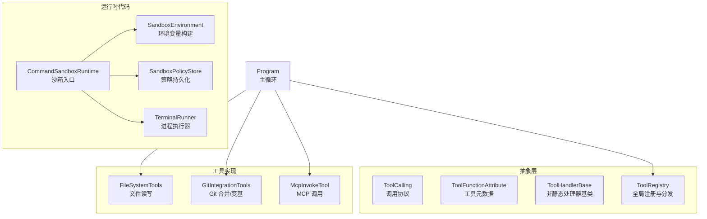
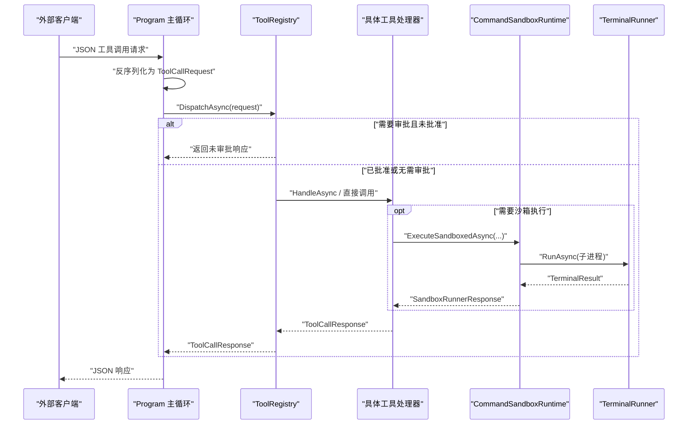
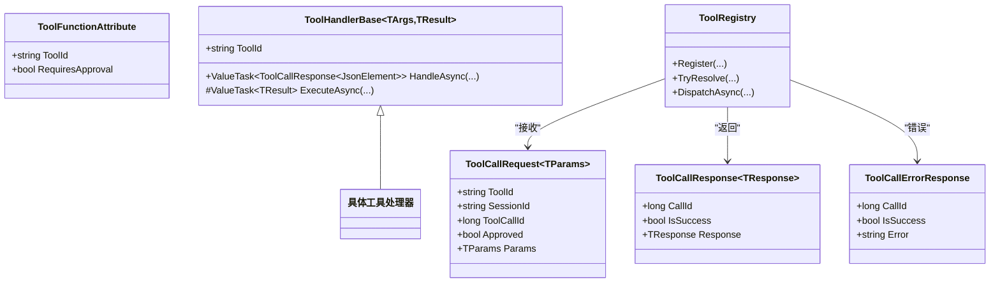
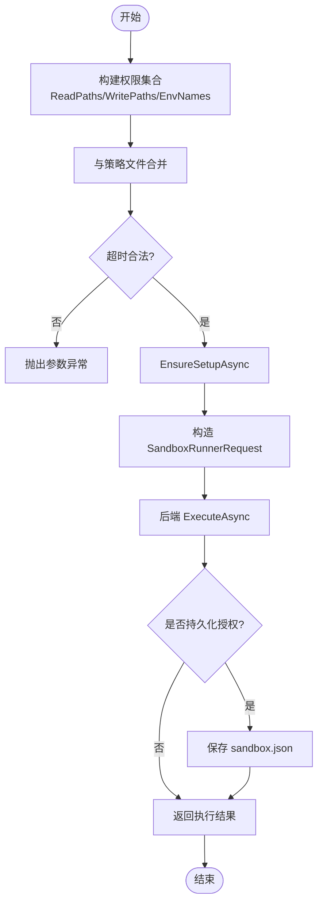
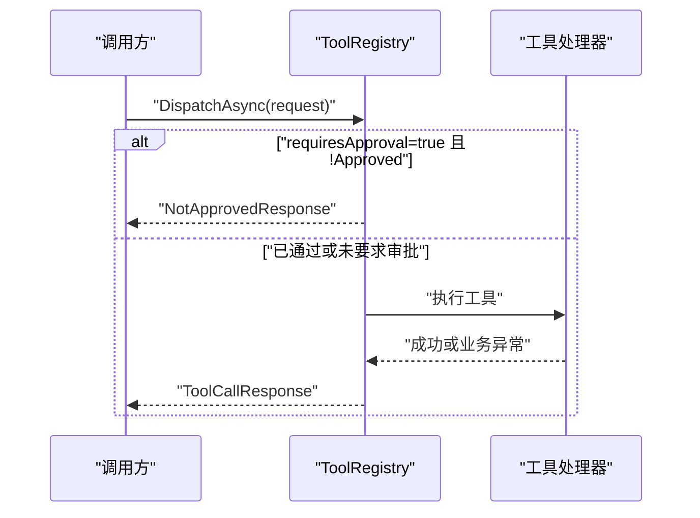
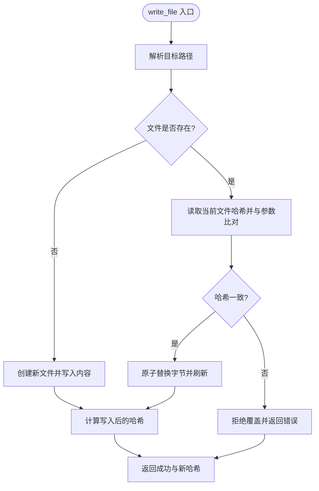
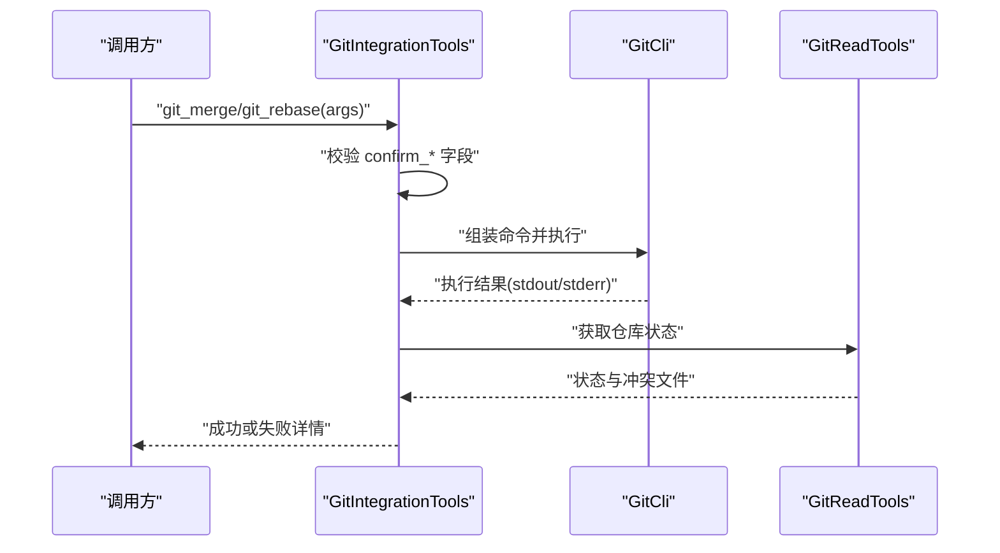
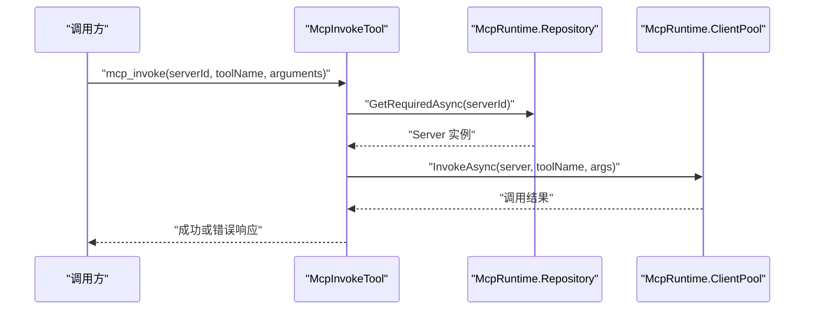

# 工具执行层

<cite>
**本文引用的文件**   
- [Program.cs](file://TinadecTools/Program.cs)
- [ToolCalling.cs](file://TinadecTools/Abstractions/ToolCalling.cs)
- [ToolFunctionAttribute.cs](file://TinadecTools/Abstractions/ToolFunctionAttribute.cs)
- [ToolHandlerBase.cs](file://TinadecTools/Abstractions/ToolHandlerBase.cs)
- [ToolRegistry.cs](file://TinadecTools/Abstractions/ToolRegistry.cs)
- [CommandSandboxRuntime.cs](file://TinadecTools/Runtime/Sandbox/CommandSandboxRuntime.cs)
- [SandboxEnvironment.cs](file://TinadecTools/Runtime/Sandbox/SandboxEnvironment.cs)
- [SandboxPolicyStore.cs](file://TinadecTools/Runtime/Sandbox/SandboxPolicyStore.cs)
- [SandboxContracts.cs](file://TinadecTools/Runtime/Sandbox/SandboxContracts.cs)
- [TerminalRunner.cs](file://TinadecTools/Runtime/TerminalRunner.cs)
- [FileSystemTools.cs](file://TinadecTools/Tools/FileRW/FileSystemTools.cs)
- [GitIntegrationTools.cs](file://TinadecTools/Tools/Git/GitIntegrationTools.cs)
- [McpInvokeTool.cs](file://TinadecTools/Tools/Mcp/McpInvokeTool.cs)
- [ToolConfirmations.cs](file://TinadecTools/Tools/ToolConfirmations.cs)
</cite>

## 目录
1. [简介](#简介)
2. [项目结构](#项目结构)
3. [核心组件](#核心组件)
4. [架构总览](#架构总览)
5. [详细组件分析](#详细组件分析)
6. [依赖关系分析](#依赖关系分析)
7. [性能考虑](#性能考虑)
8. [故障排查指南](#故障排查指南)
9. [结论](#结论)
10. [附录：自定义工具开发指南](#附录自定义工具开发指南)

## 简介
本文件面向 TinadecTools 工具执行层，系统性阐述工具抽象接口、注册机制与执行环境设计；重点说明沙箱化执行、权限控制与审批门控的安全机制；并覆盖文件操作、Git 集成、命令执行、MCP 支持等内置工具的 API 与使用要点。同时提供自定义工具开发的完整指南，涵盖工具生命周期管理、错误处理与性能监控建议。

## 项目结构
TinadecTools 采用“抽象定义 + 运行时调度 + 具体工具实现”的分层组织方式：
- Abstractions：工具调用协议、属性标记、基类与全局注册表
- Runtime：沙箱后端选择、策略存储、环境变量构建、终端进程执行器
- Tools：按能力域划分的工具集（文件读写、Git、MCP、命令等）
- Program：控制台主循环，负责 JSON 请求解析、分发与响应输出

图表来源
- [Program.cs:1-68](file://TinadecTools/Program.cs#L1-L68)
- [ToolCalling.cs:1-83](file://TinadecTools/Abstractions/ToolCalling.cs#L1-L83)
- [ToolFunctionAttribute.cs:1-15](file://TinadecTools/Abstractions/ToolFunctionAttribute.cs#L1-L15)
- [ToolHandlerBase.cs:1-43](file://TinadecTools/Abstractions/ToolHandlerBase.cs#L1-L43)
- [ToolRegistry.cs:1-86](file://TinadecTools/Abstractions/ToolRegistry.cs#L1-L86)
- [CommandSandboxRuntime.cs:1-129](file://TinadecTools/Runtime/Sandbox/CommandSandboxRuntime.cs#L1-L129)
- [SandboxEnvironment.cs:1-69](file://TinadecTools/Runtime/Sandbox/SandboxEnvironment.cs#L1-L69)
- [SandboxPolicyStore.cs:1-83](file://TinadecTools/Runtime/Sandbox/SandboxPolicyStore.cs#L1-L83)
- [TerminalRunner.cs:1-149](file://TinadecTools/Runtime/TerminalRunner.cs#L1-L149)
- [FileSystemTools.cs:1-273](file://TinadecTools/Tools/FileRW/FileSystemTools.cs#L1-L273)
- [GitIntegrationTools.cs:1-83](file://TinadecTools/Tools/Git/GitIntegrationTools.cs#L1-L83)
- [McpInvokeTool.cs:1-39](file://TinadecTools/Tools/Mcp/McpInvokeTool.cs#L1-L39)

章节来源
- [Program.cs:1-68](file://TinadecTools/Program.cs#L1-L68)

## 核心组件
- 工具调用协议
  - ToolCallRequest/Response/Error：统一序列化契约，包含 tool_id、session_id、toolcall_id、approved、params 等字段
  - NotApprovedResponse：未通过审批时的标准返回
- 工具元数据与基类
  - ToolFunctionAttribute：声明工具 ID 与是否需要审批
  - ToolHandlerBase<TArgs, TResult>：非静态工具的统一处理模板，负责参数反序列化与结果序列化
- 全局注册与分发
  - ToolRegistry：集中维护工具 ID -> 处理委托的映射，支持 requiresApproval 门控、参数校验与异常封装

章节来源
- [ToolCalling.cs:1-83](file://TinadecTools/Abstractions/ToolCalling.cs#L1-L83)
- [ToolFunctionAttribute.cs:1-15](file://TinadecTools/Abstractions/ToolFunctionAttribute.cs#L1-L15)
- [ToolHandlerBase.cs:1-43](file://TinadecTools/Abstractions/ToolHandlerBase.cs#L1-L43)
- [ToolRegistry.cs:1-86](file://TinadecTools/Abstractions/ToolRegistry.cs#L1-L86)

## 架构总览
工具执行层以“控制台主循环 + 注册表分发 + 安全沙箱 + 领域工具”为核心流程。外部通过标准输入发送 JSON 工具调用请求，程序解析后交由注册表分发给对应工具处理器；对需要审批的工具进行门控拦截；对敏感操作可通过沙箱后端隔离执行，限制文件系统与环境变量访问范围。

图表来源
- [Program.cs:1-68](file://TinadecTools/Program.cs#L1-L68)
- [ToolRegistry.cs:1-86](file://TinadecTools/Abstractions/ToolRegistry.cs#L1-L86)
- [CommandSandboxRuntime.cs:1-129](file://TinadecTools/Runtime/Sandbox/CommandSandboxRuntime.cs#L1-L129)
- [TerminalRunner.cs:1-149](file://TinadecTools/Runtime/TerminalRunner.cs#L1-L149)

## 详细组件分析

### 工具抽象与注册机制
- 工具函数标记
  - 通过 ToolFunctionAttribute 指定 toolId 与 RequiresApproval
- 非静态处理器基类
  - ToolHandlerBase 统一参数反序列化、执行与结果序列化
- 注册表
  - 支持三种注册方式：
    - 基于委托的直接注册
    - 基于基类的自动注册
    - 带类型信息的泛型注册（含 requiresApproval）
  - 分发时完成：未知工具报错、未审批拒绝、参数缺失/解析失败抛出异常

图表来源
- [ToolCalling.cs:1-83](file://TinadecTools/Abstractions/ToolCalling.cs#L1-L83)
- [ToolFunctionAttribute.cs:1-15](file://TinadecTools/Abstractions/ToolFunctionAttribute.cs#L1-L15)
- [ToolHandlerBase.cs:1-43](file://TinadecTools/Abstractions/ToolHandlerBase.cs#L1-L43)
- [ToolRegistry.cs:1-86](file://TinadecTools/Abstractions/ToolRegistry.cs#L1-L86)

章节来源
- [ToolCalling.cs:1-83](file://TinadecTools/Abstractions/ToolCalling.cs#L1-L83)
- [ToolFunctionAttribute.cs:1-15](file://TinadecTools/Abstractions/ToolFunctionAttribute.cs#L1-L15)
- [ToolHandlerBase.cs:1-43](file://TinadecTools/Abstractions/ToolHandlerBase.cs#L1-L43)
- [ToolRegistry.cs:1-86](file://TinadecTools/Abstractions/ToolRegistry.cs#L1-L86)

### 沙箱化执行与权限控制
- 后端选择
  - CommandSandboxRuntime 根据平台选择 Windows 后端或 Unsupported 后端
- 权限模型
  - SandboxPermissions：read_paths、write_paths、environment_variable_names
  - SandboxPolicyStore：加载/合并/持久化 .tinadec/sandbox.json
  - SandboxEnvironment：白名单保留系统环境变量，注入缓存路径等
- 执行流程
  - ValidateTimeout 校验超时范围
  - EnsureSetupAsync 确保后端就绪
  - ExecuteAsync 将可执行文件、参数、工作目录、stdin、超时、权限传入后端
  - 可选 persistGrants 将授权写入策略文件

图表来源
- [CommandSandboxRuntime.cs:1-129](file://TinadecTools/Runtime/Sandbox/CommandSandboxRuntime.cs#L1-L129)
- [SandboxEnvironment.cs:1-69](file://TinadecTools/Runtime/Sandbox/SandboxEnvironment.cs#L1-L69)
- [SandboxPolicyStore.cs:1-83](file://TinadecTools/Runtime/Sandbox/SandboxPolicyStore.cs#L1-L83)
- [SandboxContracts.cs:1-71](file://TinadecTools/Runtime/Sandbox/SandboxContracts.cs#L1-L71)

章节来源
- [CommandSandboxRuntime.cs:1-129](file://TinadecTools/Runtime/Sandbox/CommandSandboxRuntime.cs#L1-L129)
- [SandboxEnvironment.cs:1-69](file://TinadecTools/Runtime/Sandbox/SandboxEnvironment.cs#L1-L69)
- [SandboxPolicyStore.cs:1-83](file://TinadecTools/Runtime/Sandbox/SandboxPolicyStore.cs#L1-L83)
- [SandboxContracts.cs:1-71](file://TinadecTools/Runtime/Sandbox/SandboxContracts.cs#L1-L71)

### 审批门控与安全确认
- 工具级审批
  - ToolRegistry 在注册时支持 requiresApproval，未批准则直接返回 NotApprovedResponse
- 变更操作确认
  - ToolConfirmations.Require 强制要求携带 confirm_* 字段，否则抛出异常，用于阻止危险操作

图表来源
- [ToolRegistry.cs:1-86](file://TinadecTools/Abstractions/ToolRegistry.cs#L1-L86)
- [ToolConfirmations.cs:1-12](file://TinadecTools/Tools/ToolConfirmations.cs#L1-L12)

章节来源
- [ToolRegistry.cs:1-86](file://TinadecTools/Abstractions/ToolRegistry.cs#L1-L86)
- [ToolConfirmations.cs:1-12](file://TinadecTools/Tools/ToolConfirmations.cs#L1-L12)

### 文件操作工具（FileRW）
- 主要能力
  - ls：分页列出目录条目，支持自然排序与游标翻页
  - stat：查询文件或目录信息
  - write_file：创建新文件或覆盖旧文件（覆盖需 file_hash 一致性校验），原子替换字节并返回新 hash
- 安全与并发
  - 父目录必须存在；覆盖前计算并比对哈希；写锁保护并发写入
  - 行尾标准化为 LF，避免跨平台差异

图表来源
- [FileSystemTools.cs:1-273](file://TinadecTools/Tools/FileRW/FileSystemTools.cs#L1-L273)

章节来源
- [FileSystemTools.cs:1-273](file://TinadecTools/Tools/FileRW/FileSystemTools.cs#L1-L273)

### Git 集成工具
- 主要能力
  - git_merge/git_rebase：启动/继续/中止/跳过等操作，支持 no_ff、ff_only、squash 策略
  - 冲突检测：执行后读取状态，汇总冲突文件列表
- 安全确认
  - 需要 confirm_merge 或 confirm_rebase 字段，否则拒绝执行

图表来源
- [GitIntegrationTools.cs:1-83](file://TinadecTools/Tools/Git/GitIntegrationTools.cs#L1-L83)

章节来源
- [GitIntegrationTools.cs:1-83](file://TinadecTools/Tools/Git/GitIntegrationTools.cs#L1-L83)

### MCP 支持
- 主要能力
  - mcp_invoke：通过服务器 ID 与工具名调用远程 MCP 服务，返回结果或错误
- 资源管理
  - McpRuntime.Repository/ClientPool 负责服务端实例与连接池管理

图表来源
- [McpInvokeTool.cs:1-39](file://TinadecTools/Tools/Mcp/McpInvokeTool.cs#L1-L39)

章节来源
- [McpInvokeTool.cs:1-39](file://TinadecTools/Tools/Mcp/McpInvokeTool.cs#L1-L39)

### 命令执行（TerminalRunner）
- 功能要点
  - 启动子进程，重定向标准输入/输出/错误
  - 支持超时与取消令牌，超时安全终止进程树
  - 输出截断保护，防止大输出导致内存膨胀
- 返回值
  - TerminalResult 包含成功标志、退出码、stdout/stderr、是否截断、是否超时、耗时

章节来源
- [TerminalRunner.cs:1-149](file://TinadecTools/Runtime/TerminalRunner.cs#L1-L149)

## 依赖关系分析
- 模块内聚与耦合
  - Abstractions 层无外部依赖，仅定义协议与注册表
  - Runtime 层依赖 Abstractions 与文件系统/进程能力
  - Tools 层依赖 Abstractions 与各自领域库（如 Git、MCP）
- 关键依赖链
  - Program -> ToolRegistry -> 各工具处理器
  - 工具处理器 -> CommandSandboxRuntime -> ISandboxBackend（Windows/Unsupported）
  - CommandSandboxRuntime -> TerminalRunner（子进程执行）
  - CommandSandboxRuntime -> SandboxPolicyStore（策略持久化）

图表来源
- [Program.cs:1-68](file://TinadecTools/Program.cs#L1-L68)
- [ToolRegistry.cs:1-86](file://TinadecTools/Abstractions/ToolRegistry.cs#L1-L86)
- [CommandSandboxRuntime.cs:1-129](file://TinadecTools/Runtime/Sandbox/CommandSandboxRuntime.cs#L1-L129)
- [TerminalRunner.cs:1-149](file://TinadecTools/Runtime/TerminalRunner.cs#L1-L149)

章节来源
- [Program.cs:1-68](file://TinadecTools/Program.cs#L1-L68)
- [ToolRegistry.cs:1-86](file://TinadecTools/Abstractions/ToolRegistry.cs#L1-L86)
- [CommandSandboxRuntime.cs:1-129](file://TinadecTools/Runtime/Sandbox/CommandSandboxRuntime.cs#L1-L129)
- [TerminalRunner.cs:1-149](file://TinadecTools/Runtime/TerminalRunner.cs#L1-L149)

## 性能考虑
- 序列化优化
  - 使用 JsonSourceGenerationContext 减少反射开销，提升吞吐
- I/O 与内存
  - 文件写入采用流式写入与字节替换，避免全量拷贝
  - 终端输出限制最大字符数，防止 OOM
- 并发与锁
  - 文件写锁保证并发安全，避免竞态条件
- 超时与取消
  - 统一的超时与取消令牌传递，及时释放资源
- 沙箱策略
  - 最小权限原则，按需授予读/写路径与环境变量

[本节为通用指导，不直接分析具体文件]

## 故障排查指南
- 常见错误定位
  - 未知工具：检查 ToolRegistry 是否正确注册
  - 未审批：确认 request.Approved 与工具 RequiresApproval 设置
  - 参数缺失/解析失败：核对 ToolCallRequest.Params 结构与类型
  - 文件覆盖失败：检查 file_hash 是否与当前文件一致
  - Git 操作失败：查看 stdout/stderr 与冲突文件列表
  - MCP 调用失败：检查 serverId 与工具名是否存在
- 日志与诊断
  - Program 主循环记录调试与警告日志
  - McpInvokeTool 记录失败上下文（serverId、toolName）
- 沙箱问题
  - 检查 .tinadec/sandbox.json 权限配置
  - 验证超时与路径合法性

章节来源
- [Program.cs:1-68](file://TinadecTools/Program.cs#L1-L68)
- [ToolRegistry.cs:1-86](file://TinadecTools/Abstractions/ToolRegistry.cs#L1-L86)
- [FileSystemTools.cs:1-273](file://TinadecTools/Tools/FileRW/FileSystemTools.cs#L1-L273)
- [GitIntegrationTools.cs:1-83](file://TinadecTools/Tools/Git/GitIntegrationTools.cs#L1-L83)
- [McpInvokeTool.cs:1-39](file://TinadecTools/Tools/Mcp/McpInvokeTool.cs#L1-L39)

## 结论
TinadecTools 工具执行层通过清晰的抽象与注册机制，结合严格的审批门控与沙箱权限控制，提供了安全、可扩展、高性能的工具执行环境。内置的文件、Git、MCP 与命令执行工具覆盖了常见开发场景，同时为自定义工具扩展提供了稳定接口与最佳实践。

[本节为总结性内容，不直接分析具体文件]

## 附录：自定义工具开发指南
- 步骤概览
  - 定义参数与结果类型，标注 JsonSerializable
  - 使用 ToolFunctionAttribute 声明 toolId 与 RequiresApproval
  - 若为非静态处理器，继承 ToolHandlerBase<TArgs, TResult> 实现 ExecuteAsync
  - 在启动阶段通过 ToolRegistry.Register 注册工具（或使用生成器）
- 安全与权限
  - 对变更操作启用 RequiresApproval，并在工具内部使用 ToolConfirmations.Require 校验 confirm_* 字段
  - 如需执行外部命令，使用 CommandSandboxRuntime 进行沙箱隔离，合理设置 read/write paths 与 env
- 错误处理
  - 业务异常转换为 ToolCallResponse 的成功/失败语义
  - 参数校验失败抛出明确异常，便于上层捕获
- 性能与监控
  - 使用 JsonSourceGenerationContext 提升序列化性能
  - 对长耗时操作支持 CancellationToken，避免阻塞
  - 在关键路径记录必要日志，便于追踪

章节来源
- [ToolFunctionAttribute.cs:1-15](file://TinadecTools/Abstractions/ToolFunctionAttribute.cs#L1-L15)
- [ToolHandlerBase.cs:1-43](file://TinadecTools/Abstractions/ToolHandlerBase.cs#L1-L43)
- [ToolRegistry.cs:1-86](file://TinadecTools/Abstractions/ToolRegistry.cs#L1-L86)
- [ToolConfirmations.cs:1-12](file://TinadecTools/Tools/ToolConfirmations.cs#L1-L12)
- [CommandSandboxRuntime.cs:1-129](file://TinadecTools/Runtime/Sandbox/CommandSandboxRuntime.cs#L1-L129)