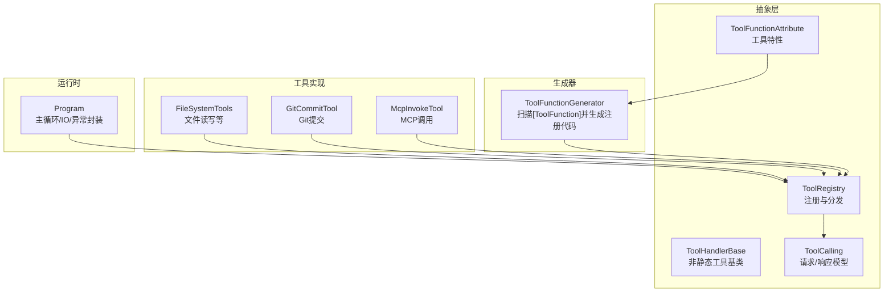
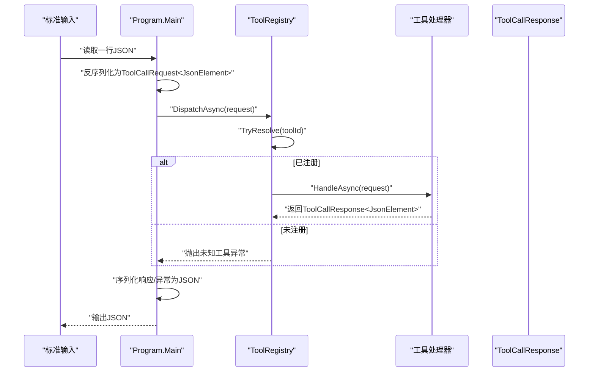
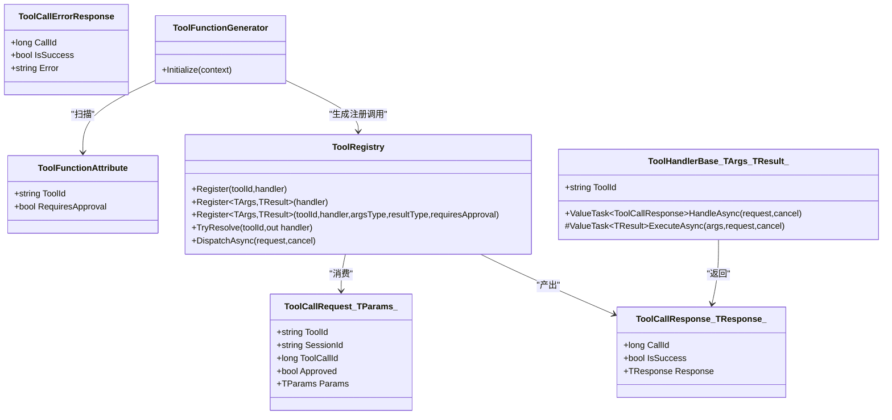

# 工具抽象层

<cite>
**本文引用的文件**   
- [ToolFunctionAttribute.cs](file://TinadecTools/Abstractions/ToolFunctionAttribute.cs)
- [ToolHandlerBase.cs](file://TinadecTools/Abstractions/ToolHandlerBase.cs)
- [ToolRegistry.cs](file://TinadecTools/Abstractions/ToolRegistry.cs)
- [ToolCalling.cs](file://TinadecTools/Abstractions/ToolCalling.cs)
- [Program.cs](file://TinadecTools/Program.cs)
- [ToolFunctionGenerator.cs](file://TinadecTools.Generators/ToolFunctionGenerator.cs)
- [FileSystemTools.cs](file://TinadecTools/Tools/FileRW/FileSystemTools.cs)
- [GitCommitTool.cs](file://TinadecTools/Tools/Git/GitCommitTool.cs)
- [McpInvokeTool.cs](file://TinadecTools/Tools/Mcp/McpInvokeTool.cs)
- [ToolConfirmations.cs](file://TinadecTools/Tools/ToolConfirmations.cs)
- [ToolRegistryApprovalTests.cs](file://tests/TinadecTools.Tests/ToolRegistryApprovalTests.cs)
</cite>

## 目录
1. [简介](#简介)
2. [项目结构](#项目结构)
3. [核心组件](#核心组件)
4. [架构总览](#架构总览)
5. [详细组件分析](#详细组件分析)
6. [依赖关系分析](#依赖关系分析)
7. [性能考量](#性能考量)
8. [故障排查指南](#故障排查指南)
9. [结论](#结论)
10. [附录](#附录)

## 简介
本文件面向“工具抽象层”，系统性阐述以下主题：
- ToolFunctionAttribute 特性定义与使用约定
- ToolHandlerBase 基类设计（非静态工具）
- ToolRegistry 注册机制与分发流程
- ToolCalling 请求/响应模型与序列化上下文
- 工具声明语法、参数类型约束、返回值处理与安全属性配置
- 自定义工具开发完整示例（同步与异步实现方式）
- 工具生命周期、错误处理与性能优化最佳实践

## 项目结构
工具抽象层位于 TinadecTools/Abstractions，配合代码生成器 TinadecTools.Generators 自动发现并注册标注了特性的方法。运行时由 Program.cs 作为控制台进程，读取 JSON 请求并通过 ToolRegistry 分发到具体工具。

图表来源 
- [ToolFunctionAttribute.cs:1-15](file://TinadecTools/Abstractions/ToolFunctionAttribute.cs#L1-L15)
- [ToolHandlerBase.cs:1-43](file://TinadecTools/Abstractions/ToolHandlerBase.cs#L1-L43)
- [ToolRegistry.cs:1-86](file://TinadecTools/Abstractions/ToolRegistry.cs#L1-L86)
- [ToolCalling.cs:1-83](file://TinadecTools/Abstractions/ToolCalling.cs#L1-L83)
- [ToolFunctionGenerator.cs:1-101](file://TinadecTools.Generators/ToolFunctionGenerator.cs#L1-L101)
- [Program.cs:1-68](file://TinadecTools/Program.cs#L1-L68)
- [FileSystemTools.cs:1-273](file://TinadecTools/Tools/FileRW/FileSystemTools.cs#L1-L273)
- [GitCommitTool.cs:1-149](file://TinadecTools/Tools/Git/GitCommitTool.cs#L1-L149)
- [McpInvokeTool.cs:1-39](file://TinadecTools/Tools/Mcp/McpInvokeTool.cs#L1-L39)

章节来源
- [Program.cs:1-68](file://TinadecTools/Program.cs#L1-L68)
- [ToolFunctionGenerator.cs:1-101](file://TinadecTools.Generators/ToolFunctionGenerator.cs#L1-L101)

## 核心组件
- ToolFunctionAttribute：用于标记工具方法，提供 toolId 与 RequiresApproval 安全开关。
- ToolHandlerBase<TArgs, TResult>：非静态工具的基类，统一参数反序列化、执行与结果序列化。
- ToolRegistry：全局注册表，支持按委托或泛型基类注册，提供 TryResolve 与 DispatchAsync 分发。
- ToolCalling：定义 ToolCallRequest/ToolCallResponse/ToolCallErrorResponse 及 JsonSourceGenerationContext。
- ToolFunctionGenerator：增量源码生成器，扫描 [ToolFunction] 方法并生成 GeneratedToolRegistry.RegisterAll()。

章节来源
- [ToolFunctionAttribute.cs:1-15](file://TinadecTools/Abstractions/ToolFunctionAttribute.cs#L1-L15)
- [ToolHandlerBase.cs:1-43](file://TinadecTools/Abstractions/ToolHandlerBase.cs#L1-L43)
- [ToolRegistry.cs:1-86](file://TinadecTools/Abstractions/ToolRegistry.cs#L1-L86)
- [ToolCalling.cs:1-83](file://TinadecTools/Abstractions/ToolCalling.cs#L1-L83)
- [ToolFunctionGenerator.cs:1-101](file://TinadecTools.Generators/ToolFunctionGenerator.cs#L1-L101)

## 架构总览
下图展示从请求输入到工具执行的端到端流程，以及安全审批与错误封装的分支。

图表来源 
- [Program.cs:22-61](file://TinadecTools/Program.cs#L22-L61)
- [ToolRegistry.cs:71-84](file://TinadecTools/Abstractions/ToolRegistry.cs#L71-L84)
- [ToolCalling.cs:9-50](file://TinadecTools/Abstractions/ToolCalling.cs#L9-L50)

章节来源
- [Program.cs:1-68](file://TinadecTools/Program.cs#L1-L68)
- [ToolRegistry.cs:1-86](file://TinadecTools/Abstractions/ToolRegistry.cs#L1-L86)

## 详细组件分析

### ToolFunctionAttribute 特性
- 目标：仅作用于方法，不可继承，不可重复。
- 字段：
  - ToolId：工具唯一标识。
  - RequiresApproval：是否要求审批（默认 false）。
- 用途：被生成器识别，用于生成注册代码与启用审批逻辑。

章节来源
- [ToolFunctionAttribute.cs:1-15](file://TinadecTools/Abstractions/ToolFunctionAttribute.cs#L1-L15)

### ToolHandlerBase<TArgs, TResult> 基类
- 职责：
  - 暴露 ToolId、ArgsTypeInfo、ResultTypeInfo。
  - 实现 HandleAsync：校验 Params、反序列化参数、调用 ExecuteAsync、序列化结果。
  - 统一异常路径：参数缺失或解析失败时抛出明确异常。
- 适用场景：非静态工具；静态工具可通过 Register<TArgs,TResult>(...) 直接注册。

章节来源
- [ToolHandlerBase.cs:1-43](file://TinadecTools/Abstractions/ToolHandlerBase.cs#L1-L43)

### ToolRegistry 注册与分发
- 注册方式：
  - 委托式：Register(string, ToolHandlerDelegate)
  - 基类式：Register<TArgs,TResult>(ToolHandlerBase<TArgs,TResult>)
  - 函数式：Register<TArgs,TResult>(toolId, handler, argsTypeInfo, resultTypeInfo, requiresApproval)
- 分发：
  - TryResolve：按 toolId 查找处理器。
  - DispatchAsync：若未找到则抛异常；否则调用处理器并返回响应。
- 审批控制：当 requiresApproval=true 且 request.Approved=false 时，直接返回 NotApprovedResponse。

章节来源
- [ToolRegistry.cs:1-86](file://TinadecTools/Abstractions/ToolRegistry.cs#L1-L86)

### ToolCalling 数据模型与序列化
- 请求模型 ToolCallRequest<TParams>：包含 tool_id、session_id、toolcall_id、approved、params。
- 响应模型 ToolCallResponse<TResponse>：包含 call_id、success、result。
- 错误模型 ToolCallErrorResponse：包含 call_id、success、error。
- 序列化上下文 ToolCallJsonContext：对常用类型进行源生成优化。
- 未审批响应 NotApprovedResponse.MESSAGE：固定消息文本。

章节来源
- [ToolCalling.cs:1-83](file://TinadecTools/Abstractions/ToolCalling.cs#L1-L83)

### 代码生成器：ToolFunctionGenerator
- 扫描规则：
  - 方法需标注 [ToolFunction("toolId", RequiresApproval = bool)]。
  - 方法必须为 static，参数数量为 2，第二个参数类型为 CancellationToken。
  - 返回值必须为 ValueTask<TResult>。
- 生成内容：GeneratedToolRegistry.RegisterAll()，内部调用 ToolRegistry.Register<TArgs,TResult>(...) 完成注册。
- 优势：编译期绑定、AOT 友好、减少样板代码。

章节来源
- [ToolFunctionGenerator.cs:1-101](file://TinadecTools.Generators/ToolFunctionGenerator.cs#L1-L101)

### 工具实现示例：文件系统工具
- 典型方法：ListAsync、StatAsync、WriteAsync。
- 特点：
  - 使用 [ToolFunction] 标注，部分方法设置 RequiresApproval=true。
  - 参数与返回类型通过局部 JsonSourceGenerationContext 优化序列化。
  - WriteAsync 包含并发写锁、哈希校验、行尾标准化等健壮性处理。

章节来源
- [FileSystemTools.cs:1-273](file://TinadecTools/Tools/FileRW/FileSystemTools.cs#L1-L273)

### 工具实现示例：Git 提交工具
- 方法：CommitAsync。
- 特点：
  - 需要确认字段（confirm_commit），缺失即抛异常。
  - 严格模式选择（include_all / commit_staged_only / paths 三选一）。
  - 通过 GitCli 执行命令并收集状态与输出。

章节来源
- [GitCommitTool.cs:1-149](file://TinadecTools/Tools/Git/GitCommitTool.cs#L1-L149)
- [ToolConfirmations.cs:1-12](file://TinadecTools/Tools/ToolConfirmations.cs#L1-L12)

### 工具实现示例：MCP 调用工具
- 方法：HandleAsync。
- 特点：
  - 根据 serverId 获取服务器实例，通过客户端池调用指定工具。
  - 捕获异常并返回结构化失败响应。

章节来源
- [McpInvokeTool.cs:1-39](file://TinadecTools/Tools/Mcp/McpInvokeTool.cs#L1-L39)

### 审批与安全策略
- 在注册时通过 requiresApproval 控制是否需要 Approved=true。
- 测试覆盖：
  - 未审批的变更工具被拒绝，返回 NotApprovedResponse.MESSAGE。
  - 只读工具允许未审批调用。

章节来源
- [ToolRegistryApprovalTests.cs:1-74](file://tests/TinadecTools.Tests/ToolRegistryApprovalTests.cs#L1-L74)

### 自定义工具开发指南（含同步/异步）
- 推荐方式（静态方法 + 生成器）：
  - 定义参数与返回类型，并在类型上添加 JsonSerializable 特性。
  - 编写 static ValueTask<TResult> Method(TArgs args, CancellationToken ct)。
  - 使用 [ToolFunction("toolId", RequiresApproval = true/false)] 标注。
  - 构建后 GeneratedToolRegistry.RegisterAll() 会自动注册。
- 非静态工具：
  - 继承 ToolHandlerBase<TArgs, TResult>，实现 ToolId、ArgsTypeInfo、ResultTypeInfo 与 ExecuteAsync。
  - 通过 ToolRegistry.Register(handler) 注册。
- 纯函数式注册：
  - 使用 ToolRegistry.Register<TArgs,TResult>(toolId, handler, argsTypeInfo, resultTypeInfo, requiresApproval)。
- 同步实现：
  - 由于签名要求 ValueTask<TResult>，可在方法体中直接返回 ValueTask.FromResult(...)。
- 异步实现：
  - 使用 await 调用外部资源，确保传递 CancellationToken 以支持取消。

章节来源
- [ToolFunctionGenerator.cs:1-101](file://TinadecTools.Generators/ToolFunctionGenerator.cs#L1-L101)
- [ToolRegistry.cs:22-69](file://TinadecTools/Abstractions/ToolRegistry.cs#L22-L69)
- [ToolHandlerBase.cs:1-43](file://TinadecTools/Abstractions/ToolHandlerBase.cs#L1-L43)

### 工具生命周期
- 启动阶段：
  - Program 初始化工作区与日志。
  - 调用 GeneratedToolRegistry.RegisterAll() 完成所有工具注册。
- 运行阶段：
  - 循环读取标准输入 JSON 请求。
  - 反序列化后交由 ToolRegistry.DispatchAsync 分发。
  - 将响应或异常封装为标准 JSON 输出。
- 关闭阶段：
  - 释放 MCP 运行时等资源。

章节来源
- [Program.cs:1-68](file://TinadecTools/Program.cs#L1-L68)

### 错误处理
- 参数错误：
  - 参数缺失或解析失败会抛出 InvalidOperationException，最终被 Program 捕获并输出 ToolCallErrorResponse。
- 未审批：
  - requiresApproval=true 且 Approved=false 时，返回 NotApprovedResponse.MESSAGE。
- 未知工具：
  - TryResolve 失败时抛出异常，上层捕获并输出错误响应。
- 业务异常：
  - 工具内部可返回 Success=false 的结构化错误（如文件写入、Git 操作）。

章节来源
- [ToolRegistry.cs:42-68](file://TinadecTools/Abstractions/ToolRegistry.cs#L42-L68)
- [ToolCalling.cs:52-83](file://TinadecTools/Abstractions/ToolCalling.cs#L52-L83)
- [Program.cs:45-59](file://TinadecTools/Program.cs#L45-L59)

### 性能优化
- 使用 System.Text.Json 源生成上下文（JsonSerializerContext）减少反射开销。
- 避免不必要的字符串分配与拷贝，尽量复用编码与比较器。
- 长耗时操作务必支持 CancellationToken，避免阻塞。
- 对大对象返回采用流式或分页策略（如文件列表 cursor）。

章节来源
- [ToolCalling.cs:70-75](file://TinadecTools/Abstractions/ToolCalling.cs#L70-L75)
- [FileSystemTools.cs:199-218](file://TinadecTools/Tools/FileRW/FileSystemTools.cs#L199-L218)

## 依赖关系分析

图表来源 
- [ToolFunctionAttribute.cs:1-15](file://TinadecTools/Abstractions/ToolFunctionAttribute.cs#L1-L15)
- [ToolHandlerBase.cs:1-43](file://TinadecTools/Abstractions/ToolHandlerBase.cs#L1-L43)
- [ToolRegistry.cs:1-86](file://TinadecTools/Abstractions/ToolRegistry.cs#L1-L86)
- [ToolCalling.cs:1-83](file://TinadecTools/Abstractions/ToolCalling.cs#L1-L83)
- [ToolFunctionGenerator.cs:1-101](file://TinadecTools.Generators/ToolFunctionGenerator.cs#L1-L101)

章节来源
- [ToolRegistry.cs:1-86](file://TinadecTools/Abstractions/ToolRegistry.cs#L1-L86)
- [ToolCalling.cs:1-83](file://TinadecTools/Abstractions/ToolCalling.cs#L1-L83)

## 性能考量
- 序列化/反序列化：优先使用 JsonSourceGenerationContext 以减少反射与分配。
- 并发控制：文件写入使用读写锁，避免竞态条件。
- 取消传播：所有 I/O 与外部调用应接受并检查 CancellationToken。
- 分页与游标：大数据集返回采用游标分页，降低单次负载。
- 资源释放：在 finally 中释放长期资源（如 MCP 运行时）。

章节来源
- [ToolCalling.cs:70-75](file://TinadecTools/Abstractions/ToolCalling.cs#L70-L75)
- [FileSystemTools.cs:136-166](file://TinadecTools/Tools/FileRW/FileSystemTools.cs#L136-L166)
- [Program.cs:62-65](file://TinadecTools/Program.cs#L62-L65)

## 故障排查指南
- 常见错误与定位：
  - 参数解析失败：检查 params JSON 结构与类型匹配，确认 JsonSourceGenerationContext 包含所需类型。
  - 未审批被拒：确认工具是否 RequiresApproval=true，并确保请求中 Approved=true。
  - 未知工具：检查 GeneratedToolRegistry.RegisterAll() 是否被调用，工具是否正确标注 [ToolFunction]。
  - 业务失败：查看工具返回的 Success=false 与 Error 字段，定位具体原因。
- 调试建议：
  - 在 Program 中记录请求与响应的 JSON 日志。
  - 使用单元测试验证注册与分发路径（参考 ToolRegistryApprovalTests）。

章节来源
- [Program.cs:45-59](file://TinadecTools/Program.cs#L45-L59)
- [ToolRegistryApprovalTests.cs:1-74](file://tests/TinadecTools.Tests/ToolRegistryApprovalTests.cs#L1-L74)

## 结论
工具抽象层通过特性驱动与源码生成，实现了统一的工具声明、注册与分发机制。结合强类型参数/返回与 JSON 源生成，既保证了类型安全与性能，又提供了灵活的安全策略（审批）与完善的错误处理。遵循本文档的开发规范与最佳实践，可以快速、可靠地扩展新的工具能力。

## 附录
- 工具声明语法要点：
  - 方法签名：static ValueTask<TResult> Method(TArgs args, CancellationToken ct)
  - 特性：[ToolFunction("toolId", RequiresApproval = bool)]
  - 类型：参数与返回类型需具备 JsonSerializable 上下文
- 调用模式：
  - 通过 ToolRegistry.DispatchAsync 传入 ToolCallRequest<JsonElement>，获得 ToolCallResponse<JsonElement>
- 生命周期：
  - 启动注册 → 循环处理请求 → 关闭释放资源

章节来源
- [ToolFunctionGenerator.cs:1-101](file://TinadecTools.Generators/ToolFunctionGenerator.cs#L1-L101)
- [ToolRegistry.cs:1-86](file://TinadecTools/Abstractions/ToolRegistry.cs#L1-L86)
- [Program.cs:1-68](file://TinadecTools/Program.cs#L1-L68)