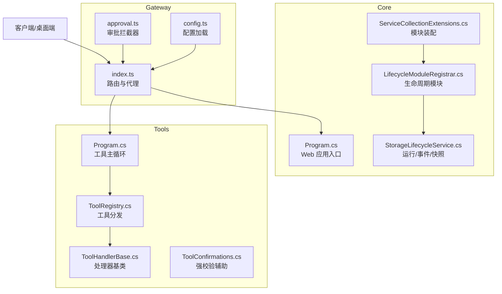
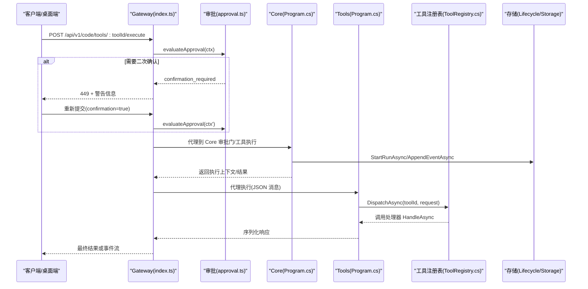
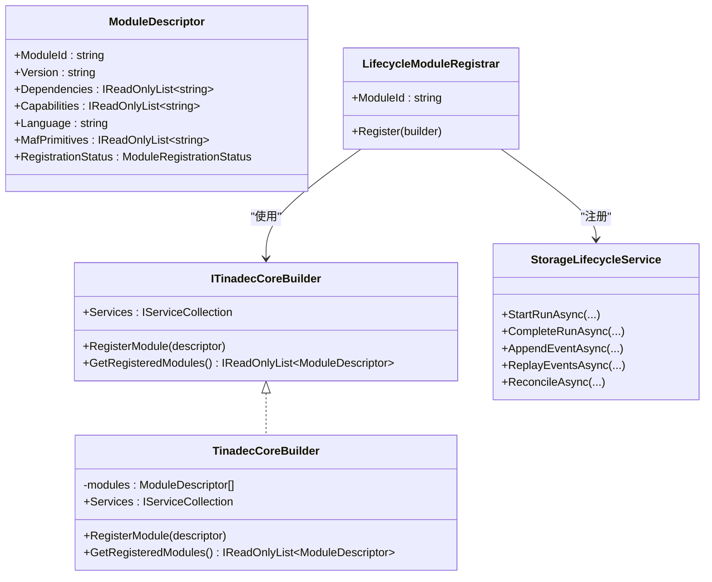
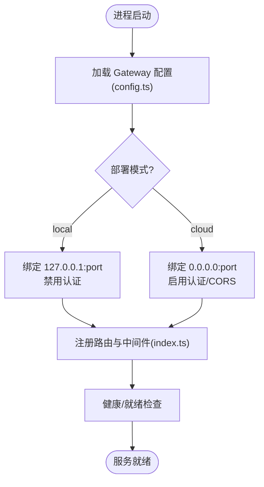
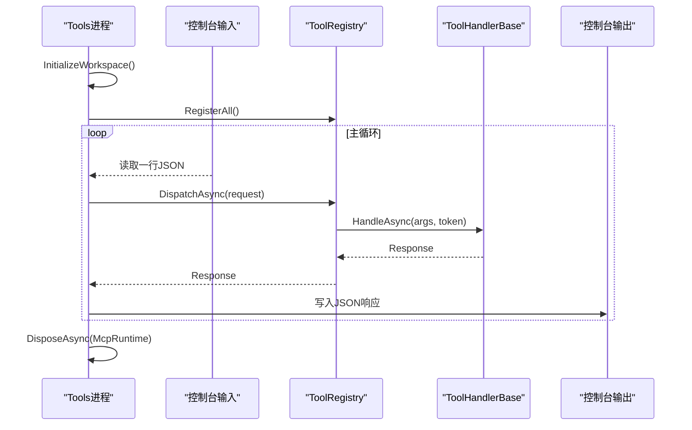
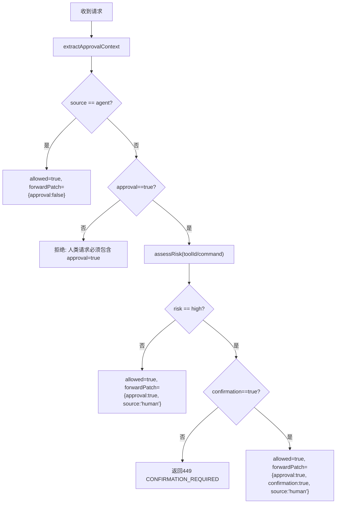
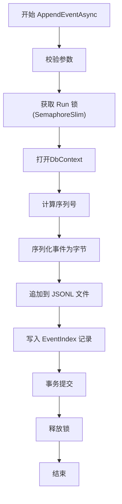
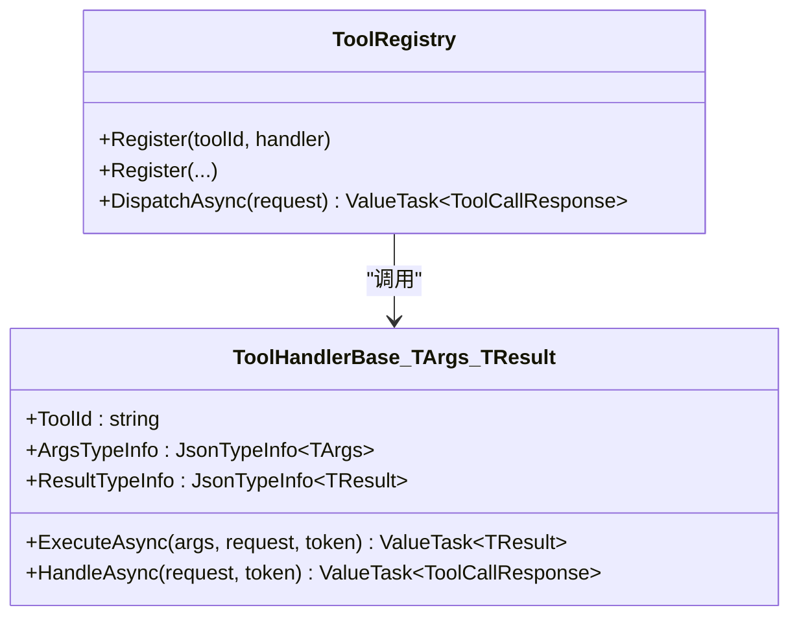
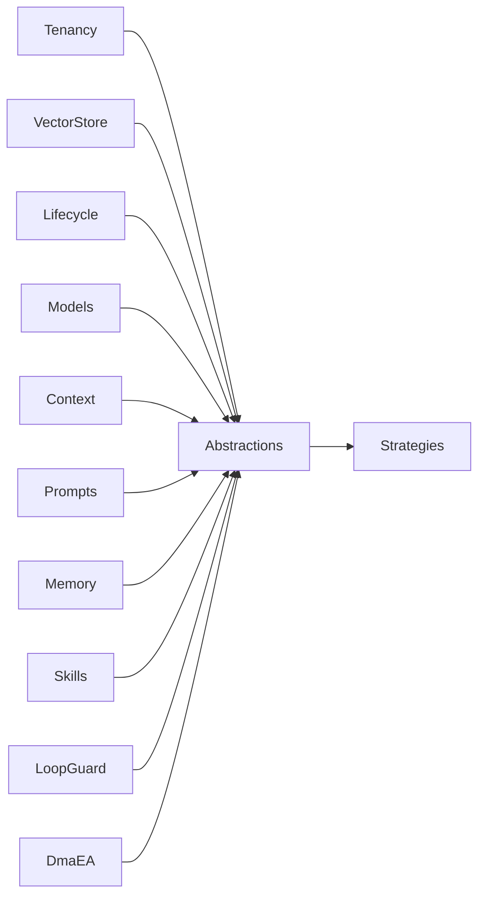

# 工具生命周期管理

<cite>
**本文引用的文件**   
- [TinadecCoreBuilder.cs](file://TinadecCore/Runtime/TinadecCoreBuilder.cs)
- [ITinadecCoreBuilder.cs](file://TinadecCore/Abstractions/ITinadecCoreBuilder.cs)
- [TinadecCoreServiceCollectionExtensions.cs](file://TinadecCore/Runtime/TinadecCoreServiceCollectionExtensions.cs)
- [LifecycleModuleRegistrar.cs](file://TinadecCore/Lifecycle/LifecycleModuleRegistrar.cs)
- [StorageLifecycleService.cs](file://TinadecCore/Lifecycle/StorageLifecycleService.cs)
- [Program.cs (Core)](file://TinadecCore/Api/Program.cs)
- [index.ts (Gateway)](file://TinadecGateway/src/index.ts)
- [approval.ts (Gateway)](file://TinadecGateway/src/approval.ts)
- [config.ts (Gateway)](file://TinadecGateway/src/config.ts)
- [Program.cs (Tools)](file://TinadecTools/Program.cs)
- [ToolRegistry.cs](file://TinadecTools/Abstractions/ToolRegistry.cs)
- [ToolHandlerBase.cs](file://TinadecTools/Abstractions/ToolHandlerBase.cs)
- [ToolConfirmations.cs](file://TinadecTools/Tools/ToolConfirmations.cs)
</cite>

## 目录
1. [简介](#简介)
2. [项目结构](#项目结构)
3. [核心组件](#核心组件)
4. [架构总览](#架构总览)
5. [详细组件分析](#详细组件分析)
6. [依赖关系分析](#依赖关系分析)
7. [性能考量](#性能考量)
8. [故障排查指南](#故障排查指南)
9. [结论](#结论)
10. [附录](#附录)

## 简介
本文件系统性阐述工具生命周期管理，覆盖以下关键主题：
- 工具启动流程与进程内主循环
- 依赖注入与模块注册机制
- 配置加载与环境模式
- 服务注册与运行期能力声明
- 审批确认系统（人类操作与 Agent 请求分流、高风险二次确认）
- 日志配置与事件持久化
- 错误处理与优雅关闭策略
- 工具间通信、事件订阅与状态同步
- 工具开发的生命周期钩子与扩展点使用示例

## 项目结构
本项目由三层组成：
- Core（C#/.NET）：提供 DI 容器装配、模块注册、生命周期与存储、健康与就绪检查等。
- Gateway（Bun/TypeScript）：薄代理层，负责鉴权、协议转换、SSE/WebSocket 转发、审批门与高风险二次确认。
- Tools（C#/.NET）：工具运行时进程，基于控制台 JSON 消息协议执行具体工具调用。

**图表来源** 
- [Program.cs (Core):1-181](file://TinadecCore/Api/Program.cs#L1-L181)
- [TinadecCoreServiceCollectionExtensions.cs:1-61](file://TinadecCore/Runtime/TinadecCoreServiceCollectionExtensions.cs#L1-L61)
- [LifecycleModuleRegistrar.cs:1-100](file://TinadecCore/Lifecycle/LifecycleModuleRegistrar.cs#L1-L100)
- [StorageLifecycleService.cs:1-291](file://TinadecCore/Lifecycle/StorageLifecycleService.cs#L1-L291)
- [index.ts (Gateway):1-800](file://TinadecGateway/src/index.ts#L1-L800)
- [approval.ts (Gateway):1-235](file://TinadecGateway/src/approval.ts#L1-L235)
- [config.ts (Gateway):1-115](file://TinadecGateway/src/config.ts#L1-L115)
- [Program.cs (Tools):1-68](file://TinadecTools/Program.cs#L1-L68)
- [ToolRegistry.cs:1-86](file://TinadecTools/Abstractions/ToolRegistry.cs#L1-L86)
- [ToolHandlerBase.cs:1-43](file://TinadecTools/Abstractions/ToolHandlerBase.cs#L1-L43)
- [ToolConfirmations.cs:1-12](file://TinadecTools/Tools/ToolConfirmations.cs#L1-L12)

**章节来源**
- [Program.cs (Core):1-181](file://TinadecCore/Api/Program.cs#L1-L181)
- [TinadecCoreServiceCollectionExtensions.cs:1-61](file://TinadecCore/Runtime/TinadecCoreServiceCollectionExtensions.cs#L1-L61)
- [LifecycleModuleRegistrar.cs:1-100](file://TinadecCore/Lifecycle/LifecycleModuleRegistrar.cs#L1-L100)
- [StorageLifecycleService.cs:1-291](file://TinadecCore/Lifecycle/StorageLifecycleService.cs#L1-L291)
- [index.ts (Gateway):1-800](file://TinadecGateway/src/index.ts#L1-L800)
- [approval.ts (Gateway):1-235](file://TinadecGateway/src/approval.ts#L1-L235)
- [config.ts (Gateway):1-115](file://TinadecGateway/src/config.ts#L1-L115)
- [Program.cs (Tools):1-68](file://TinadecTools/Program.cs#L1-L68)
- [ToolRegistry.cs:1-86](file://TinadecTools/Abstractions/ToolRegistry.cs#L1-L86)
- [ToolHandlerBase.cs:1-43](file://TinadecTools/Abstractions/ToolHandlerBase.cs#L1-L43)
- [ToolConfirmations.cs:1-12](file://TinadecTools/Tools/ToolConfirmations.cs#L1-L12)

## 核心组件
- 构建器与模块注册
  - ITinadecCoreBuilder 与 TinadecCoreBuilder：收集 ModuleDescriptor 并暴露 Services 供各模块注册。
  - ServiceCollectionExtensions：按依赖顺序注册所有 Core 模块，并提供最小化装配入口。
- 生命周期模块
  - LifecycleModuleRegistrar：注册 ILifecycleManager、StorageLifecycleService 及迁移参与者。
  - StorageLifecycleService：Run 的创建/完成、事件追加与回放、任务快照、数据一致性重放。
- 工具运行时
  - Program.cs：初始化工作区、注册生成工具、控制台主循环、异常包装与优雅关闭。
  - ToolRegistry：工具 ID 到处理器的映射、参数反序列化、结果序列化、可选审批标志校验。
  - ToolHandlerBase：非静态工具的抽象基类，统一参数解析与响应封装。
- 网关与审批
  - index.ts：统一路由、健康/就绪、SSE 流式转发、代码工具执行审批门。
  - approval.ts：人类/Agent 来源识别、风险等级评估、二次确认流程、请求体补丁合并。
  - config.ts：本地/云端模式、端口与地址、认证、CORS、超时与反向代理信任。

**章节来源**
- [ITinadecCoreBuilder.cs:1-52](file://TinadecCore/Abstractions/ITinadecCoreBuilder.cs#L1-L52)
- [TinadecCoreBuilder.cs:1-31](file://TinadecCore/Runtime/TinadecCoreBuilder.cs#L1-L31)
- [TinadecCoreServiceCollectionExtensions.cs:1-61](file://TinadecCore/Runtime/TinadecCoreServiceCollectionExtensions.cs#L1-L61)
- [LifecycleModuleRegistrar.cs:1-100](file://TinadecCore/Lifecycle/LifecycleModuleRegistrar.cs#L1-L100)
- [StorageLifecycleService.cs:1-291](file://TinadecCore/Lifecycle/StorageLifecycleService.cs#L1-L291)
- [Program.cs (Tools):1-68](file://TinadecTools/Program.cs#L1-L68)
- [ToolRegistry.cs:1-86](file://TinadecTools/Abstractions/ToolRegistry.cs#L1-L86)
- [ToolHandlerBase.cs:1-43](file://TinadecTools/Abstractions/ToolHandlerBase.cs#L1-L43)
- [index.ts (Gateway):1-800](file://TinadecGateway/src/index.ts#L1-L800)
- [approval.ts (Gateway):1-235](file://TinadecGateway/src/approval.ts#L1-L235)
- [config.ts (Gateway):1-115](file://TinadecGateway/src/config.ts#L1-L115)

## 架构总览
下图展示从客户端到 Core/Gateway/Tools 的完整调用链，以及审批门与事件落盘的关键路径。

**图表来源** 
- [index.ts (Gateway):1-800](file://TinadecGateway/src/index.ts#L1-L800)
- [approval.ts (Gateway):1-235](file://TinadecGateway/src/approval.ts#L1-L235)
- [Program.cs (Core):1-181](file://TinadecCore/Api/Program.cs#L1-L181)
- [Program.cs (Tools):1-68](file://TinadecTools/Program.cs#L1-L68)
- [ToolRegistry.cs:1-86](file://TinadecTools/Abstractions/ToolRegistry.cs#L1-L86)
- [StorageLifecycleService.cs:1-291](file://TinadecCore/Lifecycle/StorageLifecycleService.cs#L1-L291)

## 详细组件分析

### 依赖注入与模块注册
- 构建器接口与实现
  - ITinadecCoreBuilder：暴露 IServiceCollection 与模块描述符集合。
  - TinadecCoreBuilder：内部维护 ModuleDescriptor 列表，支持查询已注册模块。
- 模块装配
  - AddTinadecCore/AddTinadecCoreMinimal：按依赖顺序注册 Tenancy、VectorStore、Lifecycle、Models、Context、Prompts、Memory、Skills、LoopGuard、DmaEA 等模块。
  - 每个模块通过 IModuleRegistrar.Register(builder) 声明自身能力与依赖。
- 生命周期模块
  - LifecycleModuleRegistrar：注册 DbContextFactory、StorageLifecycleService、ILifecycleManager，并声明能力集（run_management、task_state、agent_state、tool_state、approval_state、audit_events）。

**图表来源** 
- [ITinadecCoreBuilder.cs:1-52](file://TinadecCore/Abstractions/ITinadecCoreBuilder.cs#L1-L52)
- [TinadecCoreBuilder.cs:1-31](file://TinadecCore/Runtime/TinadecCoreBuilder.cs#L1-L31)
- [LifecycleModuleRegistrar.cs:1-100](file://TinadecCore/Lifecycle/LifecycleModuleRegistrar.cs#L1-L100)
- [StorageLifecycleService.cs:1-291](file://TinadecCore/Lifecycle/StorageLifecycleService.cs#L1-L291)

**章节来源**
- [ITinadecCoreBuilder.cs:1-52](file://TinadecCore/Abstractions/ITinadecCoreBuilder.cs#L1-L52)
- [TinadecCoreBuilder.cs:1-31](file://TinadecCore/Runtime/TinadecCoreBuilder.cs#L1-L31)
- [TinadecCoreServiceCollectionExtensions.cs:1-61](file://TinadecCore/Runtime/TinadecCoreServiceCollectionExtensions.cs#L1-L61)
- [LifecycleModuleRegistrar.cs:1-100](file://TinadecCore/Lifecycle/LifecycleModuleRegistrar.cs#L1-L100)

### 配置加载与环境模式
- Gateway 配置
  - loadConfig：从环境变量读取部署模式、端口、主机名、Core/ToolRuntime URL、认证、CORS、超时与反向代理信任。
  - 本地模式默认监听 127.0.0.1，无认证；云端模式监听 0.0.0.0，支持 API Key/JWT。
- Core 配置
  - Program.cs：启用 snake_case JSON 序列化、注册持久化、运行迁移与生命周期对账。

**图表来源** 
- [config.ts (Gateway):1-115](file://TinadecGateway/src/config.ts#L1-L115)
- [index.ts (Gateway):1-800](file://TinadecGateway/src/index.ts#L1-L800)
- [Program.cs (Core):1-181](file://TinadecCore/Api/Program.cs#L1-L181)

**章节来源**
- [config.ts (Gateway):1-115](file://TinadecGateway/src/config.ts#L1-L115)
- [Program.cs (Core):1-181](file://TinadecCore/Api/Program.cs#L1-L181)

### 工具启动流程与主循环
- Tools 进程
  - 初始化工作区、注册生成工具、进入控制台主循环。
  - 逐行读取 JSON 请求，反序列化为 ToolCallRequest，调用 ToolRegistry.DispatchAsync，输出 ToolCallResponse。
  - 异常捕获后输出错误响应并记录日志。
  - finally 中释放 MCP 运行时资源，实现优雅关闭。
- 工具注册与分发
  - ToolRegistry：维护 toolId -> handler 映射，支持泛型注册与 requiresApproval 标记。
  - ToolHandlerBase：统一参数反序列化与结果序列化。

**图表来源** 
- [Program.cs (Tools):1-68](file://TinadecTools/Program.cs#L1-L68)
- [ToolRegistry.cs:1-86](file://TinadecTools/Abstractions/ToolRegistry.cs#L1-L86)
- [ToolHandlerBase.cs:1-43](file://TinadecTools/Abstractions/ToolHandlerBase.cs#L1-L43)

**章节来源**
- [Program.cs (Tools):1-68](file://TinadecTools/Program.cs#L1-L68)
- [ToolRegistry.cs:1-86](file://TinadecTools/Abstractions/ToolRegistry.cs#L1-L86)
- [ToolHandlerBase.cs:1-43](file://TinadecTools/Abstractions/ToolHandlerBase.cs#L1-L43)

### 审批确认系统
- 来源识别与风险评估
  - extractApprovalContext：从请求体提取 source、approval、confirmation、toolId、command、cwd。
  - assessRisk：根据工具 ID 与命令文本判定 low/medium/high。
- 决策规则
  - Agent 请求不拦截，交由 Core 审批门。
  - 人类低风险/中风险直接透传（附加 approval=true, source=human）。
  - 人类高风险需 confirmation=true，否则返回 449 并要求二次确认。
- 请求体补丁
  - applyForwardPatch：将审批结果合并到请求体，再转发至 Tool Runtime。

**图表来源** 
- [approval.ts (Gateway):1-235](file://TinadecGateway/src/approval.ts#L1-L235)
- [index.ts (Gateway):1-800](file://TinadecGateway/src/index.ts#L1-L800)

**章节来源**
- [approval.ts (Gateway):1-235](file://TinadecGateway/src/approval.ts#L1-L235)
- [index.ts (Gateway):1-800](file://TinadecGateway/src/index.ts#L1-L800)

### 日志配置与事件持久化
- 日志
  - Tools 进程使用 NLog，记录调试与警告信息。
- 事件与索引
  - StorageLifecycleService.AppendEventAsync：以 JSONL 追加事件，计算哈希，更新索引，保证顺序与幂等。
  - ReplayEventsAsync：按时间戳与序列回放事件。
  - ReconcileAsync：扫描历史 JSONL，重建缺失索引条目。
- 任务快照
  - WriteTaskSnapshotAsync：原子写入任务快照（临时文件+替换），确保一致性。

**图表来源** 
- [StorageLifecycleService.cs:1-291](file://TinadecCore/Lifecycle/StorageLifecycleService.cs#L1-L291)

**章节来源**
- [Program.cs (Tools):1-68](file://TinadecTools/Program.cs#L1-L68)
- [StorageLifecycleService.cs:1-291](file://TinadecCore/Lifecycle/StorageLifecycleService.cs#L1-L291)

### 错误处理与优雅关闭
- 工具运行时
  - 主循环 try/catch 包裹反序列化与调度，失败时输出结构化错误响应并记录警告日志。
  - finally 中调用 McpRuntime.DisposeAsync，确保外部资源释放。
- 工具参数校验
  - ToolHandlerBase 与 ToolRegistry 对空参数进行严格校验，抛出明确异常。
  - ToolConfirmations.Require 用于突变工具强制确认字段校验。

**章节来源**
- [Program.cs (Tools):1-68](file://TinadecTools/Program.cs#L1-L68)
- [ToolRegistry.cs:1-86](file://TinadecTools/Abstractions/ToolRegistry.cs#L1-L86)
- [ToolHandlerBase.cs:1-43](file://TinadecTools/Abstractions/ToolHandlerBase.cs#L1-L43)
- [ToolConfirmations.cs:1-12](file://TinadecTools/Tools/ToolConfirmations.cs#L1-L12)

### 工具间通信、事件订阅与状态同步
- 工具间通信
  - 通过 Gateway 统一路由与 SSE/HTTP 流式转发，Core 作为状态权威，Tools 仅执行。
- 事件订阅
  - Gateway 提供 /api/v1/events 事件流，Core 通过 AppendEventAsync 写入事件，ReplayEventsAsync 回放。
- 状态同步
  - StorageLifecycleService 在启动时执行 ReconcileAsync，确保 JSONL 与索引一致。
  - 健康/就绪检查暴露模块状态与存储探针结果。

**章节来源**
- [index.ts (Gateway):1-800](file://TinadecGateway/src/index.ts#L1-L800)
- [StorageLifecycleService.cs:1-291](file://TinadecCore/Lifecycle/StorageLifecycleService.cs#L1-L291)
- [Program.cs (Core):1-181](file://TinadecCore/Api/Program.cs#L1-L181)

### 工具开发的生命周期钩子与扩展点
- 生命周期钩子
  - 进程级：InitializeWorkspace（工作区初始化）、DisposeAsync（资源释放）。
  - 请求级：HandleAsync（参数解析与执行）、异常捕获与响应封装。
- 扩展点
  - ToolRegistry.Register：注册新工具处理器（支持 requiresApproval 标记）。
  - ModuleDescriptor：声明模块能力与依赖，便于编排与诊断。
  - 审批门：approval.ts 的风险评估与二次确认逻辑可随业务扩展。

**图表来源** 
- [ToolHandlerBase.cs:1-43](file://TinadecTools/Abstractions/ToolHandlerBase.cs#L1-L43)
- [ToolRegistry.cs:1-86](file://TinadecTools/Abstractions/ToolRegistry.cs#L1-L86)

**章节来源**
- [ToolHandlerBase.cs:1-43](file://TinadecTools/Abstractions/ToolHandlerBase.cs#L1-L43)
- [ToolRegistry.cs:1-86](file://TinadecTools/Abstractions/ToolRegistry.cs#L1-L86)
- [approval.ts (Gateway):1-235](file://TinadecGateway/src/approval.ts#L1-L235)

## 依赖关系分析
- 模块依赖
  - Core 模块按依赖顺序注册，Lifecycle 依赖 Abstractions 与 Strategies。
- 运行时依赖
  - Gateway 依赖 Core 与 Tool Runtime 的 HTTP/SSE 接口。
  - Tools 依赖 ToolRegistry 与处理器实现。
- 潜在循环依赖
  - 当前设计通过接口与模块描述符解耦，未见循环引用。

**图表来源** 
- [TinadecCoreServiceCollectionExtensions.cs:1-61](file://TinadecCore/Runtime/TinadecCoreServiceCollectionExtensions.cs#L1-L61)
- [LifecycleModuleRegistrar.cs:1-100](file://TinadecCore/Lifecycle/LifecycleModuleRegistrar.cs#L1-L100)

**章节来源**
- [TinadecCoreServiceCollectionExtensions.cs:1-61](file://TinadecCore/Runtime/TinadecCoreServiceCollectionExtensions.cs#L1-L61)
- [LifecycleModuleRegistrar.cs:1-100](file://TinadecCore/Lifecycle/LifecycleModuleRegistrar.cs#L1-L100)

## 性能考量
- 事件写入采用 JSONL 追加写与按偏移量读取，避免全量扫描；配合索引提升回放效率。
- 并发控制：AppendEventAsync 使用每 Run 的 SemaphoreSlim 串行化写入，防止竞争。
- 异步 I/O：数据库与文件操作均使用 async/await，减少阻塞。
- 流式转发：Gateway 使用 SSE/流式 HTTP 降低大响应延迟。
- 建议：
  - 对高频事件考虑批量写入与压缩。
  - 监控磁盘 I/O 与数据库连接池，必要时引入缓存层。

[本节为通用指导，无需源码引用]

## 故障排查指南
- 工具调用失败
  - 检查 ToolRegistry 是否已注册对应 toolId。
  - 确认参数反序列化成功（空参数会抛异常）。
  - 查看 Tools 进程日志（NLog）与控制台错误输出。
- 审批被拒
  - 人类请求缺少 approval=true 将被拒绝。
  - 高风险操作未携带 confirmation=true 将返回 449。
- 事件不一致
  - 运行 ReconcileAsync 重建索引。
  - 检查 JSONL 尾部完整性与事件哈希。
- 健康/就绪
  - 访问 /api/v1/health 与 /api/v1/readiness，检查模块状态与存储探针。

**章节来源**
- [Program.cs (Tools):1-68](file://TinadecTools/Program.cs#L1-L68)
- [ToolRegistry.cs:1-86](file://TinadecTools/Abstractions/ToolRegistry.cs#L1-L86)
- [approval.ts (Gateway):1-235](file://TinadecGateway/src/approval.ts#L1-L235)
- [StorageLifecycleService.cs:1-291](file://TinadecCore/Lifecycle/StorageLifecycleService.cs#L1-L291)
- [Program.cs (Core):1-181](file://TinadecCore/Api/Program.cs#L1-L181)

## 结论
本方案通过清晰的三层架构与模块化设计，实现了工具生命周期的可控性与可扩展性：
- Core 作为状态权威，提供 DI 装配、生命周期管理与事件持久化。
- Gateway 作为薄代理，集中处理鉴权、协议转换与审批门。
- Tools 专注执行，通过简单可靠的 JSON 消息协议与主循环驱动。
- 审批系统兼顾人类与 Agent 场景，支持高风险二次确认。
- 事件与快照保障可观测性与一致性，健康/就绪接口便于运维。

[本节为总结，无需源码引用]

## 附录
- 常用接口与端点
  - 健康检查：/api/v1/health
  - 就绪检查：/api/v1/readiness
  - 事件流：/api/v1/events?session_id=...
  - 代码工具执行：/api/v1/code/tools/:toolId/execute
  - 工具执行（Core）：/api/v1/runs/:runId/tools/:toolId/execute

[本节为概览，无需源码引用]