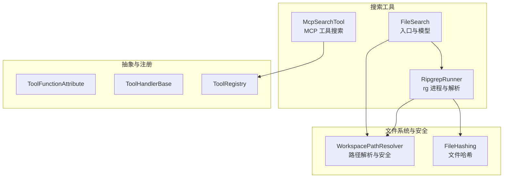
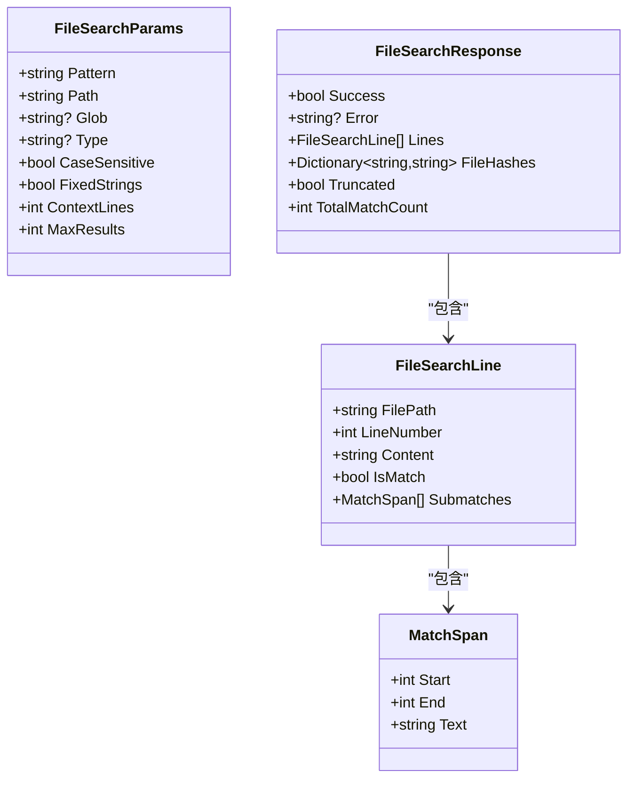
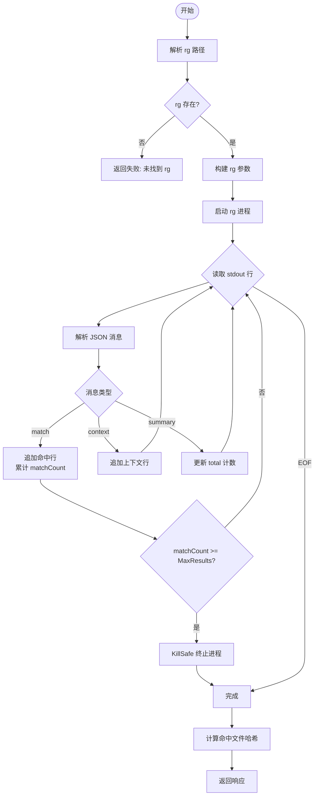
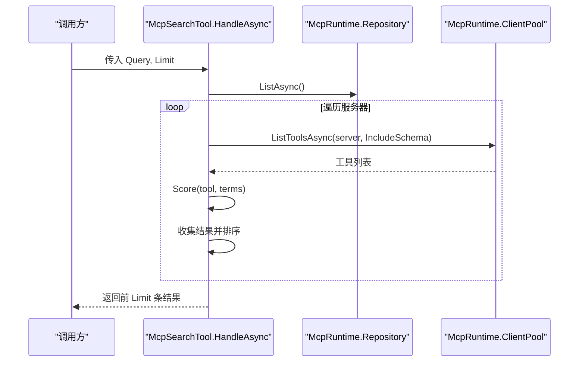
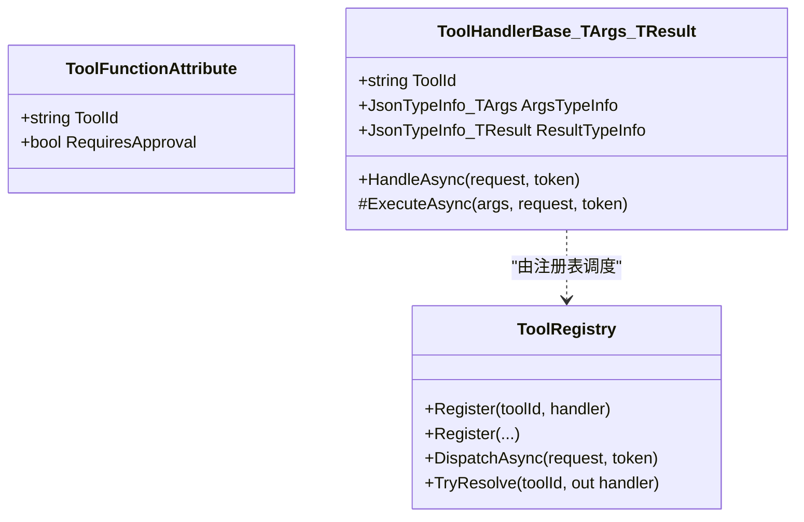
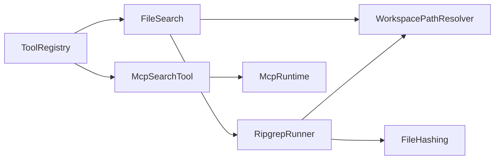

# 搜索工具

<cite>
**本文引用的文件**   
- [FileSearch.cs](file://TinadecTools/Tools/Search/FileSearch.cs)
- [RipgrepRunner.cs](file://TinadecTools/Tools/Search/RipgrepRunner.cs)
- [McpSearchTool.cs](file://TinadecTools/Tools/Mcp/McpSearchTool.cs)
- [ToolFunctionAttribute.cs](file://TinadecTools/Abstractions/ToolFunctionAttribute.cs)
- [ToolHandlerBase.cs](file://TinadecTools/Abstractions/ToolHandlerBase.cs)
- [ToolRegistry.cs](file://TinadecTools/Abstractions/ToolRegistry.cs)
- [FileToolRuntime.cs](file://TinadecTools/Tools/FileRW/FileToolRuntime.cs)
- [FileHashing.cs](file://TinadecTools/Tools/FileRW/FileHashing.cs)
- [FileSearchTests.cs](file://tests/TinadecTools.Tests/FileSearchTests.cs)
</cite>

## 目录
1. [简介](#简介)
2. [项目结构](#项目结构)
3. [核心组件](#核心组件)
4. [架构总览](#架构总览)
5. [详细组件分析](#详细组件分析)
6. [依赖关系分析](#依赖关系分析)
7. [性能与内存优化](#性能与内存优化)
8. [故障排查指南](#故障排查指南)
9. [结论](#结论)
10. [附录：查询示例与高级用法](#附录：查询示例与高级用法)

## 简介
本文件为“搜索工具”的完整技术文档，聚焦于文件搜索引擎、Ripgrep 集成与搜索结果处理。内容涵盖搜索算法、正则表达式支持、结果排序与分页机制、性能优化策略、索引策略与内存管理，并提供可操作的查询示例和高级用法指南。该实现以 C# 工具库为核心，通过外部进程调用高性能文本搜索引擎 Ripgrep（rg），并以结构化 JSON 流式解析结果，保证高吞吐与低延迟。

## 项目结构
搜索能力主要位于 TinadecTools 模块中，按功能域组织：
- 搜索入口与数据模型：TinadecTools/Tools/Search/FileSearch.cs
- Ripgrep 进程编排与结果解析：TinadecTools/Tools/Search/RipgrepRunner.cs
- MCP 工具搜索（辅助）：TinadecTools/Tools/Mcp/McpSearchTool.cs
- 工具注册与抽象基类：TinadecTools/Abstractions/*
- 工作区路径与安全校验：TinadecTools/Tools/FileRW/FileToolRuntime.cs
- 文件哈希计算（用于结果去重/一致性校验）：TinadecTools/Tools/FileRW/FileHashing.cs
- 单元测试覆盖关键行为：tests/TinadecTools.Tests/FileSearchTests.cs



图表来源
- [FileSearch.cs:116-139](file://TinadecTools/Tools/Search/FileSearch.cs#L116-L139)
- [RipgrepRunner.cs:53-183](file://TinadecTools/Tools/Search/RipgrepRunner.cs#L53-L183)
- [McpSearchTool.cs:6-61](file://TinadecTools/Tools/Mcp/McpSearchTool.cs#L6-L61)
- [ToolFunctionAttribute.cs:1-15](file://TinadecTools/Abstractions/ToolFunctionAttribute.cs#L1-L15)
- [ToolHandlerBase.cs:9-42](file://TinadecTools/Abstractions/ToolHandlerBase.cs#L9-L42)
- [ToolRegistry.cs:10-85](file://TinadecTools/Abstractions/ToolRegistry.cs#L10-L85)
- [FileToolRuntime.cs:6-92](file://TinadecTools/Tools/FileRW/FileToolRuntime.cs#L6-L92)

章节来源
- [FileSearch.cs:1-139](file://TinadecTools/Tools/Search/FileSearch.cs#L1-L139)
- [RipgrepRunner.cs:1-275](file://TinadecTools/Tools/Search/RipgrepRunner.cs#L1-L275)
- [McpSearchTool.cs:1-87](file://TinadecTools/Tools/Mcp/McpSearchTool.cs#L1-L87)
- [ToolFunctionAttribute.cs:1-15](file://TinadecTools/Abstractions/ToolFunctionAttribute.cs#L1-L15)
- [ToolHandlerBase.cs:1-43](file://TinadecTools/Abstractions/ToolHandlerBase.cs#L1-L43)
- [ToolRegistry.cs:1-86](file://TinadecTools/Abstractions/ToolRegistry.cs#L1-L86)
- [FileToolRuntime.cs:1-124](file://TinadecTools/Tools/FileRW/FileToolRuntime.cs#L1-L124)

## 核心组件
- FileSearchParams / FileSearchResponse / FileSearchLine / MatchSpan：定义搜索请求参数、响应结构与行级命中记录，包含上下文行、子匹配片段与文件哈希映射。
- RipgrepRunner：负责定位 rg 可执行文件、构建命令行参数、启动进程、流式读取 JSON 输出并转换为内部数据结构；同时计算命中文件的哈希值。
- McpSearchTool：对 MCP 服务器暴露的工具进行关键词打分排序与分页返回，属于“工具元数据搜索”，与文件内容搜索互补。
- 工具抽象与注册：ToolFunctionAttribute、ToolHandlerBase、ToolRegistry 提供统一的工具发现、参数反序列化与分发机制。
- WorkspacePathResolver：统一工作区根路径解析、相对路径转换、符号链接与越界访问防护。
- FileHashing：提供与文件读写工具一致的哈希算法，用于结果一致性与缓存键生成。

章节来源
- [FileSearch.cs:8-112](file://TinadecTools/Tools/Search/FileSearch.cs#L8-L112)
- [RipgrepRunner.cs:11-49](file://TinadecTools/Tools/Search/RipgrepRunner.cs#L11-L49)
- [McpSearchTool.cs:6-61](file://TinadecTools/Tools/Mcp/McpSearchTool.cs#L6-L61)
- [ToolFunctionAttribute.cs:1-15](file://TinadecTools/Abstractions/ToolFunctionAttribute.cs#L1-L15)
- [ToolHandlerBase.cs:9-42](file://TinadecTools/Abstractions/ToolHandlerBase.cs#L9-L42)
- [ToolRegistry.cs:10-85](file://TinadecTools/Abstractions/ToolRegistry.cs#L10-L85)
- [FileToolRuntime.cs:6-92](file://TinadecTools/Tools/FileRW/FileToolRuntime.cs#L6-L92)

## 架构总览
搜索流程从工具入口进入，经参数校验后委托给 RipgrepRunner 执行 rg 进程，rg 以 --json 模式输出逐条消息，程序流式解析 match/context/summary 三类消息，累积结果并在达到 MaxResults 时提前终止进程，最后汇总统计信息并返回。

```mermaid
sequenceDiagram
participant Caller as "调用方"
participant FS as "FileSearch.HandleAsync"
participant RG as "RipgrepRunner.RunAsync"
participant OS as "操作系统进程"
participant FSys as "文件系统"
Caller->>FS : 传入 FileSearchParams
FS->>FS : 校验 pattern 非空
FS->>RG : 调用 RunAsync(args, token)
RG->>OS : 启动 rg 进程--json, -C, -g, --type, -F, ...
loop 流式读取 stdout
OS-->>RG : 逐行 JSONmatch/context/summary
RG->>RG : 解析并追加到 lines
RG->>RG : 累计 matchCount 与 totalCount
alt 达到 MaxResults
RG->>OS : KillSafe(终止进程)
break
end
end
RG->>FSys : 读取命中文件字节并计算哈希
RG-->>FS : 返回 FileSearchResponse
FS-->>Caller : 返回成功或错误响应
```

图表来源
- [FileSearch.cs:116-139](file://TinadecTools/Tools/Search/FileSearch.cs#L116-L139)
- [RipgrepRunner.cs:79-183](file://TinadecTools/Tools/Search/RipgrepRunner.cs#L79-L183)

## 详细组件分析

### 文件搜索入口与数据模型（FileSearch）
- 入口方法 HandleAsync 接收 FileSearchParams，校验 pattern 必填，随后委托 RipgrepRunner 执行搜索。
- 数据模型包括：
  - FileSearchParams：pattern、path、glob、type、case_sensitive、fixed_strings、context_lines、max_results。
  - FileSearchResponse：success、error、lines、file_hashes、truncated、total_match_count。
  - FileSearchLine：filepath、line_number、content、is_match、submatches。
  - MatchSpan：start、end、text。
- JSON Source Generation 使用 System.Text.Json.SourceGeneration 提升序列化性能。



图表来源
- [FileSearch.cs:8-112](file://TinadecTools/Tools/Search/FileSearch.cs#L8-L112)

章节来源
- [FileSearch.cs:8-112](file://TinadecTools/Tools/Search/FileSearch.cs#L8-L112)
- [FileSearch.cs:116-139](file://TinadecTools/Tools/Search/FileSearch.cs#L116-L139)

### Ripgrep 集成与结果处理（RipgrepRunner）
- rg 可执行文件解析顺序：环境变量 TINADEC_TOOLS_RG_PATH > 同目录 rg.exe/rg > PATH 查找。
- 参数构建：
  - --json：启用 JSON 输出
  - --no-follow：不跟随符号链接
  - --case-sensitive / --ignore-case：大小写控制
  - -F：字面量模式
  - -C N：上下文行数
  - -g GLOB：文件名过滤
  - --type TYPE：类型过滤
  - -- 防止 pattern 被误解析为 flag
- 流式解析：
  - match：命中行，附带 submatches（起始/结束偏移与文本）
  - context：上下文行
  - summary：统计 matched_lines
- 截断与终止：当 matchCount >= MaxResults 时，KillSafe 终止 rg 进程，设置 truncated=true。
- 错误处理：exit code 1 表示无匹配（正常），>=2 且无结果视为错误；stderr 合并为错误信息。
- 文件哈希：对命中文件读取字节并计算哈希，便于上层缓存与一致性校验。



图表来源
- [RipgrepRunner.cs:53-183](file://TinadecTools/Tools/Search/RipgrepRunner.cs#L53-L183)
- [RipgrepRunner.cs:187-233](file://TinadecTools/Tools/Search/RipgrepRunner.cs#L187-L233)
- [RipgrepRunner.cs:235-264](file://TinadecTools/Tools/Search/RipgrepRunner.cs#L235-L264)

章节来源
- [RipgrepRunner.cs:53-183](file://TinadecTools/Tools/Search/RipgrepRunner.cs#L53-L183)
- [RipgrepRunner.cs:187-233](file://TinadecTools/Tools/Search/RipgrepRunner.cs#L187-L233)
- [RipgrepRunner.cs:235-264](file://TinadecTools/Tools/Search/RipgrepRunner.cs#L235-L264)

### MCP 工具搜索（McpSearchTool）
- 输入 Query 拆分为词项，遍历已注册的 MCP 服务器与工具列表，基于名称与描述进行加权打分。
- 排序规则：Score 降序，其次 ServerId 升序，再 Tool.Name 升序。
- 分页：Limit 限制返回数量（1-100）。



图表来源
- [McpSearchTool.cs:6-61](file://TinadecTools/Tools/Mcp/McpSearchTool.cs#L6-L61)

章节来源
- [McpSearchTool.cs:6-61](file://TinadecTools/Tools/Mcp/McpSearchTool.cs#L6-L61)

### 工具抽象与注册（ToolFunctionAttribute / ToolHandlerBase / ToolRegistry）
- ToolFunctionAttribute：标记工具方法与 ID，可选 RequiresApproval。
- ToolHandlerBase：非静态工具的基础抽象，统一参数反序列化与响应封装。
- ToolRegistry：集中注册与分发工具处理器，支持泛型注册与审批检查。



图表来源
- [ToolFunctionAttribute.cs:1-15](file://TinadecTools/Abstractions/ToolFunctionAttribute.cs#L1-L15)
- [ToolHandlerBase.cs:9-42](file://TinadecTools/Abstractions/ToolHandlerBase.cs#L9-L42)
- [ToolRegistry.cs:10-85](file://TinadecTools/Abstractions/ToolRegistry.cs#L10-L85)

章节来源
- [ToolFunctionAttribute.cs:1-15](file://TinadecTools/Abstractions/ToolFunctionAttribute.cs#L1-L15)
- [ToolHandlerBase.cs:9-42](file://TinadecTools/Abstractions/ToolHandlerBase.cs#L9-L42)
- [ToolRegistry.cs:10-85](file://TinadecTools/Abstractions/ToolRegistry.cs#L10-L85)

### 工作区路径与安全（WorkspacePathResolver）
- 统一工作区根路径与工作区相对路径转换。
- 严格校验路径在工作区内，禁止通过符号链接或连接点穿越边界。
- 提供 Exists、IsLink 等辅助方法。

章节来源
- [FileToolRuntime.cs:6-92](file://TinadecTools/Tools/FileRW/FileToolRuntime.cs#L6-L92)

## 依赖关系分析
- FileSearch 依赖 RipgrepRunner 与 WorkspacePathResolver。
- RipgrepRunner 依赖 WorkspacePathResolver（路径解析）、FileHashing（哈希计算）与系统进程 API。
- McpSearchTool 依赖 McpRuntime（工具清单与客户端池）。
- 工具抽象层（ToolFunctionAttribute/ToolHandlerBase/ToolRegistry）为所有工具的统一入口与分发。



图表来源
- [FileSearch.cs:116-139](file://TinadecTools/Tools/Search/FileSearch.cs#L116-L139)
- [RipgrepRunner.cs:79-183](file://TinadecTools/Tools/Search/RipgrepRunner.cs#L79-L183)
- [McpSearchTool.cs:6-61](file://TinadecTools/Tools/Mcp/McpSearchTool.cs#L6-L61)
- [ToolRegistry.cs:10-85](file://TinadecTools/Abstractions/ToolRegistry.cs#L10-L85)

章节来源
- [FileSearch.cs:116-139](file://TinadecTools/Tools/Search/FileSearch.cs#L116-L139)
- [RipgrepRunner.cs:79-183](file://TinadecTools/Tools/Search/RipgrepRunner.cs#L79-L183)
- [McpSearchTool.cs:6-61](file://TinadecTools/Tools/Mcp/McpSearchTool.cs#L6-L61)
- [ToolRegistry.cs:10-85](file://TinadecTools/Abstractions/ToolRegistry.cs#L10-L85)

## 性能与内存优化
- 流式处理：rg 输出以行为单位流式解析，避免一次性加载大文件内容，降低内存峰值。
- 早期终止：达到 MaxResults 后立即终止 rg 进程，减少不必要的 I/O 与 CPU 消耗。
- 并发 stderr 读取：独立任务读取 stderr，避免标准错误缓冲区阻塞导致死锁。
- JSON Source Generation：使用预编译的 JsonTypeInfo，减少反射开销，提升序列化/反序列化性能。
- 哈希计算仅在命中文件集合上进行，避免全量扫描。
- 建议：
  - 合理设置 MaxResults 与 ContextLines，平衡结果丰富度与性能。
  - 使用 Glob/Type 过滤缩小搜索范围，提高命中率与速度。
  - 在高频场景下，结合 file_hashes 做上层缓存，避免重复计算。

[本节为通用指导，不直接分析具体文件]

## 故障排查指南
- rg 未找到：检查环境变量 TINADEC_TOOLS_RG_PATH 是否正确，或将 rg.exe/rg 放置于可执行目录或 PATH 中。
- 无匹配结果：确认 pattern 正确性，必要时关闭固定字符串模式（FixedStrings=false）以启用正则。
- 权限问题：确保工作区路径合法且未被符号链接绕过；检查文件可读性。
- 进程异常退出：关注 exit code，1 表示无匹配（正常），>=2 且无结果视为错误；查看 stderr 获取详细信息。
- 测试用例参考：FileSearchTests 覆盖了基础匹配、子匹配、过滤、大小写、上下文、截断、无匹配、rg 未找到、空 pattern 等场景。

章节来源
- [RipgrepRunner.cs:153-157](file://TinadecTools/Tools/Search/RipgrepRunner.cs#L153-L157)
- [FileSearchTests.cs:32-247](file://tests/TinadecTools.Tests/FileSearchTests.cs#L32-L247)

## 结论
搜索工具通过 C# 工具框架与 Ripgrep 的高效集成，实现了可扩展、高性能的文件内容搜索能力。其设计强调流式处理、早期终止与严格的权限控制，配合完善的单元测试与清晰的错误处理，能够在大规模代码库中稳定运行。对于工具元数据的搜索，McpSearchTool 提供了轻量级的关键词评分与排序方案，满足工具发现与导航需求。

[本节为总结性内容，不直接分析具体文件]

## 附录：查询示例与高级用法
- 基础搜索：指定 pattern 与 path，返回命中行与上下文。
- 正则与字面量：FixedStrings=false 使用正则；true 将 pattern 作为字面量匹配。
- 大小写敏感：CaseSensitive=true 精确匹配大小写；false 忽略大小写。
- 文件过滤：Glob 支持通配符（如 *.cs、*.{ts,tsx}）；Type 支持语言类型（如 cs、ts、rust）。
- 上下文行：ContextLines=N 返回命中行前后 N 行。
- 结果上限：MaxResults 控制返回命中行数，超过则 truncated=true。
- MCP 工具搜索：Query 拆分词项，Limit 限制返回数量，Score 基于名称与描述加权。

章节来源
- [FileSearch.cs:8-38](file://TinadecTools/Tools/Search/FileSearch.cs#L8-L38)
- [RipgrepRunner.cs:187-233](file://TinadecTools/Tools/Search/RipgrepRunner.cs#L187-L233)
- [McpSearchTool.cs:10-61](file://TinadecTools/Tools/Mcp/McpSearchTool.cs#L10-L61)
- [FileSearchTests.cs:32-247](file://tests/TinadecTools.Tests/FileSearchTests.cs#L32-L247)