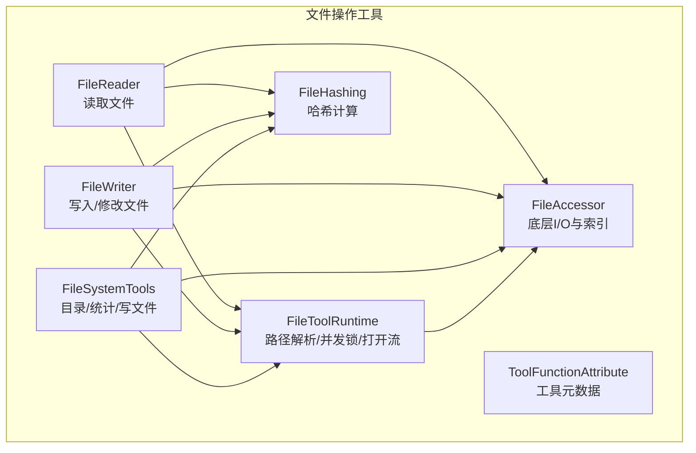
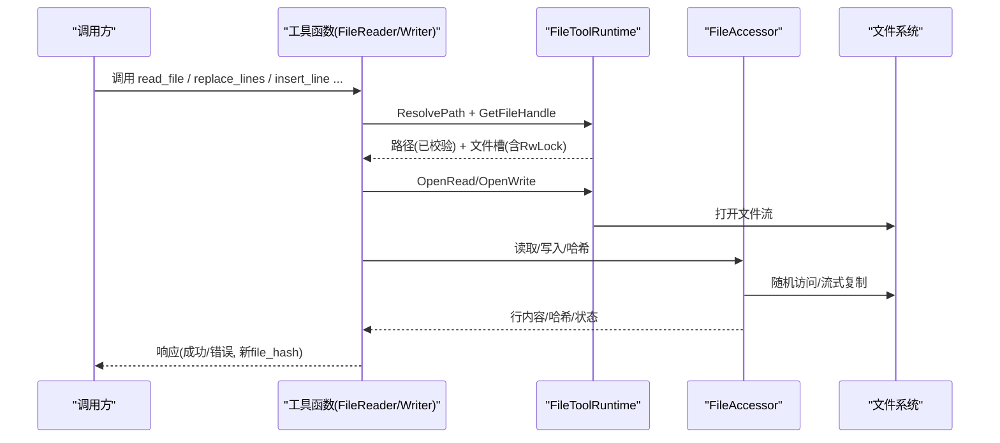
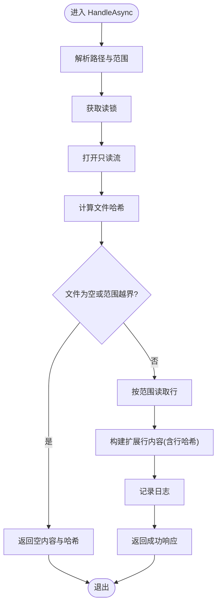
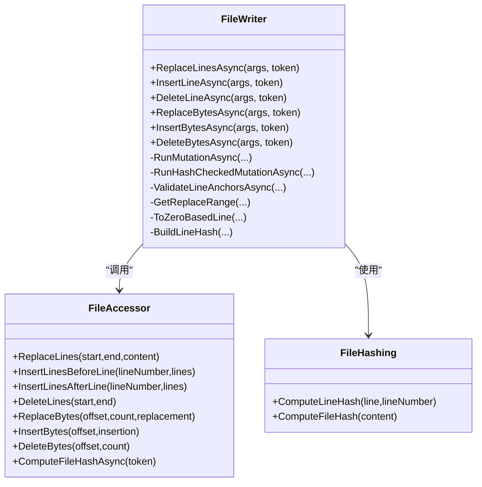

# 文件操作工具

<cite>
**本文引用的文件**   
- [FileReader.cs](file://TinadecTools/Tools/FileRW/FileReader.cs)
- [FileWriter.cs](file://TinadecTools/Tools/FileRW/FileWriter.cs)
- [FileHashing.cs](file://TinadecTools/Tools/FileRW/FileHashing.cs)
- [FileAccessor.cs](file://TinadecTools/Tools/FileRW/FileAccessor.cs)
- [FileSystemTools.cs](file://TinadecTools/Tools/FileRW/FileSystemTools.cs)
- [FileToolRuntime.cs](file://TinadecTools/Tools/FileRW/FileToolRuntime.cs)
- [ToolFunctionAttribute.cs](file://TinadecTools/Abstractions/ToolFunctionAttribute.cs)
- [FileReaderTests.cs](file://tests/TinadecTools.Tests/FileReaderTests.cs)
- [FileWriterTests.cs](file://tests/TinadecTools.Tests/FileWriterTests.cs)
- [FileHashingTests.cs](file://tests/TinadecTools.Tests/FileHashingTests.cs)
</cite>

## 目录
1. [简介](#简介)
2. [项目结构](#项目结构)
3. [核心组件](#核心组件)
4. [架构总览](#架构总览)
5. [详细组件分析](#详细组件分析)
6. [依赖关系分析](#依赖关系分析)
7. [性能考量](#性能考量)
8. [故障排查指南](#故障排查指南)
9. [结论](#结论)
10. [附录：API 参考与最佳实践](#附录api-参考与最佳实践)

## 简介
本文件操作工具提供安全、高效且并发友好的文件读取、写入、访问控制与哈希计算能力。其设计重点包括：
- 路径验证与安全边界（工作区限制、符号链接检查）
- UTF-8 编码处理与行尾规范化
- 大文件支持（按行索引、随机访问、流式复制）
- 并发访问控制（基于文件的读写锁）
- 原子性写入与临时文件回滚
- 细粒度哈希校验（逐行哈希与全文件哈希）
- 权限检查与只读保护
- 完善的错误处理与取消令牌支持

该工具以“工具函数”形式暴露 API，便于上层编排器或网关调用。

## 项目结构
文件操作相关代码集中在 TinadecTools/Tools/FileRW 目录下，包含以下关键模块：
- FileReader：按行范围读取文件内容并返回扩展行信息（含行号、偏移、行哈希）
- FileWriter：多种写入与修改操作（替换行、插入/删除字节、插入/删除行），带哈希校验
- FileHashing：轻量级双字符行哈希与四字符文件哈希算法
- FileAccessor：底层文件 I/O 抽象，构建行索引、随机访问、字节级修改
- FileSystemTools：目录列举、路径统计、基础写文件（write_file）
- FileToolRuntime：工作区路径解析、文件句柄与并发锁管理、打开读写流
- ToolFunctionAttribute：工具函数元数据（名称、是否需要审批）

图表来源
- [FileReader.cs:54-132](file://TinadecTools/Tools/FileRW/FileReader.cs#L54-L132)
- [FileWriter.cs:64-279](file://TinadecTools/Tools/FileRW/FileWriter.cs#L64-L279)
- [FileHashing.cs:9-54](file://TinadecTools/Tools/FileRW/FileHashing.cs#L9-L54)
- [FileAccessor.cs:34-514](file://TinadecTools/Tools/FileRW/FileAccessor.cs#L34-L514)
- [FileSystemTools.cs:64-272](file://TinadecTools/Tools/FileRW/FileSystemTools.cs#L64-L272)
- [FileToolRuntime.cs:6-123](file://TinadecTools/Tools/FileRW/FileToolRuntime.cs#L6-L123)
- [ToolFunctionAttribute.cs:1-15](file://TinadecTools/Abstractions/ToolFunctionAttribute.cs#L1-L15)

章节来源
- [FileReader.cs:54-132](file://TinadecTools/Tools/FileRW/FileReader.cs#L54-L132)
- [FileWriter.cs:64-279](file://TinadecTools/Tools/FileRW/FileWriter.cs#L64-L279)
- [FileHashing.cs:9-54](file://TinadecTools/Tools/FileRW/FileHashing.cs#L9-L54)
- [FileAccessor.cs:34-514](file://TinadecTools/Tools/FileRW/FileAccessor.cs#L34-L514)
- [FileSystemTools.cs:64-272](file://TinadecTools/Tools/FileRW/FileSystemTools.cs#L64-L272)
- [FileToolRuntime.cs:6-123](file://TinadecTools/Tools/FileRW/FileToolRuntime.cs#L6-L123)
- [ToolFunctionAttribute.cs:1-15](file://TinadecTools/Abstractions/ToolFunctionAttribute.cs#L1-L15)

## 核心组件
- 读取（read_file）
  - 输入参数：文件路径、起始行号、结束行号
  - 行为：解析路径、获取文件句柄、加读锁、打开只读流、计算文件哈希、按行范围读取、构造扩展行内容（含行哈希）、返回结果
  - 特性：行号从 1 开始；空文件或越界时返回空列表；支持取消令牌；异常统一包装为响应
- 写入与修改（replace_lines、insert_line、delete_line、replace_bytes、insert_bytes、delete_bytes）
  - 输入参数：文件路径、行号范围或字节偏移、内容、可选的文件哈希校验
  - 行为：解析路径、获取文件句柄、加写锁、打开可写流、可选的哈希校验、执行修改、重建索引、计算新文件哈希、返回结果
  - 特性：所有写操作均需要审批标记；行/字节范围严格校验；失败不污染原文件（临时文件+原子替换）
- 哈希（ComputeLineHash、ComputeFileHash）
  - 行哈希：对行内容进行归一化后使用 XXH32 生成双字符 ID；无显著内容的行使用行号作为种子
  - 文件哈希：对整个文件内容使用 XXH32 生成四字符 ID
- 文件系统工具（ls、stat、write_file）
  - ls：分页列举目录条目，自然排序，支持游标
  - stat：获取路径信息（类型、大小、时间、只读/隐藏、链接目标）
  - write_file：新建或覆盖文件；覆盖时需传入 file_hash 进行一致性校验

章节来源
- [FileReader.cs:54-132](file://TinadecTools/Tools/FileRW/FileReader.cs#L54-L132)
- [FileWriter.cs:64-279](file://TinadecTools/Tools/FileRW/FileWriter.cs#L64-L279)
- [FileHashing.cs:9-54](file://TinadecTools/Tools/FileRW/FileHashing.cs#L9-L54)
- [FileSystemTools.cs:64-272](file://TinadecTools/Tools/FileRW/FileSystemTools.cs#L64-L272)

## 架构总览
整体流程围绕“工具函数 -> 运行时 -> 文件访问器 -> 文件系统”展开。路径解析与安全校验在入口处完成，并发通过文件级读写锁保证，写入采用临时文件策略确保原子性。

图表来源
- [FileReader.cs:54-132](file://TinadecTools/Tools/FileRW/FileReader.cs#L54-L132)
- [FileWriter.cs:64-279](file://TinadecTools/Tools/FileRW/FileWriter.cs#L64-L279)
- [FileToolRuntime.cs:99-123](file://TinadecTools/Tools/FileRW/FileToolRuntime.cs#L99-L123)
- [FileAccessor.cs:34-514](file://TinadecTools/Tools/FileRW/FileAccessor.cs#L34-L514)

## 详细组件分析

### 读取组件（FileReader）
- 功能要点
  - 路径解析与工作区校验
  - 读锁保护并发读取
  - 行范围解析与上限保护（防止超大范围一次性读取）
  - 行内容提取与偏移记录
  - 文件哈希计算
- 错误处理
  - 取消操作返回特定错误
  - 其他异常统一包装为响应中的 Error 字段
- 复杂度
  - 读取指定行范围的时间复杂度 O(k)，k 为读取的行数
  - 空间复杂度取决于单行长度与缓冲池

图表来源
- [FileReader.cs:54-132](file://TinadecTools/Tools/FileRW/FileReader.cs#L54-L132)

章节来源
- [FileReader.cs:54-132](file://TinadecTools/Tools/FileRW/FileReader.cs#L54-L132)

### 写入与修改组件（FileWriter）
- 功能要点
  - 多类写入操作：替换行、插入/删除字节、插入/删除行
  - 行锚点校验：replace_lines 会读取目标行并比对行哈希，避免并发冲突
  - 文件级哈希校验：部分操作要求传入 file_hash，不一致则拒绝
  - 原子写入：非等长替换通过临时文件重写，成功后原子替换原文件
- 错误处理
  - 取消操作返回特定错误
  - 哈希不匹配抛出明确异常
  - 参数校验失败抛出异常
- 并发控制
  - 写锁保护同一文件的并发写入

图表来源
- [FileWriter.cs:64-279](file://TinadecTools/Tools/FileRW/FileWriter.cs#L64-L279)
- [FileAccessor.cs:34-514](file://TinadecTools/Tools/FileRW/FileAccessor.cs#L34-L514)
- [FileHashing.cs:9-54](file://TinadecTools/Tools/FileRW/FileHashing.cs#L9-L54)

章节来源
- [FileWriter.cs:64-279](file://TinadecTools/Tools/FileRW/FileWriter.cs#L64-L279)

### 哈希组件（FileHashing）
- 行哈希
  - 去除回车符并修剪尾部空白
  - 若行无显著内容（仅空白/标点），使用行号作为种子；否则使用内容作为种子
  - 使用 XXH32 生成 32 位哈希，映射到双字符字典
- 文件哈希
  - 直接对字节序列计算 XXH32，映射到四字符字典
- 复杂度
  - 行哈希 O(n)，n 为行长度
  - 文件哈希 O(N)，N 为文件大小（受内存限制）

章节来源
- [FileHashing.cs:9-54](file://TinadecTools/Tools/FileRW/FileHashing.cs#L9-L54)

### 文件访问器（FileAccessor）
- 行索引构建
  - 扫描文件，记录每行的起始与结束偏移，支持随机访问
- 读取行
  - 根据行索引定位偏移，使用 RandomAccess 读取指定范围
- 写入与修改
  - ReplaceBytes：等长替换原地写入；不等长替换通过临时文件重写
  - Insert/Delete：封装为 ReplaceBytes 的特例
  - 行级操作：将行内容编码为 UTF-8 字节后调用字节级方法
- 大文件支持
  - 使用 ArrayPool 减少分配
  - 流式复制避免一次性加载整个文件
- 并发与资源
  - 异步 I/O 与取消令牌
  - Dispose 释放文件句柄

章节来源
- [FileAccessor.cs:34-514](file://TinadecTools/Tools/FileRW/FileAccessor.cs#L34-L514)

### 文件系统工具（FileSystemTools）
- ls
  - 列举目录条目，自然排序，分页游标
- stat
  - 获取路径属性（类型、大小、时间、只读/隐藏、链接目标）
- write_file
  - 新建文件：UTF-8 无 BOM，行尾标准化
  - 覆盖文件：必须传入 file_hash 校验一致性，再替换字节

章节来源
- [FileSystemTools.cs:64-272](file://TinadecTools/Tools/FileRW/FileSystemTools.cs#L64-L272)

### 运行时与路径解析（FileToolRuntime）
- 工作区根
  - 基于进程当前目录确定工作区根
- 路径解析
  - 绝对化、工作区内校验、符号链接遍历检查
- 并发锁
  - 每个文件一个 FileSlot，内含 AsyncReaderWriterLock
- 打开流
  - OpenRead/OpenWrite 返回 FileAccessor

章节来源
- [FileToolRuntime.cs:6-123](file://TinadecTools/Tools/FileRW/FileToolRuntime.cs#L6-L123)

## 依赖关系分析
- 工具函数依赖运行时进行路径解析与并发控制
- 运行时依赖 FileAccessor 进行底层 I/O
- 写入与读取均依赖 FileHashing 进行哈希计算
- 文件系统工具依赖运行时与 FileAccessor

图表来源
- [FileReader.cs:54-132](file://TinadecTools/Tools/FileRW/FileReader.cs#L54-L132)
- [FileWriter.cs:64-279](file://TinadecTools/Tools/FileRW/FileWriter.cs#L64-L279)
- [FileSystemTools.cs:64-272](file://TinadecTools/Tools/FileRW/FileSystemTools.cs#L64-L272)
- [FileToolRuntime.cs:99-123](file://TinadecTools/Tools/FileRW/FileToolRuntime.cs#L99-L123)
- [FileAccessor.cs:34-514](file://TinadecTools/Tools/FileRW/FileAccessor.cs#L34-L514)
- [FileHashing.cs:9-54](file://TinadecTools/Tools/FileRW/FileHashing.cs#L9-L54)

章节来源
- [FileReader.cs:54-132](file://TinadecTools/Tools/FileRW/FileReader.cs#L54-L132)
- [FileWriter.cs:64-279](file://TinadecTools/Tools/FileRW/FileWriter.cs#L64-L279)
- [FileSystemTools.cs:64-272](file://TinadecTools/Tools/FileRW/FileSystemTools.cs#L64-L272)
- [FileToolRuntime.cs:99-123](file://TinadecTools/Tools/FileRW/FileToolRuntime.cs#L99-L123)
- [FileAccessor.cs:34-514](file://TinadecTools/Tools/FileRW/FileAccessor.cs#L34-L514)
- [FileHashing.cs:9-54](file://TinadecTools/Tools/FileRW/FileHashing.cs#L9-L54)

## 性能考量
- 行索引构建：首次打开文件时扫描一次，后续随机访问 O(1) 定位行
- 读取优化：ArrayPool 复用缓冲区，RandomAccess 直接按偏移读取
- 写入优化：等长替换原地写入；不等长替换流式复制，避免大对象分配
- 哈希计算：XXH32 快速哈希；文件哈希受限于内存（过大文件抛错）
- 并发控制：文件级读写锁，避免竞争条件
- 取消令牌：贯穿 I/O 与哈希计算，提升响应性与资源回收

[本节为通用指导，无需引用具体文件]

## 故障排查指南
- 常见错误
  - 路径不在工作区内：UnauthorizedAccessException
  - 符号链接穿越：UnauthorizedAccessException
  - 文件哈希不匹配：InvalidOperationException（包含期望与实际值）
  - 行号越界或范围无效：ArgumentOutOfRangeException/ArgumentException
  - 覆盖现有文件未提供 file_hash：InvalidOperationException
  - 取消操作：OperationCanceledException（被捕获并转为响应错误）
- 调试建议
  - 检查路径是否相对工作区根
  - 确认 file_hash 是否与读取一致
  - 查看日志输出（工具内部记录关键步骤与异常）
  - 对于大文件，确认是否超过内存限制

章节来源
- [FileToolRuntime.cs:16-91](file://TinadecTools/Tools/FileRW/FileToolRuntime.cs#L16-L91)
- [FileWriter.cs:172-222](file://TinadecTools/Tools/FileRW/FileWriter.cs#L172-L222)
- [FileSystemTools.cs:123-176](file://TinadecTools/Tools/FileRW/FileSystemTools.cs#L123-L176)
- [FileReader.cs:98-116](file://TinadecTools/Tools/FileRW/FileReader.cs#L98-L116)

## 结论
该文件操作工具提供了完善的安全边界、并发控制与原子写入机制，适用于大规模文本文件的稳定读写与变更。通过行级与文件级哈希校验，有效避免了并发冲突与意外覆盖。配合工作区路径解析与符号链接检查，确保了操作的安全性。建议在高频写入场景中使用行锚点与文件哈希校验，以获得更强的正确性保障。

[本节为总结，无需引用具体文件]

## 附录：API 参考与最佳实践

### API 概览
- 读取
  - read_file：按行范围读取，返回扩展行内容与文件哈希
- 写入与修改
  - replace_lines：替换行范围，需校验行哈希
  - insert_line：在指定行前后插入若干行，需校验文件哈希
  - delete_line：删除行范围，需校验文件哈希
  - replace_bytes：按字节偏移替换内容，需校验文件哈希
  - insert_bytes：在字节偏移插入内容，需校验文件哈希
  - delete_bytes：删除字节段，需校验文件哈希
- 文件系统
  - ls：分页列举目录
  - stat：获取路径信息
  - write_file：新建或覆盖文件（覆盖需 file_hash）

### 使用示例（来自测试）
- 读取文件行号与偏移
  - 参考：[FileReaderTests.cs:8-30](file://tests/TinadecTools.Tests/FileReaderTests.cs#L8-L30)
- 写入与哈希校验
  - 参考：[FileWriterTests.cs:8-44](file://tests/TinadecTools.Tests/FileWriterTests.cs#L8-L44)
- 行哈希行为
  - 参考：[FileHashingTests.cs:7-33](file://tests/TinadecTools.Tests/FileHashingTests.cs#L7-L33)

### 最佳实践
- 路径与权限
  - 始终使用工具提供的路径解析方法，避免手动拼接
  - 覆盖现有文件时必须传入正确的 file_hash
- 编码与换行
  - 写入时使用 UTF-8 无 BOM；行尾统一为 LF
- 并发与一致性
  - 写入前读取最新文件哈希；行级修改使用行哈希锚点
- 大文件
  - 避免一次性读取整文件；使用行范围读取
  - 文件哈希计算受内存限制，超大文件应分块或避免全量哈希
- 错误处理
  - 捕获 OperationCanceledException 并返回友好错误
  - 记录关键日志以便问题定位

章节来源
- [FileReaderTests.cs:8-30](file://tests/TinadecTools.Tests/FileReaderTests.cs#L8-L30)
- [FileWriterTests.cs:8-44](file://tests/TinadecTools.Tests/FileWriterTests.cs#L8-L44)
- [FileHashingTests.cs:7-33](file://tests/TinadecTools.Tests/FileHashingTests.cs#L7-L33)
- [FileSystemTools.cs:123-176](file://TinadecTools/Tools/FileRW/FileSystemTools.cs#L123-L176)
- [FileToolRuntime.cs:16-91](file://TinadecTools/Tools/FileRW/FileToolRuntime.cs#L16-L91)