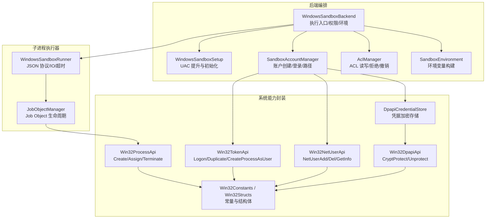
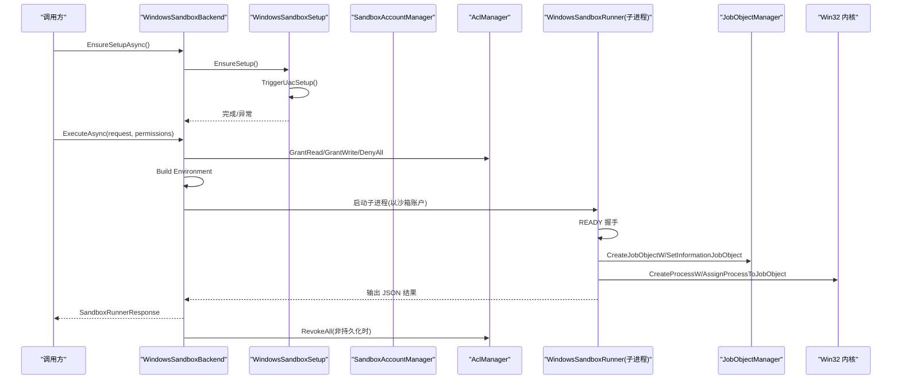
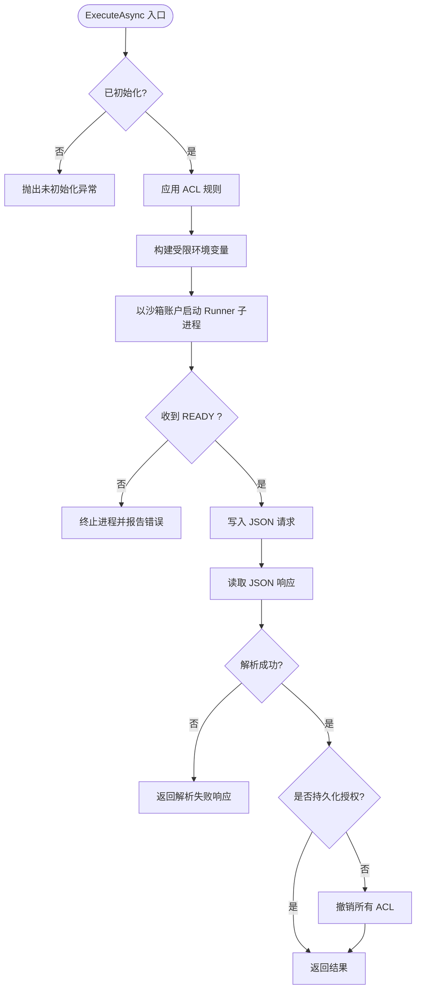
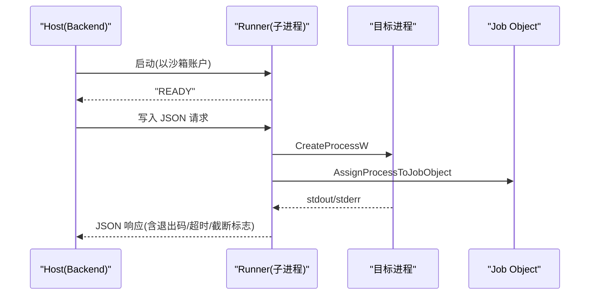
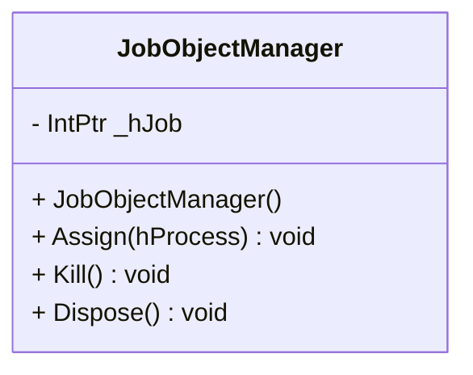
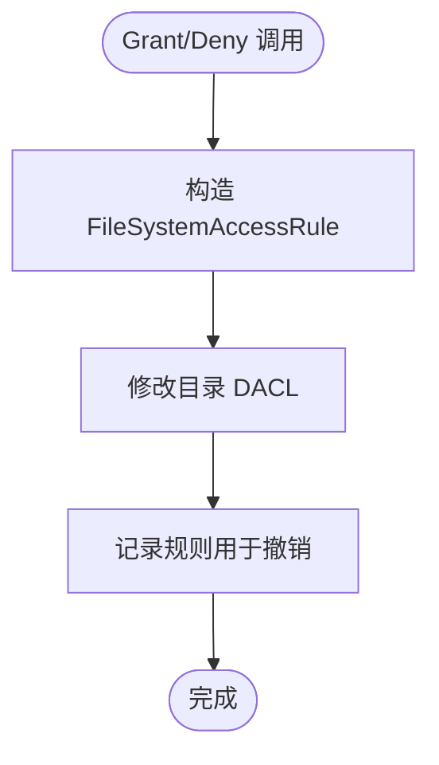
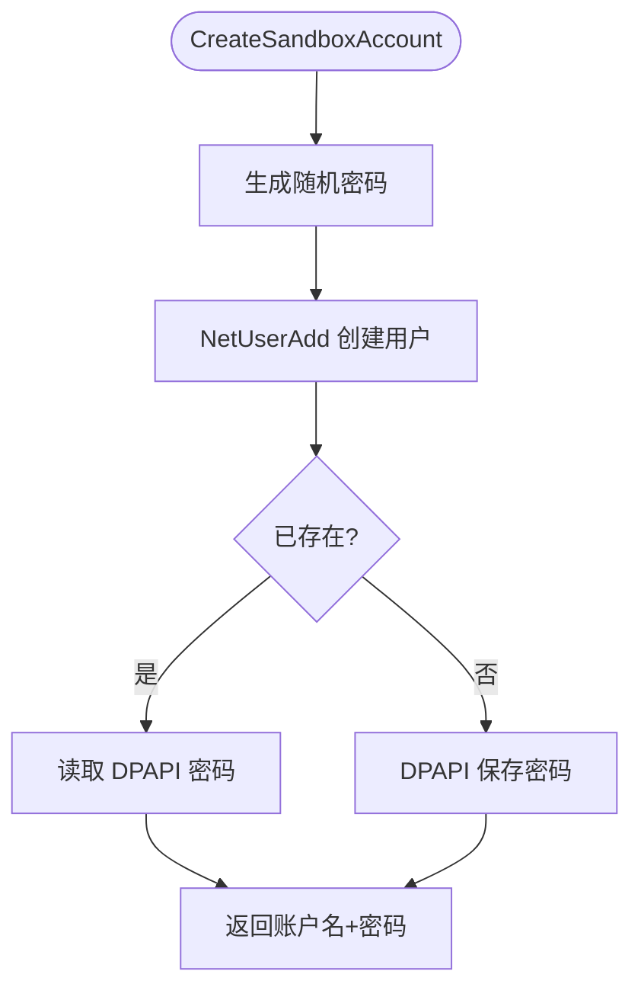
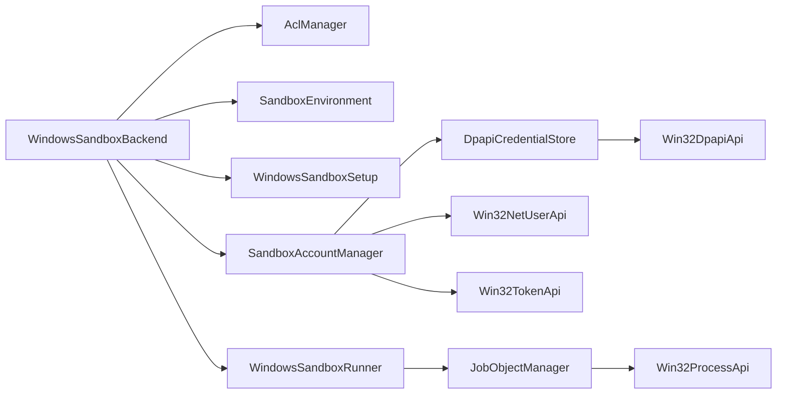

# Windows 沙箱后端

<cite>
**本文引用的文件**   
- [WindowsSandboxBackend.cs](file://TinadecTools/Runtime/Sandbox/Windows/WindowsSandboxBackend.cs)
- [JobObjectManager.cs](file://TinadecTools/Runtime/Sandbox/Windows/JobObjectManager.cs)
- [AclManager.cs](file://TinadecTools/Runtime/Sandbox/Windows/AclManager.cs)
- [SandboxAccountManager.cs](file://TinadecTools/Runtime/Sandbox/Windows/SandboxAccountManager.cs)
- [Win32ProcessApi.cs](file://TinadecTools/Runtime/Sandbox/Windows/Win32ProcessApi.cs)
- [Win32TokenApi.cs](file://TinadecTools/Runtime/Sandbox/Windows/Win32TokenApi.cs)
- [Win32NetUserApi.cs](file://TinadecTools/Runtime/Sandbox/Windows/Win32NetUserApi.cs)
- [DpapiCredentialStore.cs](file://TinadecTools/Runtime/Sandbox/Windows/DpapiCredentialStore.cs)
- [WindowsSandboxRunner.cs](file://TinadecTools/Runtime/Sandbox/Windows/WindowsSandboxRunner.cs)
- [WindowsSandboxSetup.cs](file://TinadecTools/Runtime/Sandbox/Windows/WindowsSandboxSetup.cs)
- [Win32Structs.cs](file://TinadecTools/Runtime/Sandbox/Windows/Win32Structs.cs)
- [Win32Constants.cs](file://TinadecTools/Runtime/Sandbox/Windows/Win32Constants.cs)
- [Win32DpapiApi.cs](file://TinadecTools/Runtime/Sandbox/Windows/Win32DpapiApi.cs)
- [SandboxContracts.cs](file://TinadecTools/Runtime/Sandbox/SandboxContracts.cs)
- [SandboxEnvironment.cs](file://TinadecTools/Runtime/Sandbox/SandboxEnvironment.cs)
</cite>

## 目录
1. [简介](#简介)
2. [项目结构](#项目结构)
3. [核心组件](#核心组件)
4. [架构总览](#架构总览)
5. [详细组件分析](#详细组件分析)
6. [依赖关系分析](#依赖关系分析)
7. [性能考虑](#性能考虑)
8. [故障排查指南](#故障排查指南)
9. [结论](#结论)
10. [附录](#附录)

## 简介
本文件面向 Windows 平台下的沙箱后端实现，系统性阐述基于 Job Object 的进程隔离、Win32 API 封装、ACL 权限控制与用户账户管理。文档覆盖 Win32 集成（进程、令牌、网络用户）、资源限制设置、错误处理机制，以及 Windows 特定配置、性能优化和故障排查要点，帮助读者快速理解并安全部署该沙箱子系统。

## 项目结构
Windows 沙箱后端位于 TinadecTools 项目的 Runtime\Sandbox\Windows 目录下，围绕“后端编排 + 子进程执行器 + 系统能力封装”三层组织：
- 后端编排层：负责初始化、权限应用、环境构建、调用子进程执行器、清理与重置。
- 子进程执行器：独立运行模式，接收 JSON 指令，启动目标进程并通过 Job Object 进行生命周期与输出管控。
- 系统能力封装：对 Win32 进程、令牌、网络用户、DPAPI 等 API 的 P/Invoke 封装与常量/结构体定义。

图表来源
- [WindowsSandboxBackend.cs:1-161](file://TinadecTools/Runtime/Sandbox/Windows/WindowsSandboxBackend.cs#L1-L161)
- [WindowsSandboxRunner.cs:1-178](file://TinadecTools/Runtime/Sandbox/Windows/WindowsSandboxRunner.cs#L1-L178)
- [JobObjectManager.cs:1-63](file://TinadecTools/Runtime/Sandbox/Windows/JobObjectManager.cs#L1-L63)
- [AclManager.cs:1-62](file://TinadecTools/Runtime/Sandbox/Windows/AclManager.cs#L1-L62)
- [SandboxAccountManager.cs:1-88](file://TinadecTools/Runtime/Sandbox/Windows/SandboxAccountManager.cs#L1-L88)
- [Win32ProcessApi.cs:1-79](file://TinadecTools/Runtime/Sandbox/Windows/Win32ProcessApi.cs#L1-L79)
- [Win32TokenApi.cs:1-42](file://TinadecTools/Runtime/Sandbox/Windows/Win32TokenApi.cs#L1-L42)
- [Win32NetUserApi.cs:1-34](file://TinadecTools/Runtime/Sandbox/Windows/Win32NetUserApi.cs#L1-L34)
- [Win32DpapiApi.cs:1-21](file://TinadecTools/Runtime/Sandbox/Windows/Win32DpapiApi.cs#L1-L21)
- [Win32Constants.cs:1-78](file://TinadecTools/Runtime/Sandbox/Windows/Win32Constants.cs#L1-L78)
- [Win32Structs.cs:1-80](file://TinadecTools/Runtime/Sandbox/Windows/Win32Structs.cs#L1-L80)
- [DpapiCredentialStore.cs:1-90](file://TinadecTools/Runtime/Sandbox/Windows/DpapiCredentialStore.cs#L1-L90)

章节来源
- [WindowsSandboxBackend.cs:1-161](file://TinadecTools/Runtime/Sandbox/Windows/WindowsSandboxBackend.cs#L1-L161)
- [WindowsSandboxRunner.cs:1-178](file://TinadecTools/Runtime/Sandbox/Windows/WindowsSandboxRunner.cs#L1-L178)
- [JobObjectManager.cs:1-63](file://TinadecTools/Runtime/Sandbox/Windows/JobObjectManager.cs#L1-L63)
- [AclManager.cs:1-62](file://TinadecTools/Runtime/Sandbox/Windows/AclManager.cs#L1-L62)
- [SandboxAccountManager.cs:1-88](file://TinadecTools/Runtime/Sandbox/Windows/SandboxAccountManager.cs#L1-L88)
- [Win32ProcessApi.cs:1-79](file://TinadecTools/Runtime/Sandbox/Windows/Win32ProcessApi.cs#L1-L79)
- [Win32TokenApi.cs:1-42](file://TinadecTools/Runtime/Sandbox/Windows/Win32TokenApi.cs#L1-L42)
- [Win32NetUserApi.cs:1-34](file://TinadecTools/Runtime/Sandbox/Windows/Win32NetUserApi.cs#L1-L34)
- [Win32DpapiApi.cs:1-21](file://TinadecTools/Runtime/Sandbox/Windows/Win32DpapiApi.cs#L1-L21)
- [Win32Constants.cs:1-78](file://TinadecTools/Runtime/Sandbox/Windows/Win32Constants.cs#L1-L78)
- [Win32Structs.cs:1-80](file://TinadecTools/Runtime/Sandbox/Windows/Win32Structs.cs#L1-L80)
- [DpapiCredentialStore.cs:1-90](file://TinadecTools/Runtime/Sandbox/Windows/DpapiCredentialStore.cs#L1-L90)

## 核心组件
- WindowsSandboxBackend：后端入口，负责平台检测、初始化检查、ACL 应用、环境变量构建、通过子进程执行器执行任务、可选持久化授权与清理。
- WindowsSandboxRunner：以独立进程模式运行，读取 JSON 指令，启动目标可执行文件，使用 Job Object 管理进程组，限制 IO 长度与超时，返回结构化结果。
- JobObjectManager：封装 Job Object 的创建、信息设置、进程分配、终止与句柄释放。
- AclManager：为沙箱账户授予读/写或拒绝访问规则，支持撤销与自动清理。
- SandboxAccountManager：创建/删除低权限沙箱账户、保存/加载 DPAPI 加密密码、模拟登录获取令牌、计算 Profile/Cache 目录。
- Win32* 封装：进程、令牌、网络用户、DPAPI 的 P/Invoke 接口与常量/结构体。
- DpapiCredentialStore：使用 DPAPI 对沙箱账户密码进行本地加密存储与读取。
- SandboxEnvironment：按策略保留必要环境变量，注入沙箱账户目录与工具链缓存路径。

章节来源
- [WindowsSandboxBackend.cs:1-161](file://TinadecTools/Runtime/Sandbox/Windows/WindowsSandboxBackend.cs#L1-L161)
- [WindowsSandboxRunner.cs:1-178](file://TinadecTools/Runtime/Sandbox/Windows/WindowsSandboxRunner.cs#L1-L178)
- [JobObjectManager.cs:1-63](file://TinadecTools/Runtime/Sandbox/Windows/JobObjectManager.cs#L1-L63)
- [AclManager.cs:1-62](file://TinadecTools/Runtime/Sandbox/Windows/AclManager.cs#L1-L62)
- [SandboxAccountManager.cs:1-88](file://TinadecTools/Runtime/Sandbox/Windows/SandboxAccountManager.cs#L1-L88)
- [Win32ProcessApi.cs:1-79](file://TinadecTools/Runtime/Sandbox/Windows/Win32ProcessApi.cs#L1-L79)
- [Win32TokenApi.cs:1-42](file://TinadecTools/Runtime/Sandbox/Windows/Win32TokenApi.cs#L1-L42)
- [Win32NetUserApi.cs:1-34](file://TinadecTools/Runtime/Sandbox/Windows/Win32NetUserApi.cs#L1-L34)
- [Win32DpapiApi.cs:1-21](file://TinadecTools/Runtime/Sandbox/Windows/Win32DpapiApi.cs#L1-L21)
- [DpapiCredentialStore.cs:1-90](file://TinadecTools/Runtime/Sandbox/Windows/DpapiCredentialStore.cs#L1-L90)
- [SandboxEnvironment.cs:1-69](file://TinadecTools/Runtime/Sandbox/SandboxEnvironment.cs#L1-L69)

## 架构总览
下图展示从上层调用到系统内核的关键交互路径，包括 UAC 初始化、ACL 授权、子进程执行器通信、Job Object 隔离与资源回收。

图表来源
- [WindowsSandboxBackend.cs:1-161](file://TinadecTools/Runtime/Sandbox/Windows/WindowsSandboxBackend.cs#L1-L161)
- [WindowsSandboxSetup.cs:1-86](file://TinadecTools/Runtime/Sandbox/Windows/WindowsSandboxSetup.cs#L1-L86)
- [WindowsSandboxRunner.cs:1-178](file://TinadecTools/Runtime/Sandbox/Windows/WindowsSandboxRunner.cs#L1-L178)
- [JobObjectManager.cs:1-63](file://TinadecTools/Runtime/Sandbox/Windows/JobObjectManager.cs#L1-L63)
- [AclManager.cs:1-62](file://TinadecTools/Runtime/Sandbox/Windows/AclManager.cs#L1-L62)

## 详细组件分析

### 后端编排：WindowsSandboxBackend
- 职责
  - 平台与初始化检查；必要时触发 UAC 初始化。
  - 根据权限策略动态应用 ACL（工作区写入、沙箱目录拒绝、只读/写入白名单）。
  - 构建受限环境变量（保留系统关键变量、注入沙箱账户目录与工具链缓存）。
  - 以沙箱账户启动子进程执行器，等待 READY 后发送 JSON 请求，解析响应。
  - 支持可选持久化授权与失败清理。
- 关键点
  - 使用 ProcessStartInfo 指定用户名、域、明文密码、加载用户配置文件。
  - 标准输入/输出/错误流 UTF-8 编码，便于跨进程 JSON 传输。
  - 超时取消时强制终止整个进程树，避免僵尸进程。
- 错误处理
  - 未初始化抛出异常；READY 非预期则立即终止并收集 stderr。
  - 反序列化失败返回错误响应。

图表来源
- [WindowsSandboxBackend.cs:1-161](file://TinadecTools/Runtime/Sandbox/Windows/WindowsSandboxBackend.cs#L1-L161)
- [SandboxEnvironment.cs:1-69](file://TinadecTools/Runtime/Sandbox/SandboxEnvironment.cs#L1-L69)

章节来源
- [WindowsSandboxBackend.cs:1-161](file://TinadecTools/Runtime/Sandbox/Windows/WindowsSandboxBackend.cs#L1-L161)
- [SandboxEnvironment.cs:1-69](file://TinadecTools/Runtime/Sandbox/SandboxEnvironment.cs#L1-L69)

### 子进程执行器：WindowsSandboxRunner
- 职责
  - 以独立进程模式运行，输出 READY 表示就绪。
  - 循环读取 JSON 指令，调用 RunSandboxedProcess 执行目标程序。
  - 使用 Job Object 隔离进程组，限制输出长度与超时，统一返回结构化响应。
- 关键点
  - 标准输入/输出流异步读取，限制最大字符数防止内存膨胀。
  - 超时触发时先终止 Job Object，再尝试终止进程树。
  - 捕获异常并序列化为错误响应，保证协议健壮性。

图表来源
- [WindowsSandboxRunner.cs:1-178](file://TinadecTools/Runtime/Sandbox/Windows/WindowsSandboxRunner.cs#L1-L178)
- [JobObjectManager.cs:1-63](file://TinadecTools/Runtime/Sandbox/Windows/JobObjectManager.cs#L1-L63)

章节来源
- [WindowsSandboxRunner.cs:1-178](file://TinadecTools/Runtime/Sandbox/Windows/WindowsSandboxRunner.cs#L1-L178)

### 进程隔离：JobObjectManager
- 职责
  - 创建 Job Object，设置扩展限制信息（如关闭 Job 时终止进程）。
  - 将目标进程分配到 Job，提供统一终止与句柄释放。
- 关键点
  - 使用 SetInformationJobObject 配置 JOBOBJECT_EXTENDED_LIMIT_INFORMATION。
  - 分配失败与终止失败均抛出明确异常以便上层处理。

图表来源
- [JobObjectManager.cs:1-63](file://TinadecTools/Runtime/Sandbox/Windows/JobObjectManager.cs#L1-L63)
- [Win32ProcessApi.cs:1-79](file://TinadecTools/Runtime/Sandbox/Windows/Win32ProcessApi.cs#L1-L79)
- [Win32Constants.cs:1-78](file://TinadecTools/Runtime/Sandbox/Windows/Win32Constants.cs#L1-L78)
- [Win32Structs.cs:1-80](file://TinadecTools/Runtime/Sandbox/Windows/Win32Structs.cs#L1-L80)

章节来源
- [JobObjectManager.cs:1-63](file://TinadecTools/Runtime/Sandbox/Windows/JobObjectManager.cs#L1-L63)

### 权限控制：AclManager
- 职责
  - 为沙箱账户添加读/写或拒绝访问规则，支持撤销全部规则。
- 关键点
  - 使用 NTAccount 标识本地机器上的沙箱账户。
  - 规则包含继承标志，确保子目录生效。
  - 撤销过程忽略异常，避免影响主流程。

图表来源
- [AclManager.cs:1-62](file://TinadecTools/Runtime/Sandbox/Windows/AclManager.cs#L1-L62)

章节来源
- [AclManager.cs:1-62](file://TinadecTools/Runtime/Sandbox/Windows/AclManager.cs#L1-L62)

### 用户账户管理：SandboxAccountManager
- 职责
  - 创建/删除低权限沙箱账户，生成随机密码并使用 DPAPI 加密存储。
  - 检测账户存在性，模拟登录获取令牌，计算 Profile/Cache 目录。
- 关键点
  - NetUserAdd 失败时区分“已存在”与“其他错误”，必要时提示先执行机器级重置。
  - LogonUserW 使用批处理登录类型，适合后台服务场景。

图表来源
- [SandboxAccountManager.cs:1-88](file://TinadecTools/Runtime/Sandbox/Windows/SandboxAccountManager.cs#L1-L88)
- [Win32NetUserApi.cs:1-34](file://TinadecTools/Runtime/Sandbox/Windows/Win32NetUserApi.cs#L1-L34)
- [DpapiCredentialStore.cs:1-90](file://TinadecTools/Runtime/Sandbox/Windows/DpapiCredentialStore.cs#L1-L90)

章节来源
- [SandboxAccountManager.cs:1-88](file://TinadecTools/Runtime/Sandbox/Windows/SandboxAccountManager.cs#L1-L88)

### 初始化与 UAC 提升：WindowsSandboxSetup
- 职责
  - 检测是否需要初始化；如需，则以 runas 方式拉起自身进入 setup 模式。
  - 在 elevated 进程中创建沙箱账户并输出结果。
- 关键点
  - 自动识别 dotnet 宿主与入口 DLL，正确传递参数。
  - 失败时抛出明确异常，便于上层重试或回滚。

章节来源
- [WindowsSandboxSetup.cs:1-86](file://TinadecTools/Runtime/Sandbox/Windows/WindowsSandboxSetup.cs#L1-L86)

### Win32 API 封装与数据结构
- 进程相关：CreateJobObjectW、SetInformationJobObject、AssignProcessToJobObject、TerminateJobObject、CreateProcessW、CloseHandle 等。
- 令牌相关：LogonUserW、DuplicateTokenEx、CreateProcessAsUserW、OpenProcessToken、GetTokenInformation。
- 网络用户：NetUserAdd、NetUserDel、NetUserGetInfo、NetApiBufferFree。
- DPAPI：CryptProtectData、CryptUnprotectData。
- 常量与结构体：Job 对象限制、进程创建标志、令牌信息类、STARTUPINFO/PROCESS_INFORMATION/JOBOBJECT_* 等。

章节来源
- [Win32ProcessApi.cs:1-79](file://TinadecTools/Runtime/Sandbox/Windows/Win32ProcessApi.cs#L1-L79)
- [Win32TokenApi.cs:1-42](file://TinadecTools/Runtime/Sandbox/Windows/Win32TokenApi.cs#L1-L42)
- [Win32NetUserApi.cs:1-34](file://TinadecTools/Runtime/Sandbox/Windows/Win32NetUserApi.cs#L1-L34)
- [Win32DpapiApi.cs:1-21](file://TinadecTools/Runtime/Sandbox/Windows/Win32DpapiApi.cs#L1-L21)
- [Win32Constants.cs:1-78](file://TinadecTools/Runtime/Sandbox/Windows/Win32Constants.cs#L1-L78)
- [Win32Structs.cs:1-80](file://TinadecTools/Runtime/Sandbox/Windows/Win32Structs.cs#L1-L80)

### 数据模型与协议
- 权限与策略：SandboxPermissions、SandboxPolicyFile。
- 执行协议：SandboxRunnerRequest、SandboxRunnerResponse，JSON 字段包含可执行文件、参数、工作目录、stdin、超时、环境变量及结果状态。
- 后端接口：ISandboxBackend，定义 IsSupported/IsInitialized/EnsureSetupAsync/ExecuteAsync/ResetAsync。

章节来源
- [SandboxContracts.cs:1-71](file://TinadecTools/Runtime/Sandbox/SandboxContracts.cs#L1-L71)

## 依赖关系分析
- 耦合关系
  - WindowsSandboxBackend 依赖 AclManager、SandboxEnvironment、WindowsSandboxSetup、SandboxAccountManager、DpapiCredentialStore。
  - WindowsSandboxRunner 依赖 JobObjectManager 与 Win32 进程 API。
  - SandboxAccountManager 依赖 Win32NetUserApi、Win32TokenApi、DpapiCredentialStore。
- 外部依赖
  - kernel32.dll、advapi32.dll、netapi32.dll、crypt32.dll。
- 潜在环路与风险
  - 无直接循环依赖；但需关注 UAC 提升与账户创建顺序，避免重复创建或凭据不一致。

图表来源
- [WindowsSandboxBackend.cs:1-161](file://TinadecTools/Runtime/Sandbox/Windows/WindowsSandboxBackend.cs#L1-L161)
- [WindowsSandboxRunner.cs:1-178](file://TinadecTools/Runtime/Sandbox/Windows/WindowsSandboxRunner.cs#L1-L178)
- [JobObjectManager.cs:1-63](file://TinadecTools/Runtime/Sandbox/Windows/JobObjectManager.cs#L1-L63)
- [AclManager.cs:1-62](file://TinadecTools/Runtime/Sandbox/Windows/AclManager.cs#L1-L62)
- [SandboxAccountManager.cs:1-88](file://TinadecTools/Runtime/Sandbox/Windows/SandboxAccountManager.cs#L1-L88)
- [Win32ProcessApi.cs:1-79](file://TinadecTools/Runtime/Sandbox/Windows/Win32ProcessApi.cs#L1-L79)
- [Win32TokenApi.cs:1-42](file://TinadecTools/Runtime/Sandbox/Windows/Win32TokenApi.cs#L1-L42)
- [Win32NetUserApi.cs:1-34](file://TinadecTools/Runtime/Sandbox/Windows/Win32NetUserApi.cs#L1-L34)
- [Win32DpapiApi.cs:1-21](file://TinadecTools/Runtime/Sandbox/Windows/Win32DpapiApi.cs#L1-L21)

章节来源
- [WindowsSandboxBackend.cs:1-161](file://TinadecTools/Runtime/Sandbox/Windows/WindowsSandboxBackend.cs#L1-L161)
- [WindowsSandboxRunner.cs:1-178](file://TinadecTools/Runtime/Sandbox/Windows/WindowsSandboxRunner.cs#L1-L178)
- [JobObjectManager.cs:1-63](file://TinadecTools/Runtime/Sandbox/Windows/JobObjectManager.cs#L1-L63)
- [AclManager.cs:1-62](file://TinadecTools/Runtime/Sandbox/Windows/AclManager.cs#L1-L62)
- [SandboxAccountManager.cs:1-88](file://TinadecTools/Runtime/Sandbox/Windows/SandboxAccountManager.cs#L1-L88)
- [Win32ProcessApi.cs:1-79](file://TinadecTools/Runtime/Sandbox/Windows/Win32ProcessApi.cs#L1-L79)
- [Win32TokenApi.cs:1-42](file://TinadecTools/Runtime/Sandbox/Windows/Win32TokenApi.cs#L1-L42)
- [Win32NetUserApi.cs:1-34](file://TinadecTools/Runtime/Sandbox/Windows/Win32NetUserApi.cs#L1-L34)
- [Win32DpapiApi.cs:1-21](file://TinadecTools/Runtime/Sandbox/Windows/Win32DpapiApi.cs#L1-L21)

## 性能考虑
- 进程与 IO
  - 子进程输出限制最大字符数，避免大输出导致内存暴涨。
  - 使用异步 IO 读取 stdout/stderr，减少阻塞。
- 超时与资源释放
  - 通过 Job Object 统一终止，确保进程树及时回收。
  - 取消令牌触发时强制终止，避免长时间挂起。
- 环境变量最小化
  - 仅保留必要系统变量与工具链缓存路径，降低启动开销与冲突概率。
- 权限粒度
  - 精确授予读/写路径，默认拒绝沙箱目录，减少不必要的文件系统访问。

[本节为通用指导，不直接分析具体文件]

## 故障排查指南
- 初始化失败
  - 现象：EnsureSetupAsync 抛出未初始化或 UAC 提升失败。
  - 排查：确认管理员权限；检查是否存在残留账户与凭据不一致；必要时执行机器级重置。
- 账户创建失败
  - 现象：NetUserAdd 返回非成功码。
  - 排查：检查是否已有同名账户；若存在但缺少凭据，先执行机器级重置后再重试。
- 登录失败
  - 现象：LogonUserW 失败。
  - 排查：核对密码是否正确；确认账户未被锁定；检查登录类型与提供者设置。
- 权限不足
  - 现象：ACL 授予失败或目标进程无法访问路径。
  - 排查：确认路径规范化与是否在允许范围内；检查继承标志与 DenyAll 优先级。
- 子进程无响应
  - 现象：未收到 READY 或超时。
  - 排查：查看 stderr；确认可执行文件与工作目录有效；检查环境变量与依赖库。
- 资源泄漏
  - 现象：进程未退出或句柄未释放。
  - 排查：确保 Job Object 正常终止；检查 Dispose 与 finally 分支是否执行。

章节来源
- [WindowsSandboxSetup.cs:1-86](file://TinadecTools/Runtime/Sandbox/Windows/WindowsSandboxSetup.cs#L1-L86)
- [SandboxAccountManager.cs:1-88](file://TinadecTools/Runtime/Sandbox/Windows/SandboxAccountManager.cs#L1-L88)
- [WindowsSandboxBackend.cs:1-161](file://TinadecTools/Runtime/Sandbox/Windows/WindowsSandboxBackend.cs#L1-L161)
- [WindowsSandboxRunner.cs:1-178](file://TinadecTools/Runtime/Sandbox/Windows/WindowsSandboxRunner.cs#L1-L178)

## 结论
该 Windows 沙箱后端以 Job Object 为核心实现进程隔离，结合精细化的 ACL 权限控制与低权限账户管理，提供了稳定可靠的执行环境。通过独立的子进程执行器与严格的 IO/超时控制，确保了安全性与可观测性。配合 DPAPI 加密存储与 UAC 提升流程，实现了开箱即用的安全沙箱体验。建议在生产环境中严格遵循最小权限原则，并结合监控与日志完善问题定位能力。

[本节为总结性内容，不直接分析具体文件]

## 附录
- Windows 特定配置建议
  - 使用专用服务账户运行宿主进程，具备创建/删除本地账户与 UAC 提升权限。
  - 固定沙箱账户名与目录结构，便于审计与备份。
  - 合理设置超时与输出上限，平衡可用性与资源占用。
- 最佳实践
  - 每次执行前校验初始化状态，避免运行时异常。
  - 仅在需要时启用持久化授权，并在完成后主动撤销。
  - 对敏感路径采用 DenyAll 策略，显式白名单放行。
- 参考协议字段
  - 请求：executable、arguments、working_directory、stdin、timeout_ms、environment。
  - 响应：success、exit_code、stdout、stderr、timed_out、duration_ms、error、stdout_truncated、stderr_truncated。

章节来源
- [SandboxContracts.cs:1-71](file://TinadecTools/Runtime/Sandbox/SandboxContracts.cs#L1-L71)