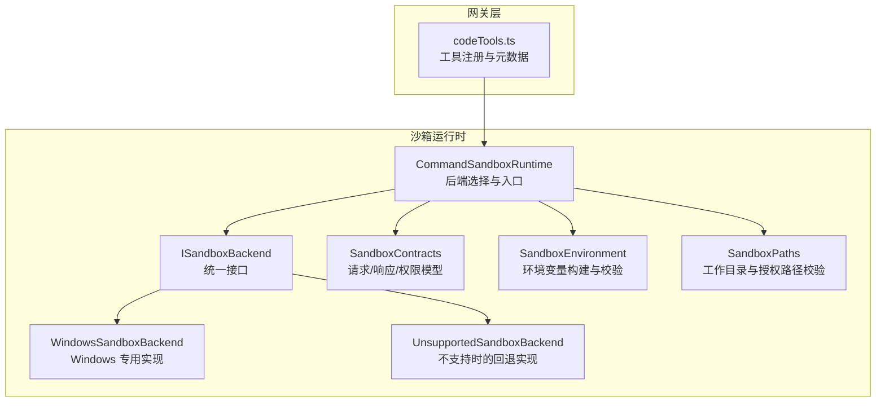
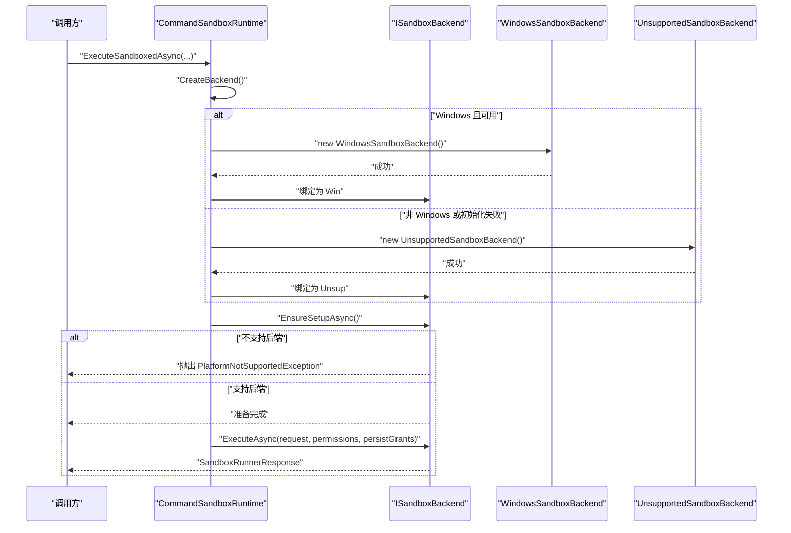
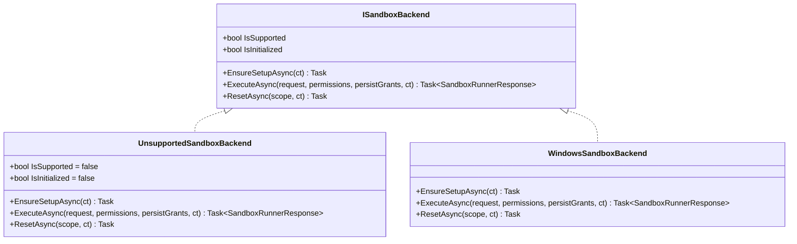
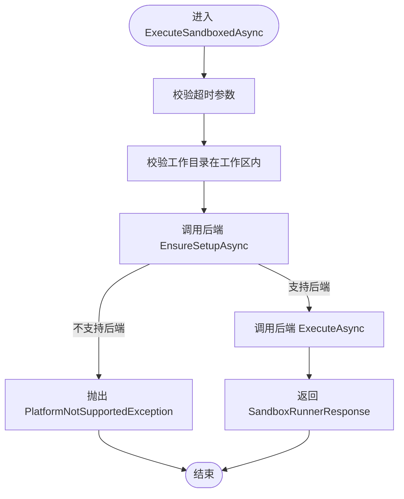
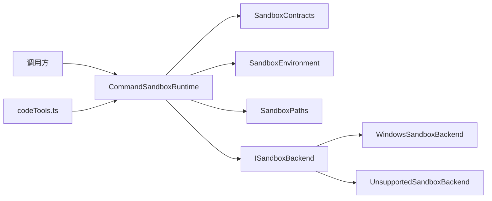

# 不支持的后端

<cite>
**本文引用的文件**   
- [UnsupportedSandboxBackend.cs](file://TinadecTools/Runtime/Sandbox/UnsupportedSandboxBackend.cs)
- [CommandSandboxRuntime.cs](file://TinadecTools/Runtime/Sandbox/CommandSandboxRuntime.cs)
- [SandboxContracts.cs](file://TinadecTools/Runtime/Sandbox/SandboxContracts.cs)
- [SandboxEnvironment.cs](file://TinadecTools/Runtime/Sandbox/SandboxEnvironment.cs)
- [SandboxPaths.cs](file://TinadecTools/Runtime/Sandbox/SandboxPaths.cs)
- [WindowsSandboxBackend.cs](file://TinadecTools/Runtime/Sandbox/Windows/WindowsSandboxBackend.cs)
- [codeTools.ts](file://TinadecGateway/src/codeTools.ts)
</cite>

## 目录
1. [简介](#简介)
2. [项目结构](#项目结构)
3. [核心组件](#核心组件)
4. [架构总览](#架构总览)
5. [详细组件分析](#详细组件分析)
6. [依赖关系分析](#依赖关系分析)
7. [性能考量](#性能考量)
8. [故障排查指南](#故障排查指南)
9. [结论](#结论)
10. [附录](#附录)

## 简介
本文件面向“平台或环境不支持高级沙箱功能”的降级场景，系统性说明不支持后端（UnsupportedSandboxBackend）的实现、回退策略、功能限制与兼容性处理。文档涵盖错误信息提示、用户反馈建议以及替代方案，帮助开发者在无法启用安全沙箱时仍能保持系统可用性与可观测性。

## 项目结构
围绕“不支持的后端”，关键代码集中在 TinadecTools 的沙箱运行时模块中：
- 接口与协议定义：ISandboxBackend、SandboxRunnerRequest/Response、权限模型等
- 运行时选择器：根据操作系统与可用性动态选择具体后端，失败则回退到不支持后端
- 不支持后端：统一抛出平台不支持异常，确保调用方感知并做降级处理
- 环境与路径约束：环境变量白名单、工作目录与工作区边界校验
- 前端工具注册：沙箱执行工具的标识与摘要，便于上层编排与展示

图表来源 
- [CommandSandboxRuntime.cs:1-129](file://TinadecTools/Runtime/Sandbox/CommandSandboxRuntime.cs#L1-L129)
- [SandboxContracts.cs:1-71](file://TinadecTools/Runtime/Sandbox/SandboxContracts.cs#L1-L71)
- [SandboxEnvironment.cs:1-69](file://TinadecTools/Runtime/Sandbox/SandboxEnvironment.cs#L1-L69)
- [SandboxPaths.cs:1-113](file://TinadecTools/Runtime/Sandbox/SandboxPaths.cs#L1-L113)
- [WindowsSandboxBackend.cs:17](file://TinadecTools/Runtime/Sandbox/Windows/WindowsSandboxBackend.cs#L17)
- [codeTools.ts:235-240](file://TinadecGateway/src/codeTools.ts#L235-L240)

章节来源
- [CommandSandboxRuntime.cs:1-129](file://TinadecTools/Runtime/Sandbox/CommandSandboxRuntime.cs#L1-L129)
- [SandboxContracts.cs:1-71](file://TinadecTools/Runtime/Sandbox/SandboxContracts.cs#L1-L71)

## 核心组件
- 不支持后端 UnsupportedSandboxBackend
  - 能力声明：IsSupported=false，IsInitialized=false
  - 行为：EnsureSetupAsync 与 ExecuteAsync 直接抛出 PlatformNotSupportedException；ResetAsync 返回空任务
  - 作用：在不支持的环境中提供最小可用实现，使上层逻辑无需分支判断即可继续运行
- 运行时选择器 CommandSandboxRuntime
  - 启动时尝试创建 Windows 后端，若失败或非 Windows 平台，则回退为不支持后端
  - 对外暴露统一的 ExecuteSandboxedAsync 入口，内部委托给当前后端
- 协议与模型 SandboxContracts
  - 定义 ISandboxBackend 接口、SandboxRunnerRequest/Response、权限与策略模型
- 环境与路径约束
  - SandboxEnvironment：环境变量白名单与额外变量注入
  - SandboxPaths：工作目录必须在 workspace 内、禁止宽泛写入目标、计算能力 SID（Windows）

章节来源
- [UnsupportedSandboxBackend.cs:1-19](file://TinadecTools/Runtime/Sandbox/UnsupportedSandboxBackend.cs#L1-L19)
- [CommandSandboxRuntime.cs:1-129](file://TinadecTools/Runtime/Sandbox/CommandSandboxRuntime.cs#L1-L129)
- [SandboxContracts.cs:1-71](file://TinadecTools/Runtime/Sandbox/SandboxContracts.cs#L1-L71)
- [SandboxEnvironment.cs:1-69](file://TinadecTools/Runtime/Sandbox/SandboxEnvironment.cs#L1-L69)
- [SandboxPaths.cs:1-113](file://TinadecTools/Runtime/Sandbox/SandboxPaths.cs#L1-L113)

## 架构总览
下图展示了当平台不支持高级沙箱时的整体流程：选择器尝试加载具体后端，失败则使用不支持后端；调用方通过统一接口发起执行，遇到平台不支持异常后应进行降级处理。

图表来源 
- [CommandSandboxRuntime.cs:9-27](file://TinadecTools/Runtime/Sandbox/CommandSandboxRuntime.cs#L9-L27)
- [CommandSandboxRuntime.cs:96-122](file://TinadecTools/Runtime/Sandbox/CommandSandboxRuntime.cs#L96-L122)
- [UnsupportedSandboxBackend.cs:8-18](file://TinadecTools/Runtime/Sandbox/UnsupportedSandboxBackend.cs#L8-L18)
- [WindowsSandboxBackend.cs:17](file://TinadecTools/Runtime/Sandbox/Windows/WindowsSandboxBackend.cs#L17)

## 详细组件分析

### 不支持后端 UnsupportedSandboxBackend
- 设计要点
  - 最小化实现：仅声明不支持能力，所有需要实际执行的 API 均抛出平台不支持异常
  - Reset 无副作用：ResetAsync 直接返回已完成任务，避免上层因清理逻辑阻塞
- 错误语义
  - EnsureSetupAsync / ExecuteAsync 抛出 PlatformNotSupportedException，明确表达“当前平台不可用”
- 适用场景
  - 非 Windows 环境、Windows 但缺少必要组件导致后端初始化失败
- 兼容性与限制
  - IsSupported=false，IsInitialized=false，上层可通过该标志快速识别并切换策略
  - 不执行任何进程隔离或权限控制，需由上层补充安全措施或禁用相关功能

图表来源 
- [SandboxContracts.cs:52-63](file://TinadecTools/Runtime/Sandbox/SandboxContracts.cs#L52-L63)
- [UnsupportedSandboxBackend.cs:3-18](file://TinadecTools/Runtime/Sandbox/UnsupportedSandboxBackend.cs#L3-L18)
- [WindowsSandboxBackend.cs:17](file://TinadecTools/Runtime/Sandbox/Windows/WindowsSandboxBackend.cs#L17)

章节来源
- [UnsupportedSandboxBackend.cs:1-19](file://TinadecTools/Runtime/Sandbox/UnsupportedSandboxBackend.cs#L1-L19)
- [SandboxContracts.cs:52-63](file://TinadecTools/Runtime/Sandbox/SandboxContracts.cs#L52-L63)

### 运行时选择器 CommandSandboxRuntime
- 后端选择策略
  - 仅在 Windows 平台尝试创建 Windows 后端；若抛异常则回退到不支持后端
  - 非 Windows 平台直接选择不支持后端
- 统一入口
  - ExecuteSandboxedAsync 负责参数校验、工作目录验证、调用后端 EnsureSetupAsync 与 ExecuteAsync
- 测试支持
  - 提供 OverrideBackendForTests 用于替换后端以支持单元测试

图表来源 
- [CommandSandboxRuntime.cs:29-35](file://TinadecTools/Runtime/Sandbox/CommandSandboxRuntime.cs#L29-L35)
- [CommandSandboxRuntime.cs:96-122](file://TinadecTools/Runtime/Sandbox/CommandSandboxRuntime.cs#L96-L122)
- [UnsupportedSandboxBackend.cs:8-16](file://TinadecTools/Runtime/Sandbox/UnsupportedSandboxBackend.cs#L8-L16)

章节来源
- [CommandSandboxRuntime.cs:1-129](file://TinadecTools/Runtime/Sandbox/CommandSandboxRuntime.cs#L1-L129)

### 协议与模型 SandboxContracts
- 接口契约
  - ISandboxBackend：统一能力与生命周期方法
- 请求/响应
  - SandboxRunnerRequest：可执行文件、参数、工作目录、标准输入、超时、环境变量
  - SandboxRunnerResponse：成功标志、退出码、输出、是否超时、耗时、错误信息、输出截断标记
- 权限与策略
  - SandboxPermissions：读/写路径与环境变量名列表
  - SandboxPolicyFile：持久化的策略文件结构（版本、读写路径、环境变量）

章节来源
- [SandboxContracts.cs:1-71](file://TinadecTools/Runtime/Sandbox/SandboxContracts.cs#L1-L71)

### 环境与路径约束
- 环境变量
  - SandboxEnvironment.Build：从宿主保留一组必要环境变量，并可注入额外白名单变量；同时设置缓存目录相关变量
  - IsEnvironmentVariableNameValid：对变量名进行合法性校验
- 路径与安全
  - SandboxPaths.ValidateWorkingDirectory：强制工作目录位于 workspace 根下
  - EnsureNotBroadWriteTarget：禁止将磁盘根或敏感目录作为宽泛写入授权目标
  - DeriveCapabilitySid：基于工作区根派生能力 SID（Windows）

章节来源
- [SandboxEnvironment.cs:1-69](file://TinadecTools/Runtime/Sandbox/SandboxEnvironment.cs#L1-L69)
- [SandboxPaths.cs:1-113](file://TinadecTools/Runtime/Sandbox/SandboxPaths.cs#L1-L113)

### 网关层工具注册
- codeTools.ts 中注册了 sandbox_exec 工具，包含 id、摘要与审批摘要，便于上层编排与展示

章节来源
- [codeTools.ts:235-240](file://TinadecGateway/src/codeTools.ts#L235-L240)

## 依赖关系分析
- 耦合与内聚
  - CommandSandboxRuntime 对内聚了后端选择、参数校验与执行流程；对外仅暴露统一接口
  - UnsupportedSandboxBackend 与 WindowsSandboxBackend 共同实现 ISandboxBackend，解耦调用方与具体实现
- 外部依赖
  - 运行时依赖操作系统特性（Windows），在非 Windows 或初始化失败时回退
  - 网关层通过工具元数据与运行时交互，但不直接依赖后端实现细节

图表来源 
- [CommandSandboxRuntime.cs:1-129](file://TinadecTools/Runtime/Sandbox/CommandSandboxRuntime.cs#L1-L129)
- [SandboxContracts.cs:1-71](file://TinadecTools/Runtime/Sandbox/SandboxContracts.cs#L1-L71)
- [SandboxEnvironment.cs:1-69](file://TinadecTools/Runtime/Sandbox/SandboxEnvironment.cs#L1-L69)
- [SandboxPaths.cs:1-113](file://TinadecTools/Runtime/Sandbox/SandboxPaths.cs#L1-L113)
- [WindowsSandboxBackend.cs:17](file://TinadecTools/Runtime/Sandbox/Windows/WindowsSandboxBackend.cs#L17)
- [codeTools.ts:235-240](file://TinadecGateway/src/codeTools.ts#L235-L240)

章节来源
- [CommandSandboxRuntime.cs:1-129](file://TinadecTools/Runtime/Sandbox/CommandSandboxRuntime.cs#L1-L129)
- [SandboxContracts.cs:1-71](file://TinadecTools/Runtime/Sandbox/SandboxContracts.cs#L1-L71)

## 性能考量
- 不支持后端几乎无运行时开销，但会立即抛出异常，适合快速失败与短路
- 选择器在应用启动时仅进行一次后端探测，后续调用无额外分支成本
- 建议在调用层捕获 PlatformNotSupportedException，避免重复探测与频繁异常路径

[本节为通用指导，不涉及具体文件分析]

## 故障排查指南
- 常见错误
  - PlatformNotSupportedException：表示当前平台不支持沙箱后端（非 Windows 或 Windows 初始化失败）
  - UnauthorizedAccessException：工作目录不在 workspace 内或写入目标过于宽泛
  - DirectoryNotFoundException：指定目录不存在
- 定位步骤
  - 检查运行时选择器是否选择了 UnsupportedSandboxBackend
  - 确认操作系统与依赖组件是否满足 Windows 后端要求
  - 校验传入的工作目录与授权路径是否符合约束
- 用户反馈与替代方案
  - 向用户提示“当前环境不支持高级沙箱，已切换到兼容模式”
  - 建议升级操作系统或安装必要组件以启用完整沙箱能力
  - 在受限环境中禁用需要沙箱的功能，或改用受控的本地执行方式

章节来源
- [UnsupportedSandboxBackend.cs:8-16](file://TinadecTools/Runtime/Sandbox/UnsupportedSandboxBackend.cs#L8-L16)
- [SandboxPaths.cs:18-28](file://TinadecTools/Runtime/Sandbox/SandboxPaths.cs#L18-L28)
- [SandboxPaths.cs:50-60](file://TinadecTools/Runtime/Sandbox/SandboxPaths.cs#L50-L60)

## 结论
在不支持高级沙箱的环境中，系统通过 UnsupportedSandboxBackend 提供最小可用实现，并以明确的异常语义通知调用方。结合 CommandSandboxRuntime 的选择策略与严格的权限/路径约束，可在降级模式下保持系统稳定与可观测性。建议在上层增加友好的错误提示与替代方案引导，提升用户体验与可维护性。

[本节为总结性内容，不涉及具体文件分析]

## 附录
- 回退策略清单
  - 非 Windows 平台：直接使用不支持后端
  - Windows 平台初始化失败：捕获异常并回退到不支持后端
- 功能限制说明
  - 无进程隔离与权限控制
  - 所有执行类操作将抛出平台不支持异常
- 兼容性处理建议
  - 调用层捕获 PlatformNotSupportedException，切换至兼容模式
  - 在 UI 层显示“沙箱不可用”的状态与提示信息
  - 提供“升级到支持环境”的操作指引

[本节为概念性内容，不涉及具体文件分析]