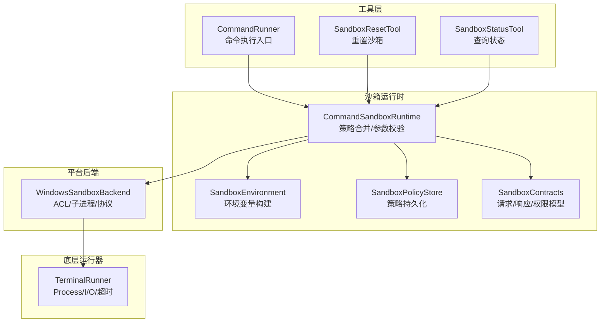
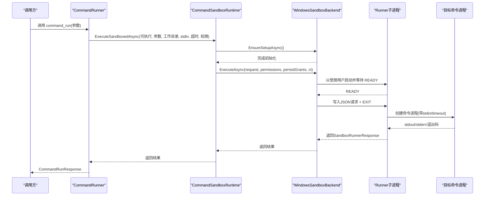
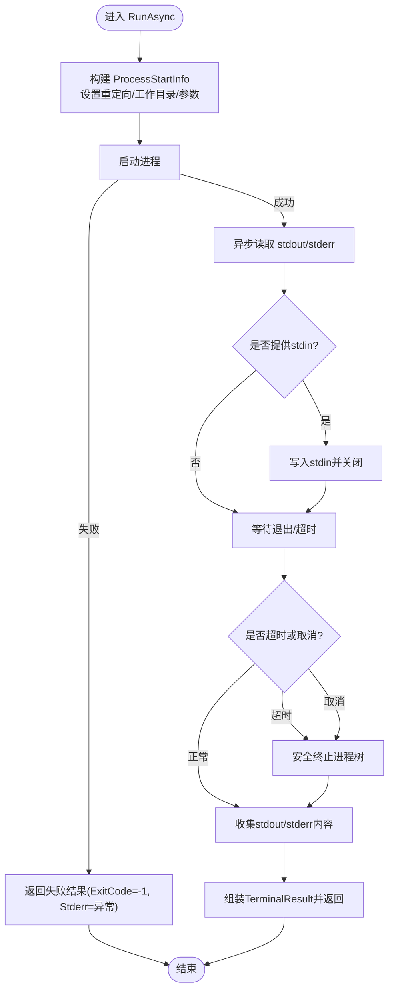
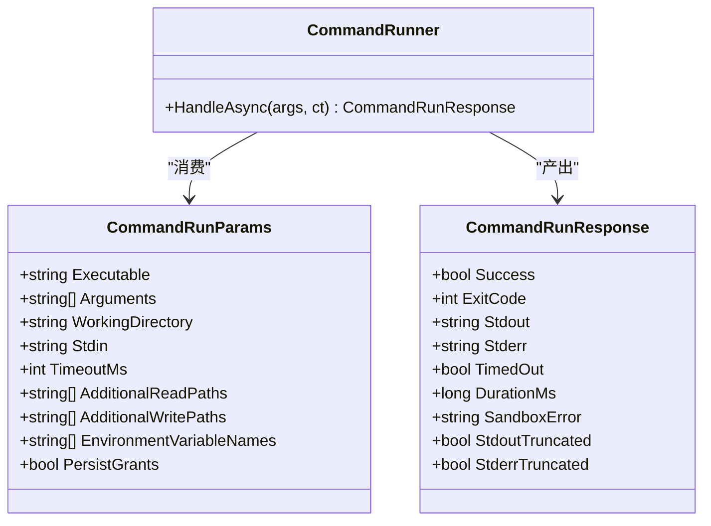
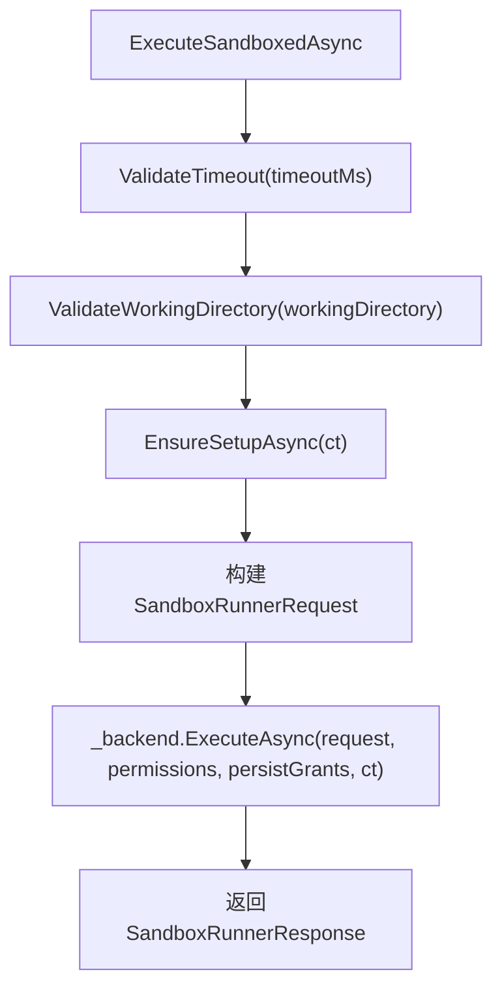
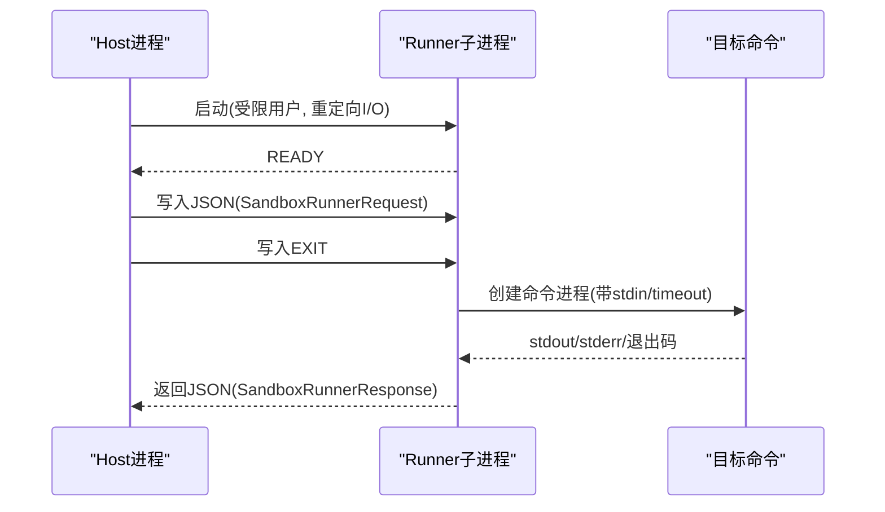
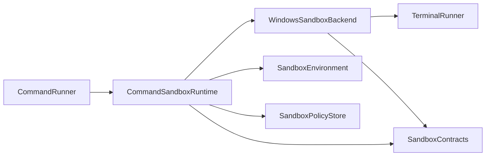

# 命令执行器

<cite>
**本文引用的文件**   
- [TerminalRunner.cs](file://TinadecTools/Runtime/TerminalRunner.cs)
- [CommandRunner.cs](file://TinadecTools/Tools/Command/CommandRunner.cs)
- [CommandSandboxRuntime.cs](file://TinadecTools/Runtime/Sandbox/CommandSandboxRuntime.cs)
- [SandboxEnvironment.cs](file://TinadecTools/Runtime/Sandbox/SandboxEnvironment.cs)
- [SandboxPolicyStore.cs](file://TinadecTools/Runtime/Sandbox/SandboxPolicyStore.cs)
- [WindowsSandboxBackend.cs](file://TinadecTools/Runtime/Sandbox/Windows/WindowsSandboxBackend.cs)
- [SandboxContracts.cs](file://TinadecTools/Runtime/Sandbox/SandboxContracts.cs)
- [SandboxResetTool.cs](file://TinadecTools/Tools/Command/SandboxResetTool.cs)
- [SandboxStatusTool.cs](file://TinadecTools/Tools/Command/SandboxStatusTool.cs)
- [CommandRunnerTests.cs](file://tests/TinadecTools.Tests/CommandRunnerTests.cs)
- [TerminalRunnerTests.cs](file://tests/TinadecTools.Tests/TerminalRunnerTests.cs)
</cite>

## 目录
1. [简介](#简介)
2. [项目结构](#项目结构)
3. [核心组件](#核心组件)
4. [架构总览](#架构总览)
5. [详细组件分析](#详细组件分析)
6. [依赖关系分析](#依赖关系分析)
7. [性能考量与调优](#性能考量与调优)
8. [故障排查指南](#故障排查指南)
9. [结论](#结论)
10. [附录：使用示例与最佳实践](#附录使用示例与最佳实践)

## 简介
本文件面向“命令执行器”子系统，系统性说明终端运行器的工作原理、命令执行流程、输入输出流管理、超时控制机制，以及工作目录管理、环境变量注入、标准输入输出处理与错误捕获。同时覆盖命令执行监控、日志记录建议与性能调优要点，并提供可操作的调用示例与最佳实践，帮助开发者在沙箱环境中安全、可控地执行外部命令。

## 项目结构
命令执行器由“工具层（对外暴露）—沙箱运行时（权限与环境）—平台后端（进程隔离）—底层终端运行器（进程与I/O）”四层构成。关键文件分布如下：
- 工具层：CommandRunner、SandboxResetTool、SandboxStatusTool
- 沙箱运行时：CommandSandboxRuntime、SandboxEnvironment、SandboxPolicyStore、SandboxContracts
- 平台后端：WindowsSandboxBackend（Windows 专用）
- 底层运行器：TerminalRunner（非沙箱直连进程）

**图表来源** 
- [CommandRunner.cs:79-133](file://TinadecTools/Tools/Command/CommandRunner.cs#L79-L133)
- [CommandSandboxRuntime.cs:96-122](file://TinadecTools/Runtime/Sandbox/CommandSandboxRuntime.cs#L96-L122)
- [WindowsSandboxBackend.cs:23-53](file://TinadecTools/Runtime/Sandbox/Windows/WindowsSandboxBackend.cs#L23-L53)
- [TerminalRunner.cs:18-110](file://TinadecTools/Runtime/TerminalRunner.cs#L18-L110)
- [SandboxEnvironment.cs:16-61](file://TinadecTools/Runtime/Sandbox/SandboxEnvironment.cs#L16-L61)
- [SandboxPolicyStore.cs:18-52](file://TinadecTools/Runtime/Sandbox/SandboxPolicyStore.cs#L18-L52)
- [SandboxContracts.cs:27-48](file://TinadecTools/Runtime/Sandbox/SandboxContracts.cs#L27-L48)

**章节来源**
- [CommandRunner.cs:79-133](file://TinadecTools/Tools/Command/CommandRunner.cs#L79-L133)
- [CommandSandboxRuntime.cs:96-122](file://TinadecTools/Runtime/Sandbox/CommandSandboxRuntime.cs#L96-L122)
- [WindowsSandboxBackend.cs:23-53](file://TinadecTools/Runtime/Sandbox/Windows/WindowsSandboxBackend.cs#L23-L53)
- [TerminalRunner.cs:18-110](file://TinadecTools/Runtime/TerminalRunner.cs#L18-L110)

## 核心组件
- 终端运行器 TerminalRunner：负责创建子进程、读写标准输入/输出/错误、超时控制与进程树安全终止。
- 命令工具 CommandRunner：对外暴露 command_run 工具，封装参数、权限与策略合并，调用沙箱运行时执行。
- 沙箱运行时 CommandSandboxRuntime：校验超时、规范化工作目录、加载并合并策略、选择后端并执行。
- 环境变量 SandboxEnvironment：从宿主保留必要变量，结合账户目录与额外白名单构建安全的环境集合。
- 策略存储 SandboxPolicyStore：读取/合并/持久化 .tinadec/sandbox.json，维护读/写路径与环境变量白名单。
- Windows 后端 WindowsSandboxBackend：通过 ACL 限制访问、以受限用户启动子进程、基于文本协议与 Runner 通信。
- 合约模型 SandboxContracts：定义权限、策略文件、请求/响应结构与后端接口。

**章节来源**
- [TerminalRunner.cs:18-110](file://TinadecTools/Runtime/TerminalRunner.cs#L18-L110)
- [CommandRunner.cs:79-133](file://TinadecTools/Tools/Command/CommandRunner.cs#L79-L133)
- [CommandSandboxRuntime.cs:29-122](file://TinadecTools/Runtime/Sandbox/CommandSandboxRuntime.cs#L29-L122)
- [SandboxEnvironment.cs:16-61](file://TinadecTools/Runtime/Sandbox/SandboxEnvironment.cs#L16-L61)
- [SandboxPolicyStore.cs:18-52](file://TinadecTools/Runtime/Sandbox/SandboxPolicyStore.cs#L18-L52)
- [WindowsSandboxBackend.cs:23-53](file://TinadecTools/Runtime/Sandbox/Windows/WindowsSandboxBackend.cs#L23-L53)
- [SandboxContracts.cs:10-48](file://TinadecTools/Runtime/Sandbox/SandboxContracts.cs#L10-L48)

## 架构总览
命令执行的端到端流程如下：
- 上层工具调用 CommandRunner.HandleAsync，构造工作目录与权限请求。
- CommandSandboxRuntime 校验超时、合并策略、验证工作目录，选择 ISandboxBackend。
- WindowsSandboxBackend 应用 ACL、构建受限环境、以受限用户启动 Runner 子进程，并通过 stdin/stdout 文本协议交换 JSON。
- 实际命令在受限环境下执行，结果经 Runner 返回给上层，最终封装为 CommandRunResponse。

**图表来源** 
- [CommandRunner.cs:82-132](file://TinadecTools/Tools/Command/CommandRunner.cs#L82-L132)
- [CommandSandboxRuntime.cs:96-122](file://TinadecTools/Runtime/Sandbox/CommandSandboxRuntime.cs#L96-L122)
- [WindowsSandboxBackend.cs:99-153](file://TinadecTools/Runtime/Sandbox/Windows/WindowsSandboxBackend.cs#L99-L153)
- [SandboxContracts.cs:27-48](file://TinadecTools/Runtime/Sandbox/SandboxContracts.cs#L27-L48)

## 详细组件分析

### 终端运行器 TerminalRunner
- 功能要点
  - 使用 ProcessStartInfo 配置可执行文件、参数、工作目录、重定向 I/O、无窗口模式。
  - 异步读取 stdout/stderr，支持最大字符数截断，避免内存膨胀。
  - 支持传入 stdin；若为空则不重定向标准输入。
  - 超时控制：基于 CancellationTokenSource 与 WaitForExitAsync；超时后安全终止整个进程树。
  - 异常捕获：启动失败时返回失败结果，stderr 包含异常信息。
  - 计时统计：记录 DurationMs 用于监控与性能分析。
- 数据流
  - 启动进程 → 并行读取 stdout/stderr → 可选写入 stdin → 等待退出或超时 → 汇总结果。
- 复杂度与边界
  - I/O 读取采用缓冲循环，时间复杂度与输出大小线性相关；空间受 maxOutputChars 限制。
  - 大输出场景不会死锁，因为读写分离且使用异步流。
- 错误处理
  - 启动异常：返回 ExitCode=-1，Stderr=异常消息。
  - 超时：TimedOut=true，ExitCode=-1，并尝试 Kill(entireProcessTree: true)。
  - 取消令牌：外层取消会传播到进程等待，确保及时释放资源。

**图表来源** 
- [TerminalRunner.cs:18-110](file://TinadecTools/Runtime/TerminalRunner.cs#L18-L110)

**章节来源**
- [TerminalRunner.cs:18-110](file://TinadecTools/Runtime/TerminalRunner.cs#L18-L110)
- [TerminalRunnerTests.cs:7-78](file://tests/TinadecTools.Tests/TerminalRunnerTests.cs#L7-L78)

### 命令工具 CommandRunner
- 功能要点
  - 接收 command_run 参数，默认工作目录为工作区根。
  - 构建权限请求（读/写路径、环境变量名），可选择持久化策略。
  - 调用 CommandSandboxRuntime.ExecuteSandboxedAsync 执行，并将结果映射为 CommandRunResponse。
  - 异常统一包装为 SandboxError。
- 输入输出
  - 输入：executable、arguments、working_directory、stdin、timeout_ms、additional_read_paths、additional_write_paths、environment_variable_names、persist_grants。
  - 输出：success、exit_code、stdout、stderr、timed_out、duration_ms、sandbox_error、stdout_truncated、stderr_truncated。
- 典型调用路径
  - HandleAsync → BuildPermissions → MergeWithPolicy → ExecuteSandboxedAsync → 返回响应。

**图表来源** 
- [CommandRunner.cs:10-69](file://TinadecTools/Tools/Command/CommandRunner.cs#L10-L69)
- [CommandRunner.cs:79-133](file://TinadecTools/Tools/Command/CommandRunner.cs#L79-L133)

**章节来源**
- [CommandRunner.cs:79-133](file://TinadecTools/Tools/Command/CommandRunner.cs#L79-L133)
- [CommandRunnerTests.cs:9-79](file://tests/TinadecTools.Tests/CommandRunnerTests.cs#L9-L79)

### 沙箱运行时 CommandSandboxRuntime
- 功能要点
  - 超时校验：1..1_800_000 ms，越界抛出异常。
  - 工作目录校验：规范化并验证在工作区内。
  - 权限构建：合并工作区默认读/写路径与附加路径，过滤无效环境变量名。
  - 策略合并：加载 sandbox.json，去重合并读/写路径与环境变量。
  - 后端选择：Windows 平台优先使用 WindowsSandboxBackend，否则回退到 Unsupported。
  - 执行入口：ExecuteSandboxedAsync 组装请求并调用后端。
- 关键点
  - 测试支持：OverrideBackendForTests 允许替换后端进行单元测试。
  - 策略持久化：MergeAndPersist 可将临时授权写入策略文件。

**图表来源** 
- [CommandSandboxRuntime.cs:29-122](file://TinadecTools/Runtime/Sandbox/CommandSandboxRuntime.cs#L29-L122)

**章节来源**
- [CommandSandboxRuntime.cs:29-122](file://TinadecTools/Runtime/Sandbox/CommandSandboxRuntime.cs#L29-L122)

### 环境变量构建 SandboxEnvironment
- 行为说明
  - 从宿主保留一组基础环境变量（如 PATH、TEMP、OS、代理等）。
  - 根据沙箱账户目录注入 PROFILE、APPDATA、LOCALAPPDATA、TEMP/TMP 等。
  - 根据缓存目录注入 NPM_CONFIG_CACHE、NUGET_PACKAGES、PIP_CACHE_DIR、CARGO_HOME 等。
  - 按白名单 environment_variable_names 追加额外变量。
  - 变量名合法性检查：不允许包含 '=' 和 '\0'。
- 安全性
  - 仅保留必要变量，避免敏感信息泄露。
  - 严格校验变量名，防止注入攻击。

**章节来源**
- [SandboxEnvironment.cs:16-61](file://TinadecTools/Runtime/Sandbox/SandboxEnvironment.cs#L16-L61)
- [SandboxEnvironment.cs:63-67](file://TinadecTools/Runtime/Sandbox/SandboxEnvironment.cs#L63-L67)

### 策略存储 SandboxPolicyStore
- 行为说明
  - 位置：工作区根/.tinadec/sandbox.json。
  - 读取：不存在或解析失败时返回空策略（版本=CurrentVersion）。
  - 合并：Union 读/写路径与环境变量，去重并按平台区分大小写规则。
  - 保存：自动创建目录并序列化策略。
  - 删除：清理策略文件（尽力而为）。
- 用途
  - 配合 persist_grants 将临时授权持久化，减少重复审批。

**章节来源**
- [SandboxPolicyStore.cs:18-52](file://TinadecTools/Runtime/Sandbox/SandboxPolicyStore.cs#L18-L52)
- [SandboxPolicyStore.cs:64-69](file://TinadecTools/Runtime/Sandbox/SandboxPolicyStore.cs#L64-L69)

### Windows 后端 WindowsSandboxBackend
- 行为说明
  - 初始化：检查平台支持与账户存在，必要时执行 Setup。
  - 权限应用：对 workspace 授予写权限，对 .tinadec 拒绝所有，对额外路径按需授予读/写。
  - 环境构建：基于账户目录与白名单生成受限环境变量。
  - 子进程协议：启动 Runner 子进程，等待 READY，发送 JSON 请求与 EXIT，读取结果。
  - 清理：非持久化授权时撤销 ACL。
- 协议细节
  - stdin/stdout 使用 UTF-8，行协议：READY → JSON → EXIT → 结果 JSON。
  - 失败路径：未收到 READY 或结果为空时，返回错误信息。

**图表来源** 
- [WindowsSandboxBackend.cs:99-153](file://TinadecTools/Runtime/Sandbox/Windows/WindowsSandboxBackend.cs#L99-L153)

**章节来源**
- [WindowsSandboxBackend.cs:23-53](file://TinadecTools/Runtime/Sandbox/Windows/WindowsSandboxBackend.cs#L23-L53)
- [WindowsSandboxBackend.cs:99-153](file://TinadecTools/Runtime/Sandbox/Windows/WindowsSandboxBackend.cs#L99-L153)

### 合约模型 SandboxContracts
- 类型概览
  - SandboxPermissions：读/写路径与环境变量白名单。
  - SandboxPolicyFile：策略文件结构（version、read_paths、write_paths、environment_variables）。
  - SandboxRunnerRequest：跨进程请求（executable、arguments、working_directory、stdin、timeout_ms、environment）。
  - SandboxRunnerResponse：跨进程响应（success、exit_code、stdout、stderr、timed_out、duration_ms、error、truncation flags）。
  - ISandboxBackend：后端抽象（IsSupported、IsInitialized、EnsureSetupAsync、ExecuteAsync、ResetAsync）。

**章节来源**
- [SandboxContracts.cs:10-48](file://TinadecTools/Runtime/Sandbox/SandboxContracts.cs#L10-L48)
- [SandboxContracts.cs:52-63](file://TinadecTools/Runtime/Sandbox/SandboxContracts.cs#L52-L63)

### 辅助工具：重置与状态
- SandboxResetTool：支持 workspace/machine 范围重置，清理策略、账户与缓存目录。
- SandboxStatusTool：返回 supported、initialized、policy_configured 三项状态。

**章节来源**
- [SandboxResetTool.cs:30-51](file://TinadecTools/Tools/Command/SandboxResetTool.cs#L30-L51)
- [SandboxStatusTool.cs:26-44](file://TinadecTools/Tools/Command/SandboxStatusTool.cs#L26-L44)

## 依赖关系分析
- 组件耦合
  - CommandRunner 依赖 CommandSandboxRuntime 与策略存储。
  - CommandSandboxRuntime 依赖后端实现与环境/策略模块。
  - WindowsSandboxBackend 依赖 ACL、账户管理、DPAPI、进程与文本协议。
  - TerminalRunner 被后端用于实际命令执行（或通过 Runner 间接执行）。
- 外部依赖
  - System.Diagnostics.Process 用于进程管理与 I/O。
  - System.Text.Json 用于序列化请求/响应与策略文件。
- 潜在循环
  - 当前设计无循环依赖，职责清晰分层。

**图表来源** 
- [CommandRunner.cs:79-133](file://TinadecTools/Tools/Command/CommandRunner.cs#L79-L133)
- [CommandSandboxRuntime.cs:96-122](file://TinadecTools/Runtime/Sandbox/CommandSandboxRuntime.cs#L96-L122)
- [WindowsSandboxBackend.cs:23-53](file://TinadecTools/Runtime/Sandbox/Windows/WindowsSandboxBackend.cs#L23-L53)
- [TerminalRunner.cs:18-110](file://TinadecTools/Runtime/TerminalRunner.cs#L18-L110)

**章节来源**
- [CommandRunner.cs:79-133](file://TinadecTools/Tools/Command/CommandRunner.cs#L79-L133)
- [CommandSandboxRuntime.cs:96-122](file://TinadecTools/Runtime/Sandbox/CommandSandboxRuntime.cs#L96-L122)
- [WindowsSandboxBackend.cs:23-53](file://TinadecTools/Runtime/Sandbox/Windows/WindowsSandboxBackend.cs#L23-L53)

## 性能考量与调优
- I/O 缓冲与截断
  - TerminalRunner 使用固定大小缓冲区与最大字符限制，避免大输出导致内存暴涨。
  - 建议在调用方合理设置 maxOutputChars，避免不必要的大块传输。
- 超时与取消
  - 超时上限 30 分钟，避免长时间占用资源；结合 CancellationToken 快速释放。
  - 对于长耗时任务，建议分片执行或后台队列。
- 进程树终止
  - 超时或取消时强制终止整个进程树，防止僵尸进程；注意可能影响子进程链。
- 策略合并与权限最小化
  - 仅授予必要的读/写路径与环境变量，减少文件系统与系统调用开销。
- 监控指标
  - 关注 DurationMs、ExitCode、TimedOut、StdoutTruncated/StderrTruncated，用于定位慢命令与输出过大问题。
- 日志建议
  - 记录命令、参数、工作目录、超时、退出码与耗时；对 stderr 做采样或脱敏。
  - 避免记录敏感环境变量值与完整 stdin/stdout。

[本节为通用指导，不直接分析具体文件]

## 故障排查指南
- 常见错误与定位
  - 启动失败：检查 executable 是否存在、PATH 是否正确、权限是否足够。
  - 超时：确认 timeout_ms 是否过小；观察 TimedOut 标志与 DurationMs。
  - 输出截断：检查 maxOutputChars 与 stdout_truncated/stderr_truncated。
  - 权限不足：查看 additional_read_paths/additional_write_paths 与策略文件。
  - 环境变量缺失：核对 environment_variable_names 白名单。
- 诊断步骤
  - 使用 sandbox_status 检查支持性与初始化状态。
  - 使用 sandbox_reset 清理策略与缓存后重试。
  - 在本地用 TerminalRunner 直接执行以排除沙箱因素。
- 日志与调试
  - 启用 Runner 子进程的 stderr 输出，定位 READY 阶段失败原因。
  - 检查 .tinadec/sandbox.json 内容与权限变更。

**章节来源**
- [CommandRunnerTests.cs:40-79](file://tests/TinadecTools.Tests/CommandRunnerTests.cs#L40-L79)
- [TerminalRunnerTests.cs:40-78](file://tests/TinadecTools.Tests/TerminalRunnerTests.cs#L40-L78)
- [SandboxStatusTool.cs:26-44](file://TinadecTools/Tools/Command/SandboxStatusTool.cs#L26-L44)
- [SandboxResetTool.cs:30-51](file://TinadecTools/Tools/Command/SandboxResetTool.cs#L30-L51)

## 结论
命令执行器通过“工具—沙箱运行时—平台后端—终端运行器”的分层设计，实现了安全的命令执行能力。其核心优势在于：
- 严格的权限与环境控制（ACL、环境变量白名单、策略持久化）。
- 健壮的 I/O 与超时控制（异步流、截断、进程树终止）。
- 清晰的监控与可观测性（耗时、退出码、截断标志、错误信息）。
在实际使用中，建议遵循最小权限原则、合理设置超时与输出限制，并结合日志与监控持续优化。

[本节为总结性内容，不直接分析具体文件]

## 附录：使用示例与最佳实践
- 基本命令执行
  - 调用 command_run，指定 executable、arguments、timeout_ms。
  - 如需标准输入，提供 stdin；如需自定义工作目录，提供 working_directory。
- 权限与环境
  - 通过 additional_read_paths 与 additional_write_paths 精确授权。
  - 通过 environment_variable_names 白名单注入必要环境变量。
  - 需要持久化授权时设置 persist_grants=true。
- 超时与监控
  - 合理设置 timeout_ms（建议 1s..30min），结合 TimedOut 与 DurationMs 评估性能。
  - 关注 stdout_truncated/stderr_truncated，必要时调整输出限制。
- 安全与合规
  - 避免传递敏感环境变量值；对 stderr 做脱敏。
  - 定期审查 .tinadec/sandbox.json，清理不再需要的授权。
- 故障恢复
  - 使用 sandbox_reset 清理策略与缓存；使用 sandbox_status 检查状态。
  - 在本地用 TerminalRunner 复现问题，缩小范围。

**章节来源**
- [CommandRunner.cs:10-69](file://TinadecTools/Tools/Command/CommandRunner.cs#L10-L69)
- [CommandSandboxRuntime.cs:37-94](file://TinadecTools/Runtime/Sandbox/CommandSandboxRuntime.cs#L37-L94)
- [SandboxEnvironment.cs:16-61](file://TinadecTools/Runtime/Sandbox/SandboxEnvironment.cs#L16-L61)
- [SandboxPolicyStore.cs:64-69](file://TinadecTools/Runtime/Sandbox/SandboxPolicyStore.cs#L64-L69)
- [SandboxStatusTool.cs:26-44](file://TinadecTools/Tools/Command/SandboxStatusTool.cs#L26-L44)
- [SandboxResetTool.cs:30-51](file://TinadecTools/Tools/Command/SandboxResetTool.cs#L30-L51)