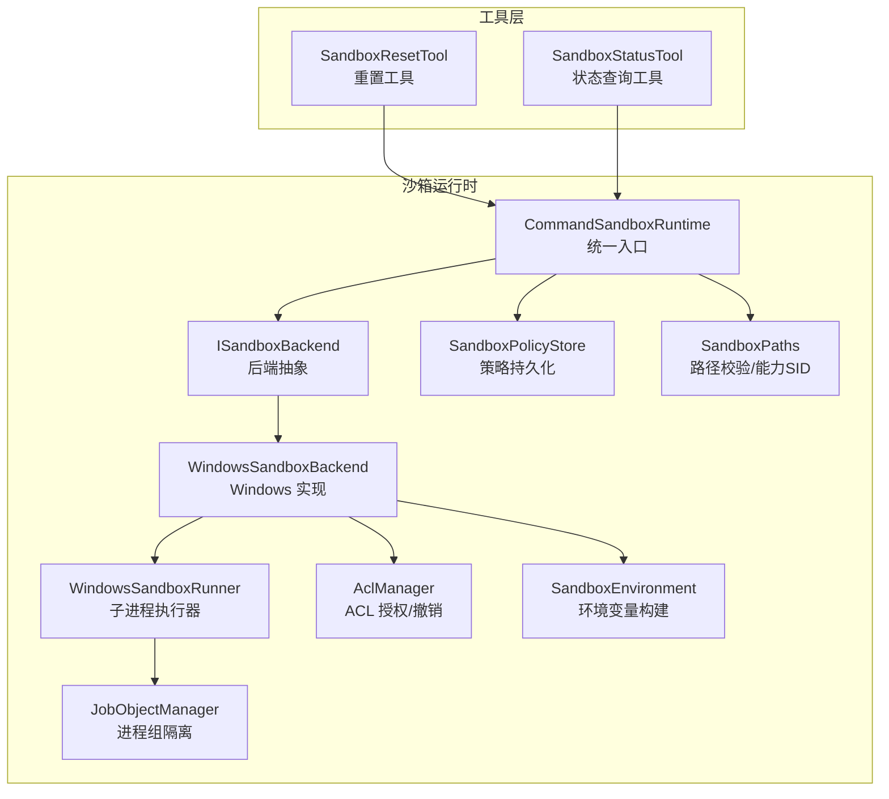
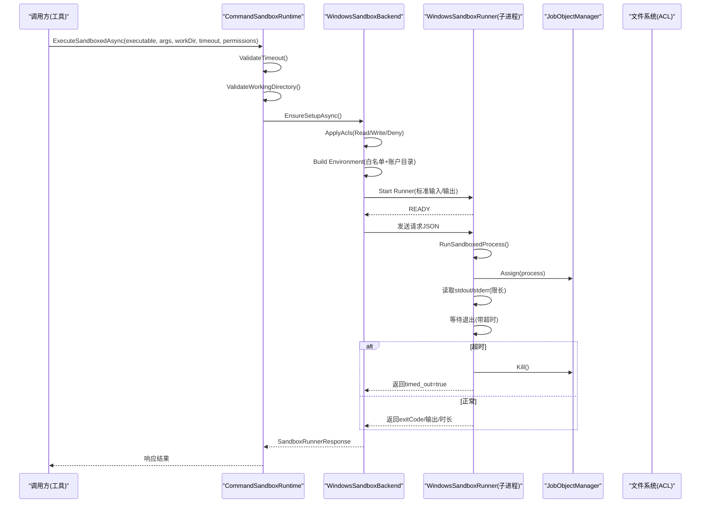
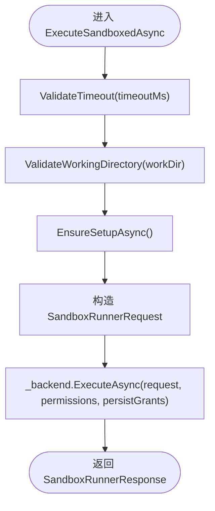
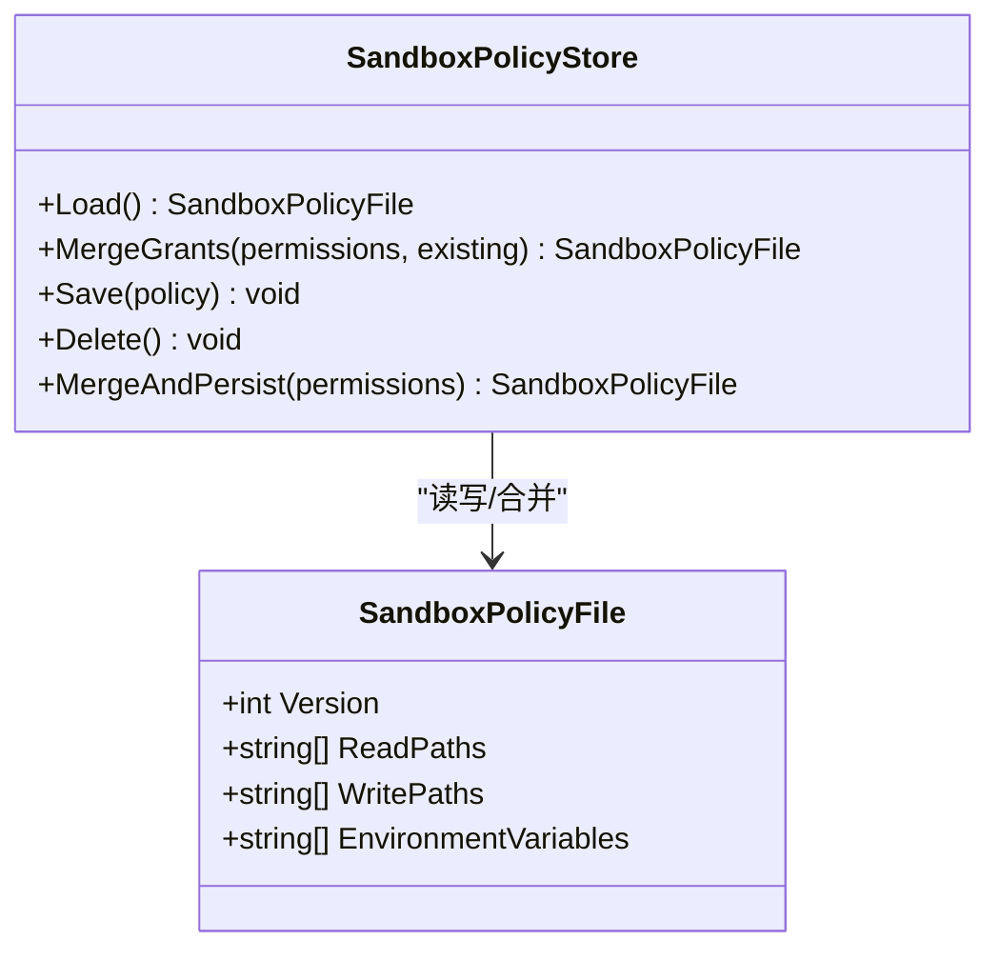
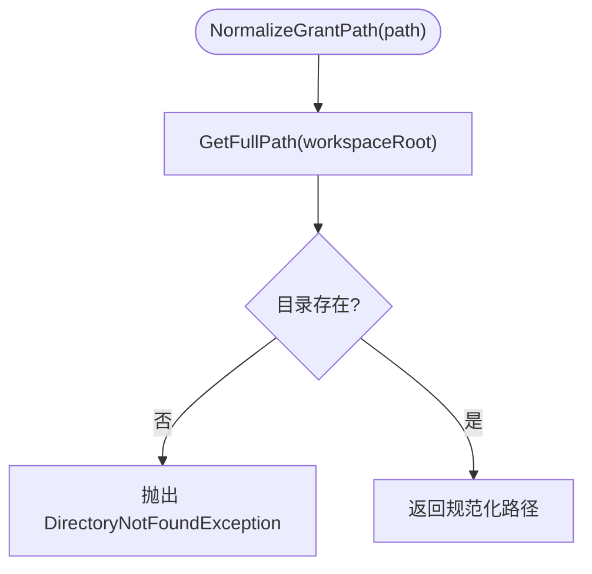
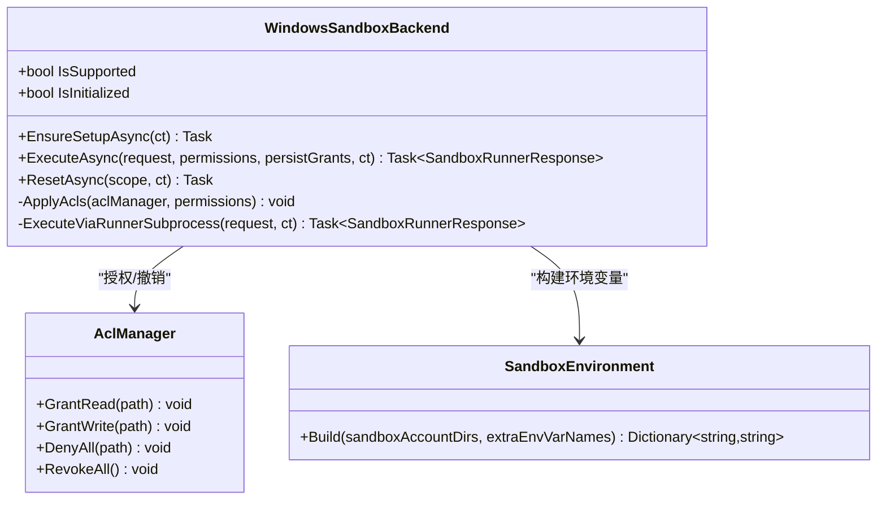
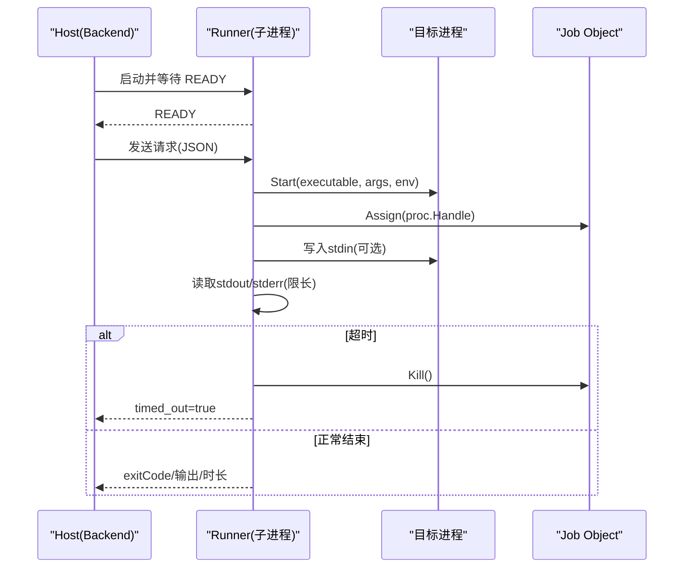
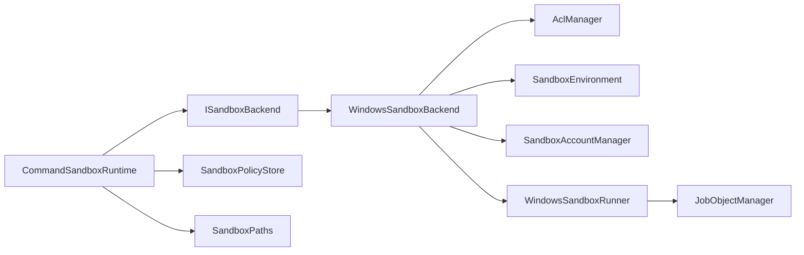

# 沙箱系统

<cite>
**本文引用的文件**   
- [CommandSandboxRuntime.cs](file://TinadecTools/Runtime/Sandbox/CommandSandboxRuntime.cs)
- [SandboxPolicyStore.cs](file://TinadecTools/Runtime/Sandbox/SandboxPolicyStore.cs)
- [SandboxEnvironment.cs](file://TinadecTools/Runtime/Sandbox/SandboxEnvironment.cs)
- [SandboxPaths.cs](file://TinadecTools/Runtime/Sandbox/SandboxPaths.cs)
- [WindowsSandboxBackend.cs](file://TinadecTools/Runtime/Sandbox/Windows/WindowsSandboxBackend.cs)
- [WindowsSandboxRunner.cs](file://TinadecTools/Runtime/Sandbox/Windows/WindowsSandboxRunner.cs)
- [JobObjectManager.cs](file://TinadecTools/Runtime/Sandbox/Windows/JobObjectManager.cs)
- [AclManager.cs](file://TinadecTools/Runtime/Sandbox/Windows/AclManager.cs)
- [SandboxContracts.cs](file://TinadecTools/Runtime/Sandbox/SandboxContracts.cs)
- [SandboxResetTool.cs](file://TinadecTools/Tools/Command/SandboxResetTool.cs)
- [SandboxStatusTool.cs](file://TinadecTools/Tools/Command/SandboxStatusTool.cs)
- [SandboxAccountManager.cs](file://TinadecTools/Runtime/Sandbox/Windows/SandboxAccountManager.cs)
- [WindowsSandboxSetup.cs](file://TinadecTools/Runtime/Sandbox/Windows/WindowsSandboxSetup.cs)
- [SandboxRuntimeTests.cs](file://tests/TinadecTools.Tests/SandboxRuntimeTests.cs)
</cite>

## 目录
1. [简介](#简介)
2. [项目结构](#项目结构)
3. [核心组件](#核心组件)
4. [架构总览](#架构总览)
5. [详细组件分析](#详细组件分析)
6. [依赖关系分析](#依赖关系分析)
7. [性能考量](#性能考量)
8. [故障排查指南](#故障排查指南)
9. [结论](#结论)
10. [附录](#附录)

## 简介
本文件系统性阐述 TinadecOffice 中的沙箱化执行环境，重点覆盖以下方面：
- 设计原理与进程隔离机制
- 资源限制策略（超时、输出大小、进程组）
- 权限管理与路径访问控制（ACL、工作区约束、宽泛写入禁止）
- 策略文件配置（sandbox.json）与环境变量白名单
- 生命周期管理、重置机制与故障恢复
- 配置示例与安全最佳实践

该实现当前以 Windows 平台为主，通过独立子进程运行“沙箱执行器”，结合 Job Object 进行进程组隔离与强制终止，使用 ACL 对文件系统访问进行最小授权。

## 项目结构
沙箱相关代码集中在 TinadecTools/Runtime/Sandbox 及其 Windows 子目录中，并通过 Tools/Command 暴露工具接口供上层调用。测试位于 tests/TinadecTools.Tests。

**图表来源** 
- [CommandSandboxRuntime.cs:1-129](file://TinadecTools/Runtime/Sandbox/CommandSandboxRuntime.cs#L1-L129)
- [WindowsSandboxBackend.cs:1-161](file://TinadecTools/Runtime/Sandbox/Windows/WindowsSandboxBackend.cs#L1-L161)
- [WindowsSandboxRunner.cs:1-178](file://TinadecTools/Runtime/Sandbox/Windows/WindowsSandboxRunner.cs#L1-L178)
- [JobObjectManager.cs:1-63](file://TinadecTools/Runtime/Sandbox/Windows/JobObjectManager.cs#L1-L63)
- [AclManager.cs:1-62](file://TinadecTools/Runtime/Sandbox/Windows/AclManager.cs#L1-L62)
- [SandboxEnvironment.cs:1-69](file://TinadecTools/Runtime/Sandbox/SandboxEnvironment.cs#L1-L69)
- [SandboxPolicyStore.cs:1-83](file://TinadecTools/Runtime/Sandbox/SandboxPolicyStore.cs#L1-L83)
- [SandboxPaths.cs:1-113](file://TinadecTools/Runtime/Sandbox/SandboxPaths.cs#L1-L113)
- [SandboxResetTool.cs:1-52](file://TinadecTools/Tools/Command/SandboxResetTool.cs#L1-L52)
- [SandboxStatusTool.cs:1-45](file://TinadecTools/Tools/Command/SandboxStatusTool.cs#L1-L45)

**章节来源**
- [CommandSandboxRuntime.cs:1-129](file://TinadecTools/Runtime/Sandbox/CommandSandboxRuntime.cs#L1-L129)
- [SandboxPolicyStore.cs:1-83](file://TinadecTools/Runtime/Sandbox/SandboxPolicyStore.cs#L1-L83)
- [SandboxEnvironment.cs:1-69](file://TinadecTools/Runtime/Sandbox/SandboxEnvironment.cs#L1-L69)
- [SandboxPaths.cs:1-113](file://TinadecTools/Runtime/Sandbox/SandboxPaths.cs#L1-L113)
- [WindowsSandboxBackend.cs:1-161](file://TinadecTools/Runtime/Sandbox/Windows/WindowsSandboxBackend.cs#L1-L161)
- [WindowsSandboxRunner.cs:1-178](file://TinadecTools/Runtime/Sandbox/Windows/WindowsSandboxRunner.cs#L1-L178)
- [JobObjectManager.cs:1-63](file://TinadecTools/Runtime/Sandbox/Windows/JobObjectManager.cs#L1-L63)
- [AclManager.cs:1-62](file://TinadecTools/Runtime/Sandbox/Windows/AclManager.cs#L1-L62)
- [SandboxContracts.cs:1-71](file://TinadecTools/Runtime/Sandbox/SandboxContracts.cs#L1-L71)
- [SandboxResetTool.cs:1-52](file://TinadecTools/Tools/Command/SandboxResetTool.cs#L1-L52)
- [SandboxStatusTool.cs:1-45](file://TinadecTools/Tools/Command/SandboxStatusTool.cs#L1-L45)
- [SandboxAccountManager.cs:1-88](file://TinadecTools/Runtime/Sandbox/Windows/SandboxAccountManager.cs#L1-L88)
- [WindowsSandboxSetup.cs:1-86](file://TinadecTools/Runtime/Sandbox/Windows/WindowsSandboxSetup.cs#L1-L86)
- [SandboxRuntimeTests.cs:1-57](file://tests/TinadecTools.Tests/SandboxRuntimeTests.cs#L1-L57)

## 核心组件
- CommandSandboxRuntime：统一入口，负责后端选择、参数校验、权限合并、工作目录校验、以及调用后端执行。
- ISandboxBackend：后端抽象，定义支持性检查、初始化、执行、重置等能力。
- WindowsSandboxBackend：Windows 平台实现，负责 ACL 授权、环境变量注入、启动 Runner 子进程、结果回传与清理。
- WindowsSandboxRunner：独立的子进程执行器，接收 JSON 指令，创建目标进程，使用 Job Object 进行进程组隔离与超时终止，限制输出大小。
- SandboxPolicyStore：读写 .tinadec/sandbox.json 策略文件，合并并去重授权路径与环境变量名。
- SandboxEnvironment：构建受限的环境变量集合，仅保留必要系统变量与显式白名单。
- SandboxPaths：工作区边界校验、外部授权路径规范化、禁止宽泛写入目标、派生能力 SID。
- AclManager：基于 NTFS ACL 的细粒度授权与撤销。
- JobObjectManager：封装 Job Object API，设置关闭即杀、分配进程、批量终止。
- 工具层：SandboxResetTool、SandboxStatusTool 提供重置与状态查询能力。

**章节来源**
- [CommandSandboxRuntime.cs:1-129](file://TinadecTools/Runtime/Sandbox/CommandSandboxRuntime.cs#L1-L129)
- [SandboxContracts.cs:1-71](file://TinadecTools/Runtime/Sandbox/SandboxContracts.cs#L1-L71)
- [WindowsSandboxBackend.cs:1-161](file://TinadecTools/Runtime/Sandbox/Windows/WindowsSandboxBackend.cs#L1-L161)
- [WindowsSandboxRunner.cs:1-178](file://TinadecTools/Runtime/Sandbox/Windows/WindowsSandboxRunner.cs#L1-L178)
- [SandboxPolicyStore.cs:1-83](file://TinadecTools/Runtime/Sandbox/SandboxPolicyStore.cs#L1-L83)
- [SandboxEnvironment.cs:1-69](file://TinadecTools/Runtime/Sandbox/SandboxEnvironment.cs#L1-L69)
- [SandboxPaths.cs:1-113](file://TinadecTools/Runtime/Sandbox/SandboxPaths.cs#L1-L113)
- [AclManager.cs:1-62](file://TinadecTools/Runtime/Sandbox/Windows/AclManager.cs#L1-L62)
- [JobObjectManager.cs:1-63](file://TinadecTools/Runtime/Sandbox/Windows/JobObjectManager.cs#L1-L63)
- [SandboxResetTool.cs:1-52](file://TinadecTools/Tools/Command/SandboxResetTool.cs#L1-L52)
- [SandboxStatusTool.cs:1-45](file://TinadecTools/Tools/Command/SandboxStatusTool.cs#L1-L45)

## 架构总览
下图展示从工具调用到子进程执行的完整序列，包括权限应用、环境变量注入、Job Object 隔离、超时处理与结果返回。

**图表来源** 
- [CommandSandboxRuntime.cs:96-122](file://TinadecTools/Runtime/Sandbox/CommandSandboxRuntime.cs#L96-L122)
- [WindowsSandboxBackend.cs:23-53](file://TinadecTools/Runtime/Sandbox/Windows/WindowsSandboxBackend.cs#L23-L53)
- [WindowsSandboxRunner.cs:74-154](file://TinadecTools/Runtime/Sandbox/Windows/WindowsSandboxRunner.cs#L74-L154)
- [JobObjectManager.cs:10-40](file://TinadecTools/Runtime/Sandbox/Windows/JobObjectManager.cs#L10-L40)
- [AclManager.cs:17-38](file://TinadecTools/Runtime/Sandbox/Windows/AclManager.cs#L17-L38)

## 详细组件分析

### 命令沙箱运行时 CommandSandboxRuntime
- 职责
  - 根据操作系统选择后端（Windows/Unsupported）。
  - 校验超时范围（1ms~1800000ms）。
  - 构建权限对象（默认包含工作区读写、可选额外路径与环境变量名）。
  - 合并策略文件与调用方权限（去重、忽略空值）。
  - 校验工作目录在工作区内且存在。
  - 调用后端执行并返回结果。
- 关键点
  - 超时校验防止过长阻塞。
  - 工作目录与工作区强绑定，避免逃逸。
  - 策略合并保证最小授权累积。

**图表来源** 
- [CommandSandboxRuntime.cs:29-35](file://TinadecTools/Runtime/Sandbox/CommandSandboxRuntime.cs#L29-L35)
- [CommandSandboxRuntime.cs:96-122](file://TinadecTools/Runtime/Sandbox/CommandSandboxRuntime.cs#L96-L122)

**章节来源**
- [CommandSandboxRuntime.cs:1-129](file://TinadecTools/Runtime/Sandbox/CommandSandboxRuntime.cs#L1-L129)

### 策略存储 SandboxPolicyStore
- 职责
  - 加载/保存/删除 .tinadec/sandbox.json。
  - 合并授权路径与环境变量名（去重、大小写敏感策略按平台）。
  - 提供 MergeAndPersist 便捷方法。
- 关键点
  - 版本字段用于未来演进兼容。
  - 失败时回退为默认空策略，确保可用性。

**图表来源** 
- [SandboxPolicyStore.cs:18-69](file://TinadecTools/Runtime/Sandbox/SandboxPolicyStore.cs#L18-L69)
- [SandboxContracts.cs:17-23](file://TinadecTools/Runtime/Sandbox/SandboxContracts.cs#L17-L23)

**章节来源**
- [SandboxPolicyStore.cs:1-83](file://TinadecTools/Runtime/Sandbox/SandboxPolicyStore.cs#L1-L83)
- [SandboxContracts.cs:17-23](file://TinadecTools/Runtime/Sandbox/SandboxContracts.cs#L17-L23)

### 环境变量控制 SandboxEnvironment
- 职责
  - 构建受限环境变量集合：保留系统必需变量，注入沙箱账户 Profile/Cache 路径，再叠加白名单变量。
  - 校验环境变量名合法性（不允许含=或空字符）。
- 关键点
  - 严格白名单机制，避免泄露敏感信息。
  - 为包管理器缓存路径提供标准化位置。

**章节来源**
- [SandboxEnvironment.cs:1-69](file://TinadecTools/Runtime/Sandbox/SandboxEnvironment.cs#L1-L69)

### 路径访问控制 SandboxPaths
- 职责
  - 校验工作目录必须位于工作区内且存在。
  - 规范化外部授权路径，拒绝磁盘根与系统关键目录作为宽泛写入目标。
  - 派生能力 SID（Windows），用于后续权限标记。
- 关键点
  - IsWithinWorkspace 严格前缀匹配。
  - ProhibitedBroadTargets 动态生成，避免误授权。

**图表来源** 
- [SandboxPaths.cs:40-48](file://TinadecTools/Runtime/Sandbox/SandboxPaths.cs#L40-L48)

**章节来源**
- [SandboxPaths.cs:1-113](file://TinadecTools/Runtime/Sandbox/SandboxPaths.cs#L1-L113)

### Windows 后端 WindowsSandboxBackend
- 职责
  - 确保初始化（创建/验证沙箱账户）。
  - 应用 ACL：工作区写、.tinadec 全拒绝、只读/写授权外部路径。
  - 构建环境变量（Profile/Cache 路径 + 白名单）。
  - 启动 Runner 子进程，等待 READY，发送请求，解析响应。
  - 支持临时授权（不持久）与机器级重置。
- 关键点
  - 非持久模式在 finally 中撤销所有 ACL。
  - 通过子进程隔离执行上下文，降低主进程风险。

**图表来源** 
- [WindowsSandboxBackend.cs:14-53](file://TinadecTools/Runtime/Sandbox/Windows/WindowsSandboxBackend.cs#L14-L53)
- [WindowsSandboxBackend.cs:74-97](file://TinadecTools/Runtime/Sandbox/Windows/WindowsSandboxBackend.cs#L74-L97)
- [AclManager.cs:17-38](file://TinadecTools/Runtime/Sandbox/Windows/AclManager.cs#L17-L38)
- [SandboxEnvironment.cs:16-61](file://TinadecTools/Runtime/Sandbox/SandboxEnvironment.cs#L16-L61)

**章节来源**
- [WindowsSandboxBackend.cs:1-161](file://TinadecTools/Runtime/Sandbox/Windows/WindowsSandboxBackend.cs#L1-L161)

### 子进程执行器 WindowsSandboxRunner
- 职责
  - 以独立进程运行，接收 JSON 指令，创建目标可执行程序。
  - 使用 Job Object 将目标进程加入进程组，支持超时终止。
  - 限制 stdout/stderr 最大长度，避免内存膨胀。
- 关键点
  - READY 协议握手确保子进程就绪。
  - 超时后强制 Kill 整个进程树，保障隔离。

**图表来源** 
- [WindowsSandboxRunner.cs:14-48](file://TinadecTools/Runtime/Sandbox/Windows/WindowsSandboxRunner.cs#L14-L48)
- [WindowsSandboxRunner.cs:74-154](file://TinadecTools/Runtime/Sandbox/Windows/WindowsSandboxRunner.cs#L74-L154)
- [JobObjectManager.cs:42-52](file://TinadecTools/Runtime/Sandbox/Windows/JobObjectManager.cs#L42-L52)

**章节来源**
- [WindowsSandboxRunner.cs:1-178](file://TinadecTools/Runtime/Sandbox/Windows/WindowsSandboxRunner.cs#L1-L178)

### 进程组隔离 JobObjectManager
- 职责
  - 创建 Job Object，设置关闭即杀策略。
  - 将目标进程分配到 Job 中，支持批量终止。
- 关键点
  - 异常路径下仍确保释放句柄。

**章节来源**
- [JobObjectManager.cs:1-63](file://TinadecTools/Runtime/Sandbox/Windows/JobObjectManager.cs#L1-L63)

### ACL 授权 AclManager
- 职责
  - 为沙箱账户授予指定路径的读/写权限，或对特定目录全拒绝。
  - 记录规则并在需要时撤销。
- 关键点
  - 撤销失败不影响结果返回，便于重试。

**章节来源**
- [AclManager.cs:1-62](file://TinadecTools/Runtime/Sandbox/Windows/AclManager.cs#L1-L62)

### 工具层：重置与状态
- SandboxResetTool：支持 workspace/machine 两种重置范围，清理策略文件、账户与缓存/配置文件。
- SandboxStatusTool：报告是否支持、已初始化、策略是否配置。

**章节来源**
- [SandboxResetTool.cs:1-52](file://TinadecTools/Tools/Command/SandboxResetTool.cs#L1-L52)
- [SandboxStatusTool.cs:1-45](file://TinadecTools/Tools/Command/SandboxStatusTool.cs#L1-L45)

### 账户与初始化（Windows）
- SandboxAccountManager：创建/删除低权限账户，安全存储密码，计算 Profile/Cache 目录。
- WindowsSandboxSetup：UAC 提权执行一次性初始化流程。

**章节来源**
- [SandboxAccountManager.cs:1-88](file://TinadecTools/Runtime/Sandbox/Windows/SandboxAccountManager.cs#L1-L88)
- [WindowsSandboxSetup.cs:1-86](file://TinadecTools/Runtime/Sandbox/Windows/WindowsSandboxSetup.cs#L1-L86)

## 依赖关系分析
- 组件耦合
  - CommandSandboxRuntime 依赖 ISandboxBackend（多态解耦）、SandboxPolicyStore、SandboxEnvironment、SandboxPaths。
  - WindowsSandboxBackend 依赖 AclManager、SandboxEnvironment、SandboxAccountManager、WindowsSandboxSetup、WindowsSandboxRunner。
  - WindowsSandboxRunner 依赖 JobObjectManager 与系统进程 API。
- 外部依赖
  - Windows API（Job Object、NetUser、Token、DPAPI）。
  - 文件系统 ACL。
- 潜在循环依赖
  - 无直接循环；通过接口与静态类组织清晰。

**图表来源** 
- [CommandSandboxRuntime.cs:1-129](file://TinadecTools/Runtime/Sandbox/CommandSandboxRuntime.cs#L1-L129)
- [WindowsSandboxBackend.cs:1-161](file://TinadecTools/Runtime/Sandbox/Windows/WindowsSandboxBackend.cs#L1-L161)
- [WindowsSandboxRunner.cs:1-178](file://TinadecTools/Runtime/Sandbox/Windows/WindowsSandboxRunner.cs#L1-L178)
- [JobObjectManager.cs:1-63](file://TinadecTools/Runtime/Sandbox/Windows/JobObjectManager.cs#L1-L63)
- [AclManager.cs:1-62](file://TinadecTools/Runtime/Sandbox/Windows/AclManager.cs#L1-L62)
- [SandboxEnvironment.cs:1-69](file://TinadecTools/Runtime/Sandbox/SandboxEnvironment.cs#L1-L69)
- [SandboxPolicyStore.cs:1-83](file://TinadecTools/Runtime/Sandbox/SandboxPolicyStore.cs#L1-L83)
- [SandboxPaths.cs:1-113](file://TinadecTools/Runtime/Sandbox/SandboxPaths.cs#L1-L113)

**章节来源**
- [SandboxContracts.cs:1-71](file://TinadecTools/Runtime/Sandbox/SandboxContracts.cs#L1-L71)

## 性能考量
- 超时控制：上限 30 分钟，避免长时间占用；Runner 侧对输出长度限制（约 65KB）防止内存暴涨。
- 进程组隔离：Job Object 确保超时或异常时快速回收资源。
- ACL 操作：仅在必要时应用，非持久模式自动撤销，减少残留开销。
- 策略合并：去重与排序提升后续匹配效率。

[本节为通用指导，无需引用具体文件]

## 故障排查指南
- 常见错误与定位
  - 超时：检查 TimeoutMs 是否合理，关注 TimedOut 标志与 stderr。
  - 权限不足：确认 ReadPaths/WritePaths 是否正确，查看 .tinadec 目录 DenyAll 是否影响预期。
  - 环境变量缺失：核对白名单名称是否合法且存在于宿主环境。
  - 初始化失败：检查 UAC 提权与账户是否存在，必要时执行 machine 级别重置。
- 建议步骤
  - 使用 sandbox_status 检查 supported/initialized/policy_configured。
  - 使用 sandbox_reset scope=machine 清理账户与缓存后重试。
  - 查看 Runner 子进程 stderr 获取更详细信息。

**章节来源**
- [SandboxRuntimeTests.cs:1-57](file://tests/TinadecTools.Tests/SandboxRuntimeTests.cs#L1-L57)
- [WindowsSandboxBackend.cs:119-153](file://TinadecTools/Runtime/Sandbox/Windows/WindowsSandboxBackend.cs#L119-L153)
- [WindowsSandboxRunner.cs:40-48](file://TinadecTools/Runtime/Sandbox/Windows/WindowsSandboxRunner.cs#L40-L48)

## 结论
该沙箱系统通过“子进程 + Job Object + ACL”的组合实现了严格的进程隔离与资源限制，配合策略文件与环境变量白名单，达到最小授权原则。其生命周期管理（初始化、重置）与故障恢复（超时、输出截断、ACL 撤销）较为完善，适合在 Windows 环境下安全执行不受信命令。

[本节为总结，无需引用具体文件]

## 附录

### 沙箱生命周期与重置机制
- 初始化
  - 首次执行时检测账户是否存在，不存在则触发 UAC 提权创建账户并保存凭据。
- 执行
  - 每次执行按需应用 ACL，支持临时或持久授权。
- 重置
  - workspace：仅删除策略文件。
  - machine：删除策略、账户、Profile 与 Cache 目录。

**章节来源**
- [WindowsSandboxBackend.cs:55-72](file://TinadecTools/Runtime/Sandbox/Windows/WindowsSandboxBackend.cs#L55-L72)
- [SandboxResetTool.cs:30-52](file://TinadecTools/Tools/Command/SandboxResetTool.cs#L30-L52)

### 策略文件配置示例（sandbox.json）
- 位置：工作区根目录下的 .tinadec/sandbox.json
- 字段说明
  - version：策略版本（当前为 1）
  - read_paths：允许读取的路径列表（绝对路径，去重）
  - write_paths：允许写入的路径列表（绝对路径，去重，禁止宽泛目标）
  - environment_variables：允许透传的环境变量名列表（白名单）

**章节来源**
- [SandboxPolicyStore.cs:18-52](file://TinadecTools/Runtime/Sandbox/SandboxPolicyStore.cs#L18-L52)
- [SandboxContracts.cs:17-23](file://TinadecTools/Runtime/Sandbox/SandboxContracts.cs#L17-L23)

### 环境变量控制要点
- 默认保留的系统变量：PATH、PATHEXT、SystemRoot、TEMP、TMP、处理器与 OS 相关、语言、代理相关等。
- 账户目录注入：USERPROFILE、APPDATA、LOCALAPPDATA、TEMP/TMP、NPM_CONFIG_CACHE、NUGET_PACKAGES、PIP_CACHE_DIR、CARGO_HOME。
- 白名单变量：需显式传入环境变量名，且名称合法。

**章节来源**
- [SandboxEnvironment.cs:7-14](file://TinadecTools/Runtime/Sandbox/SandboxEnvironment.cs#L7-L14)
- [SandboxEnvironment.cs:29-58](file://TinadecTools/Runtime/Sandbox/SandboxEnvironment.cs#L29-L58)

### 路径访问控制最佳实践
- 工作目录必须位于工作区内，避免逃逸。
- 外部授权路径需规范化并存在，禁止磁盘根与系统关键目录作为写入目标。
- 优先使用只读授权，谨慎授予写入权限。

**章节来源**
- [SandboxPaths.cs:18-28](file://TinadecTools/Runtime/Sandbox/SandboxPaths.cs#L18-L28)
- [SandboxPaths.cs:50-60](file://TinadecTools/Runtime/Sandbox/SandboxPaths.cs#L50-L60)

### 安全策略最佳实践
- 最小授权：仅开放必要的只读/写入路径。
- 白名单环境变量：仅透传必需变量，避免泄露密钥。
- 短超时：为任务设置合理超时，避免僵尸进程。
- 定期重置：在可信环境中使用 workspace 重置清理策略；在异常时使用 machine 重置恢复基线。
- 审计日志：结合上层日志记录执行结果与错误信息，便于追踪。

[本节为通用指导，无需引用具体文件]