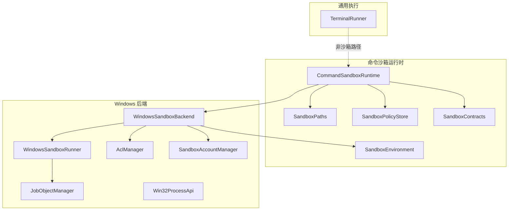
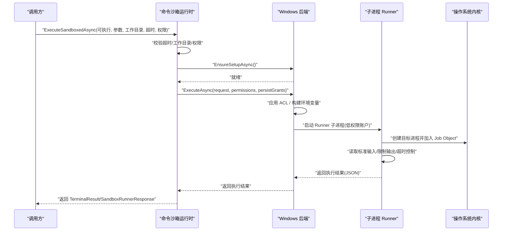
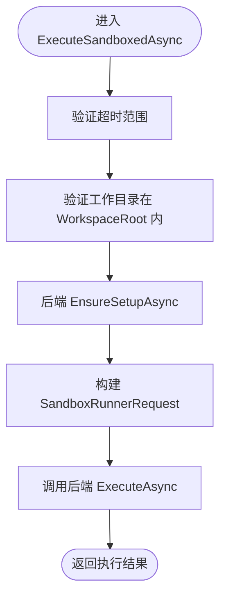
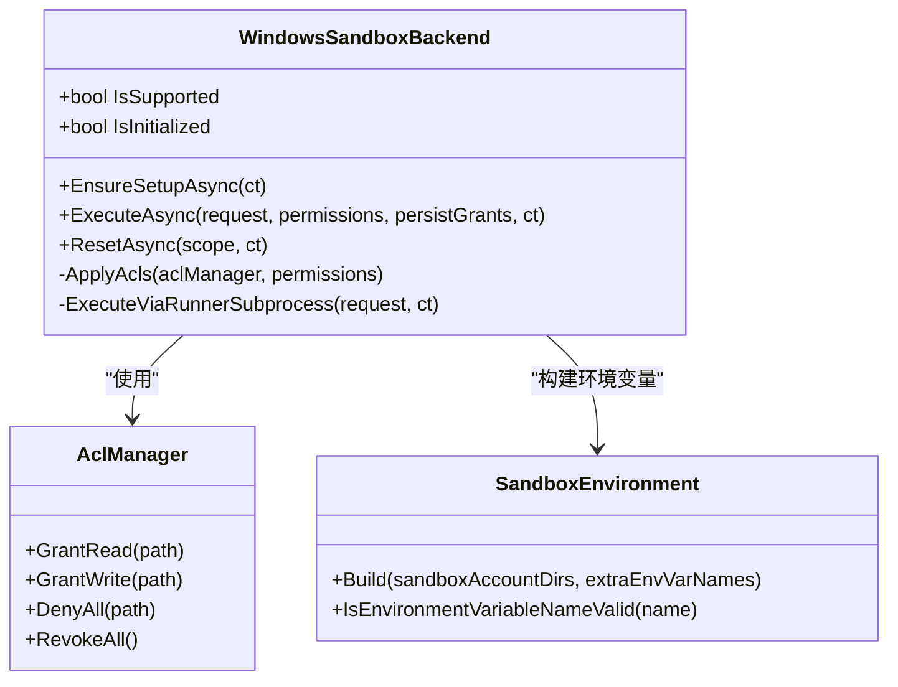
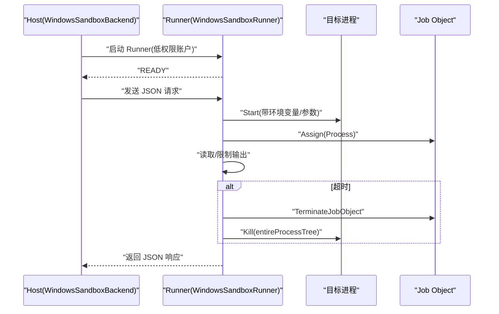
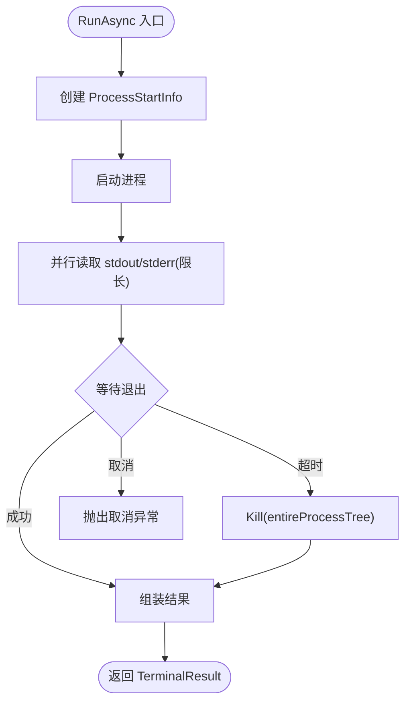
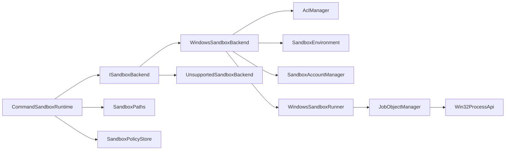

# 运行时环境

<cite>
**本文引用的文件**   
- [WindowsSandboxBackend.cs](file://TinadecTools/Runtime/Sandbox/Windows/WindowsSandboxBackend.cs)
- [CommandSandboxRuntime.cs](file://TinadecTools/Runtime/Sandbox/CommandSandboxRuntime.cs)
- [TerminalRunner.cs](file://TinadecTools/Runtime/TerminalRunner.cs)
- [SandboxEnvironment.cs](file://TinadecTools/Runtime/Sandbox/SandboxEnvironment.cs)
- [SandboxPolicyStore.cs](file://TinadecTools/Runtime/Sandbox/SandboxPolicyStore.cs)
- [JobObjectManager.cs](file://TinadecTools/Runtime/Sandbox/Windows/JobObjectManager.cs)
- [AclManager.cs](file://TinadecTools/Runtime/Sandbox/Windows/AclManager.cs)
- [SandboxAccountManager.cs](file://TinadecTools/Runtime/Sandbox/Windows/SandboxAccountManager.cs)
- [SandboxContracts.cs](file://TinadecTools/Runtime/Sandbox/SandboxContracts.cs)
- [WindowsSandboxRunner.cs](file://TinadecTools/Runtime/Sandbox/Windows/WindowsSandboxRunner.cs)
- [Win32ProcessApi.cs](file://TinadecTools/Runtime/Sandbox/Windows/Win32ProcessApi.cs)
- [UnsupportedSandboxBackend.cs](file://TinadecTools/Runtime/Sandbox/UnsupportedSandboxBackend.cs)
- [SandboxPaths.cs](file://TinadecTools/Runtime/Sandbox/SandboxPaths.cs)
- [Program.cs](file://TinadecTools/Program.cs)
</cite>

## 目录
1. [简介](#简介)
2. [项目结构](#项目结构)
3. [核心组件](#核心组件)
4. [架构总览](#架构总览)
5. [详细组件分析](#详细组件分析)
6. [依赖关系分析](#依赖关系分析)
7. [性能考虑](#性能考虑)
8. [故障排查指南](#故障排查指南)
9. [结论](#结论)
10. [附录](#附录)

## 简介
本文件面向“工具运行时环境”的文档目标，系统性阐述沙箱化执行环境的设计原理、进程隔离机制与资源限制策略。重点覆盖 Windows 平台沙箱实现、命令执行器、终端运行器与环境变量管理；并给出安全策略配置、权限控制、资源监控与故障恢复机制说明，同时提供可操作的沙箱配置示例与性能调优建议。

## 项目结构
运行时相关代码集中在 TinadecTools 工程内，围绕“命令沙箱运行时”和“Windows 后端”两大层次组织：
- 抽象与协议层：定义沙箱权限、策略、请求/响应契约与后端接口
- 命令沙箱运行时：负责参数校验、工作目录约束、权限合并与调用后端
- Windows 后端：基于独立用户账户、ACL 最小授权、Job Object 进程组与子进程 Runner 完成隔离执行
- 终端运行器：非沙箱场景下的通用命令执行封装（超时、输出截断、错误处理）

图表来源
- [CommandSandboxRuntime.cs:1-129](file://TinadecTools/Runtime/Sandbox/CommandSandboxRuntime.cs#L1-L129)
- [WindowsSandboxBackend.cs:1-161](file://TinadecTools/Runtime/Sandbox/Windows/WindowsSandboxBackend.cs#L1-L161)
- [WindowsSandboxRunner.cs:1-178](file://TinadecTools/Runtime/Sandbox/Windows/WindowsSandboxRunner.cs#L1-L178)
- [JobObjectManager.cs:1-63](file://TinadecTools/Runtime/Sandbox/Windows/JobObjectManager.cs#L1-L63)
- [AclManager.cs:1-62](file://TinadecTools/Runtime/Sandbox/Windows/AclManager.cs#L1-L62)
- [SandboxAccountManager.cs:1-88](file://TinadecTools/Runtime/Sandbox/Windows/SandboxAccountManager.cs#L1-L88)
- [SandboxEnvironment.cs:1-69](file://TinadecTools/Runtime/Sandbox/SandboxEnvironment.cs#L1-L69)
- [SandboxPaths.cs:1-113](file://TinadecTools/Runtime/Sandbox/SandboxPaths.cs#L1-L113)
- [SandboxPolicyStore.cs:1-83](file://TinadecTools/Runtime/Sandbox/SandboxPolicyStore.cs#L1-L83)
- [SandboxContracts.cs:1-71](file://TinadecTools/Runtime/Sandbox/SandboxContracts.cs#L1-L71)
- [TerminalRunner.cs:1-149](file://TinadecTools/Runtime/TerminalRunner.cs#L1-L149)

章节来源
- [CommandSandboxRuntime.cs:1-129](file://TinadecTools/Runtime/Sandbox/CommandSandboxRuntime.cs#L1-L129)
- [WindowsSandboxBackend.cs:1-161](file://TinadecTools/Runtime/Sandbox/Windows/WindowsSandboxBackend.cs#L1-L161)
- [TerminalRunner.cs:1-149](file://TinadecTools/Runtime/TerminalRunner.cs#L1-L149)

## 核心组件
- 命令沙箱运行时（CommandSandboxRuntime）
  - 职责：统一入口、超时校验、工作目录约束、权限构建与合并、调用具体后端执行
  - 关键点：仅允许工作目录在 WorkspaceRoot 内；写路径禁止指向磁盘根或敏感系统目录；环境变量名白名单校验；加载并合并策略文件
- Windows 后端（WindowsSandboxBackend）
  - 职责：初始化检查、ACL 授权、环境变量注入、通过子进程 Runner 执行命令、重置清理
  - 关键点：使用专用低权限账户运行 Runner；按权限动态授予读/写 ACL；支持临时或持久授权；失败时回收 ACL
- 子进程 Runner（WindowsSandboxRunner）
  - 职责：以低权限上下文启动目标进程，使用 Job Object 进行进程组隔离与强制终止；限制输出大小；超时控制
- 终端运行器（TerminalRunner）
  - 职责：非沙箱场景的命令执行封装；支持输入、超时、输出截断、错误捕获
- 环境与路径（SandboxEnvironment / SandboxPaths）
  - 职责：构建受限环境变量集；规范化与校验路径；推导能力 SID（用于更细粒度权限）
- 策略存储（SandboxPolicyStore）
  - 职责：读写 sandbox.json 策略文件；合并与持久化授权；删除策略
- 契约与类型（SandboxContracts）
  - 职责：定义权限、策略、请求/响应模型与后端接口；JSON 序列化上下文

章节来源
- [CommandSandboxRuntime.cs:1-129](file://TinadecTools/Runtime/Sandbox/CommandSandboxRuntime.cs#L1-L129)
- [WindowsSandboxBackend.cs:1-161](file://TinadecTools/Runtime/Sandbox/Windows/WindowsSandboxBackend.cs#L1-L161)
- [WindowsSandboxRunner.cs:1-178](file://TinadecTools/Runtime/Sandbox/Windows/WindowsSandboxRunner.cs#L1-L178)
- [TerminalRunner.cs:1-149](file://TinadecTools/Runtime/TerminalRunner.cs#L1-L149)
- [SandboxEnvironment.cs:1-69](file://TinadecTools/Runtime/Sandbox/SandboxEnvironment.cs#L1-L69)
- [SandboxPaths.cs:1-113](file://TinadecTools/Runtime/Sandbox/SandboxPaths.cs#L1-L113)
- [SandboxPolicyStore.cs:1-83](file://TinadecTools/Runtime/Sandbox/SandboxPolicyStore.cs#L1-L83)
- [SandboxContracts.cs:1-71](file://TinadecTools/Runtime/Sandbox/SandboxContracts.cs#L1-L71)

## 架构总览
下图展示从上层工具调用到 Windows 沙箱执行的端到端流程，包括进程隔离、权限控制与资源限制。

图表来源
- [CommandSandboxRuntime.cs:96-122](file://TinadecTools/Runtime/Sandbox/CommandSandboxRuntime.cs#L96-L122)
- [WindowsSandboxBackend.cs:23-53](file://TinadecTools/Runtime/Sandbox/Windows/WindowsSandboxBackend.cs#L23-L53)
- [WindowsSandboxBackend.cs:99-153](file://TinadecTools/Runtime/Sandbox/Windows/WindowsSandboxBackend.cs#L99-L153)
- [WindowsSandboxRunner.cs:14-48](file://TinadecTools/Runtime/Sandbox/Windows/WindowsSandboxRunner.cs#L14-L48)
- [WindowsSandboxRunner.cs:74-154](file://TinadecTools/Runtime/Sandbox/Windows/WindowsSandboxRunner.cs#L74-L154)

## 详细组件分析

### 命令沙箱运行时（CommandSandboxRuntime）
- 设计要点
  - 后端选择：Windows 优先尝试 WindowsSandboxBackend，否则回退为 UnsupportedSandboxBackend
  - 超时校验：限制 1ms~1800000ms
  - 工作目录约束：必须位于 WorkspaceRoot 内且存在
  - 权限构建：默认包含工作目录读/写；额外路径需规范化与安全检查；环境变量名需合法
  - 策略合并：加载 workspace/.tinadec/sandbox.json 并与传入权限合并去重
- 关键流程
  - ValidateTimeout → ValidateWorkingDirectory → EnsureSetupAsync → Build request → Backend.ExecuteAsync

图表来源
- [CommandSandboxRuntime.cs:29-35](file://TinadecTools/Runtime/Sandbox/CommandSandboxRuntime.cs#L29-L35)
- [CommandSandboxRuntime.cs:96-122](file://TinadecTools/Runtime/Sandbox/CommandSandboxRuntime.cs#L96-L122)
- [SandboxPaths.cs:18-28](file://TinadecTools/Runtime/Sandbox/SandboxPaths.cs#L18-L28)

章节来源
- [CommandSandboxRuntime.cs:1-129](file://TinadecTools/Runtime/Sandbox/CommandSandboxRuntime.cs#L1-L129)
- [SandboxPaths.cs:1-113](file://TinadecTools/Runtime/Sandbox/SandboxPaths.cs#L1-L113)
- [SandboxPolicyStore.cs:1-83](file://TinadecTools/Runtime/Sandbox/SandboxPolicyStore.cs#L1-L83)

### Windows 后端（WindowsSandboxBackend）
- 设计要点
  - 初始化：检查平台支持与账户是否存在，必要时触发初始化
  - 权限控制：对工作区授予写权限，对 .tinadec 目录拒绝所有访问；根据 ReadPaths/WritePaths 动态授予 ACL
  - 环境变量：注入 Profile/Cache 等必要变量，并按白名单透传额外变量
  - 执行模式：通过子进程 Runner 通信（READY/EXIT 协议），失败时回收 ACL
  - 重置：支持按范围清理策略、账户与缓存/Profile 目录
- 关键流程
  - ApplyAcls → Build Environment → ExecuteViaRunnerSubprocess → 清理 ACL（若非持久）

图表来源
- [WindowsSandboxBackend.cs:1-161](file://TinadecTools/Runtime/Sandbox/Windows/WindowsSandboxBackend.cs#L1-L161)
- [AclManager.cs:1-62](file://TinadecTools/Runtime/Sandbox/Windows/AclManager.cs#L1-L62)
- [SandboxEnvironment.cs:1-69](file://TinadecTools/Runtime/Sandbox/SandboxEnvironment.cs#L1-L69)

章节来源
- [WindowsSandboxBackend.cs:1-161](file://TinadecTools/Runtime/Sandbox/Windows/WindowsSandboxBackend.cs#L1-L161)

### 子进程 Runner（WindowsSandboxRunner）
- 设计要点
  - 进程隔离：将目标进程加入 Job Object，确保父进程退出或超时时能强制终止整个进程树
  - 输出限制：限制 stdout/stderr 最大字符数，避免内存膨胀
  - 超时控制：基于 TimeoutMs 的 CTS 取消等待，超时则 Kill 进程组
  - 通信协议：READY/EXIT 行协议，JSON 请求/响应
- 关键流程
  - RunRunner → 解析 JSON → RunSandboxedProcess → 限制 I/O → 返回结果

图表来源
- [WindowsSandboxRunner.cs:14-48](file://TinadecTools/Runtime/Sandbox/Windows/WindowsSandboxRunner.cs#L14-L48)
- [WindowsSandboxRunner.cs:74-154](file://TinadecTools/Runtime/Sandbox/Windows/WindowsSandboxRunner.cs#L74-L154)
- [JobObjectManager.cs:1-63](file://TinadecTools/Runtime/Sandbox/Windows/JobObjectManager.cs#L1-L63)

章节来源
- [WindowsSandboxRunner.cs:1-178](file://TinadecTools/Runtime/Sandbox/Windows/WindowsSandboxRunner.cs#L1-L178)
- [JobObjectManager.cs:1-63](file://TinadecTools/Runtime/Sandbox/Windows/JobObjectManager.cs#L1-L63)

### 终端运行器（TerminalRunner）
- 设计要点
  - 非沙箱命令执行：直接启动进程，重定向 I/O
  - 超时与取消：支持外部 CancellationToken 与内部超时 CTS 联动
  - 输出截断：限制最大字符数，标记是否被截断
  - 错误处理：启动异常、超时、取消均能安全回收进程
- 关键流程
  - Start → 并行读取 stdout/stderr → 等待退出 → 组装结果

图表来源
- [TerminalRunner.cs:18-110](file://TinadecTools/Runtime/TerminalRunner.cs#L18-L110)
- [TerminalRunner.cs:112-149](file://TinadecTools/Runtime/TerminalRunner.cs#L112-L149)

章节来源
- [TerminalRunner.cs:1-149](file://TinadecTools/Runtime/TerminalRunner.cs#L1-L149)

### 环境变量管理（SandboxEnvironment）
- 设计要点
  - 保留基础系统变量：PATH、SystemRoot、TEMP、语言与代理相关变量等
  - 注入沙箱账户目录：USERPROFILE、APPDATA、LOCALAPPDATA、TEMP/TMP
  - 包管理器缓存目录：NPM_CONFIG_CACHE、NUGET_PACKAGES、PIP_CACHE_DIR、CARGO_HOME
  - 白名单透传：仅允许显式声明的环境变量名透传
- 关键流程
  - 遍历保留集合 → 注入账户目录 → 合并额外白名单变量

章节来源
- [SandboxEnvironment.cs:1-69](file://TinadecTools/Runtime/Sandbox/SandboxEnvironment.cs#L1-L69)

### 路径与安全（SandboxPaths）
- 设计要点
  - 工作目录校验：必须在 WorkspaceRoot 内且存在
  - 授权路径规范化：绝对路径、去除尾部分隔符、不存在即报错
  - 防宽泛写入：禁止磁盘根与系统敏感目录作为写授权目标
  - 能力 SID：基于工作区根哈希生成 Capability SID（Windows 扩展权限）
- 关键流程
  - ValidateWorkingDirectory → NormalizeGrantPath → EnsureNotBroadWriteTarget

章节来源
- [SandboxPaths.cs:1-113](file://TinadecTools/Runtime/Sandbox/SandboxPaths.cs#L1-L113)

### 策略存储（SandboxPolicyStore）
- 设计要点
  - 位置：workspace/.tinadec/sandbox.json
  - 版本控制：CurrentVersion 字段
  - 合并策略：读/写路径与环境变量去重合并，排序保存
  - 删除策略：最佳努力删除，不抛错
- 关键流程
  - Load → MergeGrants → Save/MergeAndPersist/Delete

章节来源
- [SandboxPolicyStore.cs:1-83](file://TinadecTools/Runtime/Sandbox/SandboxPolicyStore.cs#L1-L83)

### 契约与类型（SandboxContracts）
- 设计要点
  - 权限模型：ReadPaths、WritePaths、EnvironmentVariableNames
  - 策略文件：version/read_paths/write_paths/environment_variables
  - 请求/响应：executable/arguments/working_directory/stdin/timeout_ms/environment → success/exit_code/stdout/stderr/timed_out/duration_ms/error/stdout_truncated/stderr_truncated
  - 后端接口：IsSupported/IsInitialized/EnsureSetupAsync/ExecuteAsync/ResetAsync
  - JSON 源生成：SandboxJsonContext

章节来源
- [SandboxContracts.cs:1-71](file://TinadecTools/Runtime/Sandbox/SandboxContracts.cs#L1-L71)

### 主程序与模式切换（Program.cs）
- 设计要点
  - 模式识别：setup 模式与 runner 模式由命令行参数决定
  - 工具循环：读取控制台输入，反序列化工具调用请求，分发执行并输出响应
  - 资源释放：McpRuntime 最终释放

章节来源
- [Program.cs:1-68](file://TinadecTools/Program.cs#L1-L68)

## 依赖关系分析
- 组件耦合
  - CommandSandboxRuntime 依赖 ISandboxBackend 接口，运行时选择 WindowsSandboxBackend 或 UnsupportedSandboxBackend
  - WindowsSandboxBackend 依赖 AclManager、SandboxEnvironment、SandboxAccountManager、DpapiCredentialStore（密码存取）、Win32 原生 API
  - WindowsSandboxRunner 依赖 JobObjectManager 与 Win32ProcessApi
  - 策略与路径模块被多处复用，保证一致的安全边界
- 外部依赖
  - Windows 原生 API：CreateJobObjectW、SetInformationJobObject、AssignProcessToJobObject、TerminateJobObject、LogonUserW、NetUserAdd/Del 等
  - 文件系统访问控制：FileSystemAccessRule、NTAccount
  - JSON 序列化：System.Text.Json 与源生成上下文

图表来源
- [CommandSandboxRuntime.cs:1-129](file://TinadecTools/Runtime/Sandbox/CommandSandboxRuntime.cs#L1-L129)
- [WindowsSandboxBackend.cs:1-161](file://TinadecTools/Runtime/Sandbox/Windows/WindowsSandboxBackend.cs#L1-L161)
- [WindowsSandboxRunner.cs:1-178](file://TinadecTools/Runtime/Sandbox/Windows/WindowsSandboxRunner.cs#L1-L178)
- [JobObjectManager.cs:1-63](file://TinadecTools/Runtime/Sandbox/Windows/JobObjectManager.cs#L1-L63)
- [Win32ProcessApi.cs:1-79](file://TinadecTools/Runtime/Sandbox/Windows/Win32ProcessApi.cs#L1-L79)
- [SandboxPaths.cs:1-113](file://TinadecTools/Runtime/Sandbox/SandboxPaths.cs#L1-L113)
- [SandboxPolicyStore.cs:1-83](file://TinadecTools/Runtime/Sandbox/SandboxPolicyStore.cs#L1-L83)

章节来源
- [CommandSandboxRuntime.cs:1-129](file://TinadecTools/Runtime/Sandbox/CommandSandboxRuntime.cs#L1-L129)
- [WindowsSandboxBackend.cs:1-161](file://TinadecTools/Runtime/Sandbox/Windows/WindowsSandboxBackend.cs#L1-L161)
- [WindowsSandboxRunner.cs:1-178](file://TinadecTools/Runtime/Sandbox/Windows/WindowsSandboxRunner.cs#L1-L178)
- [JobObjectManager.cs:1-63](file://TinadecTools/Runtime/Sandbox/Windows/JobObjectManager.cs#L1-L63)
- [Win32ProcessApi.cs:1-79](file://TinadecTools/Runtime/Sandbox/Windows/Win32ProcessApi.cs#L1-L79)
- [SandboxPaths.cs:1-113](file://TinadecTools/Runtime/Sandbox/SandboxPaths.cs#L1-L113)
- [SandboxPolicyStore.cs:1-83](file://TinadecTools/Runtime/Sandbox/SandboxPolicyStore.cs#L1-L83)

## 性能考虑
- 输出限制
  - Runner 与 TerminalRunner 均限制 stdout/stderr 最大字符数，防止大输出导致内存压力
- 超时控制
  - 命令执行采用 CTS 与 WaitForExitAsync 组合，避免长时间阻塞；超时后强制终止进程组
- I/O 缓冲
  - 使用固定大小缓冲区流式读取，减少峰值内存占用
- 策略与权限
  - 策略文件合并去重与排序，避免重复授权带来的 ACL 膨胀
- 进程组隔离
  - Job Object 一次性终止整个进程树，降低僵尸进程风险

[本节为通用指导，不直接分析具体文件]

## 故障排查指南
- 常见错误与定位
  - 平台不支持：UnsupportedSandboxBackend 抛出 PlatformNotSupportedException，确认运行平台与后端选择逻辑
  - 未初始化：WindowsSandboxBackend.IsInitialized 为 false 时调用 ExecuteAsync 会抛异常，先调用 EnsureSetupAsync
  - 工作目录非法：SandboxPaths.ValidateWorkingDirectory 抛出 UnauthorizedAccessException 或 DirectoryNotFoundException，检查路径是否在 WorkspaceRoot 内且存在
  - 宽泛写授权：EnsureNotBroadWriteTarget 阻止对磁盘根或系统目录的写授权，缩小授权范围
  - 环境变量名非法：SandboxEnvironment.IsEnvironmentVariableNameValid 拒绝含特殊字符或无效名称
  - Runner 初始化失败：Host 收到非 READY 行，查看 stderr 信息
  - 无结果返回：Runner 未返回 JSON 或解析失败，检查进程崩溃与 I/O 管道状态
  - 超时：TimedOut 标志位为 true，检查命令耗时与超时阈值设置
- 恢复与清理
  - ResetAsync：支持 Workspace/Machine 级别清理，删除策略、账户、缓存与 Profile 目录
  - ACL 撤销：非持久授权模式下，ExecuteAsync finally 块中自动撤销所有规则

章节来源
- [UnsupportedSandboxBackend.cs:1-19](file://TinadecTools/Runtime/Sandbox/UnsupportedSandboxBackend.cs#L1-L19)
- [WindowsSandboxBackend.cs:23-53](file://TinadecTools/Runtime/Sandbox/Windows/WindowsSandboxBackend.cs#L23-L53)
- [WindowsSandboxBackend.cs:99-153](file://TinadecTools/Runtime/Sandbox/Windows/WindowsSandboxBackend.cs#L99-L153)
- [SandboxPaths.cs:18-60](file://TinadecTools/Runtime/Sandbox/SandboxPaths.cs#L18-L60)
- [SandboxEnvironment.cs:63-69](file://TinadecTools/Runtime/Sandbox/SandboxEnvironment.cs#L63-L69)
- [WindowsSandboxRunner.cs:14-48](file://TinadecTools/Runtime/Sandbox/Windows/WindowsSandboxRunner.cs#L14-L48)
- [TerminalRunner.cs:80-110](file://TinadecTools/Runtime/TerminalRunner.cs#L80-L110)

## 结论
该运行时环境通过“命令沙箱运行时 + Windows 后端 + 子进程 Runner”的分层设计，实现了严格的进程隔离、最小权限控制与资源限制。结合策略文件与环境变量白名单，既保证了安全性，又提供了灵活的扩展能力。配合终端运行器与非沙箱路径，可满足多种执行场景。建议在部署前完成账户与策略初始化，并根据实际负载调整超时与输出限制参数以获得稳定性能。

[本节为总结性内容，不直接分析具体文件]

## 附录

### 安全策略配置（sandbox.json）
- 位置：workspace/.tinadec/sandbox.json
- 字段
  - version：策略版本
  - read_paths：允许的读路径列表
  - write_paths：允许的写路径列表
  - environment_variables：允许透传的环境变量名列表
- 行为
  - 加载失败或不存在时回退为默认空策略
  - 合并时去重并排序，避免冗余授权

章节来源
- [SandboxPolicyStore.cs:18-52](file://TinadecTools/Runtime/Sandbox/SandboxPolicyStore.cs#L18-L52)
- [SandboxContracts.cs:17-23](file://TinadecTools/Runtime/Sandbox/SandboxContracts.cs#L17-L23)

### 权限控制与最小授权
- 工作区默认写授权，.tinadec 目录默认拒绝所有访问
- 读/写路径需经规范化与安全检查，禁止宽泛目标
- 非持久授权在执行结束后自动撤销 ACL

章节来源
- [WindowsSandboxBackend.cs:74-97](file://TinadecTools/Runtime/Sandbox/Windows/WindowsSandboxBackend.cs#L74-L97)
- [AclManager.cs:17-58](file://TinadecTools/Runtime/Sandbox/Windows/AclManager.cs#L17-L58)
- [SandboxPaths.cs:50-60](file://TinadecTools/Runtime/Sandbox/SandboxPaths.cs#L50-L60)

### 资源监控与限制
- 进程组隔离：Job Object 确保父进程退出或超时时终止整个进程树
- 输出限制：stdout/stderr 最大字符数限制，避免内存溢出
- 超时控制：CTS 与 WaitForExitAsync 协作，支持外部取消

章节来源
- [JobObjectManager.cs:10-46](file://TinadecTools/Runtime/Sandbox/Windows/JobObjectManager.cs#L10-L46)
- [WindowsSandboxRunner.cs:156-171](file://TinadecTools/Runtime/Sandbox/Windows/WindowsSandboxRunner.cs#L156-L171)
- [TerminalRunner.cs:73-94](file://TinadecTools/Runtime/TerminalRunner.cs#L73-L94)

### 故障恢复机制
- 初始化失败：EnsureSetupAsync 前置检查，失败时明确异常
- 执行失败：Runner 返回结构化错误信息，便于上层诊断
- 清理恢复：ResetAsync 支持按范围清理策略、账户与缓存/Profile

章节来源
- [WindowsSandboxBackend.cs:14-21](file://TinadecTools/Runtime/Sandbox/Windows/WindowsSandboxBackend.cs#L14-L21)
- [WindowsSandboxBackend.cs:55-72](file://TinadecTools/Runtime/Sandbox/Windows/WindowsSandboxBackend.cs#L55-L72)
- [WindowsSandboxRunner.cs:40-48](file://TinadecTools/Runtime/Sandbox/Windows/WindowsSandboxRunner.cs#L40-L48)

### 性能调优指南
- 合理设置超时：根据命令特性调整 timeoutMs，避免过短导致误杀或过长导致阻塞
- 控制输出大小：maxOutputChars 与 Runner 的 MaxStreamChars 需平衡日志完整性与内存占用
- 策略精简：read_paths/write_paths 尽量精确，减少 ACL 数量
- 环境变量最小化：仅透传必要变量，降低污染风险
- 批量执行：合并多次调用以减少进程创建开销（如适用）

[本节为通用指导，不直接分析具体文件]