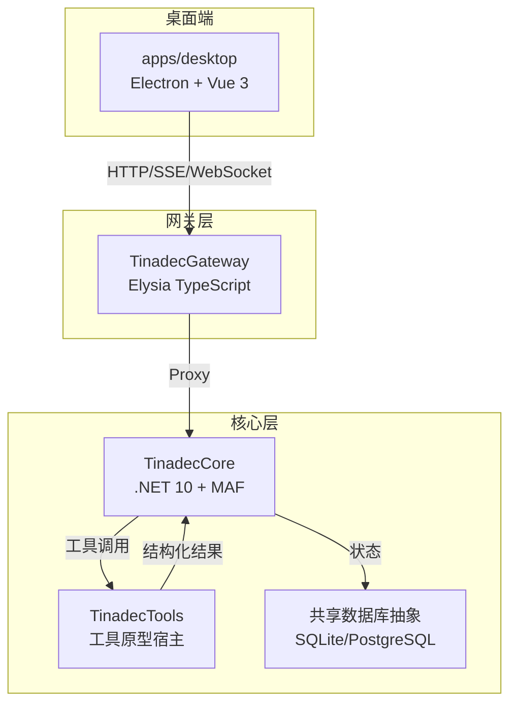
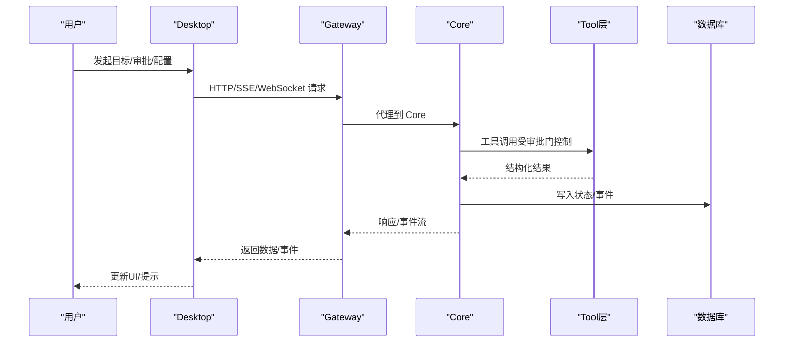
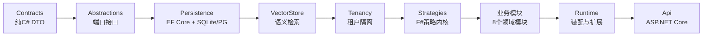

# 开发指南

<cite>
**本文引用的文件**   
- [README.md](file://README.md)
- [AGENTS.md](file://AGENTS.md)
- [CLAUDE.md](file://CLAUDE.md)
- [package.json](file://package.json)
- [TinadecCore/AGENTS.md](file://TinadecCore/AGENTS.md)
- [TinadecGateway/AGENTS.md](file://TinadecGateway/AGENTS.md)
- [docs/architecture.md](file://docs/architecture.md)
- [docs/security.md](file://docs/security.md)
- [docs/startup.md](file://docs/startup.md)
- [apps/desktop/package.json](file://apps/desktop/package.json)
- [TinadecCore/Directory.Build.props](file://TinadecCore/Directory.Build.props)
- [TinadecCore/Directory.Packages.props](file://TinadecCore/Directory.Packages.props)
</cite>

## 目录
1. [简介](#简介)
2. [项目结构](#项目结构)
3. [核心组件](#核心组件)
4. [架构总览](#架构总览)
5. [详细组件分析](#详细组件分析)
6. [依赖关系分析](#依赖关系分析)
7. [性能考虑](#性能考虑)
8. [故障排查指南](#故障排查指南)
9. [结论](#结论)
10. [附录](#附录)

## 简介
本指南面向 TinadecOffice 开发者，覆盖开发环境搭建、代码规范、贡献流程、模块依赖与扩展点识别、代码审查标准、提交信息与分支管理策略、新功能开发全流程与最佳实践，以及性能优化、安全编码、可维护性指导、调试技巧与常见问题解决方案。项目采用三层架构：Desktop（Electron + Vue 3）、Gateway（Elysia TypeScript）、Core（.NET 10 + MAF），其中 Core 为唯一状态权威，Gateway 为薄代理/BFF，Desktop 仅负责 UI 呈现与交互。

## 项目结构
仓库根目录包含三个主要子系统与配套工具：
- TinadecCore：基于 .NET 10 的模块化单体，提供智能体编排、持久化、就绪回执、事件流等能力。
- TinadecGateway：基于 Elysia 的薄 BFF/代理层，统一对外暴露 /api/v1/*，并转发到 Core 与 Tool Runtime。
- apps/desktop：Electron + Vue 3 桌面应用，通过 Gateway 访问 Core 能力，并提供 Agent Debug Studio 等调试界面。
- TinadecTools：审批感知的工具原型宿主（文件/命令/Git/MCP）。
- TinadecTools.Generators：[ToolFunction] 静态注册表源生成器。
- tests：各层测试与契约证据测试。
- docs：产品模型、架构、安全、启动手册等文档。

图表来源 
- [README.md:33-43](file://README.md#L33-L43)
- [docs/architecture.md:13-17](file://docs/architecture.md#L13-L17)

章节来源
- [README.md:61-73](file://README.md#L61-L73)
- [AGENTS.md:159-189](file://AGENTS.md#L159-L189)

## 核心组件
- Core（TinadecCore）
  - 模块化单体，基于 MAF 1.13.0，提供会话、运行、任务图、上下文包、监督发现、审批、模型路由、事件与追踪等能力。
  - 共享数据库抽象（默认 SQLite，可选 PostgreSQL），迁移协调与就绪探测。
  - API 端点包括健康检查、harness 清单、就绪回执、项目/会话/消息 CRUD、事件回放 SSE 等；部分写路径仍为 501 stub。
- Gateway（TinadecGateway）
  - 薄代理/BFF，统一对外暴露 /api/v1/*，支持 HTTP/JSON、SSE、WebSocket、流式 HTTP。
  - 鉴权（云端模式支持 API Key/JWT/租户上下文）、BFF 组合（Model/Agent Center 聚合视图）、协议转换与流式转发。
  - 不存储业务状态，不执行文件/Git/Shell/MCP 操作。
- Desktop（apps/desktop）
  - Electron + Vue 3 + Vite + Tailwind，提供聊天、任务图、审批、可分离面板、Debug Studio 等。
  - 只调用 Gateway，不直接调用 Core；不保存业务状态。
- Tools（TinadecTools）
  - 审批感知工具原型（文件/命令/Git/MCP），支持 [ToolFunction] 静态注册与 MCP pass-through。

章节来源
- [TinadecCore/AGENTS.md:15-47](file://TinadecCore/AGENTS.md#L15-L47)
- [TinadecGateway/AGENTS.md:1-51](file://TinadecGateway/AGENTS.md#L1-51)
- [AGENTS.md:121-141](file://AGENTS.md#L121-L141)

## 架构总览
三层职责边界清晰：
- Core 是唯一状态权威，持有会话、运行、任务、审批、事件、追踪、模型路由与工具策略。
- Gateway 是薄代理与 BFF，只做协议转换、鉴权、聚合视图与转发。
- Desktop 仅做 UI 呈现与用户交互，所有数据请求均经 Gateway。

图表来源 
- [docs/architecture.md:19-45](file://docs/architecture.md#L19-L45)
- [TinadecGateway/AGENTS.md:28-35](file://TinadecGateway/AGENTS.md#L28-L35)

章节来源
- [docs/architecture.md:1-11](file://docs/architecture.md#L1-L11)

## 详细组件分析

### 开发环境与快速开始
- 系统要求：Windows 10/11（推荐 23H2+），Node.js 18+ 与 npm，.NET 10 SDK，Git。
- 安装依赖：npm install；恢复 .NET 包：npm run restore:dotnet。
- 一键启动：npm run dev（同时启动 Core 48731、Gateway 48730、Desktop 5173）。
- 端口约定：Desktop 5173、Gateway 48730、Core 48731。
- 本地环境变量注意：需清理 Version/Ice-Version 以避免 MSBuild 解析失败。

章节来源
- [CLAUDE.md:15-48](file://CLAUDE.md#L15-L48)
- [docs/startup.md:15-31](file://docs/startup.md#L15-L31)
- [package.json:9-19](file://package.json#L9-L19)

### 构建与测试
- 构建：npm run build（工作区与 .NET 解决方案）。
- 测试：npm test（工作区、Gateway、Core 全量）。
- Core 子方案：dotnet restore/build/test 指向 TinadecCore.slnx。
- 前端与 Gateway 测试：npm run test --workspaces --if-present；bun test。

章节来源
- [package.json:16-19](file://package.json#L16-L19)
- [AGENTS.md:337-376](file://AGENTS.md#L337-L376)

### 代码规范与约定
- API 契约统一 snake_case；C# 属性 PascalCase。
- EventEnvelope 使用 schema v1.0，payload 不含 MAF/F# 类型。
- Gateway 透明代理 Core 端点；无状态；不实现业务逻辑。
- Desktop 仅调用 Gateway；DTO 镜像保持同步。
- 禁止在 bin/obj/node_modules/dist 等产物目录编辑。

章节来源
- [TinadecCore/AGENTS.md:151-156](file://TinadecCore/AGENTS.md#L151-L156)
- [AGENTS.md:229-241](file://AGENTS.md#L229-L241)

### 模块依赖与扩展点
- Core 模块按 Abstractions → Persistence → VectorStore → Tenancy → Strategies → 业务模块 → Runtime → Api 分层依赖，业务模块间不直接引用，通过 Abstractions 端口协作。
- 模块注册：每个模块实现 IModuleRegistrar.Register(ITinadecCoreBuilder)，Runtime 提供 AddTinadecCore() 与 AddTinadecCoreMinimal() 显式装配。
- 扩展点：IContentStore、ISecretStore、ITenantContextAccessor、IVectorStore、IEmbeddingProvider、IModuleRegistrar 等接口为扩展入口。

章节来源
- [TinadecCore/AGENTS.md:56-75](file://TinadecCore/AGENTS.md#L56-L75)
- [TinadecCore/AGENTS.md:105-112](file://TinadecCore/AGENTS.md#L105-L112)

### 持久化与迁移
- 默认 SQLite 本地文件（data/tinadec.db），可选 PostgreSQL（连接字符串配置）。
- EF Core DbContext 由模块注册，迁移协调由 Storage.Migrations.* 项目负责。
- 就绪探测：GET /api/v1/readiness 包含 storage.provider/state/detail。

章节来源
- [TinadecCore/AGENTS.md:82-96](file://TinadecCore/AGENTS.md#L82-L96)

### 安全编码与最小权限
- Electron 启用 contextIsolation、nodeIntegration=false、sandbox=true；渲染进程不接收 API Key 或直连文件系统/Shell。
- API Key 通过 DPAPI 保护存储；日志与响应不返回密钥值。
- 工具默认“先审批后执行”；Windows 上通过本地沙箱账户执行命令，临时 ACL 授权并在进程结束后撤销。

章节来源
- [docs/security.md:1-12](file://docs/security.md#L1-L12)

### 调试与可观测性
- Agent Debug Studio：后端 OpenTelemetry 收集 span 与指标，NDJSON 导出；Debug API 查询 traces/metrics/diagnostics；WS 实时事件流。
- Gateway 支持 SSE/WS 代理；Desktop 提供可视化面板。

章节来源
- [docs/architecture.md:140-172](file://docs/architecture.md#L140-L172)

### 新功能开发流程与最佳实践
- 明确需求归属：编排语义→Core；工具能力→Tool layer；交互呈现→Desktop。
- 先在 Core 定义契约与接口，再在 Gateway 实现代理/BFF，最后 Desktop 更新 DTO 镜像与 UI。
- 新增工具：声明能力与风险级别，注册到工具注册表，Core 策略决定是否自动执行或进入审批。
- 变更影响评估：优先使用 CodeGraph 分析跨层调用链与影响范围。

章节来源
- [AGENTS.md:148-157](file://AGENTS.md#L148-L157)
- [AGENTS.md:285-290](file://AGENTS.md#L285-L290)

### 代码审查标准
- 架构合规：Desktop 不调用 Core；Gateway 保持薄代理；Core 维持状态权威。
- 安全合规：未删除验证/错误处理/安全代码；敏感信息未泄露；审批门有效。
- 契约一致性：API snake_case；DTO 镜像同步；EventEnvelope 无 MAF/F# 类型。
- 可维护性：避免重复实现；优先复用现有服务/组件；产物目录不修改。

章节来源
- [AGENTS.md:325-332](file://AGENTS.md#L325-L332)
- [CLAUDE.md:187-193](file://CLAUDE.md#L187-L193)

### 提交信息与分支管理策略
- 提交信息建议遵循“领域: 描述”格式，如 “core: 增加项目CRUD端点”、“gateway: 修复SSE代理超时”。
- 分支策略：feature/* 功能分支，hotfix/* 热修复分支，release/* 发布分支；PR 需关联 Issue 并通过 CI。
- 变更同步：修改 AGENTS.md 与相关文档需在同一个变更中更新，确保 AI 阅读路径一致。

章节来源
- [AGENTS.md:10-17](file://AGENTS.md#L10-L17)

### 性能优化建议
- 减少不必要的序列化/反序列化，避免在大对象上频繁 JSON 转换。
- 合理使用缓存（Gateway 无状态，缓存应在 Core 或外部缓存层）。
- 数据库查询优化：LINQ 查询避免 N+1，合理使用索引。
- 前端虚拟化长列表，避免一次性渲染大量 DOM。

章节来源
- [docs/architecture.md:80-139](file://docs/architecture.md#L80-L139)

### 可维护性指导
- 单一职责：每层只做一件事，避免跨层耦合。
- 接口驱动：通过 Abstractions 端口解耦模块。
- 配置外置：敏感配置与环境变量分离，生产环境使用安全存储。
- 测试覆盖：单元测试 + 集成测试 + 架构边界测试。

章节来源
- [TinadecCore/AGENTS.md:56-75](file://TinadecCore/AGENTS.md#L56-L75)

## 依赖关系分析
- Core 依赖链：Contracts → Abstractions → Persistence → VectorStore → Tenancy → Strategies → 业务模块 → Runtime → Api。
- Gateway 依赖：Elysia、TypeScript、WebCrypto（JWT 验签）、Node.js 原生能力。
- Desktop 依赖：Electron、Vue 3、Vite、Tailwind、Monaco Editor、Xterm.js。

图表来源 
- [TinadecCore/AGENTS.md:56-75](file://TinadecCore/AGENTS.md#L56-L75)

章节来源
- [TinadecCore/Directory.Build.props:1-21](file://TinadecCore/Directory.Build.props#L1-L21)
- [TinadecCore/Directory.Packages.props:1-53](file://TinadecCore/Directory.Packages.props#L1-L53)

## 性能考虑
- 网络层：Gateway 代理应设置合理超时（默认 120s），避免阻塞。
- 数据库层：SQLite 适合本地开发，PostgreSQL 适合生产；合理使用事务与索引。
- 前端层：虚拟滚动、懒加载、防抖节流；避免主线程阻塞。
- 工具层：限制输出大小（如 65,536 字符），避免大对象传输。

章节来源
- [TinadecGateway/AGENTS.md:61-73](file://TinadecGateway/AGENTS.md#L61-L73)
- [docs/security.md:11](file://docs/security.md#L11)

## 故障排查指南
- 端口占用：检查 48730/48731/5173 是否被占用。
- Core 健康：GET /api/v1/health 返回正常。
- Gateway 健康：GET /api/v1/health 返回正常。
- 代理问题：确认 Gateway 能正确转发到 Core。
- 构建失败：清理 Version/Ice-Version 环境变量。
- 锁文件冲突：停止占用 Core.dll 的进程。

章节来源
- [docs/startup.md:93-162](file://docs/startup.md#L93-L162)

## 结论
TinadecOffice 通过清晰的三层架构与严格的职责边界，实现了可扩展、可维护、安全的智能体工作台。开发者应遵循本指南的规范与流程，确保代码质量与系统稳定性。持续改进方向包括完善 Core 运行时、增强 Tool 层能力、优化前端体验与提升可观测性。

## 附录

### 常用命令速查
- 开发：npm run dev
- 构建：npm run build
- 测试：npm test
- 仅 Core：npm run dev:core
- 仅 Gateway：npm run dev:gateway
- 仅 Desktop：npm run dev:desktop

章节来源
- [package.json:9-19](file://package.json#L9-L19)
- [docs/startup.md:15-31](file://docs/startup.md#L15-L31)

### 环境变量参考
- TINADEC_GATEWAY_MODE：部署模式（local/cloud）
- TINADEC_GATEWAY_PORT：Gateway 端口（默认 48730）
- TINADEC_CORE_URL：Core 服务 URL
- TINADEC_TOOL_RUNTIME_URL：Tool Runtime URL
- TINADEC_GATEWAY_AUTH_REQUIRED：是否必须认证
- TINADEC_GATEWAY_JWT_SECRET：JWT 密钥
- TINADEC_GATEWAY_API_KEY：API Key
- TINADEC_GATEWAY_CORS_ORIGINS：CORS 来源
- TINADEC_GATEWAY_TIMEOUT_MS：请求超时

章节来源
- [TinadecGateway/AGENTS.md:61-73](file://TinadecGateway/AGENTS.md#L61-L73)

### 安全要点回顾
- Electron 安全配置：contextIsolation、nodeIntegration=false、sandbox=true。
- 密钥保护：DPAPI 存储，日志不返回密钥。
- 工具执行：审批门控 + 沙箱账户 + 临时 ACL。

章节来源
- [docs/security.md:1-12](file://docs/security.md#L1-L12)