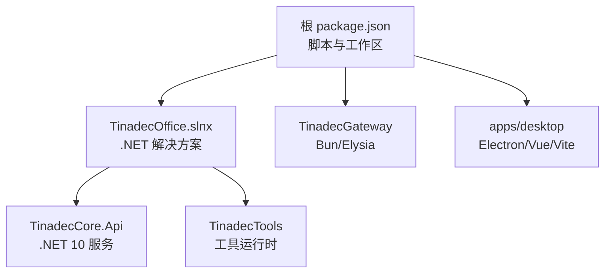
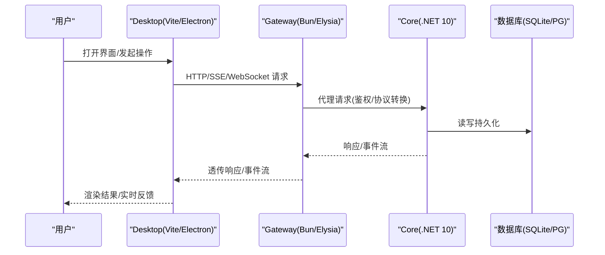
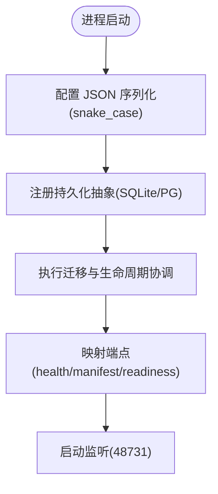
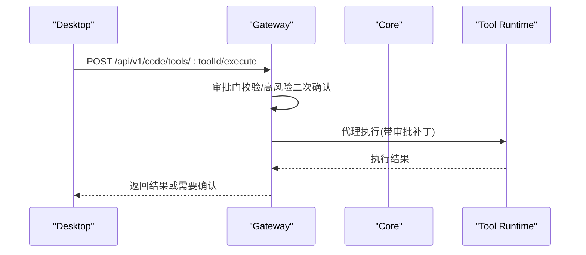
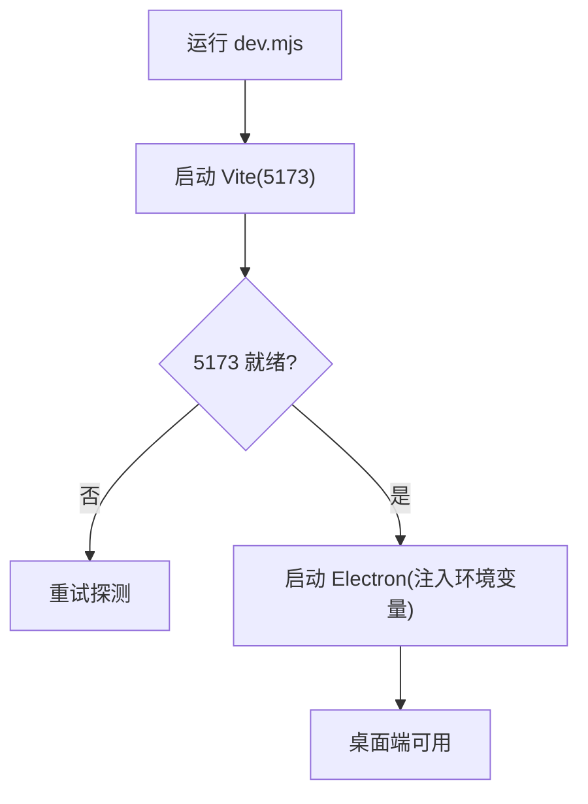
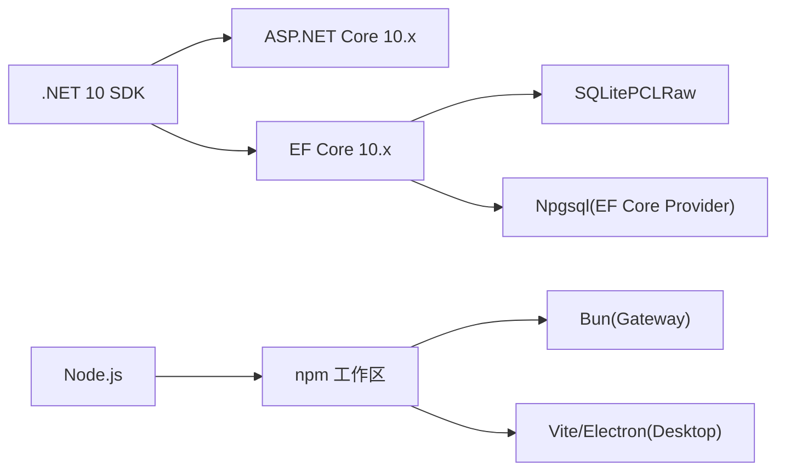

# 快速开始

<cite>
**本文引用的文件**   
- [README.md](file://README.md)
- [package.json](file://package.json)
- [startup.md](file://docs/startup.md)
- [appsettings.json](file://TinadecCore\Api\appsettings.json)
- [Program.cs](file://TinadecCore\Api\Program.cs)
- [index.ts](file://TinadecGateway\src\index.ts)
- [dev.mjs](file://apps\desktop\scripts\dev.mjs)
- [setup-dotnet-env.ps1](file://scripts\setup-dotnet-env.ps1)
- [Directory.Build.props](file://TinadecCore\Directory.Build.props)
- [Directory.Packages.props](file://TinadecCore\Directory.Packages.props)
- [TinadecOffice.slnx](file://TinadecOffice.slnx)
</cite>

## 目录
1. [简介](#简介)
2. [项目结构](#项目结构)
3. [核心组件](#核心组件)
4. [架构总览](#架构总览)
5. [详细组件分析](#详细组件分析)
6. [依赖分析](#依赖分析)
7. [性能考虑](#性能考虑)
8. [故障排查指南](#故障排查指南)
9. [结论](#结论)
10. [附录](#附录)

## 简介
本指南面向首次接触 TinadecOffice 的开发者，目标是在最短时间内完成环境搭建、依赖安装与一键启动，并给出常用访问地址与常见问题的排障步骤。项目由三层组成：
- Core（.NET 10 + ASP.NET Core）：唯一状态权威，提供健康检查、就绪检测、编排与工具执行等 API。
- Gateway（Bun + Elysia）：薄 BFF/代理层，统一鉴权、协议转换、SSE/WebSocket 流式转发。
- Desktop（Electron + Vue 3 + Vite）：本地 UI，通过 Gateway 访问 Core 能力。

## 项目结构
仓库采用多工作区与多解决方案组织：
- 根 package.json 定义跨语言脚本与工作区（apps/*）。
- .NET 侧使用 TinadecOffice.slnx 聚合多个子项目（Core、Tools、测试等）。
- Gateway 为独立 Bun 包，Desktop 为 Electron/Vue 应用。

图表来源 
- [package.json:1-36](file://package.json#L1-L36)
- [TinadecOffice.slnx:1-34](file://TinadecOffice.slnx#L1-L34)

章节来源
- [README.md:1-120](file://README.md#L1-L120)
- [package.json:1-36](file://package.json#L1-L36)
- [TinadecOffice.slnx:1-34](file://TinadecOffice.slnx#L1-L34)

## 核心组件
- Core（.NET 10）
  - 端口：48731
  - 关键端点：/api/v1/health、/api/v1/harness/manifest、/api/v1/readiness
  - 默认存储：SQLite（可切换 PostgreSQL）
- Gateway（Bun + Elysia）
  - 端口：48730
  - 职责：认证、BFF 组合、协议转换、SSE/WebSocket 流式转发、代码工具审批门
- Desktop（Electron + Vue 3 + Vite）
  - 开发端口：5173
  - 仅调用 Gateway，不直接访问 Core

章节来源
- [README.md:17-58](file://README.md#L17-L58)
- [Program.cs:44-175](file://TinadecCore\Api\Program.cs#L44-L175)
- [index.ts:157-178](file://TinadecGateway\src\index.ts#L157-L178)
- [dev.mjs:20-71](file://apps\desktop\scripts\dev.mjs#L20-L71)

## 架构总览
下图展示请求从 Desktop 到 Gateway，再到 Core 的完整链路，以及事件流与存储抽象。

图表来源 
- [index.ts:157-178](file://TinadecGateway\src\index.ts#L157-L178)
- [Program.cs:44-175](file://TinadecCore\Api\Program.cs#L44-L175)
- [appsettings.json:9-22](file://TinadecCore\Api\appsettings.json#L9-L22)

## 详细组件分析

### 环境要求与准备
- .NET SDK：net10.0（见构建属性）
- Node.js：用于 npm 脚本与工作区管理
- Bun：用于 Gateway 开发与运行
- 可选：PostgreSQL（若需切换数据库提供者）

章节来源
- [Directory.Build.props:4](file://TinadecCore\Directory.Build.props#L4)
- [Directory.Packages.props:1-53](file://TinadecCore\Directory.Packages.props#L1-L53)
- [startup.md:1-30](file://docs/startup.md#L1-L30)

### 依赖安装
- 安装前端依赖（含工作区）
- 还原 .NET 包（清理可能干扰的环境变量后执行）

命令参考：
- npm install
- npm run restore:dotnet

章节来源
- [package.json:18-19](file://package.json#L18-L19)
- [setup-dotnet-env.ps1:1-49](file://scripts\setup-dotnet-env.ps1#L1-L49)

### 一键启动与访问地址
- 一键启动（同时启动 Core、Gateway、Desktop）
  - 命令：npm run dev
- 服务访问地址
  - Desktop（Vite）：http://127.0.0.1:5173
  - Gateway API/Docs：http://127.0.0.1:48730/docs
  - Core：http://127.0.0.1:48731

章节来源
- [README.md:45-58](file://README.md#L45-L58)
- [package.json:11-14](file://package.json#L11-L14)
- [startup.md:15-31](file://docs/startup.md#L15-L31)

### 分模块启动
- 仅 Core：npm run dev:core
- 仅 Gateway：npm run dev:gateway
- 仅 Desktop：npm run dev:desktop

章节来源
- [package.json:12-14](file://package.json#L12-L14)
- [startup.md:33-58](file://docs/startup.md#L33-L58)

### 后端启动流程（Core）
- 初始化 JSON 序列化策略（snake_case）
- 注册持久化抽象（默认 SQLite，可选 PG）
- 启动时执行迁移与生命周期协调
- 暴露健康、清单、就绪等端点

图表来源 
- [Program.cs:12-39](file://TinadecCore\Api\Program.cs#L12-L39)
- [Program.cs:44-175](file://TinadecCore\Api\Program.cs#L44-L175)

章节来源
- [Program.cs:12-39](file://TinadecCore\Api\Program.cs#L12-L39)
- [Program.cs:44-175](file://TinadecCore\Api\Program.cs#L44-L175)
- [appsettings.json:12-22](file://TinadecCore\Api\appsettings.json#L12-L22)

### 网关路由与代理（Gateway）
- 健康检查、模型中心、Agent 中心、调试、MCP、扩展市场等路由
- 对 Core 进行 JSON/SSE 代理，支持流式转发
- 代码工具执行前进行审批门校验与高风险二次确认

图表来源 
- [index.ts:351-400](file://TinadecGateway\src\index.ts#L351-L400)

章节来源
- [index.ts:157-178](file://TinadecGateway\src\index.ts#L157-L178)
- [index.ts:351-400](file://TinadecGateway\src\index.ts#L351-L400)

### 桌面端开发流程（Desktop）
- 启动 Vite 开发服务器并等待就绪
- 启动 Electron 窗口，注入 VITE_DEV_SERVER_URL
- 所有 UI 请求经 Gateway 访问 Core

图表来源 
- [dev.mjs:20-71](file://apps\desktop\scripts\dev.mjs#L20-L71)

章节来源
- [dev.mjs:20-71](file://apps\desktop\scripts\dev.mjs#L20-L71)

## 依赖分析
- .NET 版本与包管理
  - TargetFramework: net10.0
  - 集中式包版本管理（Directory.Packages.props）
  - 核心框架：Microsoft Agent Framework (MAF) 1.13.0、ASP.NET Core 10.x、EF Core 10.x、SQLite/PostgreSQL 驱动
- 前端与网关
  - 工作区：apps/*
  - Gateway：Bun + Elysia
  - Desktop：Electron + Vue 3 + Vite

图表来源 
- [Directory.Build.props:4](file://TinadecCore\Directory.Build.props#L4)
- [Directory.Packages.props:1-53](file://TinadecCore\Directory.Packages.props#L1-L53)
- [package.json:1-36](file://package.json#L1-L36)

章节来源
- [Directory.Build.props:1-21](file://TinadecCore\Directory.Build.props#L1-L21)
- [Directory.Packages.props:1-53](file://TinadecCore\Directory.Packages.props#L1-L53)
- [package.json:1-36](file://package.json#L1-L36)

## 性能考虑
- 默认使用 SQLite 本地文件存储，适合本地开发；生产建议切换到 PostgreSQL。
- Gateway 作为薄代理，避免在网关层做重计算，保持低延迟转发。
- 流式接口（SSE/WebSocket）减少首屏与长任务等待时间。
- 构建与测试可通过并行脚本加速（concurrently）。

[本节为通用指导，不直接分析具体文件]

## 故障排查指南
- 设置页无 Agent 列表
  - 先验证 Gateway 健康：http://127.0.0.1:48730/api/v1/health
  - 再验证代理是否可用：http://127.0.0.1:48730/api/v1/agents
  - 如 404，重启 Gateway；如 500，检查 Core 是否在 48731 正常启动
  - 刷新 Vite/Electron 设置页
- dotnet 构建报错（NETSDK1018，版本字符串异常）
  - 清理环境变量 Version 与 Ice-Version 后再执行
- 无法复制输出 DLL（被占用）
  - 停止旧进程或构建到隔离输出目录

章节来源
- [startup.md:143-162](file://docs/startup.md#L143-L162)
- [setup-dotnet-env.ps1:15-25](file://scripts\setup-dotnet-env.ps1#L15-L25)

## 结论
通过“一键启动”即可在本地快速运行完整的 TinadecOffice 开发环境。Core 作为唯一状态权威，Gateway 提供统一的代理与协议转换，Desktop 专注交互呈现。遵循本指南可在最短时间内完成环境搭建与联调。

[本节为总结性内容，不直接分析具体文件]

## 附录
- 常用命令
  - 启动全部：npm run dev
  - 仅 Core：npm run dev:core
  - 仅 Gateway：npm run dev:gateway
  - 仅 Desktop：npm run dev:desktop
  - 构建：npm run build
  - 测试：npm test
  - 还原 .NET：npm run restore:dotnet

章节来源
- [README.md:85-95](file://README.md#L85-L95)
- [package.json:11-17](file://package.json#L11-L17)