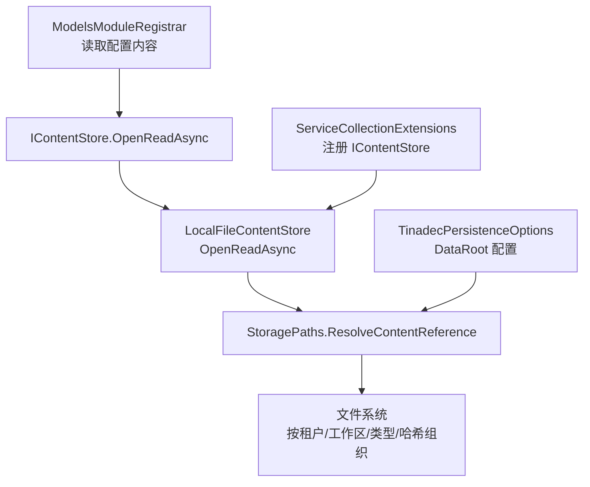
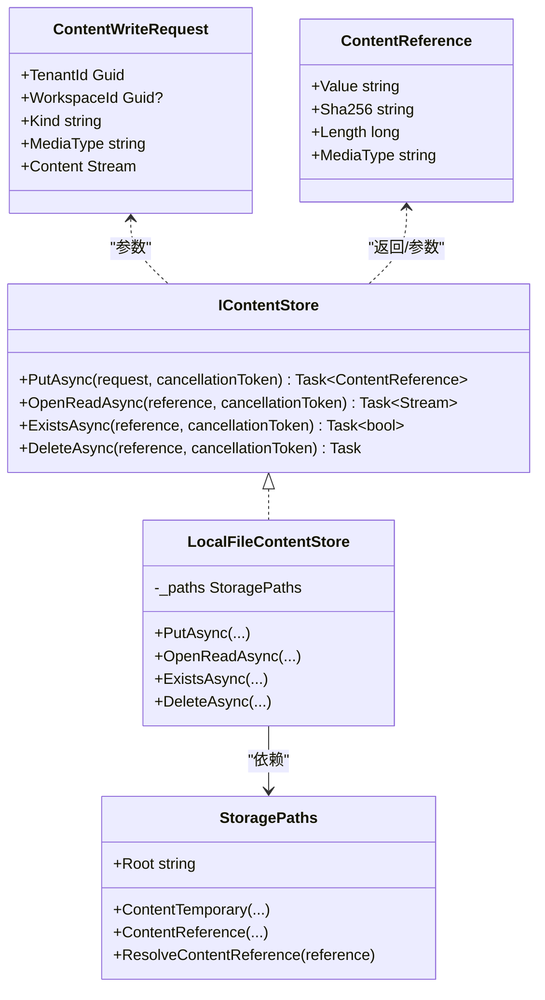
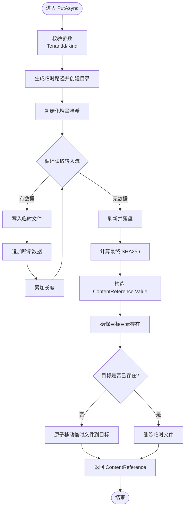
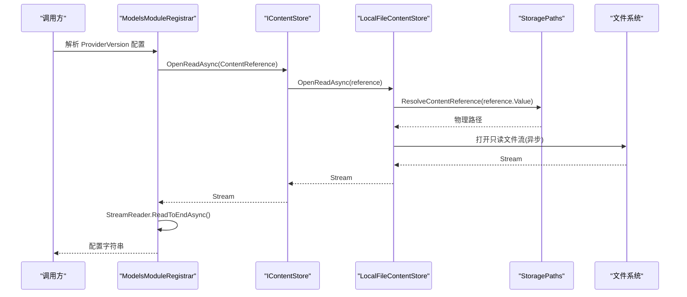
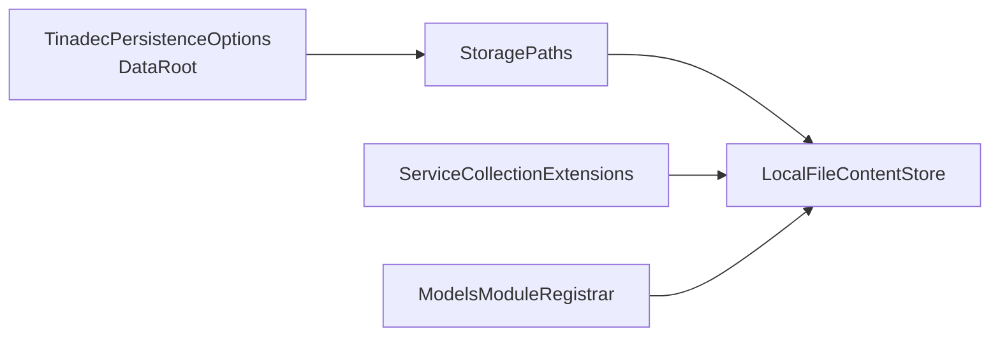

# 内容存储接口

<cite>
**本文引用的文件**   
- [IContentStore.cs](file://TinadecCore\Persistence\IContentStore.cs)
- [LocalFileContentStore.cs](file://TinadecCore\Persistence\LocalFileContentStore.cs)
- [StoragePaths.cs](file://TinadecCore\Persistence\StoragePaths.cs)
- [ServiceCollectionExtensions.cs](file://TinadecCore\Persistence\ServiceCollectionExtensions.cs)
- [ModelsModuleRegistrar.cs](file://TinadecCore\Models\ModelsModuleRegistrar.cs)
- [TinadecPersistenceOptions.cs](file://TinadecCore\Persistence\TinadecPersistenceOptions.cs)
</cite>

## 目录
1. [简介](#简介)
2. [项目结构](#项目结构)
3. [核心组件](#核心组件)
4. [架构总览](#架构总览)
5. [详细组件分析](#详细组件分析)
6. [依赖关系分析](#依赖关系分析)
7. [性能考虑](#性能考虑)
8. [故障排查指南](#故障排查指南)
9. [结论](#结论)
10. [附录：自定义后端开发指南与最佳实践](#附录自定义后端开发指南与最佳实践)

## 简介
本文件围绕不可变大内容存储接口 IContentStore 进行系统化文档化，涵盖设计模式、职责边界、核心方法语义、数据模型意图、流式处理与完整性校验实现细节，以及扩展自定义后端的实践建议。该接口用于以“引用+元数据”的方式持久化大体积内容（如配置、模型定义、产物等），数据库仅保存不透明引用和完整性元数据，实际内容落盘或交由其他后端管理，从而实现高吞吐、低内存占用与跨进程/实例共享的稳定性。

## 项目结构
IContentStore 位于持久化层，配合 StoragePaths 统一解析内容路径，由服务注册装配默认实现 LocalFileContentStore，并在业务模块中通过 OpenReadAsync 读取内容。

图表来源
- [ModelsModuleRegistrar.cs:147-152](file://TinadecCore\Models\ModelsModuleRegistrar.cs#L147-L152)
- [LocalFileContentStore.cs:51-56](file://TinadecCore\Persistence\LocalFileContentStore.cs#L51-L56)
- [StoragePaths.cs:34-41](file://TinadecCore\Persistence\StoragePaths.cs#L34-L41)
- [ServiceCollectionExtensions.cs:40-42](file://TinadecCore\Persistence\ServiceCollectionExtensions.cs#L40-L42)
- [TinadecPersistenceOptions.cs:22](file://TinadecCore\Persistence\TinadecPersistenceOptions.cs#L22)

章节来源
- [IContentStore.cs:1-20](file://TinadecCore\Persistence\IContentStore.cs#L1-L20)
- [LocalFileContentStore.cs:1-68](file://TinadecCore\Persistence\LocalFileContentStore.cs#L1-L68)
- [StoragePaths.cs:1-64](file://TinadecCore\Persistence\StoragePaths.cs#L1-L64)
- [ServiceCollectionExtensions.cs:1-122](file://TinadecCore\Persistence\ServiceCollectionExtensions.cs#L1-L122)
- [ModelsModuleRegistrar.cs:120-168](file://TinadecCore\Models\ModelsModuleRegistrar.cs#L120-L168)
- [TinadecPersistenceOptions.cs:1-48](file://TinadecCore\Persistence\TinadecPersistenceOptions.cs#L1-L48)

## 核心组件
- IContentStore：不可变大内容存储抽象，提供写入、读取、存在性检查与删除能力。
- ContentWriteRequest：写入请求，包含租户、可选工作区、内容类型、媒体类型与输入流。
- ContentReference：不可变引用，包含 Value（相对路径）、Sha256、Length、MediaType。
- LocalFileContentStore：基于本地文件系统的默认实现，具备分块流式写入、增量 SHA256 校验、原子移动与异步读取。
- StoragePaths：统一解析与生成内容路径，保障安全前缀与命名段合法性。
- ServiceCollectionExtensions：将 IContentStore 默认实现注入 DI 容器。
- ModelsModuleRegistrar：演示如何通过 ContentReference 读取 JSON 配置内容。

章节来源
- [IContentStore.cs:1-20](file://TinadecCore\Persistence\IContentStore.cs#L1-L20)
- [LocalFileContentStore.cs:1-68](file://TinadecCore\Persistence\LocalFileContentStore.cs#L1-L68)
- [StoragePaths.cs:1-64](file://TinadecCore\Persistence\StoragePaths.cs#L1-L64)
- [ServiceCollectionExtensions.cs:40-42](file://TinadecCore\Persistence\ServiceCollectionExtensions.cs#L40-L42)
- [ModelsModuleRegistrar.cs:147-152](file://TinadecCore\Models\ModelsModuleRegistrar.cs#L147-L152)

## 架构总览
IContentStore 采用“接口 + 默认实现 + 路径解析器”的分层设计：
- 接口层：定义最小且稳定的读写契约，屏蔽具体存储介质差异。
- 实现层：LocalFileContentStore 负责流式写入、增量哈希、临时文件与原子替换、异步读取。
- 路径层：StoragePaths 保证路径安全、可预测性与隔离性（租户/工作区/类型）。
- 使用方：业务模块通过 DI 获取 IContentStore，以 ContentReference 为唯一标识访问内容。

图表来源
- [IContentStore.cs:1-20](file://TinadecCore\Persistence\IContentStore.cs#L1-L20)
- [LocalFileContentStore.cs:1-68](file://TinadecCore\Persistence\LocalFileContentStore.cs#L1-L68)
- [StoragePaths.cs:1-64](file://TinadecCore\Persistence\StoragePaths.cs#L1-L64)

## 详细组件分析

### IContentStore 接口与方法语义
- PutAsync(ContentWriteRequest, CancellationToken)
  - 用途：将任意流式内容写入不可变存储，返回 ContentReference。
  - 参数：
    - TenantId：租户标识，必填。
    - WorkspaceId：可选的工作区标识，用于进一步隔离。
    - Kind：内容分类（如 model-config、artifact 等），需符合安全字符集。
    - MediaType：MIME 类型，便于上层识别。
    - Content：只读输入流，支持分块读取。
  - 返回值：ContentReference，包含 Value（相对路径）、Sha256、Length、MediaType。
  - 异常：当 TenantId 为空或 Kind 非法时抛出参数异常。
- OpenReadAsync(ContentReference, CancellationToken)
  - 用途：根据引用打开只读流，适合大文件流式消费。
  - 返回值：可异步读取的 Stream。
- ExistsAsync(ContentReference, CancellationToken)
  - 用途：判断引用是否存在。
  - 返回值：布尔值。
- DeleteAsync(ContentReference, CancellationToken)
  - 用途：删除对应内容文件（幂等）。

章节来源
- [IContentStore.cs:1-20](file://TinadecCore\Persistence\IContentStore.cs#L1-L20)
- [LocalFileContentStore.cs:11-49](file://TinadecCore\Persistence\LocalFileContentStore.cs#L11-L49)
- [LocalFileContentStore.cs:51-66](file://TinadecCore\Persistence\LocalFileContentStore.cs#L51-L66)

### ContentWriteRequest 与 ContentReference 数据模型
- ContentWriteRequest
  - 设计意图：将写入上下文（租户、工作区、类型）与原始流解耦，避免一次性加载到内存；Kind 作为逻辑分组键，便于后续索引与权限控制。
- ContentReference
  - 设计意图：以不可变记录承载内容的“地址+指纹+大小+类型”，其中 Sha256 确保内容完整性与去重；Value 为相对路径，避免绝对路径泄露与越权访问。

章节来源
- [IContentStore.cs:12-20](file://TinadecCore\Persistence\IContentStore.cs#L12-L20)

### LocalFileContentStore 实现要点
- 分块流式写入
  - 使用固定大小缓冲（例如 81920 字节）循环读取输入流并写入临时文件，避免整文件驻留内存。
- 完整性校验
  - 在写入过程中同步计算增量 SHA256，最终得到内容指纹，用于构建稳定引用。
- 原子替换
  - 先写临时文件，再移动到目标路径；若目标已存在则丢弃临时文件，保证一致性。
- 异步读取
  - 打开文件流时使用异步 IO 选项，提升并发读取性能。
- 存在性与删除
  - 直接基于文件系统判定与删除，幂等处理。

图表来源
- [LocalFileContentStore.cs:11-49](file://TinadecCore\Persistence\LocalFileContentStore.cs#L11-L49)

章节来源
- [LocalFileContentStore.cs:1-68](file://TinadecCore\Persistence\LocalFileContentStore.cs#L1-L68)

### StoragePaths 路径解析与安全
- 根路径
  - 从配置项 DataRoot 解析，支持相对/绝对路径，并进行规范化。
- 内容路径
  - ContentTemporary：生成临时文件路径（含租户/工作区/类型/随机名）。
  - ContentReference：生成稳定内容路径（含租户/工作区/类型/SHA256）。
  - ResolveContentReference：将引用字符串转换为物理路径，并校验是否为相对路径，防止路径穿越。
- 安全校验
  - Under 方法确保生成的路径始终位于 Root 前缀内，否则抛出异常。
  - SanitizeSegment 限制 Kind 仅允许字母数字及连字符、下划线。

章节来源
- [StoragePaths.cs:1-64](file://TinadecCore\Persistence\StoragePaths.cs#L1-L64)

### 使用示例：读取配置内容
ModelsModuleRegistrar 通过 IContentStore.OpenReadAsync 读取 JSON 配置，并以 StreamReader 全量读取为字符串供 JsonDocument 解析。

图表来源
- [ModelsModuleRegistrar.cs:147-152](file://TinadecCore\Models\ModelsModuleRegistrar.cs#L147-L152)
- [LocalFileContentStore.cs:51-56](file://TinadecCore\Persistence\LocalFileContentStore.cs#L51-L56)
- [StoragePaths.cs:34-41](file://TinadecCore\Persistence\StoragePaths.cs#L34-L41)

章节来源
- [ModelsModuleRegistrar.cs:120-168](file://TinadecCore\Models\ModelsModuleRegistrar.cs#L120-L168)

## 依赖关系分析
- 服务注册
  - ServiceCollectionExtensions 将 StoragePaths 与 IContentStore 默认实现注册为单例。
- 配置依赖
  - TinadecPersistenceOptions.DataRoot 决定内容根目录。
- 使用依赖
  - ModelsModuleRegistrar 依赖 IContentStore 读取内容。

图表来源
- [ServiceCollectionExtensions.cs:40-42](file://TinadecCore\Persistence\ServiceCollectionExtensions.cs#L40-L42)
- [TinadecPersistenceOptions.cs:22](file://TinadecCore\Persistence\TinadecPersistenceOptions.cs#L22)
- [ModelsModuleRegistrar.cs:147-152](file://TinadecCore\Models\ModelsModuleRegistrar.cs#L147-L152)

章节来源
- [ServiceCollectionExtensions.cs:1-122](file://TinadecCore\Persistence\ServiceCollectionExtensions.cs#L1-L122)
- [TinadecPersistenceOptions.cs:1-48](file://TinadecCore\Persistence\TinadecPersistenceOptions.cs#L1-L48)

## 性能考虑
- 流式处理
  - PutAsync 与 OpenReadAsync 均采用流式 I/O，避免整文件内存驻留，适合大文件场景。
- 缓冲区大小
  - 默认缓冲约 81920 字节，平衡了系统调用次数与内存占用，可按磁盘特性调优。
- 异步 IO
  - 读取文件流启用异步选项，提高并发读取吞吐。
- 原子写入
  - 临时文件 + 原子移动减少部分写入导致的损坏风险。
- 缓存策略
  - 当前实现未内置内存缓存；可在上层对热点内容进行轻量级缓存（注意失效策略与一致性）。
- 去重与共享
  - 基于 SHA256 的稳定引用天然支持去重与多租户共享，降低存储空间占用。

[本节为通用指导，无需源码引用]

## 故障排查指南
- 路径越界异常
  - 现象：ResolveContentReference 抛出“路径逃逸”异常。
  - 原因：传入的 reference 非相对路径或被篡改。
  - 处理：确保 Value 为相对路径，并由 StoragePaths 生成。
- 参数校验失败
  - 现象：PutAsync 抛出参数异常（TenantId 为空或 Kind 非法）。
  - 处理：校验调用方传入参数，Kind 仅允许字母数字、连字符、下划线。
- 文件不存在
  - 现象：OpenReadAsync 或 ExistsAsync 操作失败或返回 false。
  - 处理：确认 ContentReference.Value 正确且未被删除。
- 并发写入冲突
  - 现象：临时文件被覆盖或删除。
  - 处理：确保临时文件名唯一（实现已使用 GUID），避免外部干扰。

章节来源
- [StoragePaths.cs:34-53](file://TinadecCore\Persistence\StoragePaths.cs#L34-L53)
- [LocalFileContentStore.cs:11-49](file://TinadecCore\Persistence\LocalFileContentStore.cs#L11-L49)

## 结论
IContentStore 以简洁的异步流式接口定义了不可变大内容存储的核心能力，结合 StoragePaths 的路径安全与 LocalFileContentStore 的高性能实现，满足多租户、可共享、可校验的内容存储需求。上层业务只需关注 ContentReference 即可安全地读写内容，无需关心底层介质细节。

[本节为总结，无需源码引用]

## 附录：自定义后端开发指南与最佳实践
- 实现要求
  - 实现 IContentStore 四个方法，保持幂等与一致性。
  - PutAsync 必须计算并返回正确的 Sha256，并确保 Length 准确。
  - OpenReadAsync 返回只读流，支持异步读取。
  - ExistsAsync 与 DeleteAsync 需幂等。
- 路径与命名
  - 若自行管理路径，请遵循租户/工作区/类型/哈希的分层结构，避免路径穿越。
  - Kind 需通过安全字符集校验。
- 完整性校验
  - 建议在写入阶段计算增量哈希，读取后可选择性验证（如需强一致）。
- 流式与缓冲
  - 使用合理缓冲大小，避免过大内存占用；尽量使用异步 I/O。
- 并发与原子性
  - 写入建议使用临时文件 + 原子替换，避免部分写入导致的数据损坏。
- 错误处理
  - 对非法参数、IO 异常、权限不足等进行明确区分与上报。
- 缓存与去重
  - 可在上层实现缓存层（如内存/分布式缓存），但需保证与 ContentReference 的一致性。
- 测试建议
  - 覆盖正常写入/读取、空流、大文件、重复写入（相同内容不同引用）、删除与存在性检查等用例。

[本节为通用指导，无需源码引用]