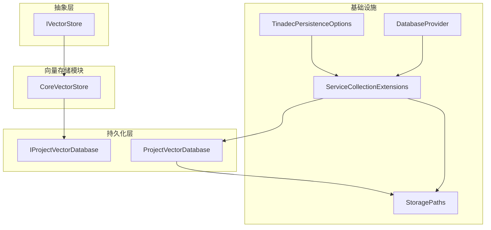
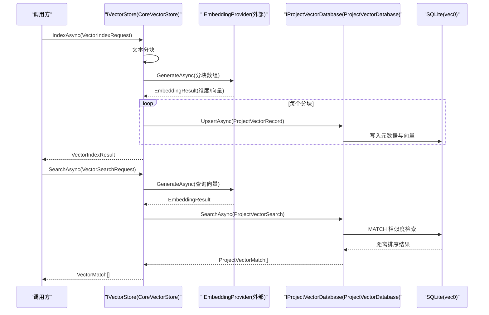
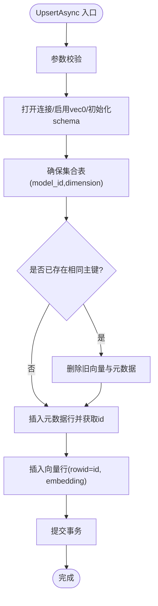
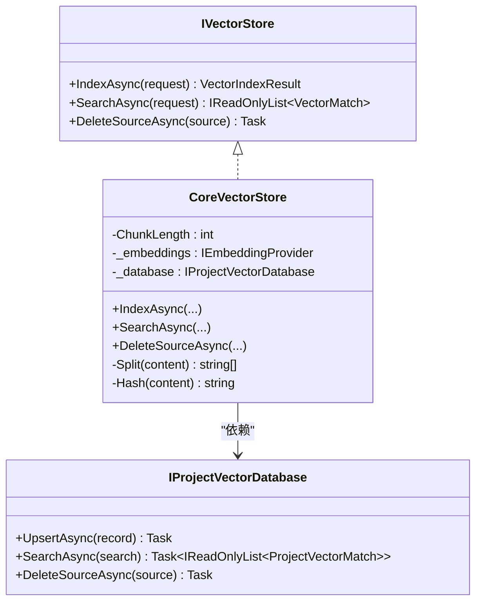
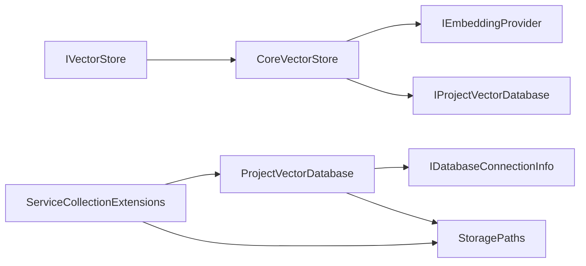

# 向量数据库接口

<cite>
**本文引用的文件**   
- [IProjectVectorDatabase.cs](file://TinadecCore\Persistence\IProjectVectorDatabase.cs)
- [ProjectVectorDatabase.cs](file://TinadecCore\Persistence\ProjectVectorDatabase.cs)
- [IVectorStore.cs](file://TinadecCore\Abstractions\Ports\IVectorStore.cs)
- [VectorStoreModuleRegistrar.cs](file://TinadecCore\VectorStore\VectorStoreModuleRegistrar.cs)
- [ServiceCollectionExtensions.cs](file://TinadecCore\Persistence\ServiceCollectionExtensions.cs)
- [StoragePaths.cs](file://TinadecCore\Persistence\StoragePaths.cs)
- [DatabaseProvider.cs](file://TinadecCore\Persistence\DatabaseProvider.cs)
- [TinadecPersistenceOptions.cs](file://TinadecCore\Persistence\TinadecPersistenceOptions.cs)
- [VectorStoreEndToEndTests.cs](file://TinadecCore\tests\TinadecCore.Api.Tests\VectorStoreEndToEndTests.cs)
</cite>

## 目录
1. [简介](#简介)
2. [项目结构](#项目结构)
3. [核心组件](#核心组件)
4. [架构总览](#架构总览)
5. [详细组件分析](#详细组件分析)
6. [依赖关系分析](#依赖关系分析)
7. [性能考量](#性能考量)
8. [故障排查指南](#故障排查指南)
9. [结论](#结论)
10. [附录](#附录)

## 简介
本文件面向向量数据库接口的设计与实现，重点说明 IProjectVectorDatabase 接口与语义搜索能力、向量嵌入的存储/检索/相似度计算接口，以及 ProjectVectorDatabase 的具体实现与索引策略。文档还涵盖向量数据的生命周期管理、批量操作、事务支持，并提供后端集成指南、性能优化建议，以及分布式部署、数据同步与备份恢复的实践要点。

## 项目结构
- 抽象层：定义领域级向量存储接口 IVectorStore（对外暴露语义索引与检索能力）。
- 持久化层：定义项目级向量数据库接口 IProjectVectorDatabase 及其 SQLite 实现 ProjectVectorDatabase。
- 模块注册：通过 VectorStoreModuleRegistrar 将 IVectorStore 的实现 CoreVectorStore 注入容器。
- 配置与路径：通过 ServiceCollectionExtensions 和 StoragePaths 提供连接信息与文件路径解析；TinadecPersistenceOptions 统一配置项。
- 测试：端到端用例验证 Index/Search/Delete 流程及跨项目隔离。

图表来源
- [IVectorStore.cs:1-59](file://TinadecCore\Abstractions\Ports\IVectorStore.cs#L1-L59)
- [VectorStoreModuleRegistrar.cs:1-105](file://TinadecCore\VectorStore\VectorStoreModuleRegistrar.cs#L1-L105)
- [IProjectVectorDatabase.cs:1-57](file://TinadecCore\Persistence\IProjectVectorDatabase.cs#L1-L57)
- [ProjectVectorDatabase.cs:1-174](file://TinadecCore\Persistence\ProjectVectorDatabase.cs#L1-L174)
- [ServiceCollectionExtensions.cs:1-122](file://TinadecCore\Persistence\ServiceCollectionExtensions.cs#L1-L122)
- [StoragePaths.cs:1-64](file://TinadecCore\Persistence\StoragePaths.cs#L1-L64)
- [TinadecPersistenceOptions.cs:1-48](file://TinadecCore\Persistence\TinadecPersistenceOptions.cs#L1-L48)
- [DatabaseProvider.cs:1-11](file://TinadecCore\Persistence\DatabaseProvider.cs#L1-L11)

章节来源
- [IVectorStore.cs:1-59](file://TinadecCore\Abstractions\Ports\IVectorStore.cs#L1-L59)
- [VectorStoreModuleRegistrar.cs:1-105](file://TinadecCore\VectorStore\VectorStoreModuleRegistrar.cs#L1-L105)
- [IProjectVectorDatabase.cs:1-57](file://TinadecCore\Persistence\IProjectVectorDatabase.cs#L1-L57)
- [ProjectVectorDatabase.cs:1-174](file://TinadecCore\Persistence\ProjectVectorDatabase.cs#L1-L174)
- [ServiceCollectionExtensions.cs:1-122](file://TinadecCore\Persistence\ServiceCollectionExtensions.cs#L1-L122)
- [StoragePaths.cs:1-64](file://TinadecCore\Persistence\StoragePaths.cs#L1-L64)
- [TinadecPersistenceOptions.cs:1-48](file://TinadecCore\Persistence\TinadecPersistenceOptions.cs#L1-L48)
- [DatabaseProvider.cs:1-11](file://TinadecCore\Persistence\DatabaseProvider.cs#L1-L11)

## 核心组件
- IVectorStore：对外暴露语义索引、搜索与删除能力，屏蔽底层向量库细节。
- CoreVectorStore：编排分块、调用嵌入生成器、写入 ProjectVectorDatabase，并转换结果。
- IProjectVectorDatabase：项目级向量库契约，包含 UpsertAsync、SearchAsync、DeleteSourceAsync。
- ProjectVectorDatabase：基于 SQLite + vec0 扩展的向量表实现，负责元数据与向量的持久化、相似度检索与事务一致性。

章节来源
- [IVectorStore.cs:1-59](file://TinadecCore\Abstractions\Ports\IVectorStore.cs#L1-L59)
- [VectorStoreModuleRegistrar.cs:1-105](file://TinadecCore\VectorStore\VectorStoreModuleRegistrar.cs#L1-L105)
- [IProjectVectorDatabase.cs:1-57](file://TinadecCore\Persistence\IProjectVectorDatabase.cs#L1-L57)
- [ProjectVectorDatabase.cs:1-174](file://TinadecCore\Persistence\ProjectVectorDatabase.cs#L1-L174)

## 架构总览
下图展示从上层 IVectorStore 到持久化的完整调用链，包括嵌入生成、分块、写入、检索与结果映射。

图表来源
- [VectorStoreModuleRegistrar.cs:29-105](file://TinadecCore\VectorStore\VectorStoreModuleRegistrar.cs#L29-L105)
- [ProjectVectorDatabase.cs:20-107](file://TinadecCore\Persistence\ProjectVectorDatabase.cs#L20-L107)
- [IVectorStore.cs:1-59](file://TinadecCore\Abstractions\Ports\IVectorStore.cs#L1-L59)

## 详细组件分析

### IProjectVectorDatabase 接口设计
- 职责边界：面向“项目”维度的向量索引与检索，屏蔽具体存储实现。
- 关键方法：
  - UpsertAsync：按 source+revision+chunk_index 幂等更新或插入。
  - SearchAsync：按 namespace/model_id/embedding 进行相似度检索，支持最小分数与源类型过滤。
  - DeleteSourceAsync：按 source 维度删除所有分块与对应向量。
- 数据模型：
  - ProjectVectorScope：租户/工作区/项目范围。
  - ProjectVectorSource：命名空间、源类型、源标识。
  - ProjectVectorRecord：分块内容、哈希、模型ID、向量、元数据。
  - ProjectVectorSearch：查询参数（含 limit、minimumScore、sourceTypes）。
  - ProjectVectorMatch：匹配结果（含 score、content、metadata）。

章节来源
- [IProjectVectorDatabase.cs:1-57](file://TinadecCore\Persistence\IProjectVectorDatabase.cs#L1-L57)

### ProjectVectorDatabase 实现与索引策略
- 存储引擎：SQLite + vec0 扩展虚拟表，使用 float[] 向量列与内置 MATCH 算子进行相似度检索。
- 表结构：
  - vector_chunks：元数据与内容（namespace/source_type/source_id/source_revision/chunk_index/content_hash/content/model_id/metadata_json/created_at），唯一索引保证幂等。
  - vector_collections：记录 model_id 与 dimension，用于校验维度一致性。
  - 向量表：按 model_id 与 dimension 动态创建（如 vec_<hash>_<dim>），rowid 与 vector_chunks.id 关联。
- Upsert 流程：
  - 校验参数后打开连接、启用 vec0 扩展、确保 schema。
  - 检查是否存在相同主键组合，若存在则先删除旧行。
  - 插入元数据行并获取 id，再插入向量行，最后提交事务。
- Search 流程：
  - 构造 MATCH 查询，限制 k=limit*4 后在应用层二次过滤（sourceTypes、minimumScore），返回 top-k。
- Delete 流程：
  - 查找该 source 的所有 id 与 model_id，遍历删除向量表与元数据行，事务提交。
- 路径与连接：
  - 通过 StoragePaths.ProjectVectorDatabase 生成 per-project 的 .db 文件路径。
  - 当前仅支持 Sqlite；PostgreSQL 尚未实现。

图表来源
- [ProjectVectorDatabase.cs:20-60](file://TinadecCore\Persistence\ProjectVectorDatabase.cs#L20-L60)
- [ProjectVectorDatabase.cs:109-141](file://TinadecCore\Persistence\ProjectVectorDatabase.cs#L109-L141)

章节来源
- [ProjectVectorDatabase.cs:1-174](file://TinadecCore\Persistence\ProjectVectorDatabase.cs#L1-L174)
- [StoragePaths.cs:25-26](file://TinadecCore\Persistence\StoragePaths.cs#L25-L26)

### IVectorStore 与 CoreVectorStore 编排
- 分块策略：固定长度切分（默认 1600 字符），便于控制嵌入成本与上下文窗口。
- 嵌入生成：调用 IEmbeddingProvider.GenerateAsync，要求返回一致的维度与向量数量。
- 写入：逐分块构建 ProjectVectorRecord 并调用 _database.UpsertAsync。
- 搜索：对查询文本生成向量，调用 _database.SearchAsync，并将 ProjectVectorMatch 映射为 VectorMatch。
- 删除：按 source 引用直接委托给 _database.DeleteSourceAsync。

图表来源
- [IVectorStore.cs:1-59](file://TinadecCore\Abstractions\Ports\IVectorStore.cs#L1-L59)
- [VectorStoreModuleRegistrar.cs:29-105](file://TinadecCore\VectorStore\VectorStoreModuleRegistrar.cs#L29-L105)
- [IProjectVectorDatabase.cs:1-57](file://TinadecCore\Persistence\IProjectVectorDatabase.cs#L1-L57)

章节来源
- [VectorStoreModuleRegistrar.cs:29-105](file://TinadecCore\VectorStore\VectorStoreModuleRegistrar.cs#L29-L105)
- [IVectorStore.cs:1-59](file://TinadecCore\Abstractions\Ports\IVectorStore.cs#L1-L59)

### 配置与依赖注入
- ServiceCollectionExtensions.AddTinadecPersistence：
  - 绑定 TinadecPersistenceOptions，注册 IDatabaseConnectionInfo、ITinadecDatabaseConfigurer、IDatabaseReadiness、StoragePaths、IContentStore、IProjectVectorDatabase、ISecretStore、IStorageMigrationRunner。
  - 根据 Provider 选择 SQLite 或 PostgreSQL 的连接信息解析。
- StoragePaths：
  - 基于 DataRoot 解析 per-tenant/workspace/project 的向量数据库文件路径。
- DatabaseProvider：
  - 枚举 Sqlite/PostgreSql，当前实现仅支持 Sqlite。

章节来源
- [ServiceCollectionExtensions.cs:1-122](file://TinadecCore\Persistence\ServiceCollectionExtensions.cs#L1-L122)
- [StoragePaths.cs:1-64](file://TinadecCore\Persistence\StoragePaths.cs#L1-L64)
- [DatabaseProvider.cs:1-11](file://TinadecCore\Persistence\DatabaseProvider.cs#L1-L11)
- [TinadecPersistenceOptions.cs:1-48](file://TinadecCore\Persistence\TinadecPersistenceOptions.cs#L1-L48)

### 端到端测试要点
- 验证 Index/Search/Delete 全链路，确认通过嵌入提供者与项目级数据库。
- 验证跨项目隔离：不同 projectId 的查询不应返回其他项目的结果。
- 使用 FakeEmbeddingProvider 提供确定性向量，便于断言。

章节来源
- [VectorStoreEndToEndTests.cs:1-136](file://TinadecCore\tests\TinadecCore.Api.Tests\VectorStoreEndToEndTests.cs#L1-L136)

## 依赖关系分析
- 耦合关系：
  - CoreVectorStore 依赖 IEmbeddingProvider 与 IProjectVectorDatabase。
  - ProjectVectorDatabase 依赖 IDatabaseConnectionInfo 与 StoragePaths。
  - ServiceCollectionExtensions 集中装配上述依赖。
- 外部依赖：
  - SQLite 与 vec0 扩展（向量虚拟表）。
  - 嵌入服务（IEmbeddingProvider）由上层模块提供。
- 潜在循环依赖：无（分层清晰，单向依赖）。

图表来源
- [VectorStoreModuleRegistrar.cs:10-27](file://TinadecCore\VectorStore\VectorStoreModuleRegistrar.cs#L10-L27)
- [ServiceCollectionExtensions.cs:32-48](file://TinadecCore\Persistence\ServiceCollectionExtensions.cs#L32-L48)
- [ProjectVectorDatabase.cs:14-18](file://TinadecCore\Persistence\ProjectVectorDatabase.cs#L14-L18)

章节来源
- [VectorStoreModuleRegistrar.cs:1-105](file://TinadecCore\VectorStore\VectorStoreModuleRegistrar.cs#L1-L105)
- [ServiceCollectionExtensions.cs:1-122](file://TinadecCore\Persistence\ServiceCollectionExtensions.cs#L1-L122)
- [ProjectVectorDatabase.cs:1-174](file://TinadecCore\Persistence\ProjectVectorDatabase.cs#L1-L174)

## 性能考量
- 分块大小：默认 1600 字符，需结合模型上下文窗口与嵌入成本权衡。
- 检索 k 值：内部 k=limit*4 以留出过滤余量，避免过多 IO；可根据命中率调优。
- 向量表隔离：按 model_id+dimension 隔离向量表，避免跨模型冲突。
- 事务粒度：Upsert/Delete 均使用单事务，保证元数据与向量一致性。
- 连接复用：SQLite 连接短生命周期，适合桌面场景；高并发应评估连接池与锁竞争。
- 索引策略：vector_chunks 的唯一索引保障幂等与去重；vec0 虚拟表利用内置 ANN 索引。

[本节为通用指导，不直接分析具体文件]

## 故障排查指南
- 非 SQLite 后端未实现：当 Provider 为 PostgreSql 时，OpenAsync 会抛出“不支持”异常。
- 维度不一致：EnsureCollectionAsync 检测到 model_id 维度变化会抛出异常，需重建索引或升级模型。
- 参数校验失败：Validate 系列方法对必填字段进行检查，错误会抛出 ArgumentException。
- 路径越界：StoragePaths 会拒绝超出 DataRoot 的路径，防止非法访问。
- 测试定位：参考端到端测试用例，替换 IEmbeddingProvider 以复现实例问题。

章节来源
- [ProjectVectorDatabase.cs:111](file://TinadecCore\Persistence\ProjectVectorDatabase.cs#L111)
- [ProjectVectorDatabase.cs:130](file://TinadecCore\Persistence\ProjectVectorDatabase.cs#L130)
- [ProjectVectorDatabase.cs:169-172](file://TinadecCore\Persistence\ProjectVectorDatabase.cs#L169-L172)
- [StoragePaths.cs:43-52](file://TinadecCore\Persistence\StoragePaths.cs#L43-L52)
- [VectorStoreEndToEndTests.cs:99-117](file://TinadecCore\tests\TinadecCore.Api.Tests\VectorStoreEndToEndTests.cs#L99-L117)

## 结论
本项目通过 IVectorStore 与 IProjectVectorDatabase 的分层设计，实现了清晰的语义索引与检索能力。ProjectVectorDatabase 基于 SQLite 与 vec0 扩展提供了轻量、可移植的向量存储方案，并通过严格的事务与校验保证数据一致性。对于生产环境，建议结合业务规模评估 SQLite 的并发与容量上限，必要时扩展 PostgreSQL 后端以实现分布式部署与更高吞吐。

[本节为总结性内容，不直接分析具体文件]

## 附录

### 向量数据生命周期管理
- 创建：IndexAsync 分块→生成嵌入→UpsertAsync 写入元数据与向量。
- 更新：相同 source+revision+chunk_index 的 Upsert 会覆盖旧数据。
- 删除：DeleteSourceAsync 按 source 清理元数据与向量。
- 检索：SearchAsync 生成查询向量→MATCH 检索→应用层过滤→返回 top-k。

章节来源
- [VectorStoreModuleRegistrar.cs:41-83](file://TinadecCore\VectorStore\VectorStoreModuleRegistrar.cs#L41-L83)
- [ProjectVectorDatabase.cs:20-107](file://TinadecCore\Persistence\ProjectVectorDatabase.cs#L20-L107)

### 批量操作与事务支持
- 当前实现为逐条 Upsert，未提供批量 API；可通过上层聚合多次调用并在调用侧控制并发。
- 每条 Upsert 内部使用事务保证元数据与向量一致；DeleteSourceAsync 亦使用事务批量删除。

章节来源
- [ProjectVectorDatabase.cs:25-59](file://TinadecCore\Persistence\ProjectVectorDatabase.cs#L25-L59)
- [ProjectVectorDatabase.cs:100-107](file://TinadecCore\Persistence\ProjectVectorDatabase.cs#L100-L107)

### 后端集成指南
- 启用持久化：在 AddTinadecPersistence 中绑定配置，确保 DataRoot 与 Provider 正确设置。
- 选择后端：默认 SQLite；如需 PostgreSQL，需在 ProjectVectorDatabase 中补充实现。
- 嵌入服务：实现 IEmbeddingProvider 并注册到容器，确保返回一致的维度与向量。

章节来源
- [ServiceCollectionExtensions.cs:15-48](file://TinadecCore\Persistence\ServiceCollectionExtensions.cs#L15-L48)
- [DatabaseProvider.cs:6-10](file://TinadecCore\Persistence\DatabaseProvider.cs#L6-L10)
- [TinadecPersistenceOptions.cs:7-32](file://TinadecCore\Persistence\TinadecPersistenceOptions.cs#L7-L32)

### 分布式部署、数据同步与备份恢复
- 分布式部署：SQLite 不适合多实例并发写；推荐迁移至 PostgreSQL 后端并实现 ProjectVectorDatabase 的 PG 版本。
- 数据同步：基于 source_id/source_revision 的幂等写入，便于增量同步与冲突解决。
- 备份恢复：SQLite 可直接拷贝 .db 文件；PG 可使用原生备份工具；注意向量表与元数据的一致性。

[本节为通用实践建议，不直接分析具体文件]