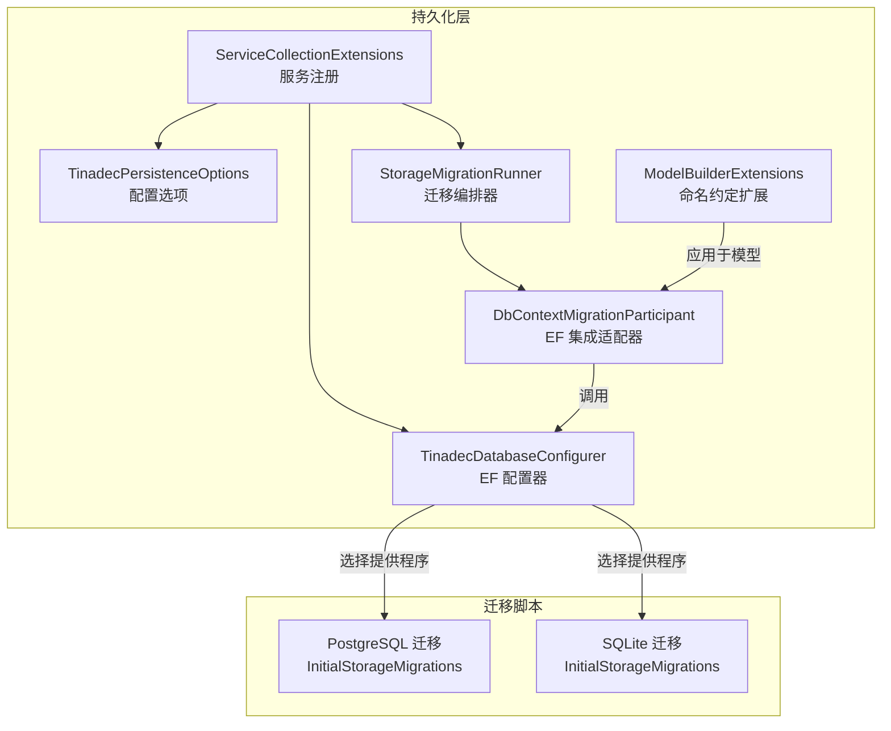
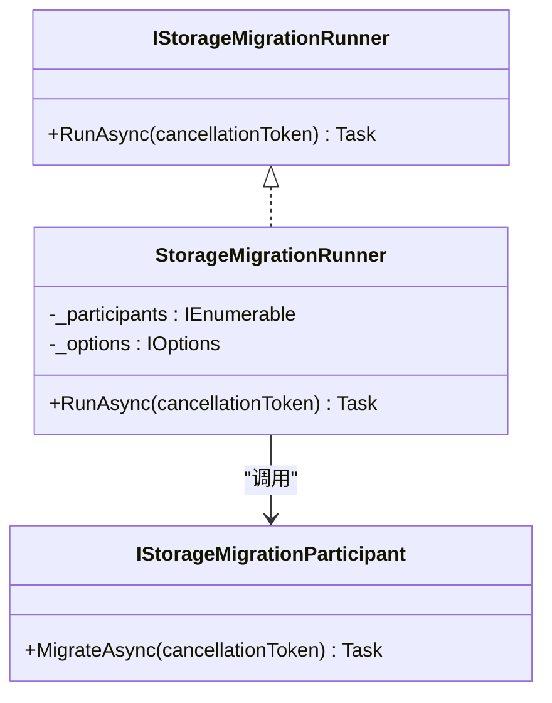
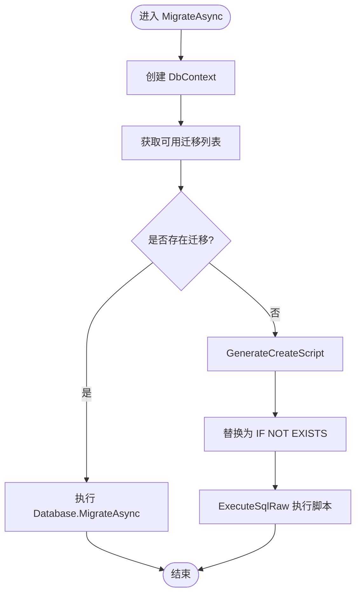
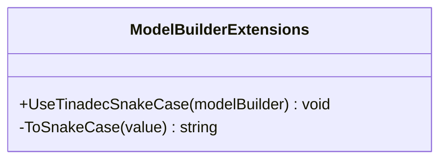
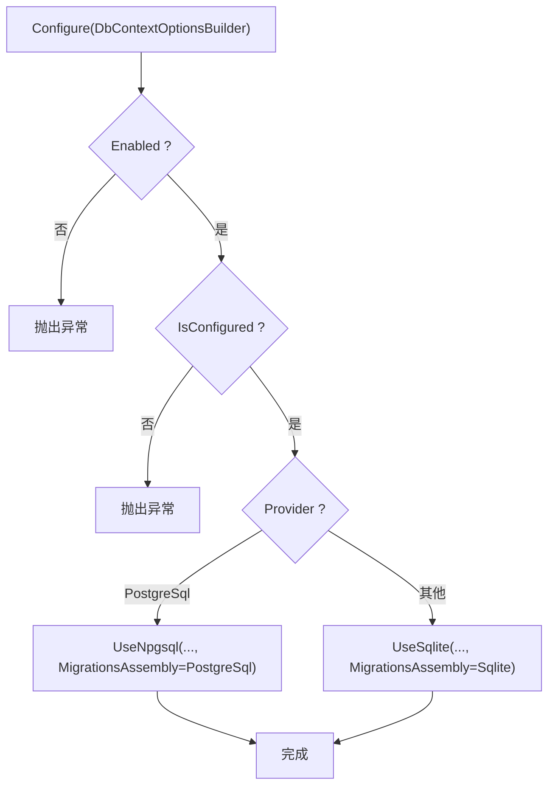
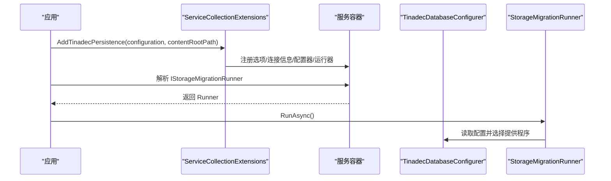
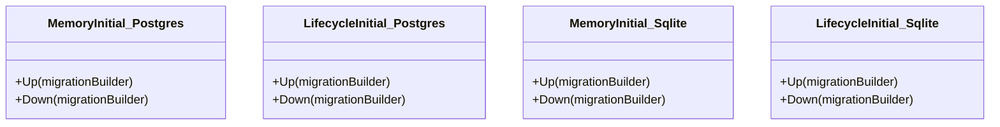
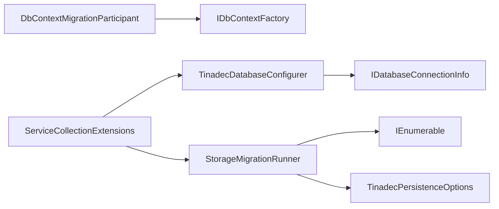

# 存储迁移系统

<cite>
**本文引用的文件**   
- [StorageMigration.cs](file://TinadecCore\Persistence\StorageMigration.cs)
- [DbContextMigrationParticipant.cs](file://TinadecCore\Persistence\DbContextMigrationParticipant.cs)
- [ModelBuilderExtensions.cs](file://TinadecCore\Persistence\ModelBuilderExtensions.cs)
- [TinadecDatabaseConfigurer.cs](file://TinadecCore\Persistence\TinadecDatabaseConfigurer.cs)
- [ServiceCollectionExtensions.cs](file://TinadecCore\Persistence\ServiceCollectionExtensions.cs)
- [TinadecPersistenceOptions.cs](file://TinadecCore\Persistence\TinadecPersistenceOptions.cs)
- [InitialStorageMigrations.cs（PostgreSQL）](file://TinadecCore\Storage.Migrations.PostgreSql\InitialStorageMigrations.cs)
- [InitialStorageMigrations.cs（SQLite）](file://TinadecCore\Storage.Migrations.Sqlite\InitialStorageMigrations.cs)
- [MigrationTests.cs](file://tests\TinadecCore.Tests\MigrationTests.cs)
- [DatabaseProvider.cs](file://TinadecCore\Persistence\DatabaseProvider.cs)
- [IDatabaseConnectionInfo.cs](file://TinadecCore\Persistence\IDatabaseConnectionInfo.cs)
- [DatabaseConnectionInfo.cs](file://TinadecCore\Persistence\DatabaseConnectionInfo.cs)
</cite>

## 目录
1. [简介](#简介)
2. [项目结构](#项目结构)
3. [核心组件](#核心组件)
4. [架构总览](#架构总览)
5. [详细组件分析](#详细组件分析)
6. [依赖关系分析](#依赖关系分析)
7. [性能考虑](#性能考虑)
8. [故障排查指南](#故障排查指南)
9. [结论](#结论)
10. [附录](#附录)

## 简介
本文件系统化阐述存储迁移系统的实现与使用，覆盖以下主题：
- StorageMigration 的迁移管理与版本控制
- DbContextMigrationParticipant 的实体框架集成与自动迁移
- ModelBuilderExtensions 的模型构建器与命名约定扩展
- 迁移脚本的生成、执行与回滚机制
- 自定义迁移逻辑的开发指南
- 数据转换、向后兼容性与迁移测试策略

该子系统基于 EF Core 的迁移能力，结合统一的启动期迁移编排器，为多模块、多数据库提供一致的迁移体验。

## 项目结构
存储迁移相关代码主要分布在 Persistence 与 Storage.Migrations.* 两个区域：
- Persistence：定义迁移参与者接口、EF 集成适配器、配置项、服务注册与数据库配置器
- Storage.Migrations.PostgreSql / Storage.Migrations.Sqlite：按数据库提供程序分离的迁移脚本集



图表来源 
- [ServiceCollectionExtensions.cs:1-122](file://TinadecCore\Persistence\ServiceCollectionExtensions.cs#L1-L122)
- [TinadecDatabaseConfigurer.cs:1-48](file://TinadecCore\Persistence\TinadecDatabaseConfigurer.cs#L1-L48)
- [TinadecPersistenceOptions.cs:1-48](file://TinadecCore\Persistence\TinadecPersistenceOptions.cs#L1-L48)
- [StorageMigration.cs:1-41](file://TinadecCore\Persistence\StorageMigration.cs#L1-L41)
- [DbContextMigrationParticipant.cs:1-37](file://TinadecCore\Persistence\DbContextMigrationParticipant.cs#L1-L37)
- [ModelBuilderExtensions.cs:1-31](file://TinadecCore\Persistence\ModelBuilderExtensions.cs#L1-L31)
- [InitialStorageMigrations.cs（PostgreSQL）:1-42](file://TinadecCore\Storage.Migrations.PostgreSql\InitialStorageMigrations.cs#L1-L42)
- [InitialStorageMigrations.cs（SQLite）:1-64](file://TinadecCore\Storage.Migrations.Sqlite\InitialStorageMigrations.cs#L1-L64)

章节来源
- [ServiceCollectionExtensions.cs:1-122](file://TinadecCore\Persistence\ServiceCollectionExtensions.cs#L1-L122)
- [TinadecDatabaseConfigurer.cs:1-48](file://TinadecCore\Persistence\TinadecDatabaseConfigurer.cs#L1-L48)
- [TinadecPersistenceOptions.cs:1-48](file://TinadecCore\Persistence\TinadecPersistenceOptions.cs#L1-L48)
- [StorageMigration.cs:1-41](file://TinadecCore\Persistence\StorageMigration.cs#L1-L41)
- [DbContextMigrationParticipant.cs:1-37](file://TinadecCore\Persistence\DbContextMigrationParticipant.cs#L1-L37)
- [ModelBuilderExtensions.cs:1-31](file://TinadecCore\Persistence\ModelBuilderExtensions.cs#L1-L31)
- [InitialStorageMigrations.cs（PostgreSQL）:1-42](file://TinadecCore\Storage.Migrations.PostgreSql\InitialStorageMigrations.cs#L1-L42)
- [InitialStorageMigrations.cs（SQLite）:1-64](file://TinadecCore\Storage.Migrations.Sqlite\InitialStorageMigrations.cs#L1-L64)

## 核心组件
- IStorageMigrationParticipant：业务模块声明式参与迁移的契约
- IStorageMigrationRunner 与 StorageMigrationRunner：统一编排并顺序执行所有参与者的迁移
- DbContextMigrationParticipant<TContext>：将 EF DbContext 的迁移或表初始化纳入统一流程
- TinadecDatabaseConfigurer：根据配置选择 SQLite/PostgreSQL 并提供迁移程序集
- ServiceCollectionExtensions：集中注册选项、连接信息、配置器、就绪检查与迁移运行器
- TinadecPersistenceOptions：启用开关、提供程序选择、是否启动时应用迁移等
- ModelBuilderExtensions：统一 snake_case 列名约定，保证跨库一致性

章节来源
- [StorageMigration.cs:1-41](file://TinadecCore\Persistence\StorageMigration.cs#L1-L41)
- [DbContextMigrationParticipant.cs:1-37](file://TinadecCore\Persistence\DbContextMigrationParticipant.cs#L1-L37)
- [ModelBuilderExtensions.cs:1-31](file://TinadecCore\Persistence\ModelBuilderExtensions.cs#L1-L31)
- [TinadecDatabaseConfigurer.cs:1-48](file://TinadecCore\Persistence\TinadecDatabaseConfigurer.cs#L1-L48)
- [ServiceCollectionExtensions.cs:1-122](file://TinadecCore\Persistence\ServiceCollectionExtensions.cs#L1-L122)
- [TinadecPersistenceOptions.cs:1-48](file://TinadecCore\Persistence\TinadecPersistenceOptions.cs#L1-L48)

## 架构总览
下图展示了从应用启动到迁移执行的端到端流程，以及不同数据库提供程序的分支行为。

```mermaid
sequenceDiagram
participant App as "应用程序"
participant DI as "服务容器"
participant Runner as "StorageMigrationRunner"
participant Participant as "IStorageMigrationParticipant*"
participant EF as "EF DbContext"
participant DB as "数据库"
App->>DI : 解析 IStorageMigrationRunner
DI-->>App : 返回 StorageMigrationRunner
App->>Runner : RunAsync()
Runner->>Runner : 读取 TinadecPersistenceOptions
alt 已禁用或 PostgreSQL 未开启启动迁移
Runner-->>App : 直接返回
else 允许迁移
loop 遍历所有参与者
Runner->>Participant : MigrateAsync()
alt 存在迁移
Participant->>EF : Database.MigrateAsync()
EF->>DB : 执行迁移
DB-->>EF : 成功
EF-->>Participant : 完成
else 无迁移
Participant->>EF : GenerateCreateScript()
EF->>DB : ExecuteSqlRaw(IF NOT EXISTS)
DB-->>EF : 成功
EF-->>Participant : 完成
end
end
Runner-->>App : 全部完成
end
```

图表来源 
- [StorageMigration.cs:1-41](file://TinadecCore\Persistence\StorageMigration.cs#L1-L41)
- [DbContextMigrationParticipant.cs:1-37](file://TinadecCore\Persistence\DbContextMigrationParticipant.cs#L1-L37)
- [TinadecPersistenceOptions.cs:1-48](file://TinadecCore\Persistence\TinadecPersistenceOptions.cs#L1-L48)

章节来源
- [StorageMigration.cs:1-41](file://TinadecCore\Persistence\StorageMigration.cs#L1-L41)
- [DbContextMigrationParticipant.cs:1-37](file://TinadecCore\Persistence\DbContextMigrationParticipant.cs#L1-L37)
- [TinadecPersistenceOptions.cs:1-48](file://TinadecCore\Persistence\TinadecPersistenceOptions.cs#L1-L48)

## 详细组件分析

### StorageMigration 与迁移编排
- IStorageMigrationParticipant：每个业务模块通过实现该接口声明自己的迁移逻辑
- StorageMigrationRunner：
  - 读取配置决定是否启用迁移
  - 对 PostgreSQL 默认不启动时自动迁移，需显式开启 ApplyMigrationsOnStartup
  - 顺序调用各参与者的 MigrateAsync，确保幂等与可重试



图表来源 
- [StorageMigration.cs:1-41](file://TinadecCore\Persistence\StorageMigration.cs#L1-L41)
- [TinadecPersistenceOptions.cs:1-48](file://TinadecCore\Persistence\TinadecPersistenceOptions.cs#L1-L48)

章节来源
- [StorageMigration.cs:1-41](file://TinadecCore\Persistence\StorageMigration.cs#L1-L41)
- [TinadecPersistenceOptions.cs:1-48](file://TinadecCore\Persistence\TinadecPersistenceOptions.cs#L1-L48)

### DbContextMigrationParticipant 与 EF 集成
- 针对每个 DbContext 提供通用迁移入口
- 若存在迁移则调用 EF 的 MigrateAsync
- 若无迁移，则生成创建脚本并以 IF NOT EXISTS 形式执行，保证幂等



图表来源 
- [DbContextMigrationParticipant.cs:1-37](file://TinadecCore\Persistence\DbContextMigrationParticipant.cs#L1-L37)

章节来源
- [DbContextMigrationParticipant.cs:1-37](file://TinadecCore\Persistence\DbContextMigrationParticipant.cs#L1-L37)

### ModelBuilderExtensions 模型构建器扩展
- 提供 UseTinadecSnakeCase 扩展方法，将所有实体属性映射为 snake_case 列名
- 保证跨数据库一致性与可读性



图表来源 
- [ModelBuilderExtensions.cs:1-31](file://TinadecCore\Persistence\ModelBuilderExtensions.cs#L1-L31)

章节来源
- [ModelBuilderExtensions.cs:1-31](file://TinadecCore\Persistence\ModelBuilderExtensions.cs#L1-L31)

### 数据库配置与提供程序选择
- TinadecDatabaseConfigurer 根据 IDatabaseConnectionInfo 与配置决定使用 Npgsql 或 Sqlite
- 指定对应迁移程序集，使 EF 能找到迁移类



图表来源 
- [TinadecDatabaseConfigurer.cs:1-48](file://TinadecCore\Persistence\TinadecDatabaseConfigurer.cs#L1-L48)
- [IDatabaseConnectionInfo.cs:1-18](file://TinadecCore\Persistence\IDatabaseConnectionInfo.cs#L1-L18)
- [DatabaseConnectionInfo.cs:1-23](file://TinadecCore\Persistence\DatabaseConnectionInfo.cs#L1-L23)

章节来源
- [TinadecDatabaseConfigurer.cs:1-48](file://TinadecCore\Persistence\TinadecDatabaseConfigurer.cs#L1-L48)
- [IDatabaseConnectionInfo.cs:1-18](file://TinadecCore\Persistence\IDatabaseConnectionInfo.cs#L1-L18)
- [DatabaseConnectionInfo.cs:1-23](file://TinadecCore\Persistence\DatabaseConnectionInfo.cs#L1-L23)

### 服务注册与启动集成
- ServiceCollectionExtensions.AddTinadecPersistence 注册选项、连接信息、配置器、就绪检查、迁移运行器等
- UseTinadecDatabase 将当前提供程序应用到具体 DbContext 的 OptionsBuilder



图表来源 
- [ServiceCollectionExtensions.cs:1-122](file://TinadecCore\Persistence\ServiceCollectionExtensions.cs#L1-L122)
- [TinadecDatabaseConfigurer.cs:1-48](file://TinadecCore\Persistence\TinadecDatabaseConfigurer.cs#L1-L48)

章节来源
- [ServiceCollectionExtensions.cs:1-122](file://TinadecCore\Persistence\ServiceCollectionExtensions.cs#L1-L122)

### 迁移脚本与版本控制
- 按提供程序分离迁移程序集，避免跨库类型泄漏
- 迁移类标注 DbContext 与 Migration 标识，Up/Down 分别定义升级与回滚
- 示例包含 Memory/Lifecycle 初始迁移，涵盖表结构与索引



图表来源 
- [InitialStorageMigrations.cs（PostgreSQL）:1-42](file://TinadecCore\Storage.Migrations.PostgreSql\InitialStorageMigrations.cs#L1-L42)
- [InitialStorageMigrations.cs（SQLite）:1-64](file://TinadecCore\Storage.Migrations.Sqlite\InitialStorageMigrations.cs#L1-L64)

章节来源
- [InitialStorageMigrations.cs（PostgreSQL）:1-42](file://TinadecCore\Storage.Migrations.PostgreSql\InitialStorageMigrations.cs#L1-L42)
- [InitialStorageMigrations.cs（SQLite）:1-64](file://TinadecCore\Storage.Migrations.Sqlite\InitialStorageMigrations.cs#L1-L64)

## 依赖关系分析
- StorageMigrationRunner 依赖 IStorageMigrationParticipant 集合与配置选项
- DbContextMigrationParticipant 依赖 IDbContextFactory<TContext> 与 EF 数据库 API
- TinadecDatabaseConfigurer 依赖 IDatabaseConnectionInfo 与配置项
- ServiceCollectionExtensions 负责装配以上组件



图表来源 
- [StorageMigration.cs:1-41](file://TinadecCore\Persistence\StorageMigration.cs#L1-L41)
- [DbContextMigrationParticipant.cs:1-37](file://TinadecCore\Persistence\DbContextMigrationParticipant.cs#L1-L37)
- [TinadecDatabaseConfigurer.cs:1-48](file://TinadecCore\Persistence\TinadecDatabaseConfigurer.cs#L1-L48)
- [ServiceCollectionExtensions.cs:1-122](file://TinadecCore\Persistence\ServiceCollectionExtensions.cs#L1-L122)

章节来源
- [StorageMigration.cs:1-41](file://TinadecCore\Persistence\StorageMigration.cs#L1-L41)
- [DbContextMigrationParticipant.cs:1-37](file://TinadecCore\Persistence\DbContextMigrationParticipant.cs#L1-L37)
- [TinadecDatabaseConfigurer.cs:1-48](file://TinadecCore\Persistence\TinadecDatabaseConfigurer.cs#L1-L48)
- [ServiceCollectionExtensions.cs:1-122](file://TinadecCore\Persistence\ServiceCollectionExtensions.cs#L1-L122)

## 性能考虑
- 启动时迁移仅在 Enabled 且满足条件时执行，避免不必要的开销
- PostgreSQL 默认关闭启动迁移，防止多实例并发竞争；生产部署建议由运维在受控环境下执行
- 无迁移时使用“IF NOT EXISTS”脚本生成方式，减少重复建表成本
- 合理设置 ProbeTimeoutSeconds，缩短健康检查等待时间

[本节为通用指导，无需引用具体文件]

## 故障排查指南
- 未启用持久化：当 Enabled=false 时，配置器会抛出异常提示启用
- 连接字符串缺失：PostgreSQL 需在 ConnectionStrings 中配置名称；SQLite 需设置 DatabasePath
- PostgreSQL 未开启启动迁移：需设置 ApplyMigrationsOnStartup=true
- 迁移失败：检查迁移程序集是否正确注入，确认数据库权限与锁竞争情况

章节来源
- [TinadecDatabaseConfigurer.cs:1-48](file://TinadecCore\Persistence\TinadecDatabaseConfigurer.cs#L1-L48)
- [ServiceCollectionExtensions.cs:1-122](file://TinadecCore\Persistence\ServiceCollectionExtensions.cs#L1-L122)
- [TinadecPersistenceOptions.cs:1-48](file://TinadecCore\Persistence\TinadecPersistenceOptions.cs#L1-L48)

## 结论
本存储迁移系统以最小侵入的方式将 EF Core 迁移能力统一到启动期编排器中，既支持有迁移的正式环境，也支持无迁移时的幂等建表。通过按提供程序分离迁移程序集与统一的命名约定，保证了跨库一致性与可维护性。配合完善的测试与配置校验，可在本地与生产环境中安全演进数据模型。

[本节为总结性内容，无需引用具体文件]

## 附录

### 自定义迁移开发指南
- 新增业务模块迁移：
  - 实现 IStorageMigrationParticipant 并在其 MigrateAsync 中执行自定义逻辑
  - 或通过 DbContextMigrationParticipant<TContext> 自动处理 EF 迁移
- 新增迁移脚本：
  - 在对应提供程序的迁移程序集中添加 Migration 类，实现 Up/Down
  - 确保迁移标识唯一并按时间排序
- 数据转换与向后兼容：
  - 在 Up 中增加字段/索引，保留旧字段；在 Down 中谨慎删除
  - 使用 IF NOT EXISTS 与空值兼容策略保障平滑升级
- 迁移测试策略：
  - 使用内存/临时 SQLite 构造旧版 schema，验证 Initialize 与迁移路径
  - 参考现有测试用例组织断言，覆盖关键路径与边界场景

章节来源
- [DbContextMigrationParticipant.cs:1-37](file://TinadecCore\Persistence\DbContextMigrationParticipant.cs#L1-L37)
- [InitialStorageMigrations.cs（PostgreSQL）:1-42](file://TinadecCore\Storage.Migrations.PostgreSql\InitialStorageMigrations.cs#L1-L42)
- [InitialStorageMigrations.cs（SQLite）:1-64](file://TinadecCore\Storage.Migrations.Sqlite\InitialStorageMigrations.cs#L1-L64)
- [MigrationTests.cs:1-202](file://tests\TinadecCore.Tests\MigrationTests.cs#L1-L202)