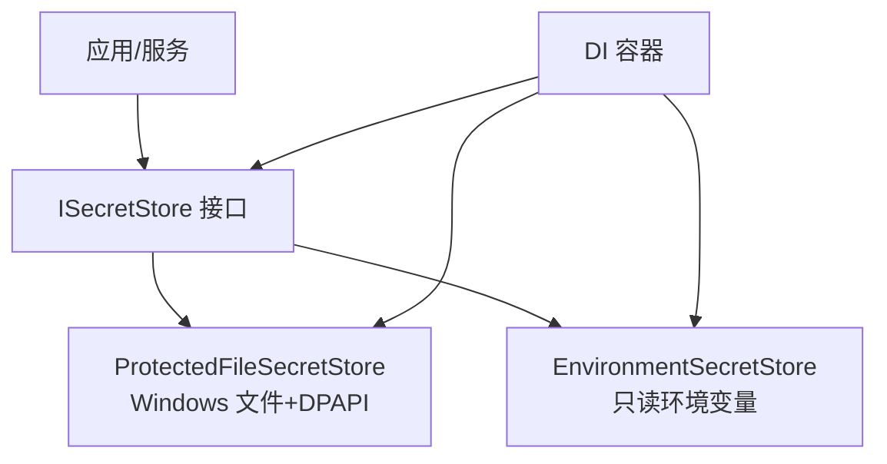
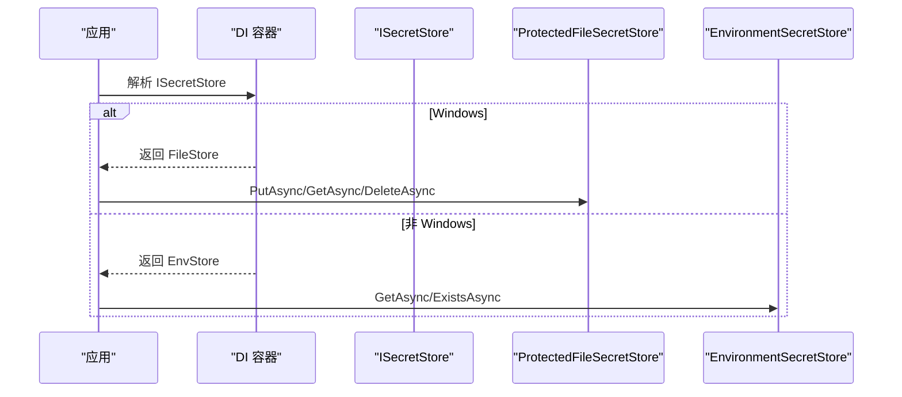
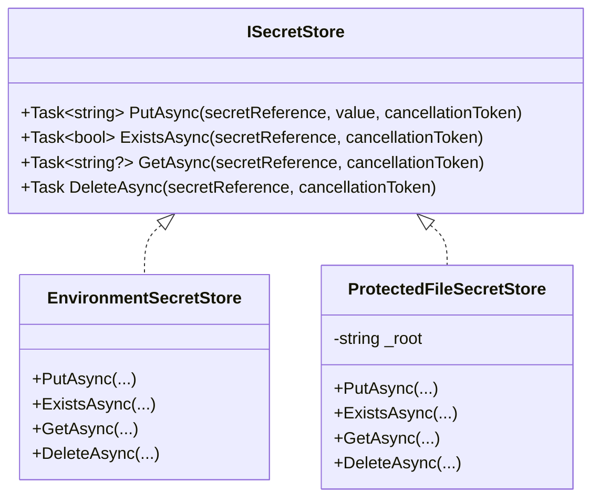
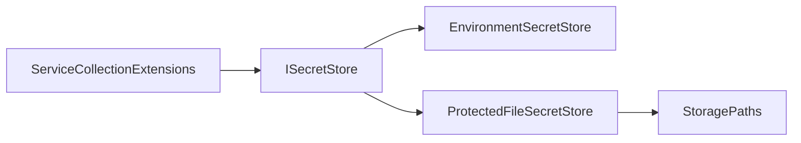
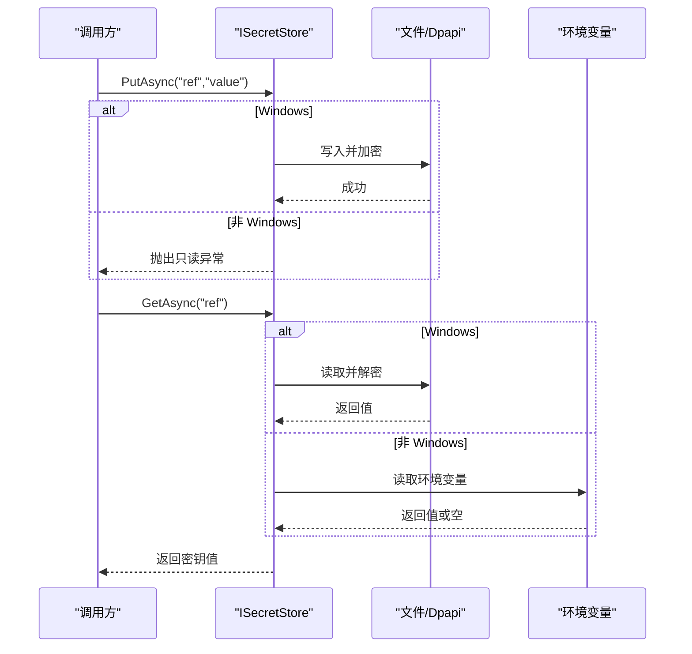
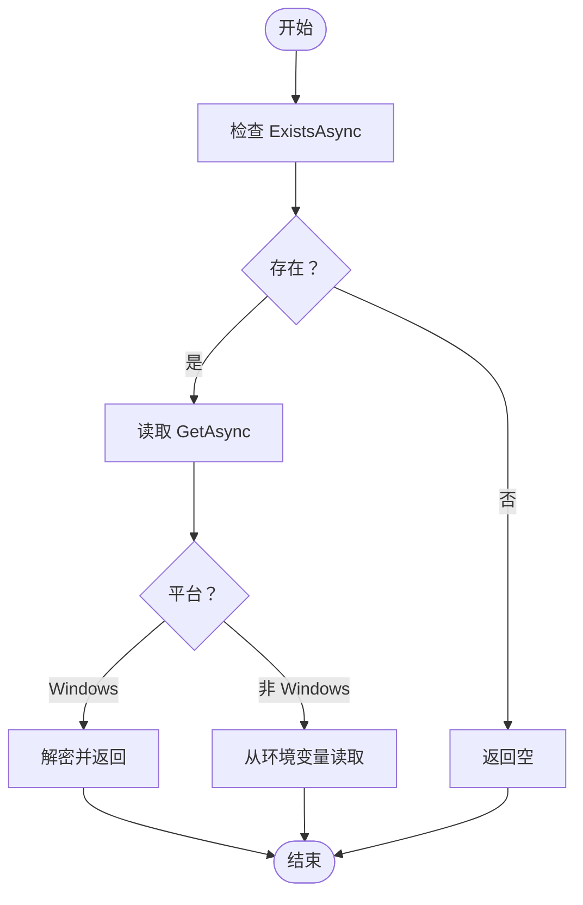

# 密钥存储接口

<cite>
**本文引用的文件**   
- [ISecretStore.cs](file://TinadecCore\Persistence\ISecretStore.cs)
- [ServiceCollectionExtensions.cs](file://TinadecCore\Persistence\ServiceCollectionExtensions.cs)
- [SecretProtectorTests.cs](file://tests\TinadecCore.Tests\SecretProtectorTests.cs)
- [CredentialSafetyTests.cs](file://tests\TinadecCore.Tests\CredentialSafetyTests.cs)
- [security.md](file://docs\security.md)
</cite>

## 目录
1. [简介](#简介)
2. [项目结构](#项目结构)
3. [核心组件](#核心组件)
4. [架构总览](#架构总览)
5. [详细组件分析](#详细组件分析)
6. [依赖关系分析](#依赖关系分析)
7. [性能考量](#性能考量)
8. [故障排查指南](#故障排查指南)
9. [结论](#结论)
10. [附录](#附录)

## 简介
本文件围绕 ISecretStore 接口及其实现，系统化阐述密钥存储的设计模式、安全策略与使用方式。重点包括：
- 接口设计与职责边界：不持久化明文或密文值到关系型记录中，仅通过引用访问。
- 加密存储与平台能力：Windows 下使用 DPAPI 对文件进行保护；非 Windows 环境退化为环境变量读取。
- 访问控制与审计追踪：默认实现未内置细粒度访问控制与审计日志，需结合上层服务扩展。
- 版本管理、轮换与撤销：当前实现未提供原生版本化与轮换机制，建议通过命名约定与外部系统实现。
- 与外部密钥管理服务集成：可通过适配器模式对接 Azure Key Vault、AWS Secrets Manager 等。
- 自定义后端实现指南：遵循 ISecretStore 契约即可替换存储后端。
- 安全最佳实践、合规要求与灾难恢复：从配置、运行态防护、日志脱敏、备份恢复等方面给出建议。

## 项目结构
与密钥存储相关的关键位置如下：
- 接口与默认实现位于 TinadecCore\Persistence\ISecretStore.cs
- 依赖注入注册位于 TinadecCore\Persistence\ServiceCollectionExtensions.cs
- 安全行为测试位于 tests\TinadecCore.Tests 下的 SecretProtectorTests.cs 与 CredentialSafetyTests.cs
- 安全策略说明位于 docs\security.md

图表来源 
- [ISecretStore.cs:1-65](file://TinadecCore\Persistence\ISecretStore.cs#L1-L65)
- [ServiceCollectionExtensions.cs:44-46](file://TinadecCore\Persistence\ServiceCollectionExtensions.cs#L44-L46)

章节来源
- [ISecretStore.cs:1-65](file://TinadecCore\Persistence\ISecretStore.cs#L1-L65)
- [ServiceCollectionExtensions.cs:44-46](file://TinadecCore\Persistence\ServiceCollectionExtensions.cs#L44-L46)

## 核心组件
- ISecretStore 接口
  - PutAsync(secretReference, value): 写入密钥材料，返回引用标识。
  - ExistsAsync(secretReference): 判断是否存在指定引用。
  - GetAsync(secretReference): 按引用获取密钥值。
  - DeleteAsync(secretReference): 删除指定引用。
- EnvironmentSecretStore
  - 只读实现，从环境变量读取密钥；不支持写入与删除。
- ProtectedFileSecretStore
  - 在 Windows 上以文件形式存储，并使用 DPAPI 进行保护；非 Windows 平台回退为明文文件存储（注意安全风险）。

章节来源
- [ISecretStore.cs:1-65](file://TinadecCore\Persistence\ISecretStore.cs#L1-L65)

## 架构总览
下图展示 DI 如何根据运行平台选择具体实现，以及调用方如何通过统一接口访问密钥。

图表来源 
- [ServiceCollectionExtensions.cs:44-46](file://TinadecCore\Persistence\ServiceCollectionExtensions.cs#L44-L46)
- [ISecretStore.cs:13-25](file://TinadecCore\Persistence\ISecretStore.cs#L13-L25)
- [ISecretStore.cs:27-64](file://TinadecCore\Persistence\ISecretStore.cs#L27-L64)

## 详细组件分析

### ISecretStore 接口设计
- 设计要点
  - 以“引用”作为密钥标识，避免在关系型数据库中存储明文或密文值。
  - 统一的异步方法签名，便于在不同后端间切换。
- 方法语义
  - PutAsync: 写入并返回引用；用于初始化或更新密钥。
  - ExistsAsync: 快速判定引用是否存在。
  - GetAsync: 读取密钥值；不存在时返回空。
  - DeleteAsync: 删除引用对应的密钥材料。

章节来源
- [ISecretStore.cs:4-10](file://TinadecCore\Persistence\ISecretStore.cs#L4-L10)

### EnvironmentSecretStore（只读环境变量）
- 特点
  - 只读，PutAsync 抛出异常，DeleteAsync 为空操作。
  - ExistsAsync 与 GetAsync 直接映射到环境变量。
- 适用场景
  - 开发环境与 CI/CD 注入，避免将敏感信息落盘。
- 限制
  - 无法跨进程共享（除非显式导出），不适合生产多实例部署。

章节来源
- [ISecretStore.cs:13-25](file://TinadecCore\Persistence\ISecretStore.cs#L13-L25)

### ProtectedFileSecretStore（Windows 文件+DPAPI）
- 特点
  - 在 Windows 上使用 DPAPI 对字节进行保护，非 Windows 平台回退为明文文件。
  - 文件路径基于 StoragePaths.Root + “secrets” + 引用.bin。
- 适用场景
  - 单机或受控桌面环境（如 Electron 主进程）的本地密钥存储。
- 风险与注意
  - 非 Windows 平台明文存储存在泄露风险，应配合文件系统权限与传输加密。
  - 删除操作幂等，不存在时不报错。

章节来源
- [ISecretStore.cs:27-64](file://TinadecCore\Persistence\ISecretStore.cs#L27-L64)

### 依赖注入与平台选择
- 注册逻辑
  - Windows 平台选择 ProtectedFileSecretStore。
  - 非 Windows 平台选择 EnvironmentSecretStore。
- 影响
  - 同一套代码在不同平台具备不同默认行为，需在上层明确期望与降级策略。

章节来源
- [ServiceCollectionExtensions.cs:44-46](file://TinadecCore\Persistence\ServiceCollectionExtensions.cs#L44-L46)

### 类图（代码级关系）

图表来源 
- [ISecretStore.cs:1-65](file://TinadecCore\Persistence\ISecretStore.cs#L1-L65)

## 依赖关系分析
- 组件耦合
  - ISecretStore 是松耦合抽象，具体实现由 DI 容器在启动时绑定。
  - ProtectedFileSecretStore 依赖 StoragePaths 确定根目录。
- 外部依赖
  - Windows 平台依赖 DPAPI；非 Windows 平台无额外加密库。
- 潜在循环依赖
  - 当前实现无循环依赖。

图表来源 
- [ServiceCollectionExtensions.cs:44-46](file://TinadecCore\Persistence\ServiceCollectionExtensions.cs#L44-L46)
- [ISecretStore.cs:27-31](file://TinadecCore\Persistence\ISecretStore.cs#L27-L31)

章节来源
- [ServiceCollectionExtensions.cs:44-46](file://TinadecCore\Persistence\ServiceCollectionExtensions.cs#L44-L46)
- [ISecretStore.cs:27-31](file://TinadecCore\Persistence\ISecretStore.cs#L27-L31)

## 性能考量
- I/O 模型
  - 文件读写为异步，避免阻塞；频繁小文件访问可能带来开销。
- 加密成本
  - Windows DPAPI 加解密开销较低，但仍应避免在热路径中频繁加解密。
- 缓存建议
  - 可在调用方引入短期内存缓存（注意生命周期与失效策略），减少重复读取。
- 并发与一致性
  - 文件删除与写入需考虑并发冲突；建议在业务层保证幂等与重试策略。

[本节为通用指导，无需特定文件引用]

## 故障排查指南
- 常见问题
  - 在非 Windows 平台调用 PutAsync 失败：EnvironmentSecretStore 为只读，会抛出异常。
  - 密钥不存在：GetAsync 返回空，需检查引用命名与大小写。
  - 权限问题：文件存储需要当前用户具有读写 secrets 目录的权限。
- 日志与脱敏
  - 错误消息与事件序列化不应包含原始密钥；测试覆盖了此行为。
- 验证步骤
  - 确认 DI 绑定的实现是否符合预期平台。
  - 检查环境变量是否设置正确。
  - 检查 secrets 目录是否存在且可写。

章节来源
- [ISecretStore.cs:13-25](file://TinadecCore\Persistence\ISecretStore.cs#L13-L25)
- [CredentialSafetyTests.cs:14-32](file://tests\TinadecCore.Tests\CredentialSafetyTests.cs#L14-L32)

## 结论
ISecretStore 提供了简洁、平台无关的密钥访问抽象。默认实现在 Windows 上利用 DPAPI 提供本地保护，在非 Windows 环境下退化为环境变量读取。当前实现未内置版本管理、轮换与审计追踪，但这些能力可通过命名约定、外部 KMS 与上层服务扩展获得。在生产环境中，建议优先采用企业级密钥管理服务，并结合严格的访问控制、审计与合规要求。

[本节为总结性内容，无需特定文件引用]

## 附录

### 安全最佳实践
- 最小权限原则：仅授予必要的环境变量或文件访问权限。
- 日志脱敏：确保错误消息与事件不包含原始密钥。
- 传输加密：对外部 KMS 调用必须使用 TLS。
- 定期轮换：通过命名约定或外部系统实现密钥轮换。
- 备份与恢复：对本地文件存储进行加密备份，并制定恢复演练计划。

章节来源
- [security.md:1-18](file://docs\security.md#L1-L18)
- [CredentialSafetyTests.cs:34-60](file://tests\TinadecCore.Tests\CredentialSafetyTests.cs#L34-L60)

### 版本管理、轮换与撤销机制（建议）
- 版本管理
  - 使用“引用@版本”或“引用/vN”的命名约定区分版本。
  - 读取时支持按版本或最新策略解析。
- 轮换策略
  - 双密钥并行期：新旧密钥同时可用，逐步迁移后停用旧密钥。
  - 自动过期：结合外部 KMS 的过期时间或 TTL。
- 撤销机制
  - 立即失效：通过外部 KMS 禁用或删除密钥。
  - 软删除：标记不可用并保留审计轨迹。

[本节为概念性建议，无需特定文件引用]

### 与外部密钥管理服务集成（Azure Key Vault、AWS Secrets Manager）
- 设计思路
  - 实现 ISecretStore，将 Put/Get/Delete 映射到 KMS API。
  - 处理认证（托管身份/客户端凭据）、网络超时与重试。
  - 缓存策略：短生命周期内存缓存，降低请求频率。
- 安全要点
  - 使用最小权限角色与资源隔离。
  - 开启访问日志与告警。
  - 严格校验返回值与状态码。

[本节为概念性建议，无需特定文件引用]

### 自定义密钥存储后端实现指南
- 步骤
  - 实现 ISecretStore 接口，确保 Put/Get/Exists/Delete 语义一致。
  - 处理并发、幂等与错误分类（参数非法、资源不存在、权限不足等）。
  - 在 DI 中替换默认绑定，或在运行时根据配置选择实现。
- 注意事项
  - 保持引用唯一性与稳定性。
  - 避免在日志中输出敏感数据。
  - 提供健康检查与就绪探针。

[本节为概念性建议，无需特定文件引用]

### 灾难恢复与合规
- 备份策略
  - 对本地文件进行加密备份；对 KMS 启用跨区域复制与版本保留。
- 恢复演练
  - 定期演练恢复流程，验证完整性与可用性。
- 合规要求
  - 满足数据驻留、访问审计、密钥生命周期管理等要求。
  - 留存审计日志并防止篡改。

[本节为概念性建议，无需特定文件引用]

### 序列图：密钥写入与读取（示例）

图表来源 
- [ISecretStore.cs:27-64](file://TinadecCore\Persistence\ISecretStore.cs#L27-L64)
- [ISecretStore.cs:13-25](file://TinadecCore\Persistence\ISecretStore.cs#L13-L25)

### 流程图：密钥存在性判断与读取

图表来源 
- [ISecretStore.cs:27-64](file://TinadecCore\Persistence\ISecretStore.cs#L27-L64)
- [ISecretStore.cs:13-25](file://TinadecCore\Persistence\ISecretStore.cs#L13-L25)