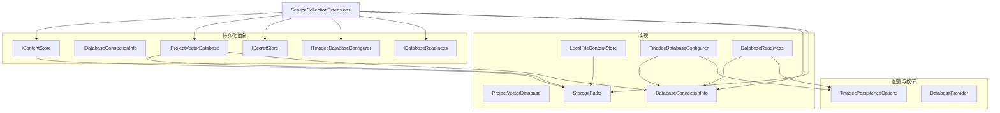
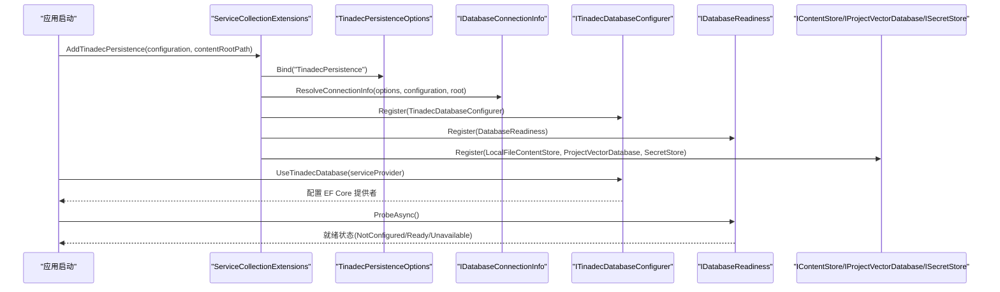
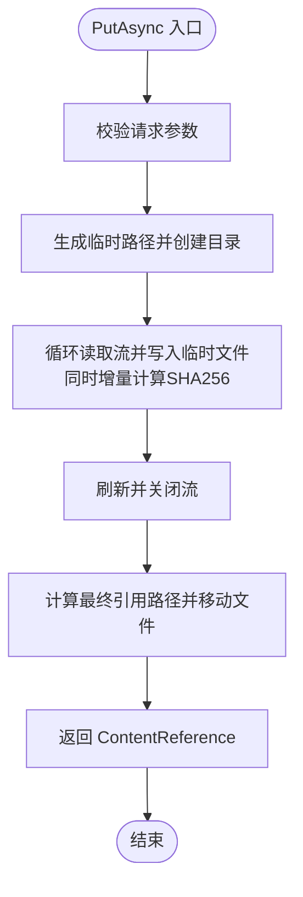
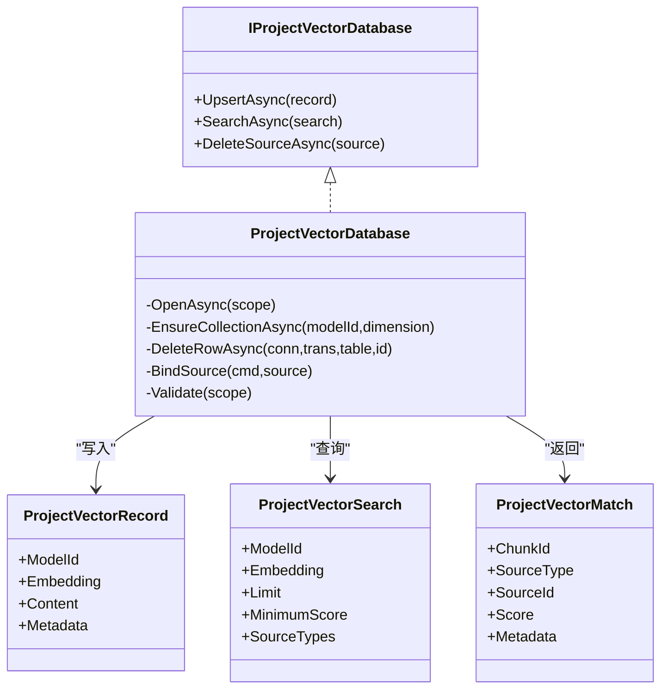
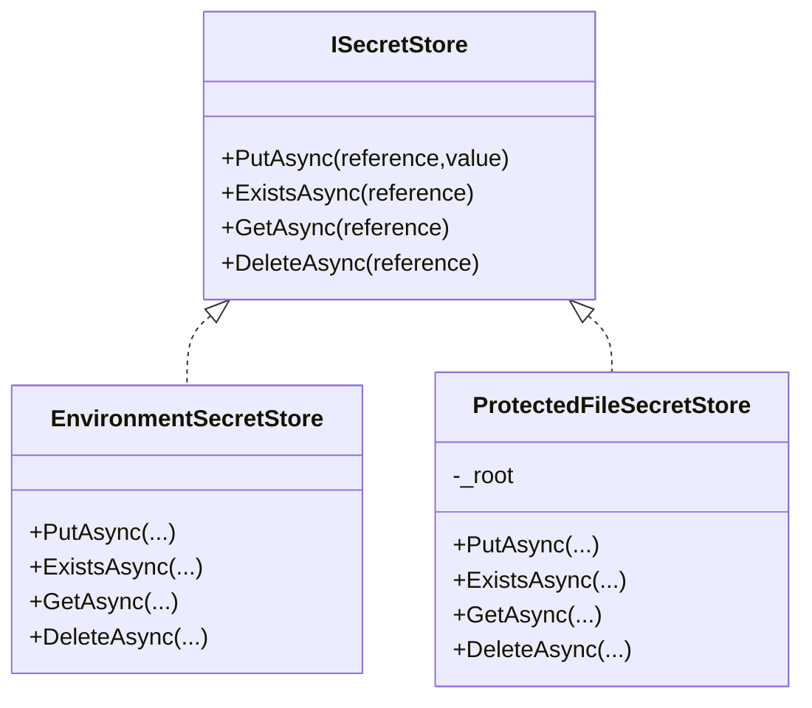
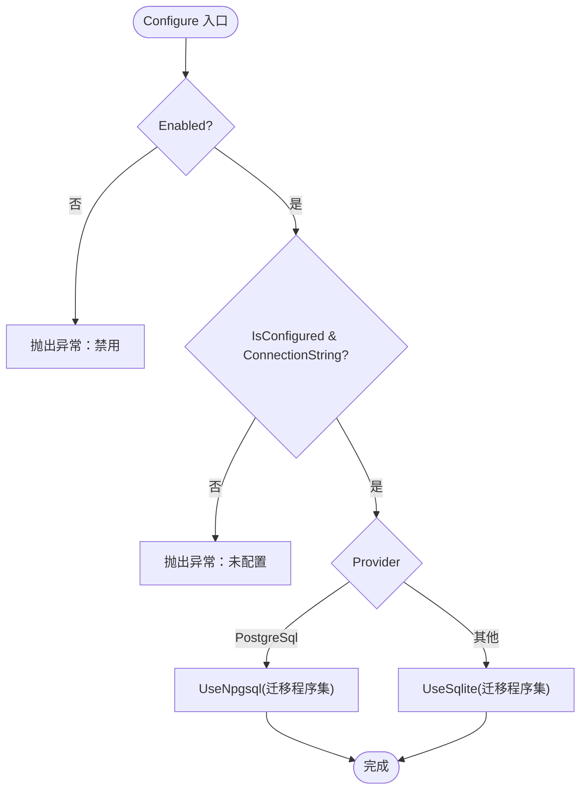
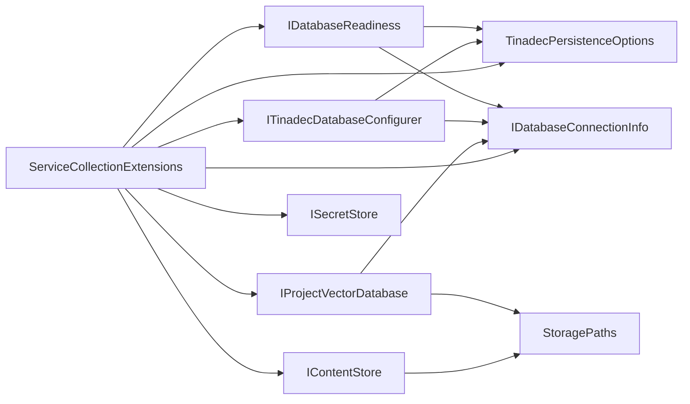

# 持久化层抽象

<cite>
**本文引用的文件**   
- [IContentStore.cs](file://TinadecCore\Persistence\IContentStore.cs)
- [IDatabaseConnectionInfo.cs](file://TinadecCore\Persistence\IDatabaseConnectionInfo.cs)
- [IProjectVectorDatabase.cs](file://TinadecCore\Persistence\IProjectVectorDatabase.cs)
- [ISecretStore.cs](file://TinadecCore\Persistence\ISecretStore.cs)
- [ITinadecDatabaseConfigurer.cs](file://TinadecCore\Persistence\ITinadecDatabaseConfigurer.cs)
- [TinadecDatabaseConfigurer.cs](file://TinadecCore\Persistence\TinadecDatabaseConfigurer.cs)
- [StoragePaths.cs](file://TinadecCore\Persistence\StoragePaths.cs)
- [LocalFileContentStore.cs](file://TinadecCore\Persistence\LocalFileContentStore.cs)
- [DatabaseConnectionInfo.cs](file://TinadecCore\Persistence\DatabaseConnectionInfo.cs)
- [ProjectVectorDatabase.cs](file://TinadecCore\Persistence\ProjectVectorDatabase.cs)
- [TinadecPersistenceOptions.cs](file://TinadecCore\Persistence\TinadecPersistenceOptions.cs)
- [ServiceCollectionExtensions.cs](file://TinadecCore\Persistence\ServiceCollectionExtensions.cs)
- [DatabaseProvider.cs](file://TinadecCore\Persistence\DatabaseProvider.cs)
- [DatabaseReadiness.cs](file://TinadecCore\Persistence\DatabaseReadiness.cs)
- [StorageMigration.cs](file://TinadecCore\Persistence\StorageMigration.cs)
</cite>

## 目录
1. [简介](#简介)
2. [项目结构](#项目结构)
3. [核心组件](#核心组件)
4. [架构总览](#架构总览)
5. [详细组件分析](#详细组件分析)
6. [依赖关系分析](#依赖关系分析)
7. [性能与缓存](#性能与缓存)
8. [故障排查指南](#故障排查指南)
9. [结论](#结论)
10. [附录：自定义存储实现指南](#附录自定义存储实现指南)

## 简介
本文件系统化梳理 TinadecOffice 的持久化层抽象，聚焦以下目标：
- 存储接口的设计模式、抽象层次与扩展点
- 核心接口职责与方法签名说明：IContentStore、IDatabaseConnectionInfo、IProjectVectorDatabase、ISecretStore
- 数据库配置器的设计模式与配置选项
- 存储后端实现策略（SQLite/PostgreSQL）、向量库与本地文件存储
- 缓存机制与性能优化建议
- 自定义存储实现的开发指南与最佳实践
- 数据安全、加密与访问控制要点

## 项目结构
持久化层位于 TinadecCore\Persistence 命名空间下，采用“接口 + 配置 + 服务注册”的分层组织方式：
- 接口定义：IContentStore、IDatabaseConnectionInfo、IProjectVectorDatabase、ISecretStore、ITinadecDatabaseConfigurer、IDatabaseReadiness、迁移参与者等
- 配置项：TinadecPersistenceOptions、SqliteOptions、PostgreSqlOptions、DatabaseProvider
- 连接信息与就绪性：DatabaseConnectionInfo、DatabaseReadiness
- 路径与资源管理：StoragePaths
- 具体实现：LocalFileContentStore、ProjectVectorDatabase、TinadecDatabaseConfigurer
- 服务注册与解析：ServiceCollectionExtensions



图表来源 
- [IContentStore.cs:1-20](file://TinadecCore\Persistence\IContentStore.cs#L1-L20)
- [IDatabaseConnectionInfo.cs:1-18](file://TinadecCore\Persistence\IDatabaseConnectionInfo.cs#L1-L18)
- [IProjectVectorDatabase.cs:1-57](file://TinadecCore\Persistence\IProjectVectorDatabase.cs#L1-L57)
- [ISecretStore.cs:1-65](file://TinadecCore\Persistence\ISecretStore.cs#L1-L65)
- [ITinadecDatabaseConfigurer.cs:1-17](file://TinadecCore\Persistence\ITinadecDatabaseConfigurer.cs#L1-L17)
- [TinadecPersistenceOptions.cs:1-48](file://TinadecCore\Persistence\TinadecPersistenceOptions.cs#L1-L48)
- [DatabaseProvider.cs:1-11](file://TinadecCore\Persistence\DatabaseProvider.cs#L1-L11)
- [LocalFileContentStore.cs:1-68](file://TinadecCore\Persistence\LocalFileContentStore.cs#L1-L68)
- [ProjectVectorDatabase.cs:1-174](file://TinadecCore\Persistence\ProjectVectorDatabase.cs#L1-L174)
- [TinadecDatabaseConfigurer.cs:1-48](file://TinadecCore\Persistence\TinadecDatabaseConfigurer.cs#L1-L48)
- [DatabaseConnectionInfo.cs:1-23](file://TinadecCore\Persistence\DatabaseConnectionInfo.cs#L1-L23)
- [DatabaseReadiness.cs:1-123](file://TinadecCore\Persistence\DatabaseReadiness.cs#L1-L123)
- [StoragePaths.cs:1-64](file://TinadecCore\Persistence\StoragePaths.cs#L1-L64)
- [ServiceCollectionExtensions.cs:1-122](file://TinadecCore\Persistence\ServiceCollectionExtensions.cs#L1-L122)

章节来源
- [ServiceCollectionExtensions.cs:1-122](file://TinadecCore\Persistence\ServiceCollectionExtensions.cs#L1-L122)
- [TinadecPersistenceOptions.cs:1-48](file://TinadecCore\Persistence\TinadecPersistenceOptions.cs#L1-L48)

## 核心组件
本节概述各核心接口的职责与关键方法签名。

- IContentStore：不可变大内容存储，数据库行仅保留不透明引用与完整性元数据
  - PutAsync(ContentWriteRequest, CancellationToken) → ContentReference
  - OpenReadAsync(ContentReference, CancellationToken) → Stream
  - ExistsAsync(ContentReference, CancellationToken) → bool
  - DeleteAsync(ContentReference, CancellationToken) → Task
  - ContentWriteRequest：包含租户、工作区、类型、媒体类型与流式内容
  - ContentReference：包含 Value、Sha256、Length、MediaType

- IDatabaseConnectionInfo：已解析的连接信息
  - IsConfigured：是否已配置
  - Provider：数据库提供者枚举
  - ConnectionString：EF 兼容连接字符串（未配置时为 null）
  - ProviderName：用于就绪性票据的名称（sqlite | postgresql）

- IProjectVectorDatabase：项目语义索引的提供程序特定持久化
  - UpsertAsync(ProjectVectorRecord, CancellationToken)
  - SearchAsync(ProjectVectorSearch, CancellationToken) → IReadOnlyList<ProjectVectorMatch>
  - DeleteSourceAsync(ProjectVectorSource, CancellationToken)
  - 相关模型：ProjectVectorScope、ProjectVectorSource、ProjectVectorRecord、ProjectVectorSearch、ProjectVectorMatch

- ISecretStore：机密材料边界，关系记录中不包含明文或加密值
  - PutAsync(secretReference, value, CancellationToken) → string
  - ExistsAsync(secretReference, CancellationToken) → bool
  - GetAsync(secretReference, CancellationToken) → string?
  - DeleteAsync(secretReference, CancellationToken) → Task
  - 内置实现：EnvironmentSecretStore（只读，读取环境变量）、ProtectedFileSecretStore（Windows DPAPI 保护的文件存储）

- ITinadecDatabaseConfigurer：将活动 Tinadec 数据库提供者应用到 EF Core DbContextOptionsBuilder
  - Configure(DbContextOptionsBuilder options)

章节来源
- [IContentStore.cs:1-20](file://TinadecCore\Persistence\IContentStore.cs#L1-L20)
- [IDatabaseConnectionInfo.cs:1-18](file://TinadecCore\Persistence\IDatabaseConnectionInfo.cs#L1-L18)
- [IProjectVectorDatabase.cs:1-57](file://TinadecCore\Persistence\IProjectVectorDatabase.cs#L1-L57)
- [ISecretStore.cs:1-65](file://TinadecCore\Persistence\ISecretStore.cs#L1-L65)
- [ITinadecDatabaseConfigurer.cs:1-17](file://TinadecCore\Persistence\ITinadecDatabaseConfigurer.cs#L1-L17)

## 架构总览
持久化层通过 DI 容器统一注册，按配置选择后端（SQLite/PostgreSQL），并提供就绪性探测与迁移编排。



图表来源 
- [ServiceCollectionExtensions.cs:1-122](file://TinadecCore\Persistence\ServiceCollectionExtensions.cs#L1-L122)
- [TinadecPersistenceOptions.cs:1-48](file://TinadecCore\Persistence\TinadecPersistenceOptions.cs#L1-L48)
- [TinadecDatabaseConfigurer.cs:1-48](file://TinadecCore\Persistence\TinadecDatabaseConfigurer.cs#L1-L48)
- [DatabaseReadiness.cs:1-123](file://TinadecCore\Persistence\DatabaseReadiness.cs#L1-L123)

章节来源
- [ServiceCollectionExtensions.cs:1-122](file://TinadecCore\Persistence\ServiceCollectionExtensions.cs#L1-L122)

## 详细组件分析

### IContentStore 与 LocalFileContentStore
- 职责：以不可变对象的方式持久化大内容，数据库仅保存引用与校验和；实际内容以文件形式落盘
- 写入流程：
  - 生成临时路径并创建文件流
  - 边写边计算 SHA256，统计长度
  - 校验通过后移动到最终路径，返回 ContentReference
- 读取/存在/删除：基于 StoragePaths 解析绝对路径并操作文件系统
- 并发与一致性：使用独占写锁与原子移动，避免并发覆盖



图表来源 
- [LocalFileContentStore.cs:1-68](file://TinadecCore\Persistence\LocalFileContentStore.cs#L1-L68)
- [StoragePaths.cs:1-64](file://TinadecCore\Persistence\StoragePaths.cs#L1-L64)

章节来源
- [IContentStore.cs:1-20](file://TinadecCore\Persistence\IContentStore.cs#L1-L20)
- [LocalFileContentStore.cs:1-68](file://TinadecCore\Persistence\LocalFileContentStore.cs#L1-L68)
- [StoragePaths.cs:1-64](file://TinadecCore\Persistence\StoragePaths.cs#L1-L64)

### IProjectVectorDatabase 与 ProjectVectorDatabase
- 职责：为每个项目维护语义索引（向量），支持插入/更新、相似搜索与按源删除
- 数据结构：
  - vector_chunks：文本分块与元数据
  - vec_{hash}_{dim}：按模型维度动态创建的向量虚拟表（SQLite vec0）
- 写入流程：
  - 确保集合表存在且维度一致
  - 事务内先删后插，保证幂等
  - 同步写入向量表
- 搜索流程：
  - 使用 MATCH 查询限制 k=limit*4，再在应用层过滤 SourceTypes 与 MinimumScore
- 删除流程：
  - 查找所有 model_id 对应的向量表并删除对应 rowid



图表来源 
- [IProjectVectorDatabase.cs:1-57](file://TinadecCore\Persistence\IProjectVectorDatabase.cs#L1-L57)
- [ProjectVectorDatabase.cs:1-174](file://TinadecCore\Persistence\ProjectVectorDatabase.cs#L1-L174)

章节来源
- [IProjectVectorDatabase.cs:1-57](file://TinadecCore\Persistence\IProjectVectorDatabase.cs#L1-L57)
- [ProjectVectorDatabase.cs:1-174](file://TinadecCore\Persistence\ProjectVectorDatabase.cs#L1-L174)

### ISecretStore 与内置实现
- EnvironmentSecretStore：只读，从环境变量读取机密，不支持写入/删除
- ProtectedFileSecretStore：
  - Windows：使用 DPAPI 对字节进行当前用户范围保护
  - 非 Windows：明文落盘（需自行补充平台加密）
  - 文件路径由 StoragePaths.Root/secrets 组成



图表来源 
- [ISecretStore.cs:1-65](file://TinadecCore\Persistence\ISecretStore.cs#L1-L65)

章节来源
- [ISecretStore.cs:1-65](file://TinadecCore\Persistence\ISecretStore.cs#L1-L65)

### 数据库配置器与连接信息
- DatabaseProvider：Sqlite、PostgreSql
- TinadecPersistenceOptions：启用开关、默认提供者、SQLite/PostgreSQL 子选项、DataRoot、迁移策略、探针超时
- DatabaseConnectionInfo：封装 Provider、ConnectionString、ProviderName、IsConfigured
- TinadecDatabaseConfigurer：根据配置选择 UseNpgsql 或 UseSqlite，并设置迁移程序集



图表来源 
- [TinadecDatabaseConfigurer.cs:1-48](file://TinadecCore\Persistence\TinadecDatabaseConfigurer.cs#L1-L48)
- [DatabaseProvider.cs:1-11](file://TinadecCore\Persistence\DatabaseProvider.cs#L1-L11)
- [TinadecPersistenceOptions.cs:1-48](file://TinadecCore\Persistence\TinadecPersistenceOptions.cs#L1-L48)
- [DatabaseConnectionInfo.cs:1-23](file://TinadecCore\Persistence\DatabaseConnectionInfo.cs#L1-L23)

章节来源
- [TinadecDatabaseConfigurer.cs:1-48](file://TinadecCore\Persistence\TinadecDatabaseConfigurer.cs#L1-L48)
- [DatabaseConnectionInfo.cs:1-23](file://TinadecCore\Persistence\DatabaseConnectionInfo.cs#L1-L23)
- [TinadecPersistenceOptions.cs:1-48](file://TinadecCore\Persistence\TinadecPersistenceOptions.cs#L1-L48)

### 就绪性与迁移
- DatabaseReadiness：按提供者执行 SELECT 1 探测，带超时与日志
- StorageMigrationRunner：按配置驱动迁移参与者执行 MigrateAsync（PostgreSQL 默认不在启动时自动迁移）

```mermaid
sequenceDiagram
participant Runner as "StorageMigrationRunner"
participant Options as "TinadecPersistenceOptions"
participant Participant as "IStorageMigrationParticipant[]"
Runner->>Options : 读取 Enabled/ApplyMigrationsOnStartup
alt PostgreSQL 且未启用自动迁移
Runner-->>Runner : 直接返回
else 允许迁移
loop 遍历参与者
Runner->>Participant : MigrateAsync()
Participant-->>Runner : 完成
end
end
```

图表来源 
- [StorageMigration.cs:1-41](file://TinadecCore\Persistence\StorageMigration.cs#L1-L41)
- [TinadecPersistenceOptions.cs:1-48](file://TinadecCore\Persistence\TinadecPersistenceOptions.cs#L1-L48)

章节来源
- [DatabaseReadiness.cs:1-123](file://TinadecCore\Persistence\DatabaseReadiness.cs#L1-L123)
- [StorageMigration.cs:1-41](file://TinadecCore\Persistence\StorageMigration.cs#L1-L41)

## 依赖关系分析
- 服务注册依赖：ServiceCollectionExtensions 绑定配置、解析连接信息、注册所有持久化抽象与实现
- 运行时依赖：
  - LocalFileContentStore 依赖 StoragePaths
  - ProjectVectorDatabase 依赖 IDatabaseConnectionInfo 与 StoragePaths
  - TinadecDatabaseConfigurer 依赖 IDatabaseConnectionInfo 与 TinadecPersistenceOptions
  - DatabaseReadiness 依赖 IDatabaseConnectionInfo 与 TinadecPersistenceOptions



图表来源 
- [ServiceCollectionExtensions.cs:1-122](file://TinadecCore\Persistence\ServiceCollectionExtensions.cs#L1-L122)
- [StoragePaths.cs:1-64](file://TinadecCore\Persistence\StoragePaths.cs#L1-L64)
- [TinadecPersistenceOptions.cs:1-48](file://TinadecCore\Persistence\TinadecPersistenceOptions.cs#L1-L48)
- [DatabaseConnectionInfo.cs:1-23](file://TinadecCore\Persistence\DatabaseConnectionInfo.cs#L1-L23)
- [DatabaseReadiness.cs:1-123](file://TinadecCore\Persistence\DatabaseReadiness.cs#L1-L123)
- [TinadecDatabaseConfigurer.cs:1-48](file://TinadecCore\Persistence\TinadecDatabaseConfigurer.cs#L1-L48)

章节来源
- [ServiceCollectionExtensions.cs:1-122](file://TinadecCore\Persistence\ServiceCollectionExtensions.cs#L1-L122)

## 性能与缓存
- 内容存储（LocalFileContentStore）
  - 流式写入与增量哈希，避免内存峰值
  - 异步 I/O 与 WriteThrough 降低崩溃风险
  - 原子移动减少竞争条件
- 向量数据库（ProjectVectorDatabase）
  - SQLite vec0 虚拟表加速相似度检索
  - 按模型维度隔离集合表，避免跨模型冲突
  - 搜索时扩大 k 并在应用层过滤，提高召回率
- 就绪性探测
  - 可配置的超时时间，避免阻塞启动
- 建议
  - 在高并发场景考虑引入内存级缓存（如 IMemoryCache）用于热点内容或搜索结果
  - 对向量查询增加结果缓存（按 embedding hash + 参数）以减少重复计算
  - 对文件存储可引入读写分离与预取策略

[本节为通用指导，不直接分析具体文件]

## 故障排查指南
- 数据库未配置或禁用
  - 现象：Configure 抛出“禁用或未配置”异常
  - 处理：检查 TinadecPersistenceOptions.Enabled、Provider、连接字符串/DataRoot
- SQLite 就绪失败
  - 现象：ProbeAsync 抛出不成功或文件目录不存在
  - 处理：确保 DataRoot 与 DatabasePath 有效，目录权限正确
- PostgreSQL 就绪失败
  - 现象：连接或查询失败
  - 处理：核对 ConnectionStrings 名称与网络连通性
- 向量维度不一致
  - 现象：EnsureCollectionAsync 抛出维度变更异常
  - 处理：保持同一模型的 embedding 维度不变，必要时重建索引
- 机密读取为空
  - 现象：EnvironmentSecretStore 返回空
  - 处理：确认环境变量名与大小写，Windows 下使用 ProtectedFileSecretStore 时确保 DPAPI 可用

章节来源
- [TinadecDatabaseConfigurer.cs:1-48](file://TinadecCore\Persistence\TinadecDatabaseConfigurer.cs#L1-L48)
- [DatabaseReadiness.cs:1-123](file://TinadecCore\Persistence\DatabaseReadiness.cs#L1-L123)
- [ProjectVectorDatabase.cs:1-174](file://TinadecCore\Persistence\ProjectVectorDatabase.cs#L1-L174)
- [ISecretStore.cs:1-65](file://TinadecCore\Persistence\ISecretStore.cs#L1-L65)

## 结论
持久化层通过清晰的接口抽象与统一的配置注入，实现了内容存储、向量索引与机密的解耦与可扩展。SQLite 作为默认后端适合桌面与单机部署，PostgreSQL 适用于多实例生产环境。通过就绪性探测与迁移编排，系统具备更强的健壮性与可运维性。建议在业务模块中遵循现有抽象，按需扩展新的存储后端与缓存策略。

[本节为总结，不直接分析具体文件]

## 附录：自定义存储实现指南
- 自定义 IContentStore
  - 要求：保持不可变语义，使用唯一标识（如 SHA256）作为引用键
  - 并发：确保写入原子性与幂等性
  - 安全：校验路径穿越，避免越权访问
- 自定义 IProjectVectorDatabase
  - 要求：支持 Upsert/Search/DeleteSource，保持模型维度一致性
  - 扩展：可替换为外部向量数据库（如 Milvus/Weaviate），保持接口契约
- 自定义 ISecretStore
  - 要求：不在关系表中存储明文或密文，仅存引用
  - 平台：Windows 优先 DPAPI，跨平台建议使用密钥管理服务（KMS/HashiCorp Vault）
- 自定义 ITinadecDatabaseConfigurer
  - 要求：根据 TinadecPersistenceOptions 与 IDatabaseConnectionInfo 配置 EF Core
  - 迁移：按需提供迁移程序集或外置迁移工具
- 服务注册
  - 在 ServiceCollectionExtensions.AddTinadecPersistence 中替换默认实现
  - 保持 TryAddSingleton 以避免覆盖已有实现

章节来源
- [IContentStore.cs:1-20](file://TinadecCore\Persistence\IContentStore.cs#L1-L20)
- [IProjectVectorDatabase.cs:1-57](file://TinadecCore\Persistence\IProjectVectorDatabase.cs#L1-L57)
- [ISecretStore.cs:1-65](file://TinadecCore\Persistence\ISecretStore.cs#L1-L65)
- [ITinadecDatabaseConfigurer.cs:1-17](file://TinadecCore\Persistence\ITinadecDatabaseConfigurer.cs#L1-L17)
- [ServiceCollectionExtensions.cs:1-122](file://TinadecCore\Persistence\ServiceCollectionExtensions.cs#L1-L122)