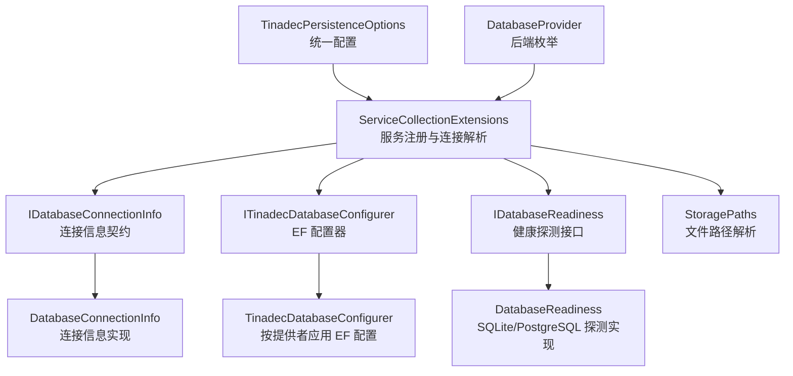
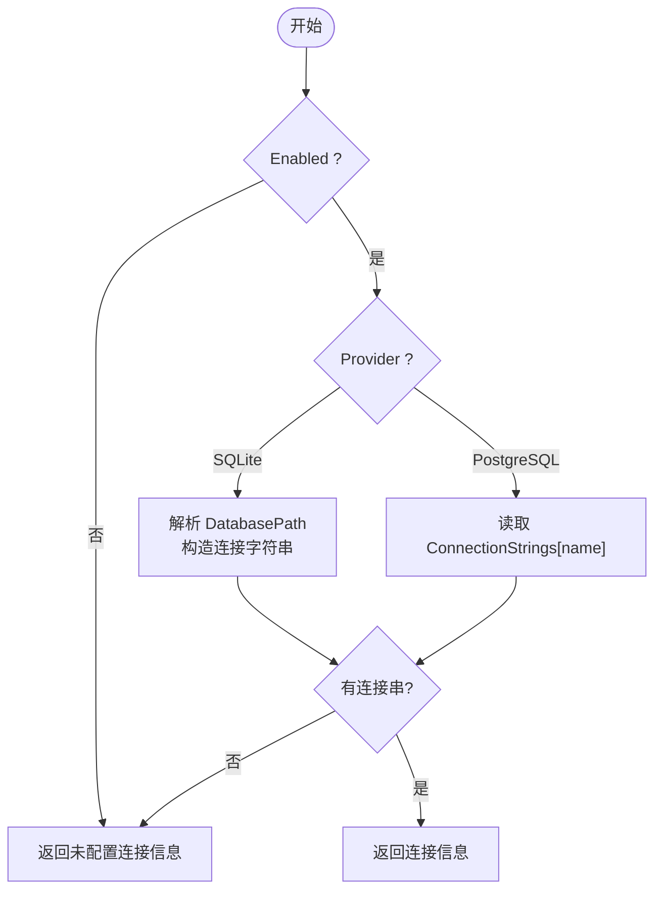
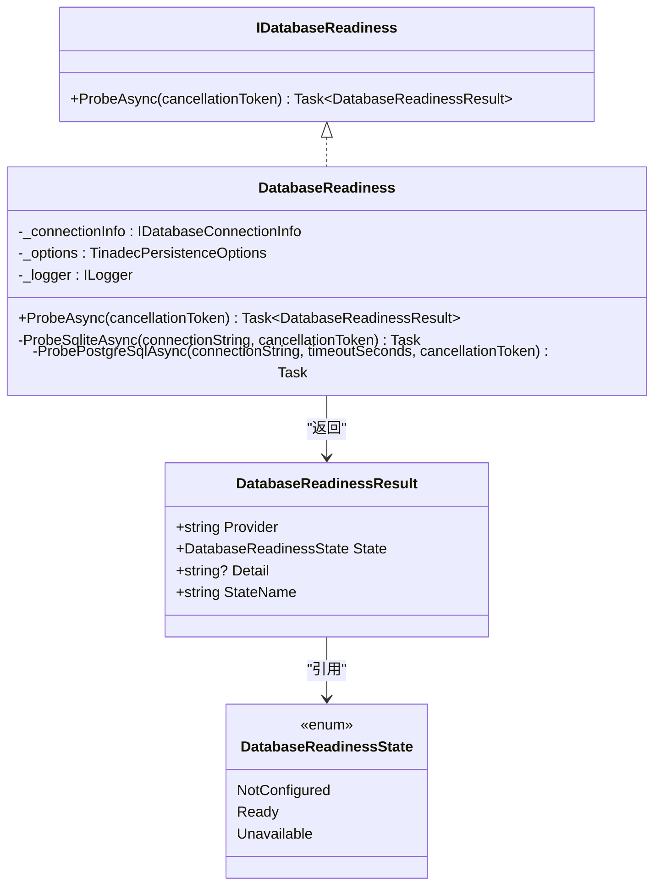
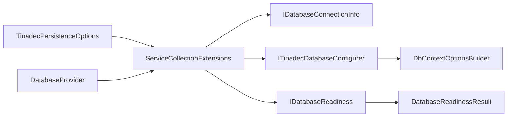

# 数据库连接抽象

<cite>
**本文引用的文件**   
- [IDatabaseConnectionInfo.cs](file://TinadecCore\Persistence\IDatabaseConnectionInfo.cs)
- [DatabaseProvider.cs](file://TinadecCore\Persistence\DatabaseProvider.cs)
- [DatabaseConnectionInfo.cs](file://TinadecCore\Persistence\DatabaseConnectionInfo.cs)
- [TinadecPersistenceOptions.cs](file://TinadecCore\Persistence\TinadecPersistenceOptions.cs)
- [ServiceCollectionExtensions.cs](file://TinadecCore\Persistence\ServiceCollectionExtensions.cs)
- [ITinadecDatabaseConfigurer.cs](file://TinadecCore\Persistence\ITinadecDatabaseConfigurer.cs)
- [TinadecDatabaseConfigurer.cs](file://TinadecCore\Persistence\TinadecDatabaseConfigurer.cs)
- [DatabaseReadiness.cs](file://TinadecCore\Persistence\DatabaseReadiness.cs)
- [IDatabaseReadiness.cs](file://TinadecCore\Persistence\IDatabaseReadiness.cs)
- [DatabaseReadinessState.cs](file://TinadecCore\Persistence\DatabaseReadinessState.cs)
- [StoragePaths.cs](file://TinadecCore\Persistence\StoragePaths.cs)
</cite>

## 目录
1. [简介](#简介)
2. [项目结构](#项目结构)
3. [核心组件](#核心组件)
4. [架构总览](#架构总览)
5. [详细组件分析](#详细组件分析)
6. [依赖关系分析](#依赖关系分析)
7. [性能考虑](#性能考虑)
8. [故障排查指南](#故障排查指南)
9. [结论](#结论)
10. [附录](#附录)

## 简介
本文件围绕数据库连接抽象进行系统化说明，重点覆盖以下方面：
- IDatabaseConnectionInfo 接口的设计与扩展点
- DatabaseProvider 提供者模式实现与连接解析流程
- TinadecPersistenceOptions 配置项与环境适配
- SQLite 与 PostgreSQL 的连接配置、安全设置与性能调优建议
- 自定义数据库提供程序的实现指南
- 连接健康检查（就绪探针）、重试与故障转移策略建议、监控指标采集建议

## 项目结构
该抽象位于 TinadecCore.Persistence 命名空间下，采用“接口 + 具体实现 + 选项绑定 + 服务注册”的分层组织方式。关键文件职责如下：
- IDatabaseConnectionInfo：定义已解析的连接信息契约
- DatabaseProvider：枚举当前支持的数据库后端
- DatabaseConnectionInfo：连接信息的默认实现
- TinadecPersistenceOptions：统一的持久化配置模型
- ServiceCollectionExtensions：服务注册、连接字符串解析、路径与存储相关服务装配
- ITinadecDatabaseConfigurer / TinadecDatabaseConfigurer：将活动提供者应用到 EF Core DbContextOptionsBuilder
- DatabaseReadiness / IDatabaseReadiness / DatabaseReadinessState：非抛错的健康探测与结果模型
- StoragePaths：Core 自有文件存储路径解析与安全校验



图表来源 
- [ServiceCollectionExtensions.cs:15-49](file://TinadecCore\Persistence\ServiceCollectionExtensions.cs#L15-L49)
- [IDatabaseConnectionInfo.cs:6-17](file://TinadecCore\Persistence\IDatabaseConnectionInfo.cs#L6-L17)
- [ITinadecDatabaseConfigurer.cs:9-16](file://TinadecCore\Persistence\ITinadecDatabaseConfigurer.cs#L9-L16)
- [IDatabaseReadiness.cs:6-9](file://TinadecCore\Persistence\IDatabaseReadiness.cs#L6-L9)
- [TinadecPersistenceOptions.cs:7-32](file://TinadecCore\Persistence\TinadecPersistenceOptions.cs#L7-L32)
- [DatabaseProvider.cs:6-10](file://TinadecCore\Persistence\DatabaseProvider.cs#L6-L10)

章节来源
- [ServiceCollectionExtensions.cs:15-49](file://TinadecCore\Persistence\ServiceCollectionExtensions.cs#L15-L49)
- [TinadecPersistenceOptions.cs:7-32](file://TinadecCore\Persistence\TinadecPersistenceOptions.cs#L7-L32)
- [DatabaseProvider.cs:6-10](file://TinadecCore\Persistence\DatabaseProvider.cs#L6-L10)

## 核心组件
- IDatabaseConnectionInfo：暴露 IsConfigured、Provider、ConnectionString、ProviderName 四个成员，用于向上游屏蔽具体驱动细节，同时为健康检查与日志记录提供标准化标识。
- DatabaseProvider：当前支持 Sqlite 与 PostgreSql 两种后端，默认本地桌面使用 Sqlite。
- DatabaseConnectionInfo：根据 Provider 与 ConnectionString 计算 IsConfigured，并将 Provider 映射为标准 ProviderName（sqlite/postgresql）。
- TinadecPersistenceOptions：集中管理 Enabled、Provider、各后端子选项、DataRoot、ApplyMigrationsOnStartup、ProbeTimeoutSeconds 等。
- ITinadecDatabaseConfigurer / TinadecDatabaseConfigurer：在启用且连接已配置时，按 Provider 选择 UseNpgsql 或 UseSqlite，并指定迁移程序集。
- IDatabaseReadiness / DatabaseReadiness：基于连接字符串执行 SELECT 1 的轻量探测，返回 NotConfigured/Ready/Unavailable 三种状态。
- StoragePaths：以 DataRoot 为根，生成 session/events/tasks/artifacts/vectors 等路径，并进行越界保护与片段清洗。

章节来源
- [IDatabaseConnectionInfo.cs:6-17](file://TinadecCore\Persistence\IDatabaseConnectionInfo.cs#L6-L17)
- [DatabaseProvider.cs:6-10](file://TinadecCore\Persistence\DatabaseProvider.cs#L6-L10)
- [DatabaseConnectionInfo.cs:3-22](file://TinadecCore\Persistence\DatabaseConnectionInfo.cs#L3-L22)
- [TinadecPersistenceOptions.cs:7-32](file://TinadecCore\Persistence\TinadecPersistenceOptions.cs#L7-L32)
- [ITinadecDatabaseConfigurer.cs:9-16](file://TinadecCore\Persistence\ITinadecDatabaseConfigurer.cs#L9-L16)
- [TinadecDatabaseConfigurer.cs:19-46](file://TinadecCore\Persistence\TinadecDatabaseConfigurer.cs#L19-L46)
- [IDatabaseReadiness.cs:6-9](file://TinadecCore\Persistence\IDatabaseReadiness.cs#L6-L9)
- [DatabaseReadiness.cs:24-73](file://TinadecCore\Persistence\DatabaseReadiness.cs#L24-L73)
- [StoragePaths.cs:6-17](file://TinadecCore\Persistence\StoragePaths.cs#L6-L17)

## 架构总览
下图展示了从配置到 EF 配置与健康探测的整体调用链。

```mermaid
sequenceDiagram
participant App as "应用启动"
participant DI as "服务容器"
participant Ext as "ServiceCollectionExtensions"
participant Opt as "IOptions<TinadecPersistenceOptions>"
participant Conn as "IDatabaseConnectionInfo"
participant Cfg as "ITinadecDatabaseConfigurer"
participant EF as "DbContextOptionsBuilder"
participant Ready as "IDatabaseReadiness"
App->>DI : 注册 AddTinadecPersistence(configuration, contentRootPath)
DI->>Ext : 绑定配置并验证 ProbeTimeoutSeconds
DI->>Ext : 解析 IDatabaseConnectionInfo(单例)
Ext->>Opt : 读取 TinadecPersistenceOptions
Ext-->>Conn : 返回 DatabaseConnectionInfo(Provider+ConnectionString)
App->>EF : UseTinadecDatabase(serviceProvider)
EF->>Cfg : Configure(options)
Cfg->>Conn : 检查 IsConfigured 与 Provider
Cfg-->>EF : UseNpgsql/UseSqlite + MigrationsAssembly
App->>Ready : ProbeAsync()
Ready->>Conn : 获取 ProviderName
Ready-->>App : 返回 NotConfigured/Ready/Unavailable
```

图表来源 
- [ServiceCollectionExtensions.cs:15-49](file://TinadecCore\Persistence\ServiceCollectionExtensions.cs#L15-L49)
- [ServiceCollectionExtensions.cs:54-62](file://TinadecCore\Persistence\ServiceCollectionExtensions.cs#L54-L62)
- [TinadecDatabaseConfigurer.cs:19-46](file://TinadecCore\Persistence\TinadecDatabaseConfigurer.cs#L19-L46)
- [DatabaseReadiness.cs:24-73](file://TinadecCore\Persistence\DatabaseReadiness.cs#L24-L73)

## 详细组件分析

### IDatabaseConnectionInfo 接口设计与扩展点
- 设计要点
  - IsConfigured：对外暴露是否具备有效连接字符串，避免上层直接判断 null。
  - Provider：明确当前活动后端，便于日志、路由与特性开关。
  - ConnectionString：EF 兼容的连接字符串；未配置时为 null。
  - ProviderName：标准化名称（sqlite/postgresql），用于健康检查回执与指标打点。
- 扩展点
  - 新增后端：扩展 DatabaseProvider 枚举并在连接解析与 EF 配置中补充分支。
  - 自定义 ProviderName 映射：可在实现类中调整映射逻辑。
  - 注入额外元数据：如需扩展（如加密标志、池大小），可新增属性并保持向后兼容。

章节来源
- [IDatabaseConnectionInfo.cs:6-17](file://TinadecCore\Persistence\IDatabaseConnectionInfo.cs#L6-L17)
- [DatabaseConnectionInfo.cs:3-22](file://TinadecCore\Persistence\DatabaseConnectionInfo.cs#L3-L22)

### DatabaseProvider 提供者模式与连接解析
- 提供者枚举：当前支持 Sqlite、PostgreSql，默认 Sqlite。
- 连接解析流程
  - 若 Enabled=false，直接返回未配置连接信息。
  - 根据 Provider 分支：
    - SQLite：解析 DatabasePath，处理相对路径与绝对路径，构造 SqliteConnectionString。
    - PostgreSQL：从 IConfiguration 读取 ConnectionStrings[ConnectionStringName]。
  - 任一环节缺失均返回未配置连接信息。



图表来源 
- [ServiceCollectionExtensions.cs:64-79](file://TinadecCore\Persistence\ServiceCollectionExtensions.cs#L64-L79)
- [ServiceCollectionExtensions.cs:81-101](file://TinadecCore\Persistence\ServiceCollectionExtensions.cs#L81-L101)
- [ServiceCollectionExtensions.cs:103-120](file://TinadecCore\Persistence\ServiceCollectionExtensions.cs#L103-L120)

章节来源
- [DatabaseProvider.cs:6-10](file://TinadecCore\Persistence\DatabaseProvider.cs#L6-L10)
- [ServiceCollectionExtensions.cs:64-120](file://TinadecCore\Persistence\ServiceCollectionExtensions.cs#L64-L120)

### TinadecPersistenceOptions 配置与环境适配
- 关键选项
  - Enabled：是否启用数据库功能。
  - Provider：活动后端。
  - Sqlite.DatabasePath：数据库文件路径（相对/绝对）。
  - PostgreSql.ConnectionStringName：连接字符串键名。
  - DataRoot：Core 自有文件根目录。
  - ApplyMigrationsOnStartup：是否在启动时执行迁移（多实例部署需谨慎）。
  - ProbeTimeoutSeconds：健康探测超时秒数（1-30 校验）。
- 环境适配
  - SQLite 路径解析优先使用 contentRootPath 拼接相对路径。
  - PostgreSQL 通过标准 IConfiguration.GetConnectionString 读取。
  - 平台差异：SecretStore 在 Windows 与非 Windows 间切换实现（由服务注册决定）。

章节来源
- [TinadecPersistenceOptions.cs:7-32](file://TinadecCore\Persistence\TinadecPersistenceOptions.cs#L7-L32)
- [ServiceCollectionExtensions.cs:23-28](file://TinadecCore\Persistence\ServiceCollectionExtensions.cs#L23-L28)
- [ServiceCollectionExtensions.cs:30-48](file://TinadecCore\Persistence\ServiceCollectionExtensions.cs#L30-L48)

### EF 配置器：ITinadecDatabaseConfigurer / TinadecDatabaseConfigurer
- 职责
  - 校验 Enabled 与连接是否配置，否则抛出异常。
  - 根据 Provider 选择 UseNpgsql 或 UseSqlite，并指定对应迁移程序集。
- 异常语义
  - 禁用或未配置时给出明确提示，便于定位配置问题。

章节来源
- [ITinadecDatabaseConfigurer.cs:9-16](file://TinadecCore\Persistence\ITinadecDatabaseConfigurer.cs#L9-L16)
- [TinadecDatabaseConfigurer.cs:19-46](file://TinadecCore\Persistence\TinadecDatabaseConfigurer.cs#L19-L46)

### 健康探测：IDatabaseReadiness / DatabaseReadiness
- 行为
  - 未启用或未配置：返回 NotConfigured。
  - SQLite：确保目录存在，打开连接执行 SELECT 1，校验结果为 1。
  - PostgreSQL：打开连接执行 SELECT 1，CommandTimeout 受 ProbeTimeoutSeconds 限制。
  - 失败：捕获异常并返回 Unavailable，附带错误消息。
- 输出
  - DatabaseReadinessResult：包含 Provider、State、Detail 与 StateName。



图表来源 
- [IDatabaseReadiness.cs:6-9](file://TinadecCore\Persistence\IDatabaseReadiness.cs#L6-L9)
- [DatabaseReadiness.cs:24-73](file://TinadecCore\Persistence\DatabaseReadiness.cs#L24-L73)
- [DatabaseReadinessState.cs:3-22](file://TinadecCore\Persistence\DatabaseReadinessState.cs#L3-L22)

章节来源
- [DatabaseReadiness.cs:24-73](file://TinadecCore\Persistence\DatabaseReadiness.cs#L24-L73)
- [DatabaseReadinessState.cs:3-22](file://TinadecCore\Persistence\DatabaseReadinessState.cs#L3-L22)

### 存储路径：StoragePaths
- 作用
  - 基于 DataRoot 生成 sessions/tasks/events/artifacts/vectors 等路径。
  - 对相对路径进行规范化，防止路径穿越。
  - 对内容 kind 片段进行字符清洗，非法字符直接拒绝。
- 安全
  - 所有生成路径必须位于 Root 前缀内，否则抛出异常。

章节来源
- [StoragePaths.cs:6-17](file://TinadecCore\Persistence\StoragePaths.cs#L6-L17)
- [StoragePaths.cs:43-53](file://TinadecCore\Persistence\StoragePaths.cs#L43-L53)
- [StoragePaths.cs:55-62](file://TinadecCore\Persistence\StoragePaths.cs#L55-L62)

## 依赖关系分析
- 低耦合高内聚
  - IDatabaseConnectionInfo 作为唯一连接信息入口，降低上游对驱动细节的感知。
  - ITinadecDatabaseConfigurer 封装 EF 配置差异，业务模块仅调用统一方法。
  - IDatabaseReadiness 提供无抛错的健康探测，适合就绪探针与指标上报。
- 外部依赖
  - Microsoft.EntityFrameworkCore、Microsoft.Extensions.Options、Microsoft.Extensions.Configuration
  - Microsoft.Data.Sqlite、Npgsql
- 可能的循环依赖
  - 当前未发现循环依赖；连接解析与 EF 配置分离，健康探测独立。



图表来源 
- [ServiceCollectionExtensions.cs:15-49](file://TinadecCore\Persistence\ServiceCollectionExtensions.cs#L15-L49)
- [TinadecPersistenceOptions.cs:7-32](file://TinadecCore\Persistence\TinadecPersistenceOptions.cs#L7-L32)
- [DatabaseProvider.cs:6-10](file://TinadecCore\Persistence\DatabaseProvider.cs#L6-L10)

章节来源
- [ServiceCollectionExtensions.cs:15-49](file://TinadecCore\Persistence\ServiceCollectionExtensions.cs#L15-L49)

## 性能考虑
- 连接与查询
  - SQLite：适用于单机与开发环境；注意并发写入瓶颈，必要时增加 WAL 模式与 PRAGMA 调优（超出当前代码范围，按需扩展）。
  - PostgreSQL：生产推荐；合理设置连接池大小、命令超时、查询超时与索引策略。
- 健康探测
  - ProbeTimeoutSeconds 限制探测耗时，避免阻塞启动流程；建议结合外部负载均衡探针使用。
- 迁移
  - ApplyMigrationsOnStartup 在多实例部署时需谨慎，避免竞态；可改为 CI/CD 阶段或协调式迁移。
- 存储路径
  - DataRoot 应置于高性能磁盘；向量数据库文件与事件日志需评估 I/O 压力。

## 故障排查指南
- 常见错误与定位
  - 未启用数据库：检查 TinadecPersistence:Enabled。
  - 连接未配置：
    - SQLite：确认 TinadecPersistence:Sqlite:DatabasePath 有效且可写。
    - PostgreSQL：确认 ConnectionStrings[TinadecCore]（或配置的 name）存在且正确。
  - 健康探测失败：查看 DatabaseReadiness 日志中的 Detail 字段，确认网络、凭据与权限。
  - 路径越界：StoragePaths 会拒绝不在 DataRoot 下的路径，检查相对路径与转义。
- 诊断步骤
  - 先运行健康探测，确认 NotConfigured/Ready/Unavailable。
  - 再尝试 UseTinadecDatabase，观察是否抛出配置异常。
  - 检查迁移程序集是否正确加载。

章节来源
- [TinadecDatabaseConfigurer.cs:23-35](file://TinadecCore\Persistence\TinadecDatabaseConfigurer.cs#L23-L35)
- [DatabaseReadiness.cs:28-37](file://TinadecCore\Persistence\DatabaseReadiness.cs#L28-L37)
- [StoragePaths.cs:43-53](file://TinadecCore\Persistence\StoragePaths.cs#L43-L53)

## 结论
该数据库连接抽象通过清晰的接口与配置模型，实现了 SQLite 与 PostgreSQL 的统一接入与 EF 配置自动化，并提供轻量健康探测与路径安全管理。整体设计具备良好的扩展性与可观测性，适合在桌面与服务器环境中灵活切换后端。

## 附录

### 不同后端的连接配置、安全设置与性能调优建议
- SQLite
  - 配置：设置 TinadecPersistence:Sqlite:DatabasePath，支持相对/绝对路径。
  - 安全：确保进程对目标目录具有读写权限；敏感数据建议使用外部加密存储。
  - 性能：开启 WAL 模式、适当调整 PRAGMA（如 journal_mode=wal、synchronous=NORMAL），减少并发写入冲突。
- PostgreSQL
  - 配置：在 ConnectionStrings 中添加键值（默认名为 TinadecCore），或使用 PostgreSql.ConnectionStringName 自定义键名。
  - 安全：使用最小权限账户、TLS 加密传输、密码轮换与密钥管理服务集成。
  - 性能：合理设置最大连接数、语句超时、查询超时、索引与分区策略；启用慢查询日志。

章节来源
- [TinadecPersistenceOptions.cs:34-47](file://TinadecCore\Persistence\TinadecPersistenceOptions.cs#L34-L47)
- [ServiceCollectionExtensions.cs:103-120](file://TinadecCore\Persistence\ServiceCollectionExtensions.cs#L103-L120)

### 自定义数据库提供程序的实现指南
- 步骤
  1. 扩展 DatabaseProvider 枚举，添加新后端。
  2. 在 ServiceCollectionExtensions.ResolveConnectionInfo 中新增分支，解析连接字符串（可从配置、环境变量或密钥服务读取）。
  3. 在 TinadecDatabaseConfigurer.Configure 中为新 Provider 添加 UseXxx 与 MigrationsAssembly 配置。
  4. 在 DatabaseReadiness.ProbeAsync 中新增对应探测逻辑（SELECT 1 或等效操作）。
  5. 更新 ProviderName 映射（如需要）。
- 注意事项
  - 保持 IsConfigured 语义一致：仅在连接字符串有效时返回 true。
  - 健康探测需遵循超时与取消令牌约定。
  - 迁移程序集需与后端匹配，避免运行时找不到迁移。

章节来源
- [DatabaseProvider.cs:6-10](file://TinadecCore\Persistence\DatabaseProvider.cs#L6-L10)
- [ServiceCollectionExtensions.cs:64-79](file://TinadecCore\Persistence\ServiceCollectionExtensions.cs#L64-L79)
- [TinadecDatabaseConfigurer.cs:37-46](file://TinadecCore\Persistence\TinadecDatabaseConfigurer.cs#L37-L46)
- [DatabaseReadiness.cs:45-54](file://TinadecCore\Persistence\DatabaseReadiness.cs#L45-L54)

### 连接重试、故障转移与监控指标
- 连接重试
  - 建议在健康探测与业务调用外层封装重试策略（指数退避、抖动、最大重试次数）。
  - 区分瞬态错误（网络抖动、连接池耗尽）与永久错误（认证失败、库不存在）。
- 故障转移
  - PostgreSQL：主备切换可通过连接字符串动态替换与 DNS 别名实现；配合健康探测自动切换。
  - SQLite：通常不跨节点共享文件，故障转移需通过数据同步机制（如 CDC/备份恢复）。
- 监控指标
  - 健康状态：NotConfigured/Ready/Unavailable 计数与时间序列。
  - 延迟：健康探测耗时、首次连接耗时、查询耗时分位。
  - 资源：连接池使用率、活跃连接数、等待队列长度。
  - 错误：按错误类型分类统计（认证、超时、IO、SQL 错误）。

[本节为通用指导，不直接分析具体文件]