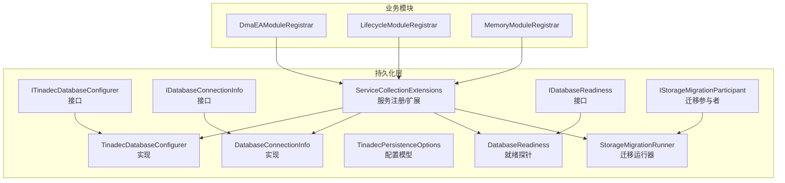
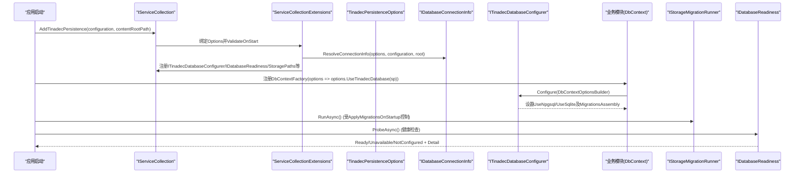
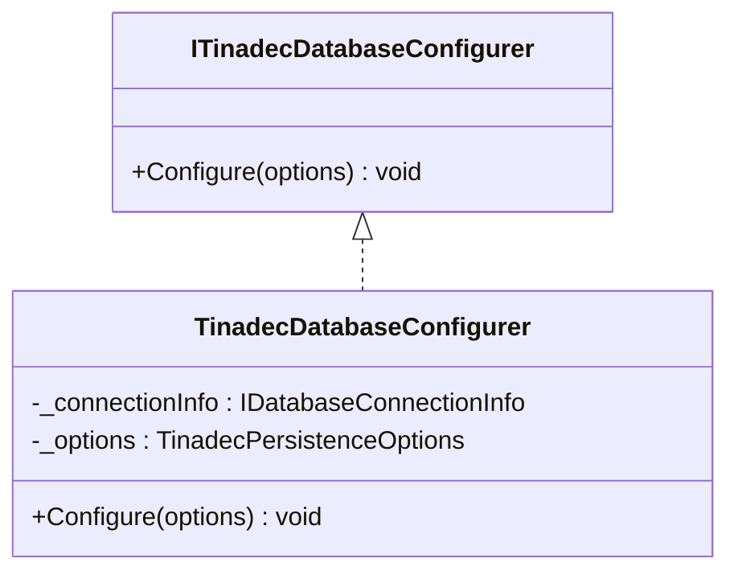
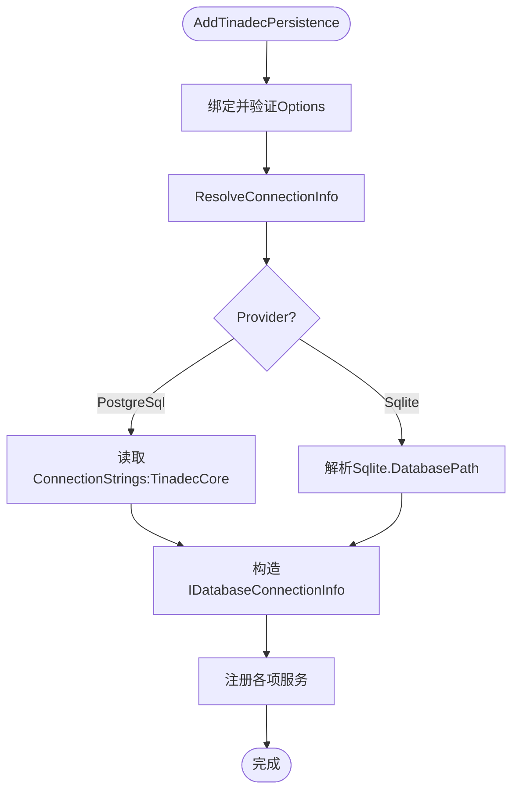
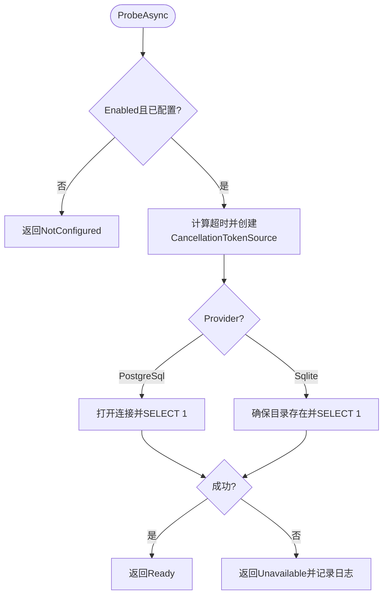
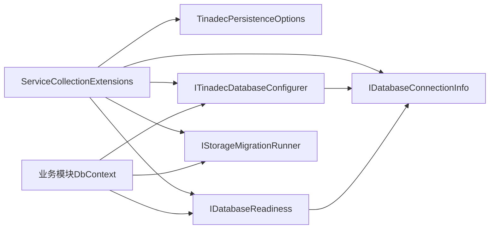

# 数据库配置器

<cite>
**本文引用的文件**
- [ITinadecDatabaseConfigurer.cs](file://TinadecCore\Persistence\ITinadecDatabaseConfigurer.cs)
- [TinadecDatabaseConfigurer.cs](file://TinadecCore\Persistence\TinadecDatabaseConfigurer.cs)
- [ServiceCollectionExtensions.cs](file://TinadecCore\Persistence\ServiceCollectionExtensions.cs)
- [TinadecPersistenceOptions.cs](file://TinadecCore\Persistence\TinadecPersistenceOptions.cs)
- [IDatabaseConnectionInfo.cs](file://TinadecCore\Persistence\IDatabaseConnectionInfo.cs)
- [DatabaseConnectionInfo.cs](file://TinadecCore\Persistence\DatabaseConnectionInfo.cs)
- [DatabaseProvider.cs](file://TinadecCore\Persistence\DatabaseProvider.cs)
- [IDatabaseReadiness.cs](file://TinadecCore\Persistence\IDatabaseReadiness.cs)
- [DatabaseReadiness.cs](file://TinadecCore\Persistence\DatabaseReadiness.cs)
- [StorageMigration.cs](file://TinadecCore\Persistence\StorageMigration.cs)
- [DmaEAModuleRegistrar.cs](file://TinadecCore\DmaEA\DmaEAModuleRegistrar.cs)
- [LifecycleModuleRegistrar.cs](file://TinadecCore\Lifecycle\LifecycleModuleRegistrar.cs)
- [MemoryModuleRegistrar.cs](file://TinadecCore\Memory\MemoryModuleRegistrar.cs)
</cite>

## 目录
1. [简介](#简介)
2. [项目结构](#项目结构)
3. [核心组件](#核心组件)
4. [架构总览](#架构总览)
5. [详细组件分析](#详细组件分析)
6. [依赖关系分析](#依赖关系分析)
7. [性能考量](#性能考量)
8. [故障排查指南](#故障排查指南)
9. [结论](#结论)
10. [附录](#附录)

## 简介
本文件面向“数据库配置器”子系统，系统性阐述 ITinadecDatabaseConfigurer 接口的设计模式与配置管道，记录 TinadecDatabaseConfigurer 的配置选项、依赖注入集成方式，以及 ServiceCollectionExtensions 的服务注册与中间件式扩展。文档覆盖多环境配置、条件注册、模块化设计，并提供自定义配置器的开发指南、扩展点、配置验证、默认值处理与错误诊断策略。

## 项目结构
数据库配置器位于 TinadecCore.Persistence 命名空间下，围绕 EF Core 的 DbContextOptionsBuilder 提供统一的数据库提供者选择与连接信息解析能力。模块通过统一扩展方法 UseTinadecDatabase 接入，迁移由参与者模式驱动，健康检查由就绪探针实现。

图表来源
- [ServiceCollectionExtensions.cs:15-48](file://TinadecCore\Persistence\ServiceCollectionExtensions.cs#L15-L48)
- [TinadecDatabaseConfigurer.cs:19-46](file://TinadecCore\Persistence\TinadecDatabaseConfigurer.cs#L19-L46)
- [DatabaseConnectionInfo.cs:1-22](file://TinadecCore\Persistence\DatabaseConnectionInfo.cs#L1-L22)
- [DatabaseReadiness.cs:24-73](file://TinadecCore\Persistence\DatabaseReadiness.cs#L24-L73)
- [StorageMigration.cs:14-40](file://TinadecCore\Persistence\StorageMigration.cs#L14-L40)
- [DmaEAModuleRegistrar.cs:16-31](file://TinadecCore\DmaEA\DmaEAModuleRegistrar.cs#L16-L31)
- [LifecycleModuleRegistrar.cs:17-34](file://TinadecCore\Lifecycle\LifecycleModuleRegistrar.cs#L17-L34)
- [MemoryModuleRegistrar.cs:15-32](file://TinadecCore\Memory\MemoryModuleRegistrar.cs#L15-L32)

章节来源
- [ServiceCollectionExtensions.cs:15-48](file://TinadecCore\Persistence\ServiceCollectionExtensions.cs#L15-L48)
- [TinadecPersistenceOptions.cs:7-32](file://TinadecCore\Persistence\TinadecPersistenceOptions.cs#L7-L32)

## 核心组件
- ITinadecDatabaseConfigurer：定义将活动数据库提供者应用到 EF Core DbContextOptionsBuilder 的统一入口，供业务模块在注册 DbContext 时调用。
- TinadecDatabaseConfigurer：根据 TinadecPersistenceOptions 与 IDatabaseConnectionInfo 决定使用 SQLite 或 PostgreSQL，并设置对应的迁移程序集。
- ServiceCollectionExtensions：集中注册 Options、连接信息、配置器、就绪探针、存储路径、内容存储、向量数据库、密钥存储与迁移运行器；提供 UseTinadecDatabase 扩展方法。
- TinadecPersistenceOptions：共享配置模型，包含启用开关、提供者选择、SQLite/PostgreSQL 子配置、数据根目录、启动迁移开关与就绪探测超时等。
- IDatabaseConnectionInfo/DatabaseConnectionInfo：封装活动提供者的连接字符串与元信息，对外暴露是否已配置、提供者名称等。
- IDatabaseReadiness/DatabaseReadiness：非抛错的就绪探测，按提供者执行 SELECT 1 并返回状态与详情。
- StorageMigration（参与者与运行器）：以参与者模式协调各模块的迁移任务，支持条件执行。

章节来源
- [ITinadecDatabaseConfigurer.cs:9-16](file://TinadecCore\Persistence\ITinadecDatabaseConfigurer.cs#L9-L16)
- [TinadecDatabaseConfigurer.cs:6-47](file://TinadecCore\Persistence\TinadecDatabaseConfigurer.cs#L6-L47)
- [ServiceCollectionExtensions.cs:15-48](file://TinadecCore\Persistence\ServiceCollectionExtensions.cs#L15-L48)
- [TinadecPersistenceOptions.cs:7-32](file://TinadecCore\Persistence\TinadecPersistenceOptions.cs#L7-L32)
- [IDatabaseConnectionInfo.cs:6-17](file://TinadecCore\Persistence\IDatabaseConnectionInfo.cs#L6-L17)
- [DatabaseConnectionInfo.cs:3-22](file://TinadecCore\Persistence\DatabaseConnectionInfo.cs#L3-L22)
- [IDatabaseReadiness.cs:6-9](file://TinadecCore\Persistence\IDatabaseReadiness.cs#L6-L9)
- [DatabaseReadiness.cs:24-73](file://TinadecCore\Persistence\DatabaseReadiness.cs#L24-L73)
- [StorageMigration.cs:4-12](file://TinadecCore\Persistence\StorageMigration.cs#L4-L12)

## 架构总览
下图展示了从应用启动到 DbContext 配置、迁移与健康检查的整体流程，以及模块如何以最小耦合接入。

图表来源
- [ServiceCollectionExtensions.cs:15-48](file://TinadecCore\Persistence\ServiceCollectionExtensions.cs#L15-L48)
- [ServiceCollectionExtensions.cs:54-62](file://TinadecCore\Persistence\ServiceCollectionExtensions.cs#L54-L62)
- [TinadecDatabaseConfigurer.cs:19-46](file://TinadecCore\Persistence\TinadecDatabaseConfigurer.cs#L19-L46)
- [StorageMigration.cs:27-39](file://TinadecCore\Persistence\StorageMigration.cs#L27-L39)
- [DatabaseReadiness.cs:24-73](file://TinadecCore\Persistence\DatabaseReadiness.cs#L24-L73)

## 详细组件分析

### ITinadecDatabaseConfigurer 与 TinadecDatabaseConfigurer
- 设计模式：策略/适配器模式。对外暴露 Configure 方法，内部依据 Provider 切换具体 EF Core 提供者的配置逻辑。
- 关键行为：
  - 校验 Enabled 开关，未启用直接抛出异常提示。
  - 校验连接信息是否有效，未配置则抛出明确异常，区分 PostgreSQL/SQLite 场景。
  - 根据 Provider 选择 UseNpgsql 或 UseSqlite，并设置对应迁移程序集。
- 复杂度与性能：O(1) 分支判断；无额外 IO；异常快速失败。

图表来源
- [ITinadecDatabaseConfigurer.cs:9-16](file://TinadecCore\Persistence\ITinadecDatabaseConfigurer.cs#L9-L16)
- [TinadecDatabaseConfigurer.cs:6-47](file://TinadecCore\Persistence\TinadecDatabaseConfigurer.cs#L6-L47)

章节来源
- [ITinadecDatabaseConfigurer.cs:9-16](file://TinadecCore\Persistence\ITinadecDatabaseConfigurer.cs#L9-L16)
- [TinadecDatabaseConfigurer.cs:19-46](file://TinadecCore\Persistence\TinadecDatabaseConfigurer.cs#L19-L46)

### ServiceCollectionExtensions：服务注册与中间件式扩展
- 服务注册：
  - 绑定 TinadecPersistenceOptions 并 ValidateOnStart，限制 ProbeTimeoutSeconds 范围。
  - 解析 IDatabaseConnectionInfo（根据 Provider 与配置源）。
  - 注册 ITinadecDatabaseConfigurer、IDatabaseReadiness、StoragePaths、IContentStore、IProjectVectorDatabase、ISecretStore（平台差异化）、IStorageMigrationRunner。
- 中间件式扩展：
  - UseTinadecDatabase：在 DbContextOptionsBuilder 上调用配置器，使模块以统一方式接入。
- 连接解析：
  - SQLite：优先使用 SqliteOptions.DatabasePath，相对路径基于 contentRootPath 解析为绝对路径，生成连接字符串。
  - PostgreSQL：读取 ConnectionStrings 中指定键的连接字符串。

图表来源
- [ServiceCollectionExtensions.cs:23-48](file://TinadecCore\Persistence\ServiceCollectionExtensions.cs#L23-L48)
- [ServiceCollectionExtensions.cs:64-120](file://TinadecCore\Persistence\ServiceCollectionExtensions.cs#L64-L120)

章节来源
- [ServiceCollectionExtensions.cs:15-48](file://TinadecCore\Persistence\ServiceCollectionExtensions.cs#L15-L48)
- [ServiceCollectionExtensions.cs:54-62](file://TinadecCore\Persistence\ServiceCollectionExtensions.cs#L54-L62)
- [ServiceCollectionExtensions.cs:64-120](file://TinadecCore\Persistence\ServiceCollectionExtensions.cs#L64-L120)

### TinadecPersistenceOptions：配置模型与默认值
- 字段说明：
  - Enabled：是否启用持久化（默认 true）。
  - Provider：活动提供者（默认 SQLite）。
  - Sqlite.DatabasePath：SQLite 文件路径（默认 data/tinadec.db）。
  - PostgreSql.ConnectionStringName：连接字符串键名（默认 TinadecCore）。
  - DataRoot：数据根目录（默认 data）。
  - ApplyMigrationsOnStartup：启动时是否执行迁移（默认 true）。
  - ProbeTimeoutSeconds：就绪探测超时秒数（默认 3，范围 1-30）。
- 验证：Validate 约束 ProbeTimeoutSeconds 范围，ValidateOnStart 确保启动时校验生效。

章节来源
- [TinadecPersistenceOptions.cs:7-32](file://TinadecCore\Persistence\TinadecPersistenceOptions.cs#L7-L32)
- [ServiceCollectionExtensions.cs:23-28](file://TinadecCore\Persistence\ServiceCollectionExtensions.cs#L23-L28)

### IDatabaseConnectionInfo/DatabaseConnectionInfo：连接信息抽象
- IsConfigured：是否存在有效连接字符串。
- Provider：活动提供者枚举。
- ConnectionString：EF 兼容的连接字符串（可能为空）。
- ProviderName：可读名称（sqlite/postgresql），用于就绪报告。

章节来源
- [IDatabaseConnectionInfo.cs:6-17](file://TinadecCore\Persistence\IDatabaseConnectionInfo.cs#L6-L17)
- [DatabaseConnectionInfo.cs:3-22](file://TinadecCore\Persistence\DatabaseConnectionInfo.cs#L3-L22)

### IDatabaseReadiness/DatabaseReadiness：就绪探针
- 行为：
  - 若未启用或未配置，返回 NotConfigured。
  - 根据 Provider 分别执行 SQLite/PostgreSQL 的 SELECT 1 探测。
  - 对 SQLite：确保文件目录存在；对 PostgreSQL：设置 CommandTimeout。
  - 捕获异常并返回 Unavailable，附带错误详情。
- 超时：使用 Math.Clamp 限制超时范围，结合 CancellationToken 实现可取消的探测。

图表来源
- [DatabaseReadiness.cs:24-73](file://TinadecCore\Persistence\DatabaseReadiness.cs#L24-L73)
- [DatabaseReadiness.cs:75-116](file://TinadecCore\Persistence\DatabaseReadiness.cs#L75-L116)

章节来源
- [IDatabaseReadiness.cs:6-9](file://TinadecCore\Persistence\IDatabaseReadiness.cs#L6-L9)
- [DatabaseReadiness.cs:24-73](file://TinadecCore\Persistence\DatabaseReadiness.cs#L24-L73)

### 迁移参与者与运行器：模块化迁移
- IStorageMigrationParticipant：由业务模块实现，提供 MigrateAsync。
- StorageMigrationRunner：遍历参与者执行迁移，遵循以下条件：
  - 若 Enabled=false，跳过。
  - 若 Provider=PostgreSql 且 ApplyMigrationsOnStartup=false，跳过（避免多实例竞争）。
- 典型用法：模块在 Registrar 中注册 DbContextFactory 并使用 UseTinadecDatabase，同时注册参与者。

章节来源
- [StorageMigration.cs:4-12](file://TinadecCore\Persistence\StorageMigration.cs#L4-L12)
- [StorageMigration.cs:14-40](file://TinadecCore\Persistence\StorageMigration.cs#L14-L40)
- [DmaEAModuleRegistrar.cs:16-31](file://TinadecCore\DmaEA\DmaEAModuleRegistrar.cs#L16-L31)
- [LifecycleModuleRegistrar.cs:17-34](file://TinadecCore\Lifecycle\LifecycleModuleRegistrar.cs#L17-L34)
- [MemoryModuleRegistrar.cs:15-32](file://TinadecCore\Memory\MemoryModuleRegistrar.cs#L15-L32)

## 依赖关系分析
- 低耦合：模块仅依赖 ITinadecDatabaseConfigurer 与 UseTinadecDatabase 扩展，不关心底层提供者细节。
- 解耦点：
  - 连接信息通过 IDatabaseConnectionInfo 抽象，便于替换与测试。
  - 迁移通过参与者模式扩展，新增模块无需修改核心逻辑。
  - 健康检查通过 IDatabaseReadiness 抽象，便于替换为其他探测策略。
- 外部依赖：EF Core、Npgsql、Microsoft.Data.Sqlite、Microsoft.Extensions.Options。

图表来源
- [ServiceCollectionExtensions.cs:15-48](file://TinadecCore\Persistence\ServiceCollectionExtensions.cs#L15-L48)
- [TinadecDatabaseConfigurer.cs:6-47](file://TinadecCore\Persistence\TinadecDatabaseConfigurer.cs#L6-L47)
- [DatabaseReadiness.cs:24-73](file://TinadecCore\Persistence\DatabaseReadiness.cs#L24-L73)
- [StorageMigration.cs:14-40](file://TinadecCore\Persistence\StorageMigration.cs#L14-L40)

章节来源
- [ServiceCollectionExtensions.cs:15-48](file://TinadecCore\Persistence\ServiceCollectionExtensions.cs#L15-L48)

## 性能考量
- 连接解析仅在服务构建阶段执行一次，后续复用单例。
- 就绪探测使用可取消令牌与受限超时，避免阻塞启动。
- SQLite 探测前确保目录存在，减少首次 IO 失败。
- PostgreSQL 探测设置 CommandTimeout，防止网络延迟导致长时间等待。
- 迁移按需执行，PostgreSQL 默认关闭自动迁移以避免多实例竞争。

[本节为通用指导，不直接分析具体文件]

## 故障排查指南
- 常见错误与定位：
  - “TinadecPersistence is disabled”：检查 TinadecPersistence:Enabled 是否为 true。
  - “PostgreSQL is not configured”：确认 ConnectionStrings 中存在指定键名的连接字符串。
  - “SQLite is not configured”：检查 TinadecPersistence:Sqlite:DatabasePath 是否有效。
  - 就绪探测失败：查看 DatabaseReadiness 日志中的 Detail 字段，确认连接字符串与网络可达性。
- 调试建议：
  - 启用 Options 验证失败时的启动期报错，核对 ProbeTimeoutSeconds 范围。
  - 在 UseTinadecDatabase 处断点，观察最终生成的连接字符串与迁移程序集。
  - 针对 PostgreSQL，确认服务器防火墙与端口可达。

章节来源
- [TinadecDatabaseConfigurer.cs:23-35](file://TinadecCore\Persistence\TinadecDatabaseConfigurer.cs#L23-L35)
- [DatabaseReadiness.cs:24-73](file://TinadecCore\Persistence\DatabaseReadiness.cs#L24-L73)
- [ServiceCollectionExtensions.cs:23-28](file://TinadecCore\Persistence\ServiceCollectionExtensions.cs#L23-L28)

## 结论
数据库配置器通过清晰的接口与扩展点，实现了提供者无关的 EF Core 配置、统一的连接信息解析、可扩展的迁移机制与健壮的健康检查。模块仅需调用 UseTinadecDatabase 即可接入，保持低耦合与高内聚。通过 Options 验证、条件注册与模块化设计，系统具备良好的可维护性与可演进性。

[本节为总结，不直接分析具体文件]

## 附录

### 多环境配置与条件注册
- 通过配置文件分层（如 appsettings.Development.json、appsettings.Production.json）切换 Provider 与连接字符串。
- 使用 TinadecPersistenceOptions.Enabled 在特定环境禁用持久化。
- PostgreSQL 生产环境建议关闭 ApplyMigrationsOnStartup，由运维或 CI/CD 管理迁移。

章节来源
- [TinadecPersistenceOptions.cs:7-32](file://TinadecCore\Persistence\TinadecPersistenceOptions.cs#L7-L32)
- [ServiceCollectionExtensions.cs:64-120](file://TinadecCore\Persistence\ServiceCollectionExtensions.cs#L64-L120)

### 自定义配置器开发指南
- 实现 ITinadecDatabaseConfigurer 接口，并在 Configure 中设置 DbContextOptionsBuilder。
- 在 ServiceCollectionExtensions 中以 TryAddSingleton 注册自定义实现，替换默认 TinadecDatabaseConfigurer。
- 如需自定义连接解析，可替换 IDatabaseConnectionInfo 的实现，或在 ResolveConnectionInfo 中增加新分支。

章节来源
- [ITinadecDatabaseConfigurer.cs:9-16](file://TinadecCore\Persistence\ITinadecDatabaseConfigurer.cs#L9-L16)
- [ServiceCollectionExtensions.cs:38-48](file://TinadecCore\Persistence\ServiceCollectionExtensions.cs#L38-L48)

### 扩展点清单
- 配置模型：TinadecPersistenceOptions（新增字段与验证）。
- 连接信息：IDatabaseConnectionInfo/DatabaseConnectionInfo（自定义解析逻辑）。
- 配置器：ITinadecDatabaseConfigurer/TinadecDatabaseConfigurer（自定义提供者配置）。
- 健康检查：IDatabaseReadiness/DatabaseReadiness（自定义探测策略）。
- 迁移：IStorageMigrationParticipant/IStorageMigrationRunner（新增参与者与运行器逻辑）。

章节来源
- [TinadecPersistenceOptions.cs:7-32](file://TinadecCore\Persistence\TinadecPersistenceOptions.cs#L7-L32)
- [IDatabaseConnectionInfo.cs:6-17](file://TinadecCore\Persistence\IDatabaseConnectionInfo.cs#L6-L17)
- [ITinadecDatabaseConfigurer.cs:9-16](file://TinadecCore\Persistence\ITinadecDatabaseConfigurer.cs#L9-L16)
- [IDatabaseReadiness.cs:6-9](file://TinadecCore\Persistence\IDatabaseReadiness.cs#L6-L9)
- [StorageMigration.cs:4-12](file://TinadecCore\Persistence\StorageMigration.cs#L4-L12)