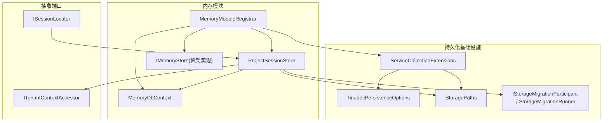
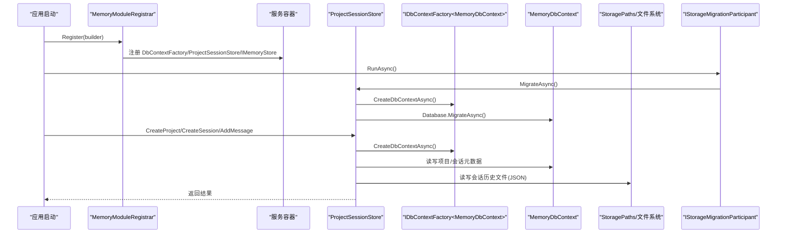
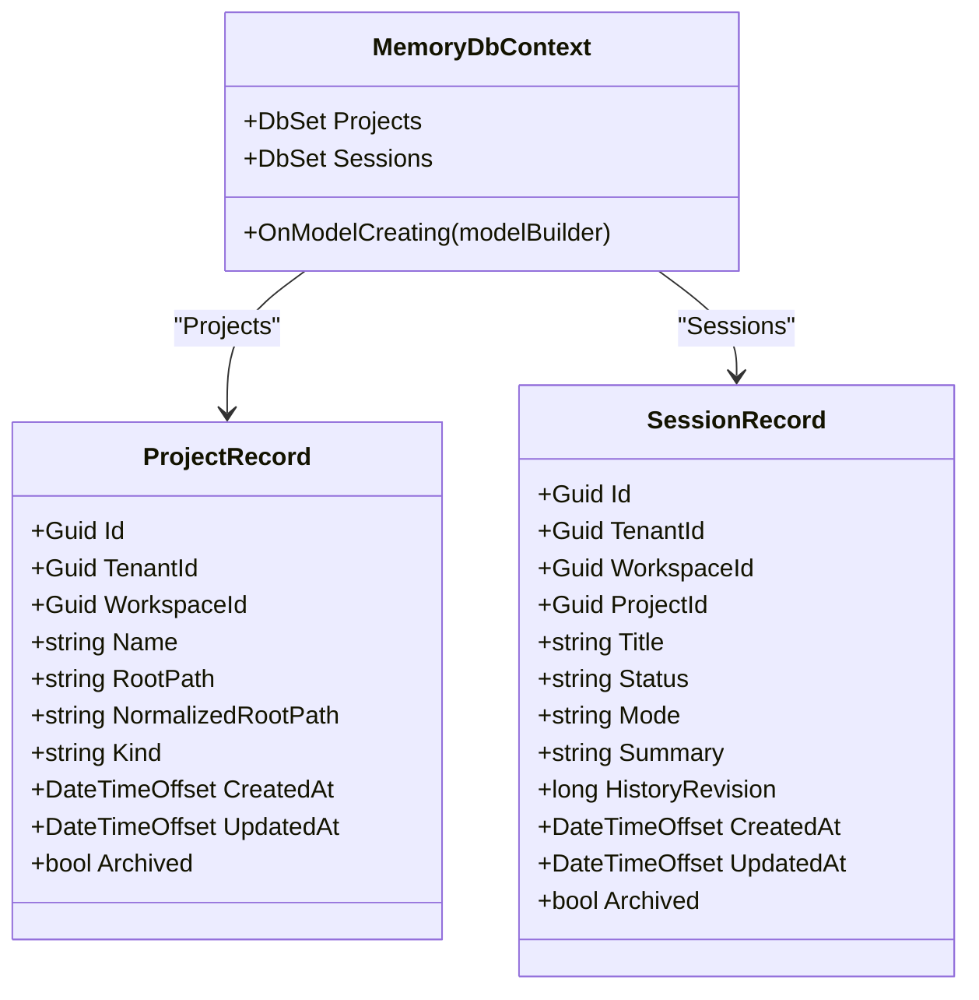
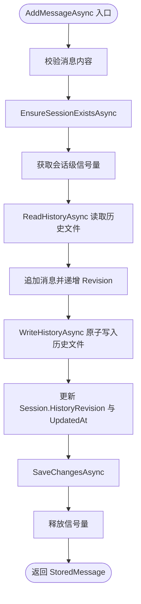
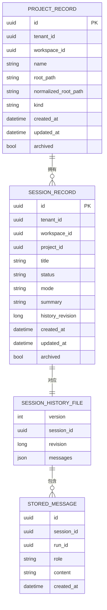
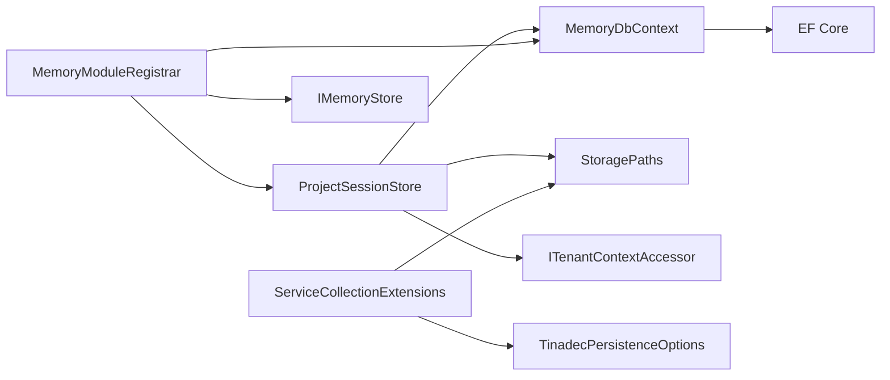

# 内存上下文

<cite>
**本文引用的文件**   
- [MemoryDbContext.cs](file://TinadecCore/Memory/MemoryDbContext.cs)
- [ProjectSessionStore.cs](file://TinadecCore/Memory/ProjectSessionStore.cs)
- [MemoryModuleRegistrar.cs](file://TinadecCore/Memory/MemoryModuleRegistrar.cs)
- [IMemoryStore.cs](file://TinadecCore/Abstractions/Ports/IMemoryStore.cs)
- [ISessionLocator.cs](file://TinadecCore/Abstractions/Ports/ISessionLocator.cs)
- [ITenantContextAccessor.cs](file://TinadecCore/Abstractions/Ports/ITenantContextAccessor.cs)
- [StoragePaths.cs](file://TinadecCore/Persistence/StoragePaths.cs)
- [ServiceCollectionExtensions.cs](file://TinadecCore/Persistence/ServiceCollectionExtensions.cs)
- [TinadecPersistenceOptions.cs](file://TinadecCore/Persistence/TinadecPersistenceOptions.cs)
- [StorageMigration.cs](file://TinadecCore/Persistence/StorageMigration.cs)
</cite>

## 目录
1. [简介](#简介)
2. [项目结构](#项目结构)
3. [核心组件](#核心组件)
4. [架构总览](#架构总览)
5. [详细组件分析](#详细组件分析)
6. [依赖关系分析](#依赖关系分析)
7. [性能考量](#性能考量)
8. [故障排查指南](#故障排查指南)
9. [结论](#结论)
10. [附录](#附录)

## 简介
本文件面向 TinadecOffice 的“内存数据库上下文”能力，聚焦 MemoryDbContext 与 ProjectSessionStore 的设计与实现。内容涵盖：
- 会话存储机制：基于 EF Core 的项目与会话元数据持久化，以及按会话的文件化消息历史存储。
- 会话数据结构：项目、会话、消息、历史文件的字段与约束。
- 上下文保持机制：租户/工作区隔离（TenantContext）与跨模块会话定位（ISessionLocator）。
- 生命周期管理：创建、查询、更新标题、追加消息、迁移等。
- 自动清理策略与性能优化：并发控制、原子写入、无跟踪读取、索引设计。
- 序列化、压缩与备份恢复：JSON 序列化、临时文件替换、幂等迁移。
- 使用示例与最佳实践：如何注册、配置、调用与扩展。

## 项目结构
内存上下文位于 TinadecCore.Memory 模块，提供：
- MemoryDbContext：EF Core 上下文，定义项目与会话实体及映射。
- ProjectSessionStore：会话与项目的业务操作封装，包含消息历史的文件存储。
- MemoryModuleRegistrar：模块注册，注入 DbContextFactory、ProjectSessionStore、IMemoryStore 等。
- 相关抽象与配置：ISessionLocator、IMemoryStore、ITenantContextAccessor、StoragePaths、TinadecPersistenceOptions、迁移参与者接口等。

图表来源
- [MemoryModuleRegistrar.cs](file://TinadecCore/Memory/MemoryModuleRegistrar.cs)
- [MemoryDbContext.cs](file://TinadecCore/Memory/MemoryDbContext.cs)
- [ProjectSessionStore.cs](file://TinadecCore/Memory/ProjectSessionStore.cs)
- [ServiceCollectionExtensions.cs](file://TinadecCore/Persistence/ServiceCollectionExtensions.cs)
- [StoragePaths.cs](file://TinadecCore/Persistence/StoragePaths.cs)
- [StorageMigration.cs](file://TinadecCore/Persistence/StorageMigration.cs)

章节来源
- [MemoryDbContext.cs:1-92](file://TinadecCore/Memory/MemoryDbContext.cs#L1-L92)
- [ProjectSessionStore.cs:1-219](file://TinadecCore/Memory/ProjectSessionStore.cs#L1-L219)
- [MemoryModuleRegistrar.cs:1-58](file://TinadecCore/Memory/MemoryModuleRegistrar.cs#L1-L58)
- [ServiceCollectionExtensions.cs:1-122](file://TinadecCore/Persistence/ServiceCollectionExtensions.cs#L1-L122)
- [StoragePaths.cs:1-64](file://TinadecCore/Persistence/StoragePaths.cs#L1-L64)
- [StorageMigration.cs:1-41](file://TinadecCore/Persistence/StorageMigration.cs#L1-L41)

## 核心组件
- MemoryDbContext：定义 ProjectRecord 与 SessionRecord 的表映射、主键、索引与属性长度限制；通过 UseTinadecDatabase 接入底层数据库提供者（SQLite/PostgreSQL）。
- ProjectSessionStore：实现 ISessionLocator 与 IStorageMigrationParticipant，提供项目与会话的 CRUD、消息历史读写、并发安全与迁移逻辑。
- IMemoryStore：定义 Agent 记忆存取接口（当前为骨架实现），用于未来扩展向量检索与保留策略。
- StoragePaths：统一解析 Core 拥有的文件路径（如会话历史、事件日志、工件等），并校验路径安全性。
- 配置与注册：TinadecPersistenceOptions 提供数据库与 DataRoot 配置；ServiceCollectionExtensions 完成连接信息与路径解析；MemoryModuleRegistrar 完成 DI 注册。

章节来源
- [MemoryDbContext.cs:1-92](file://TinadecCore/Memory/MemoryDbContext.cs#L1-L92)
- [ProjectSessionStore.cs:1-219](file://TinadecCore/Memory/ProjectSessionStore.cs#L1-L219)
- [IMemoryStore.cs:1-31](file://TinadecCore/Abstractions/Ports/IMemoryStore.cs#L1-L31)
- [StoragePaths.cs:1-64](file://TinadecCore/Persistence/StoragePaths.cs#L1-L64)
- [ServiceCollectionExtensions.cs:1-122](file://TinadecCore/Persistence/ServiceCollectionExtensions.cs#L1-L122)
- [TinadecPersistenceOptions.cs:1-48](file://TinadecCore/Persistence/TinadecPersistenceOptions.cs#L1-L48)
- [MemoryModuleRegistrar.cs:1-58](file://TinadecCore/Memory/MemoryModuleRegistrar.cs#L1-L58)

## 架构总览
下图展示从模块注册到运行时访问的关键路径：DI 容器注入 DbContextFactory、StoragePaths、租户上下文；ProjectSessionStore 通过 EF Core 访问元数据，并通过文件系统持久化消息历史；迁移由参与者接口驱动。

图表来源
- [MemoryModuleRegistrar.cs:1-58](file://TinadecCore/Memory/MemoryModuleRegistrar.cs#L1-L58)
- [ProjectSessionStore.cs:1-219](file://TinadecCore/Memory/ProjectSessionStore.cs#L1-L219)
- [ServiceCollectionExtensions.cs:1-122](file://TinadecCore/Persistence/ServiceCollectionExtensions.cs#L1-L122)
- [StorageMigration.cs:1-41](file://TinadecCore/Persistence/StorageMigration.cs#L1-L41)

## 详细组件分析

### MemoryDbContext：模型与映射
- 实体
  - ProjectRecord：项目标识、租户/工作区、名称、根路径、归一化路径、类型、时间戳、归档标志。
  - SessionRecord：会话标识、租户/工作区/项目、标题、状态、模式、摘要、历史版本、时间戳、归档标志。
- 映射与索引
  - 表名与列名映射，主键与唯一索引（租户+工作区+归一化路径）。
  - 常用查询索引：按租户/工作区/归档/更新时间排序。
- 数据库提供者
  - 通过 UseTinadecDatabase 接入 SQLite/PostgreSQL，默认本地开发使用 SQLite。

图表来源
- [MemoryDbContext.cs:1-92](file://TinadecCore/Memory/MemoryDbContext.cs#L1-L92)

章节来源
- [MemoryDbContext.cs:1-92](file://TinadecCore/Memory/MemoryDbContext.cs#L1-L92)

### ProjectSessionStore：会话存储与消息历史
- 职责
  - 项目与会话的创建、列表、更新标题。
  - 会话消息的追加与读取，维护历史版本与更新时间。
  - 会话定位（FindAsync）返回轻量引用（SessionReference）。
  - 迁移参与者：执行 EF 迁移与遗留数据修复。
- 并发与一致性
  - 每个会话一个 SemaphoreSlim 保证单写串行化。
  - 历史文件采用“临时文件 + Replace/Move”的原子替换策略，避免损坏。
- 缓存与性能
  - 读取会话列表使用 AsNoTracking 提升性能。
  - 会话历史文件按需加载，避免全量载入。
- 序列化
  - 使用 System.Text.Json 的 Web 默认选项，关闭缩进以减小体积。
- 错误处理
  - 参数校验、未找到会话/项目抛出异常，非法历史数据抛出无效数据异常。

图表来源
- [ProjectSessionStore.cs:117-139](file://TinadecCore/Memory/ProjectSessionStore.cs#L117-L139)
- [ProjectSessionStore.cs:166-196](file://TinadecCore/Memory/ProjectSessionStore.cs#L166-L196)

章节来源
- [ProjectSessionStore.cs:1-219](file://TinadecCore/Memory/ProjectSessionStore.cs#L1-L219)

### 会话数据结构与文件存储
- 会话历史文件（SessionHistoryFile）
  - Version：文件版本（默认 1）。
  - SessionId：会话标识。
  - Revision：消息修订号，每次新增消息自增。
  - Messages：StoredMessage 列表。
- 消息（StoredMessage）
  - Id、SessionId、RunId（可选）、Role、Content、CreatedAt。
- 文件路径
  - 由 StoragePaths.SessionHistory(sessionId) 生成，位于 DataRoot/sessions 下。

图表来源
- [MemoryDbContext.cs:63-91](file://TinadecCore/Memory/MemoryDbContext.cs#L63-L91)
- [ProjectSessionStore.cs:202-218](file://TinadecCore/Memory/ProjectSessionStore.cs#L202-L218)
- [StoragePaths.cs:21](file://TinadecCore/Persistence/StoragePaths.cs#L21)

章节来源
- [ProjectSessionStore.cs:202-218](file://TinadecCore/Memory/ProjectSessionStore.cs#L202-L218)
- [StoragePaths.cs:1-64](file://TinadecCore/Persistence/StoragePaths.cs#L1-L64)

### 上下文保持与租户隔离
- ITenantContextAccessor.Current 提供 TenantId、WorkspaceId、PrincipalId、Role 等上下文。
- ProjectSessionStore 在创建/查询时强制过滤租户与工作区，确保多租户隔离。
- ISessionLocator 暴露 FindAsync，返回轻量 SessionReference，便于跨模块验证所有权边界。

章节来源
- [ITenantContextAccessor.cs:1-15](file://TinadecCore/Abstractions/Ports/ITenantContextAccessor.cs#L1-L15)
- [ISessionLocator.cs:1-10](file://TinadecCore/Abstractions/Ports/ISessionLocator.cs#L1-L10)
- [ProjectSessionStore.cs:62-95](file://TinadecCore/Memory/ProjectSessionStore.cs#L62-L95)

### 模块注册与依赖注入
- MemoryModuleRegistrar.Register
  - 注册 IDbContextFactory<MemoryDbContext>，使用 UseTinadecDatabase 绑定数据库提供者。
  - 注册 ProjectSessionStore 为单例，并映射到 ISessionLocator。
  - 注册 IStorageMigrationParticipant（ProjectSessionStore 自身）。
  - 注册 IMemoryStore（当前为骨架实现）。
- ServiceCollectionExtensions.AddTinadecPersistence
  - 绑定 TinadecPersistenceOptions，解析连接信息（SQLite/PostgreSQL）。
  - 注册 StoragePaths、IContentStore、IProjectVectorDatabase、SecretStore、迁移运行器。

章节来源
- [MemoryModuleRegistrar.cs:1-58](file://TinadecCore/Memory/MemoryModuleRegistrar.cs#L1-L58)
- [ServiceCollectionExtensions.cs:1-122](file://TinadecCore/Persistence/ServiceCollectionExtensions.cs#L1-L122)

### 迁移与数据演进
- IStorageMigrationParticipant：由业务模块实现，参与全局迁移流程。
- StorageMigrationRunner.RunAsync：根据配置决定是否执行迁移（Provider、ApplyMigrationsOnStartup）。
- ProjectSessionStore.MigrateAsync：执行 EF 迁移，并将遗留记录的租户/工作区填充为当前上下文值。

章节来源
- [StorageMigration.cs:1-41](file://TinadecCore/Persistence/StorageMigration.cs#L1-L41)
- [ProjectSessionStore.cs:149-159](file://TinadecCore/Memory/ProjectSessionStore.cs#L149-L159)

## 依赖关系分析
- 组件耦合
  - ProjectSessionStore 依赖 IDbContextFactory<MemoryDbContext>、StoragePaths、ITenantContextAccessor。
  - MemoryDbContext 依赖 EF Core 与 UseTinadecDatabase 提供的数据库提供者。
  - 模块注册将上述依赖装配为单例或工厂。
- 外部依赖
  - 文件系统：会话历史 JSON 文件读写。
  - 配置系统：TinadecPersistenceOptions 提供 DataRoot、Provider、连接字符串等。
- 潜在循环依赖
  - 当前未发现循环依赖；迁移参与者通过接口解耦。

图表来源
- [ProjectSessionStore.cs:1-219](file://TinadecCore/Memory/ProjectSessionStore.cs#L1-L219)
- [MemoryDbContext.cs:1-92](file://TinadecCore/Memory/MemoryDbContext.cs#L1-L92)
- [MemoryModuleRegistrar.cs:1-58](file://TinadecCore/Memory/MemoryModuleRegistrar.cs#L1-L58)
- [ServiceCollectionExtensions.cs:1-122](file://TinadecCore/Persistence/ServiceCollectionExtensions.cs#L1-L122)

章节来源
- [ProjectSessionStore.cs:1-219](file://TinadecCore/Memory/ProjectSessionStore.cs#L1-L219)
- [MemoryDbContext.cs:1-92](file://TinadecCore/Memory/MemoryDbContext.cs#L1-L92)
- [MemoryModuleRegistrar.cs:1-58](file://TinadecCore/Memory/MemoryModuleRegistrar.cs#L1-L58)
- [ServiceCollectionExtensions.cs:1-122](file://TinadecCore/Persistence/ServiceCollectionExtensions.cs#L1-L122)

## 性能考量
- 数据库层
  - 使用 AsNoTracking 进行只读查询，减少变更追踪开销。
  - 合理索引：租户/工作区/归档/更新时间组合索引，加速列表与排序。
- 文件层
  - 会话历史文件按需加载，避免大对象常驻内存。
  - 原子写入（临时文件 + Replace/Move）降低锁竞争与损坏风险。
- 并发控制
  - 每会话一个信号量，保证消息追加顺序一致，避免竞态。
- 序列化
  - 关闭 JSON 缩进，减小磁盘占用与 IO 压力。
- 可扩展性
  - 可考虑对长会话历史进行分片或滚动归档（例如按时间窗口拆分文件）。
  - 可在 IMemoryStore 中引入向量检索与保留策略，提高上下文召回效率。

[本节为通用指导，不直接分析具体文件]

## 故障排查指南
- 常见异常
  - 参数为空：CreateProjectAsync/CreateSessionAsync/AddMessageAsync 会抛出参数异常。
  - 资源不存在：FindAsync/EnsureSessionExistsAsync 找不到会话或项目时抛出 KeyNotFoundException。
  - 历史文件损坏：反序列化失败抛出 InvalidDataException。
- 诊断步骤
  - 检查 DataRoot 是否配置正确且可写。
  - 确认会话历史文件是否存在且格式合法。
  - 查看数据库连接与迁移是否成功（ApplyMigrationsOnStartup）。
  - 检查租户/工作区上下文是否正确设置。
- 恢复建议
  - 若历史文件损坏，可从最近一次备份恢复；或使用空历史重建（新会话）。
  - 迁移失败时回滚至上一版本，修正配置后重试。

章节来源
- [ProjectSessionStore.cs:24-35](file://TinadecCore/Memory/ProjectSessionStore.cs#L24-L35)
- [ProjectSessionStore.cs:161-173](file://TinadecCore/Memory/ProjectSessionStore.cs#L161-L173)
- [StorageMigration.cs:27-39](file://TinadecCore/Persistence/StorageMigration.cs#L27-L39)

## 结论
MemoryDbContext 与 ProjectSessionStore 共同构成了 TinadecOffice 的内存上下文基础：前者负责结构化元数据的持久化与索引优化，后者负责会话生命周期、消息历史与并发安全。结合 StoragePaths 与 TinadecPersistenceOptions，系统在本地与生产环境均具备一致的存储语义与可移植性。未来可在 IMemoryStore 中扩展向量检索与智能保留策略，进一步提升上下文质量与性能。

[本节为总结性内容，不直接分析具体文件]

## 附录

### 会话生命周期管理
- 创建项目：校验路径与租户/工作区，写入项目记录。
- 创建会话：校验项目存在，写入会话记录，初始化空历史文件。
- 更新标题：查找会话并更新标题与更新时间。
- 追加消息：并发安全地追加消息、更新修订号与更新时间。
- 列出会话：按租户/工作区过滤，支持按项目筛选，按更新时间倒序。
- 迁移：执行 EF 迁移，修复遗留数据。

章节来源
- [ProjectSessionStore.cs:24-85](file://TinadecCore/Memory/ProjectSessionStore.cs#L24-L85)
- [ProjectSessionStore.cs:87-108](file://TinadecCore/Memory/ProjectSessionStore.cs#L87-L108)
- [ProjectSessionStore.cs:110-139](file://TinadecCore/Memory/ProjectSessionStore.cs#L110-L139)
- [ProjectSessionStore.cs:149-159](file://TinadecCore/Memory/ProjectSessionStore.cs#L149-L159)

### 数据序列化、压缩与备份恢复方案
- 序列化：System.Text.Json，Web 默认选项，关闭缩进。
- 压缩：当前未启用压缩；如需压缩，可在 WriteHistoryAsync 前对字节流进行压缩（注意 IO 与 CPU 权衡）。
- 备份恢复：定期复制 sessions 目录；恢复时覆盖原文件并确保权限正确。
- 原子写入：已实现临时文件 + Replace/Move，保障一致性。

章节来源
- [ProjectSessionStore.cs:175-196](file://TinadecCore/Memory/ProjectSessionStore.cs#L175-L196)
- [StoragePaths.cs:21](file://TinadecCore/Persistence/StoragePaths.cs#L21)

### 会话操作示例与最佳实践
- 示例流程
  - 启动时注册 MemoryModuleRegistrar。
  - 通过 ProjectSessionStore.CreateProjectAsync 创建项目。
  - 通过 CreateSessionAsync 创建会话。
  - 通过 AddMessageAsync 追加消息，ListMessagesAsync 读取历史。
  - 通过 ListSessionsAsync/UpdateTitleAsync 管理会话元数据。
- 最佳实践
  - 始终设置正确的租户/工作区上下文。
  - 避免频繁小批量写入合并为批处理（必要时）。
  - 监控历史文件大小，必要时实施分片或归档。
  - 在生产环境开启迁移保护（ApplyMigrationsOnStartup=false）并手动控制迁移时机。

章节来源
- [MemoryModuleRegistrar.cs:15-32](file://TinadecCore/Memory/MemoryModuleRegistrar.cs#L15-L32)
- [ProjectSessionStore.cs:24-108](file://TinadecCore/Memory/ProjectSessionStore.cs#L24-L108)
- [TinadecPersistenceOptions.cs:21-28](file://TinadecCore/Persistence/TinadecPersistenceOptions.cs#L21-L28)