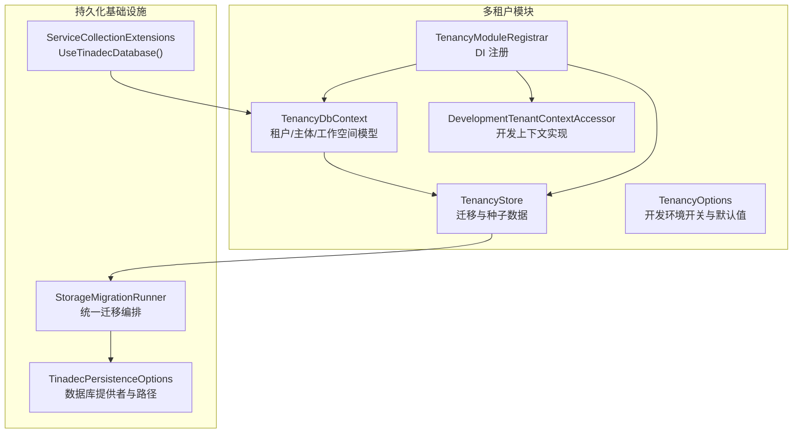
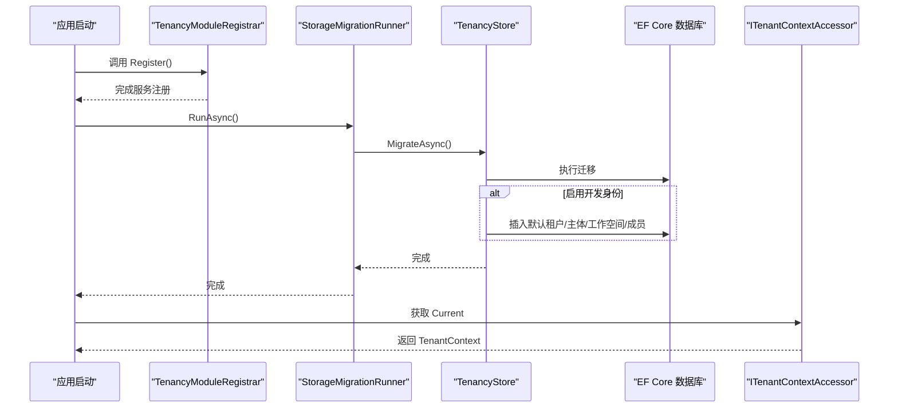
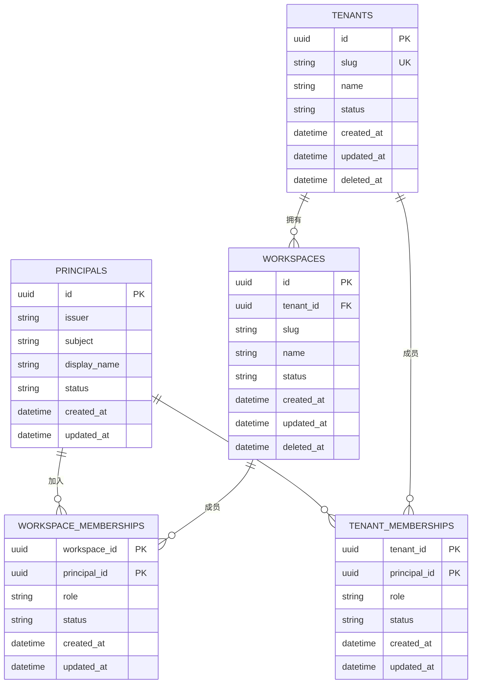
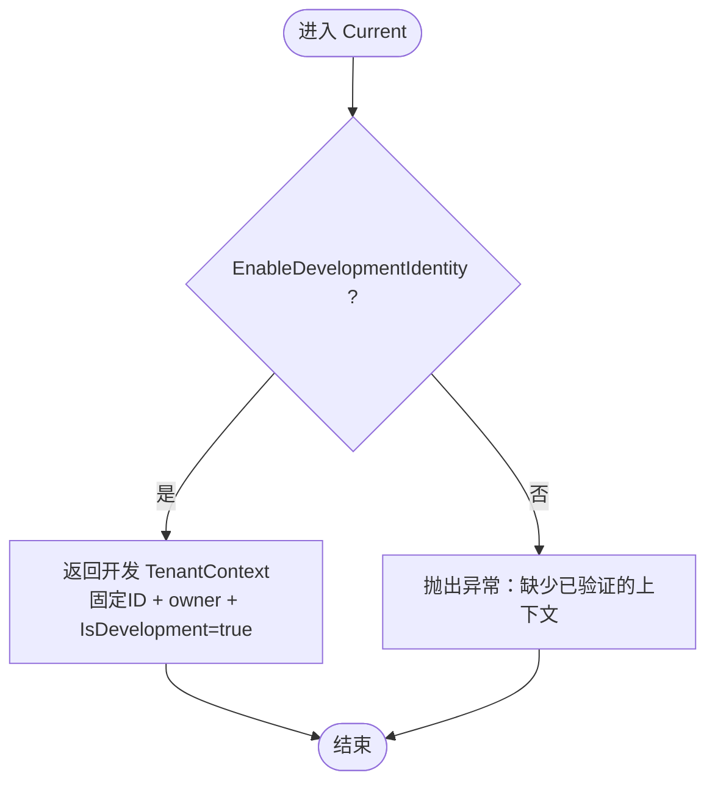
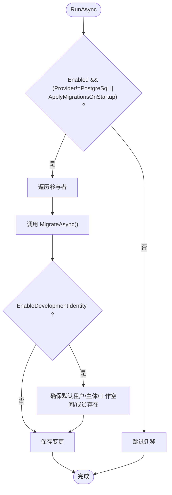
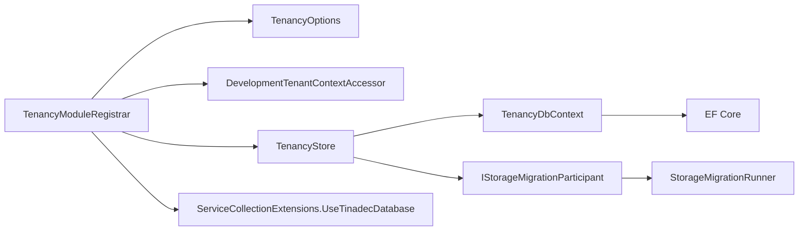

# 多租户上下文

<cite>
**本文引用的文件**   
- [TenancyDbContext.cs](file://TinadecCore/Tenancy/TenancyDbContext.cs)
- [TenancyStore.cs](file://TinadecCore/Tenancy/TenancyStore.cs)
- [TenancyOptions.cs](file://TinadecCore/Tenancy/TenancyOptions.cs)
- [DevelopmentTenantContextAccessor.cs](file://TinadecCore/Tenancy/DevelopmentTenantContextAccessor.cs)
- [TenancyModuleRegistrar.cs](file://TinadecCore/Tenancy/TenancyModuleRegistrar.cs)
- [ITenantContextAccessor.cs](file://TinadecCore/Abstractions/Ports/ITenantContextAccessor.cs)
- [ServiceCollectionExtensions.cs](file://TinadecCore/Persistence/ServiceCollectionExtensions.cs)
- [StorageMigration.cs](file://TinadecCore/Persistence/StorageMigration.cs)
- [TinadecPersistenceOptions.cs](file://TinadecCore/Persistence/TinadecPersistenceOptions.cs)
</cite>

## 目录
1. [简介](#简介)
2. [项目结构](#项目结构)
3. [核心组件](#核心组件)
4. [架构总览](#架构总览)
5. [详细组件分析](#详细组件分析)
6. [依赖关系分析](#依赖关系分析)
7. [性能考虑](#性能考虑)
8. [故障排查指南](#故障排查指南)
9. [结论](#结论)
10. [附录](#附录)

## 简介
本文件面向 TinadecOffice 的多租户数据库上下文与隔离机制，围绕 TenancyDbContext 的数据模型、租户配置存储、工作空间与成员管理、租户生命周期、资源配额与访问控制、数据迁移、备份策略、监控告警以及扩展性设计进行系统化说明。文档同时提供可操作的配置示例与管理流程，帮助开发者与运维人员快速理解并落地多租户方案。

## 项目结构
多租户能力集中在 TinadecCore.Tenancy 模块中，通过统一的 DbContext 定义租户、主体与工作空间等实体及其关系；通过 IStorageMigrationParticipant 参与启动时的迁移与种子数据初始化；通过 ITenantContextAccessor 暴露当前请求的租户上下文；并通过模块注册器将服务注入到 DI 容器。

图表来源 
- [TenancyDbContext.cs:1-59](file://TinadecCore/Tenancy/TenancyDbContext.cs#L1-L59)
- [TenancyStore.cs:1-48](file://TinadecCore/Tenancy/TenancyStore.cs#L1-L48)
- [TenancyOptions.cs:1-12](file://TinadecCore/Tenancy/TenancyOptions.cs#L1-L12)
- [DevelopmentTenantContextAccessor.cs:1-19](file://TinadecCore/Tenancy/DevelopmentTenantContextAccessor.cs#L1-L19)
- [TenancyModuleRegistrar.cs:1-38](file://TinadecCore/Tenancy/TenancyModuleRegistrar.cs#L1-L38)
- [ServiceCollectionExtensions.cs:1-122](file://TinadecCore/Persistence/ServiceCollectionExtensions.cs#L1-L122)
- [StorageMigration.cs:1-41](file://TinadecCore/Persistence/StorageMigration.cs#L1-L41)
- [TinadecPersistenceOptions.cs:1-48](file://TinadecCore/Persistence/TinadecPersistenceOptions.cs#L1-L48)

章节来源
- [TenancyDbContext.cs:1-59](file://TinadecCore/Tenancy/TenancyDbContext.cs#L1-L59)
- [TenancyStore.cs:1-48](file://TinadecCore/Tenancy/TenancyStore.cs#L1-L48)
- [TenancyOptions.cs:1-12](file://TinadecCore/Tenancy/TenancyOptions.cs#L1-L12)
- [DevelopmentTenantContextAccessor.cs:1-19](file://TinadecCore/Tenancy/DevelopmentTenantContextAccessor.cs#L1-L19)
- [TenancyModuleRegistrar.cs:1-38](file://TinadecCore/Tenancy/TenancyModuleRegistrar.cs#L1-L38)
- [ServiceCollectionExtensions.cs:1-122](file://TinadecCore/Persistence/ServiceCollectionExtensions.cs#L1-L122)
- [StorageMigration.cs:1-41](file://TinadecCore/Persistence/StorageMigration.cs#L1-L41)
- [TinadecPersistenceOptions.cs:1-48](file://TinadecCore/Persistence/TinadecPersistenceOptions.cs#L1-L48)

## 核心组件
- 多租户 DbContext：集中定义租户、主体、工作空间及成员关系的实体映射与索引约束，确保唯一性与查询效率。
- 租户上下文访问器：对外暴露当前请求的租户、工作空间与主体身份，支持开发模式与生产鉴权模式的切换。
- 存储迁移参与者：在应用启动时执行 EF Core 迁移，并在开发模式下注入默认租户、主体与工作空间等种子数据。
- 模块注册器：绑定配置、注册 DbContextFactory、上下文访问器与迁移参与者，声明模块能力。
- 持久化扩展：提供 UseTinadecDatabase 扩展方法，按配置选择 SQLite 或 PostgreSQL 并提供连接字符串解析。

章节来源
- [TenancyDbContext.cs:1-59](file://TinadecCore/Tenancy/TenancyDbContext.cs#L1-L59)
- [ITenantContextAccessor.cs:1-15](file://TinadecCore/Abstractions/Ports/ITenantContextAccessor.cs#L1-L15)
- [TenancyStore.cs:1-48](file://TinadecCore/Tenancy/TenancyStore.cs#L1-L48)
- [TenancyModuleRegistrar.cs:1-38](file://TinadecCore/Tenancy/TenancyModuleRegistrar.cs#L1-L38)
- [ServiceCollectionExtensions.cs:1-122](file://TinadecCore/Persistence/ServiceCollectionExtensions.cs#L1-L122)

## 架构总览
下图展示了多租户上下文在运行期的关键交互：模块注册器注入服务，迁移运行器协调各参与者执行迁移，TenancyStore 负责租户相关表结构与种子数据，DbContext 暴露实体集合供业务层使用，上下文访问器为请求提供隔离边界。

图表来源 
- [TenancyModuleRegistrar.cs:1-38](file://TinadecCore/Tenancy/TenancyModuleRegistrar.cs#L1-L38)
- [StorageMigration.cs:1-41](file://TinadecCore/Persistence/StorageMigration.cs#L1-L41)
- [TenancyStore.cs:1-48](file://TinadecCore/Tenancy/TenancyStore.cs#L1-L48)
- [ITenantContextAccessor.cs:1-15](file://TinadecCore/Abstractions/Ports/ITenantContextAccessor.cs#L1-L15)

## 详细组件分析

### 多租户数据模型与隔离
- 实体与表映射：
  - 租户（tenants）：包含 slug、name、status 与审计字段，slug 全局唯一。
  - 主体（principals）：基于 issuer+subject 唯一标识外部身份，支持显示名与状态。
  - 租户成员（tenant_memberships）：主体与租户的角色关联，角色与状态受长度限制。
  - 工作空间（workspaces）：属于租户，slug 在租户内唯一。
  - 工作空间成员（workspace_memberships）：主体与工作空间的角色关联。
- 隔离机制：
  - 所有工作空间数据通过 tenant_id 限定作用域。
  - 成员关系通过 principal_id 与 role 控制跨租户/工作空间的访问权限。
  - 上下文访问器提供当前请求的 TenantId、WorkspaceId、PrincipalId 与 Role，用于在仓储层过滤数据。

图表来源 
- [TenancyDbContext.cs:15-51](file://TinadecCore/Tenancy/TenancyDbContext.cs#L15-L51)

章节来源
- [TenancyDbContext.cs:1-59](file://TinadecCore/Tenancy/TenancyDbContext.cs#L1-L59)

### 租户上下文访问器
- 开发模式：当 EnableDevelopmentIdentity 为真时，直接返回固定的开发租户、工作空间与主体 ID，角色为 owner，IsDevelopment=true。
- 生产模式：未配置已验证的上下文访问器时将抛出异常，强制要求上游提供真实身份上下文。

图表来源 
- [DevelopmentTenantContextAccessor.cs:15-18](file://TinadecCore/Tenancy/DevelopmentTenantContextAccessor.cs#L15-L18)
- [TenancyOptions.cs:6-11](file://TinadecCore/Tenancy/TenancyOptions.cs#L6-L11)

章节来源
- [ITenantContextAccessor.cs:1-15](file://TinadecCore/Abstractions/Ports/ITenantContextAccessor.cs#L1-L15)
- [DevelopmentTenantContextAccessor.cs:1-19](file://TinadecCore/Tenancy/DevelopmentTenantContextAccessor.cs#L1-L19)
- [TenancyOptions.cs:1-12](file://TinadecCore/Tenancy/TenancyOptions.cs#L1-L12)

### 存储迁移与种子数据
- 迁移参与者：TenancyStore 实现 IStorageMigrationParticipant，在启动时调用 EF Core 迁移。
- 种子数据：若启用开发身份，则确保存在默认租户、主体、工作空间与成员关系，避免首次启动无可用数据。
- 迁移编排：StorageMigrationRunner 根据配置决定是否执行迁移，PostgreSQL 需显式开启 ApplyMigrationsOnStartup。

图表来源 
- [StorageMigration.cs:27-39](file://TinadecCore/Persistence/StorageMigration.cs#L27-L39)
- [TenancyStore.cs:18-46](file://TinadecCore/Tenancy/TenancyStore.cs#L18-L46)
- [TinadecPersistenceOptions.cs:24-28](file://TinadecCore/Persistence/TinadecPersistenceOptions.cs#L24-L28)

章节来源
- [TenancyStore.cs:1-48](file://TinadecCore/Tenancy/TenancyStore.cs#L1-L48)
- [StorageMigration.cs:1-41](file://TinadecCore/Persistence/StorageMigration.cs#L1-L41)
- [TinadecPersistenceOptions.cs:1-48](file://TinadecCore/Persistence/TinadecPersistenceOptions.cs#L1-L48)

### 模块注册与服务装配
- 绑定配置：将 TenancyOptions 绑定到配置节，便于运行时切换开发/生产行为。
- 注册 DbContextFactory：通过 UseTinadecDatabase 扩展方法注入数据库提供者与警告忽略策略。
- 注册上下文访问器与迁移参与者：以单例方式注入，并作为 IStorageMigrationParticipant 参与迁移。
- 模块描述：声明模块 ID、版本、依赖与能力集，便于系统发现与治理。

章节来源
- [TenancyModuleRegistrar.cs:1-38](file://TinadecCore/Tenancy/TenancyModuleRegistrar.cs#L1-L38)
- [ServiceCollectionExtensions.cs:54-62](file://TinadecCore/Persistence/ServiceCollectionExtensions.cs#L54-L62)

### 持久化扩展与连接解析
- UseTinadecDatabase：统一为模块 DbContext 配置底层数据库提供者。
- 连接解析：根据 TinadecPersistenceOptions 选择 SQLite 或 PostgreSQL，SQLite 支持相对路径解析，PostgreSQL 从 ConnectionStrings 读取命名连接串。
- 就绪检查：提供探针超时配置，便于健康检查。

章节来源
- [ServiceCollectionExtensions.cs:1-122](file://TinadecCore/Persistence/ServiceCollectionExtensions.cs#L1-L122)
- [TinadecPersistenceOptions.cs:1-48](file://TinadecCore/Persistence/TinadecPersistenceOptions.cs#L1-L48)

## 依赖关系分析
- 模块耦合：
  - TenancyDbContext 仅依赖 EF Core 与实体模型，保持高内聚。
  - TenancyStore 依赖 IDbContextFactory 与 TenancyOptions，职责单一。
  - DevelopmentTenantContextAccessor 依赖 TenancyOptions，实现简单明确。
  - TenancyModuleRegistrar 依赖 Abstractions、Persistence 与 EF Core 扩展。
- 外部依赖：
  - EF Core 提供 ORM 能力。
  - 配置系统提供运行时选项。
  - 迁移框架由 StorageMigrationRunner 编排。

图表来源 
- [TenancyModuleRegistrar.cs:1-38](file://TinadecCore/Tenancy/TenancyModuleRegistrar.cs#L1-L38)
- [TenancyStore.cs:1-48](file://TinadecCore/Tenancy/TenancyStore.cs#L1-L48)
- [TenancyDbContext.cs:1-59](file://TinadecCore/Tenancy/TenancyDbContext.cs#L1-L59)
- [ServiceCollectionExtensions.cs:54-62](file://TinadecCore/Persistence/ServiceCollectionExtensions.cs#L54-L62)
- [StorageMigration.cs:1-41](file://TinadecCore/Persistence/StorageMigration.cs#L1-L41)

章节来源
- [TenancyModuleRegistrar.cs:1-38](file://TinadecCore/Tenancy/TenancyModuleRegistrar.cs#L1-L38)
- [TenancyStore.cs:1-48](file://TinadecCore/Tenancy/TenancyStore.cs#L1-L48)
- [TenancyDbContext.cs:1-59](file://TinadecCore/Tenancy/TenancyDbContext.cs#L1-L59)
- [ServiceCollectionExtensions.cs:1-122](file://TinadecCore/Persistence/ServiceCollectionExtensions.cs#L1-L122)
- [StorageMigration.cs:1-41](file://TinadecCore/Persistence/StorageMigration.cs#L1-L41)

## 性能考虑
- 索引与唯一约束：
  - tenants.slug 唯一索引，避免重复创建。
  - principals(issuer, subject) 唯一复合索引，加速身份匹配。
  - workspaces(tenant_id, slug) 唯一复合索引，保障租户内 slug 唯一且查询高效。
- 上下文访问开销：
  - DevelopmentTenantContextAccessor 返回固定对象，零 IO 开销。
- 迁移与种子数据：
  - 仅在启动时执行一次，建议在生产环境关闭自动迁移，改用 CI/CD 发布前迁移。
- 连接与并发：
  - 使用 IDbContextFactory 按需创建 DbContext，避免长生命周期导致的连接泄漏。
  - 合理设置 EF Core 查询与命令错误忽略策略，减少噪音日志。

章节来源
- [TenancyDbContext.cs:17-44](file://TinadecCore/Tenancy/TenancyDbContext.cs#L17-L44)
- [DevelopmentTenantContextAccessor.cs:15-18](file://TinadecCore/Tenancy/DevelopmentTenantContextAccessor.cs#L15-L18)
- [TenancyStore.cs:18-46](file://TinadecCore/Tenancy/TenancyStore.cs#L18-L46)
- [ServiceCollectionExtensions.cs:54-62](file://TinadecCore/Persistence/ServiceCollectionExtensions.cs#L54-L62)

## 故障排查指南
- 启动后无租户/主体/工作空间：
  - 确认 EnableDevelopmentIdentity 是否为 true；否则需在上线前手动准备种子数据或通过迁移脚本注入。
  - 检查 PostgreSQL 是否开启 ApplyMigrationsOnStartup，否则不会自动执行迁移。
- 上下文不可用异常：
  - 生产环境必须提供已验证的 ITenantContextAccessor 实现，否则会抛出“缺少已验证上下文”的错误。
- 连接失败：
  - SQLite：检查 DatabasePath 是否存在并可写。
  - PostgreSQL：检查 ConnectionStrings 中的命名连接串是否正确。
- 迁移冲突：
  - 多实例部署下，确保只有一处实例执行迁移，或使用外部迁移工具。

章节来源
- [TenancyStore.cs:18-46](file://TinadecCore/Tenancy/TenancyStore.cs#L18-L46)
- [StorageMigration.cs:27-39](file://TinadecCore/Persistence/StorageMigration.cs#L27-L39)
- [DevelopmentTenantContextAccessor.cs:15-18](file://TinadecCore/Tenancy/DevelopmentTenantContextAccessor.cs#L15-L18)
- [ServiceCollectionExtensions.cs:81-120](file://TinadecCore/Persistence/ServiceCollectionExtensions.cs#L81-L120)

## 结论
TenancyDbContext 以清晰的实体模型与严格的索引约束实现了租户与工作空间的强隔离；TenancyStore 与 StorageMigrationRunner 协作完成迁移与种子数据初始化；ITenantContextAccessor 提供请求级隔离边界。整体设计兼顾本地开发与生产部署的差异，具备可扩展性与可维护性。建议在多实例生产环境中禁用自动迁移，采用外部迁移与备份策略，配合监控告警提升稳定性。

## 附录

### 租户配置示例（JSON）
- 持久化配置（TinadecPersistence）
  - Enabled: true/false
  - Provider: Sqlite / PostgreSql
  - Sqlite.DatabasePath: 相对或绝对路径
  - PostgreSql.ConnectionStringName: 连接串名称
  - ApplyMigrationsOnStartup: true/false（PostgreSQL 建议 false）
  - ProbeTimeoutSeconds: 健康检查探针超时秒数
- 身份配置（TinadecIdentity）
  - EnableDevelopmentIdentity: true/false
  - DevelopmentIssuer / DevelopmentSubject: 开发身份标识
  - DevelopmentTenantSlug / DevelopmentWorkspaceSlug: 开发租户与工作空间 slug

章节来源
- [TinadecPersistenceOptions.cs:1-48](file://TinadecCore/Persistence/TinadecPersistenceOptions.cs#L1-L48)
- [TenancyOptions.cs:1-12](file://TinadecCore/Tenancy/TenancyOptions.cs#L1-L12)

### 管理操作指南
- 初始化与迁移
  - 本地开发：保持 EnableDevelopmentIdentity=true，ApplyMigrationsOnStartup=true，启动即可生成默认数据。
  - 生产部署：关闭自动迁移，使用 CI/CD 执行迁移；确保连接串正确。
- 租户与成员管理
  - 新增租户：创建 tenants 记录，必要时创建 workspaces。
  - 分配成员：向 tenant_memberships 或 workspace_memberships 插入角色记录。
- 备份策略
  - SQLite：定期拷贝 .db 文件。
  - PostgreSQL：使用原生备份工具（如 pg_dump）定时备份，保留多份历史副本。
- 监控告警
  - 监控数据库连接成功率、查询延迟与错误率。
  - 对迁移失败、上下文缺失、连接超时等事件设置告警。

章节来源
- [TenancyStore.cs:18-46](file://TinadecCore/Tenancy/TenancyStore.cs#L18-L46)
- [StorageMigration.cs:27-39](file://TinadecCore/Persistence/StorageMigration.cs#L27-L39)
- [ServiceCollectionExtensions.cs:81-120](file://TinadecCore/Persistence/ServiceCollectionExtensions.cs#L81-L120)

### 数据安全与合规要点
- 最小权限原则：主体角色应遵循最小授权，区分租户与工作空间级别权限。
- 审计字段：利用 created_at/updated_at/deleted_at 追踪数据生命周期。
- 敏感信息保护：密钥与凭据建议使用 SecretStore 与环境变量管理，避免硬编码。
- 合规要求：根据行业规范实施数据加密、访问审计与留存策略。

章节来源
- [TenancyDbContext.cs:17-51](file://TinadecCore/Tenancy/TenancyDbContext.cs#L17-L51)
- [ServiceCollectionExtensions.cs:44-47](file://TinadecCore/Persistence/ServiceCollectionExtensions.cs#L44-L47)

### 扩展性设计
- 自定义上下文访问器：替换 DevelopmentTenantContextAccessor 为认证网关集成实现，支持 JWT/OAuth 等。
- 多数据库支持：通过 UseTinadecDatabase 扩展点接入新的数据库提供者。
- 模块化扩展：新增模块实现 IStorageMigrationParticipant，参与统一迁移流程。

章节来源
- [ITenantContextAccessor.cs:1-15](file://TinadecCore/Abstractions/Ports/ITenantContextAccessor.cs#L1-L15)
- [ServiceCollectionExtensions.cs:54-62](file://TinadecCore/Persistence/ServiceCollectionExtensions.cs#L54-L62)
- [StorageMigration.cs:1-41](file://TinadecCore/Persistence/StorageMigration.cs#L1-L41)