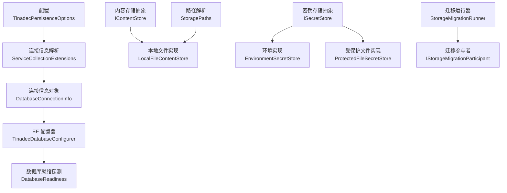
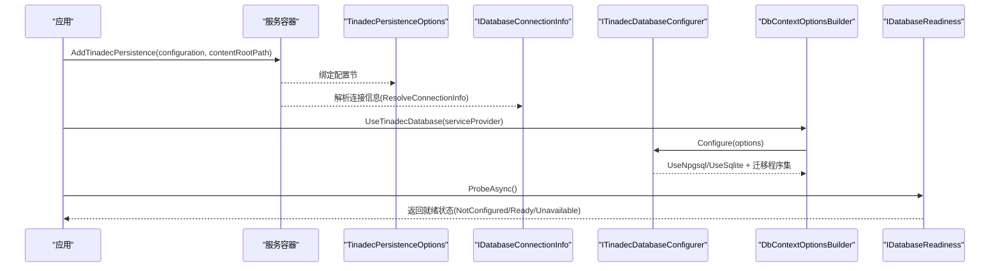
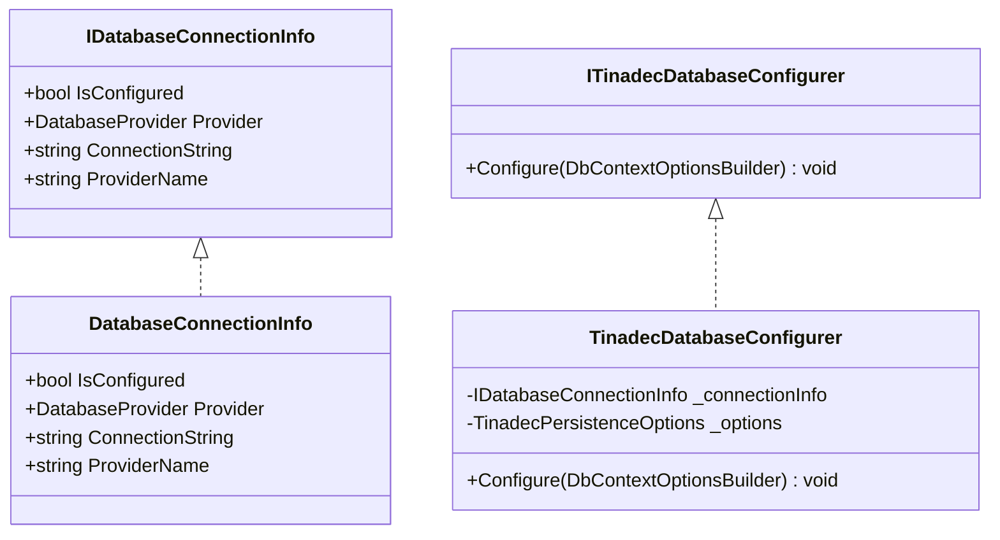
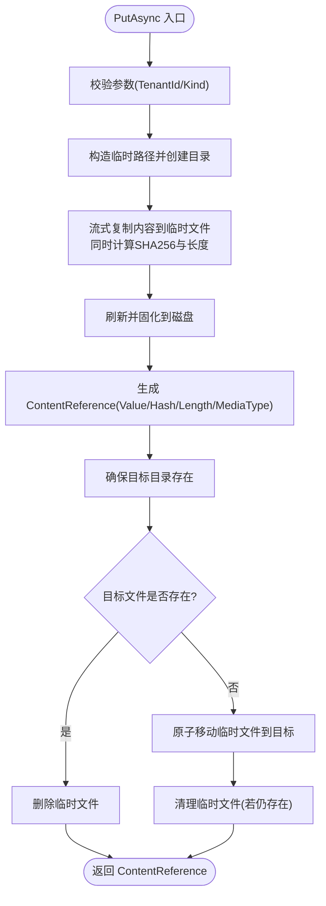
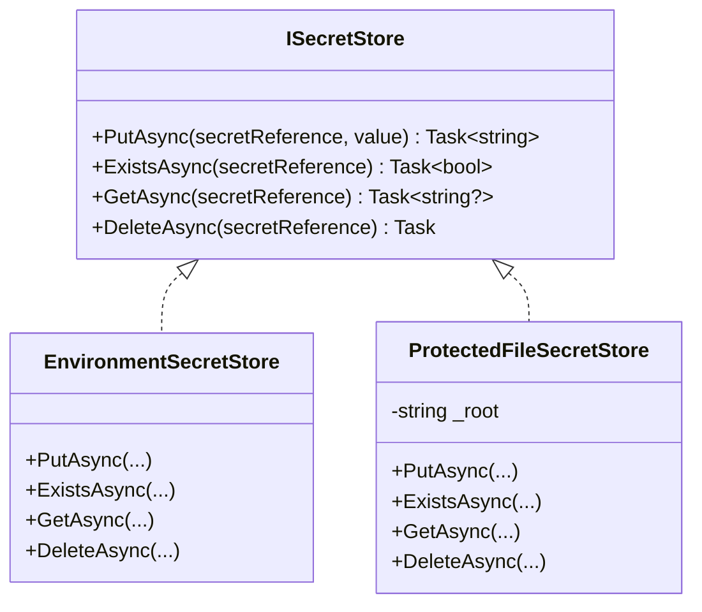
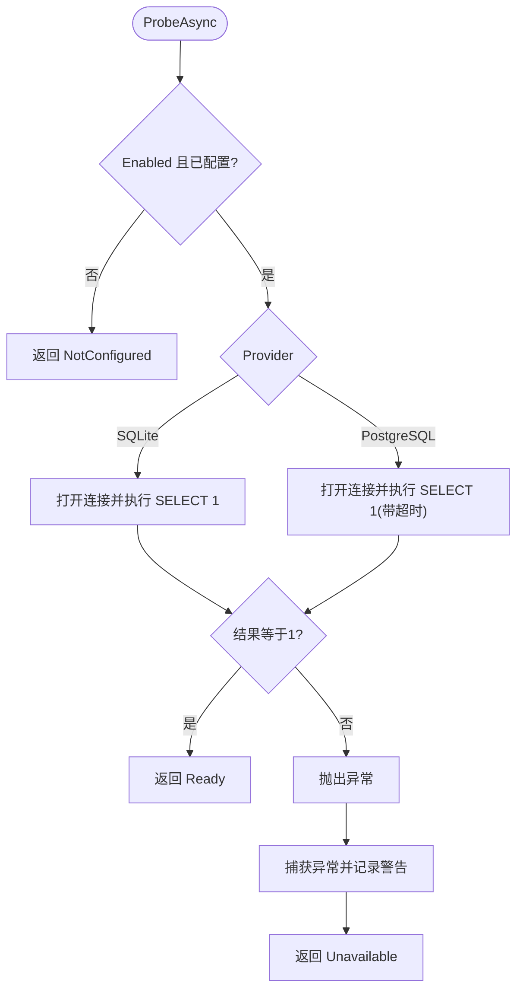
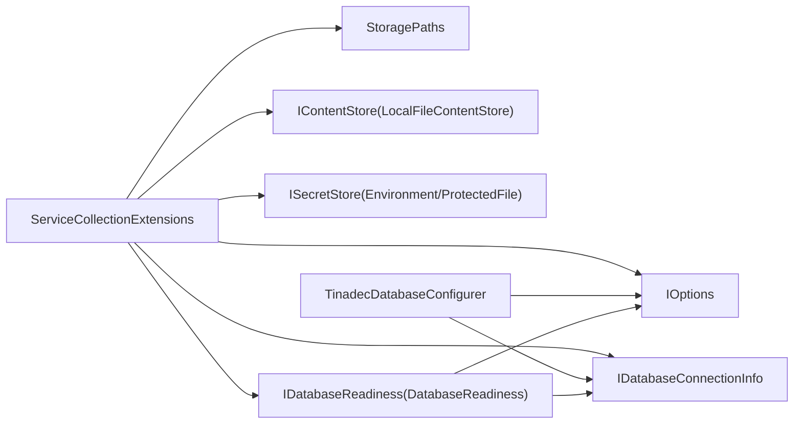

# 持久化层

<cite>
**本文引用的文件**   
- [IDatabaseConnectionInfo.cs](file://TinadecCore\Persistence\IDatabaseConnectionInfo.cs)
- [DatabaseConnectionInfo.cs](file://TinadecCore\Persistence\DatabaseConnectionInfo.cs)
- [IContentStore.cs](file://TinadecCore\Persistence\IContentStore.cs)
- [LocalFileContentStore.cs](file://TinadecCore\Persistence\LocalFileContentStore.cs)
- [ISecretStore.cs](file://TinadecCore\Persistence\ISecretStore.cs)
- [StoragePaths.cs](file://TinadecCore\Persistence\StoragePaths.cs)
- [TinadecPersistenceOptions.cs](file://TinadecCore\Persistence\TinadecPersistenceOptions.cs)
- [DatabaseProvider.cs](file://TinadecCore\Persistence\DatabaseProvider.cs)
- [ITinadecDatabaseConfigurer.cs](file://TinadecCore\Persistence\ITinadecDatabaseConfigurer.cs)
- [TinadecDatabaseConfigurer.cs](file://TinadecCore\Persistence\TinadecDatabaseConfigurer.cs)
- [ServiceCollectionExtensions.cs](file://TinadecCore\Persistence\ServiceCollectionExtensions.cs)
- [DatabaseReadiness.cs](file://TinadecCore\Persistence\DatabaseReadiness.cs)
- [IDatabaseReadiness.cs](file://TinadecCore\Persistence\IDatabaseReadiness.cs)
- [ModelBuilderExtensions.cs](file://TinadecCore\Persistence\ModelBuilderExtensions.cs)
- [StorageMigration.cs](file://TinadecCore\Persistence\StorageMigration.cs)
</cite>

## 目录
1. [简介](#简介)
2. [项目结构](#项目结构)
3. [核心组件](#核心组件)
4. [架构总览](#架构总览)
5. [详细组件分析](#详细组件分析)
6. [依赖关系分析](#依赖关系分析)
7. [性能考虑](#性能考虑)
8. [故障排查指南](#故障排查指南)
9. [结论](#结论)
10. [附录](#附录)

## 简介
本文件系统性梳理 TinadecOffice 的持久化层设计与实现，重点覆盖：
- 数据库抽象层接口与实现（连接信息、配置器、就绪探测）
- 内容存储抽象与本地文件实现（大对象/二进制内容）
- 密钥管理抽象与平台适配（环境变量与受保护文件）
- 迁移框架与参与者机制
- 数据库选择策略（SQLite 与 PostgreSQL）
- 连接管理、连接池与故障恢复要点
- 事务、错误处理与日志记录实践
- 自定义存储实现指南与最佳实践

## 项目结构
持久化层位于 TinadecCore\Persistence 命名空间下，围绕“配置-连接-存储-迁移-就绪”的主线组织。关键文件包括：
- 配置与枚举：TinadecPersistenceOptions、DatabaseProvider
- 连接抽象与解析：IDatabaseConnectionInfo、DatabaseConnectionInfo、ServiceCollectionExtensions.Resolve*
- EF 配置器：ITinadecDatabaseConfigurer、TinadecDatabaseConfigurer
- 就绪探测：IDatabaseReadiness、DatabaseReadiness
- 内容存储：IContentStore、LocalFileContentStore、StoragePaths
- 密钥存储：ISecretStore、EnvironmentSecretStore、ProtectedFileSecretStore
- 迁移框架：IStorageMigrationParticipant、IStorageMigrationRunner、StorageMigrationRunner



图表来源
- [ServiceCollectionExtensions.cs:15-49](file://TinadecCore\Persistence\ServiceCollectionExtensions.cs#L15-L49)
- [TinadecDatabaseConfigurer.cs:19-46](file://TinadecCore\Persistence\TinadecDatabaseConfigurer.cs#L19-L46)
- [DatabaseReadiness.cs:24-73](file://TinadecCore\Persistence\DatabaseReadiness.cs#L24-L73)
- [LocalFileContentStore.cs:11-49](file://TinadecCore\Persistence\LocalFileContentStore.cs#L11-L49)
- [ISecretStore.cs:13-25](file://TinadecCore\Persistence\ISecretStore.cs#L13-L25)
- [ISecretStore.cs:27-64](file://TinadecCore\Persistence\ISecretStore.cs#L27-L64)
- [StoragePaths.cs:6-17](file://TinadecCore\Persistence\StoragePaths.cs#L6-L17)
- [StorageMigration.cs:14-40](file://TinadecCore\Persistence\StorageMigration.cs#L14-L40)

章节来源
- [TinadecPersistenceOptions.cs:1-48](file://TinadecCore\Persistence\TinadecPersistenceOptions.cs#L1-L48)
- [DatabaseProvider.cs:1-11](file://TinadecCore\Persistence\DatabaseProvider.cs#L1-L11)
- [ServiceCollectionExtensions.cs:15-122](file://TinadecCore\Persistence\ServiceCollectionExtensions.cs#L15-L122)

## 核心组件
- IDatabaseConnectionInfo：暴露是否已配置、提供者类型、连接字符串与提供者名称，用于统一对外描述连接能力。
- DatabaseConnectionInfo：具体实现，ProviderName 映射为 sqlite/postgresql 以便健康检查与报表。
- ITinadecDatabaseConfigurer：将当前 Provider 与连接串注入到 DbContextOptionsBuilder，屏蔽 SQLite/PostgreSQL 差异。
- TinadecDatabaseConfigurer：校验启用状态与连接配置，按 Provider 选择 UseNpgsql 或 UseSqlite，并指定迁移程序集。
- ServiceCollectionExtensions：注册选项、连接信息、配置器、就绪探测、存储路径、内容存储、向量库、密钥存储与迁移运行器；提供 ResolveConnectionInfo 以根据配置生成连接信息。
- DatabaseReadiness：非抛错的健康探测，分别对 SQLite 与 PostgreSQL 执行 SELECT 1 并返回状态。
- IContentStore + LocalFileContentStore：面向大内容的不可变存储，写入时计算 SHA256，原子落盘后返回引用；读取/存在性/删除基于 StoragePaths。
- ISecretStore + 两种实现：EnvironmentSecretStore（只读，从环境变量获取）、ProtectedFileSecretStore（Windows 使用 DPAPI 保护，其他平台明文落盘）。
- StoragePaths：集中管理 Core 自有文件路径，包含安全校验（防止越权访问 data root 之外路径）。
- 迁移框架：IStorageMigrationParticipant 定义模块迁移契约，StorageMigrationRunner 在启动时按配置触发。

章节来源
- [IDatabaseConnectionInfo.cs:1-18](file://TinadecCore\Persistence\IDatabaseConnectionInfo.cs#L1-L18)
- [DatabaseConnectionInfo.cs:1-23](file://TinadecCore\Persistence\DatabaseConnectionInfo.cs#L1-L23)
- [ITinadecDatabaseConfigurer.cs:1-17](file://TinadecCore\Persistence\ITinadecDatabaseConfigurer.cs#L1-L17)
- [TinadecDatabaseConfigurer.cs:1-48](file://TinadecCore\Persistence\TinadecDatabaseConfigurer.cs#L1-L48)
- [ServiceCollectionExtensions.cs:15-122](file://TinadecCore\Persistence\ServiceCollectionExtensions.cs#L15-L122)
- [DatabaseReadiness.cs:1-123](file://TinadecCore\Persistence\DatabaseReadiness.cs#L1-L123)
- [IContentStore.cs:1-20](file://TinadecCore\Persistence\IContentStore.cs#L1-L20)
- [LocalFileContentStore.cs:1-68](file://TinadecCore\Persistence\LocalFileContentStore.cs#L1-L68)
- [ISecretStore.cs:1-65](file://TinadecCore\Persistence\ISecretStore.cs#L1-L65)
- [StoragePaths.cs:1-64](file://TinadecCore\Persistence\StoragePaths.cs#L1-L64)
- [StorageMigration.cs:1-41](file://TinadecCore\Persistence\StorageMigration.cs#L1-L41)

## 架构总览
下图展示配置、连接、EF 配置、就绪探测与存储之间的交互关系。



图表来源
- [ServiceCollectionExtensions.cs:15-49](file://TinadecCore\Persistence\ServiceCollectionExtensions.cs#L15-L49)
- [ServiceCollectionExtensions.cs:54-62](file://TinadecCore\Persistence\ServiceCollectionExtensions.cs#L54-L62)
- [TinadecDatabaseConfigurer.cs:19-46](file://TinadecCore\Persistence\TinadecDatabaseConfigurer.cs#L19-L46)
- [DatabaseReadiness.cs:24-73](file://TinadecCore\Persistence\DatabaseReadiness.cs#L24-L73)

## 详细组件分析

### 数据库连接信息与配置器
- IDatabaseConnectionInfo 提供 IsConfigured、Provider、ConnectionString、ProviderName。
- DatabaseConnectionInfo 实现 ProviderName 映射（sqlite/postgresql），IsConfigured 基于连接串是否为空。
- ITinadecDatabaseConfigurer 抽象 EF 配置行为；TinadecDatabaseConfigurer 负责：
  - 校验 Enabled 与连接串有效性
  - 按 Provider 选择 UseNpgsql/UseSqlite，并设置对应迁移程序集
- ServiceCollectionExtensions.ResolveConnectionInfo：
  - SQLite：拼接绝对路径并生成连接串
  - PostgreSQL：从 IConfiguration 的连接字符串名解析



图表来源
- [IDatabaseConnectionInfo.cs:1-18](file://TinadecCore\Persistence\IDatabaseConnectionInfo.cs#L1-L18)
- [DatabaseConnectionInfo.cs:1-23](file://TinadecCore\Persistence\DatabaseConnectionInfo.cs#L1-L23)
- [ITinadecDatabaseConfigurer.cs:1-17](file://TinadecCore\Persistence\ITinadecDatabaseConfigurer.cs#L1-L17)
- [TinadecDatabaseConfigurer.cs:1-48](file://TinadecCore\Persistence\TinadecDatabaseConfigurer.cs#L1-L48)

章节来源
- [IDatabaseConnectionInfo.cs:1-18](file://TinadecCore\Persistence\IDatabaseConnectionInfo.cs#L1-L18)
- [DatabaseConnectionInfo.cs:1-23](file://TinadecCore\Persistence\DatabaseConnectionInfo.cs#L1-L23)
- [ITinadecDatabaseConfigurer.cs:1-17](file://TinadecCore\Persistence\ITinadecDatabaseConfigurer.cs#L1-L17)
- [TinadecDatabaseConfigurer.cs:1-48](file://TinadecCore\Persistence\TinadecDatabaseConfigurer.cs#L1-L48)
- [ServiceCollectionExtensions.cs:64-120](file://TinadecCore\Persistence\ServiceCollectionExtensions.cs#L64-L120)

### 内容存储抽象与本地实现
- IContentStore 定义 PutAsync/OpenReadAsync/ExistsAsync/DeleteAsync，返回 ContentReference（含 Value、Sha256、Length、MediaType）。
- LocalFileContentStore 实现：
  - 写入：流式读取、增量 SHA256、临时文件写入、原子移动到目标路径、清理临时文件
  - 读取：异步 FileStream
  - 存在性与删除：基于 StoragePaths.ResolveContentReference
- StoragePaths：
  - 统一生成 content 目录下的租户/工作区/类型/哈希路径
  - 严格校验相对路径与安全前缀，防止路径穿越
  - 提供临时文件路径生成方法



图表来源
- [LocalFileContentStore.cs:11-49](file://TinadecCore\Persistence\LocalFileContentStore.cs#L11-L49)
- [StoragePaths.cs:28-41](file://TinadecCore\Persistence\StoragePaths.cs#L28-L41)

章节来源
- [IContentStore.cs:1-20](file://TinadecCore\Persistence\IContentStore.cs#L1-L20)
- [LocalFileContentStore.cs:1-68](file://TinadecCore\Persistence\LocalFileContentStore.cs#L1-L68)
- [StoragePaths.cs:1-64](file://TinadecCore\Persistence\StoragePaths.cs#L1-L64)

### 密钥管理抽象与实现
- ISecretStore 定义 Put/Exists/Get/Delete 四个基本操作。
- EnvironmentSecretStore：只读实现，从环境变量读取，Put/Delete 抛出异常或空操作。
- ProtectedFileSecretStore：
  - Windows：使用 DPAPI 对字节进行保护/解密
  - 其他平台：明文落盘（需结合系统权限控制）
  - 路径由 StoragePaths.Root/secrets 组成



图表来源
- [ISecretStore.cs:1-65](file://TinadecCore\Persistence\ISecretStore.cs#L1-L65)

章节来源
- [ISecretStore.cs:1-65](file://TinadecCore\Persistence\ISecretStore.cs#L1-L65)

### 迁移框架
- IStorageMigrationParticipant：业务模块实现的迁移契约（MigrateAsync）。
- IStorageMigrationRunner：统一运行迁移。
- StorageMigrationRunner：
  - 当 Enabled=false 或 Provider=PostgreSql 且 ApplyMigrationsOnStartup=false 时跳过
  - 遍历所有参与者依次执行 MigrateAsync

```mermaid
sequenceDiagram
participant Runner as "StorageMigrationRunner"
participant Options as "TinadecPersistenceOptions"
participant Participant as "IStorageMigrationParticipant[]"
Runner->>Options : 读取 Enabled/ApplyMigrationsOnStartup
alt 禁用或PostgreSQL未开启自动迁移
Runner-->>Runner : 直接返回
else 允许迁移
loop 遍历参与者
Runner->>Participant : MigrateAsync()
Participant-->>Runner : 完成
end
end
```

图表来源
- [StorageMigration.cs:14-40](file://TinadecCore\Persistence\StorageMigration.cs#L14-L40)

章节来源
- [StorageMigration.cs:1-41](file://TinadecCore\Persistence\StorageMigration.cs#L1-L41)

### 数据库就绪探测
- IDatabaseReadiness 定义非抛错的 ProbeAsync。
- DatabaseReadiness：
  - 未启用或未配置：返回 NotConfigured
  - SQLite：确保目录存在，打开连接执行 SELECT 1
  - PostgreSQL：打开连接执行 SELECT 1，支持 CommandTimeout
  - 捕获异常并记录警告，返回 Unavailable 与消息



图表来源
- [DatabaseReadiness.cs:24-73](file://TinadecCore\Persistence\DatabaseReadiness.cs#L24-L73)
- [DatabaseReadiness.cs:75-122](file://TinadecCore\Persistence\DatabaseReadiness.cs#L75-L122)

章节来源
- [IDatabaseReadiness.cs:1-10](file://TinadecCore\Persistence\IDatabaseReadiness.cs#L1-L10)
- [DatabaseReadiness.cs:1-123](file://TinadecCore\Persistence\DatabaseReadiness.cs#L1-L123)

### 模型约定扩展
- ModelBuilderExtensions.UseTinadecSnakeCase：将所有实体属性列名转换为 snake_case，便于跨数据库一致性。

章节来源
- [ModelBuilderExtensions.cs:1-31](file://TinadecCore\Persistence\ModelBuilderExtensions.cs#L1-L31)

## 依赖关系分析
- ServiceCollectionExtensions 作为装配中心，依赖：
  - IConfiguration（读取连接串）
  - IOptions<TinadecPersistenceOptions>（读取配置）
  - 各存储实现（LocalFileContentStore、EnvironmentSecretStore/ProtectedFileSecretStore）
  - StoragePaths（路径解析）
  - DatabaseReadiness（就绪探测）
- TinadecDatabaseConfigurer 依赖 IDatabaseConnectionInfo 与配置项，决定 EF 后端与迁移程序集。
- DatabaseReadiness 依赖 IDatabaseConnectionInfo、配置与 ILogger。



图表来源
- [ServiceCollectionExtensions.cs:15-49](file://TinadecCore\Persistence\ServiceCollectionExtensions.cs#L15-L49)
- [TinadecDatabaseConfigurer.cs:1-48](file://TinadecCore\Persistence\TinadecDatabaseConfigurer.cs#L1-L48)
- [DatabaseReadiness.cs:1-23](file://TinadecCore\Persistence\DatabaseReadiness.cs#L1-L23)

章节来源
- [ServiceCollectionExtensions.cs:15-122](file://TinadecCore\Persistence\ServiceCollectionExtensions.cs#L15-L122)
- [TinadecDatabaseConfigurer.cs:1-48](file://TinadecCore\Persistence\TinadecDatabaseConfigurer.cs#L1-L48)
- [DatabaseReadiness.cs:1-23](file://TinadecCore\Persistence\DatabaseReadiness.cs#L1-L23)

## 性能考虑
- 内容存储
  - 流式读写与增量哈希避免内存峰值
  - 写时使用 WriteThrough 与异步 IO，提升吞吐与可靠性
  - 原子移动减少并发竞争与损坏风险
- 数据库连接
  - SQLite：默认单进程文件锁，适合桌面场景；注意并发写入限制
  - PostgreSQL：多实例部署建议关闭启动时迁移（ApplyMigrationsOnStartup=false），由外部编排保证迁移顺序
- 就绪探测
  - 可配置超时（ProbeTimeoutSeconds），避免阻塞启动流程
- 日志与监控
  - 就绪探测失败会记录警告，建议接入外部监控系统采集状态码与耗时

[本节为通用指导，不直接分析具体文件]

## 故障排查指南
- 常见错误与定位
  - 未启用或连接未配置：就绪探测返回 NotConfigured，检查 TinadecPersistence:Enabled 与连接串
  - SQLite 路径问题：Ensure 目录存在，确认 DataRoot 与 DatabasePath 有效
  - PostgreSQL 连接失败：检查连接字符串与网络可达性，CommandTimeout 是否过短
  - 内容存储路径越界：StoragePaths 会抛出非法路径异常，检查 Kind 与引用格式
  - 密钥只读：EnvironmentSecretStore 不支持写入，需替换为可写实现
- 调试建议
  - 启用 ILogger 查看探针失败详情
  - 验证迁移参与者是否被正确发现与执行
  - 在 Windows 上确认 DPAPI 可用性与用户上下文

章节来源
- [DatabaseReadiness.cs:24-73](file://TinadecCore\Persistence\DatabaseReadiness.cs#L24-L73)
- [StoragePaths.cs:34-53](file://TinadecCore\Persistence\StoragePaths.cs#L34-L53)
- [ISecretStore.cs:13-25](file://TinadecCore\Persistence\ISecretStore.cs#L13-L25)

## 结论
该持久化层通过清晰的接口抽象与模块化装配，实现了：
- 统一的数据库连接与 EF 配置（SQLite/PostgreSQL）
- 面向大对象的不可变内容存储与安全的密钥管理
- 可扩展的迁移框架与健壮的就绪探测
- 良好的错误处理与日志记录
在实际使用中，建议：
- 生产环境优先 PostgreSQL，并采用外部迁移编排
- 针对高并发写入场景评估 SQLite 的限制
- 为密钥存储选择具备加密能力的平台实现
- 完善监控指标（连接成功率、探针耗时、存储 I/O 指标）

[本节为总结，不直接分析具体文件]

## 附录

### 数据库选择策略与配置
- 默认 Provider：SQLite（桌面端）
- PostgreSQL：通过 ConnectionStrings 中的名称解析
- 迁移策略：
  - SQLite：启动时自动迁移
  - PostgreSQL：默认不自动迁移，可通过 ApplyMigrationsOnStartup=true 显式启用

章节来源
- [TinadecPersistenceOptions.cs:1-48](file://TinadecCore\Persistence\TinadecPersistenceOptions.cs#L1-L48)
- [ServiceCollectionExtensions.cs:64-120](file://TinadecCore\Persistence\ServiceCollectionExtensions.cs#L64-L120)

### 事务管理与错误处理
- 事务边界由各业务 DbContext 自行管理（本抽象层不强制）
- 建议在业务层使用显式事务，配合重试策略应对瞬时故障
- 错误传播：
  - 配置阶段抛出 InvalidOperationException（未启用/未配置）
  - 就绪探测不抛错，返回状态与消息

章节来源
- [TinadecDatabaseConfigurer.cs:23-35](file://TinadecCore\Persistence\TinadecDatabaseConfigurer.cs#L23-L35)
- [DatabaseReadiness.cs:24-73](file://TinadecCore\Persistence\DatabaseReadiness.cs#L24-L73)

### 自定义存储实现指南
- 自定义 IContentStore
  - 保持不可变语义：PutAsync 返回稳定引用（Value/Hash/Length/MediaType）
  - 保证原子性与幂等性，避免重复写入与数据损坏
  - 遵循 StoragePaths 的安全约束（如需自建路径解析器）
- 自定义 ISecretStore
  - 仅暴露最小权限，避免明文落地
  - 提供 Exists/Get 的幂等与空值安全
- 自定义迁移参与者
  - 实现 IStorageMigrationParticipant.MigrateAsync
  - 确保幂等与回滚友好

章节来源
- [IContentStore.cs:1-20](file://TinadecCore\Persistence\IContentStore.cs#L1-L20)
- [ISecretStore.cs:1-65](file://TinadecCore\Persistence\ISecretStore.cs#L1-L65)
- [StorageMigration.cs:1-41](file://TinadecCore\Persistence\StorageMigration.cs#L1-L41)