# 数据库上下文

<cite>
**本文引用的文件**   
- [TinadecDatabaseConfigurer.cs](file://TinadecCore\Persistence\TinadecDatabaseConfigurer.cs)
- [ServiceCollectionExtensions.cs](file://TinadecCore\Persistence\ServiceCollectionExtensions.cs)
- [TinadecPersistenceOptions.cs](file://TinadecCore\Persistence\TinadecPersistenceOptions.cs)
- [AgentControlDbContext.cs](file://TinadecCore\DmaEA\AgentControlDbContext.cs)
- [LifecycleDbContext.cs](file://TinadecCore\Lifecycle\LifecycleDbContext.cs)
- [MemoryDbContext.cs](file://TinadecCore\Memory\MemoryDbContext.cs)
- [ModelControlDbContext.cs](file://TinadecCore\Models\ModelControlDbContext.cs)
- [PromptControlDbContext.cs](file://TinadecCore\Prompts\PromptControlDbContext.cs)
- [IntegrationDbContext.cs](file://TinadecCore\Skills\IntegrationDbContext.cs)
- [TenancyDbContext.cs](file://TinadecCore\Tenancy\TenancyDbContext.cs)
- [DmaEAModuleRegistrar.cs](file://TinadecCore\DmaEA\DmaEAModuleRegistrar.cs)
- [LifecycleModuleRegistrar.cs](file://TinadecCore\Lifecycle\LifecycleModuleRegistrar.cs)
- [MemoryModuleRegistrar.cs](file://TinadecCore\Memory\MemoryModuleRegistrar.cs)
- [ModelsModuleRegistrar.cs](file://TinadecCore\Models\ModelsModuleRegistrar.cs)
- [PromptsModuleRegistrar.cs](file://TinadecCore\Prompts\PromptsModuleRegistrar.cs)
- [SkillsModuleRegistrar.cs](file://TinadecCore\Skills\SkillsModuleRegistrar.cs)
- [TenancyModuleRegistrar.cs](file://TinadecCore\Tenancy\TenancyModuleRegistrar.cs)
</cite>

## 目录
1. [简介](#简介)
2. [项目结构](#项目结构)
3. [核心组件](#核心组件)
4. [架构总览](#架构总览)
5. [详细组件分析](#详细组件分析)
6. [依赖关系分析](#依赖关系分析)
7. [性能考虑](#性能考虑)
8. [故障排查指南](#故障排查指南)
9. [结论](#结论)
10. [附录](#附录)

## 简介
本文件面向 TinadecOffice 的数据库上下文体系，系统性梳理各 DbContext 的职责、实体模型与映射策略，说明 EF Core 配置、连接字符串解析、迁移策略以及多模块（生命周期、内存、模型、提示词、技能、租户等）的数据库上下文设计。文档同时涵盖连接池与性能优化建议、事务管理实践、数据初始化与监控思路，并提供实体关系图与关键数据流说明，帮助读者快速理解并正确使用该持久化层。

## 项目结构
- 模块化组织：每个业务域以独立 DbContext 和 ModuleRegistrar 形式存在，通过统一的持久化扩展方法接入 EF Core。
- 共享持久化能力：通过 ServiceCollectionExtensions 提供 AddTinadecPersistence、UseTinadecDatabase 等扩展，集中处理选项绑定、连接信息解析、数据库提供者选择与迁移装配。
- 统一命名规范：使用 UseTinadecSnakeCase() 将实体属性映射为 snake_case 列名，保持跨库一致性。

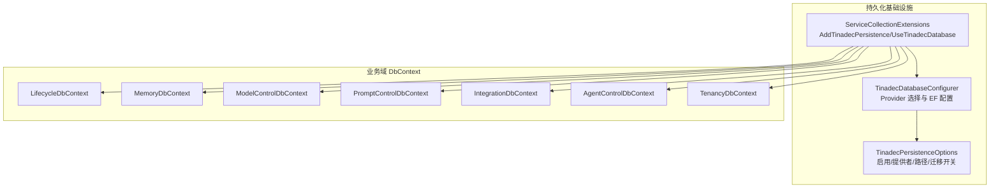

**图示来源** 
- [ServiceCollectionExtensions.cs:15-62](file://TinadecCore\Persistence\ServiceCollectionExtensions.cs#L15-L62)
- [TinadecDatabaseConfigurer.cs:19-46](file://TinadecCore\Persistence\TinadecDatabaseConfigurer.cs#L19-L46)
- [TinadecPersistenceOptions.cs:7-32](file://TinadecCore\Persistence\TinadecPersistenceOptions.cs#L7-L32)

**章节来源**
- [ServiceCollectionExtensions.cs:15-62](file://TinadecCore\Persistence\ServiceCollectionExtensions.cs#L15-L62)
- [TinadecDatabaseConfigurer.cs:19-46](file://TinadecCore\Persistence\TinadecDatabaseConfigurer.cs#L19-L46)
- [TinadecPersistenceOptions.cs:7-32](file://TinadecCore\Persistence\TinadecPersistenceOptions.cs#L7-L32)

## 核心组件
- 持久化选项与连接解析
  - TinadecPersistenceOptions：控制是否启用持久化、默认提供者（SQLite）、SQLite 文件路径、PostgreSQL 连接串名称、是否启动时应用迁移、探测超时等。
  - ServiceCollectionExtensions.ResolveConnectionInfo：根据 Provider 与配置解析实际连接字符串；SQLite 支持相对路径解析；PostgreSQL 从 IConfiguration 读取 named connection string。
  - ITinadecDatabaseConfigurer.Configure：按 Provider 选择 UseNpgsql 或 UseSqlite，并设置 MigrationsAssembly。
- DbContext 工厂注册
  - 各模块 Registrar 统一通过 AddDbContextFactory<T>() + UseTinadecDatabase(sp) 注册 DbContext，确保所有上下文共享同一连接信息与迁移装配。
- 迁移参与者
  - 多数模块通过 IStorageMigrationParticipant 暴露迁移参与点，由统一迁移运行器协调执行。

**章节来源**
- [TinadecPersistenceOptions.cs:7-32](file://TinadecCore\Persistence\TinadecPersistenceOptions.cs#L7-L32)
- [ServiceCollectionExtensions.cs:64-121](file://TinadecCore\Persistence\ServiceCollectionExtensions.cs#L64-L121)
- [TinadecDatabaseConfigurer.cs:19-46](file://TinadecCore\Persistence\TinadecDatabaseConfigurer.cs#L19-L46)
- [DmaEAModuleRegistrar.cs:16-20](file://TinadecCore\DmaEA\DmaEAModuleRegistrar.cs#L16-L20)
- [LifecycleModuleRegistrar.cs:17-23](file://TinadecCore\Lifecycle\LifecycleModuleRegistrar.cs#L17-L23)
- [MemoryModuleRegistrar.cs:15-21](file://TinadecCore\Memory\MemoryModuleRegistrar.cs#L15-L21)
- [ModelsModuleRegistrar.cs:20-24](file://TinadecCore\Models\ModelsModuleRegistrar.cs#L20-L24)
- [PromptsModuleRegistrar.cs:16-20](file://TinadecCore\Prompts\PromptsModuleRegistrar.cs#L16-L20)
- [SkillsModuleRegistrar.cs:16-20](file://TinadecCore\Skills\SkillsModuleRegistrar.cs#L16-L20)
- [TenancyModuleRegistrar.cs:16-26](file://TinadecCore\Tenancy\TenancyModuleRegistrar.cs#L16-L26)

## 架构总览
下图展示“模块注册 → 持久化扩展 → 数据库提供者配置”的整体流程，以及各 DbContext 如何接入统一配置。

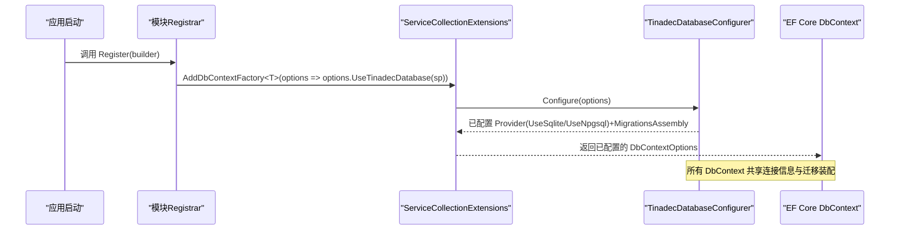

**图示来源** 
- [DmaEAModuleRegistrar.cs:16-20](file://TinadecCore\DmaEA\DmaEAModuleRegistrar.cs#L16-L20)
- [LifecycleModuleRegistrar.cs:17-23](file://TinadecCore\Lifecycle\LifecycleModuleRegistrar.cs#L17-L23)
- [MemoryModuleRegistrar.cs:15-21](file://TinadecCore\Memory\MemoryModuleRegistrar.cs#L15-L21)
- [ModelsModuleRegistrar.cs:20-24](file://TinadecCore\Models\ModelsModuleRegistrar.cs#L20-L24)
- [PromptsModuleRegistrar.cs:16-20](file://TinadecCore\Prompts\PromptsModuleRegistrar.cs#L16-L20)
- [SkillsModuleRegistrar.cs:16-20](file://TinadecCore\Skills\SkillsModuleRegistrar.cs#L16-L20)
- [TenancyModuleRegistrar.cs:16-26](file://TinadecCore\Tenancy\TenancyModuleRegistrar.cs#L16-L26)
- [ServiceCollectionExtensions.cs:54-62](file://TinadecCore\Persistence\ServiceCollectionExtensions.cs#L54-L62)
- [TinadecDatabaseConfigurer.cs:19-46](file://TinadecCore\Persistence\TinadecDatabaseConfigurer.cs#L19-L46)

## 详细组件分析

### 生命周期上下文（LifecycleDbContext）
- 职责：管理运行（Run）、事件索引（EventIndex）、策略集/版本（PolicySet/Version）、审批请求/决策（ApprovalRequest/Decision）、运行配置绑定（RunConfigurationBinding）、制品索引（ArtifactIndex）、控制事件索引（ControlEventIndex）。
- 模型要点：大量字段采用显式列名映射（如 tenant_id、workspace_id、session_id），具备丰富的复合索引用于查询加速；软删除与审计字段常见（CreatedAt/UpdatedAt/DeletedAt）。
- 迁移参与：通过 StorageLifecycleService 作为 IStorageMigrationParticipant 参与迁移。

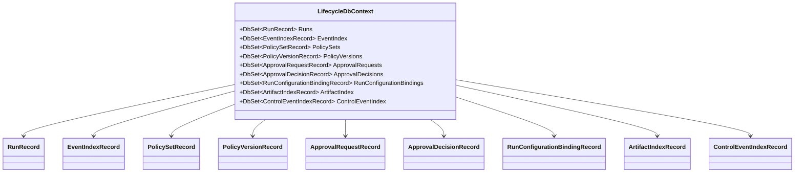

**图示来源** 
- [LifecycleDbContext.cs:5-86](file://TinadecCore\Lifecycle\LifecycleDbContext.cs#L5-L86)

**章节来源**
- [LifecycleDbContext.cs:5-86](file://TinadecCore\Lifecycle\LifecycleDbContext.cs#L5-L86)
- [LifecycleModuleRegistrar.cs:17-23](file://TinadecCore\Lifecycle\LifecycleModuleRegistrar.cs#L17-L23)

### 记忆上下文（MemoryDbContext）
- 职责：持久化项目（Projects）与会话（Sessions），支撑会话序列化、历史回溯、保留策略与溯源。
- 模型要点：Project 唯一约束基于 TenantId+WorkspaceId+NormalizedRootPath；Session 包含标题、状态、模式、摘要、历史版本计数与归档标记。

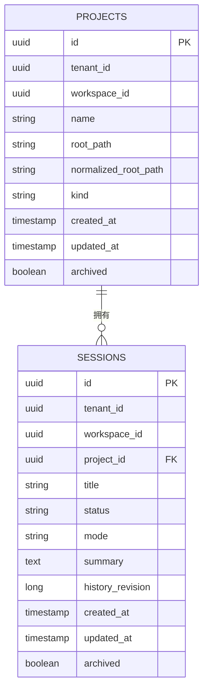

**图示来源** 
- [MemoryDbContext.cs:13-60](file://TinadecCore\Memory\MemoryDbContext.cs#L13-L60)

**章节来源**
- [MemoryDbContext.cs:13-60](file://TinadecCore\Memory\MemoryDbContext.cs#L13-L60)
- [MemoryModuleRegistrar.cs:15-21](file://TinadecCore\Memory\MemoryModuleRegistrar.cs#L15-L21)

### 模型控制上下文（ModelControlDbContext）
- 职责：管理模型提供方实例（ModelProviderInstances）、提供方版本（ProviderVersions）、路由（ModelRoutes）与路由版本（RouteVersions）。
- 模型要点：提供方与路由均支持 Scope、Revision、CurrentVersionId、审计字段；版本表通过唯一索引保证版本幂等。

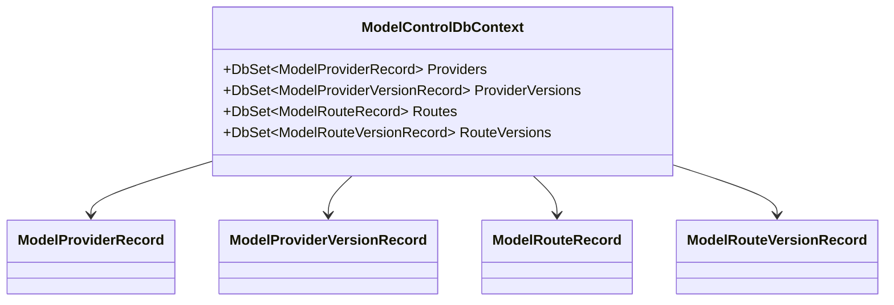

**图示来源** 
- [ModelControlDbContext.cs:5-39](file://TinadecCore\Models\ModelControlDbContext.cs#L5-L39)

**章节来源**
- [ModelControlDbContext.cs:5-39](file://TinadecCore\Models\ModelControlDbContext.cs#L5-L39)
- [ModelsModuleRegistrar.cs:20-24](file://TinadecCore\Models\ModelsModuleRegistrar.cs#L20-L24)

### 提示词上下文（PromptControlDbContext）
- 职责：管理提示片段（PromptFragments）、片段版本（PromptFragmentVersions）与信号（PromptFragmentSignals）。
- 模型要点：片段键 Key 在租户/工作区/项目维度唯一；版本表维护内容引用与哈希，便于不可变存储与校验。

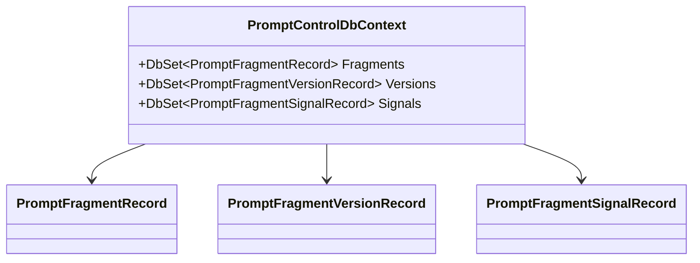

**图示来源** 
- [PromptControlDbContext.cs:5-33](file://TinadecCore\Prompts\PromptControlDbContext.cs#L5-L33)

**章节来源**
- [PromptControlDbContext.cs:5-33](file://TinadecCore\Prompts\PromptControlDbContext.cs#L5-L33)
- [PromptsModuleRegistrar.cs:16-20](file://TinadecCore\Prompts\PromptsModuleRegistrar.cs#L16-L20)

### 技能集成上下文（IntegrationDbContext）
- 职责：管理扩展源（ExtensionSources）、扩展目录条目（ExtensionCatalogEntries）、工作区扩展（WorkspaceExtensions）及其版本、集成实例（IntegrationInstances）及其版本。
- 模型要点：多处唯一索引保障扩展与版本幂等；支持软删除与审计字段。

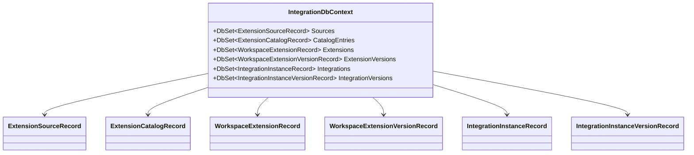

**图示来源** 
- [IntegrationDbContext.cs:5-24](file://TinadecCore\Skills\IntegrationDbContext.cs#L5-L24)

**章节来源**
- [IntegrationDbContext.cs:5-24](file://TinadecCore\Skills\IntegrationDbContext.cs#L5-L24)
- [SkillsModuleRegistrar.cs:16-20](file://TinadecCore\Skills\SkillsModuleRegistrar.cs#L16-L20)

### 代理控制上下文（AgentControlDbContext）
- 职责：管理代理档案（AgentProfiles）与其版本（AgentProfileVersions），支撑双层级编排所需的元数据与版本化配置。
- 模型要点：版本表对 AgentId+Version 唯一；主表含 Scope、Layer、AgentType、Enabled、IsBuiltIn、Revision、CurrentVersionId 等。

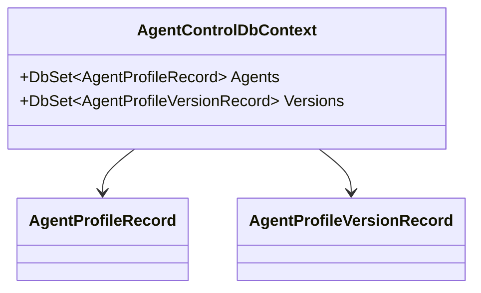

**图示来源** 
- [AgentControlDbContext.cs:5-23](file://TinadecCore\DmaEA\AgentControlDbContext.cs#L5-L23)

**章节来源**
- [AgentControlDbContext.cs:5-23](file://TinadecCore\DmaEA\AgentControlDbContext.cs#L5-L23)
- [DmaEAModuleRegistrar.cs:16-20](file://TinadecCore\DmaEA\DmaEAModuleRegistrar.cs#L16-L20)

### 租户上下文（TenancyDbContext）
- 职责：管理租户（Tenants）、主体（Principals）、租户成员关系（TenantMemberships）、工作区（Workspaces）与工作区成员关系（WorkspaceMemberships）。
- 模型要点：Slug 唯一、主体 Issuer+Subject 唯一、工作区 Slug 在租户内唯一；成员关系采用复合主键。

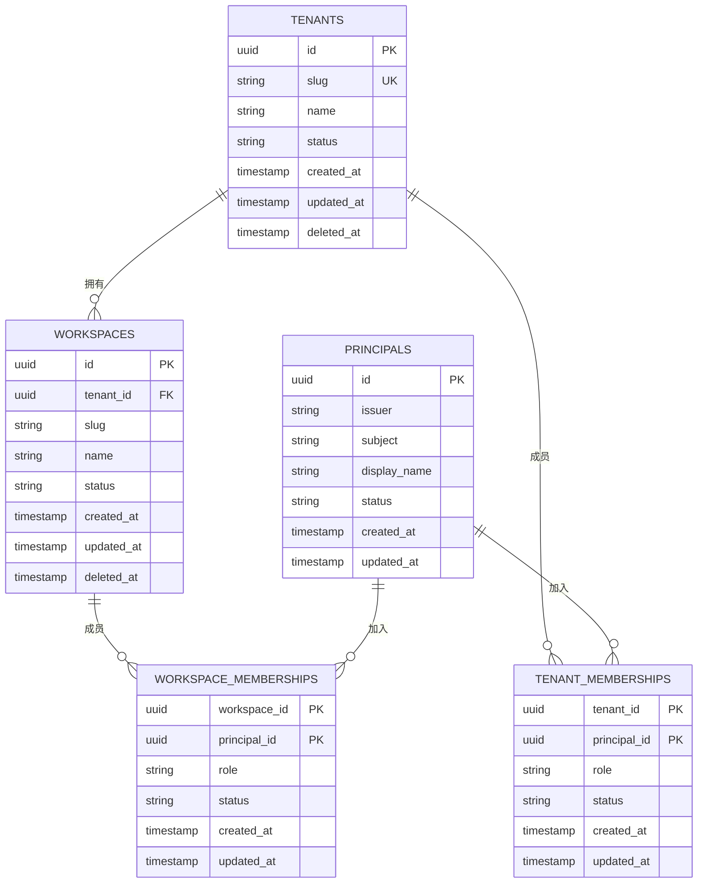

**图示来源** 
- [TenancyDbContext.cs:15-51](file://TinadecCore\Tenancy\TenancyDbContext.cs#L15-L51)

**章节来源**
- [TenancyDbContext.cs:15-51](file://TinadecCore\Tenancy\TenancyDbContext.cs#L15-L51)
- [TenancyModuleRegistrar.cs:16-26](file://TinadecCore\Tenancy\TenancyModuleRegistrar.cs#L16-L26)

## 依赖关系分析
- 模块到持久化的依赖：所有模块 Registrar 都依赖 Persistence 提供的 UseTinadecDatabase 扩展，从而获得一致的 Provider 选择与迁移装配。
- 迁移参与者：多个模块通过 IStorageMigrationParticipant 暴露迁移参与点，便于统一迁移运行。
- 运行时依赖：部分服务（如 EmbeddingProvider）通过 IDbContextFactory<ModelControlDbContext> 按需获取上下文，避免长生命周期持有连接。

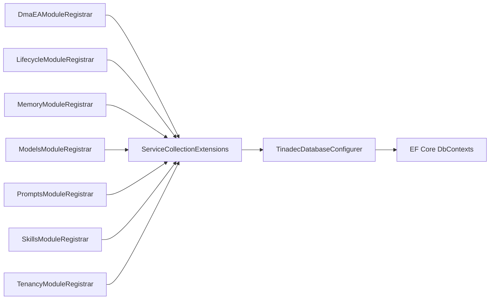

**图示来源** 
- [DmaEAModuleRegistrar.cs:16-20](file://TinadecCore\DmaEA\DmaEAModuleRegistrar.cs#L16-L20)
- [LifecycleModuleRegistrar.cs:17-23](file://TinadecCore\Lifecycle\LifecycleModuleRegistrar.cs#L17-L23)
- [MemoryModuleRegistrar.cs:15-21](file://TinadecCore\Memory\MemoryModuleRegistrar.cs#L15-L21)
- [ModelsModuleRegistrar.cs:20-24](file://TinadecCore\Models\ModelsModuleRegistrar.cs#L20-L24)
- [PromptsModuleRegistrar.cs:16-20](file://TinadecCore\Prompts\PromptsModuleRegistrar.cs#L16-L20)
- [SkillsModuleRegistrar.cs:16-20](file://TinadecCore\Skills\SkillsModuleRegistrar.cs#L16-L20)
- [TenancyModuleRegistrar.cs:16-26](file://TinadecCore\Tenancy\TenancyModuleRegistrar.cs#L16-L26)
- [ServiceCollectionExtensions.cs:54-62](file://TinadecCore\Persistence\ServiceCollectionExtensions.cs#L54-L62)
- [TinadecDatabaseConfigurer.cs:19-46](file://TinadecCore\Persistence\TinadecDatabaseConfigurer.cs#L19-L46)

**章节来源**
- [ServiceCollectionExtensions.cs:54-62](file://TinadecCore\Persistence\ServiceCollectionExtensions.cs#L54-L62)
- [TinadecDatabaseConfigurer.cs:19-46](file://TinadecCore\Persistence\TinadecDatabaseConfigurer.cs#L19-L46)

## 性能考虑
- 连接池与并发
  - SQLite：单进程文件锁限制写并发，适合本地开发或小规模部署；可通过 WAL 模式提升读并发（需在连接字符串中开启，当前代码未硬编码）。
  - PostgreSQL：原生连接池，适合高并发与多实例部署；建议结合健康检查与探针超时（ProbeTimeoutSeconds）进行就绪判断。
- 查询优化
  - 充分利用已有复合索引（如 runs、event_index、projects、sessions、tenants/workspaces 的唯一索引等），避免全表扫描。
  - 使用 AsNoTracking() 进行只读查询以减少变更跟踪开销（参考 ModelsModuleRegistrar 中的示例用法）。
- 迁移策略
  - SQLite：默认启动时应用迁移（ApplyMigrationsOnStartup=true），适合单机场景。
  - PostgreSQL：需显式启用迁移以避免多实例竞争；生产环境建议使用外部迁移工具或 CI/CD 管道。
- 事务管理
  - 短生命周期 DbContext（通过 DbContextFactory）配合显式事务（SaveChangesAsync 包裹于 TransactionScope 或数据库事务）可提升一致性与吞吐。
- 资源释放
  - 使用 using await foreach / await using 确保 DbContext 及时释放；避免在单例中持有 DbContext。

[本节为通用指导，不直接分析具体文件]

## 故障排查指南
- 持久化未启用
  - 现象：抛出“TinadecPersistence is disabled”异常。
  - 排查：确认 TinadecPersistence:Enabled 设置为 true。
- 连接字符串缺失
  - SQLite：未设置 TinadecPersistence:Sqlite:DatabasePath 或路径无效。
  - PostgreSQL：未设置 ConnectionStrings:TinadecCore（或自定义名称）。
- 迁移失败
  - 检查 MigrationsAssembly 是否正确装配；PostgreSQL 多实例下避免启动时自动迁移冲突。
- 查询警告
  - TenancyDbContext 中忽略部分诊断警告（如 CommandError），若出现异常需检查 SQL 与索引覆盖。

**章节来源**
- [TinadecDatabaseConfigurer.cs:23-35](file://TinadecCore\Persistence\TinadecDatabaseConfigurer.cs#L23-L35)
- [ServiceCollectionExtensions.cs:69-79](file://TinadecCore\Persistence\ServiceCollectionExtensions.cs#L69-L79)
- [TenancyModuleRegistrar.cs:17-23](file://TinadecCore\Tenancy\TenancyModuleRegistrar.cs#L17-L23)

## 结论
TinadecOffice 的数据库上下文体系以“统一持久化扩展 + 模块化 DbContext”为核心，实现了跨业务域的 EF Core 配置、连接管理与迁移装配的一致性。通过明确的实体映射、索引设计与版本化模型，系统具备良好的可扩展性与可维护性。在生产环境中，建议优先采用 PostgreSQL，配合外部迁移与连接池调优，以获得更高的可用性与性能。

[本节为总结性内容，不直接分析具体文件]

## 附录

### 实体关系图（跨域概览）
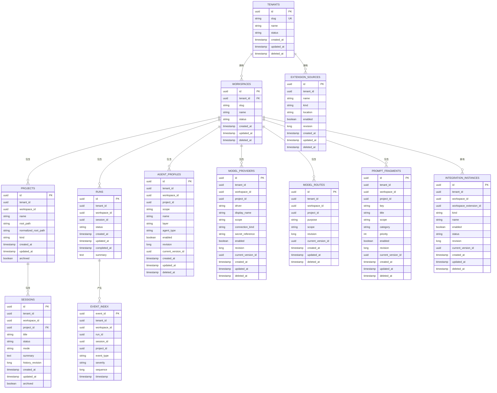

**图示来源** 
- [TenancyDbContext.cs:15-51](file://TinadecCore\Tenancy\TenancyDbContext.cs#L15-L51)
- [MemoryDbContext.cs:13-60](file://TinadecCore\Memory\MemoryDbContext.cs#L13-L60)
- [LifecycleDbContext.cs:21-86](file://TinadecCore\Lifecycle\LifecycleDbContext.cs#L21-L86)
- [AgentControlDbContext.cs:10-23](file://TinadecCore\DmaEA\AgentControlDbContext.cs#L10-L23)
- [ModelControlDbContext.cs:13-39](file://TinadecCore\Models\ModelControlDbContext.cs#L13-L39)
- [PromptControlDbContext.cs:12-33](file://TinadecCore\Prompts\PromptControlDbContext.cs#L12-L33)
- [IntegrationDbContext.cs:15-24](file://TinadecCore\Skills\IntegrationDbContext.cs#L15-L24)