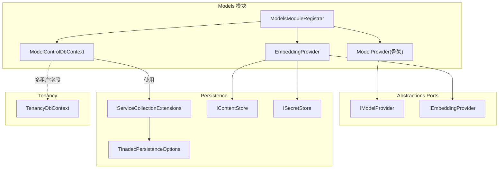
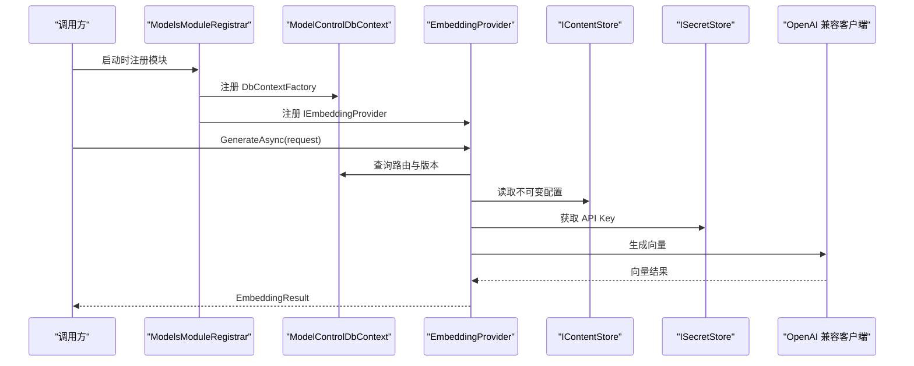
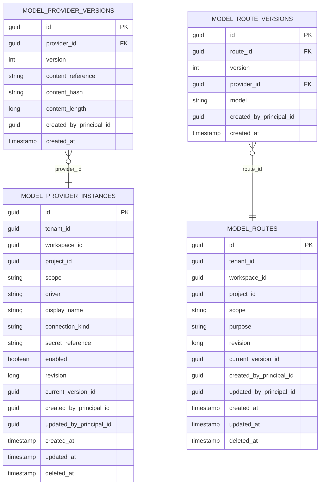
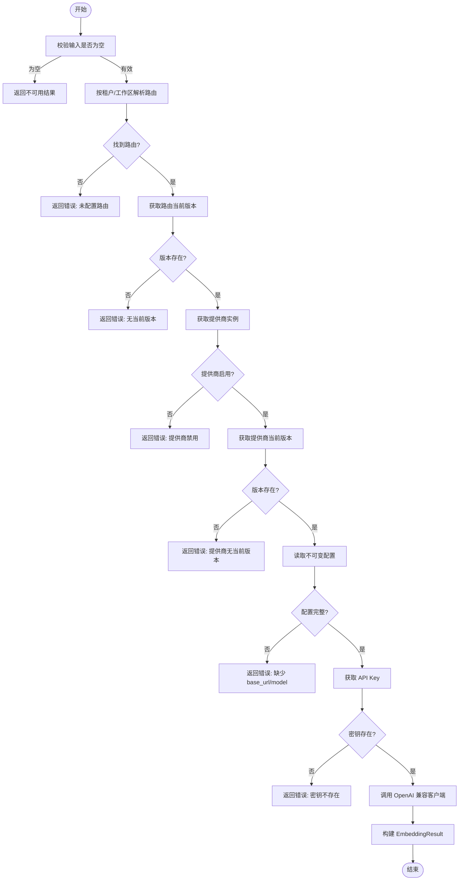
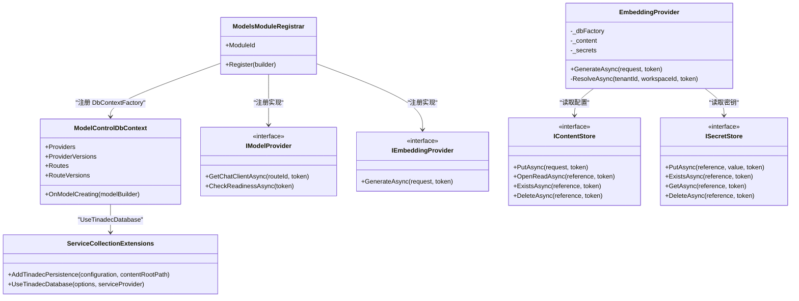

# 模型控制上下文

<cite>
**本文引用的文件**   
- [ModelControlDbContext.cs](file://TinadecCore/Models/ModelControlDbContext.cs)
- [ModelsModuleRegistrar.cs](file://TinadecCore/Models/ModelsModuleRegistrar.cs)
- [IModelProvider.cs](file://TinadecCore/Abstractions/Ports/IModelProvider.cs)
- [ServiceCollectionExtensions.cs](file://TinadecCore/Persistence/ServiceCollectionExtensions.cs)
- [TinadecPersistenceOptions.cs](file://TinadecCore/Persistence/TinadecPersistenceOptions.cs)
- [IContentStore.cs](file://TinadecCore/Persistence/IContentStore.cs)
- [ISecretStore.cs](file://TinadecCore/Persistence/ISecretStore.cs)
- [TenancyDbContext.cs](file://TinadecCore/Tenancy/TenancyDbContext.cs)
</cite>

## 目录
1. [简介](#简介)
2. [项目结构](#项目结构)
3. [核心组件](#核心组件)
4. [架构总览](#架构总览)
5. [详细组件分析](#详细组件分析)
6. [依赖关系分析](#依赖关系分析)
7. [性能考量](#性能考量)
8. [故障排查指南](#故障排查指南)
9. [结论](#结论)
10. [附录](#附录)

## 简介
本文件围绕 TinadecOffice 中的“模型控制数据库上下文”展开，重点解释 ModelControlDbContext 的设计与 AI 模型管理能力。内容涵盖：
- 模型配置存储、提供商注册与路由规则的数据模型
- 模型版本管理、负载均衡与健康检查机制（当前骨架实现）
- 模型调用统计、性能监控与故障转移策略（设计建议与扩展点）
- 模型配置示例与集成指南
- 多租户隔离、权限控制与审计日志（基于现有数据模型与约定）

该模块通过 EF Core DbContext 管理模型提供商实例、提供商版本、路由及路由版本等元数据；通过 IModelProvider 与 IEmbeddingProvider 暴露统一能力；借助持久化基础设施（连接信息、内容存储、密钥存储）完成安全、可移植的运行时装配。

## 项目结构
模型控制相关代码位于 TinadecCore/Models 与 TinadecCore/Persistence、Abstractions/Ports 等子项目中，采用模块化注册方式将 DbContext、迁移参与者与 Provider 注入到服务容器。

图表来源
- [ModelsModuleRegistrar.cs:16-36](file://TinadecCore/Models/ModelsModuleRegistrar.cs#L16-L36)
- [ModelControlDbContext.cs:5-40](file://TinadecCore/Models/ModelControlDbContext.cs#L5-L40)
- [IModelProvider.cs:10-18](file://TinadecCore/Abstractions/Ports/IModelProvider.cs#L10-L18)
- [ServiceCollectionExtensions.cs:15-49](file://TinadecCore/Persistence/ServiceCollectionExtensions.cs#L15-L49)
- [TinadecPersistenceOptions.cs:7-32](file://TinadecCore/Persistence/TinadecPersistenceOptions.cs#L7-L32)
- [IContentStore.cs:4-10](file://TinadecCore/Persistence/IContentStore.cs#L4-L10)
- [ISecretStore.cs:4-10](file://TinadecCore/Persistence/ISecretStore.cs#L4-L10)
- [TenancyDbContext.cs:5-14](file://TinadecCore/Tenancy/TenancyDbContext.cs#L5-L14)

章节来源
- [ModelsModuleRegistrar.cs:16-36](file://TinadecCore/Models/ModelsModuleRegistrar.cs#L16-L36)
- [ModelControlDbContext.cs:5-40](file://TinadecCore/Models/ModelControlDbContext.cs#L5-L40)

## 核心组件
- ModelControlDbContext：定义模型控制域的实体集合与表映射，包含提供商实例、提供商版本、路由与路由版本四张表，并启用蛇形命名规范。
- ModelsModuleRegistrar：模块注册器，负责注册 DbContextFactory、迁移参与者、IModelProvider 与 IEmbeddingProvider，声明模块能力。
- IModelProvider / IEmbeddingProvider：抽象接口，分别用于获取聊天客户端与生成嵌入向量，屏蔽底层提供商细节。
- EmbeddingProvider：按租户与工作区解析 embedding 路由，读取不可变配置与密钥，构造 OpenAI 兼容客户端并返回结构化结果。
- ServiceCollectionExtensions / TinadecPersistenceOptions：统一的数据库选项与连接信息解析，支持 SQLite/PostgreSQL，提供探针超时等健康检查参数。
- IContentStore / ISecretStore：不可变大内容与密钥边界，确保敏感信息不落地于关系型表中。
- TenancyDbContext：多租户与权限基础模型，为模型控制域提供租户/工作区/成员关系的上下文支撑。

章节来源
- [ModelControlDbContext.cs:5-40](file://TinadecCore/Models/ModelControlDbContext.cs#L5-L40)
- [ModelsModuleRegistrar.cs:16-36](file://TinadecCore/Models/ModelsModuleRegistrar.cs#L16-L36)
- [IModelProvider.cs:10-18](file://TinadecCore/Abstractions/Ports/IModelProvider.cs#L10-L18)
- [ModelsModuleRegistrar.cs:70-168](file://TinadecCore/Models/ModelsModuleRegistrar.cs#L70-L168)
- [ServiceCollectionExtensions.cs:15-49](file://TinadecCore/Persistence/ServiceCollectionExtensions.cs#L15-L49)
- [TinadecPersistenceOptions.cs:7-32](file://TinadecCore/Persistence/TinadecPersistenceOptions.cs#L7-L32)
- [IContentStore.cs:4-10](file://TinadecCore/Persistence/IContentStore.cs#L4-L10)
- [ISecretStore.cs:4-10](file://TinadecCore/Persistence/ISecretStore.cs#L4-L10)
- [TenancyDbContext.cs:5-14](file://TinadecCore/Tenancy/TenancyDbContext.cs#L5-L14)

## 架构总览
下图展示了模型控制上下文在系统中的作用位置与关键交互：模块注册器装配 DbContext 与 Provider，EmbeddingProvider 通过内容存储与密钥存储解析配置并调用外部模型。

图表来源
- [ModelsModuleRegistrar.cs:16-36](file://TinadecCore/Models/ModelsModuleRegistrar.cs#L16-L36)
- [ModelControlDbContext.cs:5-40](file://TinadecCore/Models/ModelControlDbContext.cs#L5-L40)
- [ModelsModuleRegistrar.cs:70-168](file://TinadecCore/Models/ModelsModuleRegistrar.cs#L70-L168)
- [IContentStore.cs:4-10](file://TinadecCore/Persistence/IContentStore.cs#L4-L10)
- [ISecretStore.cs:4-10](file://TinadecCore/Persistence/ISecretStore.cs#L4-L10)

## 详细组件分析

### 数据模型与表结构
- model_provider_instances：模型提供商实例，包含驱动名、显示名、作用域、连接类型、密钥引用、启用状态、修订号、当前版本、审计字段与软删除标记。
- model_provider_versions：提供商版本，保存不可变配置的内容引用、哈希与长度，以及创建者信息与时间戳。
- model_routes：路由记录，按用途（如 embedding）与作用域进行唯一约束，关联租户/工作区/项目，维护修订号与当前版本。
- model_route_versions：路由版本，绑定具体提供商实例与模型名称，支持版本化演进。

图表来源
- [ModelControlDbContext.cs:15-38](file://TinadecCore/Models/ModelControlDbContext.cs#L15-L38)

章节来源
- [ModelControlDbContext.cs:15-46](file://TinadecCore/Models/ModelControlDbContext.cs#L15-L46)

### 模块注册与服务装配
- 通过 AddDbContextFactory<ModelControlDbContext> 提供工厂式 DbContext 生命周期管理。
- 注册 IStorageMigrationParticipant 以参与统一迁移流程。
- 注册 IModelProvider 与 IEmbeddingProvider 作为模型能力的入口。
- 声明模块能力：provider_management、model_routing、credential_references、error_normalization、readiness、embedding_generation。

章节来源
- [ModelsModuleRegistrar.cs:16-36](file://TinadecCore/Models/ModelsModuleRegistrar.cs#L16-L36)

### 模型提供商与路由解析（EmbeddingProvider）
- 根据租户与工作区查找 embedding 路由，校验当前版本存在且提供商已启用。
- 从提供商版本读取不可变配置（base_url、model），从密钥存储获取 API Key。
- 构造 OpenAI 兼容客户端并生成向量，返回结构化结果（可用性、维度、向量数组）。
- 对缺失配置或不可用情况返回明确的错误详情，避免伪造结果。

图表来源
- [ModelsModuleRegistrar.cs:85-158](file://TinadecCore/Models/ModelsModuleRegistrar.cs#L85-L158)

章节来源
- [ModelsModuleRegistrar.cs:70-168](file://TinadecCore/Models/ModelsModuleRegistrar.cs#L70-L168)

### 多租户隔离、权限控制与审计日志
- 多租户隔离：模型记录包含 TenantId、WorkspaceId、ProjectId 与 Scope，路由与提供商均按租户/工作区维度进行唯一性约束与查询过滤。
- 权限控制：结合 TenancyDbContext 中的租户、主体、成员关系与角色，可在上层网关或服务中实施访问控制（例如仅允许特定角色的工作区访问某路由）。
- 审计日志：所有模型与路由记录包含 CreatedByPrincipalId、UpdatedByPrincipalId、CreatedAt、UpdatedAt、DeletedAt，便于追踪变更与软删除。

章节来源
- [ModelControlDbContext.cs:15-46](file://TinadecCore/Models/ModelControlDbContext.cs#L15-L46)
- [TenancyDbContext.cs:15-51](file://TinadecCore/Tenancy/TenancyDbContext.cs#L15-L51)

### 健康检查与就绪状态
- IModelProvider.CheckReadinessAsync：当前骨架实现返回未就绪与警告信息，提示尚未配置提供商。
- 持久化健康检查：通过 TinadecPersistenceOptions.ProbeTimeoutSeconds 控制探针超时，结合 DatabaseReadiness 实现数据库就绪检测。

章节来源
- [ModelsModuleRegistrar.cs:53-62](file://TinadecCore/Models/ModelsModuleRegistrar.cs#L53-L62)
- [ServiceCollectionExtensions.cs:23-28](file://TinadecCore/Persistence/ServiceCollectionExtensions.cs#L23-L28)

### 版本管理与不可变配置
- 提供商版本：保存配置内容的引用、哈希与长度，保证配置不可变与一致性校验。
- 路由版本：绑定具体提供商与模型，支持平滑升级与回滚（通过切换 CurrentVersionId）。

章节来源
- [ModelControlDbContext.cs:22-37](file://TinadecCore/Models/ModelControlDbContext.cs#L22-L37)
- [IContentStore.cs:4-10](file://TinadecCore/Persistence/IContentStore.cs#L4-L10)

### 密钥与内容存储
- IContentStore：不可变大内容存储，数据库仅保留引用与完整性元数据。
- ISecretStore：密钥边界，开发环境默认只读环境变量，生产环境建议使用平台级密钥管理（Windows DPAPI 保护文件或外部 KMS）。

章节来源
- [IContentStore.cs:4-10](file://TinadecCore/Persistence/IContentStore.cs#L4-L10)
- [ISecretStore.cs:4-10](file://TinadecCore/Persistence/ISecretStore.cs#L4-L10)

## 依赖关系分析
- ModelsModuleRegistrar 依赖 Persistence 提供的数据库选项与连接信息解析，依赖 Abstractions.Ports 定义的 Provider 接口。
- EmbeddingProvider 依赖 ModelControlDbContext 进行路由与版本解析，依赖 IContentStore 与 ISecretStore 获取配置与密钥。
- ModelControlDbContext 通过 UseTinadecDatabase 应用统一的数据库配置。

图表来源
- [ModelsModuleRegistrar.cs:16-36](file://TinadecCore/Models/ModelsModuleRegistrar.cs#L16-L36)
- [ModelControlDbContext.cs:5-40](file://TinadecCore/Models/ModelControlDbContext.cs#L5-L40)
- [IModelProvider.cs:10-18](file://TinadecCore/Abstractions/Ports/IModelProvider.cs#L10-L18)
- [ServiceCollectionExtensions.cs:54-62](file://TinadecCore/Persistence/ServiceCollectionExtensions.cs#L54-L62)
- [IContentStore.cs:4-10](file://TinadecCore/Persistence/IContentStore.cs#L4-L10)
- [ISecretStore.cs:4-10](file://TinadecCore/Persistence/ISecretStore.cs#L4-L10)

章节来源
- [ModelsModuleRegistrar.cs:16-36](file://TinadecCore/Models/ModelsModuleRegistrar.cs#L16-L36)
- [ModelControlDbContext.cs:5-40](file://TinadecCore/Models/ModelControlDbContext.cs#L5-L40)
- [ServiceCollectionExtensions.cs:54-62](file://TinadecCore/Persistence/ServiceCollectionExtensions.cs#L54-L62)

## 性能考量
- 查询优化：使用 AsNoTracking() 提升只读查询性能；路由与版本查询按租户/工作区索引过滤，减少扫描范围。
- 连接池与工厂：通过 DbContextFactory 按需创建上下文，避免长生命周期导致的连接占用。
- 内容存储：不可变配置通过引用与哈希校验，避免重复传输与解析开销。
- 健康检查：探针超时可配置，避免阻塞启动流程。

[本节为通用指导，无需列出具体文件来源]

## 故障排查指南
- 未配置路由或版本缺失：检查路由是否存在且已设置当前版本。
- 提供商禁用或缺少当前版本：确认提供商启用状态与当前版本存在。
- 配置不完整（缺少 base_url/model）：确保提供商版本配置中包含必要字段。
- 密钥不存在：检查密钥存储是否已写入对应引用。
- 健康检查失败：查看 IModelProvider.CheckReadinessAsync 返回的状态消息与警告。

章节来源
- [ModelsModuleRegistrar.cs:85-158](file://TinadecCore/Models/ModelsModuleRegistrar.cs#L85-L158)
- [ModelsModuleRegistrar.cs:53-62](file://TinadecCore/Models/ModelsModuleRegistrar.cs#L53-L62)

## 结论
ModelControlDbContext 为模型控制提供了清晰的数据模型与版本化管理能力，配合 IModelProvider 与 IEmbeddingProvider 实现了统一的模型接入与调用路径。当前 EmbeddingProvider 已具备完整的配置解析与密钥管理流程，骨架化的 IModelProvider 为后续扩展预留了空间。通过多租户字段与审计字段，系统具备良好的隔离性与可追溯性。未来可扩展负载均衡、调用统计、性能监控与故障转移策略，以满足更高可用性与可观测性需求。

[本节为总结性内容，无需列出具体文件来源]

## 附录

### 模型配置示例（概念说明）
- 提供商版本配置（JSON）应包含：
  - base_url：OpenAI 兼容端点地址
  - model：模型名称
- 路由版本配置（JSON）应包含：
  - model：可选覆盖提供商配置的模型名
- 密钥存储：
  - secret_reference：指向密钥存储中的引用键

[本节为概念说明，无需列出具体文件来源]

### 集成指南（步骤概览）
- 在应用启动时调用 ModelsModuleRegistrar.Register 完成模块装配。
- 配置 TinadecPersistenceOptions 选择数据库提供者与连接字符串。
- 通过 IEmbeddingProvider.GenerateAsync 传入租户与工作区，自动解析路由与配置。
- 使用 IModelProvider.GetChatClientAsync 获取聊天客户端（待实现）。
- 使用 IModelProvider.CheckReadinessAsync 进行健康检查。

章节来源
- [ModelsModuleRegistrar.cs:16-36](file://TinadecCore/Models/ModelsModuleRegistrar.cs#L16-L36)
- [ServiceCollectionExtensions.cs:15-49](file://TinadecCore/Persistence/ServiceCollectionExtensions.cs#L15-L49)
- [IModelProvider.cs:10-18](file://TinadecCore/Abstractions/Ports/IModelProvider.cs#L10-L18)