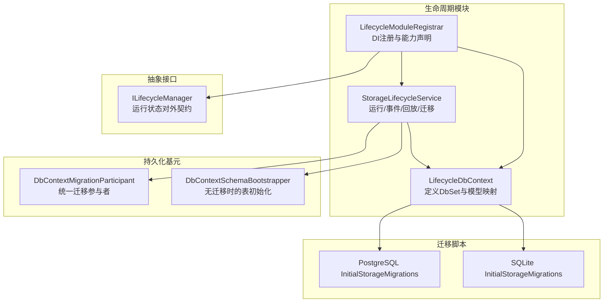
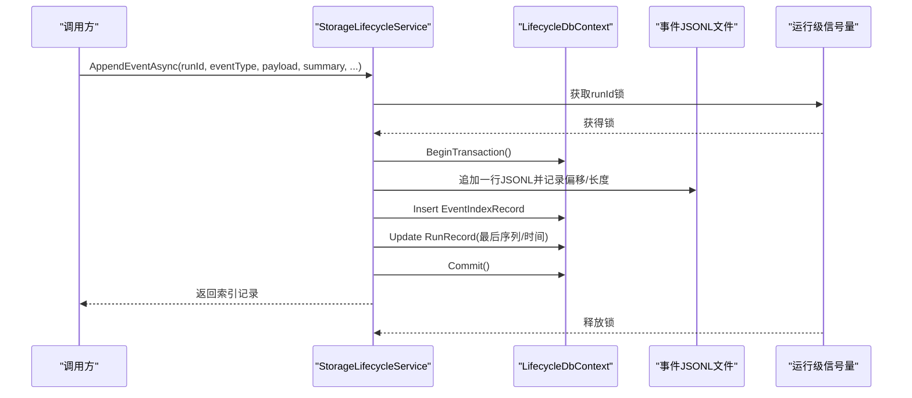
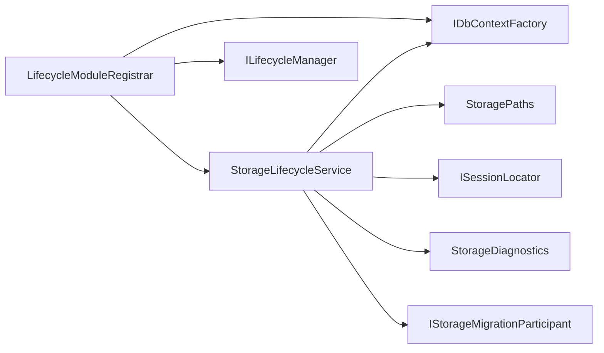
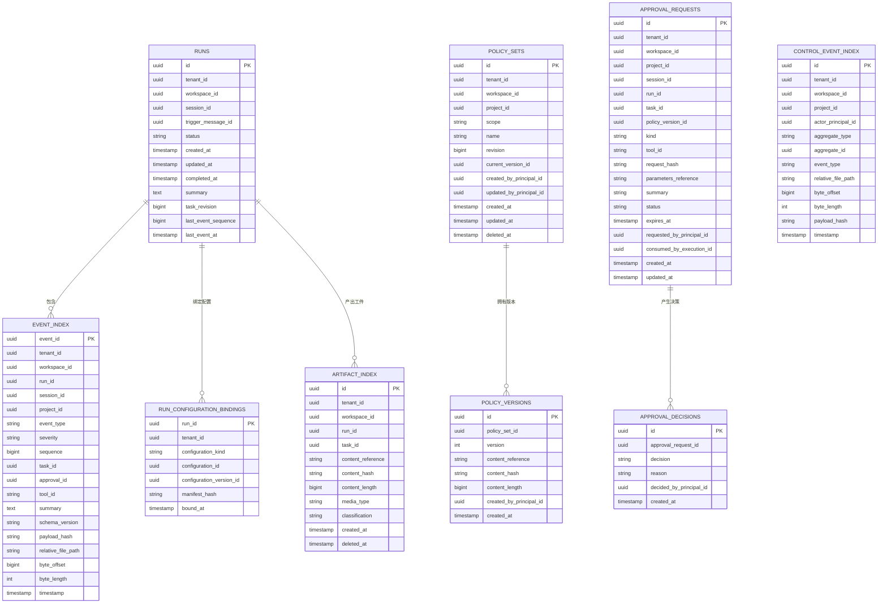

# 生命周期上下文

<cite>
**本文引用的文件**   
- [LifecycleDbContext.cs](file://TinadecCore/Lifecycle/LifecycleDbContext.cs)
- [StorageLifecycleService.cs](file://TinadecCore/Lifecycle/StorageLifecycleService.cs)
- [LifecycleModuleRegistrar.cs](file://TinadecCore/Lifecycle/LifecycleModuleRegistrar.cs)
- [ILifecycleManager.cs](file://TinadecCore/Abstractions/Ports/ILifecycleManager.cs)
- [DbContextMigrationParticipant.cs](file://TinadecCore/Persistence/DbContextMigrationParticipant.cs)
- [InitialStorageMigrations.cs（PostgreSQL）](file://TinadecCore/Storage.Migrations.PostgreSql/InitialStorageMigrations.cs)
- [InitialStorageMigrations.cs（SQLite）](file://TinadecCore/Storage.Migrations.Sqlite/InitialStorageMigrations.cs)
</cite>

## 目录
1. [简介](#简介)
2. [项目结构](#项目结构)
3. [核心组件](#核心组件)
4. [架构总览](#架构总览)
5. [详细组件分析](#详细组件分析)
6. [依赖关系分析](#依赖关系分析)
7. [性能与索引优化](#性能与索引优化)
8. [故障排查指南](#故障排查指南)
9. [结论](#结论)
10. [附录：实体关系图与查询示例](#附录实体关系图与查询示例)

## 简介
本文件围绕 TinadecOffice 的“生命周期数据库上下文”进行系统化文档化，重点覆盖 LifecycleDbContext 的设计模式、核心实体模型（运行记录、事件索引、策略版本控制、审批流程等）、运行状态管理、事件索引机制、事务与并发控制、以及数据库表结构与索引优化。读者可据此理解运行记录的生命周期流转、审计事件的追加与回放、策略与审批的数据建模，以及在高并发场景下的数据一致性与性能调优要点。

## 项目结构
生命周期相关代码位于 TinadecCore/Lifecycle 模块，包含 DbContext、服务实现与模块注册；迁移脚本分别提供 PostgreSQL 与 SQLite 的实现；持久化层提供统一的迁移参与者和表初始化能力。

图表来源 
- [LifecycleDbContext.cs:1-86](file://TinadecCore/Lifecycle/LifecycleDbContext.cs#L1-L86)
- [StorageLifecycleService.cs:1-291](file://TinadecCore/Lifecycle/StorageLifecycleService.cs#L1-L291)
- [LifecycleModuleRegistrar.cs:1-35](file://TinadecCore/Lifecycle/LifecycleModuleRegistrar.cs#L1-L35)
- [ILifecycleManager.cs:1-41](file://TinadecCore/Abstractions/Ports/ILifecycleManager.cs#L1-L41)
- [DbContextMigrationParticipant.cs:1-37](file://TinadecCore/Persistence/DbContextMigrationParticipant.cs#L1-L37)
- [InitialStorageMigrations.cs（PostgreSQL）:25-41](file://TinadecCore/Storage.Migrations.PostgreSql/InitialStorageMigrations.cs#L25-L41)
- [InitialStorageMigrations.cs（SQLite）:34-63](file://TinadecCore/Storage.Migrations.Sqlite/InitialStorageMigrations.cs#L34-L63)

章节来源
- [LifecycleDbContext.cs:1-86](file://TinadecCore/Lifecycle/LifecycleDbContext.cs#L1-L86)
- [LifecycleModuleRegistrar.cs:1-35](file://TinadecCore/Lifecycle/LifecycleModuleRegistrar.cs#L1-L35)

## 核心组件
- LifecycleDbContext：EF Core 上下文，集中声明 DbSets 与实体映射、主键、列名、长度约束与索引。
- StorageLifecycleService：生命周期服务，负责运行记录的创建、完成、事件追加、事件回放、一致性修复与迁移。
- ILifecycleManager：对外暴露的运行状态管理接口，封装底层存储细节。
- LifecycleModuleRegistrar：模块注册器，注入 DbContextFactory、服务与迁移参与者，并声明模块能力。
- DbContextMigrationParticipant/DbContextSchemaBootstrapper：为各模块提供统一的迁移或表初始化能力。

章节来源
- [LifecycleDbContext.cs:1-86](file://TinadecCore/Lifecycle/LifecycleDbContext.cs#L1-L86)
- [StorageLifecycleService.cs:1-291](file://TinadecCore/Lifecycle/StorageLifecycleService.cs#L1-L291)
- [ILifecycleManager.cs:1-41](file://TinadecCore/Abstractions/Ports/ILifecycleManager.cs#L1-L41)
- [LifecycleModuleRegistrar.cs:1-35](file://TinadecCore/Lifecycle/LifecycleModuleRegistrar.cs#L1-L35)
- [DbContextMigrationParticipant.cs:1-37](file://TinadecCore/Persistence/DbContextMigrationParticipant.cs#L1-L37)

## 架构总览
生命周期上下文采用“事件溯源 + 索引表”的混合设计：
- 运行记录（runs）作为轻量级聚合根，维护最新状态与最后事件序列号。
- 事件以 JSON Lines 追加到文件（高吞吐写入），同时在 event_index 中建立索引用于快速检索与回放。
- 策略集与版本（policy_sets/policy_versions）支持策略的版本化管理与当前版本引用。
- 审批请求与决策（approval_requests/approval_decisions）支撑工具调用前的审批流。
- 工件索引（artifact_index）与管控事件索引（control_event_index）扩展了审计与产物管理能力。

```mermaid
classDiagram
class LifecycleDbContext {
+DbSet~RunRecord~ Runs
+DbSet~EventIndexRecord~ EventIndex
+DbSet~PolicySetRecord~ PolicySets
+DbSet~PolicyVersionRecord~ PolicyVersions
+DbSet~ApprovalRequestRecord~ ApprovalRequests
+DbSet~ApprovalDecisionRecord~ ApprovalDecisions
+DbSet~RunConfigurationBindingRecord~ RunConfigurationBindings
+DbSet~ArtifactIndexRecord~ ArtifactIndex
+DbSet~ControlEventIndexRecord~ ControlEventIndex
}
class RunRecord {
+Guid Id
+Guid TenantId
+Guid WorkspaceId
+Guid SessionId
+Guid TriggerMessageId
+string Status
+DateTimeOffset CreatedAt
+DateTimeOffset UpdatedAt
+DateTimeOffset? CompletedAt
+string? Summary
+long TaskRevision
+long LastEventSequence
+DateTimeOffset? LastEventAt
}
class EventIndexRecord {
+Guid EventId
+Guid TenantId
+Guid WorkspaceId
+Guid RunId
+Guid SessionId
+Guid ProjectId
+string EventType
+string Severity
+long Sequence
+Guid? TaskId
+Guid? ApprovalId
+string? ToolId
+string Summary
+string SchemaVersion
+string PayloadHash
+string RelativeFilePath
+long ByteOffset
+int ByteLength
+DateTimeOffset Timestamp
}
class PolicySetRecord {
+Guid Id
+Guid TenantId
+Guid? WorkspaceId
+Guid? ProjectId
+string Scope
+string Name
+long Revision
+Guid CurrentVersionId
+Guid CreatedByPrincipalId
+Guid UpdatedByPrincipalId
+DateTimeOffset CreatedAt
+DateTimeOffset UpdatedAt
+DateTimeOffset? DeletedAt
}
class PolicyVersionRecord {
+Guid Id
+Guid PolicySetId
+int Version
+string ContentReference
+string ContentHash
+long ContentLength
+Guid CreatedByPrincipalId
+DateTimeOffset CreatedAt
}
class ApprovalRequestRecord {
+Guid Id
+Guid TenantId
+Guid WorkspaceId
+Guid? ProjectId
+Guid? SessionId
+Guid? RunId
+Guid? TaskId
+Guid? PolicyVersionId
+string Kind
+string ToolId
+string RequestHash
+string ParametersReference
+string Summary
+string Status
+DateTimeOffset ExpiresAt
+Guid RequestedByPrincipalId
+Guid? ConsumedByExecutionId
+DateTimeOffset CreatedAt
+DateTimeOffset UpdatedAt
}
class ApprovalDecisionRecord {
+Guid Id
+Guid ApprovalRequestId
+string Decision
+string? Reason
+Guid DecidedByPrincipalId
+DateTimeOffset CreatedAt
}
class RunConfigurationBindingRecord {
+Guid RunId
+Guid TenantId
+string ConfigurationKind
+Guid ConfigurationId
+Guid ConfigurationVersionId
+string ManifestHash
+DateTimeOffset BoundAt
}
class ArtifactIndexRecord {
+Guid Id
+Guid TenantId
+Guid WorkspaceId
+Guid RunId
+Guid? TaskId
+string ContentReference
+string ContentHash
+long ContentLength
+string MediaType
+string Classification
+DateTimeOffset CreatedAt
+DateTimeOffset? DeletedAt
}
class ControlEventIndexRecord {
+Guid Id
+Guid TenantId
+Guid? WorkspaceId
+Guid? ProjectId
+Guid? ActorPrincipalId
+string AggregateType
+Guid AggregateId
+string EventType
+string RelativeFilePath
+long ByteOffset
+int ByteLength
+string PayloadHash
+DateTimeOffset Timestamp
}
LifecycleDbContext --> RunRecord : "Runs"
LifecycleDbContext --> EventIndexRecord : "EventIndex"
LifecycleDbContext --> PolicySetRecord : "PolicySets"
LifecycleDbContext --> PolicyVersionRecord : "PolicyVersions"
LifecycleDbContext --> ApprovalRequestRecord : "ApprovalRequests"
LifecycleDbContext --> ApprovalDecisionRecord : "ApprovalDecisions"
LifecycleDbContext --> RunConfigurationBindingRecord : "RunConfigurationBindings"
LifecycleDbContext --> ArtifactIndexRecord : "ArtifactIndex"
LifecycleDbContext --> ControlEventIndexRecord : "ControlEventIndex"
```

图表来源 
- [LifecycleDbContext.cs:1-86](file://TinadecCore/Lifecycle/LifecycleDbContext.cs#L1-L86)

章节来源
- [LifecycleDbContext.cs:1-86](file://TinadecCore/Lifecycle/LifecycleDbContext.cs#L1-L86)

## 详细组件分析

### 运行记录（RunRecord）与生命周期状态
- 字段含义
  - Id：运行唯一标识
  - TenantId/WorkspaceId/SessionId：多租户与工作区隔离维度
  - TriggerMessageId：触发消息ID，便于溯源
  - Status：运行状态（pending/running/completed/failed/cancelled）
  - CreatedAt/UpdatedAt/CompletedAt：时间戳
  - Summary：运行摘要
  - TaskRevision：任务修订号
  - LastEventSequence/LastEventAt：最后事件序号与时间，用于增量回放
- 状态管理
  - StartRunAsync：校验会话存在后插入 runs 并初始化快照与工件目录
  - CompleteRunAsync：将状态置为 completed，填充 CompletedAt
  - GetRunStateAsync：通过 ILifecycleManager 返回运行时状态视图
- 并发与一致性
  - 使用 IDbContextFactory 获取短生命周期上下文
  - 事件追加时通过基于 runId 的信号量保证单条运行的串行写入
  - 更新 runs 的最后事件序列与时间戳在同一事务内提交

章节来源
- [LifecycleDbContext.cs:21-42](file://TinadecCore/Lifecycle/LifecycleDbContext.cs#L21-L42)
- [StorageLifecycleService.cs:33-76](file://TinadecCore/Lifecycle/StorageLifecycleService.cs#L33-L76)
- [ILifecycleManager.cs:10-22](file://TinadecCore/Abstractions/Ports/ILifecycleManager.cs#L10-L22)

### 事件索引（EventIndexRecord）与事件追加/回放
- 字段含义
  - EventId：事件唯一ID
  - RunId/SessionId/ProjectId：关联上下文
  - EventType/Severity：事件类型与严重级别
  - Sequence：按运行递增的事件序号
  - TaskId/ApprovalId/ToolId：关联任务、审批与工具
  - Summary/SchemaVersion/PayloadHash：摘要、事件模式版本与载荷哈希
  - RelativeFilePath/ByteOffset/ByteLength：指向 JSONL 文件的行位置与长度
  - Timestamp：事件时间戳
- 追加流程
  - 序列化事件到内存对象，写入 JSONL 文件，记录偏移与长度
  - 在事务中插入 event_index 并更新 runs 的最后事件序号与时间
  - 使用 SHA256 计算载荷哈希，保障完整性
- 回放流程
  - 根据 afterSequence 过滤事件索引，按时间+序号排序
  - 从 JSONL 文件中按偏移读取对应行，反序列化为事件信封
- 一致性修复
  - ReconcileAsync：扫描现有 JSONL 文件，补齐缺失的索引条目

图表来源 
- [StorageLifecycleService.cs:78-144](file://TinadecCore/Lifecycle/StorageLifecycleService.cs#L78-L144)

章节来源
- [LifecycleDbContext.cs:44-78](file://TinadecCore/Lifecycle/LifecycleDbContext.cs#L44-L78)
- [StorageLifecycleService.cs:78-179](file://TinadecCore/Lifecycle/StorageLifecycleService.cs#L78-L179)

### 策略版本控制（PolicySetRecord / PolicyVersionRecord）
- PolicySetRecord：策略集元数据（名称、作用域、当前版本ID、创建/更新时间、软删除标记）
- PolicyVersionRecord：策略版本内容引用、内容哈希、长度与创建信息
- 索引设计
  - 策略集：按租户/工作区/项目/名称/删除时间唯一，避免重复
  - 策略版本：按策略集ID与版本号唯一，确保版本不可变

章节来源
- [LifecycleDbContext.cs:79-81](file://TinadecCore/Lifecycle/LifecycleDbContext.cs#L79-L81)

### 审批流程（ApprovalRequestRecord / ApprovalDecisionRecord）
- ApprovalRequestRecord：审批请求（种类、工具ID、请求哈希、参数引用、状态、过期时间、请求人、消费执行ID等）
- ApprovalDecisionRecord：审批决策（决定、原因、决策人、时间）
- 索引设计
  - 审批请求：按租户/工作区/状态/过期时间、以及运行/工具/请求哈希组合索引
  - 审批决策：按审批请求ID与创建时间索引

章节来源
- [LifecycleDbContext.cs:81-82](file://TinadecCore/Lifecycle/LifecycleDbContext.cs#L81-L82)

### 运行配置绑定（RunConfigurationBindingRecord）
- 描述运行实例与配置版本的绑定关系（配置种类、配置ID、版本ID、清单哈希、绑定时间）
- 复合主键：RunId + ConfigurationKind + ConfigurationVersionId
- 索引：按租户与配置版本ID加速查找

章节来源
- [LifecycleDbContext.cs:83](file://TinadecCore/Lifecycle/LifecycleDbContext.cs#L83)

### 工件索引（ArtifactIndexRecord）
- 记录运行产物的元数据（内容引用、内容哈希、长度、媒体类型、分类、创建/删除时间）
- 索引：按租户/运行/创建时间，便于按运行回溯产物

章节来源
- [LifecycleDbContext.cs:84](file://TinadecCore/Lifecycle/LifecycleDbContext.cs#L84)

### 管控事件索引（ControlEventIndexRecord）
- 记录管控侧事件（聚合类型、聚合ID、事件类型、相对路径、字节偏移/长度、载荷哈希、时间）
- 索引：按租户/工作区/时间，便于按时间线检索

章节来源
- [LifecycleDbContext.cs:85](file://TinadecCore/Lifecycle/LifecycleDbContext.cs#L85)

### 迁移与表初始化
- 迁移参与者：DbContextMigrationParticipant<TContext> 协调数据库迁移
- 无迁移环境：DbContextSchemaBootstrapper 生成 CREATE TABLE IF NOT EXISTS 脚本并执行
- 迁移脚本：PostgreSQL 与 SQLite 各自提供 LifecycleInitial 迁移，定义 runs 与 event_index 表及索引

章节来源
- [DbContextMigrationParticipant.cs:1-37](file://TinadecCore/Persistence/DbContextMigrationParticipant.cs#L1-37)
- [InitialStorageMigrations.cs（PostgreSQL）:25-41](file://TinadecCore/Storage.Migrations.PostgreSql/InitialStorageMigrations.cs#L25-L41)
- [InitialStorageMigrations.cs（SQLite）:34-63](file://TinadecCore/Storage.Migrations.Sqlite/InitialStorageMigrations.cs#L34-L63)

## 依赖关系分析
- 模块注册器将 LifecycleDbContext、StorageLifecycleService、ILifecycleManager 与迁移参与者注入容器
- StorageLifecycleService 依赖 IDbContextFactory<LifecycleDbContext>、会话定位器、存储路径与诊断
- 事件回放依赖文件系统（JSONL）与 EF Core 索引表协同
- 迁移由统一参与者驱动，确保跨提供者一致性

图表来源 
- [LifecycleModuleRegistrar.cs:17-34](file://TinadecCore/Lifecycle/LifecycleModuleRegistrar.cs#L17-L34)
- [StorageLifecycleService.cs:21-31](file://TinadecCore/Lifecycle/StorageLifecycleService.cs#L21-L31)

章节来源
- [LifecycleModuleRegistrar.cs:1-35](file://TinadecCore/Lifecycle/LifecycleModuleRegistrar.cs#L1-L35)
- [StorageLifecycleService.cs:1-31](file://TinadecCore/Lifecycle/StorageLifecycleService.cs#L1-L31)

## 性能与索引优化
- runs 表
  - 复合索引：(tenant_id, workspace_id, session_id, created_at) 支持按会话与时间范围筛选
  - 复合索引：(session_id, status, updated_at) 支持按会话状态与更新时间查询
- event_index 表
  - 唯一索引：(run_id, sequence) 保证事件顺序唯一性
  - 复合索引：(tenant_id, workspace_id, session_id, timestamp) 支持按会话与时间检索
  - 复合索引：(project_id, timestamp) 支持按项目时间线检索
  - 复合索引：(approval_id, event_type, timestamp) 支持审批事件检索
- 事件追加
  - JSONL 追加写，零拷贝偏移读取，适合高吞吐事件流
  - 使用 WriteThrough 与显式 flush，确保落盘一致性
- 回放与重放
  - 先查索引再读文件，减少随机IO
  - 按时间+序号排序，保证回放顺序稳定
- 建议
  - 对高频查询条件增加覆盖索引（如 tenant/workspace/session 前缀）
  - 大文本字段（summary）保持合理长度限制，避免页膨胀
  - 定期归档历史事件文件，降低 I/O 压力

章节来源
- [LifecycleDbContext.cs:21-85](file://TinadecCore/Lifecycle/LifecycleDbContext.cs#L21-L85)
- [StorageLifecycleService.cs:226-238](file://TinadecCore/Lifecycle/StorageLifecycleService.cs#L226-L238)

## 故障排查指南
- 事件回放为空
  - 检查 event_index 是否存在对应 run/session 的索引记录
  - 确认 JSONL 文件路径与偏移/长度是否匹配
- 事件追加失败
  - 检查运行是否存在、会话是否有效
  - 查看运行级信号量是否被长时间占用（死锁或异常未释放）
- 一致性不一致
  - 运行 ReconcileAsync 补全缺失索引
  - 检查事务提交是否成功，日志中是否有异常
- 迁移失败
  - 确认数据库连接信息与权限
  - 在无迁移环境下，检查表初始化脚本是否执行成功

章节来源
- [StorageLifecycleService.cs:146-217](file://TinadecCore/Lifecycle/StorageLifecycleService.cs#L146-L217)
- [DbContextMigrationParticipant.cs:12-23](file://TinadecCore/Persistence/DbContextMigrationParticipant.cs#L12-L23)

## 结论
生命周期上下文通过“运行记录 + 事件索引 + 文件事件日志”的组合，实现了高吞吐、可追溯、可扩展的运行与审计能力。配合策略版本控制与审批流程，系统具备完善的治理与合规基础。合理的索引设计与事务边界保证了数据一致性与查询性能，同时提供了回滚与修复机制以应对异常场景。

## 附录：实体关系图与查询示例

### 实体关系图（ER）

图表来源 
- [LifecycleDbContext.cs:21-85](file://TinadecCore/Lifecycle/LifecycleDbContext.cs#L21-L85)

### 典型查询示例（概念性）
- 按会话列出运行记录（按创建时间倒序）
- 按运行回放事件（afterSequence 增量）
- 按项目与时间检索事件
- 按审批ID检索事件
- 查询策略集的当前版本
- 查询某运行绑定的配置版本

[本节为概念性说明，不直接分析具体文件]