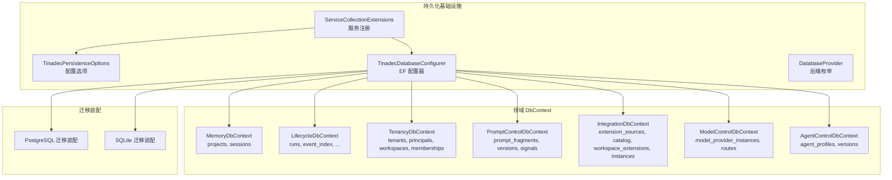
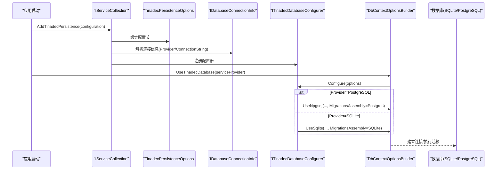
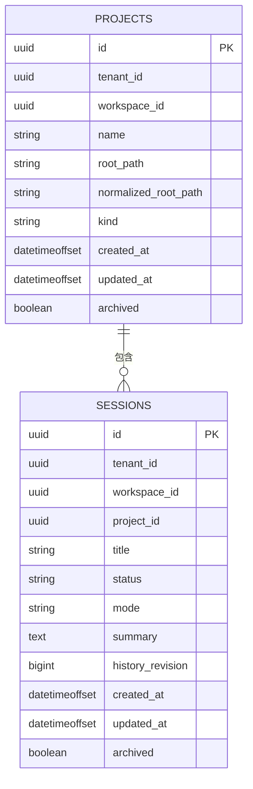
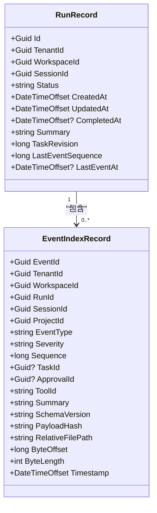
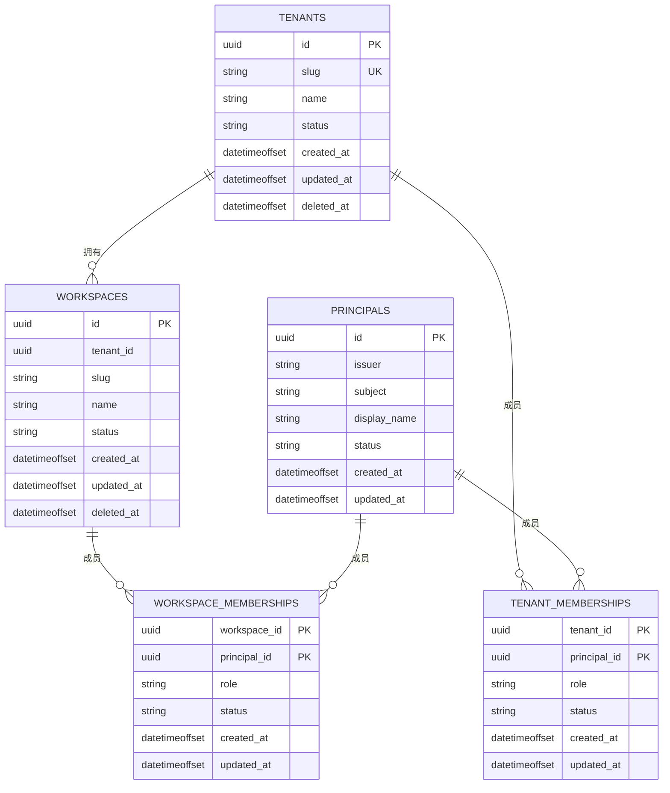
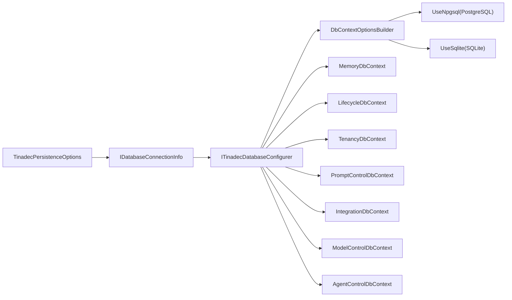

# 数据模型与数据库

<cite>
**本文引用的文件**   
- [ServiceCollectionExtensions.cs](file://TinadecCore\Persistence\ServiceCollectionExtensions.cs)
- [TinadecPersistenceOptions.cs](file://TinadecCore\Persistence\TinadecPersistenceOptions.cs)
- [DatabaseProvider.cs](file://TinadecCore\Persistence\DatabaseProvider.cs)
- [TinadecDatabaseConfigurer.cs](file://TinadecCore\Persistence\TinadecDatabaseConfigurer.cs)
- [AgentControlDbContext.cs](file://TinadecCore\DmaEA\AgentControlDbContext.cs)
- [LifecycleDbContext.cs](file://TinadecCore\Lifecycle\LifecycleDbContext.cs)
- [MemoryDbContext.cs](file://TinadecCore\Memory\MemoryDbContext.cs)
- [TenancyDbContext.cs](file://TinadecCore\Tenancy\TenancyDbContext.cs)
- [PromptControlDbContext.cs](file://TinadecCore\Prompts\PromptControlDbContext.cs)
- [IntegrationDbContext.cs](file://TinadecCore\Skills\IntegrationDbContext.cs)
- [ModelControlDbContext.cs](file://TinadecCore\Models\ModelControlDbContext.cs)
- [InitialStorageMigrations.cs（PostgreSQL）](file://TinadecCore\Storage.Migrations.PostgreSql\InitialStorageMigrations.cs)
- [InitialStorageMigrations.cs（SQLite）](file://TinadecCore\Storage.Migrations.Sqlite\InitialStorageMigrations.cs)
</cite>

## 目录
1. [简介](#简介)
2. [项目结构](#项目结构)
3. [核心组件](#核心组件)
4. [架构总览](#架构总览)
5. [详细组件分析](#详细组件分析)
6. [依赖关系分析](#依赖关系分析)
7. [性能考虑](#性能考虑)
8. [故障排查指南](#故障排查指南)
9. [结论](#结论)
10. [附录](#附录)

## 简介
本文件为 TinadecOffice 的数据模型与数据库文档，覆盖实体关系、字段定义与数据类型、主键/外键、索引与约束、数据验证与业务规则、数据库模式图与示例数据、数据访问模式、缓存策略与性能考量、数据生命周期与保留归档策略、迁移路径与版本管理、数据安全与隐私要求以及访问控制。目标是帮助开发者快速理解并正确使用系统的数据层。

## 项目结构
数据层采用 EF Core 多 DbContext 的模块化设计，按功能域划分：
- 记忆与会话（Memory）：项目与会话元数据
- 生命周期（Lifecycle）：运行、事件、策略、审批、制品与控制事件索引
- 租户与权限（Tenancy）：租户、主体、工作区及成员关系
- 提示词（Prompts）：提示片段及其版本、信号
- 技能集成（Skills）：扩展源、目录、工作区扩展与实例版本
- 模型控制（Models）：模型提供者与路由及其版本
- 代理控制（DmaEA）：代理档案与版本
- 持久化基础设施（Persistence）：连接信息、配置器、迁移装配选择、就绪检查等

图表来源
- [ServiceCollectionExtensions.cs:15-48](file://TinadecCore\Persistence\ServiceCollectionExtensions.cs#L15-L48)
- [TinadecPersistenceOptions.cs:7-32](file://TinadecCore\Persistence\TinadecPersistenceOptions.cs#L7-L32)
- [TinadecDatabaseConfigurer.cs:19-46](file://TinadecCore\Persistence\TinadecDatabaseConfigurer.cs#L19-L46)
- [DatabaseProvider.cs:6-10](file://TinadecCore\Persistence\DatabaseProvider.cs#L6-L10)

章节来源
- [ServiceCollectionExtensions.cs:15-48](file://TinadecCore\Persistence\ServiceCollectionExtensions.cs#L15-L48)
- [TinadecPersistenceOptions.cs:7-32](file://TinadecCore\Persistence\TinadecPersistenceOptions.cs#L7-L32)
- [TinadecDatabaseConfigurer.cs:19-46](file://TinadecCore\Persistence\TinadecDatabaseConfigurer.cs#L19-L46)
- [DatabaseProvider.cs:6-10](file://TinadecCore\Persistence\DatabaseProvider.cs#L6-L10)

## 核心组件
- 配置与连接解析
  - 通过配置节绑定 TinadecPersistenceOptions，支持启用开关、默认后端（本地 SQLite）、SQLite 文件路径、PostgreSQL 连接字符串名称、是否启动时应用迁移、探针超时等。
  - 根据 Provider 与配置解析出连接字符串或空值；未启用时返回禁用状态。
- EF 配置器
  - 校验 Enabled 与连接信息有效性，按 Provider 选择 UseNpgsql 或 UseSqlite，并指定对应迁移装配。
- 领域 DbContext
  - 每个模块一个 DbContext，集中定义 DbSet、列映射、长度限制、唯一性与查询索引。

章节来源
- [ServiceCollectionExtensions.cs:23-48](file://TinadecCore\Persistence\ServiceCollectionExtensions.cs#L23-L48)
- [ServiceCollectionExtensions.cs:64-79](file://TinadecCore\Persistence\ServiceCollectionExtensions.cs#L64-L79)
- [ServiceCollectionExtensions.cs:81-120](file://TinadecCore\Persistence\ServiceCollectionExtensions.cs#L81-L120)
- [TinadecPersistenceOptions.cs:7-32](file://TinadecCore\Persistence\TinadecPersistenceOptions.cs#L7-L32)
- [TinadecDatabaseConfigurer.cs:19-46](file://TinadecCore\Persistence\TinadecDatabaseConfigurer.cs#L19-L46)

## 架构总览
下图展示从服务注册到 EF 配置再到各 DbContext 的调用链，以及 PostgreSQL/SQLite 迁移装配的选择逻辑。

图表来源
- [ServiceCollectionExtensions.cs:15-48](file://TinadecCore\Persistence\ServiceCollectionExtensions.cs#L15-L48)
- [TinadecDatabaseConfigurer.cs:19-46](file://TinadecCore\Persistence\TinadecDatabaseConfigurer.cs#L19-L46)

## 详细组件分析

### 记忆与会话（MemoryDbContext）
- 表与实体
  - projects：项目根路径、规范化路径、类型、归档标记、时间戳
  - sessions：会话标题、状态、模式、摘要、历史版本、归档标记、时间戳
- 主键与索引
  - projects.id 为主键；normalized_root_path 唯一索引；(tenant_id, workspace_id, archived, updated_at)、(archived, updated_at) 复合索引
  - sessions.id 为主键；(tenant_id, workspace_id, project_id, archived, updated_at) 复合索引
- 字段约束
  - name/root_path/normalized_root_path/kind/status/mode 等均有最大长度与必填约束
- 业务含义
  - 以 tenant/workspace/project/session 四级维度组织会话上下文；archived 用于软归档与查询过滤

图表来源
- [MemoryDbContext.cs:15-60](file://TinadecCore\Memory\MemoryDbContext.cs#L15-L60)
- [InitialStorageMigrations.cs（SQLite）:14-31](file://TinadecCore\Storage.Migrations.Sqlite\InitialStorageMigrations.cs#L14-L31)
- [InitialStorageMigrations.cs（PostgreSQL）:14-22](file://TinadecCore\Storage.Migrations.PostgreSql\InitialStorageMigrations.cs#L14-L22)

章节来源
- [MemoryDbContext.cs:15-60](file://TinadecCore\Memory\MemoryDbContext.cs#L15-L60)
- [InitialStorageMigrations.cs（SQLite）:14-31](file://TinadecCore\Storage.Migrations.Sqlite\InitialStorageMigrations.cs#L14-L31)
- [InitialStorageMigrations.cs（PostgreSQL）:14-22](file://TinadecCore\Storage.Migrations.PostgreSql\InitialStorageMigrations.cs#L14-L22)

### 生命周期（LifecycleDbContext）
- 表与实体
  - runs：运行记录（状态、触发消息、完成时间、摘要、任务修订、最后事件序列/时间）
  - event_index：事件索引（类型、严重级别、序列、工具/任务/审批关联、摘要、SchemaVersion、负载哈希、文件偏移与长度、时间戳）
  - policy_sets/policy_versions：策略集与版本（内容引用、哈希、长度）
  - approval_requests/approval_decisions：审批请求与决策（类型、工具、参数引用、状态、过期时间、决策结果）
  - run_configuration_bindings：运行与配置绑定（配置种类、版本、清单哈希）
  - artifact_index：制品索引（内容引用、哈希、长度、媒体类型、分类）
  - control_event_index：控制事件索引（聚合类型/ID、事件类型、文件偏移/长度、负载哈希、时间戳）
- 主键与索引
  - runs.id 主键；(session_id, created_at)、(session_id, status, updated_at) 索引
  - event_index.event_id 主键；(run_id, sequence) 唯一；(tenant_id, workspace_id, session_id, timestamp)、(project_id, timestamp)、(approval_id, event_type, timestamp) 复合索引
  - 其他表均定义主键与必要的唯一/查询索引
- 业务规则
  - 事件序列在运行内唯一；事件与审批/工具/任务可关联；制品按租户/运行/任务维度索引；控制事件按租户/工作区/时间范围检索

图表来源
- [LifecycleDbContext.cs:21-86](file://TinadecCore\Lifecycle\LifecycleDbContext.cs#L21-L86)
- [LifecycleDbContext.cs:89-136](file://TinadecCore\Lifecycle\LifecycleDbContext.cs#L89-L136)
- [InitialStorageMigrations.cs（SQLite）:34-63](file://TinadecCore\Storage.Migrations.Sqlite\InitialStorageMigrations.cs#L34-L63)
- [InitialStorageMigrations.cs（PostgreSQL）:25-41](file://TinadecCore\Storage.Migrations.PostgreSql\InitialStorageMigrations.cs#L25-L41)

章节来源
- [LifecycleDbContext.cs:21-86](file://TinadecCore\Lifecycle\LifecycleDbContext.cs#L21-L86)
- [LifecycleDbContext.cs:89-136](file://TinadecCore\Lifecycle\LifecycleDbContext.cs#L89-L136)
- [InitialStorageMigrations.cs（SQLite）:34-63](file://TinadecCore\Storage.Migrations.Sqlite\InitialStorageMigrations.cs#L34-L63)
- [InitialStorageMigrations.cs（PostgreSQL）:25-41](file://TinadecCore\Storage.Migrations.PostgreSql\InitialStorageMigrations.cs#L25-L41)

### 租户与权限（TenancyDbContext）
- 表与实体
  - tenants：租户（slug、name、status、软删除）
  - principals：主体（issuer、subject、display_name、status）
  - tenant_memberships：租户成员（role、status）
  - workspaces：工作区（slug、name、status、软删除）
  - workspace_memberships：工作区成员（role、status）
- 主键与索引
  - tenants.slug 唯一；principals.(issuer, subject) 唯一；workspaces.(tenant_id, slug) 唯一；成员表使用复合主键
- 业务规则
  - 基于租户与工作区的 RBAC 基础；角色与状态驱动访问控制

图表来源
- [TenancyDbContext.cs:15-51](file://TinadecCore\Tenancy\TenancyDbContext.cs#L15-L51)
- [TenancyDbContext.cs:54-58](file://TinadecCore\Tenancy\TenancyDbContext.cs#L54-L58)

章节来源
- [TenancyDbContext.cs:15-51](file://TinadecCore\Tenancy\TenancyDbContext.cs#L15-L51)
- [TenancyDbContext.cs:54-58](file://TinadecCore\Tenancy\TenancyDbContext.cs#L54-L58)

### 提示词（PromptControlDbContext）
- 表与实体
  - prompt_fragments：片段（key、title、scope、category、优先级、启用、内置、当前版本、审计字段、软删除）
  - prompt_fragment_versions：片段版本（内容引用、哈希、长度、变更摘要）
  - prompt_fragment_signals：片段信号（信号名、关联运行/会话、审计）
- 主键与索引
  - fragments.(tenant_id, workspace_id, project_id, key, target_agent_id, deleted_at) 唯一；versions.(fragment_id, version) 唯一；signals.(fragment_id, version, created_at) 索引

章节来源
- [PromptControlDbContext.cs:12-33](file://TinadecCore\Prompts\PromptControlDbContext.cs#L12-L33)
- [PromptControlDbContext.cs:36-38](file://TinadecCore\Prompts\PromptControlDbContext.cs#L36-L38)

### 技能集成（IntegrationDbContext）
- 表与实体
  - extension_sources：扩展源（name、kind、location、启用、审计、软删除）
  - extension_catalog_entries：目录条目（extension_id、version、manifest_reference、刷新/过期时间）
  - workspace_extensions：工作区扩展（extension_id、enabled、status、当前版本、审计、软删除）
  - workspace_extension_versions：工作区扩展版本（manifest/config 引用、哈希、审计）
  - integration_instances：集成实例（kind、name、enabled、status、当前版本、审计、软删除）
  - integration_instance_versions：实例版本（config 引用/哈希、审计）
- 主键与索引
  - sources.(tenant_id, name, deleted_at) 唯一；catalog.(source_id, extension_id, version) 唯一；workspace_extensions.(workspace_id, extension_id, deleted_at) 唯一；instances.(workspace_id, kind, name, deleted_at) 唯一；各版本表对 (id, version) 唯一

章节来源
- [IntegrationDbContext.cs:15-24](file://TinadecCore\Skills\IntegrationDbContext.cs#L15-L24)
- [IntegrationDbContext.cs:27-32](file://TinadecCore\Skills\IntegrationDbContext.cs#L27-L32)

### 模型控制（ModelControlDbContext）
- 表与实体
  - model_provider_instances：提供者（driver、display_name、scope、connection_kind、secret_reference、审计、软删除）
  - model_provider_versions：提供者版本（content_reference、hash、length、审计）
  - model_routes：路由（purpose、scope、审计、软删除）
  - model_route_versions：路由版本（provider_id、model、审计）
- 主键与索引
  - providers.(tenant_id, workspace_id, driver, deleted_at) 索引；routes.(tenant_id, workspace_id, project_id, purpose, deleted_at) 唯一；各版本表对 (id, version) 唯一

章节来源
- [ModelControlDbContext.cs:13-38](file://TinadecCore\Models\ModelControlDbContext.cs#L13-L38)
- [ModelControlDbContext.cs:42-45](file://TinadecCore\Models\ModelControlDbContext.cs#L42-L45)

### 代理控制（DmaEA AgentControlDbContext）
- 表与实体
  - agent_profiles：代理档案（name、layer、agent_type、scope、enabled、内置、当前版本、审计、软删除）
  - agent_profile_versions：代理版本（content_reference、hash、length、可选 model_route_id、审计）
- 主键与索引
  - profiles.(tenant_id, workspace_id, project_id, name, deleted_at) 索引；versions.(agent_id, version) 唯一

章节来源
- [AgentControlDbContext.cs:10-23](file://TinadecCore\DmaEA\AgentControlDbContext.cs#L10-L23)
- [AgentControlDbContext.cs:26-27](file://TinadecCore\DmaEA\AgentControlDbContext.cs#L26-L27)

## 依赖关系分析
- 配置依赖
  - ServiceCollectionExtensions 绑定 TinadecPersistenceOptions，解析 IDatabaseConnectionInfo，注册 ITinadecDatabaseConfigurer、IDatabaseReadiness、StoragePaths、IContentStore、IProjectVectorDatabase、ISecretStore、IStorageMigrationRunner。
- 运行时依赖
  - TinadecDatabaseConfigurer 依据 Provider 选择 UseNpgsql 或 UseSqlite，并注入对应迁移装配。
- 领域依赖
  - 各 DbContext 仅依赖 EF Core 与领域实体，不耦合具体数据库实现细节。

图表来源
- [ServiceCollectionExtensions.cs:15-48](file://TinadecCore\Persistence\ServiceCollectionExtensions.cs#L15-L48)
- [TinadecDatabaseConfigurer.cs:19-46](file://TinadecCore\Persistence\TinadecDatabaseConfigurer.cs#L19-L46)

章节来源
- [ServiceCollectionExtensions.cs:15-48](file://TinadecCore\Persistence\ServiceCollectionExtensions.cs#L15-L48)
- [TinadecDatabaseConfigurer.cs:19-46](file://TinadecCore\Persistence\TinadecDatabaseConfigurer.cs#L19-L46)

## 性能考虑
- 索引策略
  - 高频查询路径已提供复合索引，如 runs(session_id, created_at/status, updated_at)、event_index(run_id, sequence) 唯一、event_index(tenant/workspace/session/timestamp)、artifact_index(tenant/run/created_at) 等。
- 分页与筛选
  - 建议基于 updatedAt/archived/status 等字段进行分页与过滤，避免全表扫描。
- 大对象与附件
  - 事件与制品采用“索引+文件路径/偏移”的分离存储模式，减少行大小，提升查询效率。
- 连接与迁移
  - 本地开发默认 SQLite，启动自动应用迁移；生产 PostgreSQL 需显式启用 ApplyMigrationsOnStartup，避免多实例竞争。
- 探针与就绪
  - ProbeTimeoutSeconds 控制健康检查探针超时，确保服务启动后稳定可用。

[本节为通用指导，不直接分析具体文件]

## 故障排查指南
- 常见错误
  - 未启用持久化：抛出“TinadecPersistence is disabled”异常。
  - 连接未配置：SQLite 缺少 DatabasePath 或 PostgreSQL 缺少 ConnectionStrings 项。
- 诊断步骤
  - 检查 TinadecPersistence:Enabled 与 Provider。
  - 确认 SQLite 文件路径或 PostgreSQL 连接字符串名称是否存在且有效。
  - 查看迁移装配是否正确加载（PostgreSQL/SQLite 分别对应不同装配）。
  - 使用健康检查探针确认数据库连通性。

章节来源
- [TinadecDatabaseConfigurer.cs:23-35](file://TinadecCore\Persistence\TinadecDatabaseConfigurer.cs#L23-L35)
- [ServiceCollectionExtensions.cs:23-28](file://TinadecCore\Persistence\ServiceCollectionExtensions.cs#L23-L28)

## 结论
TinadecOffice 的数据层以 EF Core 为核心，通过模块化 DbContext 将记忆、生命周期、租户权限、提示词、技能集成与模型控制等能力解耦。统一的持久化配置与迁移装配机制，使 SQLite/PostgreSQL 双后端可无缝切换。合理的索引设计与“索引+文件”的分离存储模式，兼顾了查询性能与可扩展性。建议在部署中明确启用迁移、合理设置探针超时，并结合业务场景优化查询与归档策略。

[本节为总结性内容，不直接分析具体文件]

## 附录

### 数据访问模式与缓存策略
- 数据访问
  - 通过 DbContext 暴露 DbSet，结合 LINQ 进行查询与更新；所有写操作遵循事务边界由上层服务控制。
- 缓存策略
  - 代码库未内建统一缓存抽象；可在服务层引入内存缓存或分布式缓存，针对热点查询（如租户/工作区列表、路由解析）进行缓存。
- 向量存储
  - 存在 IProjectVectorDatabase 接口，用于向量检索；与关系型数据分离，适合语义搜索与相似性匹配。

章节来源
- [ServiceCollectionExtensions.cs:42-47](file://TinadecCore\Persistence\ServiceCollectionExtensions.cs#L42-L47)

### 数据生命周期、保留与归档
- 生命周期
  - projects/sessions 通过 Archived 标记软归档；tenants/workspaces 通过 DeletedAt 软删除。
- 保留策略
  - 事件与制品通过 event_index/artifact_index 索引与文件路径定位，可按时间窗口清理旧数据。
- 归档规则
  - 建议对 inactive/archived=true 的会话与制品定期归档至冷存储，并保留必要元数据以便追溯。

章节来源
- [MemoryDbContext.cs:15-36](file://TinadecCore\Memory\MemoryDbContext.cs#L15-L36)
- [TenancyDbContext.cs:17-23](file://TinadecCore\Tenancy\TenancyDbContext.cs#L17-L23)
- [LifecycleDbContext.cs:44-86](file://TinadecCore\Lifecycle\LifecycleDbContext.cs#L44-L86)

### 数据迁移路径与版本管理
- 迁移装配
  - SQLite：TinadecCore.Storage.Migrations.Sqlite
  - PostgreSQL：TinadecCore.Storage.Migrations.PostgreSql
- 初始迁移
  - MemoryInitial（projects/sessions）、LifecycleInitial（runs/event_index）
- 版本演进
  - 新增迁移应遵循命名规范与顺序，确保幂等与回滚能力；生产环境谨慎启用自动迁移。

章节来源
- [TinadecDatabaseConfigurer.cs:37-46](file://TinadecCore\Persistence\TinadecDatabaseConfigurer.cs#L37-L46)
- [InitialStorageMigrations.cs（SQLite）:8-31](file://TinadecCore\Storage.Migrations.Sqlite\InitialStorageMigrations.cs#L8-L31)
- [InitialStorageMigrations.cs（PostgreSQL）:10-22](file://TinadecCore\Storage.Migrations.PostgreSql\InitialStorageMigrations.cs#L10-L22)

### 数据安全、隐私与访问控制
- 安全要点
  - 敏感配置（如连接字符串、密钥）通过 ISecretStore 抽象存取，Windows 下可使用受保护文件存储，跨平台回退环境变量。
  - 事件负载与制品采用哈希校验，保障完整性。
- 隐私要求
  - 最小化采集原则：仅存储必要元数据与摘要，原始内容通过外部存储管理。
- 访问控制
  - 基于租户/工作区/主体的角色与状态控制；查询时应始终携带租户与工作区上下文，避免越权访问。

章节来源
- [ServiceCollectionExtensions.cs:44-47](file://TinadecCore\Persistence\ServiceCollectionExtensions.cs#L44-L47)
- [LifecycleDbContext.cs:106-127](file://TinadecCore\Lifecycle\LifecycleDbContext.cs#L106-L127)
- [TenancyDbContext.cs:24-50](file://TinadecCore\Tenancy\TenancyDbContext.cs#L24-L50)

### 示例数据（示意）
- projects
  - id: 新 GUID；name: “示例项目”；root_path: “C:/work/example”；normalized_root_path: “c:/work/example”；kind: “workspace”；archived: false；createdAt/updatedAt: 当前时间
- sessions
  - id: 新 GUID；project_id: 上述项目 id；title: “首次会话”；status: “active”；mode: “default”；summary: “初始化对话”；history_revision: 1；archived: false；createdAt/updatedAt: 当前时间
- runs
  - id: 新 GUID；session_id: 上述会话 id；trigger_message_id: 新 GUID；status: “pending”；taskRevision: 1；lastEventSequence: 0；createdAt/updatedAt: 当前时间
- event_index
  - event_id: 新 GUID；run_id: 上述运行 id；eventType: “tool_call”；severity: “info”；sequence: 1；summary: “读取文件”；schemaVersion: “1.0”；payloadHash: “abc...”；relativeFilePath: “src/main.ts”；byteOffset: 0；byteLength: 1024；timestamp: 当前时间

[本节为概念性示例，不直接分析具体文件]