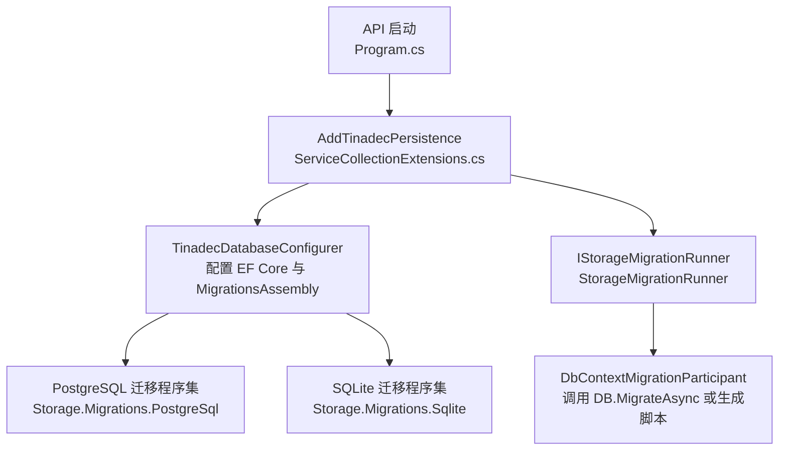
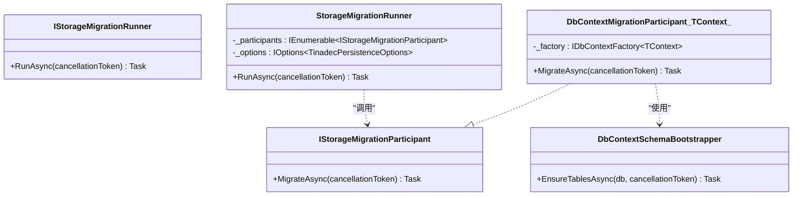
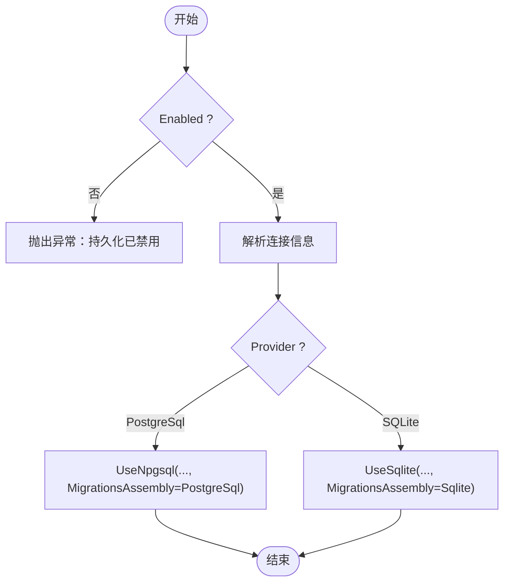
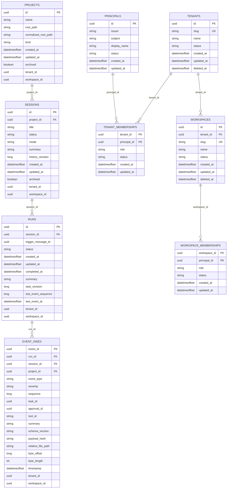
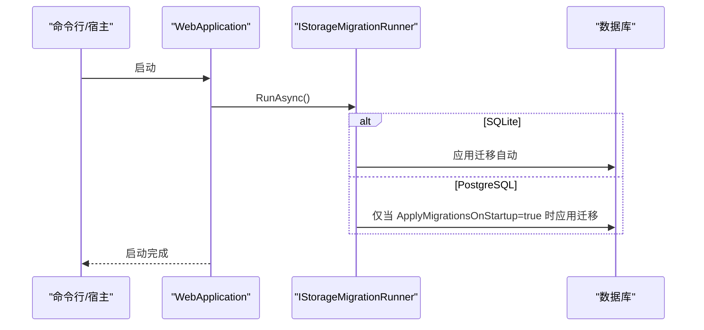
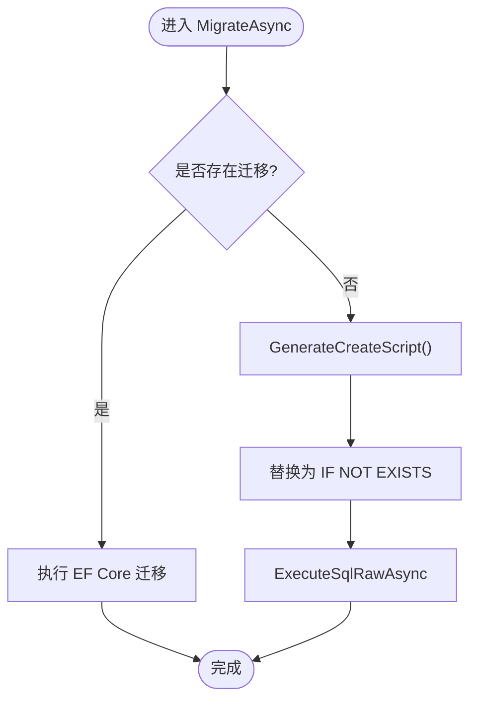
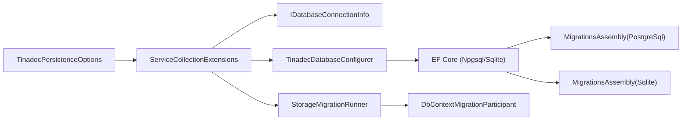

# 数据迁移管理

<cite>
**本文引用的文件**
- [StorageMigration.cs](file://TinadecCore\Persistence\StorageMigration.cs)
- [DbContextMigrationParticipant.cs](file://TinadecCore\Persistence\DbContextMigrationParticipant.cs)
- [ServiceCollectionExtensions.cs](file://TinadecCore\Persistence\ServiceCollectionExtensions.cs)
- [TinadecDatabaseConfigurer.cs](file://TinadecCore\Persistence\TinadecDatabaseConfigurer.cs)
- [TinadecPersistenceOptions.cs](file://TinadecCore\Persistence\TinadecPersistenceOptions.cs)
- [DatabaseProvider.cs](file://TinadecCore\Persistence\DatabaseProvider.cs)
- [InitialStorageMigrations.cs（PostgreSQL）](file://TinadecCore\Storage.Migrations.PostgreSql\InitialStorageMigrations.cs)
- [ControlPlaneMigrations.cs（PostgreSQL）](file://TinadecCore\Storage.Migrations.PostgreSql\ControlPlaneMigrations.cs)
- [InitialStorageMigrations.cs（SQLite）](file://TinadecCore\Storage.Migrations.Sqlite\InitialStorageMigrations.cs)
- [ControlPlaneMigrations.cs（SQLite）](file://TinadecCore\Storage.Migrations.Sqlite\ControlPlaneMigrations.cs)
- [Program.cs（API 启动）](file://TinadecCore\Api\Program.cs)
- [MigrationTests.cs](file://tests\TinadecCore.Tests\MigrationTests.cs)
</cite>

## 目录
1. [简介](#简介)
2. [项目结构](#项目结构)
3. [核心组件](#核心组件)
4. [架构总览](#架构总览)
5. [详细组件分析](#详细组件分析)
6. [依赖关系分析](#依赖关系分析)
7. [性能考量](#性能考量)
8. [故障排除指南](#故障排除指南)
9. [结论](#结论)
10. [附录](#附录)

## 简介
本文件面向 TinadecOffice 的数据迁移管理，聚焦于 PostgreSQL 与 SQLite 两种数据库的迁移脚本结构与命名规范、版本管理与回滚机制、部署流程，以及 StorageMigration 相关类的功能与用法。文档同时涵盖迁移冲突解决、数据转换与兼容性处理、最佳实践、生产环境安全考虑与监控策略，帮助读者在本地开发与生产部署中安全、稳定地演进数据库结构。

## 项目结构
迁移系统围绕 EF Core 的迁移装配与运行时协调器展开：
- 配置与注册：通过 ServiceCollectionExtensions 统一注册持久化选项、连接信息解析、数据库配置器与迁移运行器。
- 数据库提供者：支持 SQLite（默认）与 PostgreSQL，由 DatabaseProvider 枚举控制。
- 迁移参与者：每个业务 DbContext 通过 DbContextMigrationParticipant<TContext> 参与统一的迁移编排。
- 迁移脚本：按 Provider 拆分到独立程序集，避免跨提供者的类型泄漏。
- 启动流程：API 启动时根据配置决定是否执行迁移。



**图表来源**
- [Program.cs（API 启动）:20-39](file://TinadecCore\Api\Program.cs#L20-L39)
- [ServiceCollectionExtensions.cs:15-49](file://TinadecCore\Persistence\ServiceCollectionExtensions.cs#L15-L49)
- [TinadecDatabaseConfigurer.cs:19-46](file://TinadecCore\Persistence\TinadecDatabaseConfigurer.cs#L19-L46)
- [StorageMigration.cs:14-40](file://TinadecCore\Persistence\StorageMigration.cs#L14-L40)
- [DbContextMigrationParticipant.cs:12-24](file://TinadecCore\Persistence\DbContextMigrationParticipant.cs#L12-L24)

**章节来源**
- [ServiceCollectionExtensions.cs:15-49](file://TinadecCore\Persistence\ServiceCollectionExtensions.cs#L15-L49)
- [TinadecDatabaseConfigurer.cs:19-46](file://TinadecCore\Persistence\TinadecDatabaseConfigurer.cs#L19-L46)
- [Program.cs（API 启动）:20-39](file://TinadecCore\Api\Program.cs#L20-L39)

## 核心组件
- IStorageMigrationParticipant / StorageMigrationRunner：定义并实现迁移参与者接口与统一运行器，负责按顺序调用各模块的 MigrateAsync。
- DbContextMigrationParticipant<TContext>：为每个 DbContext 提供迁移适配，优先使用 EF Core 迁移；若无可用迁移则生成建表脚本并执行。
- TinadecDatabaseConfigurer：根据当前 Provider 选择 Npgsql 或 Sqlite，并指定对应的 MigrationsAssembly。
- TinadecPersistenceOptions：集中配置 Enabled、Provider、ApplyMigrationsOnStartup、DataRoot、ProbeTimeoutSeconds 等。
- DatabaseProvider：枚举 SQLite/PostgreSQL。

关键职责与交互：
- 启动阶段：Program 获取 IStorageMigrationRunner 并调用 RunAsync。
- Runner 读取配置，若禁用或 PostgreSQL 未开启 ApplyMigrationsOnStartup，则跳过。
- 遍历所有参与者，依次执行 MigrateAsync。
- 参与者内部先尝试 EF Core 迁移；若无迁移，则生成脚本并确保表存在。

**章节来源**
- [StorageMigration.cs:1-41](file://TinadecCore\Persistence\StorageMigration.cs#L1-L41)
- [DbContextMigrationParticipant.cs:1-37](file://TinadecCore\Persistence\DbContextMigrationParticipant.cs#L1-L37)
- [TinadecDatabaseConfigurer.cs:19-46](file://TinadecCore\Persistence\TinadecDatabaseConfigurer.cs#L19-L46)
- [TinadecPersistenceOptions.cs:1-48](file://TinadecCore\Persistence\TinadecPersistenceOptions.cs#L1-L48)
- [DatabaseProvider.cs:1-11](file://TinadecCore\Persistence\DatabaseProvider.cs#L1-L11)
- [Program.cs（API 启动）:20-39](file://TinadecCore\Api\Program.cs#L20-L39)

## 架构总览
下图展示了从 API 启动到数据库迁移执行的完整时序，包括配置解析、提供者选择、迁移程序集加载与参与者执行。

```mermaid
sequenceDiagram
participant App as "应用进程"
participant Program as "Program.cs"
participant DI as "服务容器"
participant Runner as "StorageMigrationRunner"
participant Participant as "DbContextMigrationParticipant<T>"
participant EF as "EF Core 数据库"
participant MigAsm as "迁移程序集(PostgreSql/Sqlite)"
App->>Program : 构建 WebApplication
Program->>DI : AddTinadecPersistence(...)
Program->>DI : GetRequiredService<IStorageMigrationRunner>()
Program->>Runner : RunAsync()
Runner->>Runner : 检查配置(Enabled, Provider, ApplyMigrationsOnStartup)
Runner->>Participant : MigrateAsync()
Participant->>EF : GetMigrations()
alt 有迁移
Participant->>EF : MigrateAsync()
else 无迁移
Participant->>EF : GenerateCreateScript()
Participant->>EF : ExecuteSqlRawAsync(IF NOT EXISTS)
end
Note over EF,MigAsm : 迁移脚本来自对应 Provider 的程序集
```

**图表来源**
- [Program.cs（API 启动）:20-39](file://TinadecCore\Api\Program.cs#L20-L39)
- [StorageMigration.cs:27-39](file://TinadecCore\Persistence\StorageMigration.cs#L27-L39)
- [DbContextMigrationParticipant.cs:12-24](file://TinadecCore\Persistence\DbContextMigrationParticipant.cs#L12-L24)
- [TinadecDatabaseConfigurer.cs:37-46](file://TinadecCore\Persistence\TinadecDatabaseConfigurer.cs#L37-L46)

## 详细组件分析

### 迁移参与者与运行器
- StorageMigrationRunner：依据配置决定是否执行迁移，并按顺序调用参与者。
- DbContextMigrationParticipant<TContext>：封装 EF Core 迁移逻辑与“无迁移时的脚本生成”兜底路径。



**图表来源**
- [StorageMigration.cs:1-41](file://TinadecCore\Persistence\StorageMigration.cs#L1-L41)
- [DbContextMigrationParticipant.cs:1-37](file://TinadecCore\Persistence\DbContextMigrationParticipant.cs#L1-L37)

**章节来源**
- [StorageMigration.cs:1-41](file://TinadecCore\Persistence\StorageMigration.cs#L1-L41)
- [DbContextMigrationParticipant.cs:1-37](file://TinadecCore\Persistence\DbContextMigrationParticipant.cs#L1-L37)

### 数据库配置与提供者选择
- TinadecDatabaseConfigurer：根据 Provider 选择 UseNpgsql 或 UseSqlite，并设置对应的 MigrationsAssembly。
- ServiceCollectionExtensions：绑定配置、解析连接字符串、注册迁移运行器与就绪探针。



**图表来源**
- [TinadecDatabaseConfigurer.cs:19-46](file://TinadecCore\Persistence\TinadecDatabaseConfigurer.cs#L19-L46)
- [ServiceCollectionExtensions.cs:64-120](file://TinadecCore\Persistence\ServiceCollectionExtensions.cs#L64-L120)

**章节来源**
- [TinadecDatabaseConfigurer.cs:19-46](file://TinadecCore\Persistence\TinadecDatabaseConfigurer.cs#L19-L46)
- [ServiceCollectionExtensions.cs:15-49](file://TinadecCore\Persistence\ServiceCollectionExtensions.cs#L15-L49)

### 迁移脚本结构与命名规范
- 按 Provider 拆分为两个程序集：
  - PostgreSql：TinadecCore.Storage.Migrations.PostgreSql
  - Sqlite：TinadecCore.Storage.Migrations.Sqlite
- 每个 DbContext 对应独立的迁移类，并通过 [DbContext(typeof(...))] 与 [Migration("YYYYMMDDHHmmSS_Name")] 标注。
- 命名建议：
  - 时间戳前缀保证顺序与可追溯性。
  - 名称语义化描述变更内容（如 MemoryInitial、LifecycleInitial、TenancyInitial、MemoryTenantScope）。
- 示例迁移：
  - 初始结构：projects、sessions、runs、event_index。
  - 多租户扩展：tenants、principals、tenant_memberships、workspaces、workspace_memberships，并在 Memory/Lifecycle 表中追加 tenant_id/workspace_id 列及索引。



**图表来源**
- [InitialStorageMigrations.cs（PostgreSQL）:10-41](file://TinadecCore\Storage.Migrations.PostgreSql\InitialStorageMigrations.cs#L10-L41)
- [ControlPlaneMigrations.cs（PostgreSQL）:9-51](file://TinadecCore\Storage.Migrations.PostgreSql\ControlPlaneMigrations.cs#L9-L51)
- [InitialStorageMigrations.cs（SQLite）:8-63](file://TinadecCore\Storage.Migrations.Sqlite\InitialStorageMigrations.cs#L8-L63)
- [ControlPlaneMigrations.cs（SQLite）:9-51](file://TinadecCore\Storage.Migrations.Sqlite\ControlPlaneMigrations.cs#L9-L51)

**章节来源**
- [InitialStorageMigrations.cs（PostgreSQL）:1-42](file://TinadecCore\Storage.Migrations.PostgreSql\InitialStorageMigrations.cs#L1-L42)
- [ControlPlaneMigrations.cs（PostgreSQL）:1-52](file://TinadecCore\Storage.Migrations.PostgreSql\ControlPlaneMigrations.cs#L1-L52)
- [InitialStorageMigrations.cs（SQLite）:1-64](file://TinadecCore\Storage.Migrations.Sqlite\InitialStorageMigrations.cs#L1-L64)
- [ControlPlaneMigrations.cs（SQLite）:1-52](file://TinadecCore\Storage.Migrations.Sqlite\ControlPlaneMigrations.cs#L1-L52)

### 版本管理策略与回滚机制
- 版本标识：迁移类上的 [Migration("YYYYMMDDHHmmSS_Name")] 作为唯一版本号，确保顺序与可回溯。
- 正向迁移：Up 方法创建表、索引、添加列等。
- 回滚迁移：Down 方法删除表或撤销变更（例如 Drop Table）。
- 执行策略：
  - SQLite：默认在本地启动时自动应用迁移（ApplyMigrationsOnStartup=true）。
  - PostgreSQL：需显式启用 ApplyMigrationsOnStartup，以避免多实例并发竞争导致 Schema 冲突。

**章节来源**
- [InitialStorageMigrations.cs（PostgreSQL）:10-41](file://TinadecCore\Storage.Migrations.PostgreSql\InitialStorageMigrations.cs#L10-L41)
- [ControlPlaneMigrations.cs（PostgreSQL）:9-51](file://TinadecCore\Storage.Migrations.PostgreSql\ControlPlaneMigrations.cs#L9-L51)
- [InitialStorageMigrations.cs（SQLite）:8-63](file://TinadecCore\Storage.Migrations.Sqlite\InitialStorageMigrations.cs#L8-L63)
- [ControlPlaneMigrations.cs（SQLite）:9-51](file://TinadecCore\Storage.Migrations.Sqlite\ControlPlaneMigrations.cs#L9-L51)
- [TinadecPersistenceOptions.cs:24-28](file://TinadecCore\Persistence\TinadecPersistenceOptions.cs#L24-L28)

### 部署流程与启动行为
- 启动入口：Program 在构建完成后，检查 Enable 与 IsConfigured，然后调用 IStorageMigrationRunner.RunAsync。
- 行为差异：
  - SQLite：默认自动迁移。
  - PostgreSQL：仅在 ApplyMigrationsOnStartup=true 时执行迁移。
- 就绪检查：Readiness 端点会探测存储状态，便于健康检查与滚动升级。



**图表来源**
- [Program.cs（API 启动）:20-39](file://TinadecCore\Api\Program.cs#L20-L39)
- [StorageMigration.cs:27-39](file://TinadecCore\Persistence\StorageMigration.cs#L27-L39)
- [TinadecPersistenceOptions.cs:24-28](file://TinadecCore\Persistence\TinadecPersistenceOptions.cs#L24-L28)

**章节来源**
- [Program.cs（API 启动）:20-39](file://TinadecCore\Api\Program.cs#L20-L39)
- [StorageMigration.cs:27-39](file://TinadecCore\Persistence\StorageMigration.cs#L27-L39)

### 迁移冲突解决、数据转换与兼容性处理
- 幂等性设计：
  - 迁移脚本中使用 if not exists 与默认值，避免重复创建导致的冲突。
  - 新增列带默认值，兼容旧数据。
- 无迁移时的兜底：
  - 若 EF Core 未发现迁移，则生成建表脚本并将 CREATE TABLE/INDEX 替换为 IF NOT EXISTS 后执行，确保首次启动即可用。
- 历史数据兼容：
  - 测试用例覆盖旧版模型初始化与字段补齐，确保向后兼容。



**图表来源**
- [DbContextMigrationParticipant.cs:12-24](file://TinadecCore\Persistence\DbContextMigrationParticipant.cs#L12-L24)

**章节来源**
- [DbContextMigrationParticipant.cs:12-24](file://TinadecCore\Persistence\DbContextMigrationParticipant.cs#L12-L24)
- [MigrationTests.cs:1-202](file://tests\TinadecCore.Tests\MigrationTests.cs#L1-L202)

### StorageMigration 类的使用方法与注意事项
- 使用方法：
  - 通过 DI 获取 IStorageMigrationRunner，调用 RunAsync。
  - 业务模块只需实现 IStorageMigrationParticipant（或使用 DbContextMigrationParticipant<TContext>），框架将自动编排执行。
- 注意事项：
  - PostgreSQL 多实例部署务必关闭 ApplyMigrationsOnStartup，改为外部工具或单实例窗口执行迁移，避免并发竞争。
  - 保持迁移脚本幂等，避免重复执行失败。
  - 对大表变更建议使用分步迁移与在线变更策略。

**章节来源**
- [StorageMigration.cs:1-41](file://TinadecCore\Persistence\StorageMigration.cs#L1-L41)
- [TinadecPersistenceOptions.cs:24-28](file://TinadecCore\Persistence\TinadecPersistenceOptions.cs#L24-L28)

## 依赖关系分析
- 配置层：TinadecPersistenceOptions 绑定配置段，ValidateOnStart 校验参数范围。
- 连接层：ServiceCollectionExtensions 解析连接字符串（SQLite 文件或 PostgreSQL ConnectionStrings）。
- 配置器：TinadecDatabaseConfigurer 注入 Provider 特定的 EF Core 配置与迁移程序集。
- 运行层：StorageMigrationRunner 协调多个参与者。
- 迁移层：PostgreSql/Sqlite 各自程序集包含对应 DbContext 的迁移类。



**图表来源**
- [ServiceCollectionExtensions.cs:15-49](file://TinadecCore\Persistence\ServiceCollectionExtensions.cs#L15-L49)
- [TinadecDatabaseConfigurer.cs:19-46](file://TinadecCore\Persistence\TinadecDatabaseConfigurer.cs#L19-L46)
- [StorageMigration.cs:14-40](file://TinadecCore\Persistence\StorageMigration.cs#L14-L40)

**章节来源**
- [ServiceCollectionExtensions.cs:15-49](file://TinadecCore\Persistence\ServiceCollectionExtensions.cs#L15-L49)
- [TinadecDatabaseConfigurer.cs:19-46](file://TinadecCore\Persistence\TinadecDatabaseConfigurer.cs#L19-L46)
- [StorageMigration.cs:14-40](file://TinadecCore\Persistence\StorageMigration.cs#L14-L40)

## 性能考量
- 迁移批量化：尽量将小变更合并至同一迁移，减少往返次数。
- 索引策略：为大查询热点列建立合适索引，避免全表扫描。
- 大表变更：采用增量方式（先加列/索引，再回填数据，最后切换约束），降低锁持有时间。
- 并发控制：PostgreSQL 多实例禁用自动迁移，避免并发写元数据。
- 脚本优化：使用 IF NOT EXISTS 与批量语句，减少重复执行开销。

[本节为通用指导，不直接分析具体文件]

## 故障排除指南
- 常见问题与定位：
  - 未启用持久化：抛出“持久化已禁用”异常。检查 TinadecPersistence:Enabled。
  - 连接未配置：SQLite 缺少 DatabasePath 或 PostgreSQL 缺少 ConnectionStrings。检查相应配置项。
  - 迁移未执行：PostgreSQL 未开启 ApplyMigrationsOnStartup。按需启用或在外部执行迁移。
  - 重复迁移错误：确认迁移脚本幂等性（IF NOT EXISTS、默认值）。
- 诊断步骤：
  - 查看 Readiness 端点返回的存储状态与详情。
  - 检查日志中的迁移执行与 SQL 执行结果。
  - 验证迁移程序集是否被正确引用（MigrationsAssembly）。
- 恢复策略：
  - 备份数据库后再执行回滚或修复迁移。
  - 对于无迁移场景，确保脚本生成路径正常执行。

**章节来源**
- [TinadecDatabaseConfigurer.cs:23-35](file://TinadecCore\Persistence\TinadecDatabaseConfigurer.cs#L23-L35)
- [ServiceCollectionExtensions.cs:64-120](file://TinadecCore\Persistence\ServiceCollectionExtensions.cs#L64-L120)
- [Program.cs（API 启动）:20-39](file://TinadecCore\Api\Program.cs#L20-L39)

## 结论
本迁移体系以 EF Core 为核心，结合 Provider 分离的迁移程序集与统一的参与者编排，实现了 SQLite 与 PostgreSQL 的一致体验与可控部署。通过幂等脚本、兜底脚本生成与明确的启动策略，既满足本地开发便捷性，又保障生产环境的稳定性与可观测性。遵循本文的最佳实践与故障排除建议，可在演进过程中有效降低风险。

[本节为总结，不直接分析具体文件]

## 附录
- 迁移命名规范清单：
  - 时间戳前缀：YYYYMMDDHHmmSS
  - 语义化名称：描述变更主题（如 Initial、TenantScope）
  - 按 DbContext 拆分迁移类，避免跨域耦合
- 生产部署建议：
  - PostgreSQL 禁用自动迁移，使用 CI/CD 或运维工具执行迁移
  - 变更前进行全量备份与预演
  - 监控迁移耗时与错误率，设置告警阈值
  - 灰度发布与快速回滚预案

[本节为补充说明，不直接分析具体文件]