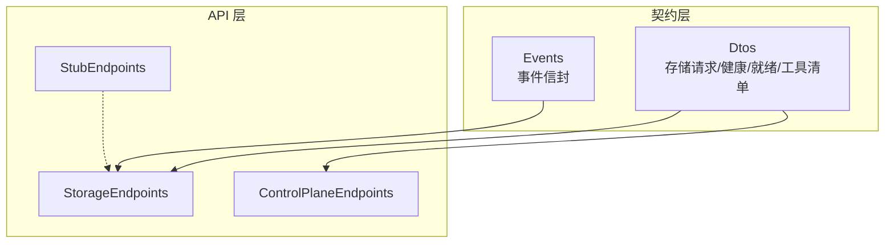
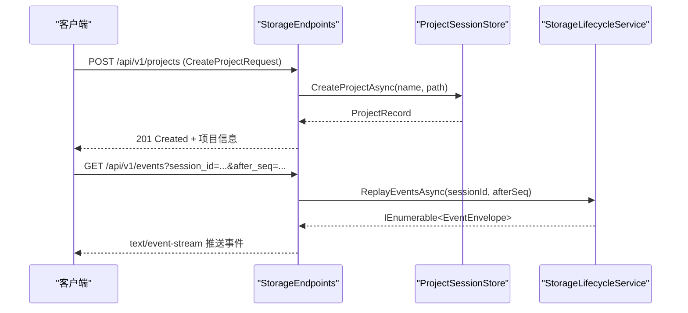
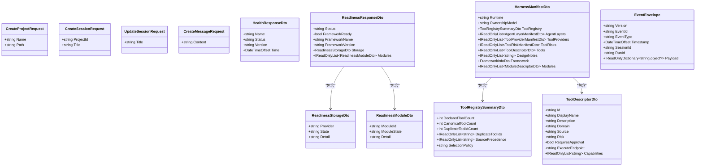
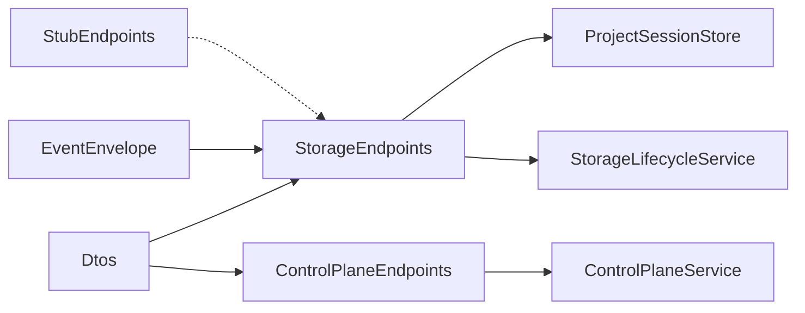

# 核心契约定义

<cite>
**本文引用的文件**
- [EventEnvelope.cs](file://TinadecCore/Contracts/Events/EventEnvelope.cs)
- [HarnessManifestDto.cs](file://TinadecCore/Contracts/Dtos/HarnessManifestDto.cs)
- [HealthResponseDto.cs](file://TinadecCore/Contracts/Dtos/HealthResponseDto.cs)
- [ReadinessResponseDto.cs](file://TinadecCore/Contracts/Dtos/ReadinessResponseDto.cs)
- [StorageRequestDtos.cs](file://TinadecCore/Contracts/Dtos/StorageRequestDtos.cs)
- [ToolManifestDtos.cs](file://TinadecCore/Contracts/Dtos/ToolManifestDtos.cs)
- [StorageEndpoints.cs](file://TinadecCore/Api/Endpoints/StorageEndpoints.cs)
- [ControlPlaneEndpoints.cs](file://TinadecCore/Api/Endpoints/ControlPlaneEndpoints.cs)
- [StubEndpoints.cs](file://TinadecCore/Api/Endpoints/StubEndpoints.cs)
- [EventEnvelopeTests.cs](file://tests/Tinadec.Contracts.Tests/EventEnvelopeTests.cs)
</cite>

## 目录
1. [简介](#简介)
2. [项目结构](#项目结构)
3. [核心组件](#核心组件)
4. [架构总览](#架构总览)
5. [详细组件分析](#详细组件分析)
6. [依赖关系分析](#依赖关系分析)
7. [性能考虑](#性能考虑)
8. [故障排查指南](#故障排查指南)
9. [结论](#结论)
10. [附录](#附录)

## 简介
本文件系统化梳理 TinadecOffice 的核心契约，重点覆盖：
- DTO 数据传输对象的结构、字段与约束
- 事件信封 EventEnvelope 的格式、消息类型与序列化规范
- 数据传输契约的版本管理策略
- 完整的 JSON Schema 示例与 API 使用模式
- 数据验证、错误处理与兼容性考虑
- 基于代码的实际调用流程与使用示例（以路径引用代替具体代码片段）

## 项目结构
核心契约位于 TinadecCore/Contracts 下，分为 Dtos 与 Events 两个子目录；API 端点通过 StorageEndpoints、ControlPlaneEndpoints、StubEndpoints 暴露 HTTP 接口，消费上述 DTO 与事件。



图表来源
- [StorageEndpoints.cs:1-101](file://TinadecCore/Api/Endpoints/StorageEndpoints.cs#L1-L101)
- [ControlPlaneEndpoints.cs:1-46](file://TinadecCore/Api/Endpoints/ControlPlaneEndpoints.cs#L1-L46)
- [StubEndpoints.cs:1-242](file://TinadecCore/Api/Endpoints/StubEndpoints.cs#L1-L242)
- [StorageRequestDtos.cs:1-25](file://TinadecCore/Contracts/Dtos/StorageRequestDtos.cs#L1-L25)
- [EventEnvelope.cs:1-33](file://TinadecCore/Contracts/Events/EventEnvelope.cs#L1-L33)

章节来源
- [StorageEndpoints.cs:1-101](file://TinadecCore/Api/Endpoints/StorageEndpoints.cs#L1-L101)
- [ControlPlaneEndpoints.cs:1-46](file://TinadecCore/Api/Endpoints/ControlPlaneEndpoints.cs#L1-L46)
- [StubEndpoints.cs:1-242](file://TinadecCore/Api/Endpoints/StubEndpoints.cs#L1-L242)

## 核心组件
本节对核心契约进行结构化说明，包括字段含义、默认值、必填性与校验规则。

### 存储相关请求 DTO
- CreateProjectRequest
  - Name: string，必填，非空
  - Path: string，必填，非空
- CreateSessionRequest
  - ProjectId: string，必填，需为有效 GUID
  - Title: string?，可选
- UpdateSessionRequest
  - Title: string，必填，非空
- CreateMessageRequest
  - Content: string，必填，非空

章节来源
- [StorageRequestDtos.cs:1-25](file://TinadecCore/Contracts/Dtos/StorageRequestDtos.cs#L1-L25)

### 健康与就绪响应 DTO
- HealthResponseDto
  - Name: string，默认 "tinadec-core"
  - Status: string，默认 "ok"
  - Version: string，默认 "0.1.0"
  - Time: DateTimeOffset，UTC 时间
- ReadinessResponseDto
  - Status: string，默认 "ready"
  - FrameworkReady: bool，默认 true
  - FrameworkName: string，默认 "Microsoft Agent Framework"
  - FrameworkVersion: string，默认 "1.13.0"
  - Storage: ReadinessStorageDto?，可选
  - Modules: IReadOnlyList<ReadinessModuleDto>，默认空列表
- ReadinessModuleDto
  - ModuleId: string，必填
  - ModuleState: string，默认 "not_configured"
  - Detail: string?，可选
- ReadinessStorageDto
  - Provider: string，默认 "sqlite"
  - State: string，默认 "not_configured"
  - Detail: string?，可选

章节来源
- [HealthResponseDto.cs:1-13](file://TinadecCore/Contracts/Dtos/HealthResponseDto.cs#L1-L13)
- [ReadinessResponseDto.cs:1-32](file://TinadecCore/Contracts/Dtos/ReadinessResponseDto.cs#L1-L32)

### 工具与清单 DTO
- ToolRegistrySummaryDto
  - DeclaredToolCount: int
  - CanonicalToolCount: int
  - DuplicateToolIdCount: int
  - DuplicateToolIds: IReadOnlyList<string>
  - SourcePrecedence: IReadOnlyList<string>
  - SelectionPolicy: string，默认 "first-source-wins"
- AgentLayerManifestDto
  - Layer: string
  - Role: string
  - AgentCount: int
  - EnabledAgentCount: int
  - MaxParallelExecutors: int
  - WorktreeIsolation: bool
  - ApprovalRequired: bool
  - AgentTypes: IReadOnlyList<string>
  - ToolIds: IReadOnlyList<string>
- ToolProviderManifestDto
  - Source: string
  - DisplayName: string
  - Layer: string
  - Status: string，默认 "active"
  - ToolCount: int
  - ActiveToolCount: int
  - FutureToolCount: int
  - ApprovalRequiredCount: int
  - ReadOnlyCount: int
  - CapabilityPrefixes: IReadOnlyList<string>
- ToolRiskManifestDto
  - Risk: string
  - ToolCount: int
  - RequiresHumanCheckpoint: bool
  - PolicySummary: string
- ToolDescriptorDto
  - Id: string
  - DisplayName: string
  - Description: string
  - Domain: string
  - Source: string
  - Risk: string，默认 "low"
  - RequiresApproval: bool
  - ExecuteEndpoint: string
  - Capabilities: IReadOnlyList<string>
- HarnessManifestDto
  - Runtime: string，默认 "tinadec-core-maf"
  - OwnershipModel: string，默认 "core-authoritative"
  - ToolRegistry: ToolRegistrySummaryDto
  - AgentLayers: IReadOnlyList<AgentLayerManifestDto>
  - ToolProviders: IReadOnlyList<ToolProviderManifestDto>
  - ToolRisks: IReadOnlyList<ToolRiskManifestDto>
  - Tools: IReadOnlyList<ToolDescriptorDto>
  - DesignNotes: IReadOnlyList<string>
  - Framework: FrameworkInfoDto
  - Modules: IReadOnlyList<ModuleDescriptorDto>
- FrameworkInfoDto
  - Name: string，默认 "Microsoft Agent Framework"
  - Version: string，默认 "1.13.0"
  - Primitives: IReadOnlyList<string>
- ModuleDescriptorDto
  - ModuleId: string
  - Version: string，默认 "0.1.0"
  - Dependencies: IReadOnlyList<string>
  - Capabilities: IReadOnlyList<string>
  - Language: string，默认 "C#"
  - MafPrimitives: IReadOnlyList<string>
  - RegistrationStatus: string，默认 "registered"

章节来源
- [ToolManifestDtos.cs:1-60](file://TinadecCore/Contracts/Dtos/ToolManifestDtos.cs#L1-L60)
- [HarnessManifestDto.cs:1-53](file://TinadecCore/Contracts/Dtos/HarnessManifestDto.cs#L1-L53)

### 事件信封 EventEnvelope
- Version: string，默认常量 SchemaVersion="1.0"
- event_id: string，自动生成 GUID（小写无分隔符）
- event_type: string，必填，标识事件类型
- timestamp: DateTimeOffset，默认 UTC 当前时间
- session_id: string?，可选
- run_id: string?，可选
- payload: IReadOnlyDictionary<string, object?>，默认空字典

序列化约定
- 边界采用 snake_case 命名（event_id、event_type、timestamp、session_id、run_id、payload）
- 键名与值均支持 snake_case 策略（测试中启用 DictionaryKeyPolicy.SnakeCaseLower）

章节来源
- [EventEnvelope.cs:1-33](file://TinadecCore/Contracts/Events/EventEnvelope.cs#L1-L33)
- [EventEnvelopeTests.cs:1-31](file://tests/Tinadec.Contracts.Tests/EventEnvelopeTests.cs#L1-L31)

## 架构总览
下图展示 API 端点如何消费 DTO 并返回标准化响应，以及事件流的重放机制。



图表来源
- [StorageEndpoints.cs:16-25](file://TinadecCore/Api/Endpoints/StorageEndpoints.cs#L16-L25)
- [StorageEndpoints.cs:77-90](file://TinadecCore/Api/Endpoints/StorageEndpoints.cs#L77-L90)

章节来源
- [StorageEndpoints.cs:1-101](file://TinadecCore/Api/Endpoints/StorageEndpoints.cs#L1-L101)

## 详细组件分析

### 存储类 API 契约与验证
- 项目创建
  - 输入: CreateProjectRequest
  - 成功: 201 Created，返回项目摘要
  - 失败: 400 INVALID_PROJECT、409 DUPLICATE_PROJECT_ROOT
- 会话列表
  - 查询参数: projectId 或 project_id（兼容），需为 GUID
  - 失败: 400 INVALID_PROJECT_ID
- 会话创建
  - 输入: CreateSessionRequest
  - 失败: 400 INVALID_PROJECT_ID、404 PROJECT_NOT_FOUND
- 会话更新
  - 输入: UpdateSessionRequest
  - 失败: 400 INVALID_SESSION、404 SESSION_NOT_FOUND
- 消息列表
  - 失败: 400 INVALID_SESSION_ID、404 SESSION_NOT_FOUND
- 消息创建
  - 输入: CreateMessageRequest
  - 失败: 400 INVALID_SESSION_ID、404 SESSION_NOT_FOUND、400 INVALID_MESSAGE
- 事件回放
  - 查询参数: sessionId 或 session_id（兼容）、afterSeq 或 after_seq
  - 输出: text/event-stream，逐条推送 EventEnvelope

章节来源
- [StorageEndpoints.cs:16-90](file://TinadecCore/Api/Endpoints/StorageEndpoints.cs#L16-L90)

### 控制面 API 契约（模型、提示词、代理等）
- 模型提供者模板与提供者
  - GET/POST/PUT/DELETE /api/v1/model-providers*
  - GET /api/v1/model-provider-templates
- 路由与设置
  - GET/PUT /api/v1/model-routes/{purpose}
  - GET/PUT /api/v1/model-settings（部分能力未实现时返回 501）
- 提示词片段
  - GET/POST/PUT/DELETE /api/v1/prompt-fragments*
  - 版本与回滚相关端点在骨架模式下返回 501
- 代理与审批
  - GET/PUT /api/v1/agents*
  - GET/POST/POST /api/v1/approvals*

章节来源
- [ControlPlaneEndpoints.cs:1-46](file://TinadecCore/Api/Endpoints/ControlPlaneEndpoints.cs#L1-L46)

### 骨架模式端点（Stub）
- 健康检查、就绪性、调试快照等 GET 端点返回默认空集合或骨架数据
- 写入端点统一返回 501 Not Implemented
- 用于 Gateway/BFF 在功能未启用时的稳定集成

章节来源
- [StubEndpoints.cs:1-242](file://TinadecCore/Api/Endpoints/StubEndpoints.cs#L1-L242)

### 事件信封序列化与版本策略
- 版本常量
  - SchemaVersion = "1.0"，作为默认 Version
- 命名约定
  - 所有属性在 JSON 边界使用 snake_case
  - 字典键也遵循 snake_case（测试中启用）
- 载荷设计
  - payload 为键值对字典，便于扩展且保持向后兼容
- 兼容性建议
  - 新增字段应可选且具备默认值
  - 消费者应忽略未知字段
  - 事件类型 EventType 用于区分语义变化

章节来源
- [EventEnvelope.cs:1-33](file://TinadecCore/Contracts/Events/EventEnvelope.cs#L1-L33)
- [EventEnvelopeTests.cs:1-31](file://tests/Tinadec.Contracts.Tests/EventEnvelopeTests.cs#L1-L31)

### DTO 类图（契约结构）


图表来源
- [StorageRequestDtos.cs:1-25](file://TinadecCore/Contracts/Dtos/StorageRequestDtos.cs#L1-L25)
- [HealthResponseDto.cs:1-13](file://TinadecCore/Contracts/Dtos/HealthResponseDto.cs#L1-L13)
- [ReadinessResponseDto.cs:1-32](file://TinadecCore/Contracts/Dtos/ReadinessResponseDto.cs#L1-L32)
- [ToolManifestDtos.cs:1-60](file://TinadecCore/Contracts/Dtos/ToolManifestDtos.cs#L1-L60)
- [HarnessManifestDto.cs:1-53](file://TinadecCore/Contracts/Dtos/HarnessManifestDto.cs#L1-L53)
- [EventEnvelope.cs:1-33](file://TinadecCore/Contracts/Events/EventEnvelope.cs#L1-L33)

## 依赖关系分析
- StorageEndpoints 依赖 Dtos 中的请求体与内部服务（ProjectSessionStore、StorageLifecycleService）
- ControlPlaneEndpoints 依赖运行时服务（ControlPlaneService）
- StubEndpoints 提供占位端点，保证前端/Gateway 在功能未启用时的稳定性
- EventEnvelope 被事件回放端点直接序列化为 SSE 流



图表来源
- [StorageEndpoints.cs:1-101](file://TinadecCore/Api/Endpoints/StorageEndpoints.cs#L1-L101)
- [ControlPlaneEndpoints.cs:1-46](file://TinadecCore/Api/Endpoints/ControlPlaneEndpoints.cs#L1-L46)
- [StubEndpoints.cs:1-242](file://TinadecCore/Api/Endpoints/StubEndpoints.cs#L1-L242)

章节来源
- [StorageEndpoints.cs:1-101](file://TinadecCore/Api/Endpoints/StorageEndpoints.cs#L1-L101)
- [ControlPlaneEndpoints.cs:1-46](file://TinadecCore/Api/Endpoints/ControlPlaneEndpoints.cs#L1-L46)
- [StubEndpoints.cs:1-242](file://TinadecCore/Api/Endpoints/StubEndpoints.cs#L1-L242)

## 性能考虑
- 事件回放采用 Server-Sent Events（SSE）流式推送，避免一次性加载大量事件
- DTO 使用只读集合（IReadOnlyList/IReadOnlyDictionary）减少不必要的拷贝
- 健康与就绪响应为轻量级结构，适合频繁轮询
- 建议在消费者侧对 payload 做增量解析与缓存，避免重复反序列化

## 故障排查指南
- 常见错误码与场景
  - INVALID_PROJECT_ID / INVALID_SESSION_ID：GUID 校验失败
  - PROJECT_NOT_FOUND / SESSION_NOT_FOUND：资源不存在
  - INVALID_PROJECT / INVALID_SESSION / INVALID_MESSAGE：参数校验失败
  - DUPLICATE_PROJECT_ROOT：项目根路径冲突
  - 501 Not Implemented：骨架模式下未实现的功能
- 定位步骤
  - 检查请求体字段是否符合 DTO 定义与必填要求
  - 确认查询参数是否同时提供兼容字段（如 projectId/project_id）
  - 查看事件回放流的 event_type 与 payload 内容
  - 在骨架模式下确认对应端点是否已启用真实实现

章节来源
- [StorageEndpoints.cs:16-90](file://TinadecCore/Api/Endpoints/StorageEndpoints.cs#L16-L90)
- [StubEndpoints.cs:101-242](file://TinadecCore/Api/Endpoints/StubEndpoints.cs#L101-L242)

## 结论
- 契约层清晰分离了 DTO 与事件信封，便于跨进程/跨语言集成
- 事件信封采用 snake_case 与版本常量，确保边界一致性与演进可控
- API 端点提供完善的错误码与兼容字段，提升鲁棒性
- 骨架模式端点保障开发/集成阶段的稳定性

## 附录

### JSON Schema 示例（节选）
以下为关键契约的 JSON Schema 片段，供客户端与服务端共同校验。

- CreateProjectRequest
```json
{
  "$schema": "http://json-schema.org/draft-07/schema#",
  "type": "object",
  "required": ["name", "path"],
  "properties": {
    "name": { "type": "string", "minLength": 1 },
    "path": { "type": "string", "minLength": 1 }
  }
}
```

- CreateSessionRequest
```json
{
  "$schema": "http://json-schema.org/draft-07/schema#",
  "type": "object",
  "required": ["project_id"],
  "properties": {
    "project_id": { "type": "string", "format": "uuid" },
    "title": { "type": "string" }
  }
}
```

- UpdateSessionRequest
```json
{
  "$schema": "http://json-schema.org/draft-07/schema#",
  "type": "object",
  "required": ["title"],
  "properties": {
    "title": { "type": "string", "minLength": 1 }
  }
}
```

- CreateMessageRequest
```json
{
  "$schema": "http://json-schema.org/draft-07/schema#",
  "type": "object",
  "required": ["content"],
  "properties": {
    "content": { "type": "string", "minLength": 1 }
  }
}
```

- HealthResponseDto
```json
{
  "$schema": "http://json-schema.org/draft-07/schema#",
  "type": "object",
  "properties": {
    "name": { "type": "string" },
    "status": { "type": "string" },
    "version": { "type": "string" },
    "time": { "type": "string", "format": "date-time" }
  }
}
```

- ReadinessResponseDto
```json
{
  "$schema": "http://json-schema.org/draft-07/schema#",
  "type": "object",
  "properties": {
    "status": { "type": "string" },
    "framework_ready": { "type": "boolean" },
    "framework_name": { "type": "string" },
    "framework_version": { "type": "string" },
    "storage": {
      "type": "object",
      "properties": {
        "provider": { "type": "string" },
        "state": { "type": "string" },
        "detail": { "type": "string" }
      }
    },
    "modules": {
      "type": "array",
      "items": {
        "type": "object",
        "properties": {
          "module_id": { "type": "string" },
          "module_state": { "type": "string" },
          "detail": { "type": "string" }
        }
      }
    }
  }
}
```

- EventEnvelope
```json
{
  "$schema": "http://json-schema.org/draft-07/schema#",
  "type": "object",
  "required": ["version", "event_id", "event_type", "timestamp", "payload"],
  "properties": {
    "version": { "type": "string", "const": "1.0" },
    "event_id": { "type": "string", "pattern": "^[0-9a-f]{32}$" },
    "event_type": { "type": "string" },
    "timestamp": { "type": "string", "format": "date-time" },
    "session_id": { "type": "string" },
    "run_id": { "type": "string" },
    "payload": {
      "type": "object",
      "additionalProperties": true
    }
  }
}
```

### API 使用模式（示例）
- 创建项目
  - POST /api/v1/projects
  - Body: CreateProjectRequest
  - 成功: 201 Created，返回项目摘要
  - 失败: 400/409（见错误码）
- 创建会话
  - POST /api/v1/sessions
  - Body: CreateSessionRequest
  - 成功: 201 Created，返回会话摘要
  - 失败: 400/404（见错误码）
- 更新会话标题
  - PATCH /api/v1/sessions/{sessionId}
  - Body: UpdateSessionRequest
  - 失败: 400/404（见错误码）
- 发送消息
  - POST /api/v1/sessions/{sessionId}/messages
  - Body: CreateMessageRequest
  - 失败: 400/404（见错误码）
- 事件回放
  - GET /api/v1/events?session_id={id}&after_seq={n}
  - 响应: text/event-stream，逐条推送 EventEnvelope

章节来源
- [StorageEndpoints.cs:16-90](file://TinadecCore/Api/Endpoints/StorageEndpoints.cs#L16-L90)

### 版本管理与兼容性策略
- 事件版本
  - EventEnvelope.Version 固定为 SchemaVersion="1.0"
  - 未来可通过增加新的 SchemaVersion 并维护多版本解析器
- 字段演进
  - 新增字段应为可选并提供默认值
  - 删除字段应标记废弃并在多个大版本后移除
- 命名与序列化
  - 边界统一 snake_case，字典键亦遵循该策略
- 兼容性测试
  - 参考 EventEnvelopeTests 的序列化断言，确保键名与值策略符合预期

章节来源
- [EventEnvelope.cs:1-33](file://TinadecCore/Contracts/Events/EventEnvelope.cs#L1-L33)
- [EventEnvelopeTests.cs:1-31](file://tests/Tinadec.Contracts.Tests/EventEnvelopeTests.cs#L1-L31)