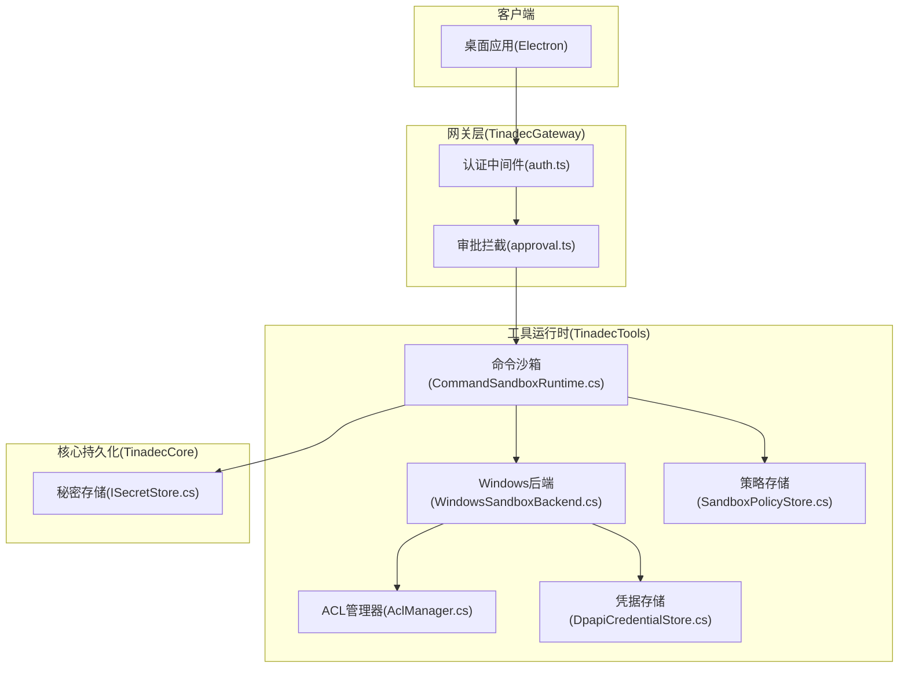
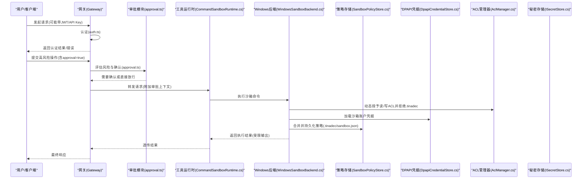
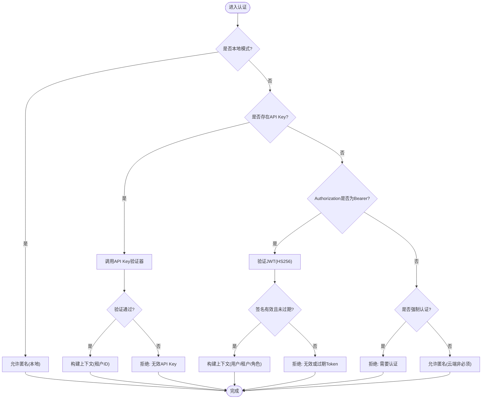
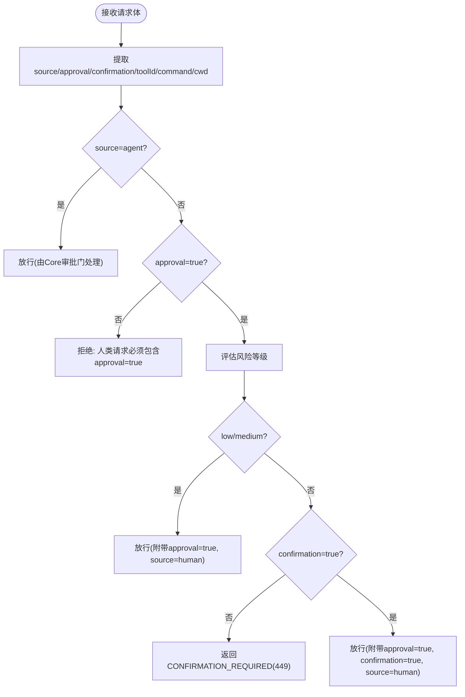
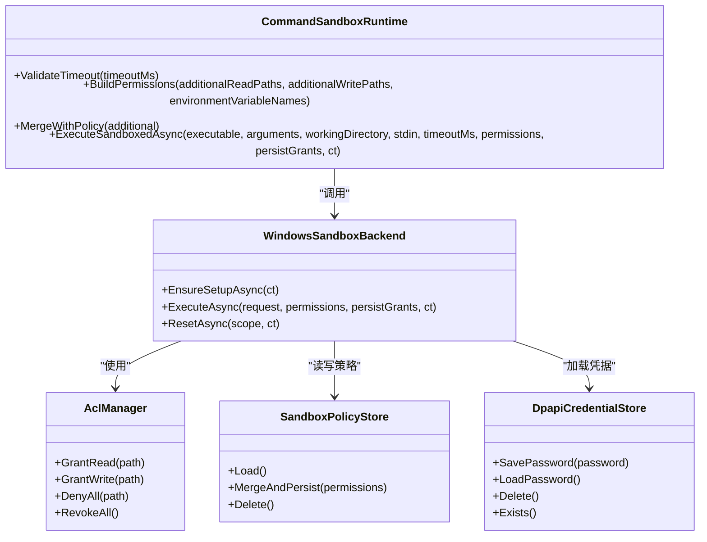
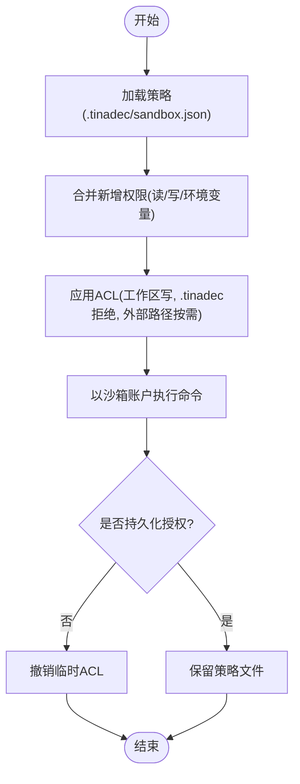
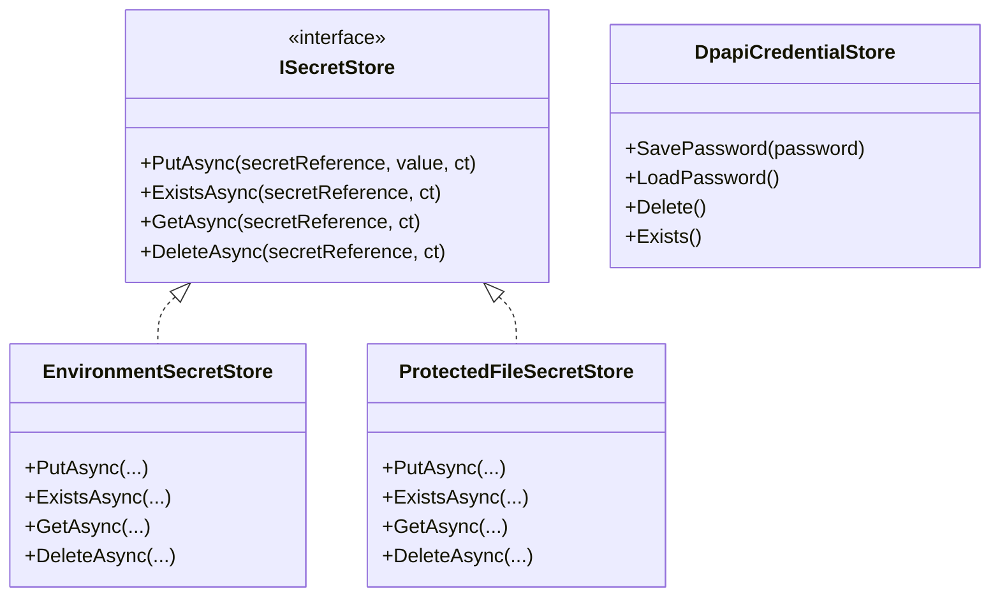
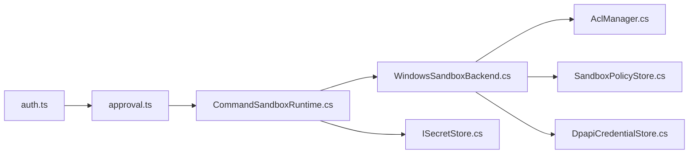
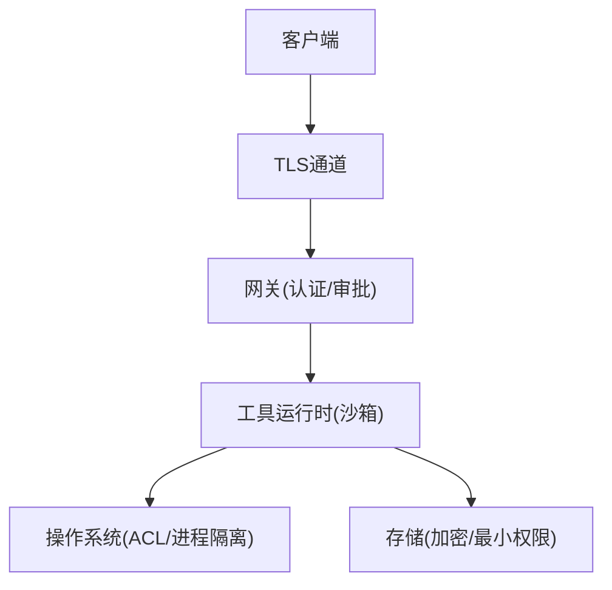

# 安全架构设计

<cite>
**本文引用的文件**   
- [security.md](file://docs/security.md)
- [auth.ts](file://TinadecGateway/src/auth.ts)
- [approval.ts](file://TinadecGateway/src/approval.ts)
- [ISecretStore.cs](file://TinadecCore/Persistence/ISecretStore.cs)
- [SandboxPolicyStore.cs](file://TinadecTools/Runtime/Sandbox/SandboxPolicyStore.cs)
- [WindowsSandboxBackend.cs](file://TinadecTools/Runtime/Sandbox/Windows/WindowsSandboxBackend.cs)
- [DpapiCredentialStore.cs](file://TinadecTools/Runtime/Sandbox/Windows/DpapiCredentialStore.cs)
- [AclManager.cs](file://TinadecTools/Runtime/Sandbox/Windows/AclManager.cs)
- [CommandSandboxRuntime.cs](file://TinadecTools/Runtime/Sandbox/CommandSandboxRuntime.cs)
- [PermissionPolicyTests.cs](file://tests/Tinadec.Contracts.Tests/PermissionPolicyTests.cs)
</cite>

## 目录
1. [引言](#引言)
2. [项目结构](#项目结构)
3. [核心组件](#核心组件)
4. [架构总览](#架构总览)
5. [详细组件分析](#详细组件分析)
6. [依赖关系分析](#依赖关系分析)
7. [性能考量](#性能考量)
8. [故障排查指南](#故障排查指南)
9. [结论](#结论)
10. [附录](#附录)

## 引言
本设计文档聚焦 TinadecOffice 的安全架构，覆盖认证与授权、审批门控、沙箱隔离策略、权限模型与访问控制列表（ACL）、资源隔离、敏感数据处理与加密存储、密钥管理、安全最佳实践、漏洞防护与安全审计。目标是帮助开发者与运维人员理解系统如何以最小权限原则运行，如何在人类与 Agent 之间进行可控的执行边界，以及如何持久化与保护敏感数据。

## 项目结构
从安全视角看，系统由以下关键部分组成：
- 网关层（TinadecGateway）：负责认证、租户上下文注入、高风险操作二次确认。
- 工具运行时（TinadecTools）：提供命令执行沙箱、文件系统访问控制、策略持久化。
- 核心持久化（TinadecCore.Persistence）：提供秘密材料存储抽象与平台实现（如 DPAPI）。
- 桌面端（Electron）：通过最小化 preload API 与隔离环境降低渲染进程风险。

**图表来源** 
- [auth.ts:1-112](file://TinadecGateway/src/auth.ts#L1-L112)
- [approval.ts:1-197](file://TinadecGateway/src/approval.ts#L1-L197)
- [CommandSandboxRuntime.cs:1-129](file://TinadecTools/Runtime/Sandbox/CommandSandboxRuntime.cs#L1-L129)
- [WindowsSandboxBackend.cs:1-161](file://TinadecTools/Runtime/Sandbox/Windows/WindowsSandboxBackend.cs#L1-L161)
- [AclManager.cs:1-62](file://TinadecTools/Runtime/Sandbox/Windows/AclManager.cs#L1-L62)
- [SandboxPolicyStore.cs:1-83](file://TinadecTools/Runtime/Sandbox/SandboxPolicyStore.cs#L1-L83)
- [DpapiCredentialStore.cs:1-90](file://TinadecTools/Runtime/Sandbox/Windows/DpapiCredentialStore.cs#L1-L90)
- [ISecretStore.cs:1-65](file://TinadecCore/Persistence/ISecretStore.cs#L1-L65)

**章节来源**
- [security.md:1-18](file://docs/security.md#L1-L18)

## 核心组件
- 认证与租户上下文（Gateway）
  - 支持本地模式跳过认证；云端模式支持 Bearer JWT（HS256）或 API Key 校验。
  - 将 tenant_id、user_id 注入下游请求头，用于后续授权与审计。
- 审批门控（Gateway）
  - 对高风险工具（如命令执行、Git 高危操作、文件写入等）要求二次确认。
  - 人类请求需携带 approval=true；Agent 请求走 Core 审批门流程。
- 沙箱隔离（Tools）
  - Windows 下使用独立账户运行子进程，按白名单授予读/写路径与环境变量。
  - 工作区内的 .tinadec 目录默认拒绝访问，策略文件 gitignored。
  - 超时与取消终止进程树，输出流限制大小。
- 秘密存储（Core）
  - 抽象 ISecretStore，Windows 使用 DPAPI 保护敏感值，非 Windows 明文落盘（开发用途）。
  - 环境变量读取用于开发/部署注入。

**章节来源**
- [auth.ts:1-112](file://TinadecGateway/src/auth.ts#L1-L112)
- [approval.ts:1-197](file://TinadecGateway/src/approval.ts#L1-L197)
- [CommandSandboxRuntime.cs:1-129](file://TinadecTools/Runtime/Sandbox/CommandSandboxRuntime.cs#L1-L129)
- [WindowsSandboxBackend.cs:1-161](file://TinadecTools/Runtime/Sandbox/Windows/WindowsSandboxBackend.cs#L1-L161)
- [AclManager.cs:1-62](file://TinadecTools/Runtime/Sandbox/Windows/AclManager.cs#L1-L62)
- [SandboxPolicyStore.cs:1-83](file://TinadecTools/Runtime/Sandbox/SandboxPolicyStore.cs#L1-L83)
- [DpapiCredentialStore.cs:1-90](file://TinadecTools/Runtime/Sandbox/Windows/DpapiCredentialStore.cs#L1-L90)
- [ISecretStore.cs:1-65](file://TinadecCore/Persistence/ISecretStore.cs#L1-L65)

## 架构总览
下图展示从用户到工具执行的端到端安全流程，包括认证、审批、沙箱隔离与密钥访问。

**图表来源** 
- [auth.ts:1-112](file://TinadecGateway/src/auth.ts#L1-L112)
- [approval.ts:1-197](file://TinadecGateway/src/approval.ts#L1-L197)
- [CommandSandboxRuntime.cs:1-129](file://TinadecTools/Runtime/Sandbox/CommandSandboxRuntime.cs#L1-L129)
- [WindowsSandboxBackend.cs:1-161](file://TinadecTools/Runtime/Sandbox/Windows/WindowsSandboxBackend.cs#L1-L161)
- [SandboxPolicyStore.cs:1-83](file://TinadecTools/Runtime/Sandbox/SandboxPolicyStore.cs#L1-L83)
- [DpapiCredentialStore.cs:1-90](file://TinadecTools/Runtime/Sandbox/Windows/DpapiCredentialStore.cs#L1-L90)
- [AclManager.cs:1-62](file://TinadecTools/Runtime/Sandbox/Windows/AclManager.cs#L1-L62)
- [ISecretStore.cs:1-65](file://TinadecCore/Persistence/ISecretStore.cs#L1-L65)

## 详细组件分析

### 认证与授权（Gateway）
- 认证方式
  - 本地模式：跳过认证，不提取租户上下文。
  - 云端模式：支持 Bearer JWT（HS256）或 API Key 校验；失败时 fail-closed。
- 租户与用户传播
  - 将 tenant_id、user_id 注入 x-tenant-id、x-user-id 头，供下游服务做授权与审计。
- 公开路径
  - /api/v1/health、/docs 等无需认证。

**图表来源** 
- [auth.ts:1-112](file://TinadecGateway/src/auth.ts#L1-L112)

**章节来源**
- [auth.ts:1-112](file://TinadecGateway/src/auth.ts#L1-L112)

### 审批门控系统（Gateway）
- 风险分级
  - 高风险：命令执行、Git 高危操作、文件写入等。
  - 中风险：分支/索引/冲突相关操作。
  - 低风险：其他只读或低风险操作。
- 审批规则
  - Agent 请求：不拦截，交由 Core 审批门处理。
  - 人类请求：approval=true 直接放行低/中风险；高风险需 confirmation=true。
- 响应语义
  - 需要确认时返回特定状态码与警告信息，桌面端弹窗提示。

**图表来源** 
- [approval.ts:1-197](file://TinadecGateway/src/approval.ts#L1-L197)

**章节来源**
- [approval.ts:1-197](file://TinadecGateway/src/approval.ts#L1-L197)

### 沙箱隔离策略（Tools）
- 后端选择
  - Windows 使用 WindowsSandboxBackend；其他平台回退为 Unsupported。
- 权限构建与合并
  - 基于工作区根目录与额外读写路径构建权限；与环境变量白名单合并策略文件。
  - 策略文件位于 .tinadec/sandbox.json，gitignored，沙箱账户不可写。
- 执行流程
  - 通过子进程以沙箱账户运行，仅授予白名单路径的读/写权限，禁止访问 .tinadec。
  - 支持超时与取消，终止整个进程树；输出流限制大小。
- 凭据与重置
  - 使用 DPAPI 保存/加载沙箱账户密码；支持按范围重置策略与账户。

**图表来源** 
- [CommandSandboxRuntime.cs:1-129](file://TinadecTools/Runtime/Sandbox/CommandSandboxRuntime.cs#L1-L129)
- [WindowsSandboxBackend.cs:1-161](file://TinadecTools/Runtime/Sandbox/Windows/WindowsSandboxBackend.cs#L1-L161)
- [AclManager.cs:1-62](file://TinadecTools/Runtime/Sandbox/Windows/AclManager.cs#L1-L62)
- [SandboxPolicyStore.cs:1-83](file://TinadecTools/Runtime/Sandbox/SandboxPolicyStore.cs#L1-L83)
- [DpapiCredentialStore.cs:1-90](file://TinadecTools/Runtime/Sandbox/Windows/DpapiCredentialStore.cs#L1-L90)

**章节来源**
- [CommandSandboxRuntime.cs:1-129](file://TinadecTools/Runtime/Sandbox/CommandSandboxRuntime.cs#L1-L129)
- [WindowsSandboxBackend.cs:1-161](file://TinadecTools/Runtime/Sandbox/Windows/WindowsSandboxBackend.cs#L1-L161)
- [AclManager.cs:1-62](file://TinadecTools/Runtime/Sandbox/Windows/AclManager.cs#L1-L62)
- [SandboxPolicyStore.cs:1-83](file://TinadecTools/Runtime/Sandbox/SandboxPolicyStore.cs#L1-L83)
- [DpapiCredentialStore.cs:1-90](file://TinadecTools/Runtime/Sandbox/Windows/DpapiCredentialStore.cs#L1-L90)

### 权限模型与访问控制列表（ACL）
- 权限模型
  - 基于工具风险等级与模式（Approval/ReadOnly）决定是否需要审批。
  - 测试用例表明 Shell 类工具在 Approval 模式下需要审批，只读工具默认不需要。
- ACL 策略
  - 工作区根目录默认授予写权限；.tinadec 目录默认拒绝所有访问。
  - 外部路径按需授予读/写，且不允许宽泛写入目标。
  - 环境变量白名单限制可注入的变量名。

**图表来源** 
- [SandboxPolicyStore.cs:1-83](file://TinadecTools/Runtime/Sandbox/SandboxPolicyStore.cs#L1-L83)
- [WindowsSandboxBackend.cs:1-161](file://TinadecTools/Runtime/Sandbox/Windows/WindowsSandboxBackend.cs#L1-L161)
- [AclManager.cs:1-62](file://TinadecTools/Runtime/Sandbox/Windows/AclManager.cs#L1-L62)
- [PermissionPolicyTests.cs:1-24](file://tests/Tinadec.Contracts.Tests/PermissionPolicyTests.cs#L1-L24)

**章节来源**
- [PermissionPolicyTests.cs:1-24](file://tests/Tinadec.Contracts.Tests/PermissionPolicyTests.cs#L1-L24)

### 敏感数据处理、加密存储与密钥管理
- 秘密存储抽象
  - ISecretStore 定义 Put/Get/Exists/Delete 接口。
  - EnvironmentSecretStore：只读，从环境变量获取。
  - ProtectedFileSecretStore：Windows 使用 DPAPI 保护文件，非 Windows 明文存储（开发场景）。
- 沙箱凭据
  - DpapiCredentialStore 使用 DPAPI 加密/解密沙箱账户密码，避免明文落地。
- Electron 安全基线
  - contextIsolation、nodeIntegration=false、sandbox=true，最小化 preload API。
  - 渲染进程不接触模型 API Key 或文件系统/Shell 直连。

**图表来源** 
- [ISecretStore.cs:1-65](file://TinadecCore/Persistence/ISecretStore.cs#L1-L65)
- [DpapiCredentialStore.cs:1-90](file://TinadecTools/Runtime/Sandbox/Windows/DpapiCredentialStore.cs#L1-L90)

**章节来源**
- [ISecretStore.cs:1-65](file://TinadecCore/Persistence/ISecretStore.cs#L1-L65)
- [DpapiCredentialStore.cs:1-90](file://TinadecTools/Runtime/Sandbox/Windows/DpapiCredentialStore.cs#L1-L90)
- [security.md:1-18](file://docs/security.md#L1-L18)

## 依赖关系分析
- 网关依赖认证与审批逻辑，向工具运行时转发带上下文的请求。
- 工具运行时依赖具体平台后端（Windows），并通过 ACL 与策略文件实施细粒度访问控制。
- 秘密存储抽象解耦底层实现，便于在不同平台切换加密策略。

**图表来源** 
- [auth.ts:1-112](file://TinadecGateway/src/auth.ts#L1-L112)
- [approval.ts:1-197](file://TinadecGateway/src/approval.ts#L1-L197)
- [CommandSandboxRuntime.cs:1-129](file://TinadecTools/Runtime/Sandbox/CommandSandboxRuntime.cs#L1-L129)
- [WindowsSandboxBackend.cs:1-161](file://TinadecTools/Runtime/Sandbox/Windows/WindowsSandboxBackend.cs#L1-L161)
- [AclManager.cs:1-62](file://TinadecTools/Runtime/Sandbox/Windows/AclManager.cs#L1-L62)
- [SandboxPolicyStore.cs:1-83](file://TinadecTools/Runtime/Sandbox/SandboxPolicyStore.cs#L1-L83)
- [DpapiCredentialStore.cs:1-90](file://TinadecTools/Runtime/Sandbox/Windows/DpapiCredentialStore.cs#L1-L90)
- [ISecretStore.cs:1-65](file://TinadecCore/Persistence/ISecretStore.cs#L1-L65)

**章节来源**
- [auth.ts:1-112](file://TinadecGateway/src/auth.ts#L1-L112)
- [approval.ts:1-197](file://TinadecGateway/src/approval.ts#L1-L197)
- [CommandSandboxRuntime.cs:1-129](file://TinadecTools/Runtime/Sandbox/CommandSandboxRuntime.cs#L1-L129)
- [WindowsSandboxBackend.cs:1-161](file://TinadecTools/Runtime/Sandbox/Windows/WindowsSandboxBackend.cs#L1-L161)
- [AclManager.cs:1-62](file://TinadecTools/Runtime/Sandbox/Windows/AclManager.cs#L1-L62)
- [SandboxPolicyStore.cs:1-83](file://TinadecTools/Runtime/Sandbox/SandboxPolicyStore.cs#L1-L83)
- [DpapiCredentialStore.cs:1-90](file://TinadecTools/Runtime/Sandbox/Windows/DpapiCredentialStore.cs#L1-L90)
- [ISecretStore.cs:1-65](file://TinadecCore/Persistence/ISecretStore.cs#L1-L65)

## 性能考量
- 认证与审批
  - JWT 验证使用 WebCrypto HS256，开销较低；API Key 校验应缓存验证器结果。
- 沙箱执行
  - 子进程启动与 ACL 设置带来一定开销；建议复用会话与批量操作减少频繁创建。
  - 输出流限制（每流 65,536 字符）防止大响应阻塞。
- 策略持久化
  - 策略文件合并与序列化应在必要时触发，避免高频 I/O。

[本节为通用指导，不直接分析具体文件]

## 故障排查指南
- 认证失败
  - 检查 Authorization 头格式与 JWT 签名算法（HS256）；确认密钥配置与过期时间。
  - API Key 验证器是否正确返回成功/失败。
- 审批被拒
  - 人类请求是否包含 approval=true；高风险操作是否已二次确认。
  - 查看 risk_level 与 warning 信息定位具体工具或命令。
- 沙箱执行异常
  - 确认 Windows 沙箱账户初始化成功；检查 DPAPI 凭据是否存在。
  - 查看 .tinadec/sandbox.json 策略是否正确合并；确认 ACL 撤销是否成功。
- 秘密存储问题
  - Windows 下 DPAPI 解密失败通常因用户上下文变化；确保在同一用户下存取。
  - 非 Windows 环境下注意明文存储风险，建议使用更安全的后端。

**章节来源**
- [auth.ts:1-112](file://TinadecGateway/src/auth.ts#L1-L112)
- [approval.ts:1-197](file://TinadecGateway/src/approval.ts#L1-L197)
- [WindowsSandboxBackend.cs:1-161](file://TinadecTools/Runtime/Sandbox/Windows/WindowsSandboxBackend.cs#L1-L161)
- [DpapiCredentialStore.cs:1-90](file://TinadecTools/Runtime/Sandbox/Windows/DpapiCredentialStore.cs#L1-L90)
- [ISecretStore.cs:1-65](file://TinadecCore/Persistence/ISecretStore.cs#L1-L65)

## 结论
TinadecOffice 的安全架构通过网关层的认证与审批门控、工具运行时的沙箱隔离与 ACL 控制、以及核心层的秘密存储抽象，构建了从入口到执行的多层防御体系。MVP 阶段采用“审批优先”的策略，结合 Windows DPAPI 与最小化 Electron 暴露面，有效降低了攻击面。未来可引入企业级策略中心、远程浏览器会话与插件市场信任机制，进一步提升安全性与可运营性。

[本节为总结性内容，不直接分析具体文件]

## 附录
- 安全边界图（概念）
  - 客户端与网关之间：传输层加密（TLS）、身份令牌校验。
  - 网关与工具运行时之间：上下文头传递、审批标记。
  - 工具运行时与操作系统之间：进程隔离、ACL 白名单、环境变量白名单。
  - 数据存储层：敏感数据加密（DPAPI）、最小可见性。

[本图为概念示意，不映射具体源码文件]